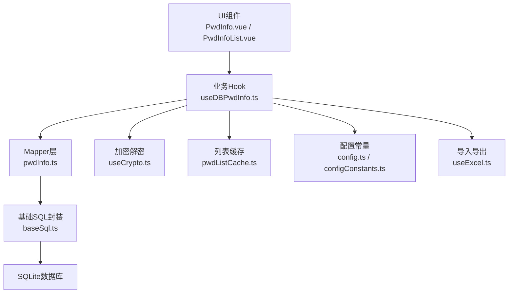
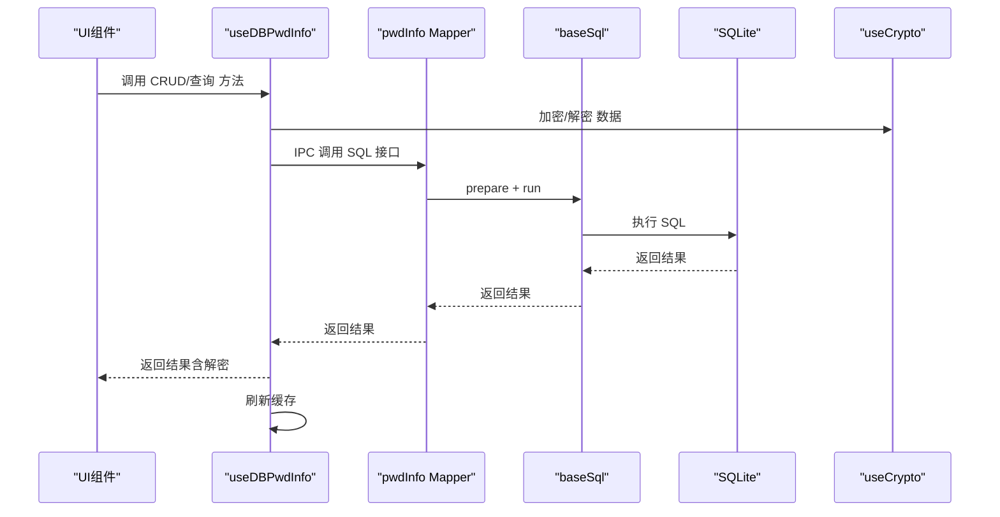
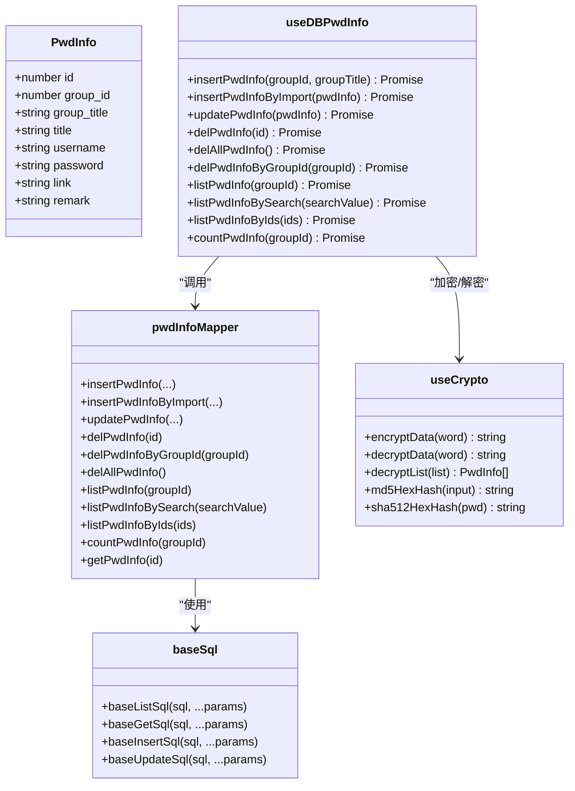
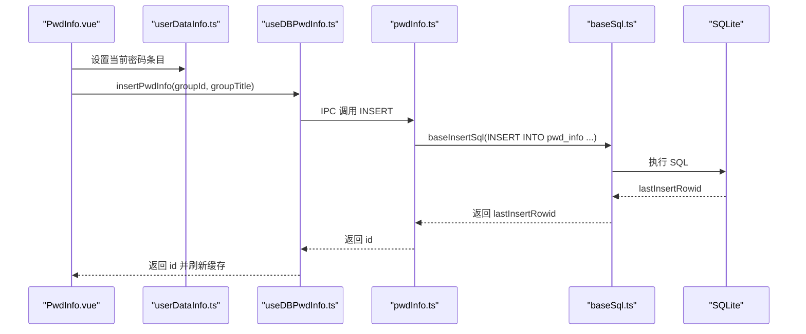
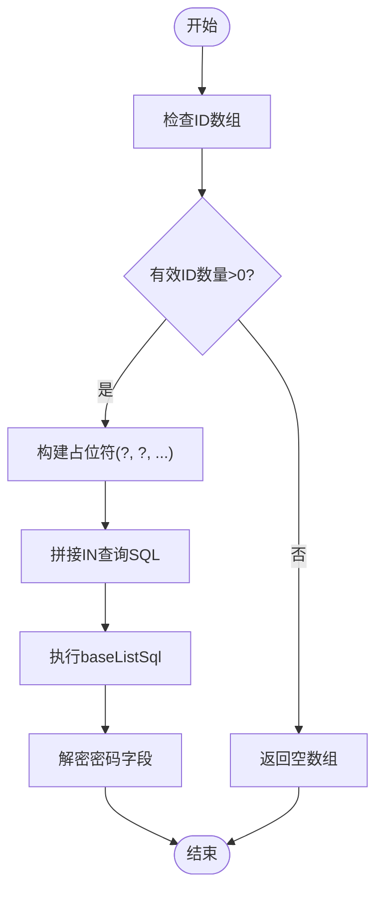
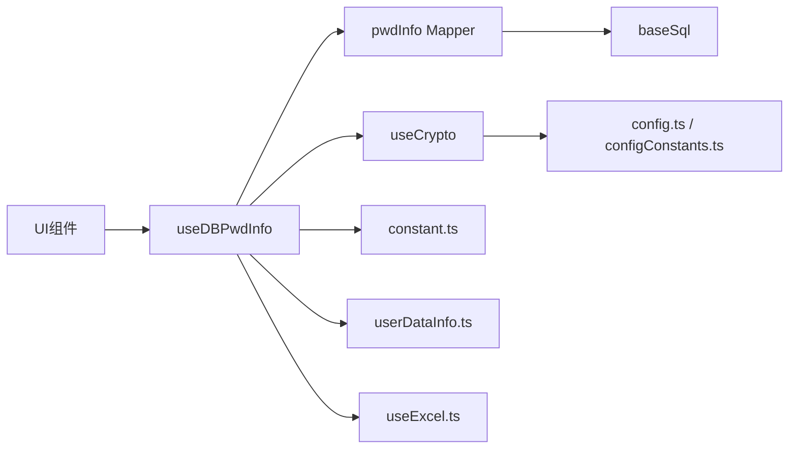

# 密码信息Mapper

<cite>
**本文引用的文件**
- [pwdInfo.ts](file://electron/db/sqlite/mapper/pwdInfo.ts)
- [useDBPwdInfo.ts](file://src/hooks/useDBPwdInfo.ts)
- [baseSql.ts](file://electron/db/sqlite/components/baseSql.ts)
- [initSql.ts](file://electron/db/sqlite/components/initSql.ts)
- [type.ts](file://src/components/type.ts)
- [useCrypto.ts](file://src/hooks/useCrypto.ts)
- [pwdListCache.ts](file://src/store/pwdListCache.ts)
- [constant.ts](file://electron/constant.ts)
- [PwdInfo.vue](file://src/components/indexview/PwdInfo.vue)
- [PwdInfoList.vue](file://src/components/indexview/PwdInfoList.vue)
- [useExcel.ts](file://src/hooks/useExcel.ts)
- [config.ts](file://src/config/config.ts)
- [configConstants.ts](file://electron/db/sqlite/components/configConstants.ts)
- [userDataInfo.ts](file://src/store/userDataInfo.ts)
- [useBrowser.ts](file://src/hooks/useBrowser.ts)
</cite>

## 目录
1. [简介](#简介)
2. [项目结构](#项目结构)
3. [核心组件](#核心组件)
4. [架构总览](#架构总览)
5. [详细组件分析](#详细组件分析)
6. [依赖关系分析](#依赖关系分析)
7. [性能考量](#性能考量)
8. [故障排查指南](#故障排查指南)
9. [结论](#结论)
10. [附录](#附录)

## 简介
本文件围绕“密码信息Mapper”进行系统化技术文档编写，目标包括：
- 解释PwdInfo数据模型与密码管理核心功能
- 详述密码信息的CRUD操作实现原理
- 记录密码字段的存储结构、加密处理与安全验证机制
- 提供密码添加、编辑、删除、复制等操作的代码示例路径
- 解释密码搜索、批量操作与导入导出功能的实现细节
- 包含密码强度验证、重复检测与安全提示等业务逻辑

## 项目结构
密码信息Mapper位于Electron主进程的SQLite数据库层，通过IPC桥接至渲染进程的业务Hook与UI组件。整体采用“数据模型定义 → Hook封装 → UI组件调用”的分层设计。

图表来源
- [PwdInfo.vue:1-257](file://src/components/indexview/PwdInfo.vue#L1-L257)
- [PwdInfoList.vue:1-260](file://src/components/indexview/PwdInfoList.vue#L1-L260)
- [useDBPwdInfo.ts:1-103](file://src/hooks/useDBPwdInfo.ts#L1-L103)
- [pwdInfo.ts:1-100](file://electron/db/sqlite/mapper/pwdInfo.ts#L1-L100)
- [baseSql.ts:1-87](file://electron/db/sqlite/components/baseSql.ts#L1-L87)
- [useCrypto.ts:1-77](file://src/hooks/useCrypto.ts#L1-L77)
- [pwdListCache.ts:1-37](file://src/store/pwdListCache.ts#L1-L37)
- [config.ts:1-143](file://src/config/config.ts#L1-L143)
- [configConstants.ts:1-29](file://electron/db/sqlite/components/configConstants.ts#L1-L29)
- [useExcel.ts:1-109](file://src/hooks/useExcel.ts#L1-L109)

章节来源
- [pwdInfo.ts:1-100](file://electron/db/sqlite/mapper/pwdInfo.ts#L1-L100)
- [useDBPwdInfo.ts:1-103](file://src/hooks/useDBPwdInfo.ts#L1-L103)
- [baseSql.ts:1-87](file://electron/db/sqlite/components/baseSql.ts#L1-L87)
- [initSql.ts:48-105](file://electron/db/sqlite/components/initSql.ts#L48-L105)
- [type.ts:50-67](file://src/components/type.ts#L50-L67)

## 核心组件
- 数据模型PwdInfo：定义密码条目字段，包括分组标识、标题、用户名、密码、链接与备注等。
- Mapper层pwdInfo.ts：封装SQLite的CRUD与查询接口，提供按分组、按ID集合、按关键词搜索、计数等能力。
- Hook层useDBPwdInfo.ts：通过IPC调用Mapper接口，统一处理加密/解密与缓存刷新。
- 基础SQL封装baseSql.ts：提供通用的prepare/run/transaction封装，确保SQL执行一致性与错误处理。
- 加密模块useCrypto.ts：提供AES对称加密、Base64编码、MD5/SHA512哈希等工具，用于密码字段的存储安全与登录校验。
- 缓存模块pwdListCache.ts：维护轻量级列表缓存，减少频繁解密开销。
- 配置常量config.ts与configConstants.ts：集中管理加密密钥、盐值、默认密码、IPC通道名等。
- 导入导出useExcel.ts：基于XLSX实现Excel导入/导出，支持模板下载与分组映射。
- UI组件：PwdInfo.vue与PwdInfoList.vue负责用户交互、复制、打开链接、新增/删除等操作。

章节来源
- [type.ts:50-67](file://src/components/type.ts#L50-L67)
- [pwdInfo.ts:6-100](file://electron/db/sqlite/mapper/pwdInfo.ts#L6-L100)
- [useDBPwdInfo.ts:17-103](file://src/hooks/useDBPwdInfo.ts#L17-L103)
- [baseSql.ts:9-81](file://electron/db/sqlite/components/baseSql.ts#L9-L81)
- [useCrypto.ts:41-76](file://src/hooks/useCrypto.ts#L41-L76)
- [pwdListCache.ts:6-37](file://src/store/pwdListCache.ts#L6-L37)
- [config.ts:14-22](file://src/config/config.ts#L14-L22)
- [configConstants.ts:3-28](file://electron/db/sqlite/components/configConstants.ts#L3-L28)
- [useExcel.ts:22-84](file://src/hooks/useExcel.ts#L22-L84)
- [PwdInfo.vue:32-78](file://src/components/indexview/PwdInfo.vue#L32-L78)
- [PwdInfoList.vue:87-139](file://src/components/indexview/PwdInfoList.vue#L87-L139)

## 架构总览
密码信息Mapper采用“渲染进程 → IPC → 主进程Mapper → SQLite”的调用链路，结合加密模块与缓存模块，形成完整的数据生命周期。

图表来源
- [useDBPwdInfo.ts:21-70](file://src/hooks/useDBPwdInfo.ts#L21-L70)
- [pwdInfo.ts:6-100](file://electron/db/sqlite/mapper/pwdInfo.ts#L6-L100)
- [baseSql.ts:9-81](file://electron/db/sqlite/components/baseSql.ts#L9-L81)
- [useCrypto.ts:41-76](file://src/hooks/useCrypto.ts#L41-L76)

## 详细组件分析

### 数据模型与存储结构
- PwdInfo接口定义了密码条目的完整字段，包括分组标识、标题、用户名、密码、链接与备注。
- SQLite表pwd_info包含自增主键id、分组id/group_title、title、username、password、link、remark等列。
- 默认数据初始化时插入一条演示数据，便于首次使用体验。

章节来源
- [type.ts:50-67](file://src/components/type.ts#L50-L67)
- [initSql.ts:60-71](file://electron/db/sqlite/components/initSql.ts#L60-L71)
- [initSql.ts:217-224](file://electron/db/sqlite/components/initSql.ts#L217-L224)

### CRUD实现原理
- 新增：insertPwdInfo与insertPwdInfoByImport分别面向交互新增与导入新增；前者仅传入分组信息，后者传入完整PwdInfo字段并在入库前加密密码。
- 更新：updatePwdInfo根据id更新整行，若提供新密码则先加密再写入。
- 删除：delPwdInfo按id删除；delPwdInfoByGroupId按分组删除；delAllPwdInfo清空表。
- 查询：listPwdInfo按分组列出；listPwdInfoBySearch按标题或用户名模糊匹配；listPwdInfoByIds支持批量ID查询；countPwdInfo统计分组内数量；getPwdInfo按id获取单条记录。

章节来源
- [pwdInfo.ts:6-100](file://electron/db/sqlite/mapper/pwdInfo.ts#L6-L100)

### 加密处理与安全验证
- 加密算法：AES-CBC模式，密钥与IV来自配置常量，密码字段以Base64形式存储。
- 登录校验：SHA512哈希用于登录密码比对，盐值来自配置常量。
- 渲染层解密：useDBPwdInfo在返回列表前统一解密，确保UI显示明文密码。
- 缓存策略：pwdListCache仅缓存轻量字段，避免敏感信息驻留内存。

章节来源
- [useCrypto.ts:41-76](file://src/hooks/useCrypto.ts#L41-L76)
- [useDBPwdInfo.ts:28-70](file://src/hooks/useDBPwdInfo.ts#L28-L70)
- [pwdListCache.ts:15-33](file://src/store/pwdListCache.ts#L15-L33)
- [config.ts:14-22](file://src/config/config.ts#L14-L22)
- [configConstants.ts:5-6](file://electron/db/sqlite/components/configConstants.ts#L5-L6)

### 搜索、批量与导入导出
- 搜索：listPwdInfoBySearch基于标题与用户名的模糊匹配，返回解密后的PwdInfo列表。
- 批量：listPwdInfoByIds支持传入多个ID，构建IN子句进行批量查询。
- 导入：useExcel读取Excel首表，逐行映射为PwdInfo对象；若分组不存在则自动创建；导入时按分组标题查询或创建分组后再入库。
- 导出：useExcel将当前全部密码数据导出为Excel，包含分组标题、标题、用户名、密码、链接、备注等列。

章节来源
- [pwdInfo.ts:62-83](file://electron/db/sqlite/mapper/pwdInfo.ts#L62-L83)
- [useExcel.ts:22-84](file://src/hooks/useExcel.ts#L22-L84)

### 业务逻辑与UI交互
- 添加/编辑：PwdInfo.vue在输入变更时触发保存，若无id则先新增再更新，同时触发标题更新事件与同步到云端。
- 删除：PwdInfoList.vue提供删除确认对话框，删除后刷新列表并重置当前选中项。
- 复制：PwdInfo.vue支持复制用户名、密码、链接；PwdInfoList.vue支持拖拽移动（配合其他模块）。
- 打开链接：PwdInfo.vue通过useBrowser打开浏览器访问链接。

章节来源
- [PwdInfo.vue:32-78](file://src/components/indexview/PwdInfo.vue#L32-L78)
- [PwdInfoList.vue:87-139](file://src/components/indexview/PwdInfoList.vue#L87-L139)
- [useBrowser.ts:5-10](file://src/hooks/useBrowser.ts#L5-L10)

### 类图：密码信息相关类与关系

图表来源
- [type.ts:50-67](file://src/components/type.ts#L50-L67)
- [useDBPwdInfo.ts:17-103](file://src/hooks/useDBPwdInfo.ts#L17-L103)
- [pwdInfo.ts:6-100](file://electron/db/sqlite/mapper/pwdInfo.ts#L6-L100)
- [useCrypto.ts:41-76](file://src/hooks/useCrypto.ts#L41-L76)
- [baseSql.ts:9-81](file://electron/db/sqlite/components/baseSql.ts#L9-L81)

### 序列图：新增密码流程

图表来源
- [PwdInfo.vue:32-53](file://src/components/indexview/PwdInfo.vue#L32-L53)
- [useDBPwdInfo.ts:21-26](file://src/hooks/useDBPwdInfo.ts#L21-L26)
- [pwdInfo.ts:6-10](file://electron/db/sqlite/mapper/pwdInfo.ts#L6-L10)
- [baseSql.ts:35-49](file://electron/db/sqlite/components/baseSql.ts#L35-L49)

### 流程图：按ID集合查询

图表来源
- [pwdInfo.ts:71-83](file://electron/db/sqlite/mapper/pwdInfo.ts#L71-L83)
- [baseSql.ts:9-20](file://electron/db/sqlite/components/baseSql.ts#L9-L20)
- [useDBPwdInfo.ts:78-82](file://src/hooks/useDBPwdInfo.ts#L78-L82)

## 依赖关系分析
- 组件耦合
  - useDBPwdInfo高度依赖useCrypto进行加解密，且依赖IPC通道常量constant.ts进行主进程通信。
  - pwdInfo.ts依赖baseSql.ts进行SQL执行，initSql.ts负责表结构初始化。
  - UI组件依赖Pinia状态管理（userDataInfo.ts）与事件总线（emitter.ts）。
- 外部依赖
  - 加密：crypto-js
  - 导入导出：xlsx
  - UI框架：Element Plus
- 循环依赖
  - 未发现直接循环依赖；各层职责清晰，通过Hook与IPC解耦。

图表来源
- [useDBPwdInfo.ts:13-14](file://src/hooks/useDBPwdInfo.ts#L13-L14)
- [constant.ts:31-41](file://electron/constant.ts#L31-L41)
- [useCrypto.ts:1-3](file://src/hooks/useCrypto.ts#L1-L3)
- [config.ts:14-22](file://src/config/config.ts#L14-L22)
- [configConstants.ts:1-2](file://electron/db/sqlite/components/configConstants.ts#L1-L2)

章节来源
- [constant.ts:31-41](file://electron/constant.ts#L31-L41)
- [useDBPwdInfo.ts:13-14](file://src/hooks/useDBPwdInfo.ts#L13-L14)
- [useCrypto.ts:1-3](file://src/hooks/useCrypto.ts#L1-L3)
- [config.ts:14-22](file://src/config/config.ts#L14-L22)
- [configConstants.ts:1-2](file://electron/db/sqlite/components/configConstants.ts#L1-L2)

## 性能考量
- 批量查询：listPwdInfoByIds通过IN子句一次性查询，避免多次往返。
- 缓存策略：pwdListCache仅缓存轻量字段，降低解密频率；每次CRUD后主动刷新缓存。
- 加密成本：AES加密/解密在渲染层进行，建议在高频场景下减少不必要的重复解密。
- 模糊搜索：listPwdInfoBySearch使用like，建议在大数据量时考虑索引或分页。

## 故障排查指南
- 新增失败
  - 检查IPC通道是否正确注册与调用。
  - 查看baseSql错误日志，确认SQL语法与参数绑定。
- 更新异常
  - 确认传入的id存在且类型正确。
  - 若密码为空，注意更新逻辑不会覆盖已加密字段。
- 查询为空
  - 确认分组id有效；检查listPwdInfoBySearch的输入是否为空。
- 解密异常
  - 核对aesKey/aesIv是否与初始化一致。
  - 确认数据库中密码字段为Base64编码。
- 导入失败
  - 检查Excel列名与映射字符串是否一致。
  - 确认分组标题映射与数据库中分组存在性。

章节来源
- [baseSql.ts:12-31](file://electron/db/sqlite/components/baseSql.ts#L12-L31)
- [pwdInfo.ts:62-69](file://electron/db/sqlite/mapper/pwdInfo.ts#L62-L69)
- [useDBPwdInfo.ts:55-62](file://src/hooks/useDBPwdInfo.ts#L55-L62)
- [useExcel.ts:44-84](file://src/hooks/useExcel.ts#L44-L84)

## 结论
密码信息Mapper通过清晰的分层设计与严格的加密策略，实现了从UI到数据库的完整闭环。其CRUD、搜索、批量与导入导出能力满足日常密码管理需求；结合缓存与事件机制，兼顾了易用性与性能。后续可在搜索索引、批量操作并发控制与更细粒度的权限控制方面进一步优化。

## 附录

### 常用操作示例（代码路径）
- 新增密码条目
  - [PwdInfo.vue:32-53](file://src/components/indexview/PwdInfo.vue#L32-L53)
  - [useDBPwdInfo.ts:21-26](file://src/hooks/useDBPwdInfo.ts#L21-L26)
  - [pwdInfo.ts:6-10](file://electron/db/sqlite/mapper/pwdInfo.ts#L6-L10)
- 编辑密码条目
  - [PwdInfo.vue:32-53](file://src/components/indexview/PwdInfo.vue#L32-L53)
  - [useDBPwdInfo.ts:55-62](file://src/hooks/useDBPwdInfo.ts#L55-L62)
  - [pwdInfo.ts:37-48](file://electron/db/sqlite/mapper/pwdInfo.ts#L37-L48)
- 删除密码条目
  - [PwdInfoList.vue:105-139](file://src/components/indexview/PwdInfoList.vue#L105-L139)
  - [useDBPwdInfo.ts:35-47](file://src/hooks/useDBPwdInfo.ts#L35-L47)
  - [pwdInfo.ts:18-35](file://electron/db/sqlite/mapper/pwdInfo.ts#L18-L35)
- 复制用户名/密码/链接
  - [PwdInfo.vue:65-78](file://src/components/indexview/PwdInfo.vue#L65-L78)
- 按关键词搜索
  - [useDBPwdInfo.ts:72-76](file://src/hooks/useDBPwdInfo.ts#L72-L76)
  - [pwdInfo.ts:62-69](file://electron/db/sqlite/mapper/pwdInfo.ts#L62-L69)
- 按ID集合批量查询
  - [useDBPwdInfo.ts:78-82](file://src/hooks/useDBPwdInfo.ts#L78-L82)
  - [pwdInfo.ts:71-83](file://electron/db/sqlite/mapper/pwdInfo.ts#L71-L83)
- 导入/导出
  - [useExcel.ts:22-84](file://src/hooks/useExcel.ts#L22-L84)