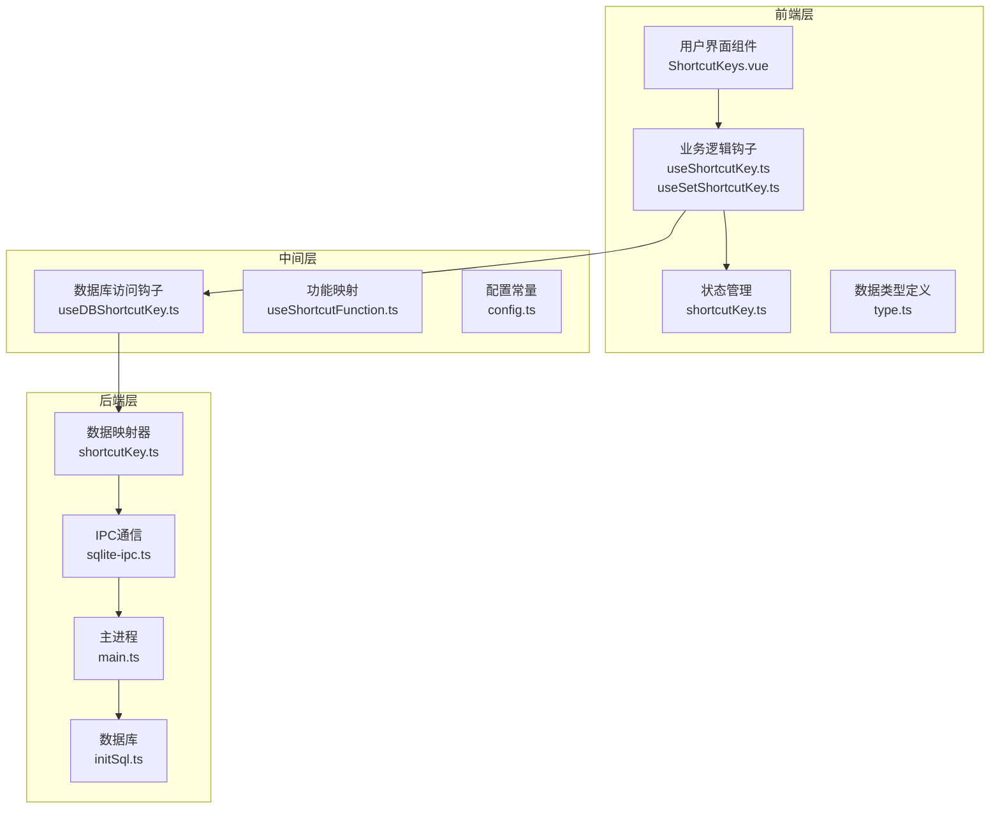
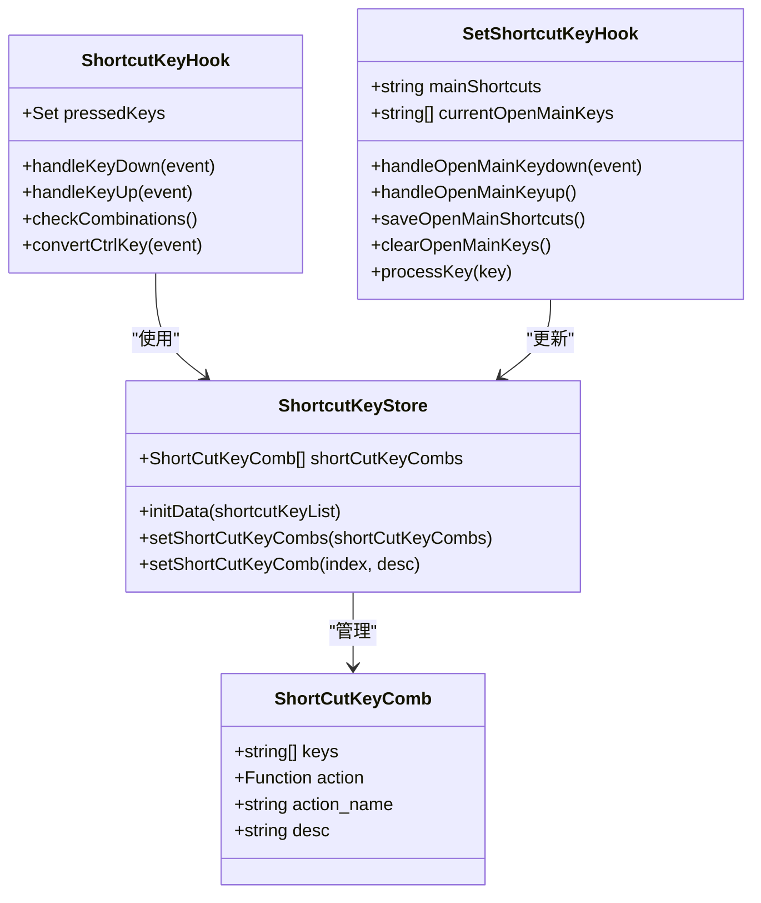
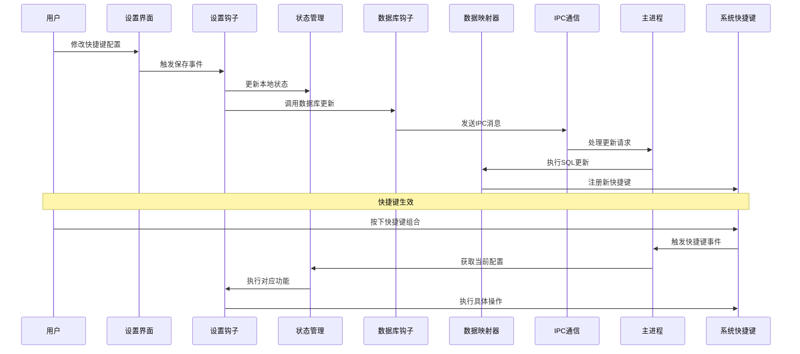
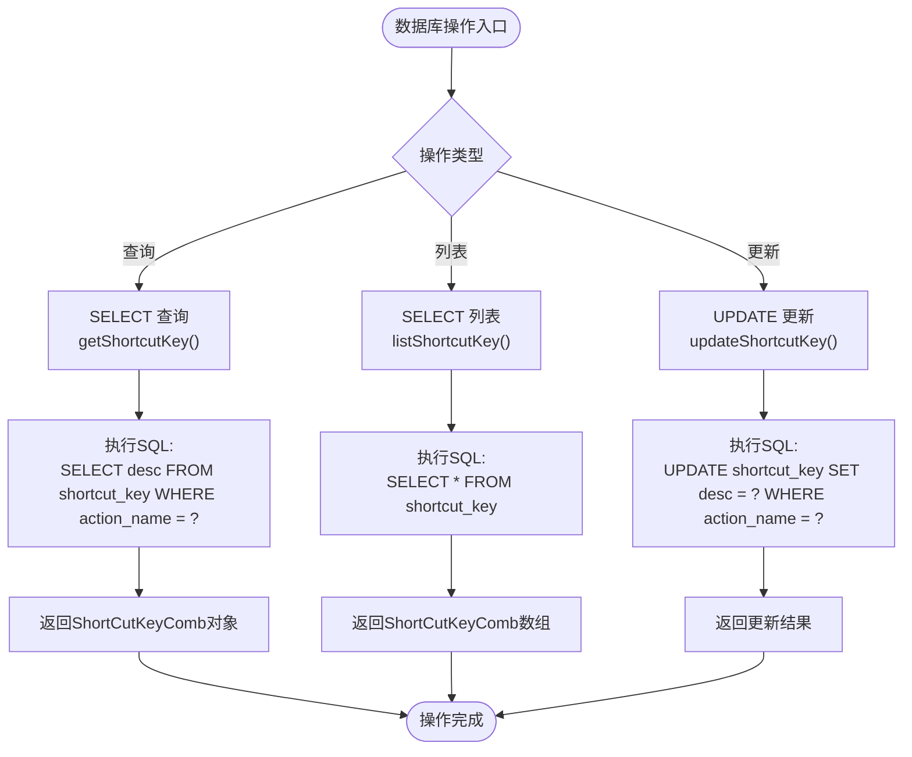
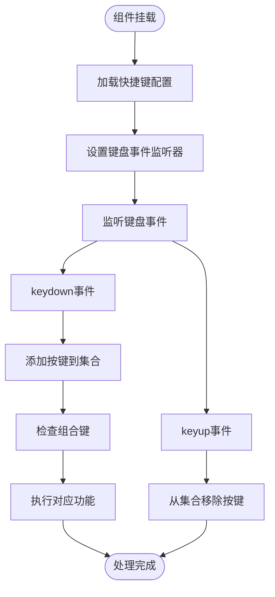
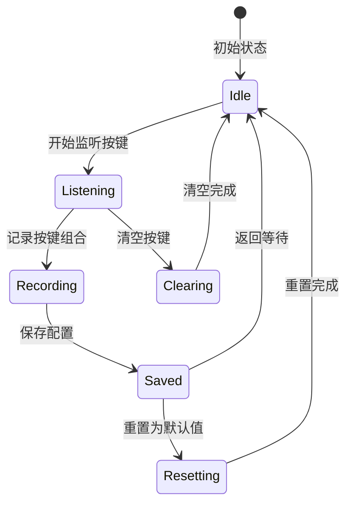
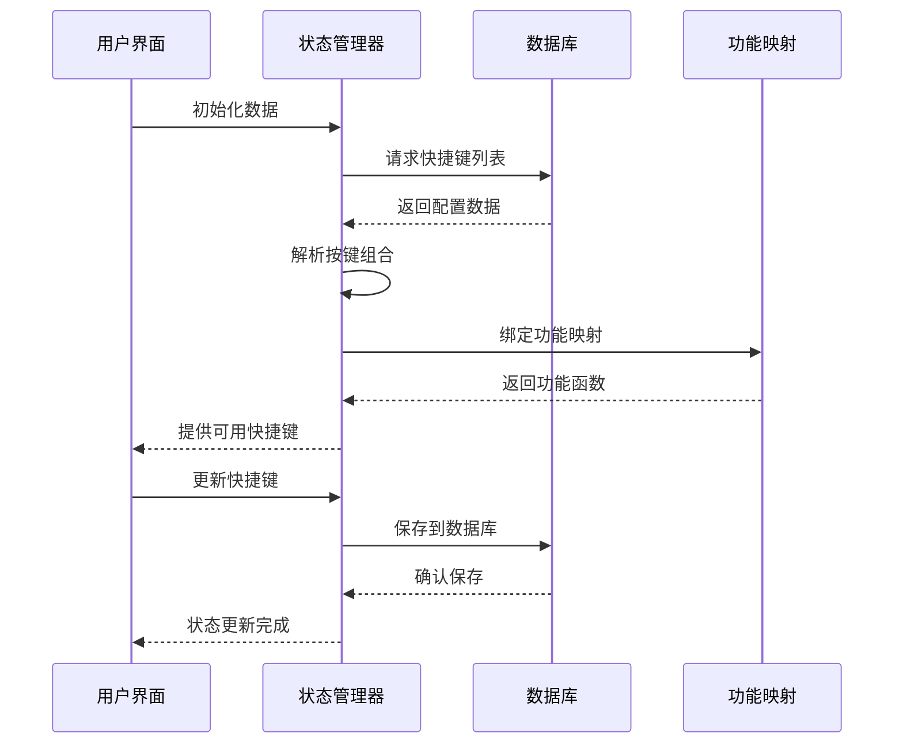
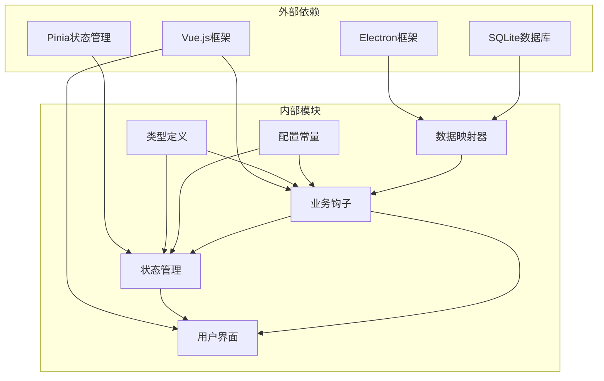

# 快捷键配置Mapper

<cite>
**本文档引用的文件**
- [shortcutKey.ts](file://electron/db/sqlite/mapper/shortcutKey.ts)
- [useDBShortcutKey.ts](file://src/hooks/useDBShortcutKey.ts)
- [shortcutKey.ts](file://src/store/shortcutKey.ts)
- [useShortcutKey.ts](file://src/hooks/useShortcutKey.ts)
- [useSetShortcutKey.ts](file://src/hooks/useSetShortcutKey.ts)
- [type.ts](file://src/components/type.ts)
- [config.ts](file://src/config/config.ts)
- [useShortcutFunction.ts](file://src/hooks/useShortcutFunction.ts)
- [configConstants.ts](file://electron/db/sqlite/components/configConstants.ts)
- [ShortcutKeys.vue](file://src/components/setview/ShortcutKeys.vue)
- [constant.ts](file://electron/constant.ts)
- [main.ts](file://electron/main.ts)
- [initSql.ts](file://electron/db/sqlite/components/initSql.ts)
- [sqlite-ipc.ts](file://electron/db/sqlite/sqlite-ipc.ts)
</cite>

## 目录
1. [简介](#简介)
2. [项目结构](#项目结构)
3. [核心组件](#核心组件)
4. [架构概览](#架构概览)
5. [详细组件分析](#详细组件分析)
6. [依赖关系分析](#依赖关系分析)
7. [性能考虑](#性能考虑)
8. [故障排除指南](#故障排除指南)
9. [结论](#结论)

## 简介

本文件详细介绍了密码管理器项目中的快捷键配置Mapper系统。该系统实现了全局快捷键管理、快捷键配置的持久化存储、快捷键注册与注销机制，以及快捷键与系统功能的深度集成。系统采用前后端分离的架构设计，前端负责用户界面交互和快捷键监听，后端负责数据库管理和系统级快捷键注册。

## 项目结构

快捷键配置系统主要分布在以下三个层次：

**图表来源**
- [ShortcutKeys.vue:1-225](file://src/components/setview/ShortcutKeys.vue#L1-L225)
- [useShortcutKey.ts:1-64](file://src/hooks/useShortcutKey.ts#L1-L64)
- [useSetShortcutKey.ts:1-481](file://src/hooks/useSetShortcutKey.ts#L1-L481)
- [shortcutKey.ts:1-99](file://src/store/shortcutKey.ts#L1-L99)

**章节来源**
- [ShortcutKeys.vue:1-225](file://src/components/setview/ShortcutKeys.vue#L1-L225)
- [useShortcutKey.ts:1-64](file://src/hooks/useShortcutKey.ts#L1-L64)
- [useSetShortcutKey.ts:1-481](file://src/hooks/useSetShortcutKey.ts#L1-L481)
- [shortcutKey.ts:1-99](file://src/store/shortcutKey.ts#L1-L99)

## 核心组件

### 数据模型定义

快捷键系统的核心数据模型基于`ShortCutKeyComb`接口，该模型定义了快捷键的完整结构：

**图表来源**
- [type.ts:19-29](file://src/components/type.ts#L19-L29)
- [shortcutKey.ts:16-99](file://src/store/shortcutKey.ts#L16-L99)
- [useShortcutKey.ts:9-64](file://src/hooks/useShortcutKey.ts#L9-L64)
- [useSetShortcutKey.ts:28-481](file://src/hooks/useSetShortcutKey.ts#L28-L481)

### 默认快捷键配置

系统预设了九个核心快捷键，覆盖了主要的功能操作：

| 功能名称 | 默认快捷键 | 动作标识符 | 描述 |
|---------|-----------|-----------|------|
| 打开主面板 | Ctrl + Alt + E | openMainWindows | 显示主应用程序窗口 |
| 退出登录 | Escape | logout | 触发用户登出事件 |
| 复制账号 | Ctrl + U | copyUsername | 复制当前密码条目的用户名 |
| 复制密码 | Ctrl + P | copyPwd | 复制当前密码条目的密码 |
| 复制链接 | Ctrl + L | copyLink | 复制当前密码条目的链接 |
| 新增分组 | Ctrl + G | insertGroup | 添加新的密码分组 |
| 新增密码 | Ctrl + N | insertPwdInfo | 添加新的密码条目 |
| 本地同步至远程 | Ctrl + Shift + K | syncLocalToOss | 将本地数据同步到云端 |
| 远程同步至本地 | F5 | syncOssToLocal | 从云端同步数据到本地 |

**章节来源**
- [config.ts:24-34](file://src/config/config.ts#L24-L34)
- [shortcutKey.ts:42-96](file://src/store/shortcutKey.ts#L42-L96)

## 架构概览

快捷键系统采用分层架构设计，实现了清晰的关注点分离：

**图表来源**
- [useSetShortcutKey.ts:400-417](file://src/hooks/useSetShortcutKey.ts#L400-L417)
- [sqlite-ipc.ts:207-217](file://electron/db/sqlite/sqlite-ipc.ts#L207-L217)
- [main.ts:149-152](file://electron/main.ts#L149-L152)

**章节来源**
- [useSetShortcutKey.ts:1-481](file://src/hooks/useSetShortcutKey.ts#L1-L481)
- [sqlite-ipc.ts:1-220](file://electron/db/sqlite/sqlite-ipc.ts#L1-L220)
- [main.ts:1-200](file://electron/main.ts#L1-L200)

## 详细组件分析

### 数据库映射器层

数据库映射器负责与SQLite数据库的直接交互，提供了快捷键配置的CRUD操作：

#### CRUD操作实现

**图表来源**
- [shortcutKey.ts:8-25](file://electron/db/sqlite/mapper/shortcutKey.ts#L8-L25)

#### 数据库表结构

快捷键配置存储在SQLite数据库的`shortcut_key`表中，具有以下结构：

| 字段名 | 类型 | 约束 | 描述 |
|--------|------|------|------|
| id | integer | PRIMARY KEY | 主键标识符 |
| action_name | TEXT | NOT NULL | 功能标识符 |
| desc | TEXT |  | 快捷键描述字符串 |

**章节来源**
- [shortcutKey.ts:1-32](file://electron/db/sqlite/mapper/shortcutKey.ts#L1-L32)
- [initSql.ts:83-89](file://electron/db/sqlite/components/initSql.ts#L83-L89)

### 前端业务逻辑层

前端层包含多个钩子函数，负责处理用户交互和业务逻辑：

#### 快捷键监听钩子

`useShortcutKey`钩子实现了全局快捷键的实时监听和处理：

**图表来源**
- [useShortcutKey.ts:15-60](file://src/hooks/useShortcutKey.ts#L15-L60)

#### 快捷键设置钩子

`useSetShortcutKey`钩子提供了完整的快捷键配置界面逻辑：

**图表来源**
- [useSetShortcutKey.ts:76-109](file://src/hooks/useSetShortcutKey.ts#L76-L109)

**章节来源**
- [useShortcutKey.ts:1-64](file://src/hooks/useShortcutKey.ts#L1-L64)
- [useSetShortcutKey.ts:1-481](file://src/hooks/useSetShortcutKey.ts#L1-L481)

### 状态管理层

Pinia状态管理器负责维护快捷键配置的全局状态：

#### 状态管理流程

**图表来源**
- [shortcutKey.ts:19-38](file://src/store/shortcutKey.ts#L19-L38)

**章节来源**
- [shortcutKey.ts:1-99](file://src/store/shortcutKey.ts#L1-L99)

### 系统集成功能

#### 全局快捷键注册

系统通过Electron的全局快捷键功能实现跨应用的快捷键响应：

**图表来源**
- [main.ts:54-54](file://electron/main.ts#L54-L54)
- [main.ts:149-152](file://electron/main.ts#L149-L152)

**章节来源**
- [main.ts:1-200](file://electron/main.ts#L1-L200)

## 依赖关系分析

快捷键系统各组件之间的依赖关系如下：

**图表来源**
- [type.ts:1-88](file://src/components/type.ts#L1-L88)
- [config.ts:1-143](file://src/config/config.ts#L1-L143)
- [shortcutKey.ts:1-32](file://electron/db/sqlite/mapper/shortcutKey.ts#L1-L32)

**章节来源**
- [type.ts:1-88](file://src/components/type.ts#L1-L88)
- [config.ts:1-143](file://src/config/config.ts#L1-L143)

## 性能考虑

### 内存管理

- **按键集合优化**: 使用Set数据结构存储当前按下的按键，提供O(1)的查找性能
- **事件监听器管理**: 在组件卸载时正确移除事件监听器，防止内存泄漏
- **状态缓存**: Pinia状态管理器提供响应式状态缓存，减少重复计算

### 数据访问优化

- **批量操作**: 数据库操作采用批量处理，减少I/O操作次数
- **查询优化**: 使用参数化查询防止SQL注入，提高查询安全性
- **连接池管理**: 数据库连接采用单例模式，避免频繁创建连接

### 用户体验优化

- **实时反馈**: 快捷键设置界面提供即时的按键组合反馈
- **错误处理**: 完善的错误处理机制，确保用户操作的可靠性
- **性能监控**: 关键操作添加性能日志，便于问题诊断

## 故障排除指南

### 常见问题及解决方案

#### 快捷键不生效

**可能原因**:
1. 权限不足导致全局快捷键注册失败
2. 快捷键组合与其他应用冲突
3. 数据库连接异常

**解决步骤**:
1. 检查应用权限设置
2. 更换快捷键组合避免冲突
3. 重启应用重新注册快捷键

#### 快捷键配置丢失

**可能原因**:
1. 数据库文件损坏
2. 应用程序异常退出
3. 文件权限问题

**恢复方法**:
1. 重置快捷键到默认值
2. 检查数据库文件完整性
3. 重新安装应用程序

#### 快捷键监听失效

**排查步骤**:
1. 检查键盘事件监听器是否正常工作
2. 验证按键组合解析逻辑
3. 确认功能映射表完整性

**章节来源**
- [useShortcutKey.ts:24-28](file://src/hooks/useShortcutKey.ts#L24-L28)
- [sqlite-ipc.ts:207-217](file://electron/db/sqlite/sqlite-ipc.ts#L207-L217)

## 结论

快捷键配置Mapper系统通过精心设计的分层架构，实现了高效、可靠的全局快捷键管理功能。系统具备以下特点：

1. **模块化设计**: 各组件职责明确，便于维护和扩展
2. **数据持久化**: 采用SQLite数据库确保配置的可靠存储
3. **系统集成**: 深度集成Electron全局快捷键功能
4. **用户体验**: 提供直观的配置界面和实时反馈
5. **性能优化**: 采用多种优化策略确保系统响应速度

该系统为密码管理器提供了灵活的快捷键定制能力，用户可以根据个人习惯调整快捷键组合，提升使用效率。同时，系统的模块化设计也为未来的功能扩展奠定了良好的基础。