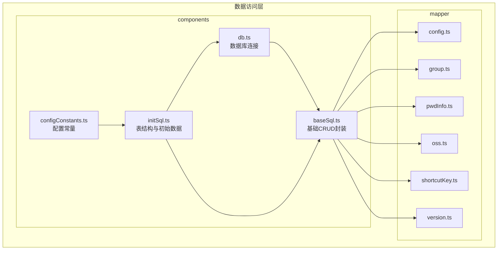
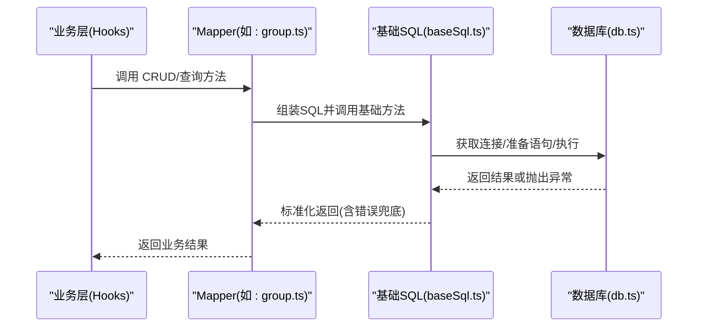
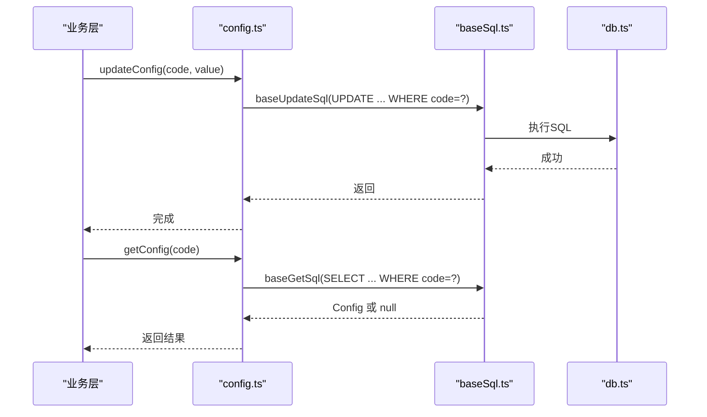
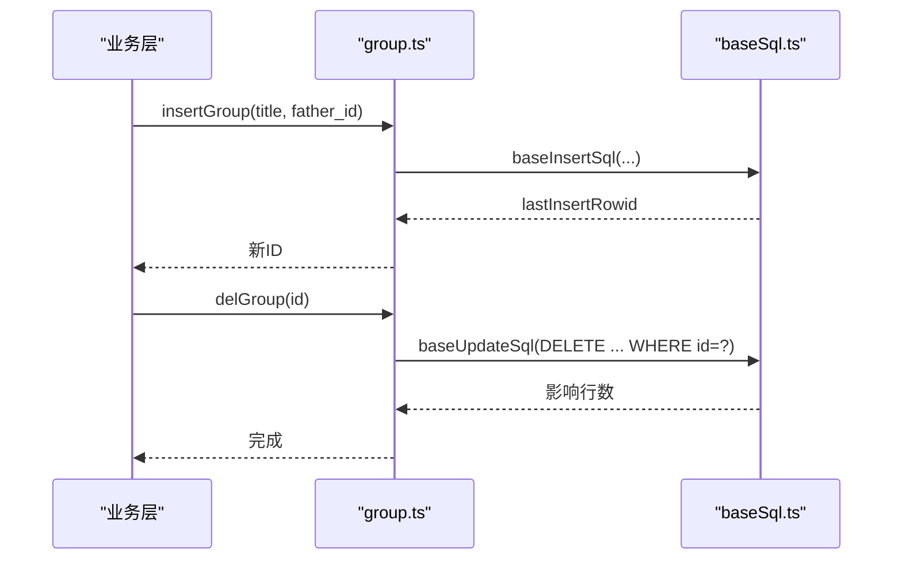
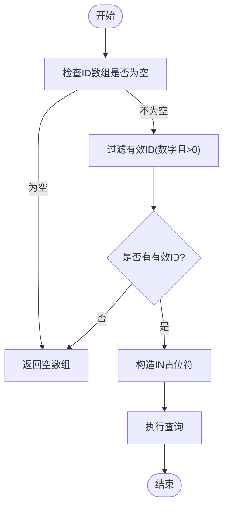
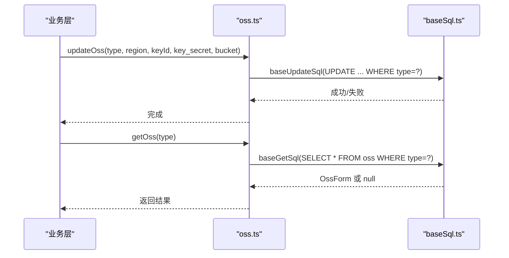
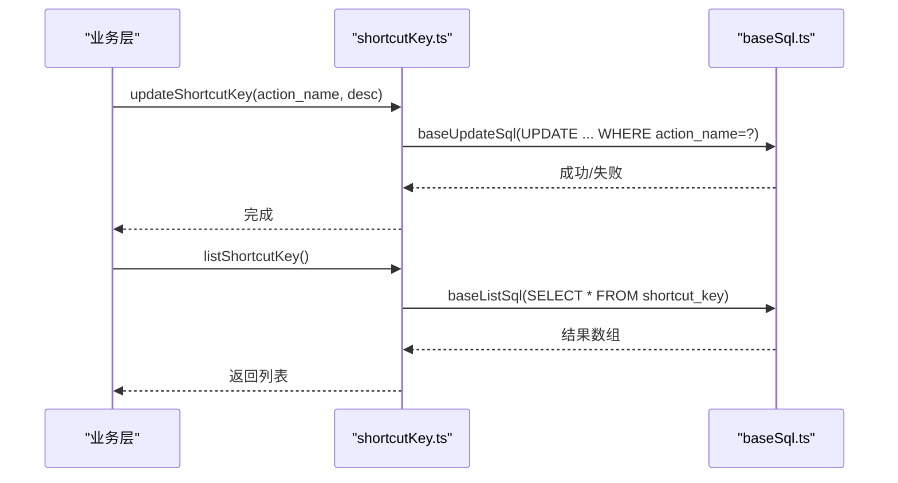
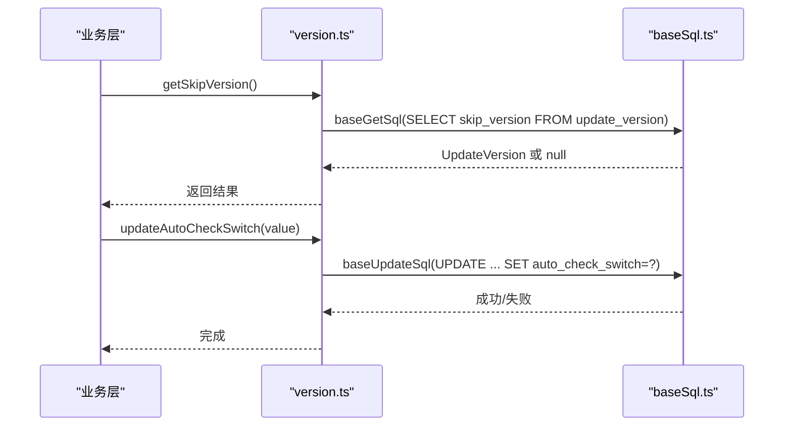
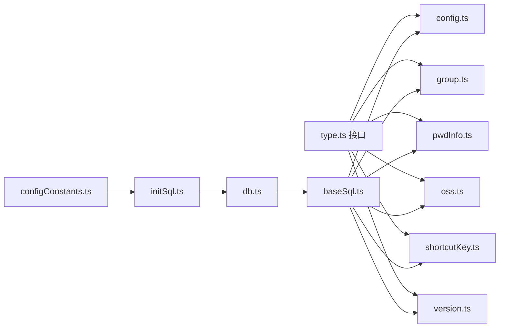

# 数据访问层

<cite>
**本文引用的文件**
- [config.ts](file://electron/db/sqlite/mapper/config.ts)
- [group.ts](file://electron/db/sqlite/mapper/group.ts)
- [pwdInfo.ts](file://electron/db/sqlite/mapper/pwdInfo.ts)
- [oss.ts](file://electron/db/sqlite/mapper/oss.ts)
- [shortcutKey.ts](file://electron/db/sqlite/mapper/shortcutKey.ts)
- [version.ts](file://electron/db/sqlite/mapper/version.ts)
- [baseSql.ts](file://electron/db/sqlite/components/baseSql.ts)
- [initSql.ts](file://electron/db/sqlite/components/initSql.ts)
- [db.ts](file://electron/db/sqlite/components/db.ts)
- [configConstants.ts](file://electron/db/sqlite/components/configConstants.ts)
- [type.ts](file://src/components/type.ts)
</cite>

## 目录
1. [简介](#简介)
2. [项目结构](#项目结构)
3. [核心组件](#核心组件)
4. [架构总览](#架构总览)
5. [详细组件分析](#详细组件分析)
6. [依赖关系分析](#依赖关系分析)
7. [性能考量](#性能考量)
8. [故障排查指南](#故障排查指南)
9. [结论](#结论)
10. [附录](#附录)

## 简介
本文件系统性梳理 Electron 端 SQLite 数据访问层（Mapper 层）的设计与实现，重点覆盖以下方面：
- Mapper 模式的设计理念：以“职责单一”的数据访问对象封装 CRUD 与业务查询，统一通过基础 SQL 组件执行，降低上层耦合。
- 各个 Mapper 的具体职责与业务逻辑封装：config、group、pwdInfo、oss、shortcutKey、version。
- CRUD 操作、业务验证与数据转换的实现细节与边界条件。
- 数据访问层与业务逻辑层（Hooks）的交互方式与错误处理机制。
- 提供可复用的使用模式与调用路径参考。

## 项目结构
数据访问层位于 electron/db/sqlite 目录下，采用“组件 + Mapper”分层：
- components：数据库连接、初始化、基础 SQL 执行工具
- mapper：按领域模型划分的访问对象，每个文件对应一张表或一组相关表的操作

图表来源
- [db.ts:1-30](file://electron/db/sqlite/components/db.ts#L1-L30)
- [baseSql.ts:1-87](file://electron/db/sqlite/components/baseSql.ts#L1-L87)
- [initSql.ts:1-224](file://electron/db/sqlite/components/initSql.ts#L1-L224)
- [configConstants.ts:1-29](file://electron/db/sqlite/components/configConstants.ts#L1-L29)
- [config.ts:1-27](file://electron/db/sqlite/mapper/config.ts#L1-L27)
- [group.ts:1-49](file://electron/db/sqlite/mapper/group.ts#L1-L49)
- [pwdInfo.ts:1-100](file://electron/db/sqlite/mapper/pwdInfo.ts#L1-L100)
- [oss.ts:1-30](file://electron/db/sqlite/mapper/oss.ts#L1-L30)
- [shortcutKey.ts:1-32](file://electron/db/sqlite/mapper/shortcutKey.ts#L1-L32)
- [version.ts:1-38](file://electron/db/sqlite/mapper/version.ts#L1-L38)

章节来源
- [db.ts:1-30](file://electron/db/sqlite/components/db.ts#L1-L30)
- [baseSql.ts:1-87](file://electron/db/sqlite/components/baseSql.ts#L1-L87)
- [initSql.ts:1-224](file://electron/db/sqlite/components/initSql.ts#L1-L224)
- [configConstants.ts:1-29](file://electron/db/sqlite/components/configConstants.ts#L1-L29)

## 核心组件
- 数据库连接与生命周期管理：负责在用户数据目录创建本地 SQLite 文件，并提供单例连接；提供关闭接口。
- 基础 SQL 封装：提供通用的查询、插入、更新、列表、计数等方法，内置异常捕获与返回约定。
- 初始化流程：检测表是否存在，不存在则创建表结构并写入默认数据；单独维护“版本控制表”。
- 领域 Mapper：围绕 config、group、pwd_info、oss、shortcut_key、update_version 六类实体提供 CRUD 与业务查询。

章节来源
- [db.ts:1-30](file://electron/db/sqlite/components/db.ts#L1-L30)
- [baseSql.ts:1-87](file://electron/db/sqlite/components/baseSql.ts#L1-L87)
- [initSql.ts:1-224](file://electron/db/sqlite/components/initSql.ts#L1-L224)

## 架构总览
Mapper 层通过基础 SQL 组件与 SQLite 数据库交互，业务层通过 Hooks 或服务层调用各 Mapper 方法，实现解耦与可测试性。

图表来源
- [group.ts:1-49](file://electron/db/sqlite/mapper/group.ts#L1-L49)
- [baseSql.ts:1-87](file://electron/db/sqlite/components/baseSql.ts#L1-L87)
- [db.ts:1-30](file://electron/db/sqlite/components/db.ts#L1-L30)

## 详细组件分析

### Mapper 设计与通用模式
- 统一入口：所有 Mapper 仅暴露函数式接口，内部通过基础 SQL 组件执行。
- 参数传递：支持可变参数透传，便于灵活传参；部分方法对输入进行简单校验（如 ID 过滤、空值判断）。
- 返回约定：查询类返回对象或数组；插入类返回自增主键；更新类返回布尔/计数；异常时返回 null 或 0/空集合。
- 日志与调试：各方法包含参数日志输出，便于定位问题。

章节来源
- [baseSql.ts:1-87](file://electron/db/sqlite/components/baseSql.ts#L1-L87)
- [group.ts:1-49](file://electron/db/sqlite/mapper/group.ts#L1-L49)
- [pwdInfo.ts:1-100](file://electron/db/sqlite/mapper/pwdInfo.ts#L1-L100)
- [config.ts:1-27](file://electron/db/sqlite/mapper/config.ts#L1-L27)
- [oss.ts:1-30](file://electron/db/sqlite/mapper/oss.ts#L1-L30)
- [shortcutKey.ts:1-32](file://electron/db/sqlite/mapper/shortcutKey.ts#L1-L32)
- [version.ts:1-38](file://electron/db/sqlite/mapper/version.ts#L1-L38)

### config Mapper
- 职责：维护系统配置项（code -> value），提供更新与读取。
- 主要方法
  - 更新：根据 code 更新 value。
  - 查询：根据 code 返回 Config 对象。
- 业务要点
  - code 唯一键约束由表定义保证，避免重复配置。
  - 返回类型为 Config 接口，字段包含 id、code、value。
- 错误处理：底层异常捕获后返回 null；调用方需判空处理。

图表来源
- [config.ts:1-27](file://electron/db/sqlite/mapper/config.ts#L1-L27)
- [baseSql.ts:1-87](file://electron/db/sqlite/components/baseSql.ts#L1-L87)
- [db.ts:1-30](file://electron/db/sqlite/components/db.ts#L1-L30)
- [type.ts:31-38](file://src/components/type.ts#L31-L38)

章节来源
- [config.ts:1-27](file://electron/db/sqlite/mapper/config.ts#L1-L27)
- [type.ts:31-38](file://src/components/type.ts#L31-L38)

### group Mapper
- 职责：管理分组（父子关系、标题等），支持插入、删除、更新、查询全部、按标题取 ID。
- 主要方法
  - 插入：普通插入与带 id 的插入（用于同步场景）。
  - 删除：按 id 删除；清空表。
  - 更新：按 id 修改标题。
  - 查询：列出全部；按标题查询 id。
- 业务要点
  - 支持父子分组（father_id 字段）。
  - listGroup 返回整表数据，注意上层分页/过滤。
  - getIdByTitle 返回数字 id，需确保输入非空。
- 错误处理：异常返回 null 或 0；调用方需判空/判零。

图表来源
- [group.ts:1-49](file://electron/db/sqlite/mapper/group.ts#L1-L49)
- [baseSql.ts:1-87](file://electron/db/sqlite/components/baseSql.ts#L1-L87)

章节来源
- [group.ts:1-49](file://electron/db/sqlite/mapper/group.ts#L1-L49)

### pwdInfo Mapper
- 职责：管理密码条目，支持插入、删除、更新、列表、搜索、按 id 列表查询、统计数量、按 id 查询。
- 主要方法
  - 插入：普通插入（仅分组信息）与导入插入（全字段）。
  - 删除：按 id 删除；按分组删除；清空表。
  - 更新：全字段更新。
  - 查询：按分组列表；按关键字模糊搜索（标题/用户名）；按 id 列表查询；按分组计数；按 id 查询。
- 业务要点
  - 搜索使用模糊匹配（title 或 username 包含关键字）。
  - listPwdInfoByIds 内部对非法 id 进行过滤，构建 IN 子句，避免注入风险。
  - countPwdInfo 对空分组参数返回 0，避免无意义查询。
- 错误处理：异常返回 null/0/空数组；调用方需判空/判零。

图表来源
- [pwdInfo.ts:71-83](file://electron/db/sqlite/mapper/pwdInfo.ts#L71-L83)

章节来源
- [pwdInfo.ts:1-100](file://electron/db/sqlite/mapper/pwdInfo.ts#L1-L100)

### oss Mapper
- 职责：维护对象存储配置（阿里云 OSS、腾讯云 COS 等），支持按 type 更新与查询。
- 主要方法
  - 更新：按 type 更新 region/keyId/key_secret/bucket。
  - 查询：按 type 返回 OssForm 对象。
- 业务要点
  - type 作为唯一标识区分不同云厂商配置。
  - 返回类型为 OssForm，包含 id、type、region、keyId、key_secret、bucket。
- 错误处理：异常返回 null；调用方需判空。

图表来源
- [oss.ts:1-30](file://electron/db/sqlite/mapper/oss.ts#L1-L30)
- [baseSql.ts:1-87](file://electron/db/sqlite/components/baseSql.ts#L1-L87)
- [type.ts:9-17](file://src/components/type.ts#L9-L17)

章节来源
- [oss.ts:1-30](file://electron/db/sqlite/mapper/oss.ts#L1-L30)
- [type.ts:9-17](file://src/components/type.ts#L9-L17)

### shortcutKey Mapper
- 职责：维护快捷键动作描述，支持按 action_name 更新、查询单个、查询全部。
- 主要方法
  - 更新：按 action_name 更新 desc。
  - 查询：按 action_name 返回 ShortCutKeyComb；列出全部。
- 业务要点
  - action_name 作为唯一标识，便于业务层绑定功能。
  - 返回类型为 ShortCutKeyComb，包含 keys、action、action_name、desc。
- 错误处理：异常返回 null 或空数组；调用方需判空。

图表来源
- [shortcutKey.ts:1-32](file://electron/db/sqlite/mapper/shortcutKey.ts#L1-L32)
- [baseSql.ts:1-87](file://electron/db/sqlite/components/baseSql.ts#L1-L87)
- [type.ts:19-29](file://src/components/type.ts#L19-L29)

章节来源
- [shortcutKey.ts:1-32](file://electron/db/sqlite/mapper/shortcutKey.ts#L1-L32)
- [type.ts:19-29](file://src/components/type.ts#L19-L29)

### version Mapper
- 职责：维护更新版本控制开关，支持跳过版本、自动检查开关、自动更新开关的读取与更新。
- 主要方法
  - 读取：获取 skip_version、auto_check_switch。
  - 更新：设置 skip_version、auto_check_switch。
- 业务要点
  - update_version 表独立存在，初始数据在初始化脚本中写入。
  - 返回类型为 UpdateVersion，包含 id、skip_version、auto_check_switch、auto_switch。
- 错误处理：异常返回 null；调用方需判空。

图表来源
- [version.ts:1-38](file://electron/db/sqlite/mapper/version.ts#L1-L38)
- [baseSql.ts:1-87](file://electron/db/sqlite/components/baseSql.ts#L1-L87)
- [type.ts:39-47](file://src/components/type.ts#L39-L47)

章节来源
- [version.ts:1-38](file://electron/db/sqlite/mapper/version.ts#L1-L38)
- [type.ts:39-47](file://src/components/type.ts#L39-L47)

## 依赖关系分析
- Mapper 依赖关系：所有 Mapper 仅依赖基础 SQL 组件与数据库连接，耦合度低，便于扩展与替换。
- 初始化依赖：初始化脚本依赖配置常量，先创建表结构，再写入默认数据。
- 类型依赖：所有 Mapper 返回值均映射到 src/components/type.ts 中的接口定义，保证上层契约一致。

图表来源
- [type.ts:1-88](file://src/components/type.ts#L1-L88)
- [db.ts:1-30](file://electron/db/sqlite/components/db.ts#L1-L30)
- [baseSql.ts:1-87](file://electron/db/sqlite/components/baseSql.ts#L1-L87)
- [config.ts:1-27](file://electron/db/sqlite/mapper/config.ts#L1-L27)
- [group.ts:1-49](file://electron/db/sqlite/mapper/group.ts#L1-L49)
- [pwdInfo.ts:1-100](file://electron/db/sqlite/mapper/pwdInfo.ts#L1-L100)
- [oss.ts:1-30](file://electron/db/sqlite/mapper/oss.ts#L1-L30)
- [shortcutKey.ts:1-32](file://electron/db/sqlite/mapper/shortcutKey.ts#L1-L32)
- [version.ts:1-38](file://electron/db/sqlite/mapper/version.ts#L1-L38)
- [configConstants.ts:1-29](file://electron/db/sqlite/components/configConstants.ts#L1-L29)
- [initSql.ts:1-224](file://electron/db/sqlite/components/initSql.ts#L1-L224)

章节来源
- [type.ts:1-88](file://src/components/type.ts#L1-L88)
- [configConstants.ts:1-29](file://electron/db/sqlite/components/configConstants.ts#L1-L29)
- [initSql.ts:1-224](file://electron/db/sqlite/components/initSql.ts#L1-L224)

## 性能考量
- 连接复用：数据库连接为单例，避免频繁打开/关闭带来的开销。
- 事务建议：批量插入可考虑使用事务封装（基础组件已提供事务注释示例），减少多次提交成本。
- 查询优化：大列表查询建议上层分页；模糊查询可能影响索引效率，必要时可增加索引或限制搜索范围。
- 参数化：所有 CRUD 均使用参数化查询，避免 SQL 注入风险。
- 日志成本：开发阶段的日志输出有助于调试，生产环境可适当关闭 verbose 输出以降低 IO。

## 故障排查指南
- 常见错误与定位
  - 查询失败：查看基础 SQL 的异常捕获日志，确认 SQL 是否正确、参数是否为空。
  - 插入失败：确认表结构与字段类型；检查唯一约束冲突（如 config 的 code）。
  - 更新无效果：确认 WHERE 条件是否命中（如按 code、type、action_name）。
- 建议排查步骤
  - 检查数据库文件路径与权限（用户数据目录）。
  - 确认初始化脚本是否执行成功（表是否存在、默认数据是否写入）。
  - 在业务层对返回值进行判空/判零处理，避免空引用。
- 参考位置
  - 异常捕获与返回约定：基础 SQL 组件
  - 初始化表与默认数据：初始化脚本
  - 数据库路径与连接：数据库连接组件

章节来源
- [baseSql.ts:1-87](file://electron/db/sqlite/components/baseSql.ts#L1-L87)
- [initSql.ts:1-224](file://electron/db/sqlite/components/initSql.ts#L1-L224)
- [db.ts:1-30](file://electron/db/sqlite/components/db.ts#L1-L30)

## 结论
该数据访问层通过清晰的 Mapper 分层与统一的基础 SQL 封装，实现了对多张表的标准化访问。各 Mapper 职责明确，返回值与类型接口一致，便于业务层稳定集成。配合完善的初始化流程与错误兜底策略，整体具备良好的可维护性与扩展性。

## 附录
- 使用模式建议
  - 业务层通过 Hooks 或服务层调用 Mapper 方法，避免直接操作数据库。
  - 对于批量操作，优先使用事务封装，提升一致性与性能。
  - 对外部输入进行必要的参数校验（如 ID 过滤、空值判断），并在上层统一处理 null/0/空数组。
- 关键接口路径参考
  - 配置：[config.ts:1-27](file://electron/db/sqlite/mapper/config.ts#L1-L27)
  - 分组：[group.ts:1-49](file://electron/db/sqlite/mapper/group.ts#L1-L49)
  - 密码条目：[pwdInfo.ts:1-100](file://electron/db/sqlite/mapper/pwdInfo.ts#L1-L100)
  - 对象存储：[oss.ts:1-30](file://electron/db/sqlite/mapper/oss.ts#L1-L30)
  - 快捷键：[shortcutKey.ts:1-32](file://electron/db/sqlite/mapper/shortcutKey.ts#L1-L32)
  - 版本控制：[version.ts:1-38](file://electron/db/sqlite/mapper/version.ts#L1-L38)
  - 基础 SQL：[baseSql.ts:1-87](file://electron/db/sqlite/components/baseSql.ts#L1-L87)
  - 初始化：[initSql.ts:1-224](file://electron/db/sqlite/components/initSql.ts#L1-L224)
  - 类型定义：[type.ts:1-88](file://src/components/type.ts#L1-L88)