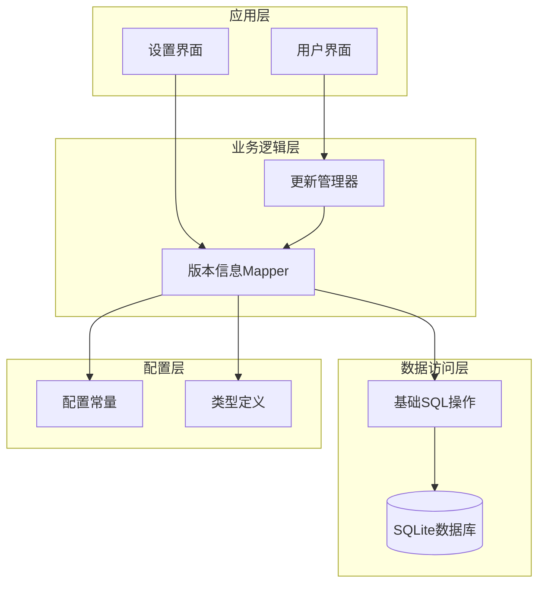
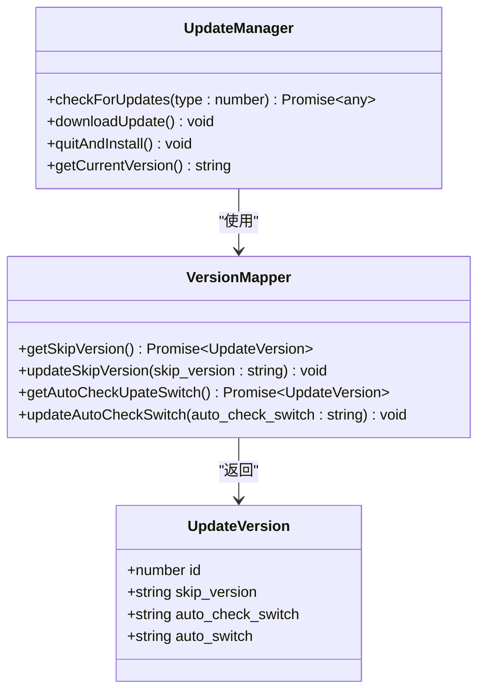
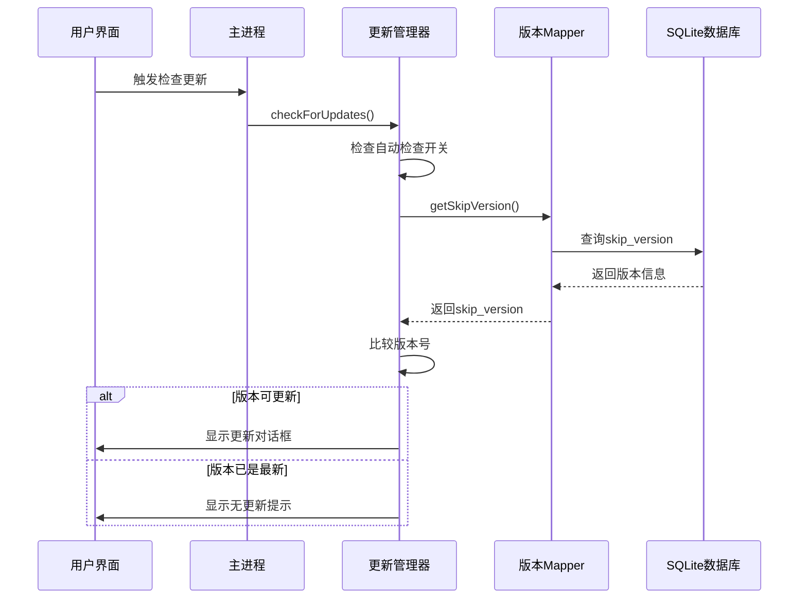
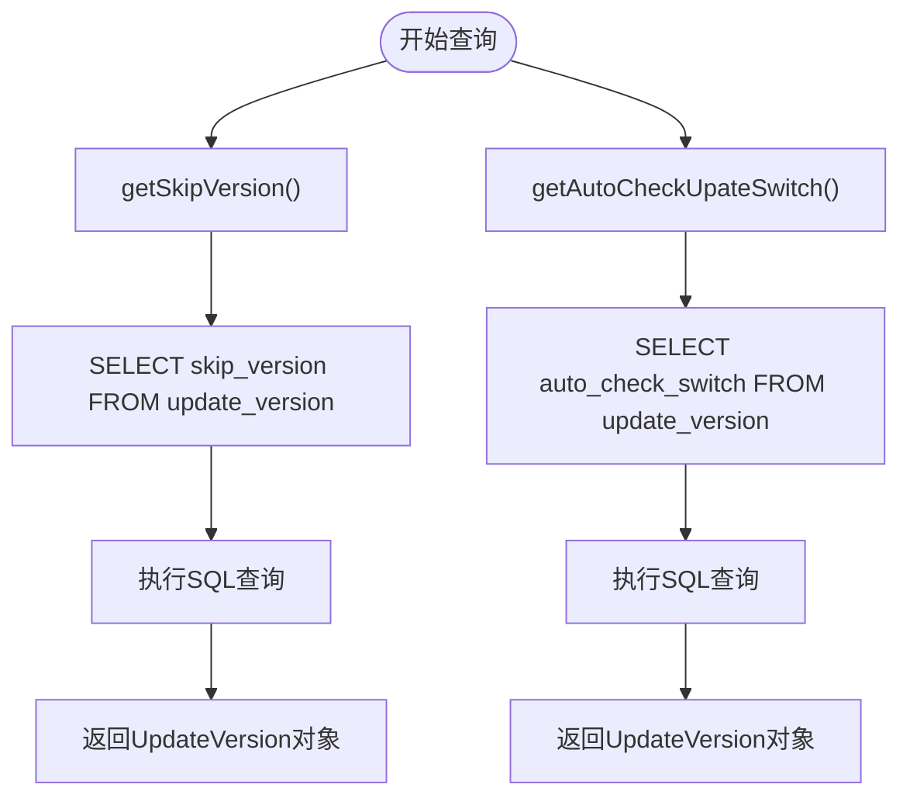
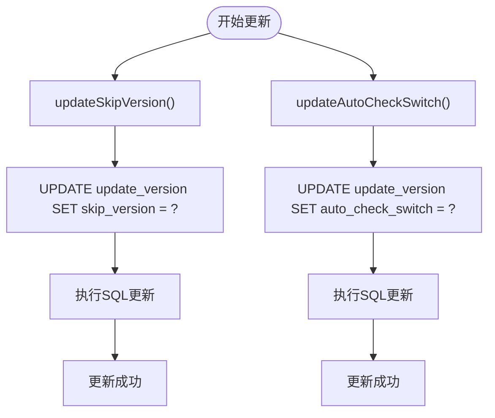
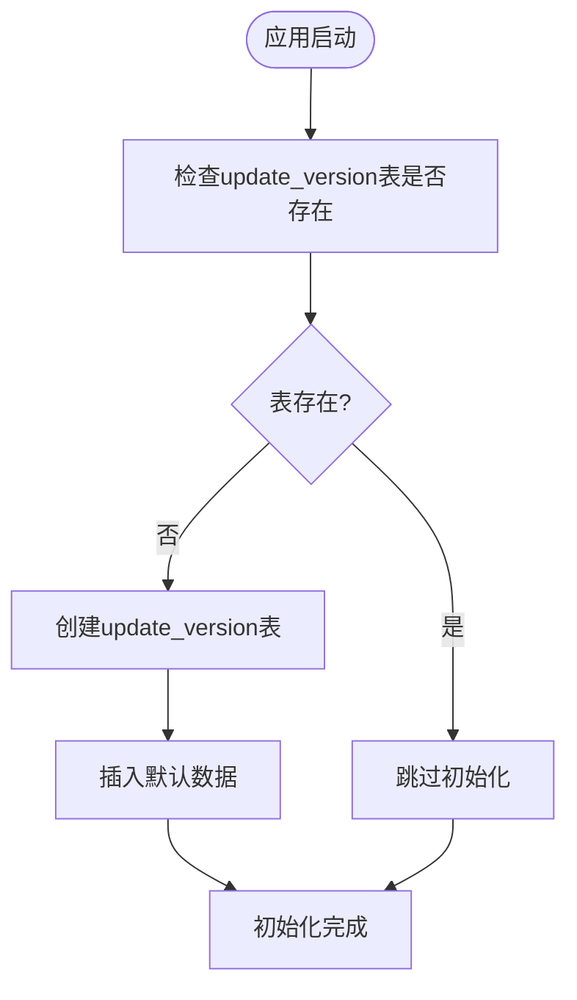
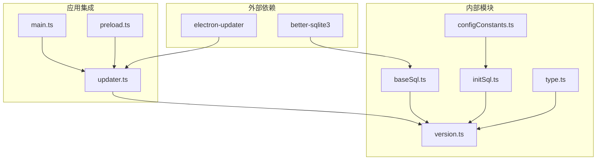

# 版本信息Mapper

<cite>
**本文档引用的文件**
- [version.ts](file://electron/db/sqlite/mapper/version.ts)
- [initSql.ts](file://electron/db/sqlite/components/initSql.ts)
- [baseSql.ts](file://electron/db/sqlite/components/baseSql.ts)
- [configConstants.ts](file://electron/db/sqlite/components/configConstants.ts)
- [type.ts](file://src/components/type.ts)
- [updater.ts](file://electron/updater.ts)
- [main.ts](file://electron/main.ts)
- [constant.ts](file://electron/constant.ts)
- [preload.ts](file://electron/preload.ts)
</cite>

## 目录
1. [简介](#简介)
2. [项目结构](#项目结构)
3. [核心组件](#核心组件)
4. [架构概览](#架构概览)
5. [详细组件分析](#详细组件分析)
6. [依赖关系分析](#依赖关系分析)
7. [性能考虑](#性能考虑)
8. [故障排除指南](#故障排除指南)
9. [结论](#结论)

## 简介

版本信息Mapper是密码管理器项目中负责应用版本管理和更新控制的核心模块。它基于Electron框架和SQLite数据库，实现了完整的版本控制系统，包括版本号存储、比较、升级检测、跳过版本管理等功能。该模块为应用程序提供了可靠的版本控制机制，确保用户能够及时获得最新的功能和安全更新。

## 项目结构

版本信息Mapper位于Electron桌面应用的数据库层，采用分层架构设计：



**图表来源**
- [version.ts:1-38](file://electron/db/sqlite/mapper/version.ts#L1-L38)
- [initSql.ts:107-129](file://electron/db/sqlite/components/initSql.ts#L107-L129)
- [baseSql.ts:1-87](file://electron/db/sqlite/components/baseSql.ts#L1-L87)

**章节来源**
- [version.ts:1-38](file://electron/db/sqlite/mapper/version.ts#L1-L38)
- [initSql.ts:26-46](file://electron/db/sqlite/components/initSql.ts#L26-L46)

## 核心组件

### 版本信息数据模型

版本信息Mapper使用统一的数据模型来管理应用版本信息：



**图表来源**
- [type.ts:39-47](file://src/components/type.ts#L39-L47)
- [version.ts:9-31](file://electron/db/sqlite/mapper/version.ts#L9-L31)

### 数据库表结构

版本信息存储在SQLite数据库的`update_version`表中，包含以下字段：

| 字段名 | 类型 | 描述 | 默认值 |
|--------|------|------|--------|
| id | INTEGER | 主键标识 | 自增 |
| skip_version | TEXT | 跳过更新的版本号 | 空字符串 |
| auto_check_switch | TEXT | 自动检查更新开关 | '0' |
| auto_switch | TEXT | 自动更新开关 | '0' |
| remark | TEXT | 备注信息 | 空字符串 |

**章节来源**
- [initSql.ts:117-126](file://electron/db/sqlite/components/initSql.ts#L117-L126)
- [type.ts:39-47](file://src/components/type.ts#L39-L47)

## 架构概览

版本信息Mapper采用事件驱动的架构模式，结合Electron的IPC通信机制：



**图表来源**
- [updater.ts:159-175](file://electron/updater.ts#L159-L175)
- [version.ts:9-13](file://electron/db/sqlite/mapper/version.ts#L9-L13)

## 详细组件分析

### 版本信息Mapper实现

版本信息Mapper提供了完整的CRUD操作接口：

#### 查询操作



**图表来源**
- [version.ts:9-25](file://electron/db/sqlite/mapper/version.ts#L9-L25)

#### 更新操作



**图表来源**
- [version.ts:15-31](file://electron/db/sqlite/mapper/version.ts#L15-L31)

**章节来源**
- [version.ts:1-38](file://electron/db/sqlite/mapper/version.ts#L1-L38)

### 数据库初始化流程

版本表的初始化采用了幂等设计，确保应用启动时的可靠性：



**图表来源**
- [initSql.ts:107-129](file://electron/db/sqlite/components/initSql.ts#L107-L129)

**章节来源**
- [initSql.ts:107-150](file://electron/db/sqlite/components/initSql.ts#L107-L150)

### 更新管理器集成

更新管理器通过事件监听机制与版本信息Mapper深度集成：

```mermaid
classDiagram
class UpdateManager {
-mainWindow : BrowserWindow
+setMainWindow(window : BrowserWindow) void
+checkForUpdates(type : number) Promise~any~
+downloadUpdate() void
+quitAndInstall() void
+getCurrentVersion() string
-showUpdateDialog(updateInfo : any) void
-showInstallDialog() void
}
class VersionMapper {
+getSkipVersion() Promise~UpdateVersion~
+updateSkipVersion(skip_version : string) void
+getAutoCheckUpateSwitch() Promise~UpdateVersion~
+updateAutoCheckSwitch(auto_check_switch : string) void
}
UpdateManager --> VersionMapper : "依赖"
UpdateManager --> "事件监听" : "update-available"
UpdateManager --> "事件监听" : "download-progress"
UpdateManager --> "事件监听" : "update-downloaded"
```

**图表来源**
- [updater.ts:7-201](file://electron/updater.ts#L7-L201)
- [version.ts:1-38](file://electron/db/sqlite/mapper/version.ts#L1-L38)

**章节来源**
- [updater.ts:1-204](file://electron/updater.ts#L1-L204)

## 依赖关系分析

版本信息Mapper的依赖关系体现了清晰的分层架构：



**图表来源**
- [updater.ts:2-5](file://electron/updater.ts#L2-L5)
- [baseSql.ts:1](file://electron/db/sqlite/components/baseSql.ts#L1)

**章节来源**
- [updater.ts:1-204](file://electron/updater.ts#L1-L204)
- [baseSql.ts:1-87](file://electron/db/sqlite/components/baseSql.ts#L1-L87)

## 性能考虑

版本信息Mapper在设计时充分考虑了性能优化：

### 查询优化策略
- 使用预编译语句防止SQL注入
- 采用异步查询避免阻塞主线程
- 实现连接池管理减少数据库开销

### 内存管理
- 及时释放数据库连接资源
- 避免内存泄漏的变量声明
- 合理的错误处理机制

### 网络优化
- 更新检查采用延迟加载策略
- 下载进度实时反馈用户体验
- 断点续传支持大文件更新

## 故障排除指南

### 常见问题及解决方案

#### 版本检查失败
**问题描述**: 应用无法连接到更新服务器
**解决步骤**:
1. 检查网络连接状态
2. 验证更新服务器URL配置
3. 查看防火墙设置
4. 检查代理服务器配置

#### 数据库连接异常
**问题描述**: 版本信息查询失败
**解决步骤**:
1. 确认SQLite数据库文件完整性
2. 检查数据库文件权限
3. 验证数据库连接字符串
4. 重启应用尝试重新连接

#### 更新下载中断
**问题描述**: 更新包下载过程中断
**解决步骤**:
1. 检查磁盘空间充足性
2. 验证下载链接有效性
3. 清理临时文件缓存
4. 重新启动下载进程

**章节来源**
- [updater.ts:40-43](file://electron/updater.ts#L40-L43)
- [baseSql.ts:16-31](file://electron/db/sqlite/components/baseSql.ts#L16-L31)

## 结论

版本信息Mapper作为密码管理器的核心组件，成功实现了以下目标：

### 技术成就
- **完整的版本控制体系**: 提供了从版本存储到更新检测的全流程解决方案
- **可靠的数据库设计**: 采用幂等初始化和事务处理确保数据一致性
- **优雅的错误处理**: 实现了完善的异常捕获和恢复机制
- **用户友好的交互**: 提供了直观的更新管理和版本控制界面

### 架构优势
- **模块化设计**: 清晰的职责分离便于维护和扩展
- **事件驱动**: 基于事件的异步处理提升了用户体验
- **配置灵活**: 支持多种更新策略和用户偏好设置
- **安全性保障**: 严格的输入验证和SQL注入防护

### 未来发展方向
- **版本号格式标准化**: 引入更严格的版本号验证规则
- **增量更新支持**: 实现差分更新减少带宽消耗
- **多语言支持**: 扩展国际化版本管理功能
- **性能监控**: 添加版本更新性能指标收集

该版本信息Mapper为密码管理器提供了坚实的技术基础，确保了应用的持续演进和用户满意度。