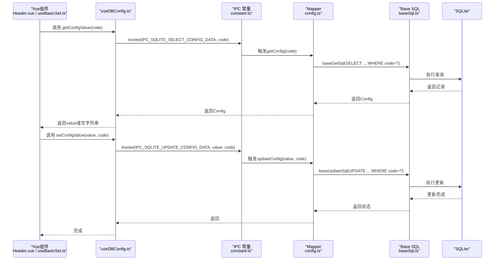
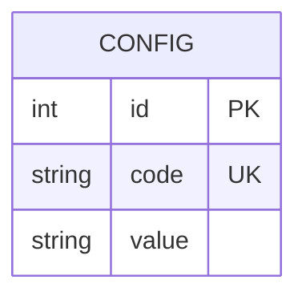
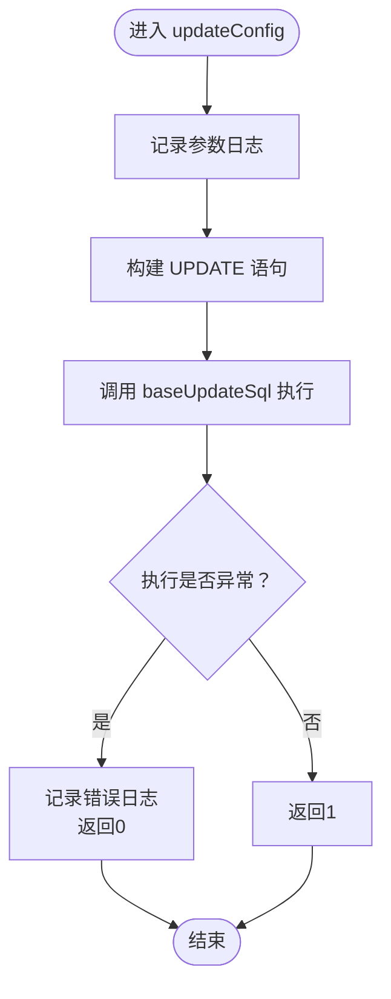
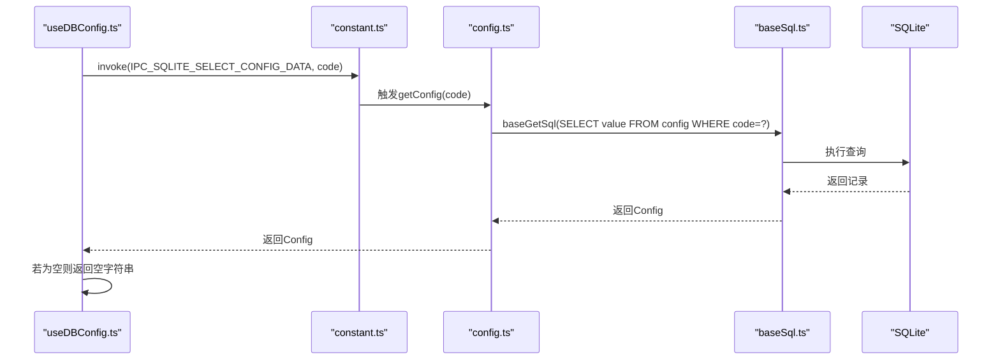
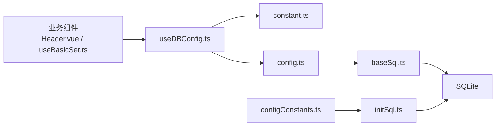

# 配置信息Mapper

<cite>
**本文引用的文件**
- [config.ts](file://electron/db/sqlite/mapper/config.ts)
- [baseSql.ts](file://electron/db/sqlite/components/baseSql.ts)
- [configConstants.ts](file://electron/db/sqlite/components/configConstants.ts)
- [initSql.ts](file://electron/db/sqlite/components/initSql.ts)
- [useDBConfig.ts](file://src/hooks/useDBConfig.ts)
- [type.ts](file://src/components/type.ts)
- [constant.ts](file://electron/constant.ts)
- [Header.vue](file://src/components/indexview/Header.vue)
- [useBasicSet.ts](file://src/hooks/useBasicSet.ts)
</cite>

## 目录
1. [简介](#简介)
2. [项目结构](#项目结构)
3. [核心组件](#核心组件)
4. [架构总览](#架构总览)
5. [详细组件分析](#详细组件分析)
6. [依赖关系分析](#依赖关系分析)
7. [性能考量](#性能考量)
8. [故障排查指南](#故障排查指南)
9. [结论](#结论)
10. [附录](#附录)

## 简介
本文件系统化梳理“配置信息Mapper”的设计与实现，重点覆盖以下方面：
- Config数据模型与配置管理的数据结构、存储约束与业务规则
- 核心方法updateConfig与getConfig的实现原理、调用流程与错误处理
- 配置项的存储结构、数据类型与业务规则
- 配置读写操作的使用方式与最佳实践
- 应用启动与运行时的配置作用机制，以及与前端Hook、主进程IPC的交互方式

## 项目结构
配置信息Mapper位于Electron子系统内，采用“主进程-渲染进程IPC-数据库”三层协作模式：
- 主进程侧：通过better-sqlite3连接SQLite，提供基础SQL能力与表初始化
- 渲染进程侧：通过IPC调用主进程SQL接口，封装配置读取与写入
- 配置常量与类型：集中定义配置项键名、默认值与前端类型

```mermaid
graph TB
subgraph "渲染进程"
Hook["useDBConfig.ts<br/>封装IPC调用"]
VueComp["Header.vue / useBasicSet.ts<br/>业务组件使用"]
end
subgraph "主进程"
Mapper["electron/db/sqlite/mapper/config.ts<br/>updateConfig/getConfig"]
Base["electron/db/sqlite/components/baseSql.ts<br/>baseUpdateSql/baseGetSql"]
DB["SQLite 数据库"]
end
subgraph "配置定义"
Const["configConstants.ts<br/>配置键名与默认值"]
Type["type.ts<br/>Config 接口"]
Cst["constant.ts<br/>IPC 常量"]
Init["initSql.ts<br/>建表与默认数据"]
end
VueComp --> Hook
Hook <- --> Cst
Hook --> Mapper
Mapper --> Base
Base --> DB
Init --> DB
Const --> Init
Type --> Mapper
```

图表来源
- [config.ts:1-27](file://electron/db/sqlite/mapper/config.ts#L1-L27)
- [baseSql.ts:1-87](file://electron/db/sqlite/components/baseSql.ts#L1-L87)
- [configConstants.ts:1-29](file://electron/db/sqlite/components/configConstants.ts#L1-L29)
- [initSql.ts:1-224](file://electron/db/sqlite/components/initSql.ts#L1-L224)
- [useDBConfig.ts:1-21](file://src/hooks/useDBConfig.ts#L1-L21)
- [type.ts:31-38](file://src/components/type.ts#L31-L38)
- [constant.ts:18-20](file://electron/constant.ts#L18-L20)

章节来源
- [config.ts:1-27](file://electron/db/sqlite/mapper/config.ts#L1-L27)
- [baseSql.ts:1-87](file://electron/db/sqlite/components/baseSql.ts#L1-L87)
- [configConstants.ts:1-29](file://electron/db/sqlite/components/configConstants.ts#L1-L29)
- [initSql.ts:1-224](file://electron/db/sqlite/components/initSql.ts#L1-L224)
- [useDBConfig.ts:1-21](file://src/hooks/useDBConfig.ts#L1-L21)
- [type.ts:31-38](file://src/components/type.ts#L31-L38)
- [constant.ts:18-20](file://electron/constant.ts#L18-L20)

## 核心组件
- Config数据模型
  - 字段：id、code、value
  - 类型：id为number；code为string；value为string
  - 约束：code唯一（UNIQUE）
- 配置常量
  - 键名：如auto_start、pwd、first_login_flag、dark_switch、auto_lock_time、auto_lock_time_unit、local_version、oss_sync_* 等
  - 默认值：通过configConstants.ts集中定义，初始化脚本在首次建表时写入
- 基础SQL组件
  - baseGetSql：执行查询并返回单条记录
  - baseUpdateSql：执行更新并返回状态
- 配置Mapper
  - updateConfig：封装UPDATE语句，按code更新value
  - getConfig：封装SELECT语句，按code返回Config对象

章节来源
- [type.ts:31-38](file://src/components/type.ts#L31-L38)
- [configConstants.ts:3-27](file://electron/db/sqlite/components/configConstants.ts#L3-L27)
- [baseSql.ts:21-32](file://electron/db/sqlite/components/baseSql.ts#L21-L32)
- [baseSql.ts:67-81](file://electron/db/sqlite/components/baseSql.ts#L67-L81)
- [config.ts:8-20](file://electron/db/sqlite/mapper/config.ts#L8-L20)

## 架构总览
配置读写通过IPC在渲染进程与主进程间传递，主进程负责SQLite访问与事务控制。



图表来源
- [useDBConfig.ts:6-18](file://src/hooks/useDBConfig.ts#L6-L18)
- [constant.ts:18-20](file://electron/constant.ts#L18-L20)
- [config.ts:15-20](file://electron/db/sqlite/mapper/config.ts#L15-L20)
- [baseSql.ts:21-32](file://electron/db/sqlite/components/baseSql.ts#L21-L32)
- [baseSql.ts:67-81](file://electron/db/sqlite/components/baseSql.ts#L67-L81)

## 详细组件分析

### Config数据模型与存储结构
- 表结构
  - 表名："config"
  - 字段：id（自增主键）、code（唯一）、value（文本）
  - 约束：code唯一（UNIQUE）
- 数据类型
  - id：整数
  - code：字符串（键名）
  - value：字符串（统一以字符串形式存储布尔/数值开关）
- 业务规则
  - 开关类配置统一以"1"/"0"存储
  - 时间类配置以毫秒或单位倍数存储，由其他字段决定单位
  - 首次安装时写入默认配置集合



图表来源
- [initSql.ts:74-81](file://electron/db/sqlite/components/initSql.ts#L74-L81)
- [configConstants.ts:3-27](file://electron/db/sqlite/components/configConstants.ts#L3-L27)

章节来源
- [initSql.ts:74-81](file://electron/db/sqlite/components/initSql.ts#L74-L81)
- [configConstants.ts:3-27](file://electron/db/sqlite/components/configConstants.ts#L3-L27)
- [type.ts:31-38](file://src/components/type.ts#L31-L38)

### updateConfig 实现原理与使用方式
- 实现原理
  - 使用baseUpdateSql执行UPDATE语句，按code定位记录并更新value
  - 返回值：内部返回1表示成功，0表示异常（但当前调用方未消费返回值）
- 参数与返回
  - 参数：...params（透传value, code）
  - 返回：无明确返回值（当前调用方忽略）
- 错误处理
  - baseUpdateSql捕获异常并记录日志，返回0；调用方未做显式校验
- 典型调用场景
  - 切换主题开关、设置自动锁屏时间、开启/关闭同步开关等



图表来源
- [config.ts:8-13](file://electron/db/sqlite/mapper/config.ts#L8-L13)
- [baseSql.ts:67-81](file://electron/db/sqlite/components/baseSql.ts#L67-L81)

章节来源
- [config.ts:8-13](file://electron/db/sqlite/mapper/config.ts#L8-L13)
- [baseSql.ts:67-81](file://electron/db/sqlite/components/baseSql.ts#L67-L81)

### getConfig 实现原理与使用方式
- 实现原理
  - 使用baseGetSql执行SELECT语句，按code查询单条记录
  - 返回Config对象（包含id、code、value）
- 参数与返回
  - 参数：code（字符串）
  - 返回：Promise<Config>
- 错误处理
  - baseGetSql捕获异常并记录日志，返回null；调用方在useDBConfig.ts中对空值进行兜底处理
- 典型调用场景
  - 初始化界面状态（如主题开关）、加载用户偏好设置、读取同步开关等



图表来源
- [useDBConfig.ts:6-13](file://src/hooks/useDBConfig.ts#L6-L13)
- [config.ts:15-20](file://electron/db/sqlite/mapper/config.ts#L15-L20)
- [baseSql.ts:21-32](file://electron/db/sqlite/components/baseSql.ts#L21-L32)

章节来源
- [useDBConfig.ts:6-13](file://src/hooks/useDBConfig.ts#L6-L13)
- [config.ts:15-20](file://electron/db/sqlite/mapper/config.ts#L15-L20)
- [baseSql.ts:21-32](file://electron/db/sqlite/components/baseSql.ts#L21-L32)

### 配置项的存储结构、数据类型与业务规则
- 存储结构
  - 单表存储，每条记录代表一个配置项
- 数据类型
  - code：字符串（键名）
  - value：字符串（统一编码，便于跨语言/跨模块一致处理）
- 业务规则
  - 开关类：以"1"/"0"存储，前端通常转换为布尔值
  - 数值类：以字符串存储数值，前端按需解析
  - 时间类：以毫秒或单位倍数存储，配合单位字段使用
  - 唯一键：code唯一，确保同一键不会重复

章节来源
- [initSql.ts:74-81](file://electron/db/sqlite/components/initSql.ts#L74-L81)
- [configConstants.ts:3-27](file://electron/db/sqlite/components/configConstants.ts#L3-L27)
- [type.ts:31-38](file://src/components/type.ts#L31-L38)

### 配置读写操作的使用示例（路径与要点）
- 读取配置
  - 路径：[useDBConfig.ts:6-13](file://src/hooks/useDBConfig.ts#L6-L13)
  - 要点：通过IPC调用，若返回空则回退为空字符串
- 写入配置
  - 路径：[useDBConfig.ts:15-18](file://src/hooks/useDBConfig.ts#L15-L18)
  - 要点：通过IPC调用，value统一以字符串形式传递
- 典型业务使用
  - 切换主题：[Header.vue:84-89](file://src/components/indexview/Header.vue#L84-L89)
  - 设置自动锁屏时间：[useBasicSet.ts:67-72](file://src/hooks/useBasicSet.ts#L67-L72)
  - 同步开关：[useBasicSet.ts:34-39](file://src/hooks/useBasicSet.ts#L34-L39)

章节来源
- [useDBConfig.ts:6-18](file://src/hooks/useDBConfig.ts#L6-L18)
- [Header.vue:84-89](file://src/components/indexview/Header.vue#L84-L89)
- [useBasicSet.ts:67-72](file://src/hooks/useBasicSet.ts#L67-L72)
- [useBasicSet.ts:34-39](file://src/hooks/useBasicSet.ts#L34-L39)

### 应用启动与运行时的作用
- 启动阶段
  - 初始化：首次运行时创建config表并写入默认配置
  - 读取偏好：应用启动时读取主题、自动锁屏、同步开关等配置，初始化UI与业务状态
- 运行时
  - 动态更新：用户在设置页修改配置后，立即写入数据库并生效
  - 一致性：所有配置均通过统一Mapper与Hook访问，避免分散逻辑

章节来源
- [initSql.ts:26-46](file://electron/db/sqlite/components/initSql.ts#L26-L46)
- [initSql.ts:164-183](file://electron/db/sqlite/components/initSql.ts#L164-L183)
- [Header.vue:46-53](file://src/components/indexview/Header.vue#L46-L53)
- [useBasicSet.ts:24-31](file://src/hooks/useBasicSet.ts#L24-L31)

## 依赖关系分析
- 组件耦合
  - Mapper依赖Base SQL组件，提供查询与更新能力
  - Hook依赖IPC常量与Mapper，屏蔽主进程细节
  - 业务组件仅依赖Hook，降低耦合
- 外部依赖
  - better-sqlite3：提供SQLite访问与事务支持
  - Electron IPC：提供渲染进程与主进程通信通道



图表来源
- [useDBConfig.ts:1-21](file://src/hooks/useDBConfig.ts#L1-L21)
- [constant.ts:18-20](file://electron/constant.ts#L18-L20)
- [config.ts:1-27](file://electron/db/sqlite/mapper/config.ts#L1-L27)
- [baseSql.ts:1-87](file://electron/db/sqlite/components/baseSql.ts#L1-L87)
- [initSql.ts:1-224](file://electron/db/sqlite/components/initSql.ts#L1-L224)
- [configConstants.ts:1-29](file://electron/db/sqlite/components/configConstants.ts#L1-L29)

章节来源
- [useDBConfig.ts:1-21](file://src/hooks/useDBConfig.ts#L1-L21)
- [constant.ts:18-20](file://electron/constant.ts#L18-L20)
- [config.ts:1-27](file://electron/db/sqlite/mapper/config.ts#L1-L27)
- [baseSql.ts:1-87](file://electron/db/sqlite/components/baseSql.ts#L1-L87)
- [initSql.ts:1-224](file://electron/db/sqlite/components/initSql.ts#L1-L224)
- [configConstants.ts:1-29](file://electron/db/sqlite/components/configConstants.ts#L1-L29)

## 性能考量
- 查询路径
  - 单条记录查询，索引命中code（唯一约束），查询开销低
- 写入路径
  - 单条记录更新，按唯一键定位，更新开销低
- 建议
  - 对频繁读取的配置项可在内存缓存，减少IPC往返
  - 批量更新可通过事务封装（当前为单条更新，可扩展）

## 故障排查指南
- 常见问题
  - 配置读取为空：确认code是否正确，确认初始化是否完成
  - 写入无效：确认value是否为字符串，确认IPC通道是否正常
  - 异常日志：关注baseUpdateSql与baseGetSql的日志输出
- 排查步骤
  - 检查初始化脚本是否执行（initTable与insertConfigData）
  - 检查IPC常量与Mapper映射是否一致
  - 检查Hook对空值的兜底逻辑

章节来源
- [baseSql.ts:12-31](file://electron/db/sqlite/components/baseSql.ts#L12-L31)
- [baseSql.ts:67-81](file://electron/db/sqlite/components/baseSql.ts#L67-L81)
- [initSql.ts:26-46](file://electron/db/sqlite/components/initSql.ts#L26-L46)
- [initSql.ts:164-183](file://electron/db/sqlite/components/initSql.ts#L164-L183)
- [useDBConfig.ts:6-13](file://src/hooks/useDBConfig.ts#L6-L13)

## 结论
配置信息Mapper通过统一的Config模型与Mapper接口，实现了配置的标准化存储与访问。结合Hook与IPC，既满足了前端易用性，又保证了主进程数据库访问的一致性与安全性。建议在高频读取场景引入缓存策略，并完善调用方对返回值的校验，进一步提升健壮性。

## 附录
- 配置项清单（节选）
  - auto_start、pwd、first_login_flag、dark_switch、auto_lock_time、auto_lock_time_unit、local_version、oss_sync_switch、oss_sync_auto_upload_switch、oss_sync_auto_download_switch、openMainWindows、logout、copyUsername、copyPwd、copyLink、insertGroup、insertPwdInfo
- 默认值来源
  - 通过configConstants.ts集中定义，初始化脚本在首次建表时写入

章节来源
- [configConstants.ts:3-27](file://electron/db/sqlite/components/configConstants.ts#L3-L27)
- [initSql.ts:164-183](file://electron/db/sqlite/components/initSql.ts#L164-L183)