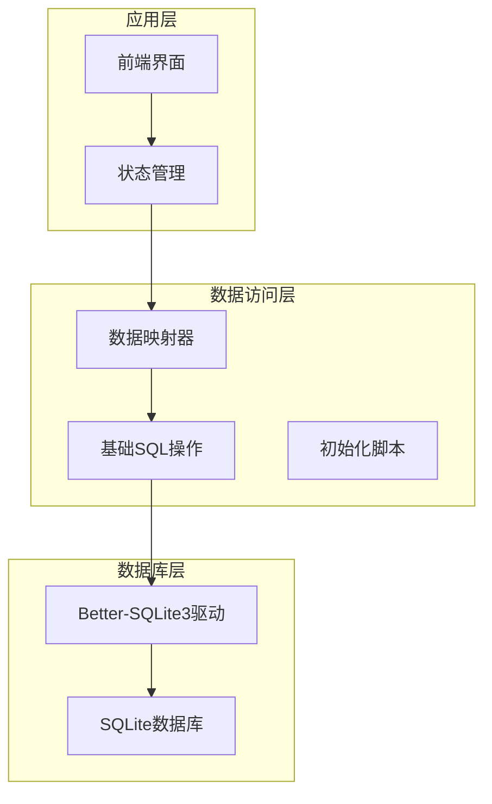
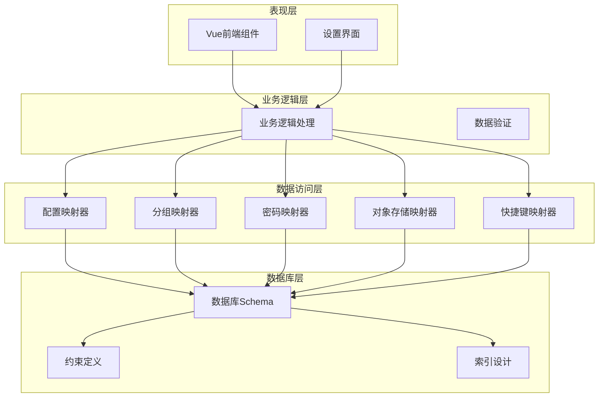
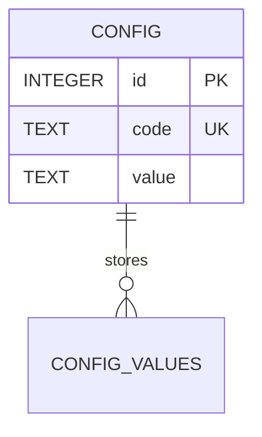
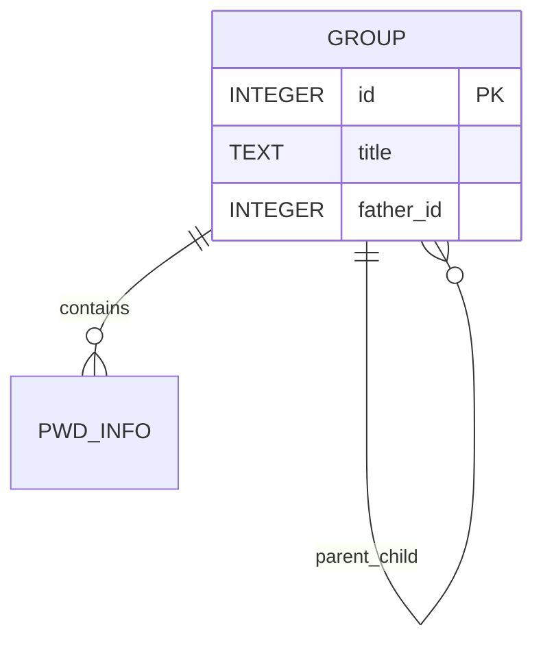
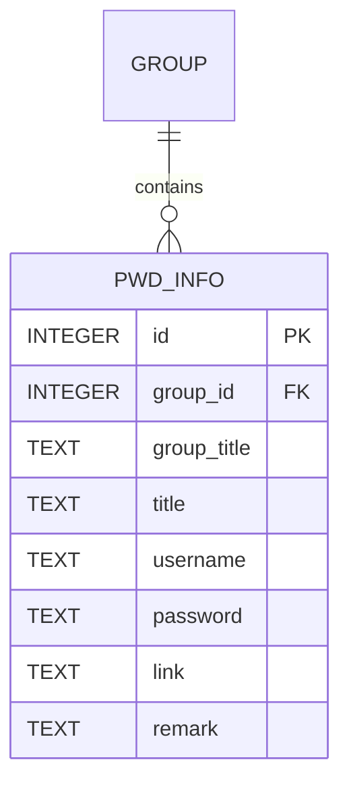
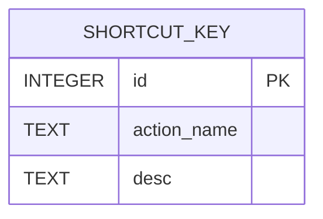
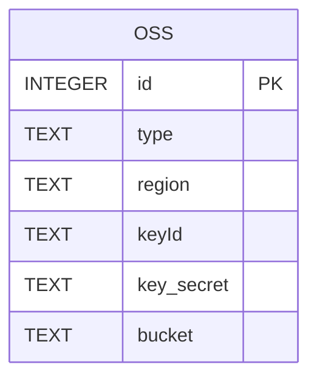
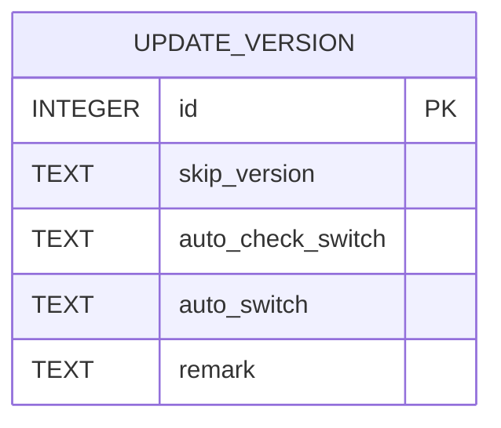
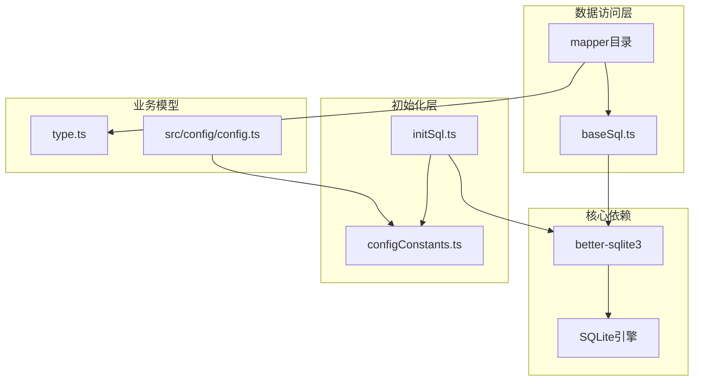

# 表结构设计

<cite>
**本文档引用的文件**
- [initSql.ts](file://electron/db/sqlite/components/initSql.ts)
- [configConstants.ts](file://electron/db/sqlite/components/configConstants.ts)
- [baseSql.ts](file://electron/db/sqlite/components/baseSql.ts)
- [db.ts](file://electron/db/sqlite/components/db.ts)
- [config.ts](file://electron/db/sqlite/mapper/config.ts)
- [group.ts](file://electron/db/sqlite/mapper/group.ts)
- [pwdInfo.ts](file://electron/db/sqlite/mapper/pwdInfo.ts)
- [oss.ts](file://electron/db/sqlite/mapper/oss.ts)
- [shortcutKey.ts](file://electron/db/sqlite/mapper/shortcutKey.ts)
- [version.ts](file://electron/db/sqlite/mapper/version.ts)
- [type.ts](file://src/components/type.ts)
- [config.ts](file://src/config/config.ts)
</cite>

## 目录
1. [简介](#简介)
2. [项目结构](#项目结构)
3. [核心组件](#核心组件)
4. [架构概览](#架构概览)
5. [详细组件分析](#详细组件分析)
6. [依赖分析](#依赖分析)
7. [性能考虑](#性能考虑)
8. [故障排除指南](#故障排除指南)
9. [结论](#结论)

## 简介

本文件详细说明密码管理器中各个数据表的结构设计，包括config、group、pwd_info、oss_config、shortcut_key等表的字段定义、数据类型和约束规则。文档记录了主键、外键关系和索引设计，解释了表之间的关联关系和数据完整性约束，提供了完整的数据库schema图表和示例数据，说明了表设计的业务逻辑依据和扩展性考虑。

## 项目结构

密码管理器采用Electron + Vue的桌面应用架构，数据库层使用SQLite作为本地存储方案。整体项目结构如下：

**图表来源**
- [initSql.ts:1-224](file://electron/db/sqlite/components/initSql.ts#L1-L224)
- [baseSql.ts:1-87](file://electron/db/sqlite/components/baseSql.ts#L1-L87)
- [db.ts:1-30](file://electron/db/sqlite/components/db.ts#L1-L30)

**章节来源**
- [initSql.ts:1-224](file://electron/db/sqlite/components/initSql.ts#L1-L224)
- [baseSql.ts:1-87](file://electron/db/sqlite/components/baseSql.ts#L1-L87)
- [db.ts:1-30](file://electron/db/sqlite/components/db.ts#L1-L30)

## 核心组件

密码管理器的数据访问层由多个核心组件组成，每个组件负责特定功能域的数据操作：

### 数据库连接管理
- **db.ts**: 提供SQLite数据库连接的统一入口，管理数据库文件路径和连接生命周期

### 基础SQL操作
- **baseSql.ts**: 实现通用的数据库操作方法，包括查询、插入、更新等基础功能

### 表结构初始化
- **initSql.ts**: 定义所有数据表的创建语句和初始数据插入逻辑

### 业务数据映射
- **config.ts**: 配置管理映射器
- **group.ts**: 分组管理映射器  
- **pwdInfo.ts**: 密码信息管理映射器
- **oss.ts**: 对象存储配置映射器
- **shortcutKey.ts**: 快捷键配置映射器
- **version.ts**: 版本管理映射器

**章节来源**
- [db.ts:1-30](file://electron/db/sqlite/components/db.ts#L1-L30)
- [baseSql.ts:1-87](file://electron/db/sqlite/components/baseSql.ts#L1-L87)
- [initSql.ts:48-105](file://electron/db/sqlite/components/initSql.ts#L48-L105)

## 架构概览

密码管理器采用分层架构设计，确保数据访问的清晰分离和良好的可维护性：

**图表来源**
- [initSql.ts:51-100](file://electron/db/sqlite/components/initSql.ts#L51-L100)
- [config.ts:1-27](file://electron/db/sqlite/mapper/config.ts#L1-L27)
- [group.ts:1-49](file://electron/db/sqlite/mapper/group.ts#L1-L49)
- [pwdInfo.ts:1-100](file://electron/db/sqlite/mapper/pwdInfo.ts#L1-L100)

## 详细组件分析

### 数据库Schema设计

#### config表设计

config表用于存储系统配置参数，采用键值对的形式存储各种配置项。

**图表来源**
- [initSql.ts:74-81](file://electron/db/sqlite/components/initSql.ts#L74-L81)

**表结构详情**：
- **主键**: id (INTEGER, 自增)
- **唯一约束**: code (TEXT, 唯一)
- **字段定义**:
  - id: 整数类型，自动递增主键
  - code: 文本类型，配置项标识符，唯一约束
  - value: 文本类型，配置项对应的值

**约束规则**：
- 主键约束：确保每条配置记录的唯一性
- 唯一约束：防止重复的配置代码
- 非空约束：code字段必须非空

**业务逻辑依据**：
- 支持系统运行时的各种配置管理
- 提供统一的配置访问接口
- 支持动态配置更新

**章节来源**
- [initSql.ts:74-81](file://electron/db/sqlite/components/initSql.ts#L74-L81)
- [config.ts:8-20](file://electron/db/sqlite/mapper/config.ts#L8-L20)
- [configConstants.ts:3-18](file://electron/db/sqlite/components/configConstants.ts#L3-L18)

#### group表设计

group表用于组织密码信息的分组结构，支持树形层级关系。

**图表来源**
- [initSql.ts:52-58](file://electron/db/sqlite/components/initSql.ts#L52-L58)
- [pwdInfo.ts:60-70](file://electron/db/sqlite/mapper/pwdInfo.ts#L60-L70)

**表结构详情**：
- **主键**: id (INTEGER, 自增)
- **字段定义**:
  - id: 整数类型，自动递增主键
  - title: 文本类型，分组名称
  - father_id: 整数类型，父分组ID，支持层级关系

**约束规则**：
- 主键约束：确保每个分组的唯一性
- 外键约束：father_id引用自身id，形成自引用关系
- 非空约束：title字段必须非空

**业务逻辑依据**：
- 支持多层级的密码分类管理
- 提供灵活的组织结构
- 支持分组的创建、删除和修改操作

**章节来源**
- [initSql.ts:52-58](file://electron/db/sqlite/components/initSql.ts#L52-L58)
- [group.ts:7-48](file://electron/db/sqlite/mapper/group.ts#L7-L48)

#### pwd_info表设计

pwd_info表存储具体的密码信息，包含完整的账户信息和关联关系。

**图表来源**
- [initSql.ts:60-71](file://electron/db/sqlite/components/initSql.ts#L60-L71)
- [group.ts:43-47](file://electron/db/sqlite/mapper/group.ts#L43-L47)

**表结构详情**：
- **主键**: id (INTEGER, 自增)
- **字段定义**:
  - id: 整数类型，自动递增主键
  - group_id: 整数类型，关联到group表的分组ID
  - group_title: 文本类型，分组标题的冗余存储
  - title: 文本类型，账户标题
  - username: 文本类型，用户名
  - password: 文本类型，加密后的密码
  - link: 文本类型，网站链接
  - remark: 文本类型，备注信息

**约束规则**：
- 主键约束：确保每条密码记录的唯一性
- 外键约束：group_id引用group表的id
- 非空约束：group_id字段必须非空

**业务逻辑依据**：
- 存储完整的账户信息
- 维护分组关联关系
- 支持密码信息的增删改查操作

**章节来源**
- [initSql.ts:60-71](file://electron/db/sqlite/components/initSql.ts#L60-L71)
- [pwdInfo.ts:6-99](file://electron/db/sqlite/mapper/pwdInfo.ts#L6-L99)

#### shortcut_key表设计

shortcut_key表存储应用程序的快捷键配置。

**图表来源**
- [initSql.ts:83-89](file://electron/db/sqlite/components/initSql.ts#L83-L89)

**表结构详情**：
- **主键**: id (INTEGER, 自增)
- **字段定义**:
  - id: 整数类型，自动递增主键
  - action_name: 文本类型，动作名称
  - desc: 文本类型，快捷键描述

**约束规则**：
- 主键约束：确保每个快捷键配置的唯一性

**业务逻辑依据**：
- 支持自定义快捷键配置
- 提供快捷键的动态修改功能
- 维护用户交互体验

**章节来源**
- [initSql.ts:83-89](file://electron/db/sqlite/components/initSql.ts#L83-L89)
- [shortcutKey.ts:8-25](file://electron/db/sqlite/mapper/shortcutKey.ts#L8-L25)
- [configConstants.ts:20-28](file://electron/db/sqlite/components/configConstants.ts#L20-L28)

#### oss表设计

oss表存储对象存储配置信息，支持多种云存储服务。

**图表来源**
- [initSql.ts:91-100](file://electron/db/sqlite/components/initSql.ts#L91-L100)

**表结构详情**：
- **主键**: id (INTEGER, 自增)
- **字段定义**:
  - id: 整数类型，自动递增主键
  - type: 文本类型，云存储类型
  - region: 文本类型，区域信息
  - keyId: 文本类型，访问密钥ID
  - key_secret: 文本类型，访问密钥
  - bucket: 文本类型，存储桶名称

**约束规则**：
- 主键约束：确保每个存储配置的唯一性

**业务逻辑依据**：
- 支持多种云存储服务集成
- 提供安全的密钥存储机制
- 支持数据同步功能

**章节来源**
- [initSql.ts:91-100](file://electron/db/sqlite/components/initSql.ts#L91-L100)
- [oss.ts:8-23](file://electron/db/sqlite/mapper/oss.ts#L8-L23)

#### update_version表设计

update_version表用于管理应用程序的版本更新配置。

**图表来源**
- [initSql.ts:117-126](file://electron/db/sqlite/components/initSql.ts#L117-L126)

**表结构详情**：
- **主键**: id (INTEGER, 自增)
- **字段定义**:
  - id: 整数类型，自动递增主键
  - skip_version: 文本类型，跳过的版本号
  - auto_check_switch: 文本类型，自动检查开关
  - auto_switch: 文本类型，自动更新开关
  - remark: 文本类型，备注信息

**约束规则**：
- 主键约束：确保版本配置的唯一性

**业务逻辑依据**：
- 支持应用程序的自动更新功能
- 提供版本跳过机制
- 维护更新策略配置

**章节来源**
- [initSql.ts:117-126](file://electron/db/sqlite/components/initSql.ts#L117-L126)
- [version.ts:9-31](file://electron/db/sqlite/mapper/version.ts#L9-L31)

### 数据完整性约束

密码管理器的数据库设计遵循以下完整性约束原则：

#### 主键约束
- 所有表都定义了明确的主键，确保记录的唯一性
- 使用INTEGER类型的自增主键，提供高效的索引性能

#### 外键约束
- pwd_info表的group_id字段引用group表的id
- 支持级联删除，当分组删除时，相关密码信息也会被清理

#### 唯一约束
- config表的code字段具有唯一约束，防止重复配置
- 确保配置项的唯一性和可检索性

#### 非空约束
- 关键字段如title、group_id等设置了非空约束
- 保证数据的基本完整性

### 索引设计

基于SQLite的特性，密码管理器采用了以下索引策略：

#### 自动索引
- 主键字段自动建立索引，提供最优的查询性能
- 唯一约束字段自动建立唯一索引

#### 查询优化
- group表的title字段用于快速查找分组
- config表的code字段用于快速配置检索
- pwd_info表的group_id字段用于分组查询

#### 性能考虑
- 避免在高频更新的字段上建立过多索引
- 考虑到SQLite的轻量级特性，保持索引数量适中

**章节来源**
- [initSql.ts:51-126](file://electron/db/sqlite/components/initSql.ts#L51-L126)
- [baseSql.ts:9-81](file://electron/db/sqlite/components/baseSql.ts#L9-L81)

## 依赖分析

密码管理器的数据库层依赖关系清晰明确，各组件职责分离：

**图表来源**
- [initSql.ts:1-224](file://electron/db/sqlite/components/initSql.ts#L1-L224)
- [baseSql.ts:1-87](file://electron/db/sqlite/components/baseSql.ts#L1-L87)
- [db.ts:1-30](file://electron/db/sqlite/components/db.ts#L1-L30)

### 组件耦合度分析

- **低耦合设计**: 各映射器之间相互独立，通过基础SQL层进行通信
- **清晰职责**: 每个组件都有明确的功能边界
- **可测试性**: 组件间依赖关系简单，便于单元测试

### 外部依赖

- **better-sqlite3**: 提供高性能的SQLite数据库访问
- **Electron**: 提供桌面应用的运行环境
- **Vue**: 提供前端界面框架

**章节来源**
- [db.ts:1-30](file://electron/db/sqlite/components/db.ts#L1-L30)
- [initSql.ts:1-224](file://electron/db/sqlite/components/initSql.ts#L1-L224)

## 性能考虑

密码管理器的数据库设计充分考虑了性能优化：

### 查询性能优化
- 使用参数化查询防止SQL注入
- 合理利用索引提高查询效率
- 避免SELECT *，只选择需要的字段

### 内存管理
- 及时关闭数据库连接
- 合理使用事务减少磁盘I/O
- 控制查询结果集大小

### 扩展性考虑
- 支持未来添加新的配置项
- 灵活的分组结构设计
- 可扩展的快捷键系统

## 故障排除指南

### 常见问题及解决方案

#### 数据库连接问题
- **症状**: 应用启动时报数据库连接错误
- **原因**: 数据库文件损坏或权限不足
- **解决**: 检查数据库文件路径和权限，必要时重新初始化数据库

#### 数据一致性问题
- **症状**: 删除分组后密码信息仍然存在
- **原因**: 外键约束未正确设置
- **解决**: 检查数据库初始化脚本，确保外键约束正确配置

#### 性能问题
- **症状**: 查询响应缓慢
- **原因**: 缺少适当的索引
- **解决**: 分析查询计划，添加必要的索引

**章节来源**
- [baseSql.ts:12-81](file://electron/db/sqlite/components/baseSql.ts#L12-L81)
- [initSql.ts:131-143](file://electron/db/sqlite/components/initSql.ts#L131-L143)

## 结论

密码管理器的数据库设计体现了以下特点：

### 设计优势
- **简洁明了**: 表结构简单直观，易于理解和维护
- **性能优良**: 合理的索引设计和查询优化
- **扩展性强**: 支持未来功能扩展和配置增加
- **安全性高**: 采用参数化查询防止SQL注入

### 业务价值
- **用户体验**: 提供流畅的密码管理体验
- **数据安全**: 采用加密存储保护敏感信息
- **系统稳定**: 完善的错误处理和恢复机制

### 发展方向
- **功能扩展**: 支持更多云存储服务
- **性能优化**: 持续改进查询性能
- **安全增强**: 加强数据保护机制

通过合理的数据库设计和完善的架构实现，密码管理器为用户提供了安全、可靠、易用的密码管理解决方案。