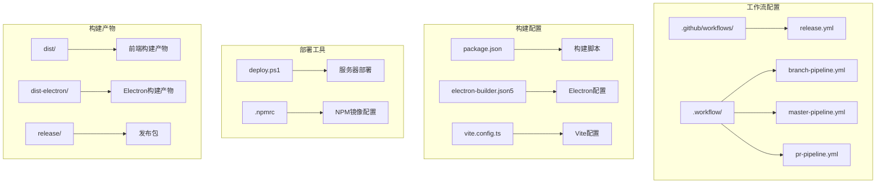
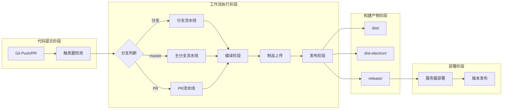
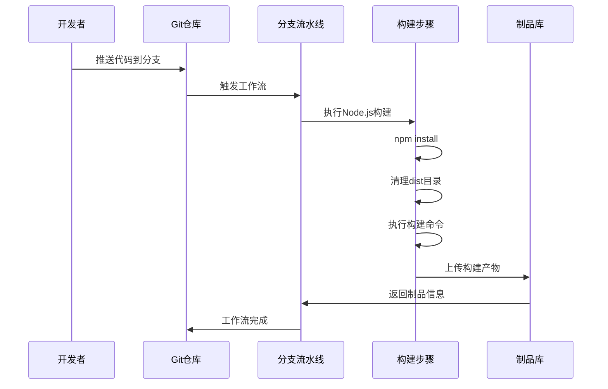
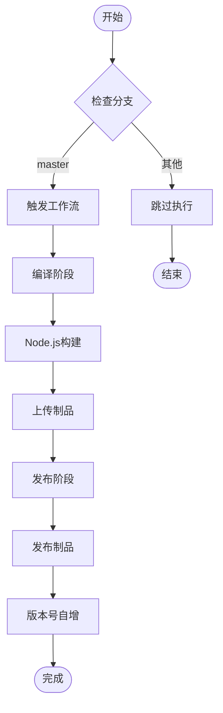
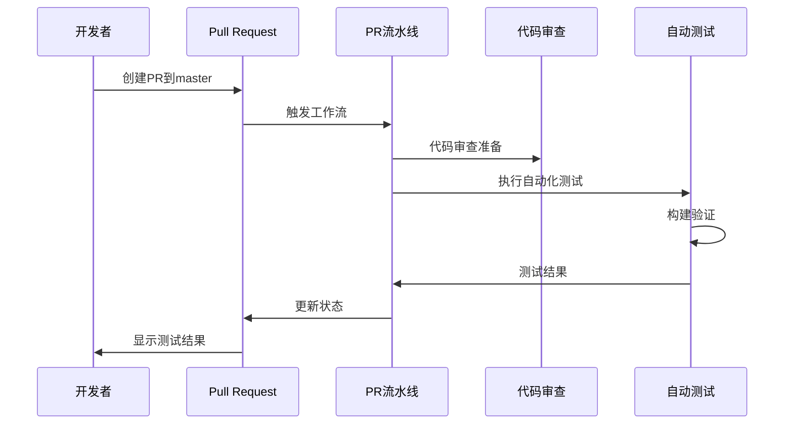
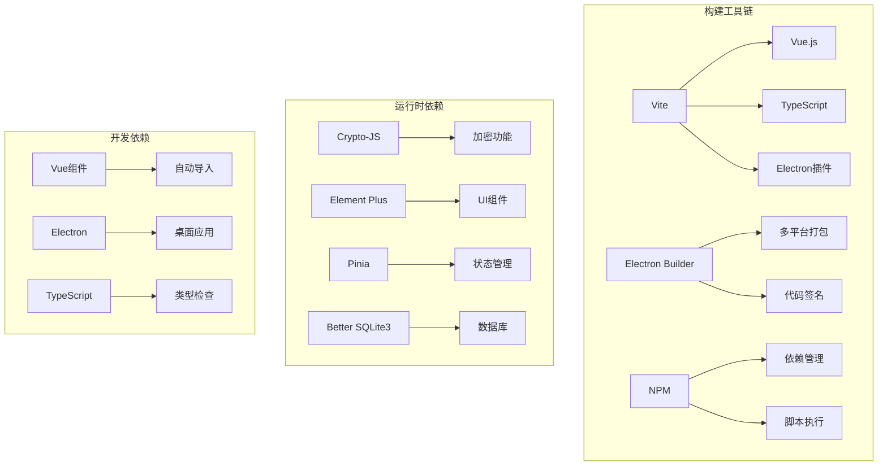

# CI/CD工作流

<cite>
**本文档引用的文件**
- [.github/workflows/release.yml](file://.github/workflows/release.yml)
- [.workflow/branch-pipeline.yml](file://.workflow/branch-pipeline.yml)
- [.workflow/master-pipeline.yml](file://.workflow/master-pipeline.yml)
- [.workflow/pr-pipeline.yml](file://.workflow/pr-pipeline.yml)
- [package.json](file://package.json)
- [electron-builder.json5](file://electron-builder.json5)
- [deploy.ps1](file://deploy.ps1)
- [vite.config.ts](file://vite.config.ts)
- [.npmrc](file://.npmrc)
- [.gitignore](file://.gitignore)
</cite>

## 目录
1. [简介](#简介)
2. [项目结构](#项目结构)
3. [核心组件](#核心组件)
4. [架构概览](#架构概览)
5. [详细组件分析](#详细组件分析)
6. [依赖关系分析](#依赖关系分析)
7. [性能考虑](#性能考虑)
8. [故障排除指南](#故障排除指南)
9. [结论](#结论)

## 简介

本项目采用双工作流架构，结合GitHub Actions和自定义工作流系统，实现了完整的CI/CD流水线。该系统支持三种不同的流水线类型：分支流水线、主分支流水线和PR（Pull Request）流水线，每种流水线都有特定的设计理念和触发条件。

项目使用Electron框架开发桌面应用程序，构建过程涉及前端Vue.js应用和Electron主进程的双重构建。工作流系统确保代码质量、构建验证和部署的安全性。

## 项目结构

项目采用模块化组织结构，包含以下关键目录：

**图表来源**
- [.github/workflows/release.yml:1-51](file://.github/workflows/release.yml#L1-L51)
- [.workflow/branch-pipeline.yml:1-52](file://.workflow/branch-pipeline.yml#L1-L52)
- [package.json:1-51](file://package.json#L1-L51)

**章节来源**
- [.github/workflows/release.yml:1-51](file://.github/workflows/release.yml#L1-L51)
- [.workflow/branch-pipeline.yml:1-52](file://.workflow/branch-pipeline.yml#L1-L52)
- [.workflow/master-pipeline.yml:1-50](file://.workflow/master-pipeline.yml#L1-L50)
- [.workflow/pr-pipeline.yml:1-37](file://.workflow/pr-pipeline.yml#L1-L37)

## 核心组件

### 工作流类型概述

项目实现了三种不同类型的CI/CD工作流，每种都有特定的用途和触发条件：

1. **分支流水线（Branch Pipeline）**：用于非主分支的代码变更
2. **主分支流水线（Master Pipeline）**：用于主分支的稳定版本构建
3. **PR流水线（PR Pipeline）**：用于Pull Request的代码审查和验证

### 构建配置组件

#### 包管理配置
项目使用NPM作为包管理器，并通过`.npmrc`文件配置了国内镜像源以提高下载速度：
- Electron镜像源：`https://npmmirror.com/mirrors/electron/`
- Electron Builder二进制镜像源：`http://npmmirror.com/mirrors/electron-builder-binaries/`

#### 构建脚本配置
在`package.json`中定义了关键的构建脚本：
- `build`: 执行Vite构建和Electron打包
- `postinstall`: 安装Electron应用依赖

#### Electron构建配置
`electron-builder.json5`文件定义了多平台构建配置：
- 支持Windows、macOS和Linux平台
- 自动代码签名和更新机制
- 多目标格式：NSIS、DMG、AppImage

**章节来源**
- [package.json:1-51](file://package.json#L1-L51)
- [electron-builder.json5:1-52](file://electron-builder.json5#L1-L52)
- [.npmrc:1-3](file://.npmrc#L1-L3)

## 架构概览

整个CI/CD系统采用分层架构设计，从左到右展示了代码提交到最终部署的完整流程：

**图表来源**
- [.workflow/branch-pipeline.yml:45-52](file://.workflow/branch-pipeline.yml#L45-L52)
- [.workflow/master-pipeline.yml:45-50](file://.workflow/master-pipeline.yml#L45-L50)
- [.workflow/pr-pipeline.yml:32-37](file://.workflow/pr-pipeline.yml#L32-L37)

## 详细组件分析

### 分支流水线（Branch Pipeline）

分支流水线是项目中最基础的工作流，适用于所有非主分支的代码变更。

#### 触发条件
- 排除主分支（master）
- 匹配所有其他分支模式（.*）

#### 执行流程

**图表来源**
- [.workflow/branch-pipeline.yml:9-23](file://.workflow/branch-pipeline.yml#L9-L23)

#### 关键特性
- 使用Node.js 14.16.0版本
- 构建命令：`npm install && rm -rf ./dist && npm run build`
- 构建产物存储在`./dist`目录
- 自动清理上一次构建的残留产物

**章节来源**
- [.workflow/branch-pipeline.yml:1-52](file://.workflow/branch-pipeline.yml#L1-L52)

### 主分支流水线（Master Pipeline）

主分支流水线专门用于主分支的稳定版本构建，具有更高的发布标准。

#### 触发条件
- 仅当推送至master分支时触发

#### 执行流程

**图表来源**
- [.workflow/master-pipeline.yml:46-50](file://.workflow/master-pipeline.yml#L46-L50)

#### 版本管理
- 初始版本号：2.1.0
- 启用版本号自动递增
- 发布制品版本：1.0.0.0

**章节来源**
- [.workflow/master-pipeline.yml:1-50](file://.workflow/master-pipeline.yml#L1-L50)

### PR流水线（PR Pipeline）

PR流水线用于Pull Request的代码审查和自动化验证。

#### 触发条件
- 当PR目标分支为master时触发

#### 执行流程

**图表来源**
- [.workflow/pr-pipeline.yml:33-37](file://.workflow/pr-pipeline.yml#L33-L37)

**章节来源**
- [.workflow/pr-pipeline.yml:1-37](file://.workflow/pr-pipeline.yml#L1-L37)

### GitHub Actions发布工作流

虽然当前被注释掉，但项目保留了完整的GitHub Actions配置，用于标签触发的发布流程。

#### 标签发布流程

**图表来源**
- [.github/workflows/release.yml:3-6](file://.github/workflows/release.yml#L3-L6)

**章节来源**
- [.github/workflows/release.yml:1-51](file://.github/workflows/release.yml#L1-L51)

## 依赖关系分析

### 构建工具链依赖

项目构建涉及多个层次的依赖关系：

**图表来源**
- [package.json:18-44](file://package.json#L18-L44)
- [vite.config.ts:1-38](file://vite.config.ts#L1-L38)

### 环境变量和配置

#### NPM镜像配置
项目通过`.npmrc`文件优化构建性能：
- Electron镜像源：`ELECTRON_MIRROR=https://npmmirror.com/mirrors/electron/`
- Electron Builder镜像源：`ELECTRON_BUILDER_BINARIES_MIRROR=http://npmmirror.com/mirrors/electron-builder-binaries/`

#### 构建产物管理
通过`.gitignore`文件控制哪些文件应该被版本控制：
- 忽略`node_modules`目录
- 忽略构建产物目录：`dist`、`dist-electron`、`release`
- 忽略日志文件和IDE配置

**章节来源**
- [.npmrc:1-3](file://.npmrc#L1-L3)
- [.gitignore:1-27](file://.gitignore#L1-L27)

## 性能考虑

### 构建优化策略

1. **缓存机制**：使用NPM缓存减少重复安装时间
2. **增量构建**：利用Vite的热重载和按需编译特性
3. **镜像加速**：通过国内镜像源提升依赖下载速度
4. **并行处理**：多平台构建时充分利用系统资源

### 内存管理

Electron应用的内存使用需要特别关注：
- 合理管理IPC通信中的数据传输
- 及时释放数据库连接和文件句柄
- 监控渲染进程的内存使用情况

## 故障排除指南

### 常见问题及解决方案

#### 构建失败问题
1. **依赖安装失败**
   - 检查网络连接和NPM镜像配置
   - 清理`node_modules`和`package-lock.json`重新安装
   - 确认Node.js版本兼容性

2. **Electron构建错误**
   - 验证`electron-builder.json5`配置正确性
   - 检查平台特定的构建依赖
   - 确认代码签名证书配置

#### 工作流执行问题
1. **工作流未触发**
   - 检查分支名称和触发条件匹配
   - 验证工作流文件语法正确性
   - 确认GitHub Actions权限设置

2. **制品上传失败**
   - 检查制品路径和文件存在性
   - 验证制品库访问权限
   - 确认网络连接稳定性

#### 部署问题
1. **服务器部署失败**
   - 检查SCP连接和服务器权限
   - 验证目标目录存在性和写入权限
   - 确认防火墙和安全组配置

**章节来源**
- [deploy.ps1:1-21](file://deploy.ps1#L1-L21)

### 调试方法

1. **本地构建验证**：在本地机器上先执行完整的构建流程
2. **日志分析**：仔细查看工作流执行日志中的错误信息
3. **逐步排查**：从最简单的分支流水线开始，逐步增加复杂度
4. **版本回退**：出现问题时回退到上一个稳定的版本

## 结论

该项目的CI/CD工作流系统展现了现代软件开发的最佳实践，通过多层次的自动化流程确保了代码质量和发布效率。

### 主要优势

1. **多环境支持**：同时支持分支、主分支和PR三种工作流
2. **构建优化**：通过镜像配置和缓存机制提升构建性能
3. **安全保证**：严格的权限管理和制品安全控制
4. **跨平台支持**：完整的多平台构建和发布流程

### 改进建议

1. **测试覆盖**：建议添加单元测试和集成测试工作流
2. **监控告警**：建立构建状态监控和异常告警机制
3. **文档完善**：补充更详细的工作流配置文档
4. **安全审计**：定期进行安全配置和权限审计

该工作流系统为Electron应用的持续集成和交付提供了坚实的基础，能够有效支持项目的长期发展和维护需求。