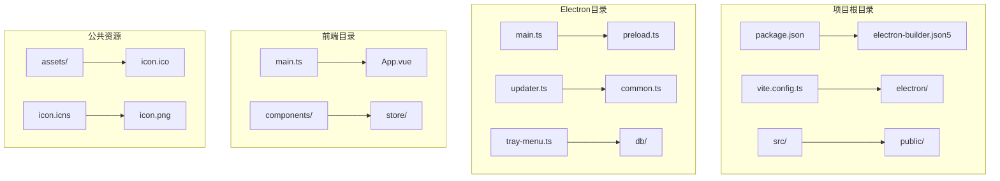
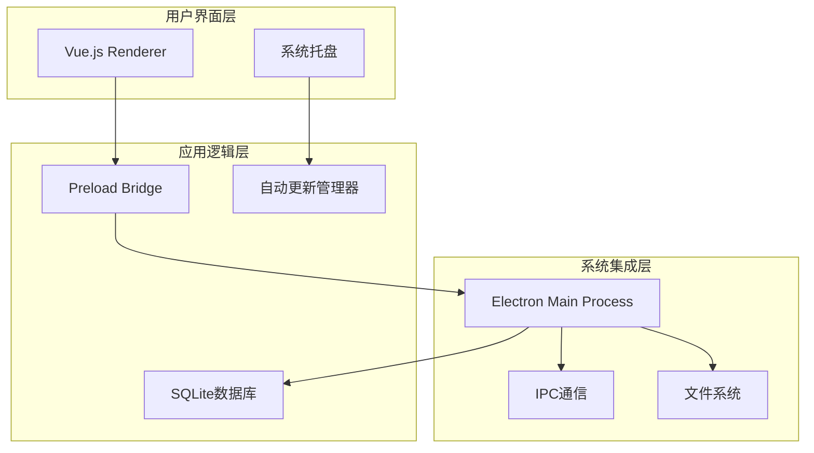
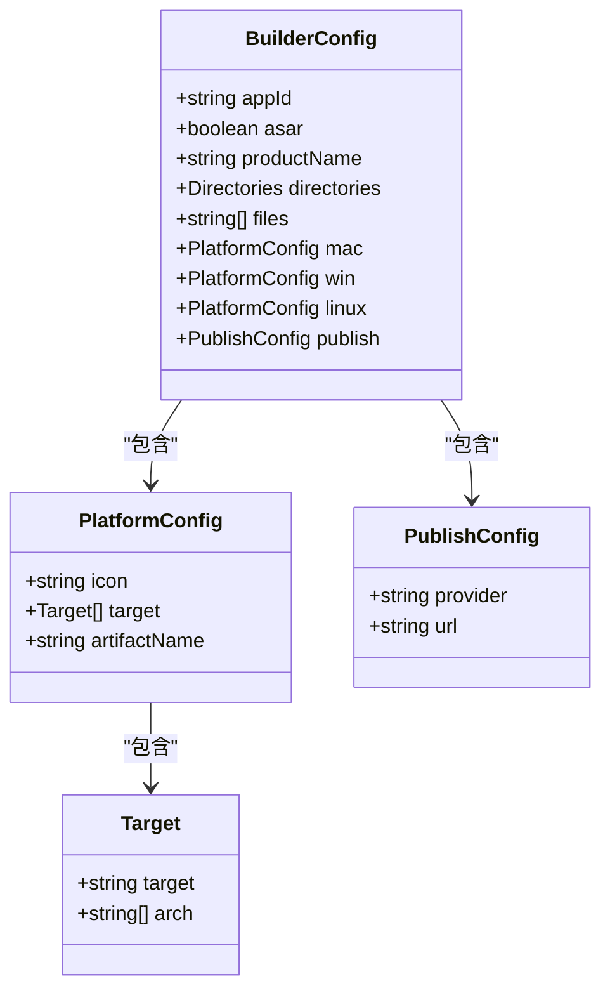
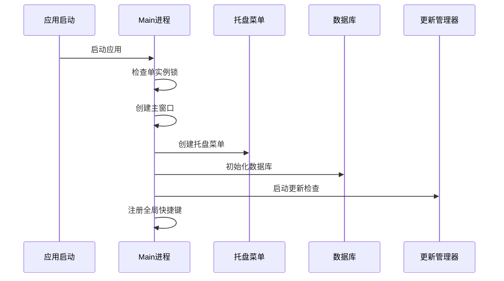
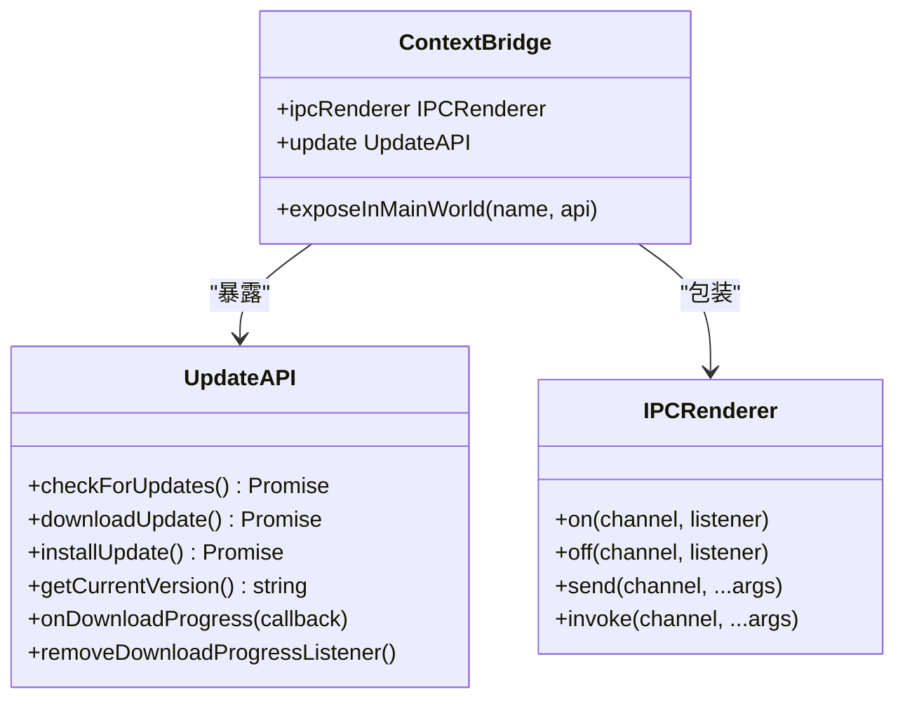
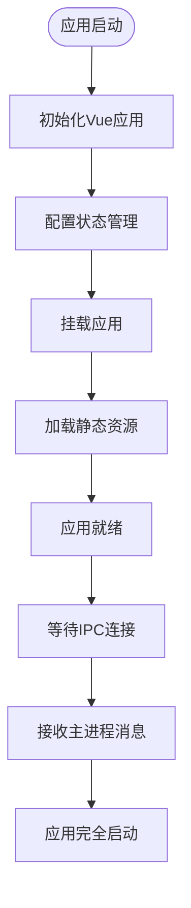
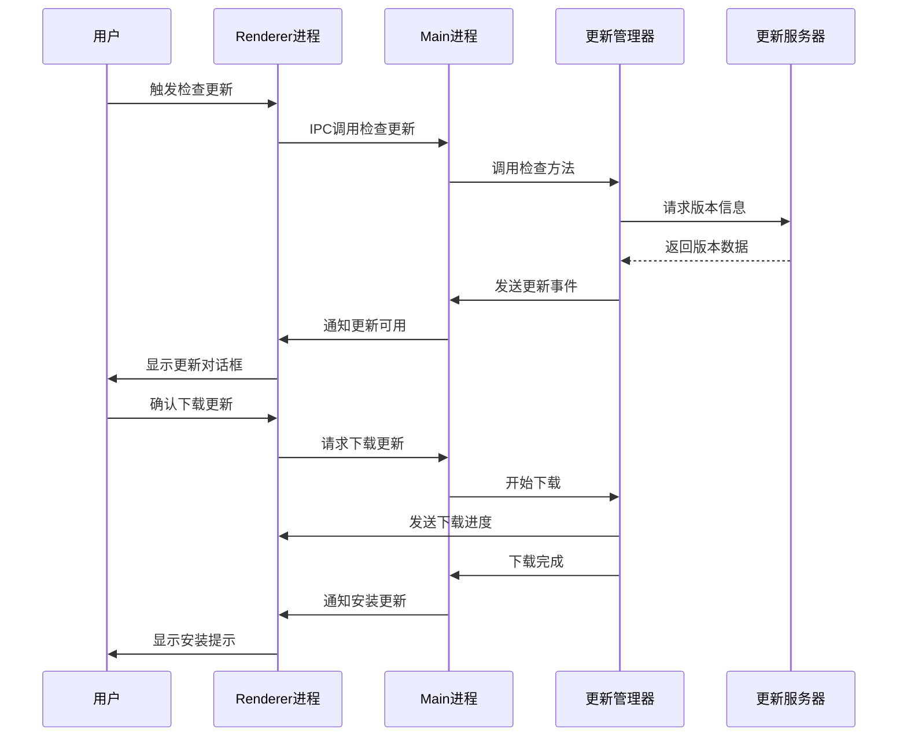
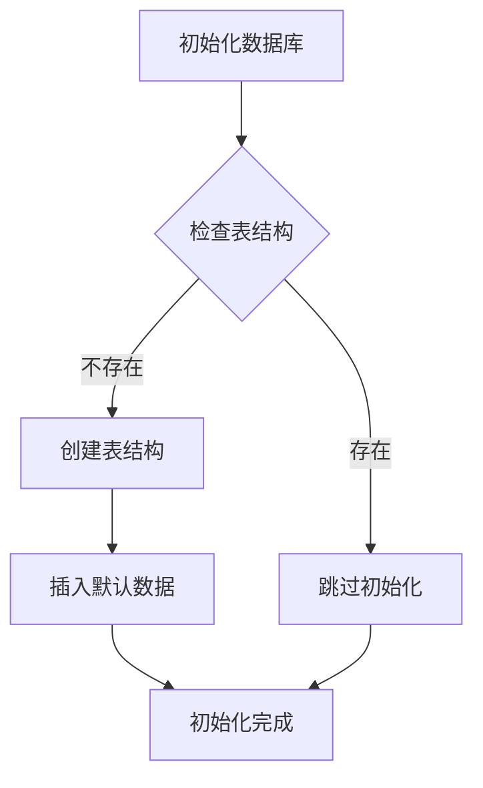
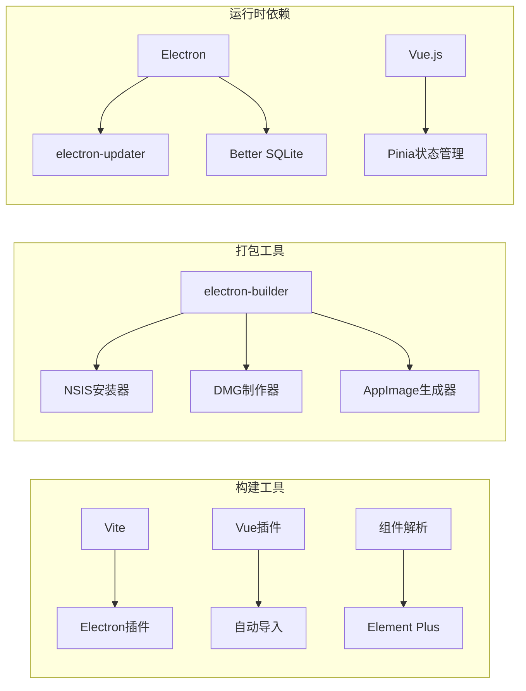

# Electron打包配置

<cite>
**本文档引用的文件**
- [electron-builder.json5](file://electron-builder.json5)
- [package.json](file://package.json)
- [vite.config.ts](file://vite.config.ts)
- [electron/main.ts](file://electron/main.ts)
- [electron/preload.ts](file://electron/preload.ts)
- [electron/updater.ts](file://electron/updater.ts)
- [electron/common.ts](file://electron/common.ts)
- [electron/tray-menu.ts](file://electron/tray-menu.ts)
- [src/main.ts](file://src/main.ts)
- [electron/db/sqlite/components/initSql.ts](file://electron/db/sqlite/components/initSql.ts)
</cite>

## 目录
1. [简介](#简介)
2. [项目结构](#项目结构)
3. [核心组件](#核心组件)
4. [架构概览](#架构概览)
5. [详细组件分析](#详细组件分析)
6. [依赖关系分析](#依赖关系分析)
7. [性能考虑](#性能考虑)
8. [故障排除指南](#故障排除指南)
9. [结论](#结论)

## 简介

本项目是一个基于Electron的密码管理器应用，采用现代化的开发工具链和打包配置。本文档详细解析了Electron打包配置，包括electron-builder.json5配置文件的各项设置、应用元数据、构建目标、输出配置和平台特定设置。同时涵盖了main进程、preload脚本和renderer进程的打包策略，以及图标配置、签名设置和安装程序生成等关键内容。

## 项目结构

该项目采用前后端分离的架构设计，主要包含以下关键目录和文件：

**图表来源**
- [package.json:1-51](file://package.json#L1-L51)
- [vite.config.ts:1-38](file://vite.config.ts#L1-L38)
- [electron-builder.json5:1-52](file://electron-builder.json5#L1-L52)

**章节来源**
- [package.json:1-51](file://package.json#L1-L51)
- [vite.config.ts:1-38](file://vite.config.ts#L1-L38)
- [electron-builder.json5:1-52](file://electron-builder.json5#L1-L52)

## 核心组件

### 应用元数据配置

应用的核心元数据在electron-builder.json5中进行集中配置：

- **应用标识**: `appId`设置为"password-manager"
- **产品名称**: `productName`设置为"password-manager"
- **版本信息**: 通过package.json中的version字段统一管理
- **应用描述**: 包含应用的基本描述信息

### 构建目标配置

项目支持多平台构建，每种平台都有特定的配置：

- **Windows**: 使用NSIS安装程序，目标架构为x64
- **macOS**: 生成DMG镜像文件
- **Linux**: 生成AppImage格式

### 输出配置

构建输出采用版本化的目录结构：
- 输出路径: `release/${version}`
- 包含文件: dist和dist-electron目录

**章节来源**
- [electron-builder.json5:1-52](file://electron-builder.json5#L1-L52)
- [package.json:1-51](file://package.json#L1-L51)

## 架构概览

项目采用三层架构模式，清晰分离了各层职责：

**图表来源**
- [electron/main.ts:1-240](file://electron/main.ts#L1-L240)
- [electron/preload.ts:1-39](file://electron/preload.ts#L1-L39)
- [electron/updater.ts:1-204](file://electron/updater.ts#L1-L204)

## 详细组件分析

### Electron Builder配置详解

#### 基础配置项

electron-builder.json5提供了完整的打包配置：

**图表来源**
- [electron-builder.json5:1-52](file://electron-builder.json5#L1-L52)

#### 平台特定配置

每个平台都有独特的配置要求：

**Windows配置特点**:
- 图标使用ICO格式
- NSIS安装程序提供交互式安装体验
- 支持自定义安装目录
- 不删除用户数据作为卸载选项

**macOS配置特点**:
- 使用ICNS图标格式
- 生成DMG镜像文件
- 自动命名规则包含架构信息

**Linux配置特点**:
- 使用PNG图标格式
- 生成AppImage可执行文件
- 简化的命名约定

**章节来源**
- [electron-builder.json5:14-46](file://electron-builder.json5#L14-L46)

### Main进程打包策略

Main进程是Electron应用的核心，负责应用生命周期管理和系统级功能：

#### 进程初始化流程

**图表来源**
- [electron/main.ts:44-60](file://electron/main.ts#L44-L60)
- [electron/tray-menu.ts:7-47](file://electron/tray-menu.ts#L7-L47)

#### 窗口管理策略

Main进程实现了智能的窗口管理机制：

- **单实例限制**: 防止多个实例同时运行
- **托盘集成**: 将应用隐藏到系统托盘
- **全局快捷键**: 支持跨平台的快捷键组合
- **自动启动**: 支持开机自启动功能

**章节来源**
- [electron/main.ts:44-127](file://electron/main.ts#L44-L127)
- [electron/common.ts:16-50](file://electron/common.ts#L16-L50)

### Preload脚本安全桥接

Preload脚本作为安全的桥接层，提供了受控的API访问：

#### API暴露策略

**图表来源**
- [electron/preload.ts:1-39](file://electron/preload.ts#L1-L39)

#### 安全特性

Preload脚本实现了严格的安全控制：

- **最小权限原则**: 仅暴露必要的API
- **类型安全**: 提供完整的TypeScript类型定义
- **错误隔离**: 防止渲染进程直接访问Node.js API
- **事件监听管理**: 提供清理机制防止内存泄漏

**章节来源**
- [electron/preload.ts:1-39](file://electron/preload.ts#L1-L39)

### Renderer进程集成

Renderer进程负责用户界面渲染，通过Vite进行构建：

#### 构建配置

Vite配置文件定义了完整的构建流程：

- **插件系统**: 集成了Vue、自动导入和组件解析
- **Electron支持**: 通过vite-plugin-electron提供原生支持
- **开发环境**: 支持热重载和调试功能
- **生产优化**: 自动生成Source Map和代码分割

#### 应用入口点

**图表来源**
- [src/main.ts:1-20](file://src/main.ts#L1-L20)

**章节来源**
- [vite.config.ts:18-35](file://vite.config.ts#L18-L35)
- [src/main.ts:1-20](file://src/main.ts#L1-L20)

### 自动更新系统

应用集成了完整的自动更新机制：

#### 更新流程

**图表来源**
- [electron/updater.ts:158-175](file://electron/updater.ts#L158-L175)
- [electron/main.ts:196-227](file://electron/main.ts#L196-L227)

#### 更新策略

更新系统采用了灵活的策略：

- **手动下载**: 默认不自动下载，用户可选择下载
- **版本跳过**: 支持用户跳过特定版本
- **自动检查**: 支持配置自动检查更新
- **进度监控**: 实时显示下载进度和速度
- **安全安装**: 下载完成后安全重启安装

**章节来源**
- [electron/updater.ts:1-204](file://electron/updater.ts#L1-L204)
- [electron/main.ts:196-240](file://electron/main.ts#L196-L240)

### 数据库集成

应用使用SQLite作为本地数据存储：

#### 数据库初始化

**图表来源**
- [electron/db/sqlite/components/initSql.ts:26-46](file://electron/db/sqlite/components/initSql.ts#L26-L46)

#### 数据模型设计

应用包含多个核心数据表：

- **用户分组表**: 管理密码条目的分类
- **密码信息表**: 存储具体的用户名、密码等信息
- **配置表**: 存储应用的各种配置选项
- **快捷键表**: 存储用户自定义的快捷键设置
- **对象存储表**: 支持云同步功能
- **更新版本表**: 管理更新相关的配置

**章节来源**
- [electron/db/sqlite/components/initSql.ts:48-129](file://electron/db/sqlite/components/initSql.ts#L48-L129)

## 依赖关系分析

### 构建工具链

项目采用现代化的构建工具链，确保开发效率和构建质量：

**图表来源**
- [package.json:18-44](file://package.json#L18-L44)
- [vite.config.ts:10-35](file://vite.config.ts#L10-L35)

### 版本兼容性

项目在版本选择上注重稳定性：

- **Electron**: v30.0.1 - 最新稳定版本
- **electron-builder**: v24.13.3 - 最新稳定版本
- **Vue.js**: v3.4.21 - 最新稳定版本
- **TypeScript**: v5.2.2 - 最新稳定版本

**章节来源**
- [package.json:35-43](file://package.json#L35-L43)

## 性能考虑

### 构建优化

项目在构建过程中采用了多项优化策略：

- **ASAR打包**: 启用asar压缩减少包体大小
- **代码分割**: Vite自动进行代码分割
- **资源优化**: 静态资源按需加载
- **缓存策略**: 利用浏览器缓存机制

### 内存管理

应用实现了严格的内存管理：

- **事件监听清理**: 预加载脚本提供清理方法
- **数据库连接池**: 合理管理数据库连接
- **托盘图标管理**: 及时释放系统资源
- **更新进程监控**: 防止更新过程中的内存泄漏

## 故障排除指南

### 常见问题及解决方案

#### 打包失败问题

**问题**: electron-builder构建失败
**原因**: 缺少必要的图标文件或权限问题
**解决方案**: 
- 确保所有平台的图标文件都存在
- 检查文件权限和路径正确性
- 验证electron-builder版本兼容性

#### 更新功能异常

**问题**: 自动更新无法正常工作
**原因**: 更新服务器配置或网络问题
**解决方案**:
- 检查更新服务器URL配置
- 验证网络连接和防火墙设置
- 确认证书配置正确

#### 数据库连接问题

**问题**: SQLite数据库无法连接
**原因**: 数据库文件损坏或权限问题
**解决方案**:
- 检查数据库文件完整性
- 验证文件读写权限
- 重新初始化数据库结构

**章节来源**
- [electron/updater.ts:38-97](file://electron/updater.ts#L38-L97)
- [electron/db/sqlite/components/initSql.ts:26-46](file://electron/db/sqlite/components/initSql.ts#L26-L46)

## 结论

本项目的Electron打包配置展现了现代桌面应用开发的最佳实践。通过合理的架构设计、完善的配置管理和严格的安全控制，实现了跨平台的稳定运行和良好的用户体验。

关键优势包括：

- **完整的跨平台支持**: Windows、macOS、Linux三平台统一配置
- **安全的架构设计**: 通过Preload脚本实现安全的API桥接
- **智能化的更新机制**: 灵活的更新策略和用户友好的交互
- **现代化的开发工具链**: Vite + Electron + Vue的高效组合
- **完善的错误处理**: 全面的异常捕获和用户反馈机制

这些配置为类似的应用开发提供了优秀的参考模板，既保证了功能的完整性，又确保了系统的稳定性和安全性。