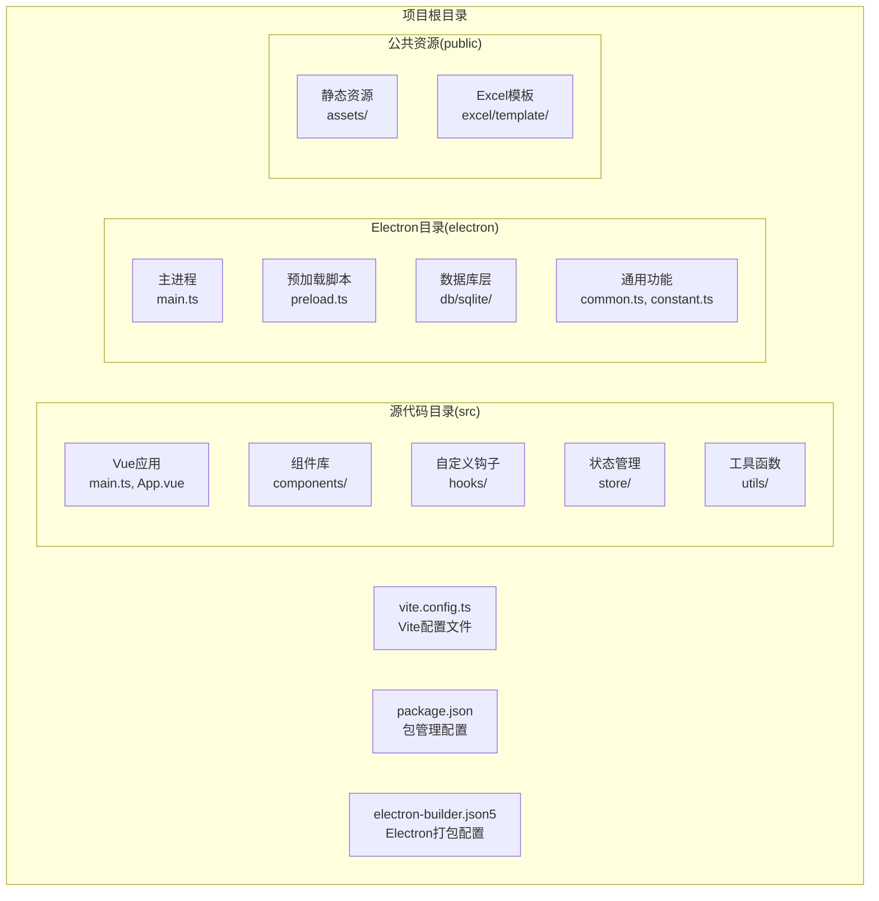
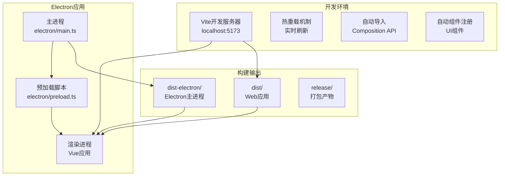
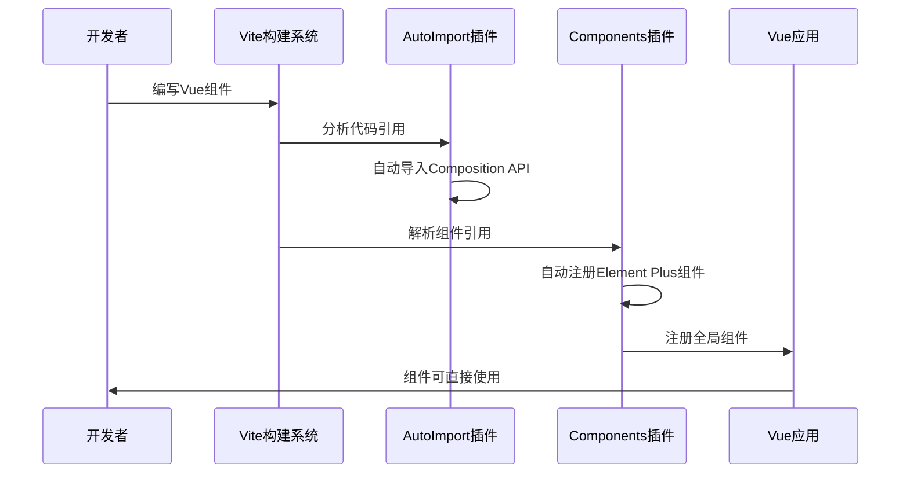
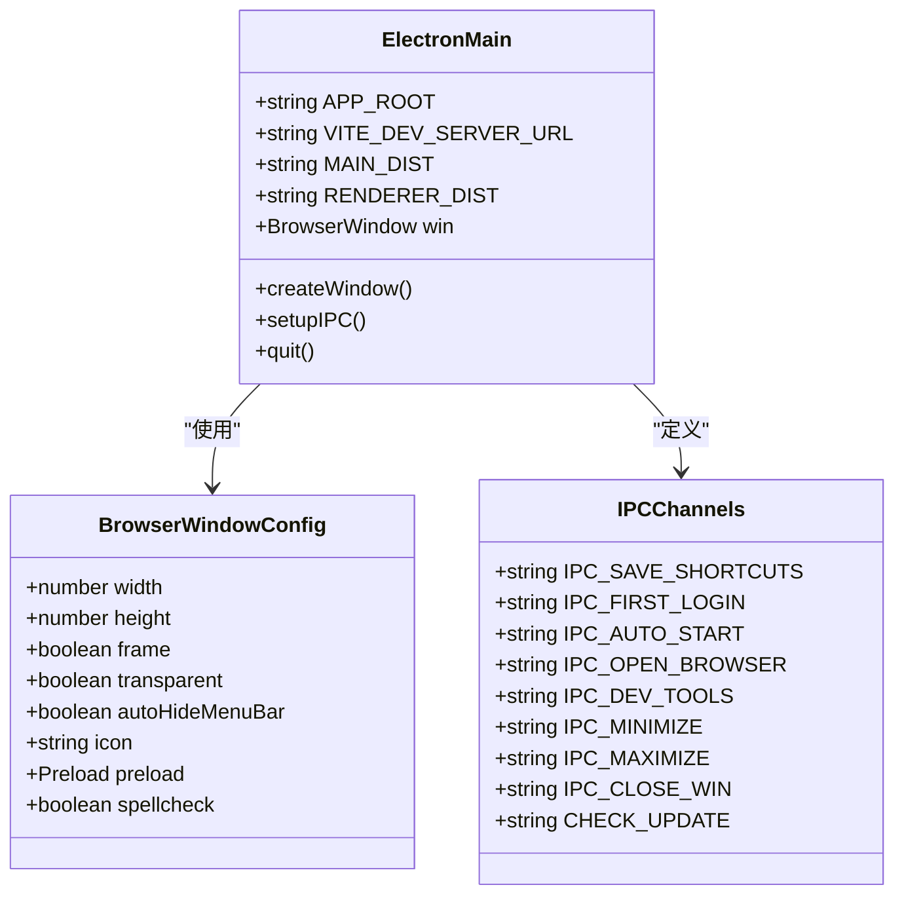
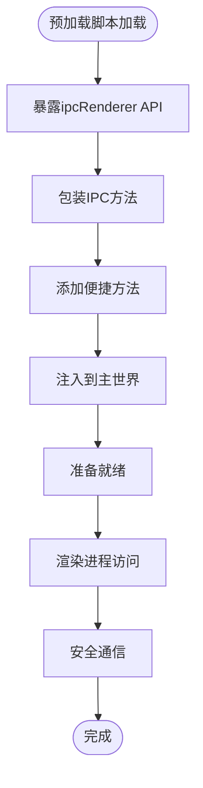
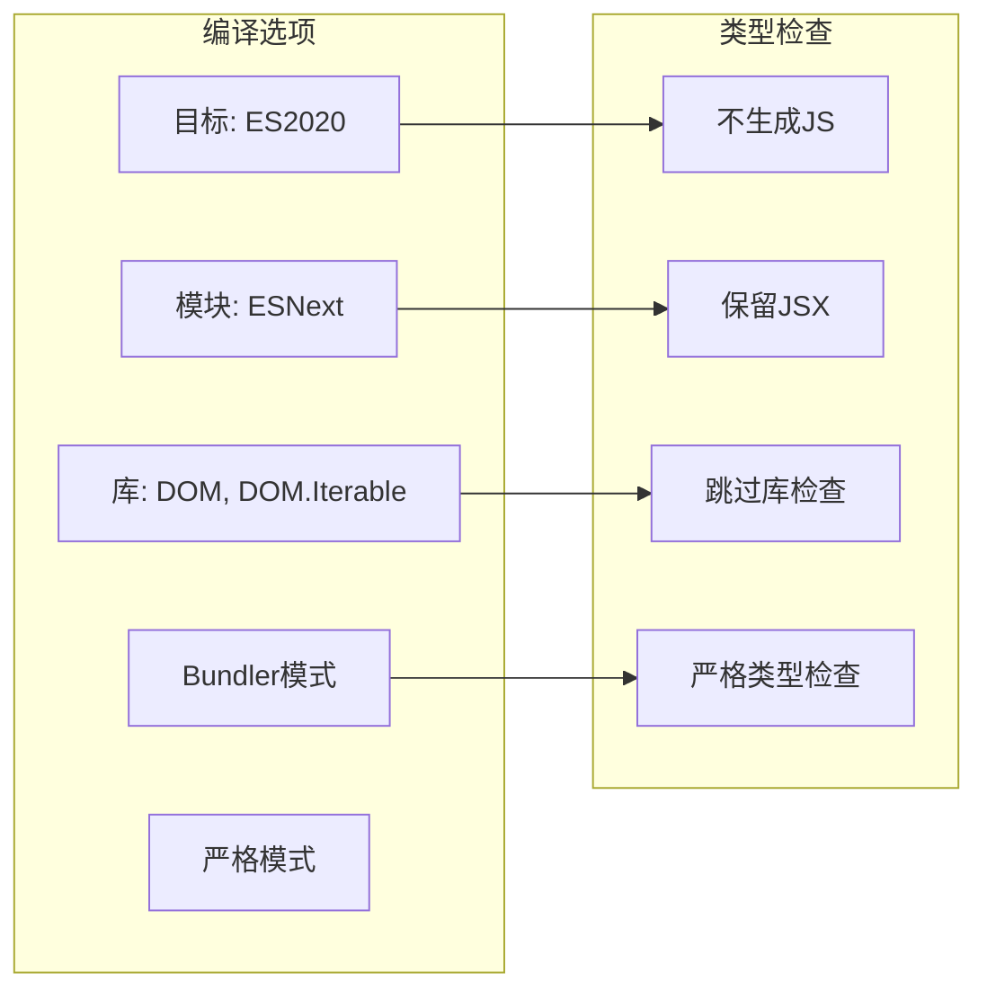
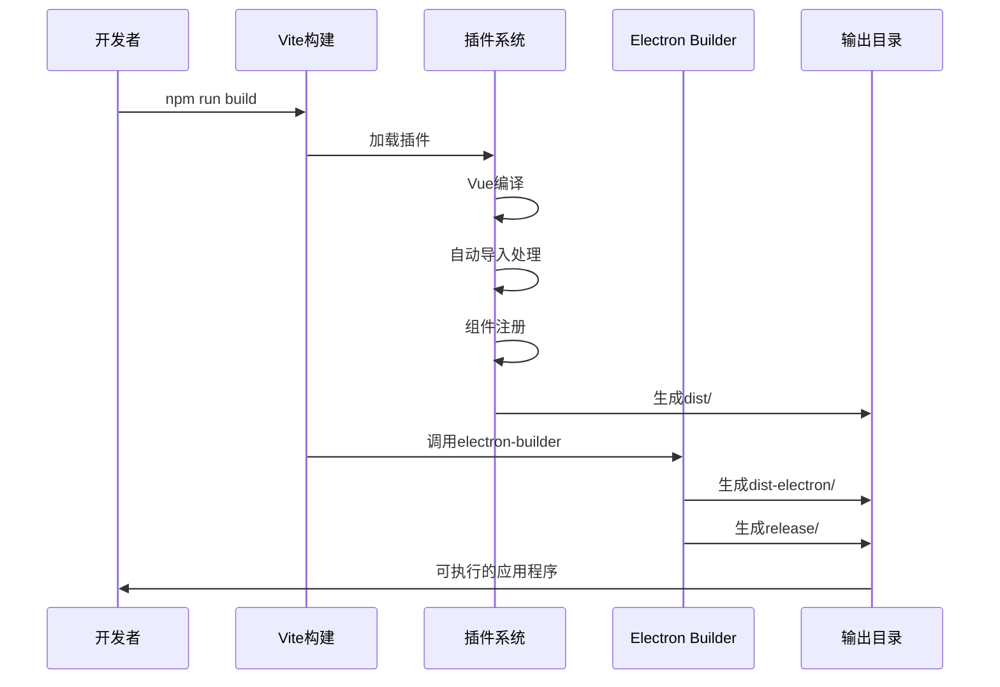

# Vite构建配置

<cite>
**本文档引用的文件**
- [vite.config.ts](file://vite.config.ts)
- [package.json](file://package.json)
- [electron-builder.json5](file://electron-builder.json5)
- [src/main.ts](file://src/main.ts)
- [electron/main.ts](file://electron/main.ts)
- [electron/preload.ts](file://electron/preload.ts)
- [auto-imports.d.ts](file://auto-imports.d.ts)
- [components.d.ts](file://components.d.ts)
- [tsconfig.json](file://tsconfig.json)
- [tsconfig.node.json](file://tsconfig.node.json)
- [src/App.vue](file://src/App.vue)
- [index.html](file://index.html)
</cite>

## 目录
1. [简介](#简介)
2. [项目结构](#项目结构)
3. [核心组件](#核心组件)
4. [架构概览](#架构概览)
5. [详细组件分析](#详细组件分析)
6. [依赖关系分析](#依赖关系分析)
7. [性能考虑](#性能考虑)
8. [故障排除指南](#故障排除指南)
9. [结论](#结论)
10. [附录](#附录)

## 简介

本项目采用Vite作为构建工具，结合Electron实现跨平台桌面应用开发。该密码管理器项目通过Vite的现代化构建特性，实现了快速开发、热重载和高效的生产构建。项目配置了Vue 3支持、自动导入功能、组件自动注册以及完整的Electron集成。

## 项目结构

该项目采用前后端分离的架构设计，主要包含以下核心目录：



**图表来源**
- [vite.config.ts:1-38](file://vite.config.ts#L1-L38)
- [package.json:1-51](file://package.json#L1-L51)

**章节来源**
- [vite.config.ts:1-38](file://vite.config.ts#L1-L38)
- [package.json:1-51](file://package.json#L1-L51)

## 核心组件

### Vite构建配置

项目的核心构建配置位于`vite.config.ts`文件中，集成了多个关键插件以支持现代前端开发需求：

#### Vue插件配置
- **作用**: 提供Vue 3单文件组件(SFC)编译支持
- **特性**: 支持TypeScript、热重载、CSS提取等
- **配置**: 默认配置，无需特殊参数

#### AutoImport插件配置
- **作用**: 自动导入Vue Composition API和其他常用函数
- **解析器**: ElementPlusResolver() - 自动导入Element Plus组件
- **效果**: 开发者无需手动导入ref、reactive、computed等API

#### Components插件配置
- **作用**: 自动注册Vue组件，支持按需导入
- **解析器**: ElementPlusResolver() - 自动导入Element Plus UI组件
- **效果**: 组件可直接使用，无需在每个文件中单独导入

#### Electron插件集成
- **主进程**: 配置入口为`electron/main.ts`
- **预加载脚本**: 配置入口为`electron/preload.ts`
- **渲染进程**: 条件启用，测试环境下禁用
- **Node.js API**: 为渲染进程提供Node.js API支持

**章节来源**
- [vite.config.ts:9-37](file://vite.config.ts#L9-L37)

### 构建脚本配置

项目通过`package.json`定义了完整的构建生命周期：

| 脚本命令 | 功能描述 | 执行流程 |
|---------|----------|----------|
| `dev` | 开发服务器启动 | 启动Vite开发服务器，支持热重载 |
| `build` | 生产构建 | Vite构建 + Electron Builder打包 |
| `preview` | 预览构建结果 | 启动本地预览服务器 |
| `postinstall` | 安装后执行 | 电子构建依赖安装 |

**章节来源**
- [package.json:12-16](file://package.json#L12-L16)

## 架构概览

项目采用双进程架构，结合Vite的现代化开发体验：



**图表来源**
- [vite.config.ts:18-35](file://vite.config.ts#L18-L35)
- [electron/main.ts:32-39](file://electron/main.ts#L32-L39)

## 详细组件分析

### Vue插件系统

#### 组件自动注册机制



**图表来源**
- [vite.config.ts:12-17](file://vite.config.ts#L12-L17)
- [components.d.ts:8-63](file://components.d.ts#L8-L63)

#### 自动导入生成机制

项目通过`auto-imports.d.ts`和`components.d.ts`文件提供类型声明：

- **auto-imports.d.ts**: 声明自动导入的Vue Composition API函数
- **components.d.ts**: 声明所有可用的Vue组件类型

**章节来源**
- [auto-imports.d.ts:1-10](file://auto-imports.d.ts#L1-L10)
- [components.d.ts:1-65](file://components.d.ts#L1-L65)

### Electron集成配置

#### 主进程配置分析



**图表来源**
- [electron/main.ts:32-39](file://electron/main.ts#L32-L39)
- [electron/main.ts:65-81](file://electron/main.ts#L65-L81)

#### 预加载脚本设计

预加载脚本通过`contextBridge`安全地暴露API给渲染进程：



**图表来源**
- [electron/preload.ts:4-38](file://electron/preload.ts#L4-L38)

**章节来源**
- [electron/main.ts:1-240](file://electron/main.ts#L1-L240)
- [electron/preload.ts:1-39](file://electron/preload.ts#L1-L39)

### TypeScript配置

#### 编译选项分析

项目采用严格的TypeScript配置：



**图表来源**
- [tsconfig.json:2-24](file://tsconfig.json#L2-L24)

**章节来源**
- [tsconfig.json:1-37](file://tsconfig.json#L1-L37)
- [tsconfig.node.json:1-14](file://tsconfig.node.json#L1-L14)

## 依赖关系分析

### 插件依赖图

```mermaid
graph TB
subgraph "Vite插件生态系统"
ViteCore[Vite核心]
subgraph "Vue生态"
VuePlugin[@vitejs/plugin-vue]
VueTS[Vue TypeScript]
end
subgraph "自动导入"
AutoImport[unplugin-auto-import]
Components[unplugin-vue-components]
ElementPlus[ElementPlusResolver]
end
subgraph "Electron集成"
ElectronPlugin[vite-plugin-electron]
ElectronRenderer[vite-plugin-electron-renderer]
end
subgraph "开发工具"
TypeChecking[TypeScript]
ESLint[代码检查]
end
end
ViteCore --> VuePlugin
ViteCore --> AutoImport
ViteCore --> Components
ViteCore --> ElectronPlugin
AutoImport --> ElementPlus
Components --> ElementPlus
ElectronPlugin --> ElectronRenderer
```

**图表来源**
- [vite.config.ts:3-7](file://vite.config.ts#L3-L7)
- [package.json:30-44](file://package.json#L30-L44)

### 构建流程依赖



**图表来源**
- [package.json:14](file://package.json#L14)
- [electron-builder.json5:1-52](file://electron-builder.json5#L1-L52)

**章节来源**
- [package.json:1-51](file://package.json#L1-L51)
- [electron-builder.json5:1-52](file://electron-builder.json5#L1-L52)

## 性能考虑

### 构建优化策略

#### 模块解析优化
- **Bundler模式**: 使用`moduleResolution: "bundler"`提高模块解析效率
- **路径映射**: 通过`path`模块进行精确的文件路径处理
- **条件加载**: Electron插件根据环境变量动态启用

#### 缓存和增量构建
- **Vite内置缓存**: 利用Vite的快速缓存机制
- **TypeScript增量编译**: 通过`composite`选项支持增量编译
- **预构建依赖**: Electron Builder预构建Node模块

#### 资源优化
- **ASAR打包**: Electron应用打包为ASAR格式
- **文件过滤**: 精确控制打包文件列表
- **平台特定配置**: 针对不同平台的优化配置

**章节来源**
- [vite.config.ts:18-35](file://vite.config.ts#L18-L35)
- [electron-builder.json5:5](file://electron-builder.json5#L5)

## 故障排除指南

### 常见问题及解决方案

#### 开发服务器无法启动
1. **检查端口占用**: 确认5173端口未被其他进程占用
2. **清理缓存**: 删除`node_modules/.vite`目录
3. **重新安装依赖**: 执行`npm ci`重新安装

#### Electron热重载问题
1. **检查环境变量**: 确认`VITE_DEV_SERVER_URL`已正确设置
2. **验证插件配置**: 检查Electron插件的renderer配置
3. **重启开发服务器**: 完全重启Vite开发服务器

#### 组件导入错误
1. **检查类型声明**: 确认`components.d.ts`文件存在且有效
2. **清理生成文件**: 删除`auto-imports.d.ts`和`components.d.ts`
3. **重新生成声明**: 重新启动开发服务器

#### 打包失败问题
1. **检查文件权限**: 确认所有文件具有正确的读取权限
2. **验证构建配置**: 检查`electron-builder.json5`配置
3. **清理构建目录**: 删除`dist`和`dist-electron`目录

**章节来源**
- [vite.config.ts:31-34](file://vite.config.ts#L31-L34)
- [electron/main.ts:92-96](file://electron/main.ts#L92-L96)

## 结论

本项目的Vite构建配置展现了现代前端开发的最佳实践，通过精心设计的插件系统实现了：

1. **开发体验优化**: 自动导入和组件注册大幅提升了开发效率
2. **架构清晰**: Electron集成提供了稳定的桌面应用基础
3. **性能优秀**: 多层次的优化策略确保了良好的构建和运行性能
4. **维护友好**: 清晰的配置结构便于后续维护和扩展

该配置方案为类似的企业级桌面应用开发提供了优秀的参考模板。

## 附录

### 配置参数详解

#### Vite插件配置参数

| 参数名称 | 类型 | 默认值 | 说明 |
|---------|------|--------|------|
| `entry` | string | 必填 | Electron主进程入口文件路径 |
| `input` | string | 必填 | 预加载脚本输入路径 |
| `renderer` | object | 可选 | 渲染进程配置对象 |
| `resolvers` | Array | 数组 | 解析器数组，用于自动导入 |

#### Electron Builder配置参数

| 参数名称 | 类型 | 默认值 | 说明 |
|---------|------|--------|------|
| `appId` | string | 必填 | 应用唯一标识符 |
| `asar` | boolean | true | 是否启用ASAR打包 |
| `directories.output` | string | 必填 | 输出目录路径 |
| `files` | Array | 必填 | 打包文件列表 |
| `publish` | object | 可选 | 发布配置 |

### 使用示例

#### 开发环境启动
```bash
# 启动开发服务器
npm run dev

# 预览构建结果
npm run preview
```

#### 生产环境构建
```bash
# 生产构建
npm run build

# 清理构建缓存
npm run clean
```

#### 配置修改指南

1. **修改插件配置**: 编辑`vite.config.ts`中的插件配置
2. **调整TypeScript设置**: 修改`tsconfig.json`编译选项
3. **优化Electron配置**: 更新`electron-builder.json5`打包设置
4. **添加新插件**: 在`package.json`中添加依赖并在`vite.config.ts`中引入

**章节来源**
- [vite.config.ts:1-38](file://vite.config.ts#L1-L38)
- [package.json:12-16](file://package.json#L12-L16)