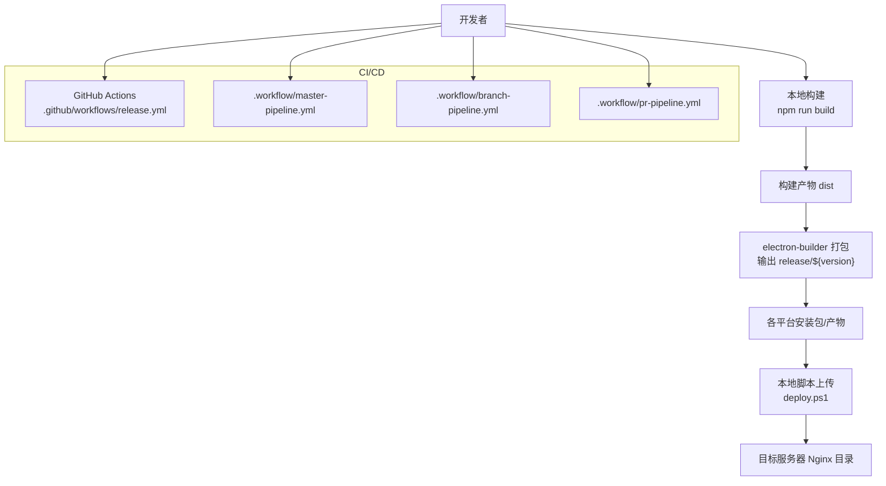
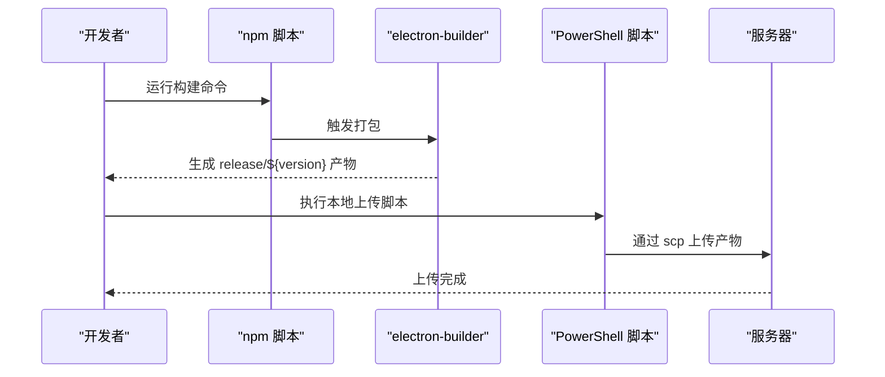
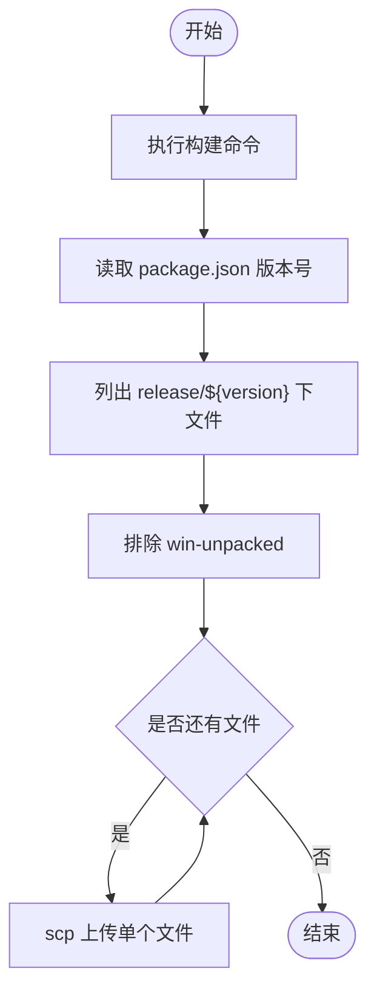
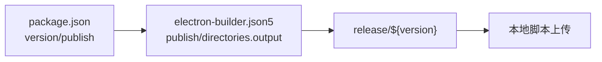
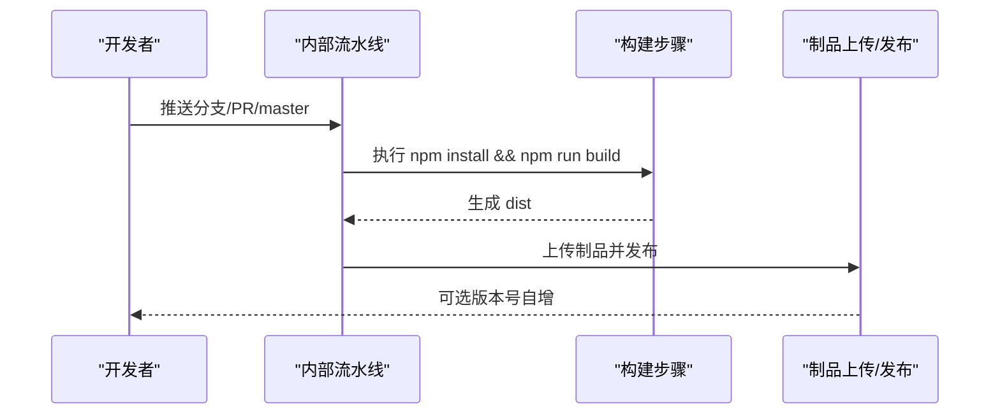
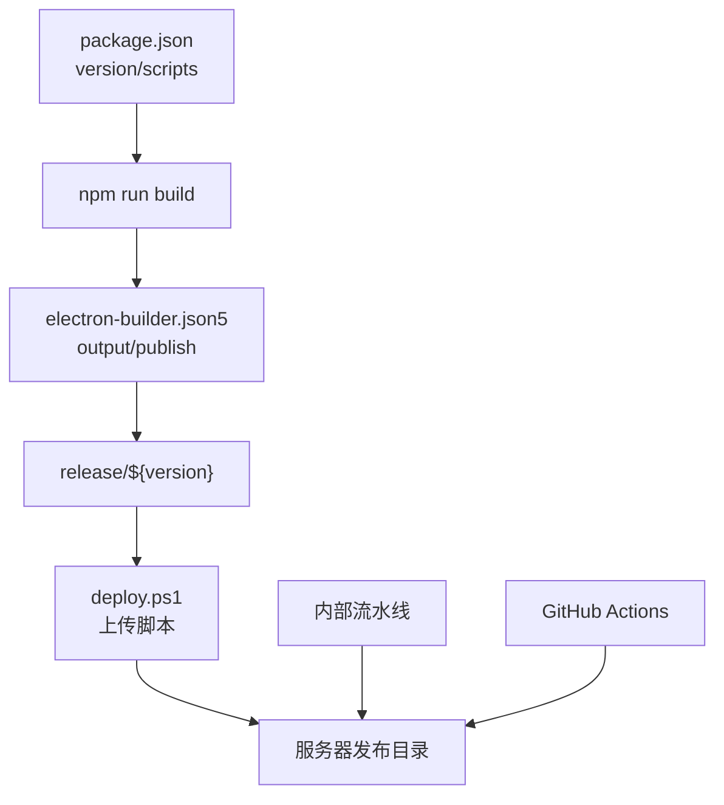

# 发布与部署

<cite>
**本文引用的文件**
- [deploy.ps1](file://deploy.ps1)
- [package.json](file://package.json)
- [electron-builder.json5](file://electron-builder.json5)
- [.github/workflows/release.yml](file://.github/workflows/release.yml)
- [.workflow/master-pipeline.yml](file://.workflow/master-pipeline.yml)
- [.workflow/pr-pipeline.yml](file://.workflow/pr-pipeline.yml)
- [.workflow/branch-pipeline.yml](file://.workflow/branch-pipeline.yml)
</cite>

## 目录
1. [简介](#简介)
2. [项目结构](#项目结构)
3. [核心组件](#核心组件)
4. [架构总览](#架构总览)
5. [详细组件分析](#详细组件分析)
6. [依赖关系分析](#依赖关系分析)
7. [性能考虑](#性能考虑)
8. [故障排查指南](#故障排查指南)
9. [结论](#结论)
10. [附录](#附录)

## 简介
本文件系统化梳理本项目的发布与部署流程，覆盖本地部署脚本使用、版本管理策略、发布标签与变更日志维护、手动发布流程与自动化发布配置、多环境（测试、预发布、生产）部署策略、回滚机制、版本兼容性检查、部署验证步骤以及部署后的监控与故障恢复流程。内容基于仓库中的实际配置文件整理而成，确保读者能够按步骤完成从构建到发布的全流程。

## 项目结构
本项目采用前端+Electron桌面端的混合架构，构建与发布通过 npm 脚本与 electron-builder 配置驱动，并辅以本地 PowerShell 脚本实现一键上传至目标服务器。CI/CD 方面，仓库同时提供了 GitHub Actions 的发布模板与内部流水线（.workflow）配置，分别用于不同场景下的自动化发布。

图表来源
- [package.json:12-17](file://package.json#L12-L17)
- [electron-builder.json5:7-13](file://electron-builder.json5#L7-L13)
- [deploy.ps1:1-21](file://deploy.ps1#L1-L21)
- [.github/workflows/release.yml:1-51](file://.github/workflows/release.yml#L1-L51)
- [.workflow/master-pipeline.yml:1-50](file://.workflow/master-pipeline.yml#L1-L50)
- [.workflow/branch-pipeline.yml:1-52](file://.workflow/branch-pipeline.yml#L1-L52)
- [.workflow/pr-pipeline.yml:1-37](file://.workflow/pr-pipeline.yml#L1-L37)

章节来源
- [package.json:12-17](file://package.json#L12-L17)
- [electron-builder.json5:7-13](file://electron-builder.json5#L7-L13)
- [deploy.ps1:1-21](file://deploy.ps1#L1-L21)
- [.github/workflows/release.yml:1-51](file://.github/workflows/release.yml#L1-L51)
- [.workflow/master-pipeline.yml:1-50](file://.workflow/master-pipeline.yml#L1-L50)
- [.workflow/branch-pipeline.yml:1-52](file://.workflow/branch-pipeline.yml#L1-L52)
- [.workflow/pr-pipeline.yml:1-37](file://.workflow/pr-pipeline.yml#L1-L37)

## 核心组件
- 本地构建与打包
  - 构建命令：通过 npm 脚本触发 Vite 构建与 electron-builder 打包，生成桌面端安装包与 Web 预览资源。
  - 输出目录：electron-builder 将产物输出到 release/${version}，其中 ${version} 来源于 package.json 的版本号。
- 本地上传脚本
  - 自动读取版本号，遍历 release/${version} 下的文件（排除 win-unpacked），通过 scp 上传至指定服务器路径。
- 版本与发布配置
  - package.json 中定义了版本号与发布地址；electron-builder.json5 定义了跨平台打包规则与发布地址。
- CI/CD 流水线
  - GitHub Actions 提供了发布模板（注释状态，未启用）。
  - 内部流水线包含 master、分支与 PR 三类流水线，分别负责构建、制品上传与版本发布。

章节来源
- [package.json:4](file://package.json#L4)
- [package.json:12-17](file://package.json#L12-L17)
- [electron-builder.json5:7-13](file://electron-builder.json5#L7-L13)
- [deploy.ps1:4-21](file://deploy.ps1#L4-L21)
- [.github/workflows/release.yml:1-51](file://.github/workflows/release.yml#L1-L51)
- [.workflow/master-pipeline.yml:15-31](file://.workflow/master-pipeline.yml#L15-L31)
- [.workflow/branch-pipeline.yml:15-31](file://.workflow/branch-pipeline.yml#L15-L31)
- [.workflow/pr-pipeline.yml:15-31](file://.workflow/pr-pipeline.yml#L15-L31)

## 架构总览
下图展示了从本地开发到服务器部署的整体流程，以及 CI/CD 的两条路径（本地脚本与内部流水线）：

图表来源
- [package.json:12-17](file://package.json#L12-L17)
- [electron-builder.json5:7-13](file://electron-builder.json5#L7-L13)
- [deploy.ps1:1-21](file://deploy.ps1#L1-L21)

章节来源
- [package.json:12-17](file://package.json#L12-L17)
- [electron-builder.json5:7-13](file://electron-builder.json5#L7-L13)
- [deploy.ps1:1-21](file://deploy.ps1#L1-L21)

## 详细组件分析

### 本地部署脚本（deploy.ps1）
- 功能概述
  - 先执行构建，再从 package.json 读取版本号，随后将 release/${version} 目录下的文件逐个上传至服务器（排除 win-unpacked 文件夹）。
- 关键行为
  - 读取版本号：通过 Node 命令从 package.json 获取版本字符串并去除空白。
  - 过滤上传文件：仅上传 release/${version} 下的文件项，跳过 win-unpacked。
  - 传输协议：使用 scp 将文件夹上传到服务器指定路径。
- 使用建议
  - 在执行前确保已安装 Node、npm 与 scp 工具。
  - 确认服务器地址与用户权限配置正确。
  - 如需上传特定平台产物，可在脚本中调整过滤逻辑或直接上传对应子目录。

图表来源
- [deploy.ps1:1-21](file://deploy.ps1#L1-L21)
- [package.json:4](file://package.json#L4)

章节来源
- [deploy.ps1:1-21](file://deploy.ps1#L1-L21)
- [package.json:4](file://package.json#L4)

### 版本管理与发布配置
- 版本来源
  - package.json 的 version 字段为版本号来源，本地脚本与 electron-builder 均依赖该值。
- 发布地址
  - package.json 的 publish 字段与 electron-builder.json5 的 publish 字段均指向同一通用发布地址，用于分发安装包与更新资源。
- 打包输出
  - electron-builder.json5 的 directories.output 指定产物输出到 release/${version}，便于按版本归档与上传。

图表来源
- [package.json:4](file://package.json#L4)
- [package.json:45-48](file://package.json#L45-L48)
- [electron-builder.json5:7-13](file://electron-builder.json5#L7-L13)
- [electron-builder.json5:47-50](file://electron-builder.json5#L47-L50)

章节来源
- [package.json:4](file://package.json#L4)
- [package.json:45-48](file://package.json#L45-L48)
- [electron-builder.json5:7-13](file://electron-builder.json5#L7-L13)
- [electron-builder.json5:47-50](file://electron-builder.json5#L47-L50)

### CI/CD 自动化发布
- GitHub Actions（模板）
  - 当前为注释状态，未启用。若启用，将在推送标签时触发构建与发布流程。
- 内部流水线
  - master-pipeline：在 master 分支触发，执行构建并将制品上传，随后发布并可选择版本号自增。
  - branch-pipeline：在非 master 分支触发，执行构建与制品上传，发布阶段可设置初始版本号并自增。
  - pr-pipeline：在 PR 合并到 master 时触发，执行构建与制品上传。

图表来源
- [.workflow/master-pipeline.yml:15-31](file://.workflow/master-pipeline.yml#L15-L31)
- [.workflow/branch-pipeline.yml:15-31](file://.workflow/branch-pipeline.yml#L15-L31)
- [.workflow/pr-pipeline.yml:15-31](file://.workflow/pr-pipeline.yml#L15-L31)

章节来源
- [.github/workflows/release.yml:1-51](file://.github/workflows/release.yml#L1-L51)
- [.workflow/master-pipeline.yml:1-50](file://.workflow/master-pipeline.yml#L1-L50)
- [.workflow/branch-pipeline.yml:1-52](file://.workflow/branch-pipeline.yml#L1-L52)
- [.workflow/pr-pipeline.yml:1-37](file://.workflow/pr-pipeline.yml#L1-L37)

### 多环境部署策略
- 测试环境
  - 通过 PR 或分支流水线构建与上传制品，便于快速验证功能与修复。
- 预发布环境
  - 可沿用分支流水线的发布阶段，设置合适的初始版本号并开启自增，形成预发布版本序列。
- 生产环境
  - 通过 master 流水线或本地脚本上传至生产服务器；如启用 GitHub Actions，可在打上正式标签后触发发布。

章节来源
- [.workflow/master-pipeline.yml:45-50](file://.workflow/master-pipeline.yml#L45-L50)
- [.workflow/branch-pipeline.yml:46-52](file://.workflow/branch-pipeline.yml#L46-L52)
- [.workflow/pr-pipeline.yml:33-37](file://.workflow/pr-pipeline.yml#L33-L37)

### 回滚机制
- 产物归档
  - 由于 electron-builder 输出到 release/${version}，可按版本保留历史产物，便于回滚。
- 回滚步骤建议
  - 保留最近 N 个版本的安装包与 Web 资源。
  - 回滚时重新执行本地脚本，将目标版本的产物上传至服务器对应目录。
- 注意事项
  - 回滚前确认服务器路径与权限。
  - 对于增量更新或自动更新机制，需同步调整版本号与更新源。

章节来源
- [electron-builder.json5:7-13](file://electron-builder.json5#L7-L13)
- [deploy.ps1:10-21](file://deploy.ps1#L10-L21)

### 版本兼容性检查
- 平台兼容
  - electron-builder.json5 针对 macOS、Windows（NSIS）、Linux（AppImage）分别配置了目标与产物命名，确保各平台产物独立且可识别。
- 依赖兼容
  - package.json 的依赖版本固定，建议在升级依赖前进行全量回归测试。
- 自动更新兼容
  - 若启用自动更新，需保证发布地址与产物命名规则稳定，避免客户端无法识别新版本。

章节来源
- [electron-builder.json5:14-46](file://electron-builder.json5#L14-L46)
- [package.json:18-29](file://package.json#L18-L29)

### 部署验证步骤
- 本地验证
  - 构建完成后，在 release/${version} 目录核对各平台产物是否存在。
  - 使用 scp 上传后，登录服务器检查目标目录文件完整性。
- 功能验证
  - 在测试机上安装最新安装包，验证核心功能与界面显示。
- 自动更新验证（如启用）
  - 确认客户端能正确检测到新版本并完成下载与重启。

章节来源
- [deploy.ps1:17-21](file://deploy.ps1#L17-L21)
- [electron-builder.json5:47-50](file://electron-builder.json5#L47-L50)

## 依赖关系分析
- 构建链路
  - npm run build 依赖 electron-builder，后者根据 electron-builder.json5 的配置输出到 release/${version}。
- 上传链路
  - deploy.ps1 依赖 package.json 的版本号与 electron-builder 的输出目录结构。
- 发布链路
  - 本地脚本与内部流水线均可将制品上传至统一发布地址；GitHub Actions 模板可作为外部发布补充。

图表来源
- [package.json:12-17](file://package.json#L12-L17)
- [electron-builder.json5:7-13](file://electron-builder.json5#L7-L13)
- [deploy.ps1:1-21](file://deploy.ps1#L1-L21)
- [.workflow/master-pipeline.yml:15-31](file://.workflow/master-pipeline.yml#L15-L31)
- [.github/workflows/release.yml:1-51](file://.github/workflows/release.yml#L1-L51)

章节来源
- [package.json:12-17](file://package.json#L12-L17)
- [electron-builder.json5:7-13](file://electron-builder.json5#L7-L13)
- [deploy.ps1:1-21](file://deploy.ps1#L1-L21)
- [.workflow/master-pipeline.yml:15-31](file://.workflow/master-pipeline.yml#L15-L31)
- [.github/workflows/release.yml:1-51](file://.github/workflows/release.yml#L1-L51)

## 性能考虑
- 构建优化
  - 使用 electron-builder 的 asar 打包提升加载性能。
  - 控制产物体积，避免不必要的资源进入 release 目录。
- 上传效率
  - 本地脚本逐文件上传，建议在文件较多时评估并发或增量上传策略。
- 发布地址稳定性
  - 统一发布地址与命名规则，减少客户端解析与缓存问题。

章节来源
- [electron-builder.json5:5](file://electron-builder.json5#L5)
- [electron-builder.json5:47-50](file://electron-builder.json5#L47-L50)

## 故障排查指南
- 构建失败
  - 检查 npm run build 是否成功，确认依赖安装与 Node 版本兼容。
- 上传失败
  - 确认 scp 工具可用、服务器地址与凭据正确，检查防火墙与网络连通性。
- 版本不一致
  - 确认 package.json 的 version 与 electron-builder 的输出目录一致，避免上传到错误路径。
- 自动更新异常
  - 检查发布地址与产物命名规则，确保客户端可访问并识别新版本。

章节来源
- [package.json:12-17](file://package.json#L12-L17)
- [deploy.ps1:17-21](file://deploy.ps1#L17-L21)
- [electron-builder.json5:7-13](file://electron-builder.json5#L7-L13)

## 结论
本项目通过 npm 脚本与 electron-builder 实现跨平台打包，结合本地 PowerShell 脚本与内部流水线，形成了可扩展的发布与部署体系。建议在现有基础上完善变更日志维护与自动化发布开关，明确多环境策略与回滚流程，以进一步提升发布效率与稳定性。

## 附录
- 变更日志维护
  - 建议在每次发布前更新变更日志，记录版本号、变更内容与影响范围，便于回溯与审计。
- 发布标签
  - 如启用 GitHub Actions，建议在正式发布时打上语义化标签，以便自动触发发布流程。
- 监控与故障恢复
  - 部署后持续监控安装包下载率与启动成功率，建立快速回滚通道与应急响应机制。