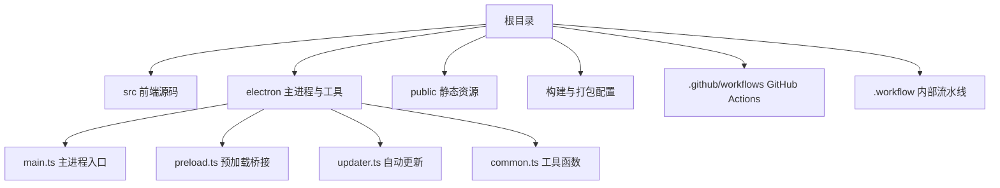
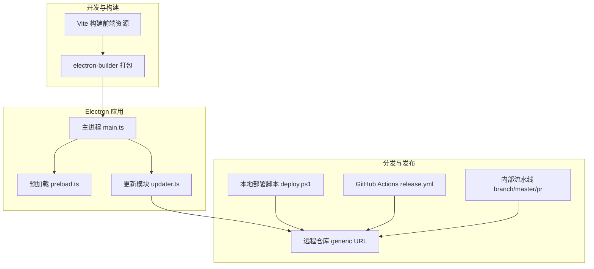
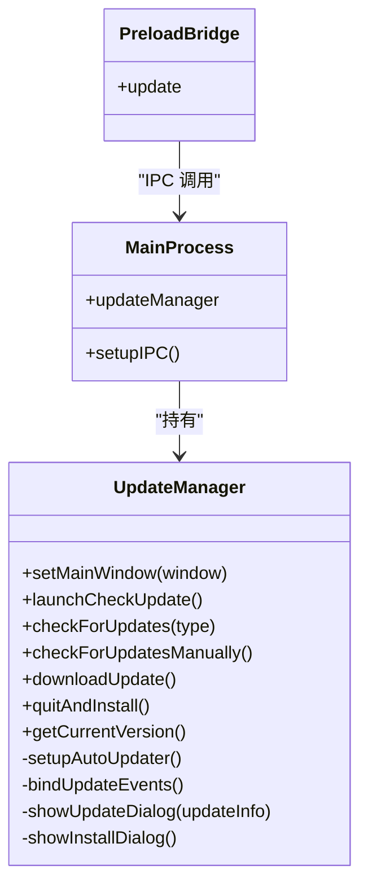
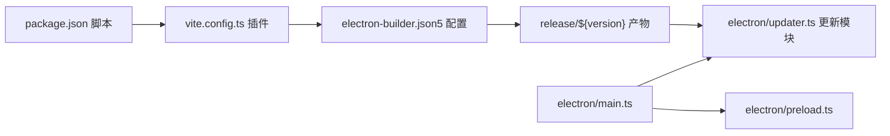

# 构建与部署

<cite>
**本文引用的文件**
- [package.json](file://package.json)
- [vite.config.ts](file://vite.config.ts)
- [electron-builder.json5](file://electron-builder.json5)
- [deploy.ps1](file://deploy.ps1)
- [.github/workflows/release.yml](file://.github/workflows/release.yml)
- [.workflow/branch-pipeline.yml](file://.workflow/branch-pipeline.yml)
- [.workflow/master-pipeline.yml](file://.workflow/master-pipeline.yml)
- [.workflow/pr-pipeline.yml](file://.workflow/pr-pipeline.yml)
- [electron/main.ts](file://electron/main.ts)
- [electron/preload.ts](file://electron/preload.ts)
- [electron/updater.ts](file://electron/updater.ts)
- [electron/common.ts](file://electron/common.ts)
- [.gitignore](file://.gitignore)
</cite>

## 目录
1. [简介](#简介)
2. [项目结构](#项目结构)
3. [核心组件](#核心组件)
4. [架构总览](#架构总览)
5. [详细组件分析](#详细组件分析)
6. [依赖关系分析](#依赖关系分析)
7. [性能考虑](#性能考虑)
8. [故障排除指南](#故障排除指南)
9. [结论](#结论)
10. [附录](#附录)

## 简介
本文件面向密码管理器项目的构建与部署，覆盖以下主题：
- Vite 构建配置与 Electron 打包配置
- CI/CD 流程与发布流程（含 GitHub Actions 与内部流水线）
- 构建优化策略、资源打包方式与分发配置
- 版本管理、签名与平台特定部署注意事项
- 本地构建、测试部署与生产发布步骤
- 故障排除与回滚策略

## 项目结构
项目采用前端框架与 Electron 主进程结合的组织方式，核心目录与职责如下：
- 根目录包含构建与打包配置、脚本与工作流定义
- electron 子目录包含主进程、预加载脚本、托盘菜单、更新逻辑等
- src 子目录包含 Vue 3 前端源码
- public 子目录包含静态资源与模板
- .github/workflows 与 .workflow 分别存放 GitHub Actions 与内部流水线配置

图表来源
- [electron/main.ts](file://electron/main.ts)
- [electron/preload.ts](file://electron/preload.ts)
- [electron/updater.ts](file://electron/updater.ts)
- [electron/common.ts](file://electron/common.ts)

章节来源
- [package.json](file://package.json)
- [vite.config.ts](file://vite.config.ts)
- [electron-builder.json5](file://electron-builder.json5)

## 核心组件
- 构建与打包
  - 使用 Vite 构建前端资源，并通过 vite-plugin-electron 将 Electron 主进程与预加载脚本集成到构建流程中
  - 使用 electron-builder 进行多平台打包（Windows NSIS、macOS DMG、Linux AppImage），并配置 asar 打包与产物命名规则
- 应用更新
  - Electron 自动更新模块用于检查、下载与安装更新，支持跳过版本与手动触发
- 分发与发布
  - 本地部署脚本将 release 目录产物上传至指定服务器
  - GitHub Actions 与内部流水线分别实现分支、PR 与主干的构建与制品发布

章节来源
- [package.json](file://package.json)
- [vite.config.ts](file://vite.config.ts)
- [electron-builder.json5](file://electron-builder.json5)
- [deploy.ps1](file://deploy.ps1)
- [.github/workflows/release.yml](file://.github/workflows/release.yml)
- [.workflow/branch-pipeline.yml](file://.workflow/branch-pipeline.yml)
- [.workflow/master-pipeline.yml](file://.workflow/master-pipeline.yml)
- [.workflow/pr-pipeline.yml](file://.workflow/pr-pipeline.yml)

## 架构总览
下图展示了从开发到打包、分发的整体流程，以及 Electron 主进程、预加载桥接与更新模块之间的交互。

图表来源
- [vite.config.ts](file://vite.config.ts)
- [electron-builder.json5](file://electron-builder.json5)
- [electron/main.ts](file://electron/main.ts)
- [electron/preload.ts](file://electron/preload.ts)
- [electron/updater.ts](file://electron/updater.ts)
- [deploy.ps1](file://deploy.ps1)
- [.github/workflows/release.yml](file://.github/workflows/release.yml)
- [.workflow/branch-pipeline.yml](file://.workflow/branch-pipeline.yml)
- [.workflow/master-pipeline.yml](file://.workflow/master-pipeline.yml)
- [.workflow/pr-pipeline.yml](file://.workflow/pr-pipeline.yml)

## 详细组件分析

### Vite 构建配置
- 插件链
  - Vue 插件、自动导入与组件解析插件、Electron 插件
  - Electron 插件配置主进程入口与预加载输入，渲染进程按需启用
- 开发与测试差异
  - NODE_ENV 为 test 时禁用渲染进程补丁，便于单元测试环境隔离

章节来源
- [vite.config.ts](file://vite.config.ts)

### Electron 打包配置
- 应用元数据
  - appId、productName、asar 打包
- 输出目录与文件
  - 输出目录按版本号组织，打包 dist 与 dist-electron
- 平台目标
  - Windows: NSIS 安装包（x64）
  - macOS: DMG
  - Linux: AppImage
- 安装行为
  - NSIS 配置允许更改安装目录，非一键安装
- 分发地址
  - generic provider 指向内网地址，供自动更新与发布使用

章节来源
- [electron-builder.json5](file://electron-builder.json5)

### 自动更新模块
- 更新源
  - 使用 generic provider 指向内网地址
- 行为控制
  - 关闭自动下载，改为手动触发；支持跳过版本与定时提醒
- 事件监听
  - 错误、检查中、可用更新、下载进度、下载完成等事件
- 与主进程交互
  - 主进程通过 IPC 暴露检查、下载、安装接口，并转发下载进度

图表来源
- [electron/updater.ts](file://electron/updater.ts)
- [electron/main.ts](file://electron/main.ts)
- [electron/preload.ts](file://electron/preload.ts)

章节来源
- [electron/updater.ts](file://electron/updater.ts)
- [electron/main.ts](file://electron/main.ts)
- [electron/preload.ts](file://electron/preload.ts)

### 预加载桥接与 IPC
- 暴露安全的 IPC 接口到渲染进程，封装常用方法（如更新相关）
- 提供便捷方法，简化渲染进程调用主进程能力

章节来源
- [electron/preload.ts](file://electron/preload.ts)

### 主进程初始化与生命周期
- 单实例锁、窗口创建、托盘菜单、全局快捷键、SQLite 初始化
- 开机启动设置、开发者工具开关、窗口最小化/最大化/关闭等 IPC 处理
- 启动时触发自动更新检查

章节来源
- [electron/main.ts](file://electron/main.ts)
- [electron/common.ts](file://electron/common.ts)

### 本地部署脚本
- 执行构建，读取版本号，遍历 release 目录（排除 win-unpacked）并通过 scp 上传至指定服务器

章节来源
- [deploy.ps1](file://deploy.ps1)

### GitHub Actions 工作流
- 当前文件为注释状态，保留了模板结构，包含节点版本、安装依赖、构建、创建发布与上传制品等步骤
- 可基于该模板启用标签触发的发布流程

章节来源
- [.github/workflows/release.yml](file://.github/workflows/release.yml)

### 内部流水线（分支/主干/PR）
- 统一执行 Node.js 构建、制品上传与版本发布
- 分支流水线与 PR 流水线均指向 master 的发布阶段，主干流水线独立发布

章节来源
- [.workflow/branch-pipeline.yml](file://.workflow/branch-pipeline.yml)
- [.workflow/master-pipeline.yml](file://.workflow/master-pipeline.yml)
- [.workflow/pr-pipeline.yml](file://.workflow/pr-pipeline.yml)

## 依赖关系分析
- 构建链路
  - package.json 中的构建脚本串联 Vite 与 electron-builder
  - vite.config.ts 通过 vite-plugin-electron 将 Electron 主进程与预加载脚本纳入构建
  - electron-builder.json5 控制打包目标、输出目录与分发地址
- 运行时链路
  - 主进程负责窗口、托盘、快捷键与数据库初始化
  - 预加载桥接提供受限 IPC 能力
  - 更新模块通过 electron-updater 与通用分发地址通信

图表来源
- [package.json](file://package.json)
- [vite.config.ts](file://vite.config.ts)
- [electron-builder.json5](file://electron-builder.json5)
- [electron/main.ts](file://electron/main.ts)
- [electron/preload.ts](file://electron/preload.ts)
- [electron/updater.ts](file://electron/updater.ts)

章节来源
- [package.json](file://package.json)
- [vite.config.ts](file://vite.config.ts)
- [electron-builder.json5](file://electron-builder.json5)
- [electron/main.ts](file://electron/main.ts)
- [electron/preload.ts](file://electron/preload.ts)
- [electron/updater.ts](file://electron/updater.ts)

## 性能考虑
- 资源打包
  - asar 打包提升加载效率并减少文件碎片
  - dist 与 dist-electron 分离，避免冗余资源进入打包
- 构建优化
  - 使用自动导入与组件解析插件减少样板代码
  - 渲染进程补丁按需启用，降低测试环境复杂度
- 更新体验
  - 关闭自动下载，由用户选择下载与安装时机，减少后台流量占用
  - 下载进度事件驱动 UI 反馈，提升感知

章节来源
- [electron-builder.json5](file://electron-builder.json5)
- [vite.config.ts](file://vite.config.ts)
- [electron/updater.ts](file://electron/updater.ts)

## 故障排除指南
- 构建失败
  - 确认 Node.js 版本与依赖安装一致；清理 dist、dist-electron、release 后重试
  - 检查 vite.config.ts 中 Electron 插件入口路径是否正确
- 打包产物缺失
  - 确认 electron-builder.json5 的 files 字段包含 dist 与 dist-electron
  - 检查输出目录 release/${version} 是否生成
- 自动更新异常
  - 确认 generic provider 地址可达且返回正确的更新索引
  - 检查主进程与预加载桥接中的 IPC 方法是否正确调用
- 本地上传失败
  - 检查 scp 凭据与服务器连通性；确保脚本排除 win-unpacked 目录
- CI/CD 问题
  - GitHub Actions 工作流处于注释状态，需取消注释并配置密钥后启用
  - 内部分支/PR/主干流水线需确保 Node.js 版本与构建命令一致

章节来源
- [.gitignore](file://.gitignore)
- [vite.config.ts](file://vite.config.ts)
- [electron-builder.json5](file://electron-builder.json5)
- [electron/updater.ts](file://electron/updater.ts)
- [deploy.ps1](file://deploy.ps1)
- [.github/workflows/release.yml](file://.github/workflows/release.yml)
- [.workflow/branch-pipeline.yml](file://.workflow/branch-pipeline.yml)
- [.workflow/master-pipeline.yml](file://.workflow/master-pipeline.yml)
- [.workflow/pr-pipeline.yml](file://.workflow/pr-pipeline.yml)

## 结论
本项目通过 Vite + Electron + electron-builder 实现跨平台桌面应用的高效构建与打包；通过通用分发地址与自动更新模块实现版本演进与用户升级；通过本地脚本与 CI/CD 流水线保障持续交付。建议在生产环境中启用 GitHub Actions 发布流程，并完善签名与代码仓库权限管理以提升安全性与可追溯性。

## 附录

### 本地构建与测试部署步骤
- 安装依赖
  - 使用 npm ci 或 npm install
- 本地开发
  - npm run dev 启动 Vite 开发服务器
- 本地打包
  - npm run build 触发 Vite 构建与 electron-builder 打包
- 本地上传
  - 运行 deploy.ps1，读取版本号并上传 release 目录（排除 win-unpacked）

章节来源
- [package.json](file://package.json)
- [deploy.ps1](file://deploy.ps1)

### 生产发布步骤
- 版本管理
  - 在 package.json 中维护 version 字段，作为发布版本号
- 触发发布
  - GitHub Actions：取消注释 release.yml 并推送标签
  - 内部流水线：在 master 分支推送以触发主干发布
- 分发验证
  - 校验 release 目录产物与 generic provider 地址可访问性

章节来源
- [package.json](file://package.json)
- [.github/workflows/release.yml](file://.github/workflows/release.yml)
- [.workflow/master-pipeline.yml](file://.workflow/master-pipeline.yml)

### 平台特定部署注意事项
- Windows
  - NSIS 安装包 x64，允许更改安装目录；注意防病毒软件提示
- macOS
  - DMG 包，注意签名与公证（建议在 CI 中配置）
- Linux
  - AppImage 包，注意可执行权限与桌面集成

章节来源
- [electron-builder.json5](file://electron-builder.json5)

### 回滚策略
- 版本回退
  - 在 generic provider 侧保留旧版本产物，引导用户降级
- 数据库兼容
  - SQLite 初始化脚本与迁移逻辑需保持向后兼容
- 快速修复
  - 通过跳过版本机制暂时阻止问题版本推送，待修复版本上线后再开放

章节来源
- [electron/updater.ts](file://electron/updater.ts)
- [electron/db/sqlite/components/initSql.ts](file://electron/db/sqlite/components/initSql.ts)