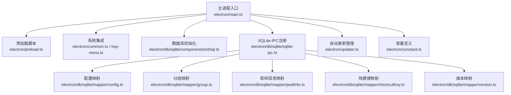
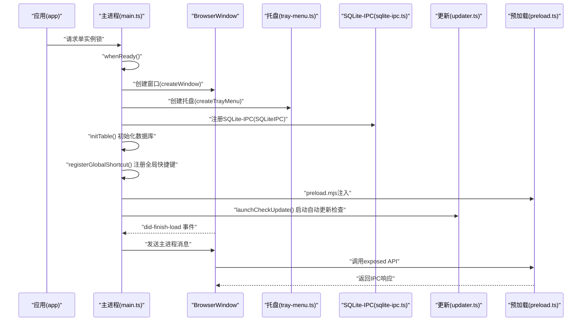
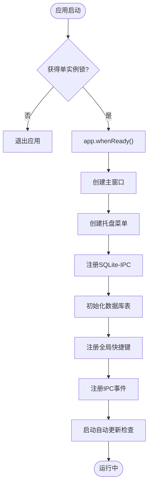
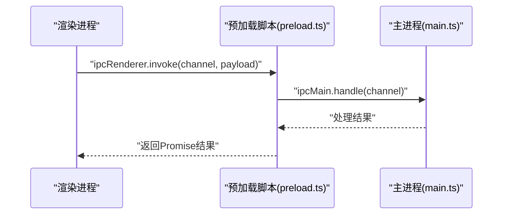
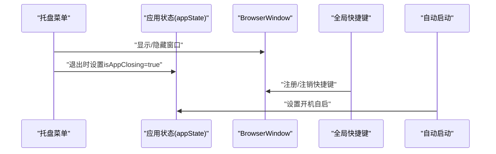
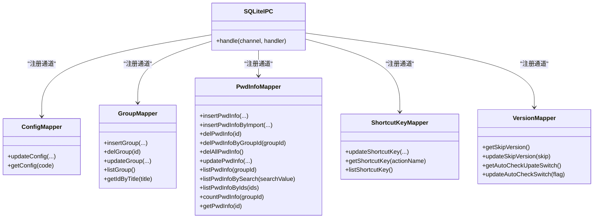
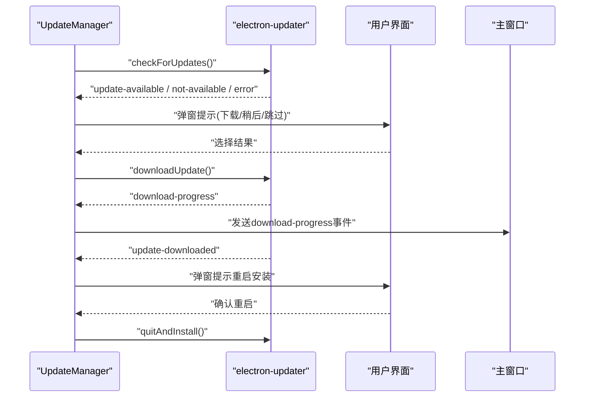
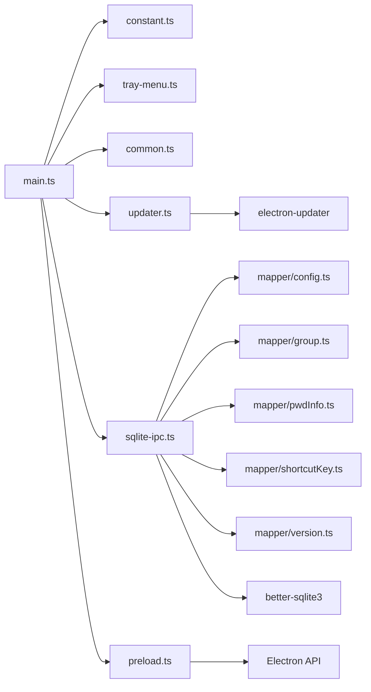

# Electron主进程架构

<cite>
**本文档引用的文件**
- [main.ts](file://electron/main.ts)
- [preload.ts](file://electron/preload.ts)
- [tray-menu.ts](file://electron/tray-menu.ts)
- [updater.ts](file://electron/updater.ts)
- [common.ts](file://electron/common.ts)
- [constant.ts](file://electron/constant.ts)
- [initSql.ts](file://electron/db/sqlite/components/initSql.ts)
- [sqlite-ipc.ts](file://electron/db/sqlite/sqlite-ipc.ts)
- [config.ts](file://electron/db/sqlite/mapper/config.ts)
- [pwdInfo.ts](file://electron/db/sqlite/mapper/pwdInfo.ts)
- [group.ts](file://electron/db/sqlite/mapper/group.ts)
- [shortcutKey.ts](file://electron/db/sqlite/mapper/shortcutKey.ts)
- [version.ts](file://electron/db/sqlite/mapper/version.ts)
- [package.json](file://package.json)
</cite>

## 目录
1. [简介](#简介)
2. [项目结构](#项目结构)
3. [核心组件](#核心组件)
4. [架构总览](#架构总览)
5. [详细组件分析](#详细组件分析)
6. [依赖关系分析](#依赖关系分析)
7. [性能考虑](#性能考虑)
8. [故障排除指南](#故障排除指南)
9. [结论](#结论)
10. [附录](#附录)

## 简介
本文件面向密码管理器的Electron主进程，系统性阐述其架构设计与实现要点，涵盖应用生命周期管理、窗口创建与控制、单实例锁机制、系统集成功能（托盘、全局快捷键、自动启动）、数据库访问层（SQLite）以及安全的IPC通信与预加载脚本机制。文档通过多维度图示与分层讲解，帮助开发者快速理解主进程设计理念与实现细节。

## 项目结构
主进程相关代码集中在electron目录，采用“功能模块+数据访问层”的分层组织方式：
- 应用入口与生命周期：main.ts
- 预加载脚本与安全桥接：preload.ts
- 系统集成：托盘菜单、全局快捷键、自动启动、开发工具
- 数据库与IPC：SQLite初始化、SQL映射器、SQLite-IPC注册
- 更新机制：自动更新管理器
- 常量定义：统一的IPC通道与窗口配置常量

图表来源
- [main.ts](file://electron/main.ts)
- [preload.ts](file://electron/preload.ts)
- [common.ts](file://electron/common.ts)
- [tray-menu.ts](file://electron/tray-menu.ts)
- [initSql.ts](file://electron/db/sqlite/components/initSql.ts)
- [sqlite-ipc.ts](file://electron/db/sqlite/sqlite-ipc.ts)
- [config.ts](file://electron/db/sqlite/mapper/config.ts)
- [group.ts](file://electron/db/sqlite/mapper/group.ts)
- [pwdInfo.ts](file://electron/db/sqlite/mapper/pwdInfo.ts)
- [shortcutKey.ts](file://electron/db/sqlite/mapper/shortcutKey.ts)
- [version.ts](file://electron/db/sqlite/mapper/version.ts)
- [constant.ts](file://electron/constant.ts)

章节来源
- [main.ts](file://electron/main.ts)
- [constant.ts](file://electron/constant.ts)

## 核心组件
- 应用入口与生命周期：负责单实例锁、窗口创建、托盘初始化、数据库表初始化、全局快捷键注册、IPC事件监听、自动更新检查等。
- 预加载脚本：通过contextBridge安全地向渲染进程暴露有限API，确保隔离与安全。
- 系统集成：托盘菜单、全局快捷键、自动启动、开发工具调试。
- 数据库与IPC：集中注册所有SQLite相关IPC通道，屏蔽底层SQL细节。
- 自动更新：封装electron-updater，提供检查、下载、安装与进度通知。
- 常量定义：统一管理窗口尺寸、透明度、菜单行为与IPC通道名。

章节来源
- [main.ts](file://electron/main.ts)
- [preload.ts](file://electron/preload.ts)
- [common.ts](file://electron/common.ts)
- [tray-menu.ts](file://electron/tray-menu.ts)
- [sqlite-ipc.ts](file://electron/db/sqlite/sqlite-ipc.ts)
- [updater.ts](file://electron/updater.ts)
- [constant.ts](file://electron/constant.ts)

## 架构总览
下图展示了主进程的关键交互流程：应用启动、窗口创建、托盘与快捷键初始化、数据库表初始化、IPC通道注册、自动更新检查，以及渲染进程通过预加载脚本进行安全通信。

图表来源
- [main.ts](file://electron/main.ts)
- [tray-menu.ts](file://electron/tray-menu.ts)
- [sqlite-ipc.ts](file://electron/db/sqlite/sqlite-ipc.ts)
- [updater.ts](file://electron/updater.ts)
- [preload.ts](file://electron/preload.ts)

## 详细组件分析

### 应用入口与生命周期管理
- 单实例锁：通过requestSingleInstanceLock确保同一时间仅有一个应用实例运行；若失败则直接退出。
- 应用准备：whenReady后依次执行窗口创建、托盘初始化、SQLite-IPC注册、数据库表初始化、全局快捷键注册、IPC事件监听、自动更新检查。
- 窗口事件：
  - close事件：非显式退出时，阻止默认关闭并将窗口隐藏至系统托盘。
  - window-all-closed：非macOS平台下，当所有窗口关闭时退出应用。
  - activate：macOS点击Dock图标时，如无活动窗口则重新创建。
- 退出逻辑：quit函数负责清理窗口引用并调用app.quit。

图表来源
- [main.ts](file://electron/main.ts)

章节来源
- [main.ts](file://electron/main.ts)

### 窗口创建与控制
- 窗口属性：固定宽高、无外边框、背景透明、自动隐藏菜单栏、指定图标与preload脚本。
- 生命周期事件：
  - did-finish-load：向渲染进程发送主进程消息。
  - dom-ready：隐藏窗口，实现“后台运行”体验。
  - close：根据appState.isAppClosing决定是否退出或隐藏。
- 窗口控制IPC：最小化、最大化/还原、关闭（隐藏至托盘）。

章节来源
- [main.ts](file://electron/main.ts)
- [constant.ts](file://electron/constant.ts)

### 预加载脚本与安全机制
- contextBridge暴露受限API：on/off/send/invoke以及更新相关的便捷方法。
- 作用：在渲染进程中以安全方式调用主进程能力，避免直接暴露Node/Electron API。
- 最佳实践：
  - 仅暴露必要接口；
  - 对回调与事件监听进行封装，避免跨上下文泄露；
  - 使用invoke而非send以获得返回值。

图表来源
- [preload.ts](file://electron/preload.ts)
- [main.ts](file://electron/main.ts)

章节来源
- [preload.ts](file://electron/preload.ts)

### 系统集成功能
- 托盘菜单：
  - 显示主界面、检查更新、打开帮助链接、退出应用。
  - 点击托盘图标切换窗口显示状态。
- 全局快捷键：
  - 从数据库读取配置，动态注册/注销快捷键。
  - 支持CommandOrControl跨平台替换。
- 自动启动：
  - 通过setLoginItemSettings设置开机自启。
- 开发工具：
  - 通过IPC打开DevTools，便于调试。

图表来源
- [tray-menu.ts](file://electron/tray-menu.ts)
- [common.ts](file://electron/common.ts)
- [main.ts](file://electron/main.ts)

章节来源
- [tray-menu.ts](file://electron/tray-menu.ts)
- [common.ts](file://electron/common.ts)
- [main.ts](file://electron/main.ts)

### 数据库访问层与SQLite-IPC
- 初始化：
  - 检测表是否存在，不存在则创建并插入默认数据（分组、密码信息、配置、快捷键、OSS、版本表）。
- IPC注册：
  - 统一注册配置、分组、密码信息、快捷键、版本、OSS等读写通道。
  - 渲染进程通过invoke调用，主进程执行SQL并返回结果。
- 数据访问映射：
  - config：更新/查询配置项。
  - group：增删改查分组。
  - pwdInfo：增删改查密码信息、搜索、计数、按ID列表查询。
  - shortcutKey：更新/查询快捷键描述。
  - version：跳过版本、自动检查开关等。

图表来源
- [sqlite-ipc.ts](file://electron/db/sqlite/sqlite-ipc.ts)
- [config.ts](file://electron/db/sqlite/mapper/config.ts)
- [group.ts](file://electron/db/sqlite/mapper/group.ts)
- [pwdInfo.ts](file://electron/db/sqlite/mapper/pwdInfo.ts)
- [shortcutKey.ts](file://electron/db/sqlite/mapper/shortcutKey.ts)
- [version.ts](file://electron/db/sqlite/mapper/version.ts)

章节来源
- [initSql.ts](file://electron/db/sqlite/components/initSql.ts)
- [sqlite-ipc.ts](file://electron/db/sqlite/sqlite-ipc.ts)
- [config.ts](file://electron/db/sqlite/mapper/config.ts)
- [group.ts](file://electron/db/sqlite/mapper/group.ts)
- [pwdInfo.ts](file://electron/db/sqlite/mapper/pwdInfo.ts)
- [shortcutKey.ts](file://electron/db/sqlite/mapper/shortcutKey.ts)
- [version.ts](file://electron/db/sqlite/mapper/version.ts)

### 自动更新机制
- 更新源：配置为通用HTTP地址，支持手动下载与安装。
- 事件监听：错误、检查中、发现更新、下载进度、下载完成。
- 用户交互：弹窗确认下载、稍后提醒、跳过版本；下载完成后确认重启安装。
- 自动检查：根据配置延迟启动检查，避免影响首次启动体验。
- 进度通知：通过主进程向渲染进程发送下载进度事件。

图表来源
- [updater.ts](file://electron/updater.ts)
- [main.ts](file://electron/main.ts)

章节来源
- [updater.ts](file://electron/updater.ts)
- [main.ts](file://electron/main.ts)

### IPC通信注册与全局快捷键设置
- IPC通道：
  - SQLite相关：配置、分组、密码信息、快捷键、版本、OSS等读写通道。
  - 应用控制：最小化、最大化/还原、关闭（隐藏）、打开外部浏览器、开发工具。
  - 更新：检查更新、下载更新、安装更新、获取当前版本。
  - 首次登录与自动启动：设置开机自启。
- 全局快捷键：
  - 从数据库读取快捷键描述，动态注册/注销。
  - 支持跨平台组合键（CommandOrControl）。

章节来源
- [constant.ts](file://electron/constant.ts)
- [sqlite-ipc.ts](file://electron/db/sqlite/sqlite-ipc.ts)
- [main.ts](file://electron/main.ts)
- [common.ts](file://electron/common.ts)

## 依赖关系分析
- 主进程入口依赖：BrowserWindow、ipcMain、Menu、shell、app、全局快捷键、托盘、自动更新、SQLite-IPC、数据库初始化。
- 数据访问层依赖：基础SQL封装（baseSql.ts），各映射器依赖基础封装执行SQL。
- 预加载脚本依赖：contextBridge、ipcRenderer，仅暴露必要方法。
- 包管理：electron-updater用于自动更新，better-sqlite3用于本地数据库。

图表来源
- [main.ts](file://electron/main.ts)
- [constant.ts](file://electron/constant.ts)
- [tray-menu.ts](file://electron/tray-menu.ts)
- [common.ts](file://electron/common.ts)
- [updater.ts](file://electron/updater.ts)
- [sqlite-ipc.ts](file://electron/db/sqlite/sqlite-ipc.ts)
- [config.ts](file://electron/db/sqlite/mapper/config.ts)
- [group.ts](file://electron/db/sqlite/mapper/group.ts)
- [pwdInfo.ts](file://electron/db/sqlite/mapper/pwdInfo.ts)
- [shortcutKey.ts](file://electron/db/sqlite/mapper/shortcutKey.ts)
- [version.ts](file://electron/db/sqlite/mapper/version.ts)
- [preload.ts](file://electron/preload.ts)
- [package.json](file://package.json)

章节来源
- [package.json](file://package.json)

## 性能考虑
- 窗口隐藏策略：通过hide而非销毁减少重复创建成本，提升响应速度。
- 数据库初始化：仅在首次运行或缺失表时执行，避免重复开销。
- 快捷键注册：统一注销旧快捷键再注册新组合，防止冲突与资源泄漏。
- 更新检查：延迟启动与条件判断，避免阻塞主流程。
- 预加载脚本：限制暴露API数量，降低上下文污染风险。

## 故障排除指南
- 应用无法启动或立即退出
  - 检查单实例锁是否被其他实例占用。
  - 查看控制台输出定位异常点。
- 窗口不显示或无法隐藏
  - 确认close事件中appState.isAppClosing状态与preventDefault逻辑。
  - 检查window-all-closed平台分支。
- 托盘菜单无响应
  - 确认托盘图标路径与resize尺寸正确。
  - 检查菜单项click回调绑定。
- 全局快捷键无效
  - 确认数据库中快捷键描述格式正确。
  - 检查CommandOrControl替换逻辑与注册异常捕获。
- 自动更新失败
  - 检查更新源URL可达性与权限。
  - 查看错误事件日志与弹窗提示。
- IPC调用无响应
  - 确认通道名一致且主进程已注册handle。
  - 检查渲染进程invoke调用与预加载脚本暴露方法。

章节来源
- [main.ts](file://electron/main.ts)
- [tray-menu.ts](file://electron/tray-menu.ts)
- [common.ts](file://electron/common.ts)
- [updater.ts](file://electron/updater.ts)
- [sqlite-ipc.ts](file://electron/db/sqlite/sqlite-ipc.ts)
- [preload.ts](file://electron/preload.ts)

## 结论
该主进程架构以清晰的分层与职责分离为核心：入口负责生命周期与系统集成，预加载脚本保障安全通信，SQLite-IPC屏蔽数据访问复杂度，自动更新独立管理。通过单实例锁、托盘与快捷键增强用户体验，配合完善的IPC与事件机制，形成稳定可扩展的桌面应用框架。

## 附录
- 最佳实践清单
  - 严格限制预加载脚本暴露的API范围。
  - 使用invoke处理需要返回值的IPC调用。
  - 在窗口关闭时统一走隐藏逻辑，避免资源泄露。
  - 全局快捷键注册前先注销旧组合，保证一致性。
  - 自动更新检查应具备延迟与开关控制。
  - 数据库初始化与表结构变更需幂等处理。