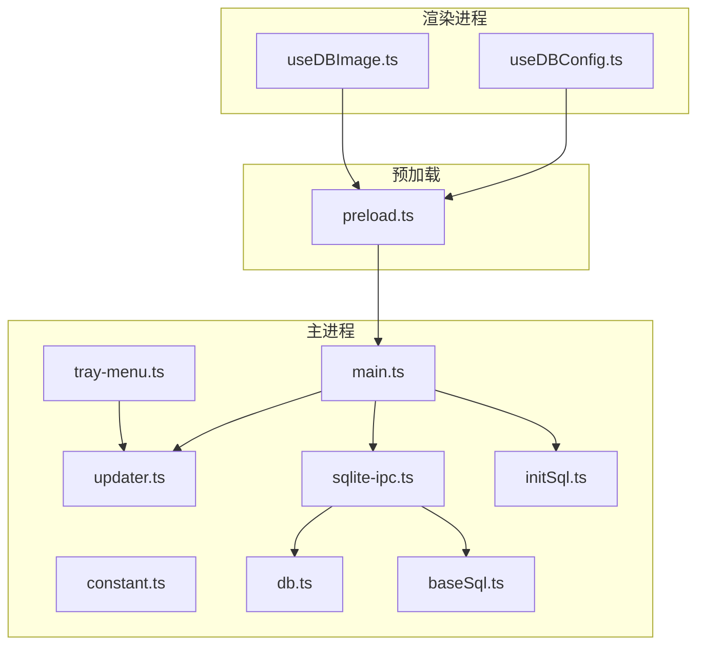
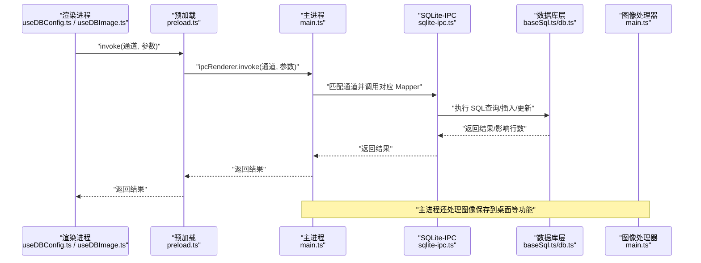
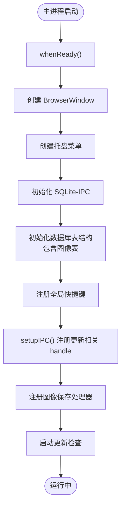
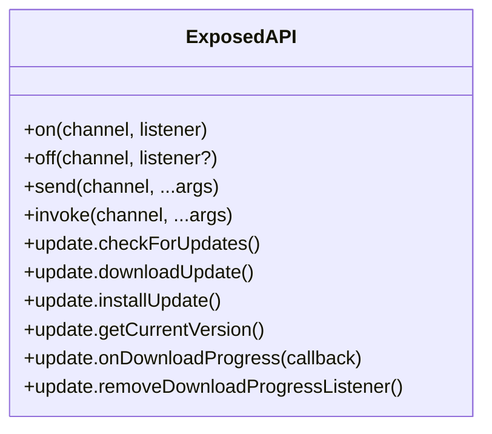
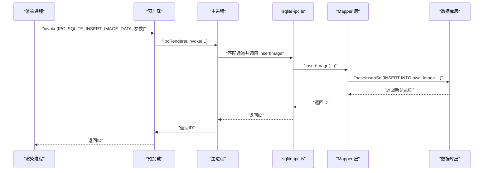
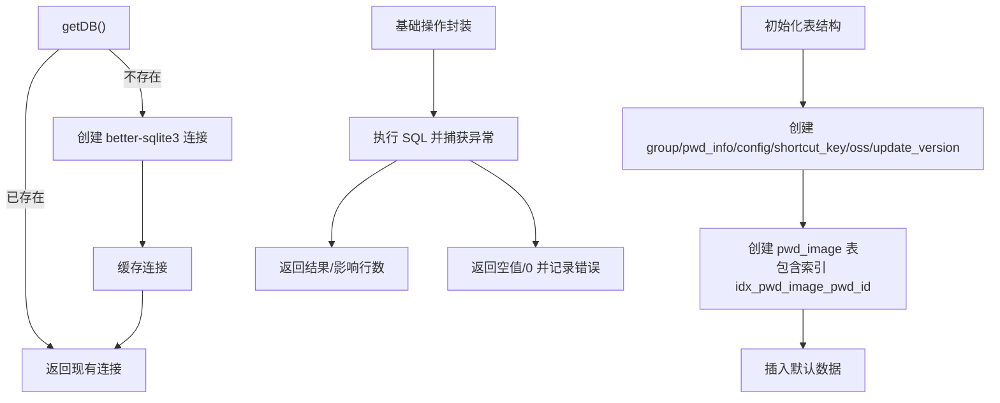
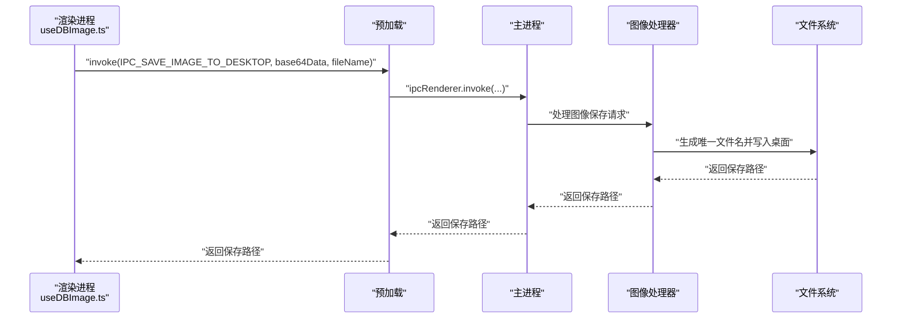
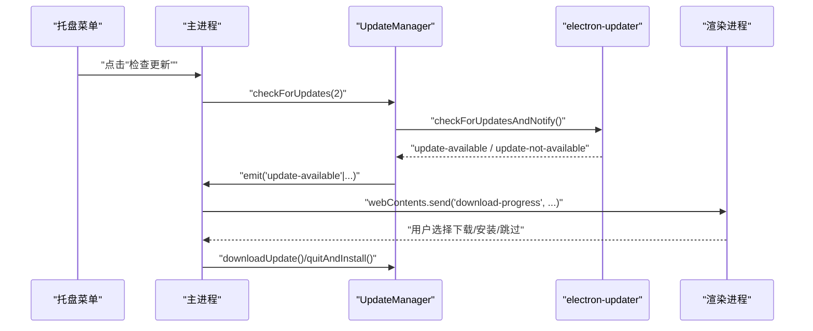
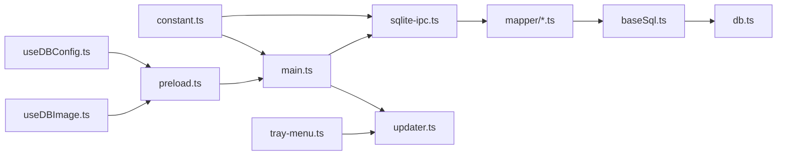

# IPC通信机制

<cite>
**本文引用的文件**
- [electron/main.ts](file://electron/main.ts)
- [electron/preload.ts](file://electron/preload.ts)
- [electron/constant.ts](file://electron/constant.ts)
- [electron/common.ts](file://electron/common.ts)
- [electron/db/sqlite/sqlite-ipc.ts](file://electron/db/sqlite/sqlite-ipc.ts)
- [electron/db/sqlite/components/db.ts](file://electron/db/sqlite/components/db.ts)
- [electron/db/sqlite/components/baseSql.ts](file://electron/db/sqlite/components/baseSql.ts)
- [electron/db/sqlite/components/initSql.ts](file://electron/db/sqlite/components/initSql.ts)
- [electron/db/sqlite/mapper/config.ts](file://electron/db/sqlite/mapper/config.ts)
- [electron/db/sqlite/mapper/group.ts](file://electron/db/sqlite/mapper/group.ts)
- [electron/db/sqlite/mapper/pwdInfo.ts](file://electron/db/sqlite/mapper/pwdInfo.ts)
- [electron/db/sqlite/mapper/image.ts](file://electron/db/sqlite/mapper/image.ts)
- [electron/updater.ts](file://electron/updater.ts)
- [electron/tray-menu.ts](file://electron/tray-menu.ts)
- [src/hooks/useDBConfig.ts](file://src/hooks/useDBConfig.ts)
- [src/hooks/useDBImage.ts](file://src/hooks/useDBImage.ts)
</cite>

## 更新摘要
**变更内容**
- 新增完整的图像相关IPC处理器模块，包含11个新的数据库操作通道
- 新增桌面保存图片功能的IPC处理器
- 新增图像表结构和相关SQL操作
- 更新IPC通道清单，增加图像管理功能

## 目录
1. [简介](#简介)
2. [项目结构](#项目结构)
3. [核心组件](#核心组件)
4. [架构总览](#架构总览)
5. [详细组件分析](#详细组件分析)
6. [依赖关系分析](#依赖关系分析)
7. [性能考量](#性能考量)
8. [故障排查指南](#故障排查指南)
9. [结论](#结论)
10. [附录](#附录)

## 简介
本文件系统性梳理密码管理器在 Electron 中的进程间通信（IPC）机制，覆盖主进程与渲染进程之间的消息传递、事件监听与处理流程、数据序列化与错误处理策略。重点解析以下方面：
- 使用 ipcMain 与 ipcRenderer 的典型模式：invoke/send/on/off
- 自定义 IPC 通道的命名规范与参数传递约定
- sqlite-ipc 模块的实现原理与数据库操作的异步通信机制
- 图像管理系统的IPC处理器与桌面保存功能
- 更新管理器的事件驱动与进度回调
- 最佳实践、性能优化与常见问题定位

## 项目结构
围绕 IPC 的关键目录与文件如下：
- 主进程入口与 IPC 注册：electron/main.ts
- 预加载桥接层：electron/preload.ts
- IPC 常量与通道名：electron/constant.ts
- 通用工具（全局快捷键、开机自启、开发者工具）：electron/common.ts
- 数据库访问层（better-sqlite3）：electron/db/sqlite/components/db.ts、baseSql.ts
- 数据库初始化与表结构：electron/db/sqlite/components/initSql.ts
- SQLite-IPC 通道注册：electron/db/sqlite/sqlite-ipc.ts
- 数据映射层（Mapper）：electron/db/sqlite/mapper/*.ts
- 更新管理器（事件驱动）：electron/updater.ts
- 托盘菜单触发更新：electron/tray-menu.ts
- 渲染进程调用示例：src/hooks/useDBConfig.ts、src/hooks/useDBImage.ts

**图表来源**
- [electron/main.ts:1-258](file://electron/main.ts#L1-L258)
- [electron/constant.ts:1-77](file://electron/constant.ts#L1-L77)
- [electron/preload.ts:1-39](file://electron/preload.ts#L1-L39)
- [electron/db/sqlite/sqlite-ipc.ts:1-295](file://electron/db/sqlite/sqlite-ipc.ts#L1-L295)
- [electron/db/sqlite/components/db.ts:1-30](file://electron/db/sqlite/components/db.ts#L1-L30)
- [electron/db/sqlite/components/baseSql.ts:1-87](file://electron/db/sqlite/components/baseSql.ts#L1-L87)
- [electron/db/sqlite/components/initSql.ts:1-277](file://electron/db/sqlite/components/initSql.ts#L1-L277)
- [electron/updater.ts:1-204](file://electron/updater.ts#L1-L204)
- [electron/tray-menu.ts:1-47](file://electron/tray-menu.ts#L1-L47)
- [src/hooks/useDBConfig.ts:1-21](file://src/hooks/useDBConfig.ts#L1-L21)
- [src/hooks/useDBImage.ts:1-146](file://src/hooks/useDBImage.ts#L1-L146)

**章节来源**
- [electron/main.ts:1-258](file://electron/main.ts#L1-L258)
- [electron/preload.ts:1-39](file://electron/preload.ts#L1-L39)
- [electron/constant.ts:1-77](file://electron/constant.ts#L1-L77)

## 核心组件
- 主进程 IPC 注册与事件监听：在主进程中集中注册 ipcMain.handle 与事件监听，统一处理来自渲染进程的请求与系统事件。
- 预加载桥接层：通过 contextBridge.exposeInMainWorld 暴露安全可控的 ipcRenderer 封装，避免直接暴露原生 API。
- SQLite-IPC：集中注册所有数据库操作的 IPC 通道，将渲染进程的数据库请求转发至数据库访问层。
- 数据库访问层：基于 better-sqlite3，提供基础 SQL 操作封装（查询、插入、更新、事务辅助），并负责连接生命周期管理。
- 图像管理系统：专门处理密码条目关联的图片附件，支持插入、删除、查询、计数等完整操作。
- 桌面保存功能：支持将图片保存到用户桌面，处理文件名冲突和路径生成。
- 更新管理器：基于 electron-updater 的事件驱动模型，向渲染进程推送下载进度与状态变更。

**章节来源**
- [electron/main.ts:149-227](file://electron/main.ts#L149-L227)
- [electron/preload.ts:4-38](file://electron/preload.ts#L4-L38)
- [electron/db/sqlite/sqlite-ipc.ts:58-295](file://electron/db/sqlite/sqlite-ipc.ts#L58-L295)
- [electron/db/sqlite/components/db.ts:16-30](file://electron/db/sqlite/components/db.ts#L16-L30)
- [electron/db/sqlite/components/baseSql.ts:9-81](file://electron/db/sqlite/components/baseSql.ts#L9-L81)
- [electron/db/sqlite/components/initSql.ts:107-174](file://electron/db/sqlite/components/initSql.ts#L107-L174)
- [electron/updater.ts:7-204](file://electron/updater.ts#L7-L204)

## 架构总览
下图展示了从渲染进程发起请求到数据库读写的完整链路，以及主进程对系统功能（如全局快捷键、开发者工具、窗口控制、图像处理）的处理。

**图表来源**
- [electron/main.ts:149-227](file://electron/main.ts#L149-L227)
- [electron/preload.ts:17-20](file://electron/preload.ts#L17-L20)
- [electron/db/sqlite/sqlite-ipc.ts:58-295](file://electron/db/sqlite/sqlite-ipc.ts#L58-L295)
- [electron/db/sqlite/components/baseSql.ts:9-81](file://electron/db/sqlite/components/baseSql.ts#L9-L81)
- [electron/main.ts:204-218](file://electron/main.ts#L204-L218)

## 详细组件分析

### 主进程 IPC 注册与事件监听
- 统一注册：在主进程入口集中注册各类 IPC 通道，包括窗口控制、全局快捷键、开发者工具、自动启动、打开外部链接、更新检查、图像保存等。
- 异步处理：使用 ipcMain.handle 接收渲染进程的请求，返回 Promise 结果；对于事件驱动型功能（如更新），通过事件监听器向渲染进程推送状态。
- 生命周期：在应用准备就绪后初始化数据库表结构、注册全局快捷键、启动更新检查、设置图像保存处理器。

**图表来源**
- [electron/main.ts:49-59](file://electron/main.ts#L49-L59)
- [electron/main.ts:52-54](file://electron/main.ts#L52-L54)
- [electron/main.ts:204-218](file://electron/main.ts#L204-L218)
- [electron/db/sqlite/components/initSql.ts:107-174](file://electron/db/sqlite/components/initSql.ts#L107-L174)

**章节来源**
- [electron/main.ts:149-227](file://electron/main.ts#L149-L227)
- [electron/main.ts:204-218](file://electron/main.ts#L204-L218)

### 预加载桥接层与安全暴露
- 暴露封装：通过 contextBridge.exposeInMainWorld 将 ipcRenderer 的 on/off/send/invoke 包装为安全接口，避免直接暴露原生 API。
- 更新相关便捷方法：在 exposed 对象中提供 update.update.* 方法，简化渲染进程对更新流程的调用。
- 设计原则：仅暴露必要能力，避免泄露底层 Electron API。

**图表来源**
- [electron/preload.ts:4-38](file://electron/preload.ts#L4-L38)

**章节来源**
- [electron/preload.ts:4-38](file://electron/preload.ts#L4-L38)

### SQLite-IPC 实现原理与通道设计
- 通道命名：统一使用 IPC_SQLITE_* 前缀，按"功能域+动作+数据类型"组织，便于维护与检索。
- 通道注册：在 sqlite-ipc.ts 中集中注册所有数据库操作通道，每个通道绑定对应的 Mapper 函数。
- 数据序列化：渲染进程传入的参数经 ipcMain.handle 传递到主进程，主进程再调用 Mapper 执行 SQL；返回值由主进程返回给渲染进程。
- 错误处理：数据库层捕获异常并返回可识别的结果（如 null、0、1），由调用方决定后续行为。

**图表来源**
- [electron/db/sqlite/sqlite-ipc.ts:240-244](file://electron/db/sqlite/sqlite-ipc.ts#L240-L244)
- [electron/db/sqlite/mapper/image.ts:6-10](file://electron/db/sqlite/mapper/image.ts#L6-L10)
- [electron/db/sqlite/components/baseSql.ts:21-32](file://electron/db/sqlite/components/baseSql.ts#L21-L32)

**章节来源**
- [electron/db/sqlite/sqlite-ipc.ts:58-295](file://electron/db/sqlite/sqlite-ipc.ts#L58-L295)
- [electron/db/sqlite/mapper/image.ts:1-68](file://electron/db/sqlite/mapper/image.ts#L1-L68)
- [electron/db/sqlite/components/baseSql.ts:9-81](file://electron/db/sqlite/components/baseSql.ts#L9-L81)

### 数据库访问层与连接管理
- 连接管理：db.ts 提供 getDB/closeDB，确保单例连接与显式关闭。
- 基础封装：baseSql.ts 提供 baseListSql/baseGetSql/baseInsertSql/baseUpdateSql，统一异常处理与返回值语义。
- 初始化：initSql.ts 在首次启动时创建表结构并插入默认数据，保证应用可用性。**新增**：包含图像表 pwd_image 的创建和索引建立。

**图表来源**
- [electron/db/sqlite/components/db.ts:16-30](file://electron/db/sqlite/components/db.ts#L16-L30)
- [electron/db/sqlite/components/baseSql.ts:9-81](file://electron/db/sqlite/components/baseSql.ts#L9-L81)
- [electron/db/sqlite/components/initSql.ts:107-174](file://electron/db/sqlite/components/initSql.ts#L107-L174)

**章节来源**
- [electron/db/sqlite/components/db.ts:16-30](file://electron/db/sqlite/components/db.ts#L16-L30)
- [electron/db/sqlite/components/baseSql.ts:9-81](file://electron/db/sqlite/components/baseSql.ts#L9-L81)
- [electron/db/sqlite/components/initSql.ts:107-174](file://electron/db/sqlite/components/initSql.ts#L107-L174)

### 图像管理系统与桌面保存功能
- 图像表结构：新增 pwd_image 表，包含 id、pwd_id、file_name、file_size、mime_type、data、sort_order、created_at 字段，并建立 pwd_id 索引。
- 图像操作：支持插入、删除、查询元数据、获取完整数据、统计数量等完整操作。
- 桌面保存：提供 IPC_SAVE_IMAGE_TO_DESKTOP 通道，支持将Base64格式的图片保存到用户桌面，自动处理文件名冲突。
- 加密存储：图像数据采用加密存储，确保安全性。

**图表来源**
- [electron/main.ts:204-218](file://electron/main.ts#L204-L218)
- [src/hooks/useDBImage.ts:21-35](file://src/hooks/useDBImage.ts#L21-L35)

**章节来源**
- [electron/db/sqlite/mapper/image.ts:1-68](file://electron/db/sqlite/mapper/image.ts#L1-L68)
- [electron/main.ts:204-218](file://electron/main.ts#L204-L218)
- [src/hooks/useDBImage.ts:1-146](file://src/hooks/useDBImage.ts#L1-L146)

### 更新管理器与事件驱动
- 事件绑定：在构造函数中绑定 autoUpdater 的 error/checking-for-update/update-available/download-progress/update-downloaded 等事件。
- 进度推送：下载进度事件中向主窗口 webContents 发送 download-progress，渲染进程通过 on 监听并更新 UI。
- 交互逻辑：根据用户选择执行下载、安装或跳过版本；支持延迟提醒与自动检查开关。

**图表来源**
- [electron/tray-menu.ts:24-26](file://electron/tray-menu.ts#L24-L26)
- [electron/main.ts:197-200](file://electron/main.ts#L197-L200)
- [electron/updater.ts:38-97](file://electron/updater.ts#L38-L97)
- [electron/updater.ts:159-175](file://electron/updater.ts#L159-L175)

**章节来源**
- [electron/updater.ts:7-204](file://electron/updater.ts#L7-L204)
- [electron/tray-menu.ts:1-47](file://electron/tray-menu.ts#L1-L47)

### 渲染进程调用示例
- useDBConfig：通过 window.ipcRenderer.invoke 调用 IPC 通道，实现配置项的读取与更新。
- useDBImage：通过 window.ipcRenderer.invoke 调用图像相关 IPC 通道，实现图片的插入、删除、查询、计数等操作。
- 参数传递：遵循"通道名 + 参数列表"的约定，参数由主进程解包并传递给 Mapper。
- 返回值处理：根据返回值进行 UI 更新或错误提示。

**章节来源**
- [src/hooks/useDBConfig.ts:6-18](file://src/hooks/useDBConfig.ts#L6-L18)
- [src/hooks/useDBImage.ts:21-146](file://src/hooks/useDBImage.ts#L21-L146)

## 依赖关系分析
- 主进程依赖：constant.ts 提供通道名常量；sqlite-ipc.ts 依赖各 Mapper；db.ts/baseSql.ts 提供数据库访问；updater.ts 提供更新能力；tray-menu.ts 触发更新；**新增**：main.ts 依赖图像处理器。
- 预加载依赖：仅依赖 ipcRenderer，不直接访问主进程 API。
- 渲染进程依赖：通过 window.ipcRenderer 调用主进程提供的服务。

**图表来源**
- [electron/constant.ts:14-77](file://electron/constant.ts#L14-L77)
- [electron/main.ts:24-26](file://electron/main.ts#L24-L26)
- [electron/db/sqlite/sqlite-ipc.ts:33-70](file://electron/db/sqlite/sqlite-ipc.ts#L33-L70)
- [electron/db/sqlite/components/baseSql.ts:1-2](file://electron/db/sqlite/components/baseSql.ts#L1-L2)
- [electron/db/sqlite/components/db.ts:1-7](file://electron/db/sqlite/components/db.ts#L1-L7)
- [electron/updater.ts:1-6](file://electron/updater.ts#L1-L6)
- [electron/tray-menu.ts:1-6](file://electron/tray-menu.ts#L1-L6)
- [src/hooks/useDBConfig.ts:1-2](file://src/hooks/useDBConfig.ts#L1-L2)
- [src/hooks/useDBImage.ts:1-13](file://src/hooks/useDBImage.ts#L1-L13)

**章节来源**
- [electron/constant.ts:14-77](file://electron/constant.ts#L14-L77)
- [electron/main.ts:24-26](file://electron/main.ts#L24-L26)

## 性能考量
- 数据库连接复用：通过单例连接减少连接开销，避免频繁创建/销毁。
- 参数化查询：所有 SQL 均使用参数化，降低注入风险并提升执行效率。
- 批量初始化：在首次启动时一次性创建表与默认数据，减少后续 IO。
- **新增**：图像表建立索引 idx_pwd_image_pwd_id，提升查询性能。
- **新增**：图像数据加密存储，避免重复解密操作。
- 事件驱动更新：下载进度通过事件推送，避免轮询带来的 CPU 占用。
- 预加载封装：统一暴露安全 API，减少不必要的 API 暴露与上下文切换。

## 故障排查指南
- 通道未注册：若渲染进程调用报错，检查主进程是否已注册对应通道名。
- 数据库异常：查看 baseSql.ts 的异常捕获与返回值，确认返回 null/0 是否符合预期。
- 连接丢失：确认 db.ts 的连接单例是否被意外关闭，必要时重新初始化。
- **新增**：图像表缺失：检查 initSql.ts 中的 createImageTable 函数是否正常执行。
- **新增**：图像保存失败：检查桌面路径权限和文件名冲突处理逻辑。
- 更新无响应：检查 updater.ts 的事件绑定与主窗口引用，确认 download-progress 是否正确发送。
- 快捷键失效：检查 common.ts 中的 registerGlobalShortcut 流程与平台差异处理。

**章节来源**
- [electron/db/sqlite/components/baseSql.ts:16-19](file://electron/db/sqlite/components/baseSql.ts#L16-L19)
- [electron/db/sqlite/components/db.ts:25-30](file://electron/db/sqlite/components/db.ts#L25-L30)
- [electron/db/sqlite/components/initSql.ts:151-174](file://electron/db/sqlite/components/initSql.ts#L151-L174)
- [electron/main.ts:204-218](file://electron/main.ts#L204-L218)
- [electron/updater.ts:74-89](file://electron/updater.ts#L74-L89)
- [electron/common.ts:17-39](file://electron/common.ts#L17-L39)

## 结论
该密码管理器的 IPC 体系以"预加载桥接 + 主进程集中注册 + 数据库通道封装 + 事件驱动更新 + 图像管理系统"为核心设计，既保证了安全性与可维护性，又提供了清晰的数据流与良好的扩展性。通过统一的通道命名、参数传递规范与错误处理策略，开发者可以快速集成新的数据库操作与系统功能。**新增的图像管理功能**进一步完善了密码管理器的多媒体支持能力，为用户提供了更丰富的密码条目管理体验。

## 附录

### IPC 通道清单与用途
- 窗口控制：最小化、最大化/还原、关闭
- 系统功能：全局快捷键保存、自动启动开关、打开外部链接、开发者工具
- 数据库操作：config/group/pwd_info/shortcut_key/oss 的增删改查与统计
- **新增**：图像管理：pwd_image 表的完整 CRUD 操作，包括插入、删除、查询、计数等
- **新增**：桌面保存：将图片保存到用户桌面的功能
- 更新管理：检查更新、下载更新、安装更新、获取当前版本、下载进度

**章节来源**
- [electron/constant.ts:14-77](file://electron/constant.ts#L14-L77)
- [electron/main.ts:149-227](file://electron/main.ts#L149-L227)
- [electron/db/sqlite/sqlite-ipc.ts:58-295](file://electron/db/sqlite/sqlite-ipc.ts#L58-L295)

### 图像表结构说明
- 表名：pwd_image
- 字段：id（主键）、pwd_id（外键）、file_name（文件名）、file_size（文件大小）、mime_type（MIME类型）、data（加密数据）、sort_order（排序）、created_at（创建时间）
- 索引：idx_pwd_image_pwd_id（pwd_id字段）
- 功能：支持密码条目关联的图片附件管理

**章节来源**
- [electron/db/sqlite/components/initSql.ts:107-120](file://electron/db/sqlite/components/initSql.ts#L107-L120)
- [electron/db/sqlite/components/initSql.ts:159-173](file://electron/db/sqlite/components/initSql.ts#L159-L173)