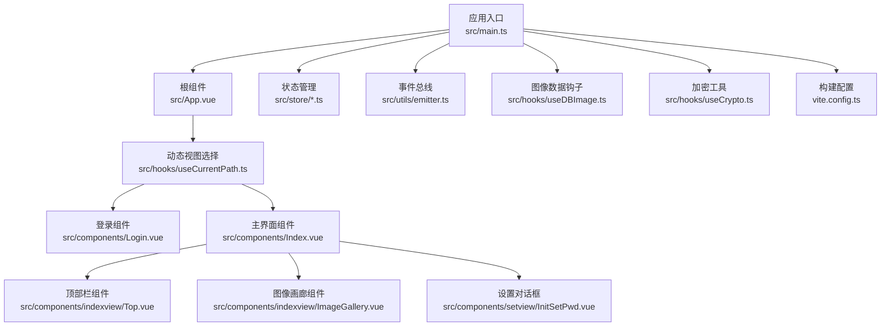
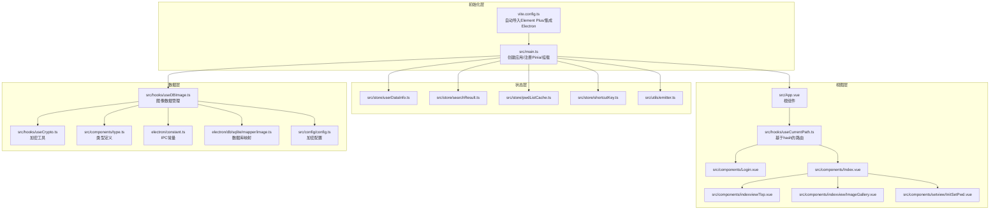
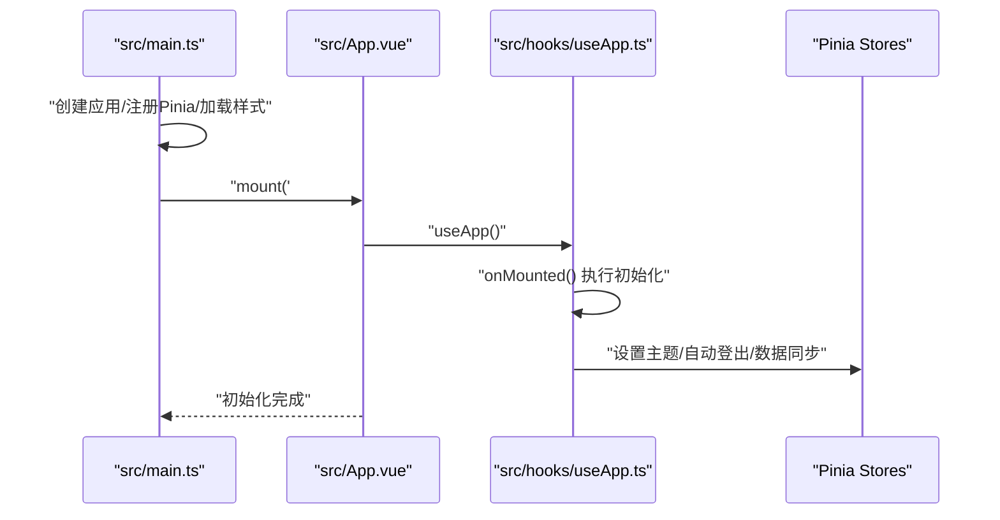
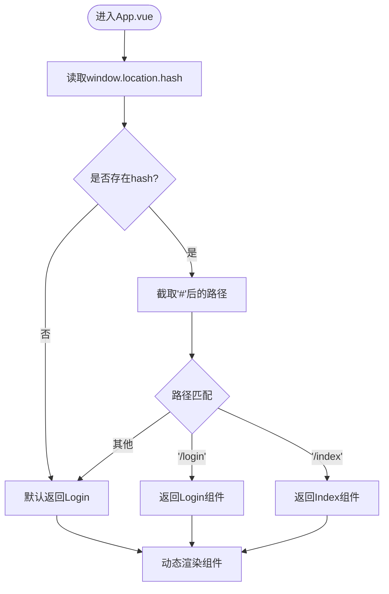
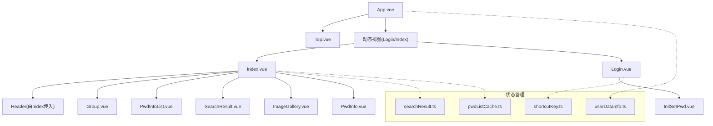
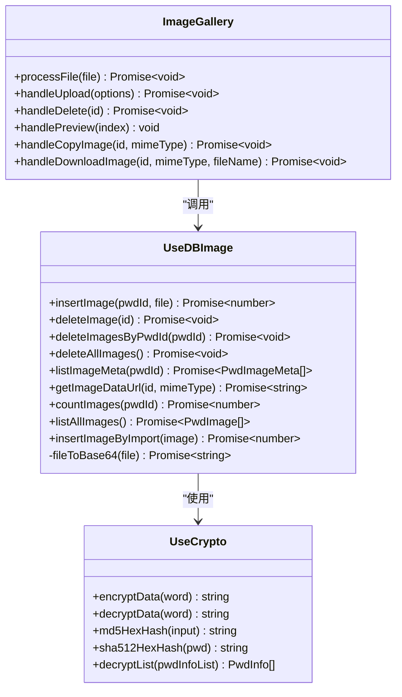
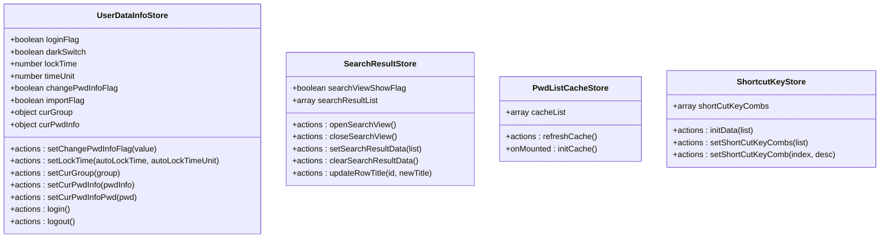
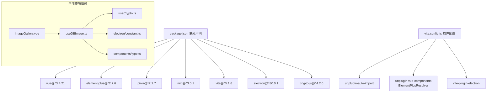

# 前端Vue架构设计

<cite>
**本文档引用的文件**
- [src/main.ts](file://src/main.ts)
- [src/App.vue](file://src/App.vue)
- [package.json](file://package.json)
- [vite.config.ts](file://vite.config.ts)
- [src/store/pwdListCache.ts](file://src/store/pwdListCache.ts)
- [src/store/searchResult.ts](file://src/store/searchResult.ts)
- [src/store/userDataInfo.ts](file://src/store/userDataInfo.ts)
- [src/store/shortcutKey.ts](file://src/store/shortcutKey.ts)
- [src/utils/emitter.ts](file://src/utils/emitter.ts)
- [src/hooks/useApp.ts](file://src/hooks/useApp.ts)
- [src/hooks/useCurrentPath.ts](file://src/hooks/useCurrentPath.ts)
- [src/hooks/useLoginAction.ts](file://src/hooks/useLoginAction.ts)
- [src/hooks/useDBImage.ts](file://src/hooks/useDBImage.ts)
- [src/hooks/useCrypto.ts](file://src/hooks/useCrypto.ts)
- [src/components/Index.vue](file://src/components/Index.vue)
- [src/components/Login.vue](file://src/components/Login.vue)
- [src/components/indexview/Top.vue](file://src/components/indexview/Top.vue)
- [src/components/indexview/ImageGallery.vue](file://src/components/indexview/ImageGallery.vue)
- [src/components/setview/InitSetPwd.vue](file://src/components/setview/InitSetPwd.vue)
- [src/components/type.ts](file://src/components/type.ts)
- [electron/constant.ts](file://electron/constant.ts)
- [electron/db/sqlite/mapper/image.ts](file://electron/db/sqlite/mapper/image.ts)
- [src/config/config.ts](file://src/config/config.ts)
</cite>

## 目录
1. [简介](#简介)
2. [项目结构](#项目结构)
3. [核心组件](#核心组件)
4. [架构概览](#架构概览)
5. [详细组件分析](#详细组件分析)
6. [依赖分析](#依赖分析)
7. [性能考虑](#性能考虑)
8. [故障排除指南](#故障排除指南)
9. [结论](#结论)
10. [附录](#附录)

## 简介
本文件为密码管理器的Vue 3前端架构综合文档，重点阐述应用初始化流程、路由配置、组件层次结构与状态管理模式。文档详细说明了应用如何集成Element Plus组件库、Pinia状态管理以及自定义路由（基于URL hash）系统；解释组件间通信机制、事件总线的使用、响应式数据绑定的实现；记录应用启动流程、组件挂载过程与生命周期管理；并提供组件设计原则、代码组织结构与开发规范，帮助开发者快速理解并高效参与前端架构的维护与扩展。

**更新** 新增图像数据管理系统，提供完整的图片附件存储、检索、管理和同步功能。

## 项目结构
该Vue 3应用采用Vite构建工具，结合Electron作为宿主环境运行桌面应用。项目主要由以下模块构成：
- 应用入口与初始化：通过main.ts创建Vue应用实例，注册Pinia状态管理，并挂载根组件App.vue。
- 根组件与动态视图：App.vue通过钩子useCurrentPath根据URL hash动态选择渲染Login或Index组件。
- 组件层：包含登录页、主界面、顶部栏、设置对话框、图像画廊等模块化组件。
- 状态管理：使用Pinia定义多个store，分别管理密码列表缓存、搜索结果、用户信息、快捷键等。
- 图像数据管理：新增useDBImage钩子提供图像插入、删除、元数据列表、数据URL生成等抽象接口。
- 工具与事件：使用mitt作为轻量级事件总线，提供跨组件解耦通信能力。
- 构建与集成：通过vite.config.ts配置自动导入Element Plus组件与解析器，同时集成Electron插件以支持桌面端运行。

**图表来源**
- [src/main.ts:1-20](file://src/main.ts#L1-L20)
- [src/App.vue:1-19](file://src/App.vue#L1-L19)
- [src/hooks/useCurrentPath.ts:1-44](file://src/hooks/useCurrentPath.ts#L1-L44)
- [src/components/Login.vue:1-129](file://src/components/Login.vue#L1-L129)
- [src/components/Index.vue:1-81](file://src/components/Index.vue#L1-L81)
- [src/components/indexview/Top.vue:1-108](file://src/components/indexview/Top.vue#L1-L108)
- [src/components/indexview/ImageGallery.vue:1-506](file://src/components/indexview/ImageGallery.vue#L1-L506)
- [src/components/setview/InitSetPwd.vue:1-46](file://src/components/setview/InitSetPwd.vue#L1-L46)
- [src/hooks/useDBImage.ts:1-146](file://src/hooks/useDBImage.ts#L1-L146)
- [src/hooks/useCrypto.ts:1-77](file://src/hooks/useCrypto.ts#L1-L77)
- [vite.config.ts:1-38](file://vite.config.ts#L1-L38)

**章节来源**
- [src/main.ts:1-20](file://src/main.ts#L1-L20)
- [src/App.vue:1-19](file://src/App.vue#L1-L19)
- [vite.config.ts:1-38](file://vite.config.ts#L1-L38)

## 核心组件
本节聚焦于应用的关键组件及其职责：
- 应用入口与初始化：负责创建Vue应用实例、引入Pinia并挂载根组件，同时处理Electron IPC消息监听。
- 根组件与动态视图：通过useCurrentPath根据URL hash决定渲染Login或Index，并将Top组件与动态视图组合展示。
- 登录组件：处理首次登录引导、密码输入、回车登录、大小写提示等交互逻辑。
- 主界面组件：承载顶部栏、分组视图、密码列表、搜索结果与当前密码详情等区域。
- 顶部栏组件：提供窗口控制按钮与菜单入口，结合用户登录状态进行条件渲染。
- 图像画廊组件：提供图片上传、预览、复制、下载、删除等功能，支持拖拽上传和粘贴上传。
- 设置对话框：用于首次登录时设置登录密码，表单校验与提交逻辑由相关Hook与Store协作完成。
- 图像数据钩子：提供完整的图像数据管理接口，包括插入、删除、查询、加密存储等。

**章节来源**
- [src/main.ts:1-20](file://src/main.ts#L1-L20)
- [src/App.vue:1-19](file://src/App.vue#L1-L19)
- [src/hooks/useCurrentPath.ts:1-44](file://src/hooks/useCurrentPath.ts#L1-L44)
- [src/components/Login.vue:1-129](file://src/components/Login.vue#L1-L129)
- [src/components/Index.vue:1-81](file://src/components/Index.vue#L1-L81)
- [src/components/indexview/Top.vue:1-108](file://src/components/indexview/Top.vue#L1-L108)
- [src/components/indexview/ImageGallery.vue:1-506](file://src/components/indexview/ImageGallery.vue#L1-L506)
- [src/components/setview/InitSetPwd.vue:1-46](file://src/components/setview/InitSetPwd.vue#L1-L46)
- [src/hooks/useDBImage.ts:1-146](file://src/hooks/useDBImage.ts#L1-L146)

## 架构概览
应用采用"入口初始化 → 动态路由 → 组件组合 → 状态管理"的分层架构。Element Plus作为UI基础库，提供统一的视觉与交互体验；Pinia负责状态集中管理；mitt提供跨组件事件通信；Vite+Electron提供桌面端运行环境。新增的图像数据管理系统通过useDBImage钩子提供完整的图像存储和管理能力。

**图表来源**
- [src/main.ts:1-20](file://src/main.ts#L1-L20)
- [vite.config.ts:1-38](file://vite.config.ts#L1-L38)
- [src/App.vue:1-19](file://src/App.vue#L1-L19)
- [src/hooks/useCurrentPath.ts:1-44](file://src/hooks/useCurrentPath.ts#L1-L44)
- [src/components/Login.vue:1-129](file://src/components/Login.vue#L1-L129)
- [src/components/Index.vue:1-81](file://src/components/Index.vue#L1-L81)
- [src/components/indexview/Top.vue:1-108](file://src/components/indexview/Top.vue#L1-L108)
- [src/components/indexview/ImageGallery.vue:1-506](file://src/components/indexview/ImageGallery.vue#L1-L506)
- [src/components/setview/InitSetPwd.vue:1-46](file://src/components/setview/InitSetPwd.vue#L1-L46)
- [src/store/userDataInfo.ts:1-76](file://src/store/userDataInfo.ts#L1-L76)
- [src/store/searchResult.ts:1-49](file://src/store/searchResult.ts#L1-L49)
- [src/store/pwdListCache.ts:1-37](file://src/store/pwdListCache.ts#L1-L37)
- [src/store/shortcutKey.ts:1-99](file://src/store/shortcutKey.ts#L1-L99)
- [src/utils/emitter.ts:1-16](file://src/utils/emitter.ts#L1-L16)
- [src/hooks/useDBImage.ts:1-146](file://src/hooks/useDBImage.ts#L1-L146)
- [src/hooks/useCrypto.ts:1-77](file://src/hooks/useCrypto.ts#L1-L77)
- [src/components/type.ts:1-114](file://src/components/type.ts#L1-L114)
- [electron/constant.ts:1-77](file://electron/constant.ts#L1-L77)
- [electron/db/sqlite/mapper/image.ts:1-68](file://electron/db/sqlite/mapper/image.ts#L1-L68)
- [src/config/config.ts:1-143](file://src/config/config.ts#L1-L143)

## 详细组件分析

### 应用初始化与启动流程
- 初始化步骤
  - 创建Vue应用实例并引入Pinia。
  - 注册全局样式与暗色主题CSS变量。
  - 挂载根组件，并在$nextTick后监听Electron IPC消息。
- 生命周期
  - 在main.ts中完成应用创建与挂载，随后在根组件App.vue中执行业务初始化钩子。
- 启动要点
  - 通过useApp钩子设置主题、自动登出计时器与数据同步策略。

**图表来源**
- [src/main.ts:1-20](file://src/main.ts#L1-L20)
- [src/App.vue:1-19](file://src/App.vue#L1-L19)
- [src/hooks/useApp.ts:1-71](file://src/hooks/useApp.ts#L1-L71)

**章节来源**
- [src/main.ts:1-20](file://src/main.ts#L1-L20)
- [src/hooks/useApp.ts:1-71](file://src/hooks/useApp.ts#L1-L71)

### 路由配置与动态视图
- 路由策略
  - 采用URL hash模拟路由，通过useCurrentPath监听hash变化并返回对应组件。
- 视图映射
  - /login → Login组件
  - /index → Index组件
- 切换逻辑
  - 监听hashchange事件，计算当前路径并返回对应组件；默认回退至Login组件。

**图表来源**
- [src/hooks/useCurrentPath.ts:1-44](file://src/hooks/useCurrentPath.ts#L1-L44)
- [src/App.vue:1-19](file://src/App.vue#L1-L19)

**章节来源**
- [src/hooks/useCurrentPath.ts:1-44](file://src/hooks/useCurrentPath.ts#L1-L44)
- [src/App.vue:1-19](file://src/App.vue#L1-L19)

### 组件层次结构与通信机制
- 层次关系
  - App.vue作为根容器，包含Top与动态视图组件。
  - Index.vue承载Header、Group、PwdInfoList、SearchResult、ImageGallery、PwdInfo等子组件。
  - Login.vue负责登录与首次登录设置。
- 通信方式
  - Props向下传递：父组件向子组件传递回调函数与数据。
  - Pinia共享状态：多组件共享用户信息、搜索结果、快捷键等状态。
  - 事件总线：mitt提供跨组件解耦事件发布/订阅能力。
  - Electron IPC：通过window.ipcRenderer与主进程通信，如窗口控制与首次登录引导。

**图表来源**
- [src/App.vue:1-19](file://src/App.vue#L1-L19)
- [src/components/Index.vue:1-81](file://src/components/Index.vue#L1-L81)
- [src/components/Login.vue:1-129](file://src/components/Login.vue#L1-L129)
- [src/components/indexview/Top.vue:1-108](file://src/components/indexview/Top.vue#L1-L108)
- [src/components/indexview/ImageGallery.vue:1-506](file://src/components/indexview/ImageGallery.vue#L1-L506)
- [src/components/setview/InitSetPwd.vue:1-46](file://src/components/setview/InitSetPwd.vue#L1-L46)
- [src/store/userDataInfo.ts:1-76](file://src/store/userDataInfo.ts#L1-L76)
- [src/store/searchResult.ts:1-49](file://src/store/searchResult.ts#L1-L49)
- [src/store/pwdListCache.ts:1-37](file://src/store/pwdListCache.ts#L1-L37)
- [src/store/shortcutKey.ts:1-99](file://src/store/shortcutKey.ts#L1-L99)

**章节来源**
- [src/App.vue:1-19](file://src/App.vue#L1-L19)
- [src/components/Index.vue:1-81](file://src/components/Index.vue#L1-L81)
- [src/components/Login.vue:1-129](file://src/components/Login.vue#L1-L129)
- [src/store/userDataInfo.ts:1-76](file://src/store/userDataInfo.ts#L1-L76)
- [src/store/searchResult.ts:1-49](file://src/store/searchResult.ts#L1-L49)
- [src/store/pwdListCache.ts:1-37](file://src/store/pwdListCache.ts#L1-L37)
- [src/store/shortcutKey.ts:1-99](file://src/store/shortcutKey.ts#L1-L99)

### 图像数据管理系统
**新增** 图像数据管理系统提供完整的图片附件管理功能，通过useDBImage钩子实现：

- 核心功能
  - 图片插入：支持文件上传、粘贴上传、拖拽上传，自动转换为Base64并加密存储
  - 图片删除：支持单张删除、按密码条目删除、清空所有图片
  - 元数据查询：获取图片列表（不含数据内容）、统计数量
  - 数据获取：按需解密获取图片数据URL
  - 数据导入：支持从OSS同步导入已加密的图片数据
- 技术实现
  - 文件处理：使用FileReader将File对象转换为Base64字符串
  - 数据加密：通过useCrypto钩子使用AES-CBC算法加密图片数据
  - IPC通信：通过Electron IPC与主进程通信，执行数据库操作
  - 内存管理：使用Map缓存已加载的图片数据URL，避免重复解密
- 组件集成
  - ImageGallery.vue组件直接使用useDBImage钩子的所有功能
  - 支持最大20张图片、每张不超过20MB的限制
  - 提供拖拽上传、粘贴上传、批量上传等多种上传方式
  - 支持图片预览、复制到剪贴板、下载到桌面等操作

**图表来源**
- [src/hooks/useDBImage.ts:1-146](file://src/hooks/useDBImage.ts#L1-L146)
- [src/components/indexview/ImageGallery.vue:1-506](file://src/components/indexview/ImageGallery.vue#L1-L506)
- [src/hooks/useCrypto.ts:1-77](file://src/hooks/useCrypto.ts#L1-L77)

**章节来源**
- [src/hooks/useDBImage.ts:1-146](file://src/hooks/useDBImage.ts#L1-L146)
- [src/components/indexview/ImageGallery.vue:1-506](file://src/components/indexview/ImageGallery.vue#L1-L506)
- [src/hooks/useCrypto.ts:1-77](file://src/hooks/useCrypto.ts#L1-L77)
- [src/components/type.ts:93-114](file://src/components/type.ts#L93-L114)
- [electron/constant.ts:43-52](file://electron/constant.ts#L43-L52)
- [electron/db/sqlite/mapper/image.ts:1-68](file://electron/db/sqlite/mapper/image.ts#L1-L68)
- [src/config/config.ts:14-21](file://src/config/config.ts#L14-L21)

### 状态管理模式
- 用户信息状态（userDataInfo）
  - 管理登录状态、当前选中分组与密码项、锁屏时间等。
  - 提供登录/登出、设置当前分组/密码项、设置锁屏时间等动作。
- 搜索结果状态（searchResult）
  - 管理搜索视图显示标志、搜索结果列表、当前选中密码项。
  - 提供打开/关闭搜索视图、设置搜索结果、更新行标题等动作。
- 密码列表缓存（pwdListCache）
  - 在mounted时拉取数据库中的密码列表，仅保留必要字段形成缓存。
  - 提供刷新缓存的动作以便后续更新。
- 快捷键状态（shortcutKey）
  - 预置常用快捷键组合，支持初始化与动态修改。
  - 提供初始化、设置组合、按索引更新等动作。

**图表来源**
- [src/store/userDataInfo.ts:1-76](file://src/store/userDataInfo.ts#L1-L76)
- [src/store/searchResult.ts:1-49](file://src/store/searchResult.ts#L1-L49)
- [src/store/pwdListCache.ts:1-37](file://src/store/pwdListCache.ts#L1-L37)
- [src/store/shortcutKey.ts:1-99](file://src/store/shortcutKey.ts#L1-L99)

**章节来源**
- [src/store/userDataInfo.ts:1-76](file://src/store/userDataInfo.ts#L1-L76)
- [src/store/searchResult.ts:1-49](file://src/store/searchResult.ts#L1-L49)
- [src/store/pwdListCache.ts:1-37](file://src/store/pwdListCache.ts#L1-L37)
- [src/store/shortcutKey.ts:1-99](file://src/store/shortcutKey.ts#L1-L99)

### 事件总线与组件通信
- 事件总线
  - 通过mitt创建全局事件发射器，便于跨层级组件解耦通信。
- 典型场景
  - 组件间无直接父子关系时，可通过emit/on进行事件发布/订阅。
  - 结合Pinia状态，避免过度依赖事件总线，保持状态变更可追踪性。

**章节来源**
- [src/utils/emitter.ts:1-16](file://src/utils/emitter.ts#L1-L16)

### 响应式数据绑定与生命周期
- 响应式绑定
  - 使用ref/readonly/computed/reactive等API管理组件内部状态与外部状态。
  - 通过storeToRefs将store中的响应式状态转为可解构的引用，确保响应式特性。
- 生命周期
  - onMounted用于初始化任务（如主题设置、自动登出计时器、数据同步）。
  - watch用于监听路由变化、状态变化等，驱动UI更新与副作用执行。

**章节来源**
- [src/hooks/useApp.ts:1-71](file://src/hooks/useApp.ts#L1-L71)
- [src/hooks/useCurrentPath.ts:1-44](file://src/hooks/useCurrentPath.ts#L1-L44)
- [src/components/Index.vue:1-81](file://src/components/Index.vue#L1-L81)
- [src/components/Login.vue:1-129](file://src/components/Login.vue#L1-L129)

## 依赖分析
- 外部依赖
  - Vue 3：框架核心。
  - Element Plus：UI组件库，提供统一的视觉与交互。
  - Pinia：状态管理库，替代Vuex，提供更简洁的API。
  - mitt：轻量级事件总线，用于跨组件通信。
  - Vite/Electron：构建与桌面端运行环境。
  - crypto-js：加密库，用于AES加密和哈希计算。
- 内部依赖
  - 组件间通过props、events、store进行松耦合通信。
  - 钩子函数封装业务逻辑，提高复用性与可测试性。
  - useDBImage钩子依赖useCrypto进行数据加密，依赖electron/constant.ts进行IPC通信。

**图表来源**
- [package.json:1-51](file://package.json#L1-L51)
- [vite.config.ts:1-38](file://vite.config.ts#L1-L38)
- [src/hooks/useDBImage.ts:1-146](file://src/hooks/useDBImage.ts#L1-L146)
- [src/hooks/useCrypto.ts:1-77](file://src/hooks/useCrypto.ts#L1-L77)
- [src/components/indexview/ImageGallery.vue:1-506](file://src/components/indexview/ImageGallery.vue#L1-L506)

**章节来源**
- [package.json:1-51](file://package.json#L1-L51)
- [vite.config.ts:1-38](file://vite.config.ts#L1-L38)

## 性能考虑
- 组件懒加载与按需渲染
  - 通过动态组件与条件渲染减少初始渲染开销。
- 状态粒度控制
  - 将高频更新的状态拆分为独立store，避免不必要的响应式更新。
- 事件总线使用边界
  - 优先使用Pinia集中管理状态，事件总线仅用于跨层级解耦场景。
- 图标与资源优化
  - Element Plus图标按需引入，减少打包体积。
- 渲染性能
  - 对长列表使用虚拟滚动或分页策略，降低DOM节点数量。
- 图像数据优化
  - 使用Map缓存已解密的图片数据URL，避免重复解密操作。
  - 支持图片预览时的懒加载，只在需要时才解密和显示。
  - 实现内存管理，及时清理不再使用的图片数据。

## 故障排除指南
- 登录页面无法跳转
  - 检查useLoginAction中的路由切换逻辑与hash设置。
  - 确认useCurrentPath的hash监听是否正常工作。
- 自动登出未生效
  - 检查useApp中重置计时器的事件监听是否正确绑定。
  - 确认锁屏时间配置是否正确传递到userDataInfoStore。
- 搜索结果不显示
  - 检查searchResultStore的setSearchResultData是否被调用。
  - 确认Index.vue中searchViewShowFlag的条件渲染逻辑。
- 快捷键无效
  - 检查shortcutKeyStore的初始化与按键组合解析逻辑。
  - 确认useShortcutKey钩子是否正确注册键盘事件。
- Electron IPC异常
  - 检查main.ts中IPC消息监听与window.ipcRenderer调用是否正确。
  - 确认preload脚本与主进程通信配置。
- 图像上传失败
  - 检查ImageGallery.vue中的文件格式验证和大小限制。
  - 确认useDBImage钩子的insertImage方法是否正确执行。
  - 验证加密配置（aesKey、aesIv）是否正确。
- 图像显示异常
  - 检查getImageDataUrl方法的解密过程是否成功。
  - 确认图片数据URL格式是否正确（data:image/xxx;base64,...）。
  - 验证浏览器对图片格式的支持情况。

**章节来源**
- [src/hooks/useLoginAction.ts:1-19](file://src/hooks/useLoginAction.ts#L1-L19)
- [src/hooks/useCurrentPath.ts:1-44](file://src/hooks/useCurrentPath.ts#L1-L44)
- [src/hooks/useApp.ts:1-71](file://src/hooks/useApp.ts#L1-L71)
- [src/store/searchResult.ts:1-49](file://src/store/searchResult.ts#L1-L49)
- [src/store/shortcutKey.ts:1-99](file://src/store/shortcutKey.ts#L1-L99)
- [src/main.ts:1-20](file://src/main.ts#L1-L20)
- [src/components/indexview/ImageGallery.vue:1-506](file://src/components/indexview/ImageGallery.vue#L1-L506)
- [src/hooks/useDBImage.ts:1-146](file://src/hooks/useDBImage.ts#L1-L146)

## 结论
本项目采用清晰的分层架构：入口初始化、动态路由、组件组合与状态管理协同工作，配合Element Plus与Pinia提供了良好的开发体验与可维护性。通过mitt实现跨组件解耦通信，结合Electron实现桌面端运行。新增的图像数据管理系统通过useDBImage钩子提供了完整的图片附件管理功能，包括加密存储、多种上传方式、预览和下载等特性。建议在后续迭代中进一步细化状态拆分、完善错误处理与日志记录，并持续优化渲染性能与用户体验。

## 附录
- 开发规范建议
  - 组件命名采用PascalCase，目录按功能划分。
  - 钩子函数专注于业务逻辑，避免在模板中直接编写复杂逻辑。
  - Pinia store按领域拆分，避免单一store过大。
  - 事件总线仅用于跨层级解耦场景，避免滥用导致状态不可追踪。
  - 使用TypeScript增强类型安全，提升代码可读性与可维护性。
  - 图像数据处理遵循最小权限原则，仅在需要时解密和显示。
  - 加密密钥和IV应妥善管理，避免硬编码在客户端。