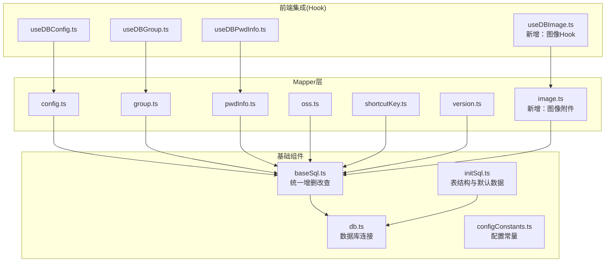
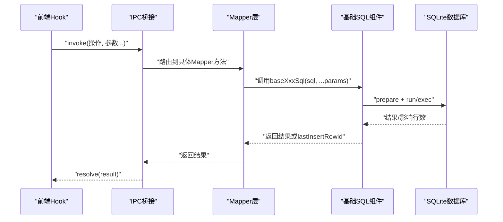
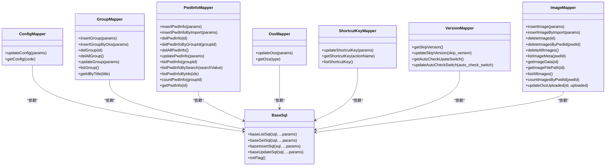
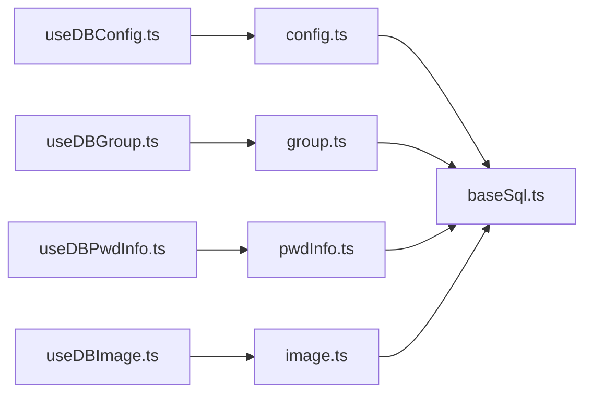
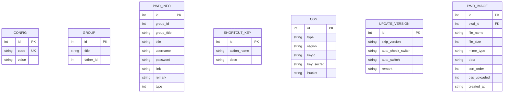

# Mapper层设计

<cite>
**本文引用的文件**
- [baseSql.ts](file://electron/db/sqlite/components/baseSql.ts)
- [config.ts](file://electron/db/sqlite/mapper/config.ts)
- [group.ts](file://electron/db/sqlite/mapper/group.ts)
- [pwdInfo.ts](file://electron/db/sqlite/mapper/pwdInfo.ts)
- [oss.ts](file://electron/db/sqlite/mapper/oss.ts)
- [shortcutKey.ts](file://electron/db/sqlite/mapper/shortcutKey.ts)
- [version.ts](file://electron/db/sqlite/mapper/version.ts)
- [image.ts](file://electron/db/sqlite/mapper/image.ts)
- [initSql.ts](file://electron/db/sqlite/components/initSql.ts)
- [db.ts](file://electron/db/sqlite/components/db.ts)
- [configConstants.ts](file://electron/db/sqlite/components/configConstants.ts)
- [type.ts](file://src/components/type.ts)
- [useDBConfig.ts](file://src/hooks/useDBConfig.ts)
- [useDBGroup.ts](file://src/hooks/useDBGroup.ts)
- [useDBPwdInfo.ts](file://src/hooks/useDBPwdInfo.ts)
- [useDBImage.ts](file://src/hooks/useDBImage.ts)
- [ImageGallery.vue](file://src/components/indexview/ImageGallery.vue)
- [sqlite-ipc.ts](file://electron/db/sqlite/sqlite-ipc.ts)
- [constant.ts](file://electron/constant.ts)
</cite>

## 更新摘要
**变更内容**
- 新增完整的图像附件管理功能，包括加密存储、元数据管理和批量操作
- 更新图像表结构，从直接存储Base64数据改为存储文件路径
- 扩展了数据库访问层架构，支持文件系统与数据库的双重存储策略
- 增强了前端图像组件的功能，支持拖拽上传、粘贴上传、批量操作等

## 目录
1. [引言](#引言)
2. [项目结构](#项目结构)
3. [核心组件](#核心组件)
4. [架构总览](#架构总览)
5. [详细组件分析](#详细组件分析)
6. [依赖分析](#依赖分析)
7. [性能考虑](#性能考虑)
8. [故障排查指南](#故障排查指南)
9. [结论](#结论)
10. [附录](#附录)

## 引言
本文件面向密码管理器的数据库访问层（Mapper层），系统性阐述基于SQLite的DAO设计与实现，重点覆盖以下方面：
- 基础SQL组件的统一抽象与调用链路
- 各Mapper类的职责边界与业务封装
- CRUD操作的SQL构建、参数绑定与结果映射
- 与前端Hook层的集成方式与典型业务场景
- 数据验证、事务处理与错误恢复机制
- **新增**：图像附件功能的完整实现方案，包括文件系统存储、加密传输、元数据管理和批量操作

## 项目结构
Mapper层位于Electron主进程侧，采用"基础SQL组件 + 具体Mapper"的分层设计。基础组件提供通用的增删改查能力；具体Mapper聚焦于各业务实体（config、group、pwdInfo、oss、shortcutKey、version、image）的CRUD封装；初始化脚本负责首次运行时的表结构与默认数据创建。

**图表来源**
- [baseSql.ts:1-87](file://electron/db/sqlite/components/baseSql.ts#L1-L87)
- [db.ts:1-30](file://electron/db/sqlite/components/db.ts#L1-L30)
- [initSql.ts:1-277](file://electron/db/sqlite/components/initSql.ts#L1-L277)
- [config.ts:1-27](file://electron/db/sqlite/mapper/config.ts#L1-L27)
- [group.ts:1-49](file://electron/db/sqlite/mapper/group.ts#L1-L49)
- [pwdInfo.ts:1-100](file://electron/db/sqlite/mapper/pwdInfo.ts#L1-L100)
- [oss.ts:1-30](file://electron/db/sqlite/mapper/oss.ts#L1-L30)
- [shortcutKey.ts:1-32](file://electron/db/sqlite/mapper/shortcutKey.ts#L1-L32)
- [version.ts:1-38](file://electron/db/sqlite/mapper/version.ts#L1-L38)
- [image.ts:1-82](file://electron/db/sqlite/mapper/image.ts#L1-L82)
- [useDBConfig.ts:1-21](file://src/hooks/useDBConfig.ts#L1-L21)
- [useDBGroup.ts:1-53](file://src/hooks/useDBGroup.ts#L1-L53)
- [useDBPwdInfo.ts:1-103](file://src/hooks/useDBPwdInfo.ts#L1-L103)
- [useDBImage.ts:1-206](file://src/hooks/useDBImage.ts#L1-L206)

**章节来源**
- [baseSql.ts:1-87](file://electron/db/sqlite/components/baseSql.ts#L1-L87)
- [initSql.ts:1-277](file://electron/db/sqlite/components/initSql.ts#L1-L277)
- [db.ts:1-30](file://electron/db/sqlite/components/db.ts#L1-L30)

## 核心组件
- 基础SQL组件（baseSql.ts）
  - 提供统一的列表查询、单条查询、插入、更新、初始化检测等能力，内部通过prepare与run实现参数化执行，并对异常进行捕获与返回空值/零值，保证上层调用的健壮性。
  - 事务支持以函数式封装形式给出注释示例，便于后续按需扩展。
- 数据库连接（db.ts）
  - 使用Electron应用用户数据目录定位数据库文件，确保跨平台路径一致；提供连接获取与关闭接口。
- 初始化脚本（initSql.ts）
  - 首次运行检测表是否存在，不存在则创建表结构与默认数据；包含版本表的创建与初始化；**新增**：图像表的创建与索引建立，支持文件系统存储迁移。
- 配置常量（configConstants.ts）
  - 定义系统配置键与快捷键动作名等常量，供初始化与业务逻辑使用。

**章节来源**
- [baseSql.ts:1-87](file://electron/db/sqlite/components/baseSql.ts#L1-L87)
- [db.ts:1-30](file://electron/db/sqlite/components/db.ts#L1-L30)
- [initSql.ts:1-277](file://electron/db/sqlite/components/initSql.ts#L1-L277)
- [configConstants.ts:1-29](file://electron/db/sqlite/components/configConstants.ts#L1-L29)

## 架构总览
Mapper层遵循"面向实体的DAO"模式：每个Mapper封装对应表的CRUD操作，内部仅依赖基础SQL组件，不直接持有业务逻辑，保持高内聚低耦合。前端通过Hook层发起请求，经IPC桥接至主进程的Mapper执行数据库操作。**新增**：图像映射器提供完整的图片附件管理功能，支持文件系统存储、加密传输、元数据管理和批量操作。

**图表来源**
- [config.ts:1-27](file://electron/db/sqlite/mapper/config.ts#L1-L27)
- [group.ts:1-49](file://electron/db/sqlite/mapper/group.ts#L1-L49)
- [pwdInfo.ts:1-100](file://electron/db/sqlite/mapper/pwdInfo.ts#L1-L100)
- [oss.ts:1-30](file://electron/db/sqlite/mapper/oss.ts#L1-L30)
- [shortcutKey.ts:1-32](file://electron/db/sqlite/mapper/shortcutKey.ts#L1-L32)
- [version.ts:1-38](file://electron/db/sqlite/mapper/version.ts#L1-L38)
- [image.ts:1-82](file://electron/db/sqlite/mapper/image.ts#L1-L82)
- [baseSql.ts:1-87](file://electron/db/sqlite/components/baseSql.ts#L1-L87)

## 详细组件分析

### 基础SQL组件（baseSql.ts）
- 设计要点
  - 统一入口：所有SQL执行均通过prepare与run，避免硬编码字符串拼接，降低注入风险。
  - 错误处理：捕获异常并记录日志，返回null或0，保证调用方不会因异常中断。
  - 返回约定：查询类返回数组或对象；插入类返回lastInsertRowid；更新类返回1表示成功、0表示失败。
  - 初始化检测：提供表存在性检测，用于首次初始化流程判断。
- 性能与安全
  - 参数化查询由better-sqlite3驱动，具备高性能与强安全特性。
  - 日志输出可用于调试，生产环境可按需关闭。

**章节来源**
- [baseSql.ts:1-87](file://electron/db/sqlite/components/baseSql.ts#L1-L87)

### config Mapper（config.ts）
- 职责与封装
  - 更新配置项：根据code更新value。
  - 查询配置项：根据code返回value。
- SQL与参数
  - 更新：SET value = ? WHERE code = ?。
  - 查询：SELECT value WHERE code = ?。
- 结果映射
  - 返回类型为Config接口定义的对象，字段包含id、code、value。

**章节来源**
- [config.ts:1-27](file://electron/db/sqlite/mapper/config.ts#L1-L27)
- [type.ts:31-38](file://src/components/type.ts#L31-L38)

### group Mapper（group.ts）
- 职责与封装
  - 插入分组：常规插入与从OSS导入时的带id插入。
  - 删除分组：按id删除与清空表。
  - 更新分组：按id更新title。
  - 查询：列出全部分组、按title查询id。
- SQL与参数
  - 插入：INSERT INTO "group"(title, father_id) VALUES (?, ?)。
  - 删除：DELETE FROM "group" WHERE id = ? 或全表删除。
  - 更新：UPDATE "group" SET title = ? WHERE id = ?。
  - 查询：SELECT * FROM "group"；SELECT id FROM "group" WHERE title = ?。
- 结果映射
  - 列表查询返回数组；单值查询返回对象或标量。

**章节来源**
- [group.ts:1-49](file://electron/db/sqlite/mapper/group.ts#L1-L49)

### pwdInfo Mapper（pwdInfo.ts）
- 职责与封装
  - 插入：普通插入与导入插入（含title/username/password/link/remark）。
  - 删除：按id删除、按group_id批量删除、全表删除。
  - 更新：按id更新全部字段。
  - 查询：按group_id列表、按关键字搜索、按id集合查询、统计数量、按id查询。
- SQL与参数
  - 搜索：WHERE title like '%' || ? || '%' or username like '%' || ? || '%'。
  - IN查询：动态生成占位符，如(id IN (?, ?, ...))。
  - 计数：SELECT count(*) as count WHERE group_id = ?。
- 结果映射
  - 列表查询返回数组；单条查询返回对象；计数返回数字。
- 数据验证
  - IN查询前对id数组进行过滤，排除非数值与非正数，避免无效查询。

**章节来源**
- [pwdInfo.ts:1-100](file://electron/db/sqlite/mapper/pwdInfo.ts#L1-L100)

### oss Mapper（oss.ts）
- 职责与封装
  - 更新OSS配置：按type更新region/keyId/key_secret/bucket。
  - 查询OSS配置：按type返回完整记录。
- SQL与参数
  - 更新：多字段SET，WHERE type = ?。
  - 查询：SELECT * WHERE type = ?。
- 结果映射
  - 返回类型为OssForm接口对象。

**章节来源**
- [oss.ts:1-30](file://electron/db/sqlite/mapper/oss.ts#L1-L30)
- [type.ts:9-17](file://src/components/type.ts#L9-L17)

### shortcutKey Mapper（shortcutKey.ts）
- 职责与封装
  - 更新快捷键描述：按action_name更新desc。
  - 查询快捷键描述：按action_name返回desc。
  - 列出全部快捷键：返回完整列表。
- SQL与参数
  - 更新：SET desc = ? WHERE action_name = ?。
  - 查询：SELECT "desc" WHERE action_name = ?；SELECT *。
- 结果映射
  - 单条查询返回ShortCutKeyComb对象；列表查询返回数组。

**章节来源**
- [shortcutKey.ts:1-32](file://electron/db/sqlite/mapper/shortcutKey.ts#L1-L32)
- [type.ts:19-29](file://src/components/type.ts#L19-L29)

### version Mapper（version.ts）
- 职责与封装
  - 查询跳过版本：返回skip_version。
  - 更新跳过版本：设置skip_version。
  - 查询自动检查开关：返回auto_check_switch。
  - 更新自动检查开关：设置auto_check_switch。
- SQL与参数
  - 查询：SELECT skip_version/auto_check_switch FROM "update_version"。
  - 更新：SET skip_version/auto_check_switch = ?。
- 结果映射
  - 返回类型为UpdateVersion接口对象。

**章节来源**
- [version.ts:1-38](file://electron/db/sqlite/mapper/version.ts#L1-L38)
- [type.ts:39-47](file://src/components/type.ts#L39-L47)

### image Mapper（image.ts）**新增**
- 职责与封装
  - 插入图片：普通插入与导入插入（支持自动生成id）。
  - 删除图片：按id删除、按密码条目删除、全表删除。
  - 查询图片：按密码条目查询元数据、查询单张图片数据、查询全部图片、统计数量。
  - 更新OSS上传状态：标记图片是否已上传到OSS。
- SQL与参数
  - 插入：INSERT INTO "pwd_image"(pwd_id, file_name, file_size, mime_type, data, sort_order, oss_uploaded) VALUES (?, ?, ?, ?, ?, ?, ?)。
  - 删除：DELETE FROM "pwd_image" WHERE id = ?；DELETE FROM "pwd_image" WHERE pwd_id = ?；DELETE FROM "pwd_image"。
  - 查询：SELECT id, pwd_id, file_name, file_size, mime_type, sort_order, created_at, oss_uploaded FROM "pwd_image" WHERE pwd_id = ? ORDER BY sort_order, id。
  - 更新：UPDATE "pwd_image" SET oss_uploaded = ? WHERE id = ?。
- 结果映射
  - 元数据查询返回PwdImageMeta数组；单张图片查询返回对象；计数查询返回数字。
- 数据验证
  - 查询前对pwdId进行空值检查，避免无效查询。
- **重要变更**：存储策略迁移
  - 从直接存储Base64数据改为存储文件相对路径，支持文件系统存储迁移。
  - 新增oss_uploaded字段，用于跟踪图片在OSS中的上传状态。

**章节来源**
- [image.ts:1-82](file://electron/db/sqlite/mapper/image.ts#L1-L82)
- [type.ts:93-128](file://src/components/type.ts#L93-L128)

### 初始化与默认数据（initSql.ts）
- 表结构
  - group、pwd_info、config、shortcut_key、oss、update_version、**新增**：pwd_image。
- 默认数据
  - config：包含自动启动、默认密码、首次登录标记、主题开关、自动锁屏时间等。
  - shortcut_key：预置常用快捷键动作与描述。
  - oss：预置阿里云与腾讯云类型记录。
  - update_version：初始化skip_version与开关字段。
- 流程控制
  - 通过initFlag检测表是否存在，避免重复初始化。
- **新增**：图像表结构与迁移策略
  - 包含id、pwd_id、file_name、file_size、mime_type、data、sort_order、oss_uploaded、created_at字段。
  - 建立pwd_id索引以优化查询性能。
  - 支持默认时间戳和排序字段。
  - **重要变更**：支持从Base64数据向文件系统存储的迁移，包含oss_uploaded字段的添加和数据迁移逻辑。

**章节来源**
- [initSql.ts:1-277](file://electron/db/sqlite/components/initSql.ts#L1-L277)
- [configConstants.ts:1-29](file://electron/db/sqlite/components/configConstants.ts#L1-L29)

### 类关系图（代码级）

**图表来源**
- [baseSql.ts:1-87](file://electron/db/sqlite/components/baseSql.ts#L1-L87)
- [config.ts:1-27](file://electron/db/sqlite/mapper/config.ts#L1-L27)
- [group.ts:1-49](file://electron/db/sqlite/mapper/group.ts#L1-L49)
- [pwdInfo.ts:1-100](file://electron/db/sqlite/mapper/pwdInfo.ts#L1-L100)
- [oss.ts:1-30](file://electron/db/sqlite/mapper/oss.ts#L1-L30)
- [shortcutKey.ts:1-32](file://electron/db/sqlite/mapper/shortcutKey.ts#L1-L32)
- [version.ts:1-38](file://electron/db/sqlite/mapper/version.ts#L1-L38)
- [image.ts:1-82](file://electron/db/sqlite/mapper/image.ts#L1-L82)

## 依赖分析
- 组件耦合
  - Mapper层仅依赖基础SQL组件，无循环依赖，内聚度高。
  - 前端Hook层通过IPC调用，解耦了渲染进程与主进程数据库操作。
- 外部依赖
  - better-sqlite3提供高性能本地数据库能力。
  - Electron app.getPath('userData')确保数据库文件位置稳定。
- 接口契约
  - 所有Mapper方法均以参数化SQL执行，返回约定的数据结构，便于前端统一处理。
- **新增**：图像功能依赖
  - 图像Hook依赖加密模块进行数据安全处理。
  - 图像组件依赖Element Plus UI库和文件处理API。
  - **重要变更**：支持文件系统存储与数据库存储的混合模式。

**图表来源**
- [useDBConfig.ts:1-21](file://src/hooks/useDBConfig.ts#L1-L21)
- [useDBGroup.ts:1-53](file://src/hooks/useDBGroup.ts#L1-L53)
- [useDBPwdInfo.ts:1-103](file://src/hooks/useDBPwdInfo.ts#L1-L103)
- [useDBImage.ts:1-206](file://src/hooks/useDBImage.ts#L1-L206)
- [config.ts:1-27](file://electron/db/sqlite/mapper/config.ts#L1-L27)
- [group.ts:1-49](file://electron/db/sqlite/mapper/group.ts#L1-L49)
- [pwdInfo.ts:1-100](file://electron/db/sqlite/mapper/pwdInfo.ts#L1-L100)
- [image.ts:1-82](file://electron/db/sqlite/mapper/image.ts#L1-L82)
- [baseSql.ts:1-87](file://electron/db/sqlite/components/baseSql.ts#L1-L87)

## 性能考虑
- 参数化查询
  - 所有SQL均通过prepare+run执行，避免字符串拼接，减少注入风险并提升缓存命中率。
- 批量初始化
  - 初始化脚本一次性创建表与默认数据，减少多次往返。
- IN查询优化
  - pwdInfo的按id集合查询动态生成占位符，避免超长SQL与越界问题。
- **新增**：图像查询优化
  - 图像表建立pwd_id索引，优化按密码条目查询性能。
  - 支持懒加载机制，仅在需要时加载图片数据。
  - **重要变更**：文件系统存储减少了数据库存储压力，提升了查询性能。
- 日志与调试
  - 基础SQL组件提供日志输出，便于开发期定位问题；生产可按需关闭。

## 故障排查指南
- 常见问题
  - 查询为空：确认SQL条件是否正确、参数是否传入、表是否已初始化。
  - 插入失败：检查唯一约束冲突（如config.code）、参数个数与顺序。
  - 更新无效果：确认WHERE条件匹配到目标记录。
  - **新增**：图像相关问题
    - 图片无法显示：检查MIME类型是否正确、文件路径是否有效、文件是否已加密。
    - 图片上传失败：检查文件大小限制、格式支持、存储空间、文件系统权限。
    - 图片同步异常：确认加密数据完整性、网络连接状态、oss_uploaded状态。
    - **重要变更**：数据迁移问题：检查Base64到文件路径的迁移是否成功。
- 错误处理
  - 基础SQL组件在异常时返回null或0并记录错误日志，便于上层判断与重试。
- 事务建议
  - 对多步写入可参考基础SQL组件中的事务注释示例，封装成批量事务以保证一致性。

**章节来源**
- [baseSql.ts:1-87](file://electron/db/sqlite/components/baseSql.ts#L1-L87)

## 结论
本Mapper层通过"基础SQL组件 + 实体Mapper"的架构，实现了清晰的职责划分与良好的扩展性。所有CRUD操作均采用参数化SQL与统一错误处理，配合初始化脚本与前端Hook层，满足密码管理器的核心数据访问需求。**新增**的图像附件功能提供了完整的图片管理解决方案，包括文件系统存储、加密传输、元数据管理、批量操作等功能，进一步增强了系统的实用性。**重要变更**：存储策略从直接存储Base64数据迁移到文件系统存储，显著提升了性能和安全性。后续可在事务、索引与复杂联表查询等方面进一步增强。

## 附录

### 典型业务场景示例

- 场景一：按组查询密码条目
  - 步骤
    - 前端调用Hook方法获取分组下的密码列表。
    - Hook通过IPC调用Mapper的按组查询方法。
    - Mapper构造SQL并执行，返回结果后由Hook解密并返回给UI。
  - 关键路径
    - [useDBPwdInfo.ts:65-70](file://src/hooks/useDBPwdInfo.ts#L65-L70)
    - [pwdInfo.ts:50-60](file://electron/db/sqlite/mapper/pwdInfo.ts#L50-L60)

- 场景二：导入外部数据并入库
  - 步骤
    - 前端加密敏感字段后，调用Hook的导入方法。
    - Hook通过IPC调用Mapper的导入插入方法。
    - Mapper执行参数化插入，返回lastInsertRowid。
  - 关键路径
    - [useDBPwdInfo.ts:28-33](file://src/hooks/useDBPwdInfo.ts#L28-L33)
    - [pwdInfo.ts:12-16](file://electron/db/sqlite/mapper/pwdInfo.ts#L12-L16)

- 场景三：批量删除某分组下的密码
  - 步骤
    - 前端调用Hook的按组删除方法。
    - Hook通过IPC调用Mapper的按组删除方法。
    - Mapper执行参数化删除，返回成功状态。
  - 关键路径
    - [useDBPwdInfo.ts:48-53](file://src/hooks/useDBPwdInfo.ts#L48-L53)
    - [pwdInfo.ts:24-29](file://electron/db/sqlite/mapper/pwdInfo.ts#L24-L29)

- 场景四：初始化数据库与默认数据
  - 步骤
    - 应用启动时检测表是否存在。
    - 若不存在，创建表并插入默认数据。
  - 关键路径
    - [initSql.ts:26-46](file://electron/db/sqlite/components/initSql.ts#L26-L46)
    - [initSql.ts:131-143](file://electron/db/sqlite/components/initSql.ts#L131-L143)

- **新增**：场景五：图片附件管理
  - 步骤
    - 用户上传图片文件，前端Hook进行格式和大小验证。
    - 文件转换为Base64并加密后存储到文件系统，数据库存储文件路径。
    - 显示图片缩略图，按需加载完整图片数据。
  - 关键路径
    - [useDBImage.ts:28-51](file://src/hooks/useDBImage.ts#L28-L51)
    - [image.ts:6-16](file://electron/db/sqlite/mapper/image.ts#L6-L16)
    - [ImageGallery.vue:94-132](file://src/components/indexview/ImageGallery.vue#L94-L132)

- **新增**：场景六：图像数据迁移
  - 步骤
    - 系统检测到旧版本的Base64数据格式。
    - 自动迁移所有图片数据到文件系统存储。
    - 更新数据库记录，标记迁移状态。
  - 关键路径
    - [initSql.ts:200-243](file://electron/db/sqlite/components/initSql.ts#L200-L243)
    - [image.ts:76-81](file://electron/db/sqlite/mapper/image.ts#L76-L81)

### 数据模型概览

**图表来源**
- [initSql.ts:51-174](file://electron/db/sqlite/components/initSql.ts#L51-L174)
- [type.ts:9-128](file://src/components/type.ts#L9-L128)

### 图像功能技术规范

#### 存储策略演进
- **初始版本**：直接存储Base64编码的图片数据到数据库
- **当前版本**：存储文件系统中的相对路径，数据库只保存元数据
- **迁移机制**：自动检测并迁移历史数据，保持向后兼容

#### 图像存储策略
- **文件系统存储**：图片数据存储在应用用户数据目录的文件系统中
- **数据库存储**：仅存储文件路径、元数据和上传状态
- **加密保护**：文件系统中的图片数据采用AES加密存储
- **懒加载**：仅在需要时加载图片数据，提升性能

#### 图像处理流程
1. **上传阶段**：前端验证文件格式、大小，转换为Base64
2. **加密阶段**：使用对称加密算法加密Base64数据
3. **文件存储**：将加密数据写入文件系统，返回相对路径
4. **数据库记录**：将文件路径和元数据写入数据库
5. **加载阶段**：按需从文件系统读取并解密返回给前端

#### 性能优化措施
- **懒加载**：仅在需要时加载完整图片数据
- **缓存机制**：内存中缓存已加载的图片数据URL
- **索引优化**：为pwd_id字段建立索引，提升查询性能
- **文件系统存储**：减少数据库存储压力，提升查询速度
- **批量操作**：支持批量删除和导入，减少数据库往返
- **迁移优化**：后台异步迁移历史数据，不影响用户体验

**章节来源**
- [image.ts:1-82](file://electron/db/sqlite/mapper/image.ts#L1-L82)
- [useDBImage.ts:1-206](file://src/hooks/useDBImage.ts#L1-L206)
- [ImageGallery.vue:1-506](file://src/components/indexview/ImageGallery.vue#L1-L506)
- [sqlite-ipc.ts:240-295](file://electron/db/sqlite/sqlite-ipc.ts#L240-L295)
- [constant.ts:43-68](file://electron/constant.ts#L43-L68)
- [initSql.ts:158-243](file://electron/db/sqlite/components/initSql.ts#L158-L243)