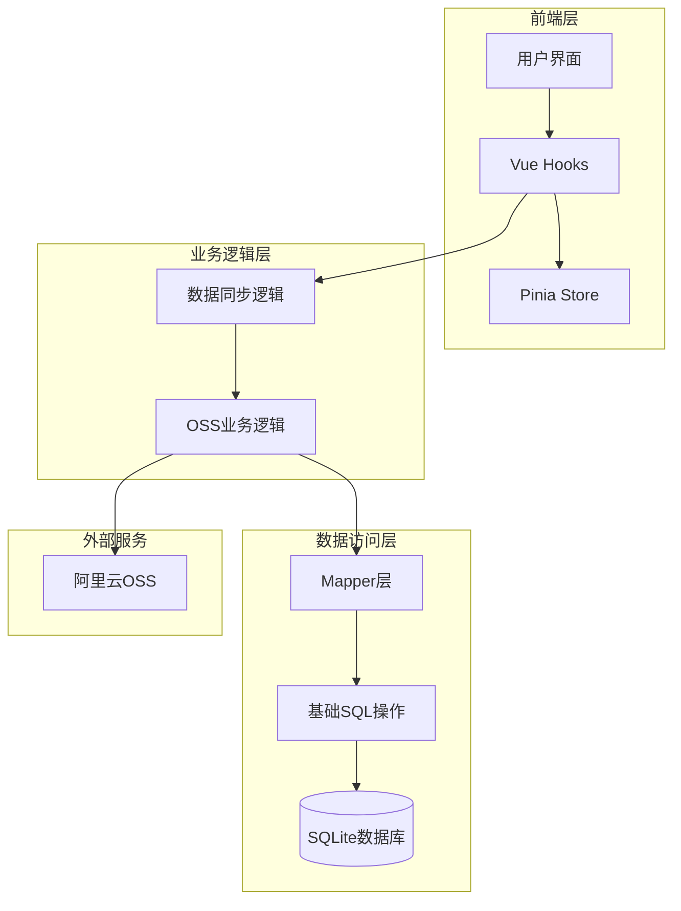
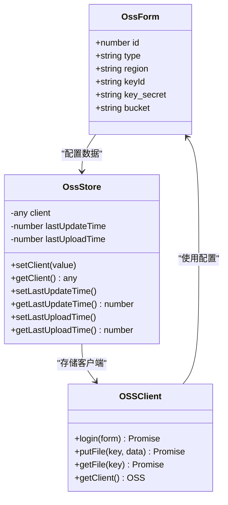
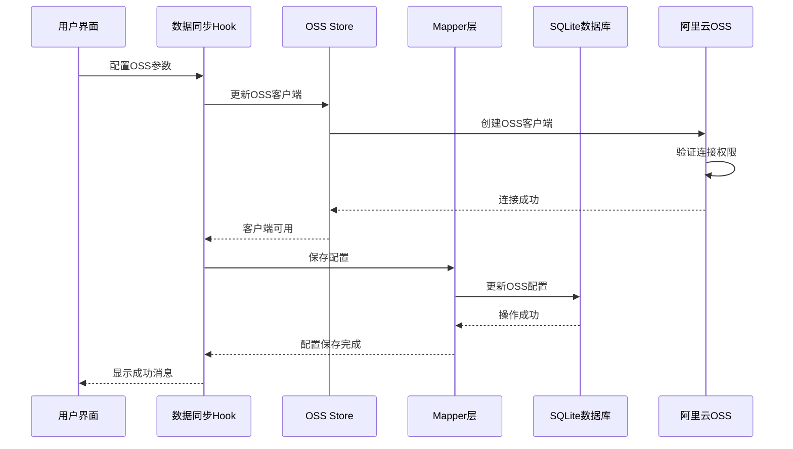
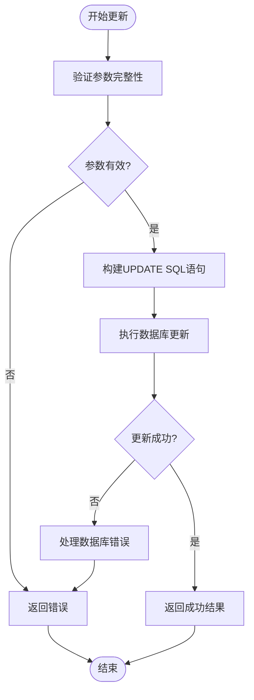
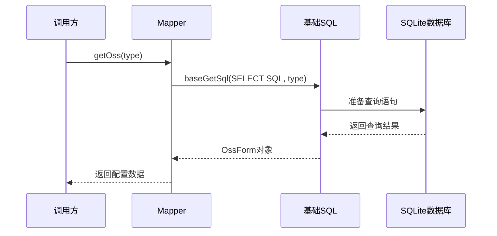
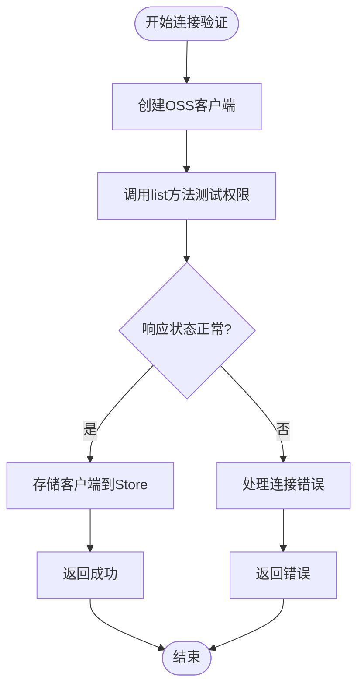
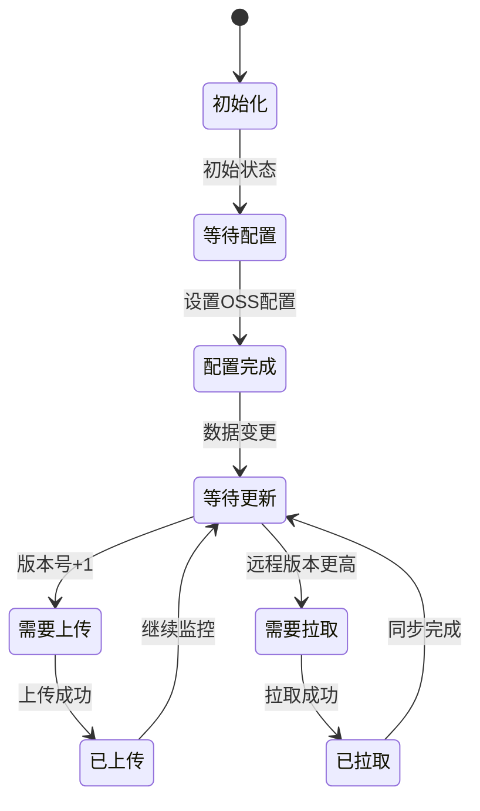
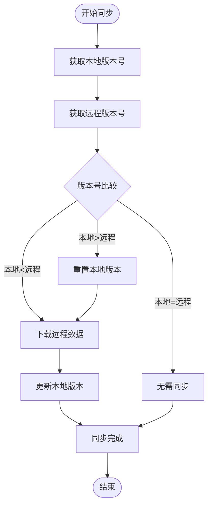
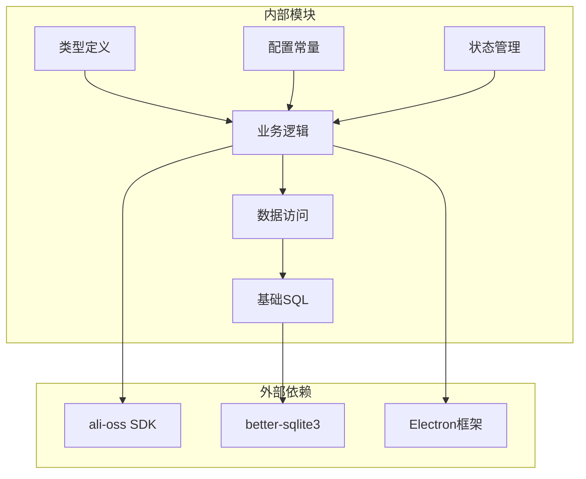
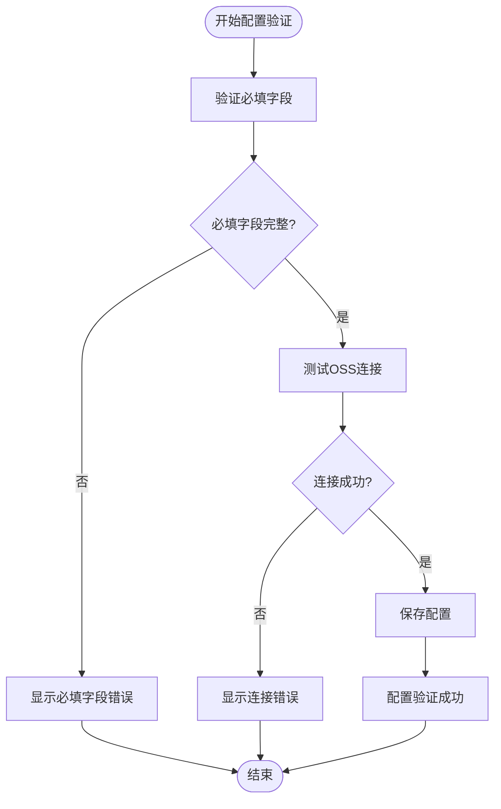

# OSS配置Mapper技术文档

<cite>
**本文档引用的文件**
- [oss.ts](file://electron/db/sqlite/mapper/oss.ts)
- [useDBOss.ts](file://src/hooks/useDBOss.ts)
- [oss.ts](file://src/store/oss.ts)
- [useOss.ts](file://src/hooks/useOss.ts)
- [configConstants.ts](file://electron/db/sqlite/components/configConstants.ts)
- [type.ts](file://src/components/type.ts)
- [main.ts](file://electron/main.ts)
- [config.ts](file://src/config/config.ts)
- [useDataSync.ts](file://src/hooks/useDataSync.ts)
- [baseSql.ts](file://electron/db/sqlite/components/baseSql.ts)
- [initSql.ts](file://electron/db/sqlite/components/initSql.ts)
- [DataSync.vue](file://src/components/setview/DataSync.vue)
- [BasicSet.vue](file://src/components/setview/BasicSet.vue)
</cite>

## 目录
1. [简介](#简介)
2. [项目结构](#项目结构)
3. [核心组件](#核心组件)
4. [架构概览](#架构概览)
5. [详细组件分析](#详细组件分析)
6. [依赖关系分析](#依赖关系分析)
7. [性能考虑](#性能考虑)
8. [故障排除指南](#故障排除指南)
9. [结论](#结论)
10. [附录](#附录)

## 简介

OSS配置Mapper是密码管理器项目中用于管理阿里云OSS配置的核心组件。该组件实现了本地SQLite数据库与阿里云OSS之间的数据同步功能，提供了完整的配置存储、验证和管理机制。

本文档深入分析了OSS配置Mapper的实现原理，包括：
- 阿里云OSS配置信息的存储和管理机制
- OSS连接参数的配置方式（Endpoint、AccessKey、SecretKey、BucketName等）
- OSS配置的业务逻辑（连接测试、配置更新、安全存储）
- OSS配置在数据同步中的作用和重要性
- 实际使用示例和常见问题解决方案

## 项目结构

密码管理器采用前后端分离的架构设计，OSS配置Mapper位于Electron应用的数据库层，负责处理OSS配置的持久化存储。

**图表来源**
- [oss.ts:1-30](file://electron/db/sqlite/mapper/oss.ts#L1-L30)
- [useOss.ts:1-107](file://src/hooks/useOss.ts#L1-L107)
- [useDataSync.ts:1-324](file://src/hooks/useDataSync.ts#L1-L324)

**章节来源**
- [oss.ts:1-30](file://electron/db/sqlite/mapper/oss.ts#L1-L30)
- [useDBOss.ts:1-17](file://src/hooks/useDBOss.ts#L1-L17)
- [oss.ts:1-59](file://src/store/oss.ts#L1-L59)

## 核心组件

### OSS配置数据模型

OSS配置采用统一的数据模型，确保配置信息的一致性和完整性：

**图表来源**
- [type.ts:9-17](file://src/components/type.ts#L9-L17)
- [oss.ts:1-59](file://src/store/oss.ts#L1-L59)
- [useOss.ts:1-107](file://src/hooks/useOss.ts#L1-L107)

### 数据库表结构

OSS配置存储在SQLite数据库的`oss`表中，包含完整的配置字段：

| 字段名 | 类型 | 描述 | 约束 |
|--------|------|------|------|
| id | INTEGER | 主键标识 | PRIMARY KEY AUTOINCREMENT |
| type | TEXT | 云服务商类型 | NOT NULL |
| region | TEXT | 区域信息 | NULL |
| keyId | TEXT | 访问密钥ID | NULL |
| key_secret | TEXT | 访问密钥密文 | NULL |
| bucket | TEXT | 存储桶名称 | NULL |

**章节来源**
- [initSql.ts:91-100](file://electron/db/sqlite/components/initSql.ts#L91-L100)
- [type.ts:9-17](file://src/components/type.ts#L9-L17)

## 架构概览

OSS配置Mapper采用了分层架构设计，确保了代码的可维护性和扩展性：

**图表来源**
- [useDataSync.ts:284-320](file://src/hooks/useDataSync.ts#L284-L320)
- [useOss.ts:10-27](file://src/hooks/useOss.ts#L10-L27)
- [oss.ts:8-23](file://electron/db/sqlite/mapper/oss.ts#L8-L23)

## 详细组件分析

### Mapper层实现

Mapper层负责直接与数据库交互，提供OSS配置的CRUD操作：

#### 更新OSS配置

**图表来源**
- [oss.ts:8-16](file://electron/db/sqlite/mapper/oss.ts#L8-L16)

#### 查询OSS配置

查询操作采用异步模式，确保不会阻塞主线程：

**图表来源**
- [oss.ts:18-23](file://electron/db/sqlite/mapper/oss.ts#L18-L23)

**章节来源**
- [oss.ts:1-30](file://electron/db/sqlite/mapper/oss.ts#L1-L30)

### Hook层实现

Hook层封装了业务逻辑，提供了简洁的API接口：

#### OSS连接验证

连接验证是OSS配置的关键环节，确保配置的有效性：

**图表来源**
- [useOss.ts:10-27](file://src/hooks/useOss.ts#L10-L27)

#### 文件上传和下载

文件操作采用Promise模式，提供异步处理能力：

**章节来源**
- [useOss.ts:1-107](file://src/hooks/useOss.ts#L1-L107)

### Store层实现

Store层使用Pinia状态管理，提供全局状态共享：

#### 版本控制机制

**图表来源**
- [oss.ts:28-59](file://src/store/oss.ts#L28-L59)

**章节来源**
- [oss.ts:1-59](file://src/store/oss.ts#L1-L59)

### 数据同步逻辑

数据同步模块实现了完整的双向同步机制：

#### 同步策略

系统提供了两种同步策略供选择：

**策略一：时间戳同步**
- 上传：修改操作触发上传，定时上传（5秒间隔）
- 同步：手动同步（F5），启动时同步
- 本地与服务器时间比较，不一致则拉取

**策略二：版本号同步**（推荐）
- 上传：上传完成后上传版本号，本地保存版本号
- 同步：比较本地和服务器版本号，不一致则拉取

#### 版本控制流程

**图表来源**
- [useDataSync.ts:79-131](file://src/hooks/useDataSync.ts#L79-L131)

**章节来源**
- [useDataSync.ts:1-324](file://src/hooks/useDataSync.ts#L1-L324)

## 依赖关系分析

OSS配置Mapper的依赖关系清晰明确，遵循单一职责原则：

**图表来源**
- [useOss.ts:1-107](file://src/hooks/useOss.ts#L1-L107)
- [oss.ts:1-30](file://electron/db/sqlite/mapper/oss.ts#L1-L30)
- [baseSql.ts:1-87](file://electron/db/sqlite/components/baseSql.ts#L1-L87)

**章节来源**
- [main.ts:1-240](file://electron/main.ts#L1-L240)
- [configConstants.ts:1-29](file://electron/db/sqlite/components/configConstants.ts#L1-L29)

## 性能考虑

### 数据库性能优化

1. **预编译语句**：使用预编译SQL语句减少解析开销
2. **事务处理**：批量操作使用事务确保数据一致性
3. **索引优化**：关键查询字段建立适当索引

### 网络性能优化

1. **连接池管理**：复用OSS客户端连接
2. **异步操作**：避免阻塞UI线程
3. **错误重试**：网络异常时自动重试机制

### 内存管理

1. **及时释放**：使用完的资源及时释放
2. **状态清理**：应用退出时清理全局状态
3. **内存监控**：定期检查内存使用情况

## 故障排除指南

### 常见连接错误及解决方案

| 错误代码 | 错误描述 | 可能原因 | 解决方案 |
|----------|----------|----------|----------|
| RequestError | 请求错误 | 桶名称、跨域设置、region配置错误 | 检查OSS桶配置和跨域设置 |
| InvalidAccessKeyId | AccessKey ID无效 | keyId错误或过期 | 重新生成有效的AccessKey |
| SignatureDoesNotMatch | 签名不匹配 | keySecret错误 | 验证AccessKey Secret |
| AccessDenied | 权限不足 | 用户无访问存储桶权限 | 检查RAM角色和权限策略 |

### 配置验证流程

**图表来源**
- [useDataSync.ts:284-320](file://src/hooks/useDataSync.ts#L284-L320)

### 数据同步问题排查

1. **版本冲突**：当本地版本大于远程版本时，需要重置本地版本
2. **网络超时**：检查网络连接和防火墙设置
3. **权限问题**：验证OSS存储桶的读写权限
4. **存储空间**：确认OSS存储桶有足够的可用空间

**章节来源**
- [useDataSync.ts:29-73](file://src/hooks/useDataSync.ts#L29-L73)

## 结论

OSS配置Mapper通过精心设计的分层架构和完善的错误处理机制，为密码管理器提供了可靠的云端数据同步能力。其主要特点包括：

1. **安全性**：采用SQLite本地存储和OSS云存储双重保障
2. **可靠性**：完善的错误处理和重试机制
3. **易用性**：简洁的API接口和直观的配置界面
4. **可扩展性**：模块化设计便于功能扩展

该组件为用户提供了安全、便捷的云端数据备份和同步解决方案，是密码管理器的重要组成部分。

## 附录

### 配置参数说明

| 参数名称 | 字段名 | 必填 | 描述 |
|----------|--------|------|------|
| 区域 | region | 是 | OSS存储桶所在区域 |
| AccessKey ID | keyId | 是 | 访问密钥标识符 |
| AccessKey Secret | key_secret | 是 | 访问密钥密文 |
| 存储桶 | bucket | 是 | OSS存储桶名称 |
| 云服务商类型 | type | 否 | 默认为阿里云OSS |

### 使用示例

#### 完整配置流程

1. **初始化配置**：系统启动时自动创建OSS配置记录
2. **填写配置**：在设置界面填写OSS连接参数
3. **测试连接**：点击"测试连接"验证配置有效性
4. **保存配置**：连接成功后保存配置到数据库
5. **启用同步**：开启数据同步开关开始自动同步

#### 常见问题解决

- **无法连接OSS**：检查网络连接和OSS服务状态
- **权限不足**：验证RAM角色和OSS存储桶权限策略
- **同步失败**：查看日志输出定位具体错误原因
- **版本冲突**：根据提示重置本地版本后重新同步