# 分组信息Mapper

<cite>
**本文档引用的文件**
- [group.ts](file://electron/db/sqlite/mapper/group.ts)
- [initSql.ts](file://electron/db/sqlite/components/initSql.ts)
- [baseSql.ts](file://electron/db/sqlite/components/baseSql.ts)
- [db.ts](file://electron/db/sqlite/components/db.ts)
- [sqlite-ipc.ts](file://electron/db/sqlite/sqlite-ipc.ts)
- [constant.ts](file://electron/constant.ts)
- [useDBGroup.ts](file://src/hooks/useDBGroup.ts)
- [Group.vue](file://src/components/indexview/Group.vue)
- [type.ts](file://src/components/type.ts)
</cite>

## 目录
1. [简介](#简介)
2. [项目结构](#项目结构)
3. [核心组件](#核心组件)
4. [架构总览](#架构总览)
5. [详细组件分析](#详细组件分析)
6. [依赖关系分析](#依赖关系分析)
7. [性能考虑](#性能考虑)
8. [故障排除指南](#故障排除指南)
9. [结论](#结论)
10. [附录](#附录)

## 简介
本技术文档围绕分组信息Mapper进行深入分析，重点阐述分组数据的层级结构设计与树形组织方式，详细说明分组的创建、查询、更新、删除等核心操作的SQL实现，解释父子分组关系的维护机制与递归查询的处理方法。同时，文档将分析分组数据的业务规则（如分组名称唯一性、层级限制、权限控制等），并提供分组管理的实际应用场景示例，展示如何通过Group Mapper实现复杂的分组操作（如分组移动、合并、导入导出等）。

## 项目结构
本项目采用Electron + Vue的桌面应用架构，数据库层使用SQLite，通过better-sqlite3驱动。分组信息Mapper位于electron/db/sqlite/mapper目录下，负责对"分组"表的增删改查操作，并通过IPC桥接前端调用。

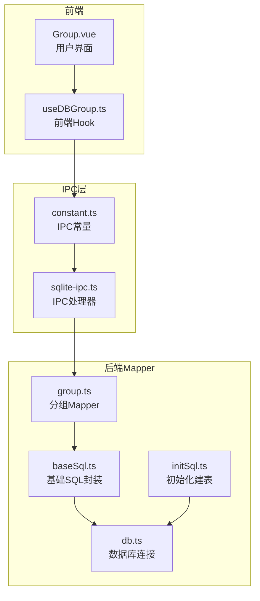

**图表来源**
- [Group.vue:1-200](file://src/components/indexview/Group.vue#L1-L200)
- [useDBGroup.ts:1-53](file://src/hooks/useDBGroup.ts#L1-L53)
- [constant.ts:1-63](file://electron/constant.ts#L1-L63)
- [sqlite-ipc.ts:1-220](file://electron/db/sqlite/sqlite-ipc.ts#L1-L220)
- [group.ts:1-49](file://electron/db/sqlite/mapper/group.ts#L1-L49)
- [baseSql.ts:1-87](file://electron/db/sqlite/components/baseSql.ts#L1-L87)
- [initSql.ts:1-224](file://electron/db/sqlite/components/initSql.ts#L1-L224)
- [db.ts:1-30](file://electron/db/sqlite/components/db.ts#L1-L30)

**章节来源**
- [group.ts:1-49](file://electron/db/sqlite/mapper/group.ts#L1-L49)
- [sqlite-ipc.ts:1-220](file://electron/db/sqlite/sqlite-ipc.ts#L1-L220)
- [baseSql.ts:1-87](file://electron/db/sqlite/components/baseSql.ts#L1-L87)
- [initSql.ts:1-224](file://electron/db/sqlite/components/initSql.ts#L1-L224)
- [db.ts:1-30](file://electron/db/sqlite/components/db.ts#L1-L30)

## 核心组件
- 分组Mapper：提供分组的插入、删除、更新、列表查询、按标题获取ID等操作。
- 基础SQL封装：提供通用的查询、插入、更新、初始化检测等能力。
- IPC处理器：将前端IPC调用映射到具体的Mapper操作。
- 数据库初始化：创建"分组"表及默认数据。
- 前端Hook：封装IPC调用，供Vue组件使用。

**章节来源**
- [group.ts:1-49](file://electron/db/sqlite/mapper/group.ts#L1-L49)
- [baseSql.ts:1-87](file://electron/db/sqlite/components/baseSql.ts#L1-L87)
- [sqlite-ipc.ts:1-220](file://electron/db/sqlite/sqlite-ipc.ts#L1-L220)
- [initSql.ts:1-224](file://electron/db/sqlite/components/initSql.ts#L1-L224)
- [useDBGroup.ts:1-53](file://src/hooks/useDBGroup.ts#L1-L53)

## 架构总览
分组操作遵循“前端Hook -> IPC -> 后端Mapper -> 基础SQL封装 -> 数据库”的调用链路。前端通过useDBGroup.ts发起IPC请求，后端在sqlite-ipc.ts中注册对应处理器，调用group.ts中的具体操作，最终通过baseSql.ts封装的数据库操作完成。

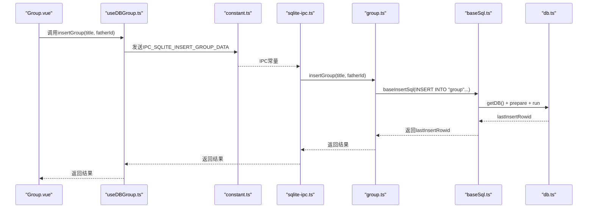

**图表来源**
- [Group.vue:99-124](file://src/components/indexview/Group.vue#L99-L124)
- [useDBGroup.ts:15-18](file://src/hooks/useDBGroup.ts#L15-L18)
- [constant.ts:22-28](file://electron/constant.ts#L22-L28)
- [sqlite-ipc.ts:100-103](file://electron/db/sqlite/sqlite-ipc.ts#L100-L103)
- [group.ts:7-11](file://electron/db/sqlite/mapper/group.ts#L7-L11)
- [baseSql.ts:35-49](file://electron/db/sqlite/components/baseSql.ts#L35-L49)
- [db.ts:16-23](file://electron/db/sqlite/components/db.ts#L16-L23)

## 详细组件分析

### 分组表结构与层级设计
- 表名："group"
- 字段：
  - id：自增主键
  - title：分组标题
  - father_id：父分组ID
- 默认根节点：初始化时插入一条father_id为0的记录作为默认分组根节点。
- 层级关系：通过father_id形成父子关系，支持多层级嵌套。

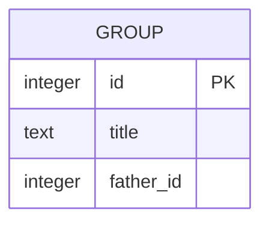

**图表来源**
- [initSql.ts:52-58](file://electron/db/sqlite/components/initSql.ts#L52-L58)
- [initSql.ts:209-215](file://electron/db/sqlite/components/initSql.ts#L209-L215)

**章节来源**
- [initSql.ts:52-58](file://electron/db/sqlite/components/initSql.ts#L52-L58)
- [initSql.ts:209-215](file://electron/db/sqlite/components/initSql.ts#L209-L215)

### 分组Mapper实现原理
- 插入分组：
  - 普通插入：insertGroup(title, father_id)
  - OSS同步插入：insertGroupByOss(id, title, father_id)
- 删除分组：
  - 单个删除：delGroup(id)
  - 全部删除：delAllGroup()
- 更新分组：updateGroup(title, id)
- 查询分组：listGroup()返回所有分组
- 按标题查询ID：getIdByTitle(title)

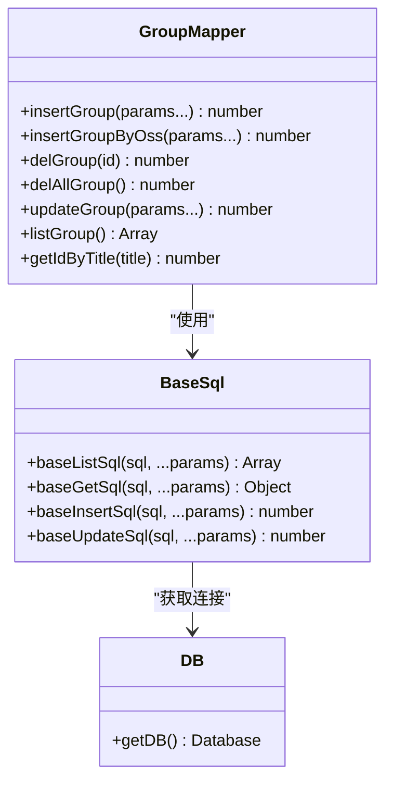

**图表来源**
- [group.ts:1-49](file://electron/db/sqlite/mapper/group.ts#L1-L49)
- [baseSql.ts:1-87](file://electron/db/sqlite/components/baseSql.ts#L1-L87)
- [db.ts:16-23](file://electron/db/sqlite/components/db.ts#L16-L23)

**章节来源**
- [group.ts:7-48](file://electron/db/sqlite/mapper/group.ts#L7-L48)
- [baseSql.ts:9-81](file://electron/db/sqlite/components/baseSql.ts#L9-L81)

### 核心操作SQL实现与流程

#### 创建分组
- 普通创建：INSERT INTO "group"(title, father_id) VALUES (?, ?)
- OSS同步创建：INSERT INTO "group"(id, title, father_id) VALUES (?, ?, ?)
- 返回值：lastInsertRowid

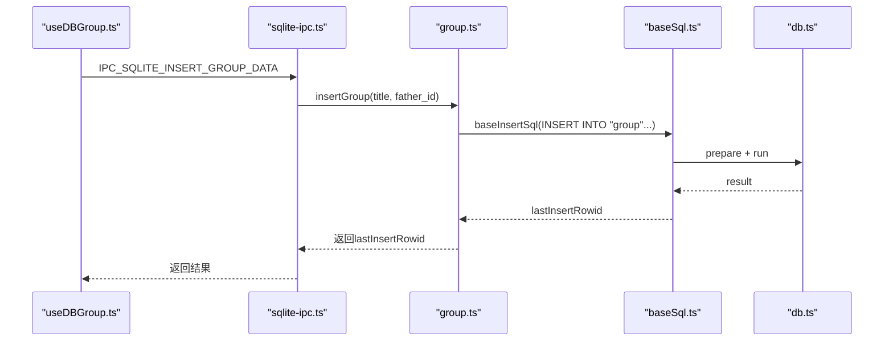

**图表来源**
- [sqlite-ipc.ts:100-103](file://electron/db/sqlite/sqlite-ipc.ts#L100-L103)
- [group.ts:7-11](file://electron/db/sqlite/mapper/group.ts#L7-L11)
- [baseSql.ts:35-49](file://electron/db/sqlite/components/baseSql.ts#L35-L49)

**章节来源**
- [group.ts:7-16](file://electron/db/sqlite/mapper/group.ts#L7-L16)
- [sqlite-ipc.ts:100-108](file://electron/db/sqlite/sqlite-ipc.ts#L100-L108)

#### 查询分组
- 全量查询：SELECT * FROM "group"
- 按标题查询ID：SELECT id FROM "group" WHERE title = ?

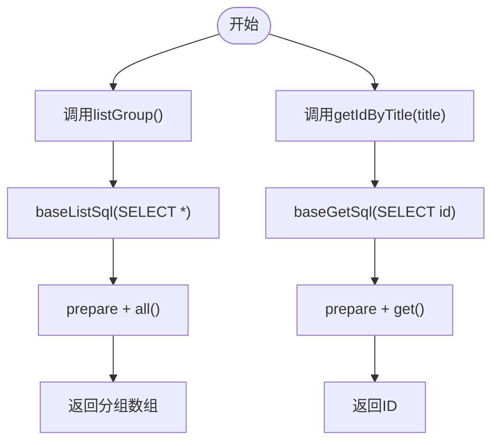

**图表来源**
- [group.ts:37-48](file://electron/db/sqlite/mapper/group.ts#L37-L48)
- [baseSql.ts:9-32](file://electron/db/sqlite/components/baseSql.ts#L9-L32)

**章节来源**
- [group.ts:37-48](file://electron/db/sqlite/mapper/group.ts#L37-L48)
- [baseSql.ts:9-32](file://electron/db/sqlite/components/baseSql.ts#L9-L32)

#### 更新分组
- UPDATE "group" SET title = ? WHERE id = ?

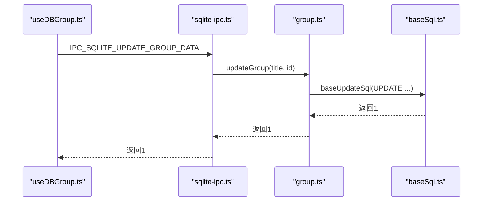

**图表来源**
- [sqlite-ipc.ts:124-127](file://electron/db/sqlite/sqlite-ipc.ts#L124-L127)
- [group.ts:30-35](file://electron/db/sqlite/mapper/group.ts#L30-L35)
- [baseSql.ts:67-81](file://electron/db/sqlite/components/baseSql.ts#L67-L81)

**章节来源**
- [group.ts:30-35](file://electron/db/sqlite/mapper/group.ts#L30-L35)
- [sqlite-ipc.ts:124-127](file://electron/db/sqlite/sqlite-ipc.ts#L124-L127)

#### 删除分组
- 单个删除：DELETE FROM "group" WHERE id = ?
- 全部删除：DELETE FROM "group"

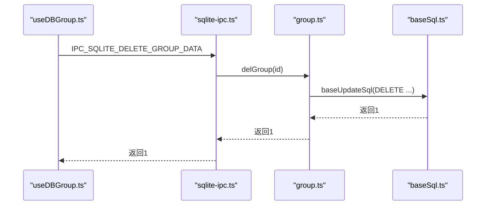

**图表来源**
- [sqlite-ipc.ts:111-114](file://electron/db/sqlite/sqlite-ipc.ts#L111-L114)
- [group.ts:18-28](file://electron/db/sqlite/mapper/group.ts#L18-L28)
- [baseSql.ts:67-81](file://electron/db/sqlite/components/baseSql.ts#L67-L81)

**章节来源**
- [group.ts:18-28](file://electron/db/sqlite/mapper/group.ts#L18-L28)
- [sqlite-ipc.ts:111-120](file://electron/db/sqlite/sqlite-ipc.ts#L111-L120)

### 父子分组关系维护机制
- 父子关系：通过father_id字段建立父子关系，0表示根节点。
- 根节点初始化：在初始化时插入一条father_id为0的记录作为默认分组根节点。
- 前端交互：Group.vue中支持分组的新增、编辑、删除、拖拽移动等操作。

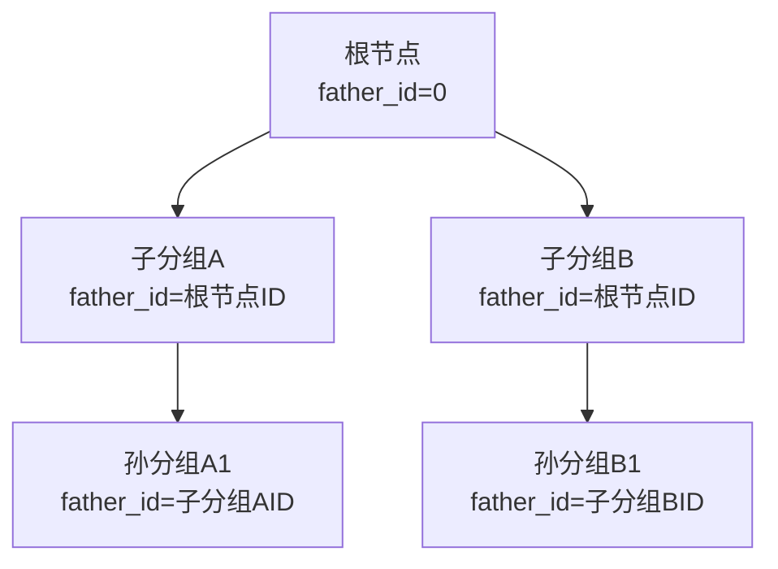

**图表来源**
- [initSql.ts:209-215](file://electron/db/sqlite/components/initSql.ts#L209-L215)
- [Group.vue:99-124](file://src/components/indexview/Group.vue#L99-L124)

**章节来源**
- [initSql.ts:209-215](file://electron/db/sqlite/components/initSql.ts#L209-L215)
- [Group.vue:99-124](file://src/components/indexview/Group.vue#L99-L124)

### 递归查询处理方法
当前Mapper未提供专门的递归查询功能。若需实现树形结构查询，可在应用层进行递归构建：
- 先查询所有分组
- 以father_id为键建立父子映射
- 从根节点开始递归构建树形结构

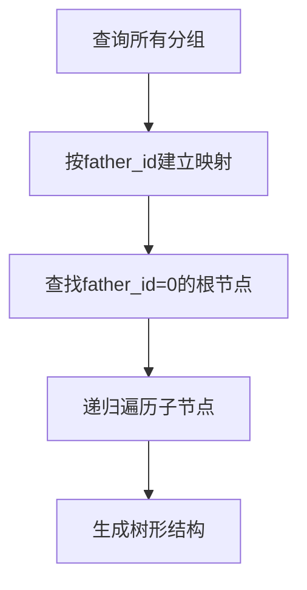

[此图为概念性流程图，无需图表来源]

### 业务规则分析
- 分组名称唯一性：当前表结构未定义唯一约束，可能存在重复名称。
- 层级限制：未在数据库层面强制限制层级深度。
- 权限控制：未发现专门的权限控制逻辑，建议在应用层增加访问控制。

**章节来源**
- [initSql.ts:52-58](file://electron/db/sqlite/components/initSql.ts#L52-L58)

### 实际应用场景示例

#### 分组移动
- 拖拽移动：Group.vue中实现了拖拽事件处理，将密码条目从一个分组移动到另一个分组。
- 移动流程：前端获取拖拽的数据，更新目标分组ID和标题，然后通过IPC调用后端更新。

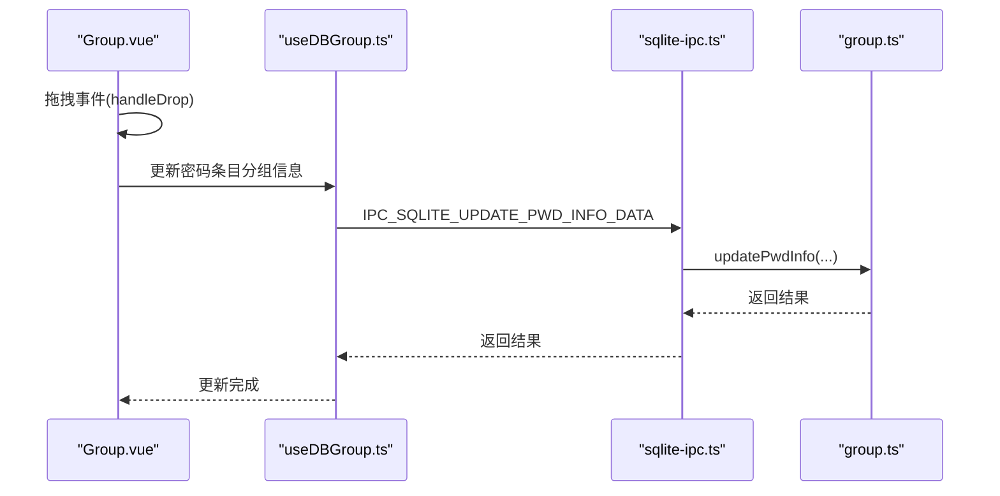

**图表来源**
- [Group.vue:178-200](file://src/components/indexview/Group.vue#L178-L200)
- [sqlite-ipc.ts:172-175](file://electron/db/sqlite/sqlite-ipc.ts#L172-L175)

**章节来源**
- [Group.vue:178-200](file://src/components/indexview/Group.vue#L178-L200)

#### 分组合并
- 合并策略：将源分组下的所有密码条目迁移到目标分组，然后删除源分组。
- 实现步骤：
  1. 查询源分组下的所有密码条目
  2. 批量更新这些条目的group_id和group_title
  3. 删除源分组
  4. 同步到OSS（如有）

**章节来源**
- [Group.vue:139-158](file://src/components/indexview/Group.vue#L139-L158)

#### 导入导出
- 导入：通过insertGroupByOss(id, title, father_id)支持从OSS导入分组数据。
- 导出：可结合pwdInfo的导入导出功能，先导出分组，再导出对应的密码条目。

**章节来源**
- [group.ts:12-16](file://electron/db/sqlite/mapper/group.ts#L12-L16)
- [sqlite-ipc.ts:105-108](file://electron/db/sqlite/sqlite-ipc.ts#L105-L108)

## 依赖关系分析

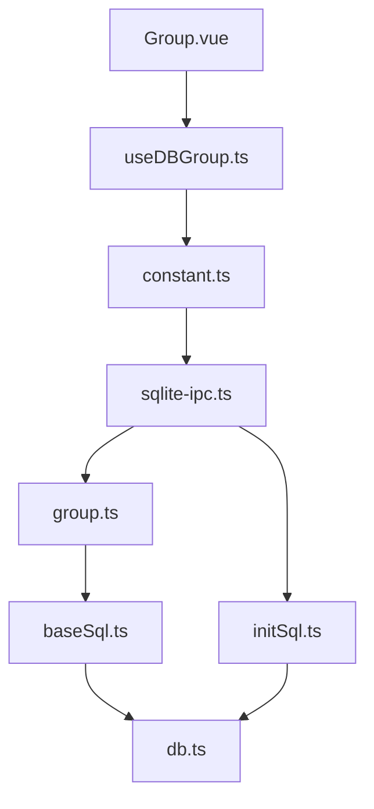

**图表来源**
- [Group.vue:1-200](file://src/components/indexview/Group.vue#L1-L200)
- [useDBGroup.ts:1-53](file://src/hooks/useDBGroup.ts#L1-L53)
- [constant.ts:1-63](file://electron/constant.ts#L1-L63)
- [sqlite-ipc.ts:1-220](file://electron/db/sqlite/sqlite-ipc.ts#L1-L220)
- [group.ts:1-49](file://electron/db/sqlite/mapper/group.ts#L1-L49)
- [baseSql.ts:1-87](file://electron/db/sqlite/components/baseSql.ts#L1-L87)
- [initSql.ts:1-224](file://electron/db/sqlite/components/initSql.ts#L1-L224)
- [db.ts:1-30](file://electron/db/sqlite/components/db.ts#L1-L30)

**章节来源**
- [sqlite-ipc.ts:1-220](file://electron/db/sqlite/sqlite-ipc.ts#L1-L220)
- [group.ts:1-49](file://electron/db/sqlite/mapper/group.ts#L1-L49)

## 性能考虑
- 数据库连接：使用单例模式获取数据库连接，避免频繁创建连接。
- SQL准备：使用prepare预编译SQL语句，提高执行效率。
- 批量操作：对于大量数据的导入导出，建议使用事务批量处理。
- 索引优化：可考虑为father_id和title字段建立索引以提升查询性能。

[本节为一般性指导，无需章节来源]

## 故障排除指南
- 数据库连接失败：检查db.ts中的路径配置和文件权限。
- SQL执行错误：查看baseSql.ts中的异常处理日志。
- IPC通信问题：确认constant.ts中的IPC常量与sqlite-ipc.ts中的处理器一致。
- 数据一致性：删除分组前应检查是否有密码条目关联，避免数据丢失。

**章节来源**
- [db.ts:16-23](file://electron/db/sqlite/components/db.ts#L16-L23)
- [baseSql.ts:12-19](file://electron/db/sqlite/components/baseSql.ts#L12-L19)
- [sqlite-ipc.ts:100-103](file://electron/db/sqlite/sqlite-ipc.ts#L100-L103)

## 结论
本分组信息Mapper通过简洁的SQL接口实现了分组的基本CRUD操作，配合IPC层实现了前后端的解耦。当前实现支持基本的父子关系维护和树形结构的基础能力，但在递归查询、唯一性约束、层级限制等方面仍有改进空间。建议后续增强数据库约束、引入递归查询能力，并在应用层完善权限控制和数据一致性保障。

## 附录
- 类型定义：PwdGroup接口包含id、title、father_id、pwdList、editFlag等字段，用于前端树形展示和编辑。
- 初始化数据：默认插入一条father_id为0的根节点记录，确保系统始终有可用的根分组。

**章节来源**
- [type.ts:76-88](file://src/components/type.ts#L76-L88)
- [initSql.ts:209-215](file://electron/db/sqlite/components/initSql.ts#L209-L215)