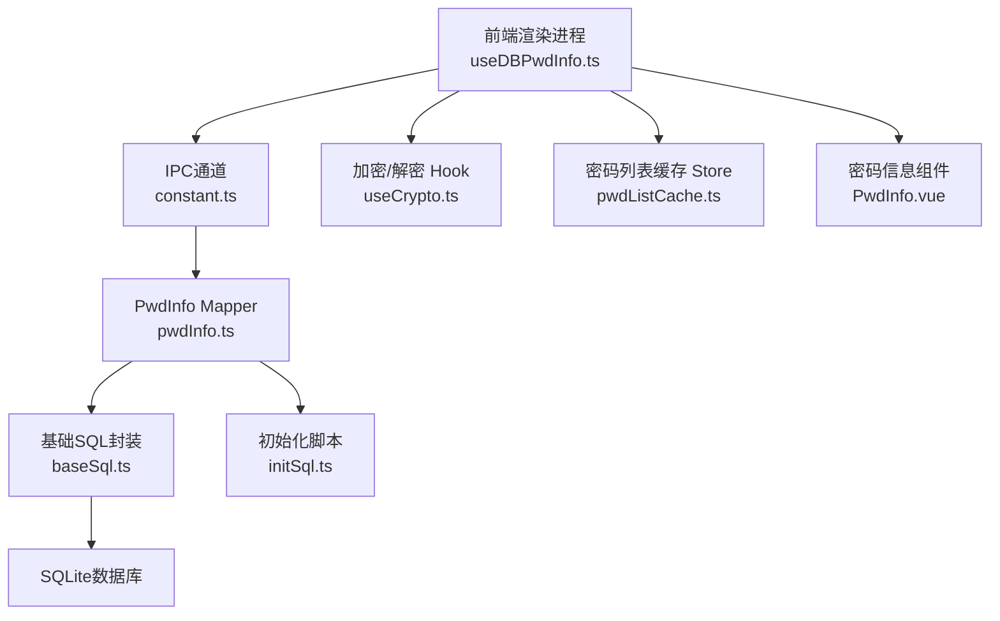
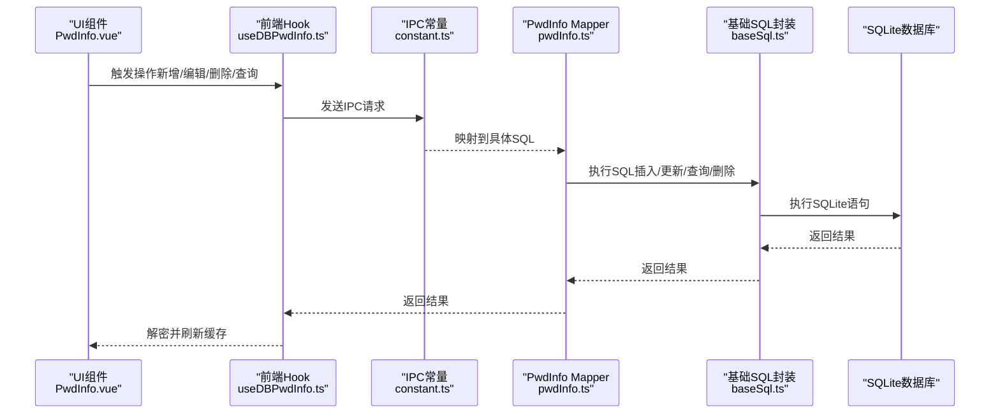
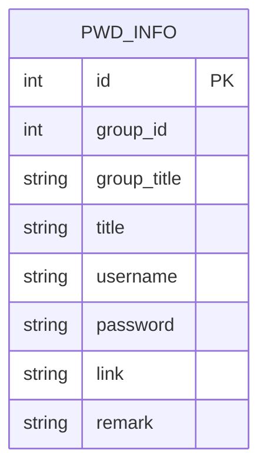
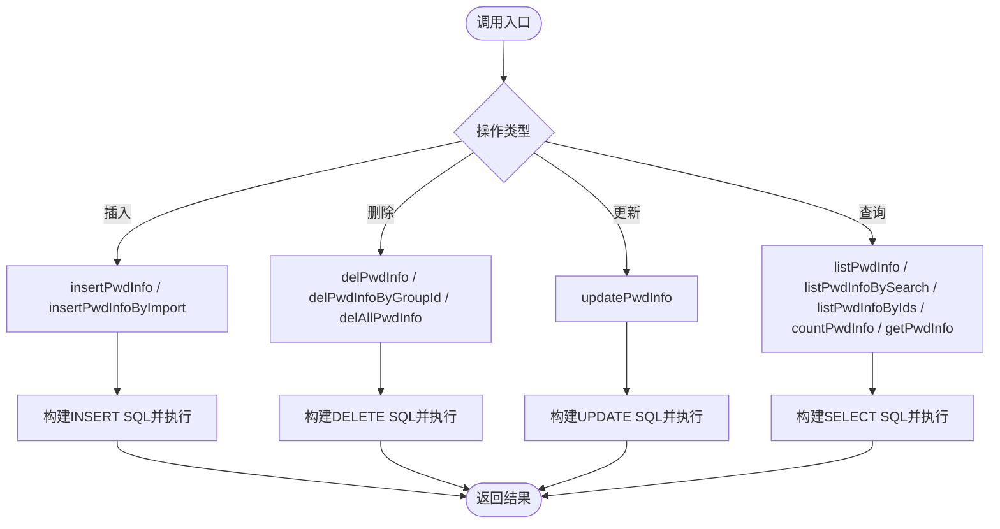
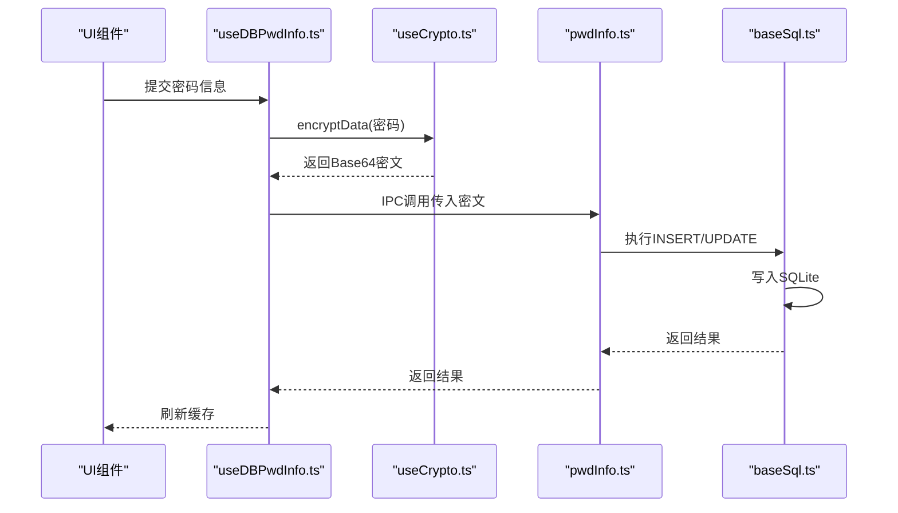
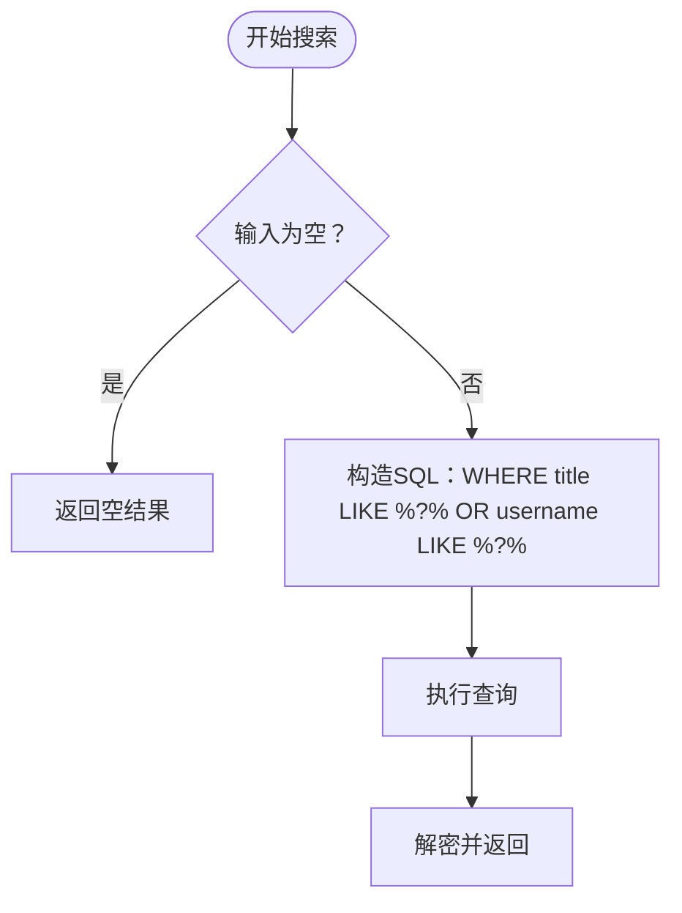
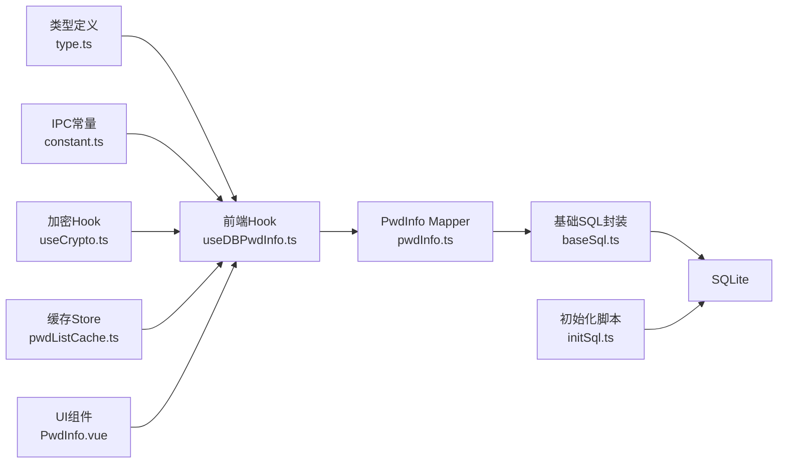

# 密码信息Mapper

<cite>
**本文引用的文件**
- [pwdInfo.ts](file://electron/db/sqlite/mapper/pwdInfo.ts)
- [baseSql.ts](file://electron/db/sqlite/components/baseSql.ts)
- [initSql.ts](file://electron/db/sqlite/components/initSql.ts)
- [configConstants.ts](file://electron/db/sqlite/components/configConstants.ts)
- [useDBPwdInfo.ts](file://src/hooks/useDBPwdInfo.ts)
- [type.ts](file://src/components/type.ts)
- [useCrypto.ts](file://src/hooks/useCrypto.ts)
- [constant.ts](file://electron/constant.ts)
- [pwdListCache.ts](file://src/store/pwdListCache.ts)
- [PwdInfo.vue](file://src/components/indexview/PwdInfo.vue)
- [config.ts](file://src/config/config.ts)
</cite>

## 目录
1. [简介](#简介)
2. [项目结构](#项目结构)
3. [核心组件](#核心组件)
4. [架构总览](#架构总览)
5. [详细组件分析](#详细组件分析)
6. [依赖关系分析](#依赖关系分析)
7. [性能考量](#性能考量)
8. [故障排查指南](#故障排查指南)
9. [结论](#结论)
10. [附录](#附录)

## 简介
本技术文档围绕“密码信息Mapper”展开，系统性解析PwdInfo Mapper在Electron+Vue前端应用中的实现与使用。重点覆盖：
- 密码数据的完整CRUD操作与复杂查询能力
- 存储结构设计与字段含义（用户名、密码、URL、备注等）
- 加密存储机制（AES/CBC + Base64，以及盐值与哈希策略）
- 搜索功能实现（模糊匹配、多条件组合查询）
- 业务规则与安全策略（重复检测、强密码校验、缓存与同步）
- 实际操作示例（添加、编辑、删除、复制、批量操作）

## 项目结构
PwdInfo Mapper位于Electron侧的SQLite数据库层，通过IPC桥接前端调用；前端通过Hook封装统一暴露接口，并在渲染进程中进行加密/解密处理。

图表来源
- [useDBPwdInfo.ts:17-103](file://src/hooks/useDBPwdInfo.ts#L17-L103)
- [constant.ts:30-41](file://electron/constant.ts#L30-L41)
- [pwdInfo.ts:1-100](file://electron/db/sqlite/mapper/pwdInfo.ts#L1-L100)
- [baseSql.ts:1-87](file://electron/db/sqlite/components/baseSql.ts#L1-L87)
- [initSql.ts:48-105](file://electron/db/sqlite/components/initSql.ts#L48-L105)
- [useCrypto.ts:1-77](file://src/hooks/useCrypto.ts#L1-L77)
- [pwdListCache.ts:1-37](file://src/store/pwdListCache.ts#L1-L37)
- [PwdInfo.vue:1-257](file://src/components/indexview/PwdInfo.vue#L1-L257)

章节来源
- [pwdInfo.ts:1-100](file://electron/db/sqlite/mapper/pwdInfo.ts#L1-L100)
- [baseSql.ts:1-87](file://electron/db/sqlite/components/baseSql.ts#L1-L87)
- [initSql.ts:48-105](file://electron/db/sqlite/components/initSql.ts#L48-L105)
- [useDBPwdInfo.ts:17-103](file://src/hooks/useDBPwdInfo.ts#L17-L103)
- [constant.ts:30-41](file://electron/constant.ts#L30-L41)
- [useCrypto.ts:1-77](file://src/hooks/useCrypto.ts#L1-L77)
- [pwdListCache.ts:1-37](file://src/store/pwdListCache.ts#L1-L37)
- [PwdInfo.vue:1-257](file://src/components/indexview/PwdInfo.vue#L1-L257)

## 核心组件
- PwdInfo Mapper（Electron侧）：提供密码信息的CRUD与查询接口，基于SQLite执行SQL。
- 基础SQL封装：统一封装查询、插入、更新、事务等通用逻辑。
- 初始化脚本：负责创建pwd_info表及相关默认数据。
- 前端Hook（useDBPwdInfo）：封装IPC调用，统一暴露CRUD与查询方法，并负责加密/解密与缓存刷新。
- 加密/解密Hook：提供AES/CBC加密、Base64编码、MD5/SHA512哈希等工具。
- 类型定义：统一PwdInfo接口，确保前后端字段一致性。
- 缓存Store：维护轻量级缓存，减少频繁读取。

章节来源
- [pwdInfo.ts:1-100](file://electron/db/sqlite/mapper/pwdInfo.ts#L1-L100)
- [baseSql.ts:1-87](file://electron/db/sqlite/components/baseSql.ts#L1-L87)
- [initSql.ts:48-105](file://electron/db/sqlite/components/initSql.ts#L48-L105)
- [useDBPwdInfo.ts:17-103](file://src/hooks/useDBPwdInfo.ts#L17-L103)
- [useCrypto.ts:1-77](file://src/hooks/useCrypto.ts#L1-L77)
- [type.ts:50-67](file://src/components/type.ts#L50-L67)
- [pwdListCache.ts:1-37](file://src/store/pwdListCache.ts#L1-L37)

## 架构总览
PwdInfo Mapper采用“前端Hook + IPC + Electron侧Mapper + SQLite”的分层架构。前端通过useDBPwdInfo发起请求，经IPC映射到Electron侧的pwdInfo.ts，再由baseSql.ts执行SQL，最终持久化到SQLite。

图表来源
- [PwdInfo.vue:28-53](file://src/components/indexview/PwdInfo.vue#L28-L53)
- [useDBPwdInfo.ts:21-63](file://src/hooks/useDBPwdInfo.ts#L21-L63)
- [constant.ts:30-41](file://electron/constant.ts#L30-L41)
- [pwdInfo.ts:6-48](file://electron/db/sqlite/mapper/pwdInfo.ts#L6-L48)
- [baseSql.ts:9-81](file://electron/db/sqlite/components/baseSql.ts#L9-L81)

## 详细组件分析

### 数据模型与存储结构
- 表结构：pwd_info
  - 字段：id、group_id、group_title、title、username、password、link、remark
  - 主键：id（自增）
  - 外键：group_id（关联分组）
- 初始化：首次启动时创建表并插入默认数据（含一条默认密码记录）。

图表来源
- [initSql.ts:60-71](file://electron/db/sqlite/components/initSql.ts#L60-L71)

章节来源
- [initSql.ts:60-71](file://electron/db/sqlite/components/initSql.ts#L60-L71)
- [type.ts:50-67](file://src/components/type.ts#L50-L67)

### CRUD与复杂查询实现

- 插入
  - 单字段插入：用于新建空记录（返回新ID）
  - 导入插入：带完整字段的批量导入
- 删除
  - 按ID删除
  - 按分组ID批量删除
  - 全量清空
- 更新
  - 按ID更新全部字段
- 查询
  - 列表：按分组ID或全量查询
  - 搜索：标题/用户名模糊匹配
  - 批量ID查询：IN子句查询
  - 统计：按分组统计数量

图表来源
- [pwdInfo.ts:6-99](file://electron/db/sqlite/mapper/pwdInfo.ts#L6-L99)
- [baseSql.ts:9-81](file://electron/db/sqlite/components/baseSql.ts#L9-L81)

章节来源
- [pwdInfo.ts:6-99](file://electron/db/sqlite/mapper/pwdInfo.ts#L6-L99)
- [baseSql.ts:9-81](file://electron/db/sqlite/components/baseSql.ts#L9-L81)

### 加密存储机制
- 加密算法：AES/CBC + Base64
- 密钥与IV：从配置中读取（固定密钥/IV）
- 流程：前端在提交前对密码进行加密，入库保存密文；读取时统一解密显示
- 哈希策略：用于登录密码校验（SHA512 + 盐），不参与密码字段存储

图表来源
- [useDBPwdInfo.ts:28-62](file://src/hooks/useDBPwdInfo.ts#L28-L62)
- [useCrypto.ts:41-66](file://src/hooks/useCrypto.ts#L41-L66)
- [pwdInfo.ts:6-48](file://electron/db/sqlite/mapper/pwdInfo.ts#L6-L48)
- [baseSql.ts:35-49](file://electron/db/sqlite/components/baseSql.ts#L35-L49)

章节来源
- [useDBPwdInfo.ts:28-62](file://src/hooks/useDBPwdInfo.ts#L28-L62)
- [useCrypto.ts:41-66](file://src/hooks/useCrypto.ts#L41-L66)
- [config.ts:14-22](file://src/config/config.ts#L14-L22)

### 搜索功能实现
- 模糊匹配：标题与用户名字段使用LIKE进行模糊查询
- 多条件组合：当前实现为“标题 LIKE 或 用户名 LIKE”，可扩展为更复杂的组合条件
- 正则表达式：当前未直接使用正则，如需可扩展为SQLite正则函数或前端过滤

图表来源
- [pwdInfo.ts:62-69](file://electron/db/sqlite/mapper/pwdInfo.ts#L62-L69)
- [useDBPwdInfo.ts:72-76](file://src/hooks/useDBPwdInfo.ts#L72-L76)

章节来源
- [pwdInfo.ts:62-69](file://electron/db/sqlite/mapper/pwdInfo.ts#L62-L69)
- [useDBPwdInfo.ts:72-76](file://src/hooks/useDBPwdInfo.ts#L72-L76)

### 业务规则与安全策略
- 重复检测：当前未实现字段级重复检测（如用户名+站点唯一）。可在前端或Mapper层扩展
- 强密码验证：当前未在PwdInfo Mapper层实现强密码校验，可在前端组件中扩展校验规则
- 安全策略：
  - 密码字段仅存储密文
  - 登录密码使用SHA512+盐进行校验
  - 默认密码与盐值在配置中定义
- 缓存与同步：每次写操作后刷新缓存，便于快速展示与后续同步

章节来源
- [useCrypto.ts:11-29](file://src/hooks/useCrypto.ts#L11-L29)
- [config.ts:14-22](file://src/config/config.ts#L14-L22)
- [pwdListCache.ts:30-33](file://src/store/pwdListCache.ts#L30-L33)

### 实际操作示例

- 添加密码
  - 前端：在PwdInfo.vue中编辑字段，触发变更事件，调用useDBPwdInfo.insertPwdInfo
  - 后端：pwdInfo.ts执行INSERT，返回新ID
  - 加密：useDBPwdInfo在IPC前对密码进行加密
  - 缓存：刷新缓存并触发同步

- 编辑密码
  - 前端：修改任一字段，触发变更事件
  - 后端：pwdInfo.ts执行UPDATE
  - 加密：若密码字段有变化，则加密后再更新

- 删除密码
  - 单条：按ID删除
  - 分组：按分组ID批量删除
  - 全部：清空表

- 复制操作
  - UI组件提供复制用户名/密码/链接的快捷操作
  - 支持快捷键触发（Ctrl+U/Ctrl+P/Ctrl+L）

- 批量操作
  - 批量ID查询：listPwdInfoByIds
  - 批量删除：delPwdInfoByGroupId
  - 批量导入：insertPwdInfoByImport（带完整字段）

章节来源
- [PwdInfo.vue:32-78](file://src/components/indexview/PwdInfo.vue#L32-L78)
- [useDBPwdInfo.ts:21-63](file://src/hooks/useDBPwdInfo.ts#L21-L63)
- [pwdInfo.ts:6-99](file://electron/db/sqlite/mapper/pwdInfo.ts#L6-L99)

## 依赖关系分析

图表来源
- [type.ts:50-67](file://src/components/type.ts#L50-L67)
- [useDBPwdInfo.ts:17-103](file://src/hooks/useDBPwdInfo.ts#L17-L103)
- [constant.ts:30-41](file://electron/constant.ts#L30-L41)
- [useCrypto.ts:1-77](file://src/hooks/useCrypto.ts#L1-L77)
- [pwdInfo.ts:1-100](file://electron/db/sqlite/mapper/pwdInfo.ts#L1-L100)
- [baseSql.ts:1-87](file://electron/db/sqlite/components/baseSql.ts#L1-L87)
- [initSql.ts:48-105](file://electron/db/sqlite/components/initSql.ts#L48-L105)
- [pwdListCache.ts:1-37](file://src/store/pwdListCache.ts#L1-L37)
- [PwdInfo.vue:1-257](file://src/components/indexview/PwdInfo.vue#L1-L257)

章节来源
- [type.ts:50-67](file://src/components/type.ts#L50-L67)
- [useDBPwdInfo.ts:17-103](file://src/hooks/useDBPwdInfo.ts#L17-L103)
- [constant.ts:30-41](file://electron/constant.ts#L30-L41)
- [useCrypto.ts:1-77](file://src/hooks/useCrypto.ts#L1-L77)
- [pwdInfo.ts:1-100](file://electron/db/sqlite/mapper/pwdInfo.ts#L1-L100)
- [baseSql.ts:1-87](file://electron/db/sqlite/components/baseSql.ts#L1-L87)
- [initSql.ts:48-105](file://electron/db/sqlite/components/initSql.ts#L48-L105)
- [pwdListCache.ts:1-37](file://src/store/pwdListCache.ts#L1-L37)
- [PwdInfo.vue:1-257](file://src/components/indexview/PwdInfo.vue#L1-L257)

## 性能考量
- SQL参数化：所有操作均使用参数化查询，避免SQL注入并提升执行效率
- 批量ID查询：使用IN子句配合占位符，减少多次往返
- 缓存策略：pwdListCache仅缓存必要字段，降低内存占用
- 加密成本：AES/CBC在渲染进程执行，建议在高频场景下合并提交，减少多次加密开销
- 索引建议：若搜索频繁，可在title、username、group_id上建立索引（需结合实际查询模式评估）

## 故障排查指南
- 查询失败
  - 检查SQL是否正确（baseSql.ts已捕获异常并返回null）
  - 确认IPC通道映射是否一致（constant.ts）
- 插入失败
  - 确认表结构是否已初始化（initSql.ts）
  - 检查参数顺序与数量是否匹配
- 解密异常
  - 确认密钥/IV是否与加密时一致
  - 检查存储的是否为Base64编码的密文
- 缓存不同步
  - 确认每次写操作后是否调用refreshCache
  - 检查缓存初始化逻辑（onMounted）

章节来源
- [baseSql.ts:12-31](file://electron/db/sqlite/components/baseSql.ts#L12-L31)
- [constant.ts:30-41](file://electron/constant.ts#L30-L41)
- [initSql.ts:26-46](file://electron/db/sqlite/components/initSql.ts#L26-L46)
- [pwdListCache.ts:15-33](file://src/store/pwdListCache.ts#L15-L33)

## 结论
PwdInfo Mapper提供了简洁而完整的密码信息管理能力，结合前端加密与缓存机制，实现了安全、高效的密码存储与检索。当前实现聚焦于基本CRUD与简单搜索，后续可在重复检测、强密码校验、正则搜索与索引优化等方面进一步增强。

## 附录

### 字段说明与用途
- id：主键，自增
- group_id：所属分组ID
- group_title：分组标题（冗余，便于展示）
- title：站点/账户名称
- username：用户名
- password：加密后的密码
- link：站点链接
- remark：备注说明

章节来源
- [initSql.ts:60-71](file://electron/db/sqlite/components/initSql.ts#L60-L71)
- [type.ts:50-67](file://src/components/type.ts#L50-L67)