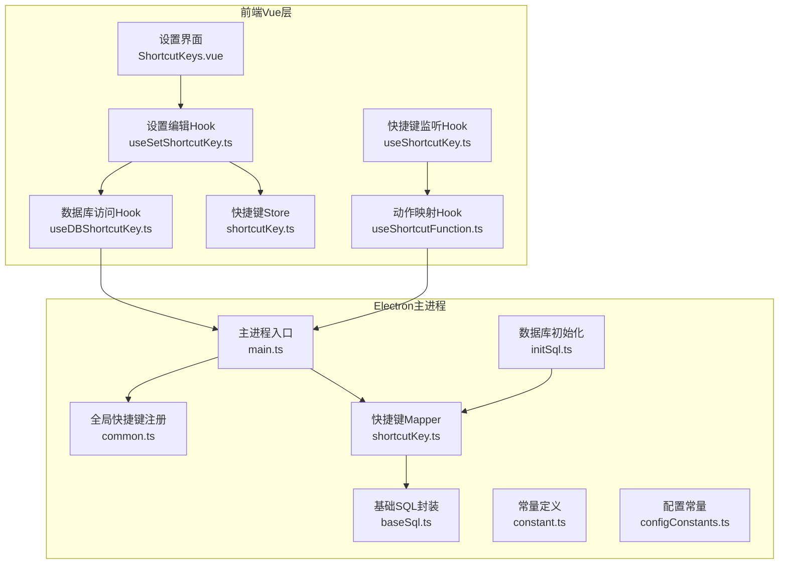
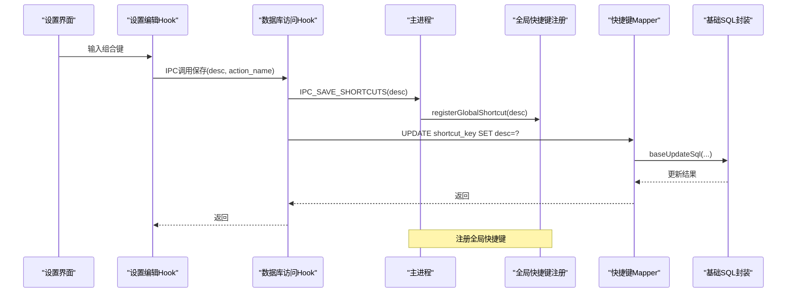
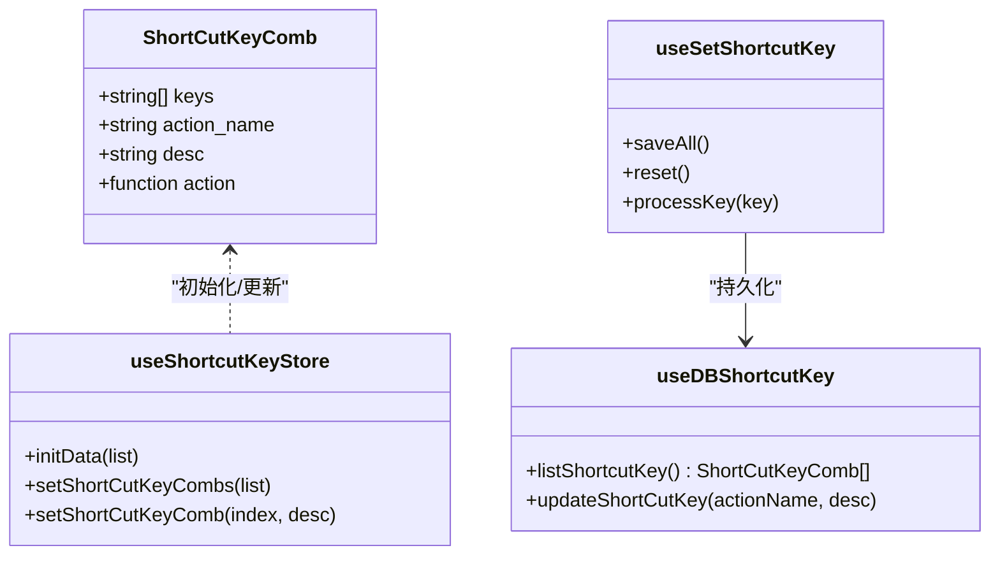
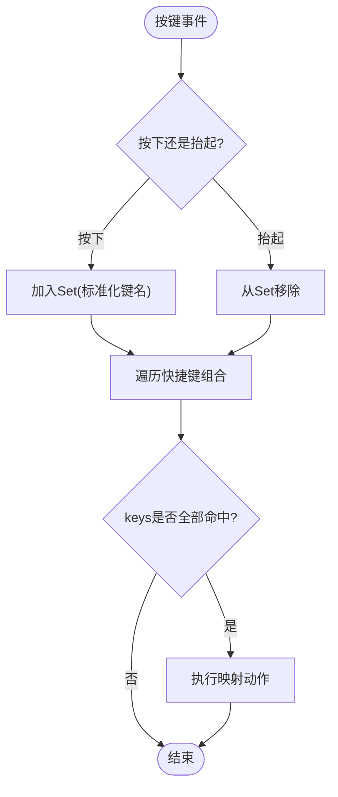
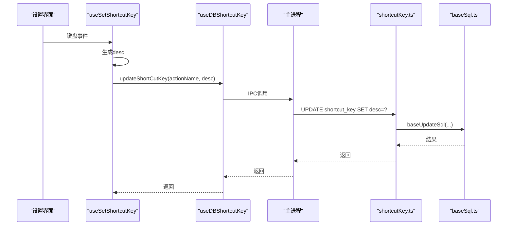
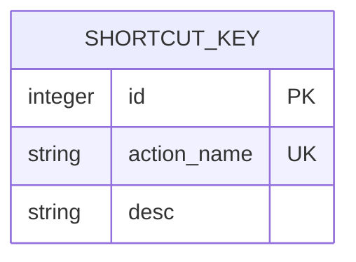
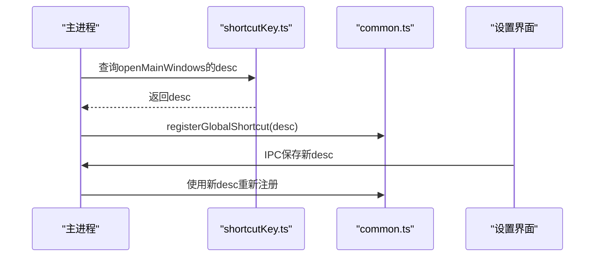
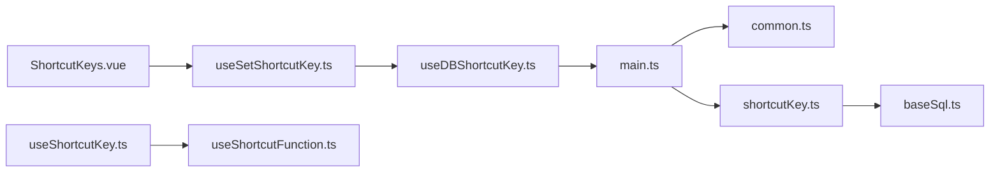

# 快捷键配置Mapper

<cite>
**本文引用的文件**
- [electron/db/sqlite/mapper/shortcutKey.ts](file://electron/db/sqlite/mapper/shortcutKey.ts)
- [src/hooks/useDBShortcutKey.ts](file://src/hooks/useDBShortcutKey.ts)
- [src/store/shortcutKey.ts](file://src/store/shortcutKey.ts)
- [src/hooks/useShortcutKey.ts](file://src/hooks/useShortcutKey.ts)
- [src/components/setview/ShortcutKeys.vue](file://src/components/setview/ShortcutKeys.vue)
- [src/hooks/useSetShortcutKey.ts](file://src/hooks/useSetShortcutKey.ts)
- [src/config/config.ts](file://src/config/config.ts)
- [src/components/type.ts](file://src/components/type.ts)
- [electron/db/sqlite/components/baseSql.ts](file://electron/db/sqlite/components/baseSql.ts)
- [electron/main.ts](file://electron/main.ts)
- [electron/common.ts](file://electron/common.ts)
- [src/hooks/useShortcutFunction.ts](file://src/hooks/useShortcutFunction.ts)
- [electron/db/sqlite/components/configConstants.ts](file://electron/db/sqlite/components/configConstants.ts)
- [electron/constant.ts](file://electron/constant.ts)
- [electron/db/sqlite/components/initSql.ts](file://electron/db/sqlite/components/initSql.ts)
</cite>

## 目录
1. [简介](#简介)
2. [项目结构](#项目结构)
3. [核心组件](#核心组件)
4. [架构总览](#架构总览)
5. [详细组件分析](#详细组件分析)
6. [依赖关系分析](#依赖关系分析)
7. [性能考虑](#性能考虑)
8. [故障排查指南](#故障排查指南)
9. [结论](#结论)
10. [附录](#附录)

## 简介
本技术文档围绕“快捷键配置Mapper”展开，系统性解析快捷键在Electron+Vue前端中的实现与集成。重点覆盖：
- 全局快捷键配置的存储与管理机制
- 快捷键数据结构设计（组合键、动作映射、描述）
- 业务规则（唯一性、冲突检测、有效性校验）
- 应用场景（窗口显示/隐藏、密码生成、搜索、复制等）
- 实际使用示例（添加、修改、删除、重置）

## 项目结构
快捷键相关代码横跨前端Vue层与Electron主进程层，并通过IPC通信协同工作。关键模块如下：
- 前端Vue层：设置界面、Pinia Store、快捷键监听Hook、设置编辑Hook
- Electron主进程：全局快捷键注册、IPC处理、SQLite访问
- 数据库：SQLite表“shortcut_key”的创建与默认数据初始化

图表来源
- [src/components/setview/ShortcutKeys.vue:1-225](file://src/components/setview/ShortcutKeys.vue#L1-L225)
- [src/hooks/useSetShortcutKey.ts:1-481](file://src/hooks/useSetShortcutKey.ts#L1-L481)
- [src/hooks/useDBShortcutKey.ts:1-17](file://src/hooks/useDBShortcutKey.ts#L1-L17)
- [src/store/shortcutKey.ts:1-99](file://src/store/shortcutKey.ts#L1-L99)
- [src/hooks/useShortcutKey.ts:1-64](file://src/hooks/useShortcutKey.ts#L1-L64)
- [src/hooks/useShortcutFunction.ts:1-94](file://src/hooks/useShortcutFunction.ts#L1-L94)
- [electron/main.ts:1-240](file://electron/main.ts#L1-L240)
- [electron/common.ts:1-56](file://electron/common.ts#L1-L56)
- [electron/db/sqlite/mapper/shortcutKey.ts:1-32](file://electron/db/sqlite/mapper/shortcutKey.ts#L1-L32)
- [electron/db/sqlite/components/baseSql.ts:1-87](file://electron/db/sqlite/components/baseSql.ts#L1-L87)
- [electron/constant.ts:1-63](file://electron/constant.ts#L1-L63)
- [electron/db/sqlite/components/configConstants.ts:1-29](file://electron/db/sqlite/components/configConstants.ts#L1-L29)
- [electron/db/sqlite/components/initSql.ts:1-224](file://electron/db/sqlite/components/initSql.ts#L1-L224)

章节来源
- [src/components/setview/ShortcutKeys.vue:1-225](file://src/components/setview/ShortcutKeys.vue#L1-L225)
- [src/hooks/useSetShortcutKey.ts:1-481](file://src/hooks/useSetShortcutKey.ts#L1-L481)
- [src/hooks/useDBShortcutKey.ts:1-17](file://src/hooks/useDBShortcutKey.ts#L1-L17)
- [src/store/shortcutKey.ts:1-99](file://src/store/shortcutKey.ts#L1-L99)
- [src/hooks/useShortcutKey.ts:1-64](file://src/hooks/useShortcutKey.ts#L1-L64)
- [src/hooks/useShortcutFunction.ts:1-94](file://src/hooks/useShortcutFunction.ts#L1-L94)
- [electron/main.ts:1-240](file://electron/main.ts#L1-L240)
- [electron/common.ts:1-56](file://electron/common.ts#L1-L56)
- [electron/db/sqlite/mapper/shortcutKey.ts:1-32](file://electron/db/sqlite/mapper/shortcutKey.ts#L1-L32)
- [electron/db/sqlite/components/baseSql.ts:1-87](file://electron/db/sqlite/components/baseSql.ts#L1-L87)
- [electron/constant.ts:1-63](file://electron/constant.ts#L1-L63)
- [electron/db/sqlite/components/configConstants.ts:1-29](file://electron/db/sqlite/components/configConstants.ts#L1-L29)
- [electron/db/sqlite/components/initSql.ts:1-224](file://electron/db/sqlite/components/initSql.ts#L1-L224)

## 核心组件
- 快捷键数据模型：包含keys（按键数组）、action_name（动作名）、desc（描述字符串）
- 前端Store：负责初始化、更新快捷键组合
- 设置编辑Hook：负责捕获用户输入、构建描述字符串、持久化
- 数据库Mapper：负责读取/更新“shortcut_key”表
- 主进程全局快捷键：负责注册/注销全局快捷键
- 动作映射：将action_name映射到具体业务函数

章节来源
- [src/components/type.ts:19-29](file://src/components/type.ts#L19-L29)
- [src/store/shortcutKey.ts:16-99](file://src/store/shortcutKey.ts#L16-L99)
- [src/hooks/useSetShortcutKey.ts:1-481](file://src/hooks/useSetShortcutKey.ts#L1-L481)
- [electron/db/sqlite/mapper/shortcutKey.ts:1-32](file://electron/db/sqlite/mapper/shortcutKey.ts#L1-L32)
- [electron/common.ts:17-39](file://electron/common.ts#L17-L39)
- [src/hooks/useShortcutFunction.ts:16-39](file://src/hooks/useShortcutFunction.ts#L16-L39)

## 架构总览
快捷键从“设置界面”录入，经由“设置编辑Hook”写入“数据库Mapper”，同时通过“数据库访问Hook”与主进程交互；主进程根据最新配置注册全局快捷键；前台通过“快捷键监听Hook”实时匹配当前按键集合与配置，触发相应动作。

图表来源
- [src/hooks/useSetShortcutKey.ts:102-109](file://src/hooks/useSetShortcutKey.ts#L102-L109)
- [electron/main.ts:149-152](file://electron/main.ts#L149-L152)
- [electron/common.ts:17-39](file://electron/common.ts#L17-L39)
- [electron/db/sqlite/mapper/shortcutKey.ts:10-12](file://electron/db/sqlite/mapper/shortcutKey.ts#L10-L12)
- [electron/db/sqlite/components/baseSql.ts:67-81](file://electron/db/sqlite/components/baseSql.ts#L67-L81)

## 详细组件分析

### 数据结构与业务规则
- 数据结构
  - keys：按键片段数组，如["Ctrl","Alt","E"]
  - action_name：动作名，与后端常量一致
  - desc：描述字符串，如"Ctrl + Alt + E"
- 业务规则
  - 唯一性：action_name唯一，作为快捷键记录的标识
  - 冲突检测：前端监听时对当前按下键集进行全量匹配，若满足keys则触发对应action
  - 有效性验证：前端在设置阶段将按键标准化（如将"Control"转为"Ctrl"），并统一大小写；后端通过SQL更新desc字段

图表来源
- [src/components/type.ts:19-29](file://src/components/type.ts#L19-L29)
- [src/store/shortcutKey.ts:19-36](file://src/store/shortcutKey.ts#L19-L36)
- [src/hooks/useSetShortcutKey.ts:388-397](file://src/hooks/useSetShortcutKey.ts#L388-L397)
- [src/hooks/useDBShortcutKey.ts:6-14](file://src/hooks/useDBShortcutKey.ts#L6-L14)

章节来源
- [src/components/type.ts:19-29](file://src/components/type.ts#L19-L29)
- [src/store/shortcutKey.ts:19-36](file://src/store/shortcutKey.ts#L19-L36)
- [src/hooks/useSetShortcutKey.ts:388-397](file://src/hooks/useSetShortcutKey.ts#L388-L397)
- [src/hooks/useDBShortcutKey.ts:6-14](file://src/hooks/useDBShortcutKey.ts#L6-L14)

### 快捷键监听与执行流程
- 前端监听：维护一个Set记录当前按下的键，按下时加入，抬起时移除
- 匹配逻辑：遍历Store中的快捷键组合，判断keys是否全部存在于当前按下集合
- 动作执行：通过action_name映射到具体函数，触发业务行为

图表来源
- [src/hooks/useShortcutKey.ts:30-60](file://src/hooks/useShortcutKey.ts#L30-L60)
- [src/hooks/useShortcutFunction.ts:29-39](file://src/hooks/useShortcutFunction.ts#L29-L39)

章节来源
- [src/hooks/useShortcutKey.ts:30-60](file://src/hooks/useShortcutKey.ts#L30-L60)
- [src/hooks/useShortcutFunction.ts:29-39](file://src/hooks/useShortcutFunction.ts#L29-L39)

### 设置界面与持久化流程
- 设置界面：每个快捷键项绑定keydown/keyup事件，实时生成desc
- 编辑Hook：将desc写回Store并调用数据库访问Hook
- 数据库访问Hook：通过IPC调用主进程，主进程再调用Mapper更新数据库
- 主进程：接收IPC后调用全局快捷键注册函数

图表来源
- [src/components/setview/ShortcutKeys.vue:60-70](file://src/components/setview/ShortcutKeys.vue#L60-L70)
- [src/hooks/useSetShortcutKey.ts:102-109](file://src/hooks/useSetShortcutKey.ts#L102-L109)
- [src/hooks/useDBShortcutKey.ts:11-14](file://src/hooks/useDBShortcutKey.ts#L11-L14)
- [electron/main.ts:149-152](file://electron/main.ts#L149-L152)
- [electron/db/sqlite/mapper/shortcutKey.ts:10-12](file://electron/db/sqlite/mapper/shortcutKey.ts#L10-L12)
- [electron/db/sqlite/components/baseSql.ts:67-81](file://electron/db/sqlite/components/baseSql.ts#L67-L81)

章节来源
- [src/components/setview/ShortcutKeys.vue:60-70](file://src/components/setview/ShortcutKeys.vue#L60-L70)
- [src/hooks/useSetShortcutKey.ts:102-109](file://src/hooks/useSetShortcutKey.ts#L102-L109)
- [src/hooks/useDBShortcutKey.ts:11-14](file://src/hooks/useDBShortcutKey.ts#L11-L14)
- [electron/main.ts:149-152](file://electron/main.ts#L149-L152)
- [electron/db/sqlite/mapper/shortcutKey.ts:10-12](file://electron/db/sqlite/mapper/shortcutKey.ts#L10-L12)
- [electron/db/sqlite/components/baseSql.ts:67-81](file://electron/db/sqlite/components/baseSql.ts#L67-L81)

### 数据库Schema与默认值
- 表结构：shortcut_key(id, action_name, desc)，其中action_name唯一
- 默认值：初始化脚本插入9条默认快捷键记录，覆盖窗口显示/隐藏、复制、新增、同步等常用操作

图表来源
- [electron/db/sqlite/components/initSql.ts:83-89](file://electron/db/sqlite/components/initSql.ts#L83-L89)
- [electron/db/sqlite/components/initSql.ts:187-206](file://electron/db/sqlite/components/initSql.ts#L187-L206)

章节来源
- [electron/db/sqlite/components/initSql.ts:83-89](file://electron/db/sqlite/components/initSql.ts#L83-L89)
- [electron/db/sqlite/components/initSql.ts:187-206](file://electron/db/sqlite/components/initSql.ts#L187-L206)

### 全局快捷键注册与生命周期
- 主进程启动时读取数据库中的desc，注册全局快捷键
- 设置界面保存新配置后，主进程重新注册
- 若desc为空，注销所有全局快捷键

图表来源
- [electron/main.ts:54-54](file://electron/main.ts#L54-L54)
- [electron/db/sqlite/mapper/shortcutKey.ts:15-20](file://electron/db/sqlite/mapper/shortcutKey.ts#L15-L20)
- [electron/common.ts:17-39](file://electron/common.ts#L17-L39)
- [electron/main.ts:149-152](file://electron/main.ts#L149-L152)

章节来源
- [electron/main.ts:54-54](file://electron/main.ts#L54-L54)
- [electron/db/sqlite/mapper/shortcutKey.ts:15-20](file://electron/db/sqlite/mapper/shortcutKey.ts#L15-L20)
- [electron/common.ts:17-39](file://electron/common.ts#L17-L39)
- [electron/main.ts:149-152](file://electron/main.ts#L149-L152)

## 依赖关系分析
- 组件耦合
  - 设置界面依赖设置编辑Hook
  - 设置编辑Hook依赖数据库访问Hook与Store
  - 数据库访问Hook依赖主进程IPC
  - 主进程依赖快捷键Mapper与全局快捷键注册
  - 前端监听Hook依赖动作映射Hook
- 外部依赖
  - Electron全局快捷键API
  - Better-SQLite3数据库驱动
  - Element Plus UI组件库

图表来源
- [src/components/setview/ShortcutKeys.vue:1-225](file://src/components/setview/ShortcutKeys.vue#L1-L225)
- [src/hooks/useSetShortcutKey.ts:1-481](file://src/hooks/useSetShortcutKey.ts#L1-L481)
- [src/hooks/useDBShortcutKey.ts:1-17](file://src/hooks/useDBShortcutKey.ts#L1-L17)
- [electron/main.ts:1-240](file://electron/main.ts#L1-L240)
- [electron/common.ts:1-56](file://electron/common.ts#L1-L56)
- [electron/db/sqlite/mapper/shortcutKey.ts:1-32](file://electron/db/sqlite/mapper/shortcutKey.ts#L1-L32)
- [electron/db/sqlite/components/baseSql.ts:1-87](file://electron/db/sqlite/components/baseSql.ts#L1-L87)
- [src/hooks/useShortcutKey.ts:1-64](file://src/hooks/useShortcutKey.ts#L1-L64)
- [src/hooks/useShortcutFunction.ts:1-94](file://src/hooks/useShortcutFunction.ts#L1-L94)

章节来源
- [src/components/setview/ShortcutKeys.vue:1-225](file://src/components/setview/ShortcutKeys.vue#L1-L225)
- [src/hooks/useSetShortcutKey.ts:1-481](file://src/hooks/useSetShortcutKey.ts#L1-L481)
- [src/hooks/useDBShortcutKey.ts:1-17](file://src/hooks/useDBShortcutKey.ts#L1-L17)
- [electron/main.ts:1-240](file://electron/main.ts#L1-L240)
- [electron/common.ts:1-56](file://electron/common.ts#L1-L56)
- [electron/db/sqlite/mapper/shortcutKey.ts:1-32](file://electron/db/sqlite/mapper/shortcutKey.ts#L1-L32)
- [electron/db/sqlite/components/baseSql.ts:1-87](file://electron/db/sqlite/components/baseSql.ts#L1-L87)
- [src/hooks/useShortcutKey.ts:1-64](file://src/hooks/useShortcutKey.ts#L1-L64)
- [src/hooks/useShortcutFunction.ts:1-94](file://src/hooks/useShortcutFunction.ts#L1-L94)

## 性能考虑
- 前端监听复杂度：每次按键事件遍历快捷键组合，时间复杂度O(N×M)，N为快捷键数量，M为平均keys长度。当前N较小，可忽略。
- 数据库更新：采用事务封装的baseUpdateSql，单次更新成本低。
- 全局快捷键注册：仅在配置变更时重新注册，避免频繁注册/注销。

## 故障排查指南
- 无法注册全局快捷键
  - 检查desc是否为空或格式错误
  - 确认主进程IPC是否正确转发
- 快捷键不生效
  - 检查Store中的keys与当前按下键集是否完全匹配
  - 确认action_name是否在映射表中存在
- 设置界面无法保存
  - 查看IPC通道名称是否一致
  - 检查数据库更新返回值

章节来源
- [electron/common.ts:17-39](file://electron/common.ts#L17-L39)
- [src/hooks/useShortcutKey.ts:48-60](file://src/hooks/useShortcutKey.ts#L48-L60)
- [src/hooks/useShortcutFunction.ts:29-39](file://src/hooks/useShortcutFunction.ts#L29-L39)
- [electron/constant.ts:44-49](file://electron/constant.ts#L44-L49)
- [electron/db/sqlite/components/baseSql.ts:67-81](file://electron/db/sqlite/components/baseSql.ts#L67-L81)

## 结论
本实现通过“设置界面—编辑Hook—数据库Mapper—主进程—全局快捷键注册”的链路，实现了快捷键的灵活配置与即时生效。数据结构简洁、职责清晰，具备良好的扩展性与可维护性。

## 附录

### 快捷键应用场景与绑定
- 打开主面板：action_name对应openMainWindows
- 退出登录：action_name对应logout
- 复制账号/密码/链接：action_name对应copyUsername/copyPwd/copyLink
- 新增分组/密码信息：action_name对应insertGroup/insertPwdInfo
- 本地同步至远程/远程同步至本地：action_name对应syncLocalToOss/syncOssToLocal

章节来源
- [src/config/config.ts:24-34](file://src/config/config.ts#L24-L34)
- [electron/db/sqlite/components/configConstants.ts:20-27](file://electron/db/sqlite/components/configConstants.ts#L20-L27)
- [src/hooks/useShortcutFunction.ts:16-27](file://src/hooks/useShortcutFunction.ts#L16-L27)

### 快捷键配置使用示例（步骤说明）
- 添加自定义快捷键
  - 在设置界面输入组合键，系统自动生成desc
  - 点击“保存”，调用IPC将desc写入数据库
  - 主进程重新注册全局快捷键
- 修改现有快捷键
  - 重复“添加”流程，覆盖原desc
- 删除快捷键
  - 在设置界面清空输入，保存后desc为空，主进程注销全局快捷键
- 重置为默认
  - 调用reset方法，恢复默认desc

章节来源
- [src/components/setview/ShortcutKeys.vue:194-201](file://src/components/setview/ShortcutKeys.vue#L194-L201)
- [src/hooks/useSetShortcutKey.ts:419-430](file://src/hooks/useSetShortcutKey.ts#L419-L430)
- [src/hooks/useSetShortcutKey.ts:400-417](file://src/hooks/useSetShortcutKey.ts#L400-L417)
- [electron/common.ts:20-23](file://electron/common.ts#L20-L23)