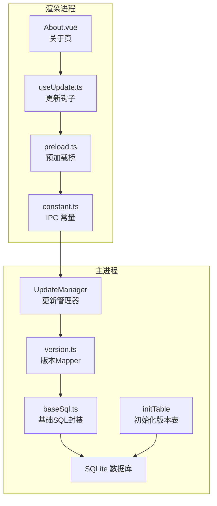
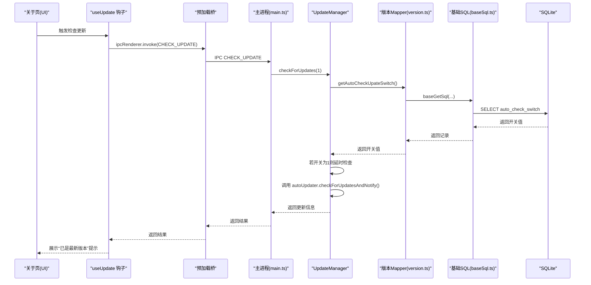
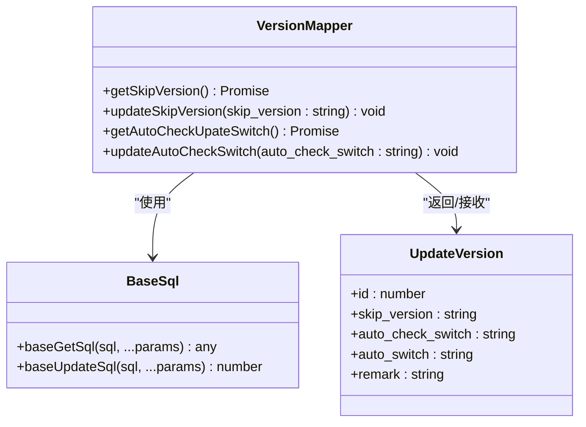
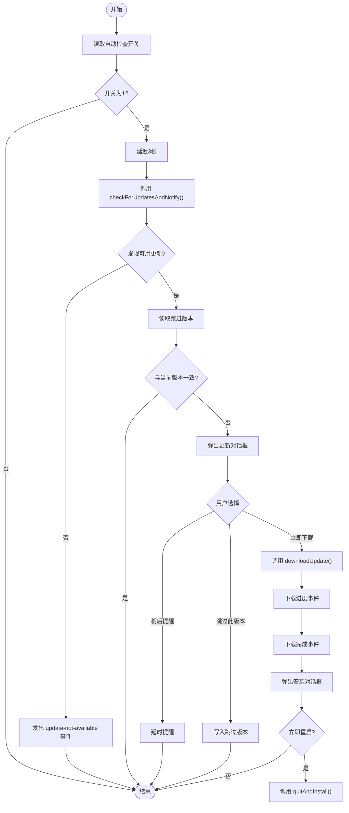
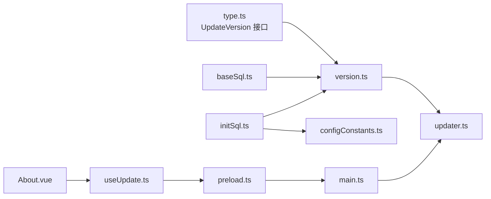
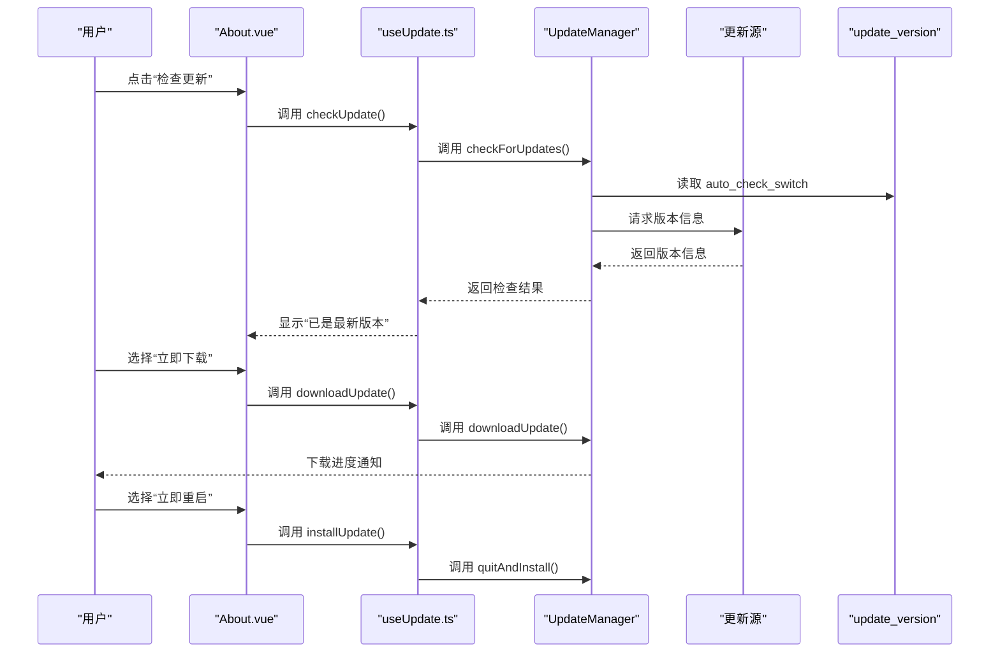

# 版本信息Mapper

<cite>
**本文引用的文件**
- [electron/db/sqlite/mapper/version.ts](file://electron/db/sqlite/mapper/version.ts)
- [electron/db/sqlite/components/baseSql.ts](file://electron/db/sqlite/components/baseSql.ts)
- [electron/db/sqlite/components/initSql.ts](file://electron/db/sqlite/components/initSql.ts)
- [electron/db/sqlite/components/configConstants.ts](file://electron/db/sqlite/components/configConstants.ts)
- [electron/updater.ts](file://electron/updater.ts)
- [electron/main.ts](file://electron/main.ts)
- [electron/preload.ts](file://electron/preload.ts)
- [src/components/type.ts](file://src/components/type.ts)
- [src/hooks/useUpdate.ts](file://src/hooks/useUpdate.ts)
- [src/components/topMenu/About.vue](file://src/components/topMenu/About.vue)
- [electron/constant.ts](file://electron/constant.ts)
</cite>

## 目录
1. [简介](#简介)
2. [项目结构](#项目结构)
3. [核心组件](#核心组件)
4. [架构总览](#架构总览)
5. [详细组件分析](#详细组件分析)
6. [依赖关系分析](#依赖关系分析)
7. [性能考量](#性能考量)
8. [故障排查指南](#故障排查指南)
9. [结论](#结论)
10. [附录](#附录)

## 简介
本技术文档围绕“版本信息Mapper”展开，系统性阐述其在应用中的职责与实现原理，重点覆盖：
- 版本数据的结构设计与存储机制
- 版本管理的业务逻辑（比较、升级检测、回滚策略）
- 自动更新流程中Version Mapper的作用（检查、下载、安装）
- 实际应用场景与最佳实践

Version Mapper负责维护与读取“跳过版本”和“自动检查开关”等关键配置，并与自动更新模块协同工作，确保用户在合适的时机接收更新提示，同时允许用户选择跳过特定版本或关闭自动检查。

## 项目结构
Version Mapper位于Electron主进程侧的SQLite映射层，配合初始化脚本创建并填充版本配置表，再由自动更新模块在运行期读取这些配置，驱动更新行为。

**图表来源**
- [electron/updater.ts:1-204](file://electron/updater.ts#L1-L204)
- [electron/db/sqlite/mapper/version.ts:1-38](file://electron/db/sqlite/mapper/version.ts#L1-L38)
- [electron/db/sqlite/components/baseSql.ts:1-87](file://electron/db/sqlite/components/baseSql.ts#L1-L87)
- [electron/db/sqlite/components/initSql.ts:107-150](file://electron/db/sqlite/components/initSql.ts#L107-L150)
- [electron/preload.ts:1-38](file://electron/preload.ts#L1-L38)
- [src/hooks/useUpdate.ts:1-29](file://src/hooks/useUpdate.ts#L1-L29)
- [src/components/topMenu/About.vue:1-62](file://src/components/topMenu/About.vue#L1-L62)
- [electron/constant.ts:56-60](file://electron/constant.ts#L56-L60)

**章节来源**
- [electron/db/sqlite/mapper/version.ts:1-38](file://electron/db/sqlite/mapper/version.ts#L1-L38)
- [electron/db/sqlite/components/initSql.ts:107-150](file://electron/db/sqlite/components/initSql.ts#L107-L150)
- [electron/updater.ts:1-204](file://electron/updater.ts#L1-L204)
- [electron/main.ts:196-227](file://electron/main.ts#L196-L227)
- [electron/preload.ts:25-37](file://electron/preload.ts#L25-L37)
- [src/hooks/useUpdate.ts:1-29](file://src/hooks/useUpdate.ts#L1-L29)
- [src/components/topMenu/About.vue:1-62](file://src/components/topMenu/About.vue#L1-L62)
- [electron/constant.ts:56-60](file://electron/constant.ts#L56-L60)

## 核心组件
- 版本Mapper（version.ts）
  - 提供获取“跳过版本”和“自动检查开关”的读取接口
  - 提供更新“跳过版本”和“自动检查开关”的写入接口
- 基础SQL封装（baseSql.ts）
  - 统一封装查询、更新、插入、事务等数据库操作
- 初始化脚本（initSql.ts）
  - 创建“update_version”表并插入初始默认值
- 更新管理器（updater.ts）
  - 集成electron-updater，监听更新事件，结合Mapper进行跳过版本判断与自动检查
- 前端交互（About.vue + useUpdate.ts + preload.ts + constant.ts）
  - 提供UI入口触发检查更新、切换自动检查开关，并通过IPC与主进程通信

**章节来源**
- [electron/db/sqlite/mapper/version.ts:9-31](file://electron/db/sqlite/mapper/version.ts#L9-L31)
- [electron/db/sqlite/components/baseSql.ts:21-81](file://electron/db/sqlite/components/baseSql.ts#L21-L81)
- [electron/db/sqlite/components/initSql.ts:107-150](file://electron/db/sqlite/components/initSql.ts#L107-L150)
- [electron/updater.ts:52-96](file://electron/updater.ts#L52-L96)
- [src/hooks/useUpdate.ts:7-26](file://src/hooks/useUpdate.ts#L7-L26)
- [src/components/topMenu/About.vue:14-21](file://src/components/topMenu/About.vue#L14-L21)
- [electron/preload.ts:25-37](file://electron/preload.ts#L25-L37)
- [electron/constant.ts:56-60](file://electron/constant.ts#L56-L60)

## 架构总览
Version Mapper作为数据访问层，向上游提供稳定的读写接口；上游的UpdateManager在更新流程中调用Mapper以决定是否跳过某版本或执行自动检查；前端通过IPC触发检查更新与开关切换，最终落回到主进程的Mapper与数据库。

**图表来源**
- [electron/main.ts:196-200](file://electron/main.ts#L196-L200)
- [electron/updater.ts:143-175](file://electron/updater.ts#L143-L175)
- [electron/db/sqlite/mapper/version.ts:21-25](file://electron/db/sqlite/mapper/version.ts#L21-L25)
- [electron/db/sqlite/components/baseSql.ts:21-32](file://electron/db/sqlite/components/baseSql.ts#L21-L32)
- [src/hooks/useUpdate.ts:7-14](file://src/hooks/useUpdate.ts#L7-L14)
- [electron/preload.ts:17-20](file://electron/preload.ts#L17-L20)

## 详细组件分析

### 版本Mapper（version.ts）
- 职责
  - 读取“跳过版本”：用于在发现新版本时判断是否应忽略该版本
  - 写入“跳过版本”：当用户选择“跳过此版本”时，将目标版本写入数据库
  - 读取“自动检查开关”：控制应用启动后是否自动发起一次更新检查
  - 写入“自动检查开关”：前端切换开关时写回数据库
- 数据结构
  - 字段：id、skip_version、auto_check_switch、auto_switch、remark
  - 类型：字符串类型存储开关与版本号，便于统一处理
- 错误处理
  - SQL异常会被捕获并返回空值或0，避免影响上层流程
- 性能特性
  - 查询与更新均为单条记录的简单操作，开销极低

**图表来源**
- [electron/db/sqlite/mapper/version.ts:9-31](file://electron/db/sqlite/mapper/version.ts#L9-L31)
- [electron/db/sqlite/components/baseSql.ts:21-81](file://electron/db/sqlite/components/baseSql.ts#L21-L81)
- [src/components/type.ts:39-47](file://src/components/type.ts#L39-L47)

**章节来源**
- [electron/db/sqlite/mapper/version.ts:9-31](file://electron/db/sqlite/mapper/version.ts#L9-L31)
- [src/components/type.ts:39-47](file://src/components/type.ts#L39-L47)

### 基础SQL封装（baseSql.ts）
- 提供通用的查询、更新、插入、事务等能力
- 统一错误处理与日志输出，保证Mapper层调用稳定
- 为版本表的读写提供可靠支撑

**章节来源**
- [electron/db/sqlite/components/baseSql.ts:9-81](file://electron/db/sqlite/components/baseSql.ts#L9-L81)

### 初始化脚本（initSql.ts）
- 在首次启动时创建“update_version”表
- 插入默认记录（skip_version为空，auto_check_switch为'0'，auto_switch为'0'）
- 保证后续版本管理功能可用

**章节来源**
- [electron/db/sqlite/components/initSql.ts:107-150](file://electron/db/sqlite/components/initSql.ts#L107-L150)

### 更新管理器（updater.ts）
- 配置更新源与下载策略（手动下载）
- 监听更新事件流：错误、检查中、发现更新、无更新、下载进度、下载完成
- 在“发现更新”阶段读取“跳过版本”，若匹配则忽略该版本
- 在“下载完成”阶段弹出安装确认对话框
- 启动时根据“自动检查开关”决定是否延迟执行一次检查

**图表来源**
- [electron/updater.ts:19-96](file://electron/updater.ts#L19-L96)
- [electron/updater.ts:143-175](file://electron/updater.ts#L143-L175)
- [electron/db/sqlite/mapper/version.ts:9-19](file://electron/db/sqlite/mapper/version.ts#L9-L19)

**章节来源**
- [electron/updater.ts:19-96](file://electron/updater.ts#L19-L96)
- [electron/updater.ts:143-175](file://electron/updater.ts#L143-L175)

### 前端交互（About.vue + useUpdate.ts + preload.ts + constant.ts）
- About.vue提供“检查更新”按钮与“自动检查更新”开关
- useUpdate.ts封装IPC调用，读取开关状态并切换
- preload.ts暴露便捷的update.update方法，简化渲染进程调用
- constant.ts定义IPC通道名称，确保前后端一致

**章节来源**
- [src/components/topMenu/About.vue:14-21](file://src/components/topMenu/About.vue#L14-L21)
- [src/hooks/useUpdate.ts:7-26](file://src/hooks/useUpdate.ts#L7-L26)
- [electron/preload.ts:25-37](file://electron/preload.ts#L25-L37)
- [electron/constant.ts:56-60](file://electron/constant.ts#L56-L60)

## 依赖关系分析
- Mapper依赖基础SQL封装与类型定义
- 初始化脚本依赖配置常量，确保默认值正确
- UpdateManager依赖Mapper与electron-updater
- 前端通过IPC与主进程交互，间接依赖Mapper

**图表来源**
- [src/components/type.ts:39-47](file://src/components/type.ts#L39-L47)
- [electron/db/sqlite/mapper/version.ts:1-2](file://electron/db/sqlite/mapper/version.ts#L1-L2)
- [electron/db/sqlite/components/baseSql.ts](file://electron/db/sqlite/components/baseSql.ts#L1)
- [electron/db/sqlite/components/initSql.ts:1-22](file://electron/db/sqlite/components/initSql.ts#L1-L22)
- [electron/db/sqlite/components/configConstants.ts:1-29](file://electron/db/sqlite/components/configConstants.ts#L1-L29)
- [electron/updater.ts:1-5](file://electron/updater.ts#L1-L5)
- [src/hooks/useUpdate.ts:1-2](file://src/hooks/useUpdate.ts#L1-L2)
- [electron/preload.ts:1-38](file://electron/preload.ts#L1-L38)
- [electron/main.ts:196-227](file://electron/main.ts#L196-L227)
- [src/components/topMenu/About.vue:1-62](file://src/components/topMenu/About.vue#L1-L62)

**章节来源**
- [electron/db/sqlite/mapper/version.ts:1-2](file://electron/db/sqlite/mapper/version.ts#L1-L2)
- [electron/db/sqlite/components/initSql.ts:1-22](file://electron/db/sqlite/components/initSql.ts#L1-L22)
- [electron/db/sqlite/components/configConstants.ts:1-29](file://electron/db/sqlite/components/configConstants.ts#L1-L29)
- [electron/updater.ts:1-5](file://electron/updater.ts#L1-L5)
- [src/hooks/useUpdate.ts:1-2](file://src/hooks/useUpdate.ts#L1-L2)
- [electron/preload.ts:1-38](file://electron/preload.ts#L1-L38)
- [electron/main.ts:196-227](file://electron/main.ts#L196-L227)
- [src/components/topMenu/About.vue:1-62](file://src/components/topMenu/About.vue#L1-L62)

## 性能考量
- Mapper仅操作单行记录，查询与更新均为轻量级操作，对性能影响可忽略
- 初始化脚本仅在首次启动时执行，且为DDL/DML组合，耗时可控
- UpdateManager在事件驱动下工作，避免轮询带来的资源消耗
- 建议
  - 将“跳过版本”清空作为检查更新前的清理步骤，确保不会因历史跳过记录导致误判
  - “自动检查开关”建议默认关闭，减少不必要的网络请求

[本节为通用指导，无需列出具体文件来源]

## 故障排查指南
- 无法读取“自动检查开关”
  - 检查初始化脚本是否成功创建“update_version”表并插入默认值
  - 确认Mapper的baseGetSql执行是否抛出异常
- 选择“跳过此版本”无效
  - 确认Mapper的updateSkipVersion是否被调用
  - 检查UpdateManager在“update-available”事件中是否正确读取并比对skip_version
- 自动检查未触发
  - 确认主进程在启动后是否调用了launchCheckUpdate
  - 检查“自动检查开关”是否为'1'
- 下载进度不显示
  - 确认主进程是否向渲染进程发送了download-progress消息
  - 检查preload桥是否正确注册了onDownloadProgress回调

**章节来源**
- [electron/db/sqlite/components/initSql.ts:107-150](file://electron/db/sqlite/components/initSql.ts#L107-L150)
- [electron/db/sqlite/mapper/version.ts:9-19](file://electron/db/sqlite/mapper/version.ts#L9-L19)
- [electron/updater.ts:52-96](file://electron/updater.ts#L52-L96)
- [electron/main.ts:196-227](file://electron/main.ts#L196-L227)
- [electron/preload.ts:31-36](file://electron/preload.ts#L31-L36)

## 结论
Version Mapper以极简的数据模型与清晰的职责边界，为应用的版本管理提供了可靠支撑。它与初始化脚本、更新管理器以及前端交互形成完整闭环，既满足了用户对更新体验的个性化需求，又保证了更新流程的可控与可观测。通过合理使用“跳过版本”与“自动检查开关”，可在保证稳定性的同时提升用户体验。

[本节为总结性内容，无需列出具体文件来源]

## 附录

### 版本数据结构与字段说明
- 表名：update_version
- 字段
  - id：主键
  - skip_version：跳过版本号（为空表示不跳过）
  - auto_check_switch：自动检查开关（'1'开启，'0'关闭）
  - auto_switch：自动更新开关（'1'开启，'0'关闭）
  - remark：备注

**章节来源**
- [electron/db/sqlite/components/initSql.ts:117-126](file://electron/db/sqlite/components/initSql.ts#L117-L126)
- [src/components/type.ts:39-47](file://src/components/type.ts#L39-L47)

### 版本管理业务逻辑要点
- 版本比较
  - 使用electron-updater提供的语义化版本比较能力
- 升级检测
  - 支持自动检查与手动检查两种模式
- 回滚机制
  - 应用层未实现显式回滚逻辑，回滚通常依赖安装包自身的降级策略或用户手动卸载重装

**章节来源**
- [electron/updater.ts:19-36](file://electron/updater.ts#L19-L36)
- [electron/updater.ts:177-185](file://electron/updater.ts#L177-L185)

### 自动更新流程（检查-下载-安装）
- 检查更新：根据开关决定是否自动检查，或由用户手动触发
- 下载更新：用户同意后手动下载
- 安装更新：下载完成后提示重启安装

**图表来源**
- [src/components/topMenu/About.vue:43-46](file://src/components/topMenu/About.vue#L43-L46)
- [src/hooks/useUpdate.ts:7-14](file://src/hooks/useUpdate.ts#L7-L14)
- [electron/updater.ts:187-200](file://electron/updater.ts#L187-L200)
- [electron/main.ts:213-221](file://electron/main.ts#L213-L221)