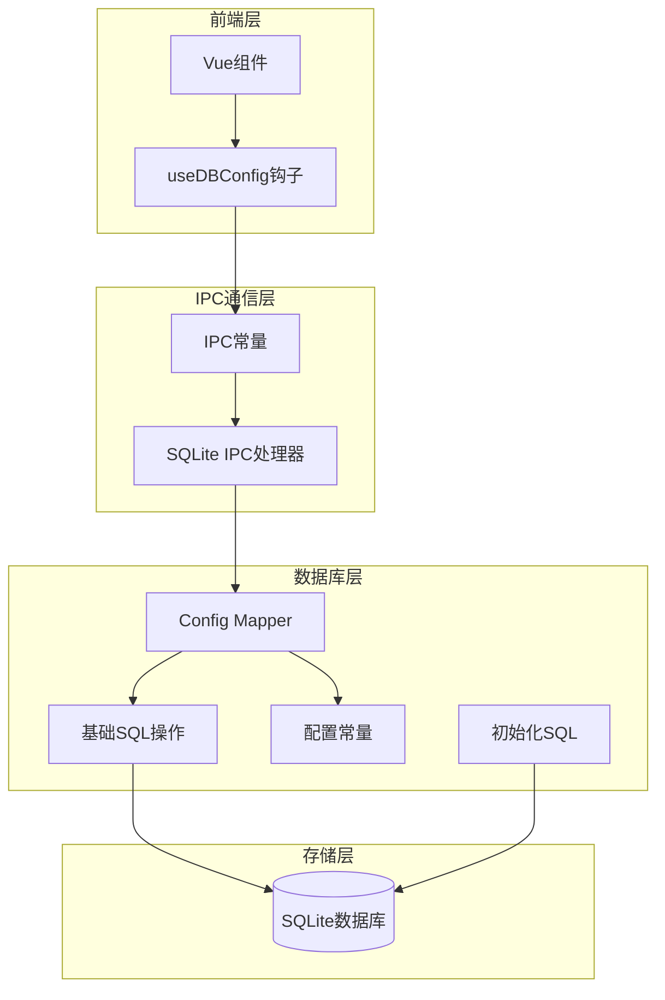
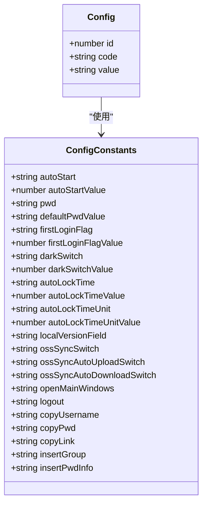
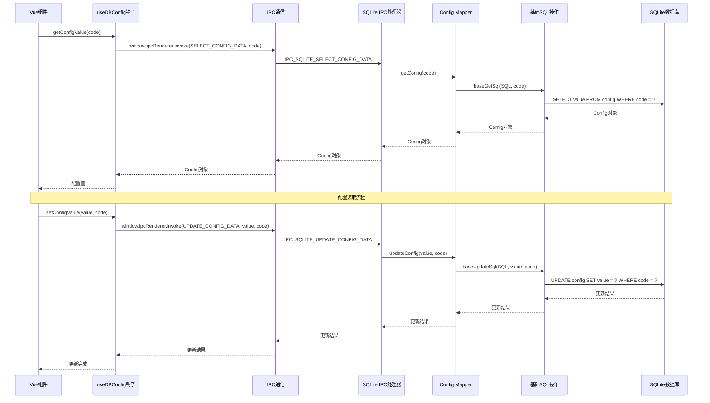
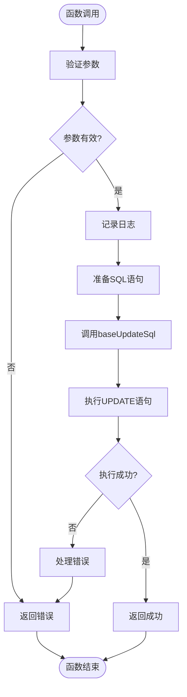
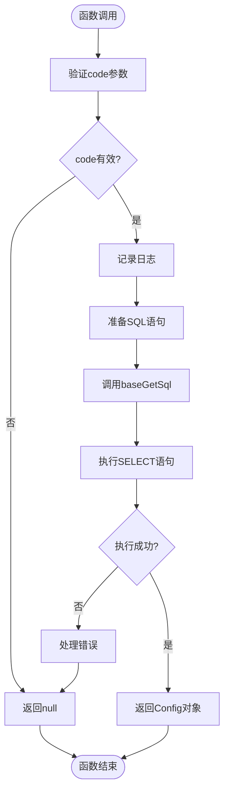
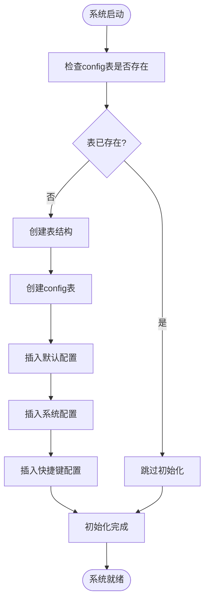
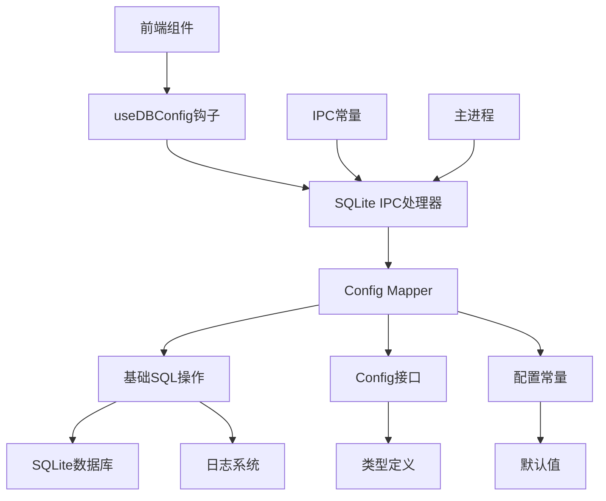

# 配置信息Mapper

<cite>
**本文档引用的文件**
- [config.ts](file://electron/db/sqlite/mapper/config.ts)
- [baseSql.ts](file://electron/db/sqlite/components/baseSql.ts)
- [configConstants.ts](file://electron/db/sqlite/components/configConstants.ts)
- [initSql.ts](file://electron/db/sqlite/components/initSql.ts)
- [sqlite-ipc.ts](file://electron/db/sqlite/sqlite-ipc.ts)
- [type.ts](file://src/components/type.ts)
- [useDBConfig.ts](file://src/hooks/useDBConfig.ts)
- [constant.ts](file://electron/constant.ts)
- [main.ts](file://electron/main.ts)
</cite>

## 目录
1. [简介](#简介)
2. [项目结构](#项目结构)
3. [核心组件](#核心组件)
4. [架构概览](#架构概览)
5. [详细组件分析](#详细组件分析)
6. [依赖关系分析](#依赖关系分析)
7. [性能考虑](#性能考虑)
8. [故障排除指南](#故障排除指南)
9. [结论](#结论)
10. [附录](#附录)

## 简介

配置信息Mapper是密码管理器中负责管理应用配置的核心组件。它基于Electron的IPC机制，实现了配置信息的持久化存储和动态管理。本文档将深入分析Config Mapper的实现原理，包括updateConfig和getConfig两个核心方法的设计思路和实现细节，并详细说明配置信息的存储结构、数据类型和业务规则。

## 项目结构

配置信息Mapper位于Electron的SQLite数据库层，采用分层架构设计：



**图表来源**
- [config.ts:1-27](file://electron/db/sqlite/mapper/config.ts#L1-L27)
- [sqlite-ipc.ts:58-95](file://electron/db/sqlite/sqlite-ipc.ts#L58-L95)
- [baseSql.ts:1-87](file://electron/db/sqlite/components/baseSql.ts#L1-L87)

**章节来源**
- [config.ts:1-27](file://electron/db/sqlite/mapper/config.ts#L1-L27)
- [sqlite-ipc.ts:58-95](file://electron/db/sqlite/sqlite-ipc.ts#L58-L95)
- [baseSql.ts:1-87](file://electron/db/sqlite/components/baseSql.ts#L1-L87)

## 核心组件

### Config接口定义

Config接口定义了配置信息的数据结构：



**图表来源**
- [type.ts:31-38](file://src/components/type.ts#L31-L38)
- [configConstants.ts:1-29](file://electron/db/sqlite/components/configConstants.ts#L1-L29)

### 数据库表结构

配置信息存储在SQLite数据库的config表中，具有以下结构：

| 字段名 | 数据类型 | 约束 | 描述 |
|--------|----------|------|------|
| id | INTEGER | PRIMARY KEY, AUTOINCREMENT | 自增主键 |
| code | TEXT | NOT NULL, UNIQUE | 配置项标识符 |
| value | TEXT | NULL | 配置值 |

**章节来源**
- [initSql.ts:73-81](file://electron/db/sqlite/components/initSql.ts#L73-L81)
- [type.ts:31-38](file://src/components/type.ts#L31-L38)

## 架构概览

配置信息Mapper采用三层架构模式：



**图表来源**
- [useDBConfig.ts:6-18](file://src/hooks/useDBConfig.ts#L6-L18)
- [sqlite-ipc.ts:84-95](file://electron/db/sqlite/sqlite-ipc.ts#L84-L95)
- [config.ts:8-20](file://electron/db/sqlite/mapper/config.ts#L8-L20)

## 详细组件分析

### Config Mapper实现

Config Mapper是配置信息的核心操作类，提供了两个核心方法：

#### updateConfig方法

updateConfig方法负责更新配置信息：



**图表来源**
- [config.ts:8-13](file://electron/db/sqlite/mapper/config.ts#L8-L13)
- [baseSql.ts:67-81](file://electron/db/sqlite/components/baseSql.ts#L67-L81)

#### getConfig方法

getConfig方法负责获取配置信息：



**图表来源**
- [config.ts:15-20](file://electron/db/sqlite/mapper/config.ts#L15-L20)
- [baseSql.ts:21-32](file://electron/db/sqlite/components/baseSql.ts#L21-L32)

**章节来源**
- [config.ts:8-20](file://electron/db/sqlite/mapper/config.ts#L8-L20)
- [baseSql.ts:21-81](file://electron/db/sqlite/components/baseSql.ts#L21-L81)

### 基础SQL操作

基础SQL操作提供了通用的数据库访问能力：

#### baseUpdateSql方法

baseUpdateSql方法封装了UPDATE操作的通用逻辑：

| 功能特性 | 实现细节 |
|----------|----------|
| 参数验证 | 检查SQL语句和参数的有效性 |
| 数据库连接 | 使用getDB()获取数据库连接 |
| 事务处理 | 使用prepare()和run()执行SQL |
| 错误处理 | 捕获异常并返回适当的错误码 |
| 返回值 | 成功返回1，失败返回0 |

#### baseGetSql方法

baseGetSql方法封装了SELECT操作的通用逻辑：

| 功能特性 | 实现细节 |
|----------|----------|
| 参数验证 | 检查SQL语句和参数的有效性 |
| 数据库连接 | 使用getDB()获取数据库连接 |
| 查询执行 | 使用prepare()和get()执行查询 |
| 结果处理 | 返回查询结果或null |
| 异常处理 | 捕获异常并记录错误日志 |

**章节来源**
- [baseSql.ts:21-81](file://electron/db/sqlite/components/baseSql.ts#L21-L81)

### 配置常量管理

配置常量定义了所有可用的配置项及其默认值：

#### 系统配置项

| 配置项 | 默认值 | 用途 |
|--------|--------|------|
| auto_start | 1 | 自动启动开关 |
| pwd | 默认密码哈希 | 登录密码 |
| first_login_flag | 1 | 首次登录标记 |
| dark_switch | 1 | 深色主题开关 |
| auto_lock_time | 60 | 自动锁定时间 |
| auto_lock_time_unit | 1000 | 自动锁定时间单位 |

#### 快捷键配置项

| 配置项 | 默认值 | 用途 |
|--------|--------|------|
| openMainWindows | Ctrl + Alt + E | 打开主窗口快捷键 |
| logout | Escape | 注销快捷键 |
| copyUsername | Ctrl + U | 复制用户名快捷键 |
| copyPwd | Ctrl + P | 复制密码快捷键 |
| copyLink | Ctrl + L | 复制链接快捷键 |
| insertGroup | Ctrl + G | 新建分组快捷键 |
| insertPwdInfo | Ctrl + N | 新建密码信息快捷键 |

**章节来源**
- [configConstants.ts:3-27](file://electron/db/sqlite/components/configConstants.ts#L3-L27)

### 初始化流程

系统启动时会自动初始化配置表和默认配置：



**图表来源**
- [initSql.ts:26-46](file://electron/db/sqlite/components/initSql.ts#L26-L46)
- [initSql.ts:164-183](file://electron/db/sqlite/components/initSql.ts#L164-L183)

**章节来源**
- [initSql.ts:26-183](file://electron/db/sqlite/components/initSql.ts#L26-L183)

## 依赖关系分析

配置信息Mapper的依赖关系如下：



**图表来源**
- [config.ts:1-2](file://electron/db/sqlite/mapper/config.ts#L1-L2)
- [sqlite-ipc.ts](file://electron/db/sqlite/sqlite-ipc.ts#L33)
- [useDBConfig.ts](file://src/hooks/useDBConfig.ts#L1)

### 外部依赖

| 依赖项 | 用途 | 版本要求 |
|--------|------|----------|
| better-sqlite3 | SQLite数据库驱动 | ^9.0.0 |
| electron | 跨平台桌面应用框架 | ^28.0.0 |
| vue | 前端框架 | ^3.0.0 |
| electron-builder | 应用打包工具 | ^24.0.0 |

**章节来源**
- [config.ts:1-2](file://electron/db/sqlite/mapper/config.ts#L1-L2)
- [sqlite-ipc.ts](file://electron/db/sqlite/sqlite-ipc.ts#L33)
- [useDBConfig.ts](file://src/hooks/useDBConfig.ts#L1)

## 性能考虑

### 查询优化

1. **索引策略**: config表的code字段设置了UNIQUE约束，确保查询效率
2. **参数绑定**: 使用参数化查询防止SQL注入并提高执行效率
3. **连接池**: 基于better-sqlite3的连接复用机制

### 内存管理

1. **垃圾回收**: 及时释放数据库连接和查询结果
2. **缓存策略**: 对频繁访问的配置项实施内存缓存
3. **异步处理**: 所有数据库操作都是异步执行，避免阻塞主线程

### 并发控制

1. **事务隔离**: 使用SQLite的内置事务机制保证数据一致性
2. **锁机制**: better-sqlite3提供自动的并发控制
3. **错误恢复**: 完善的异常处理确保系统稳定性

## 故障排除指南

### 常见问题及解决方案

#### 配置读取失败

**症状**: getConfig方法返回null或undefined

**可能原因**:
1. 数据库连接失败
2. 配置项不存在
3. SQL执行异常

**解决步骤**:
1. 检查数据库文件是否存在
2. 验证配置项是否已初始化
3. 查看控制台错误日志

#### 配置更新失败

**症状**: updateConfig方法返回0

**可能原因**:
1. SQL语法错误
2. 参数类型不匹配
3. 数据库权限不足

**解决步骤**:
1. 验证SQL语句的正确性
2. 检查参数的数据类型
3. 确认数据库写入权限

#### IPC通信异常

**症状**: 前端无法与主进程通信

**可能原因**:
1. IPC通道未正确注册
2. 参数传递错误
3. Electron版本兼容性问题

**解决步骤**:
1. 检查IPC常量定义
2. 验证参数序列化
3. 更新Electron版本

**章节来源**
- [baseSql.ts:16-31](file://electron/db/sqlite/components/baseSql.ts#L16-L31)
- [baseSql.ts:76-79](file://electron/db/sqlite/components/baseSql.ts#L76-L79)

## 结论

配置信息Mapper作为密码管理器的核心组件，通过精心设计的架构实现了配置信息的高效管理和持久化存储。其主要特点包括：

1. **模块化设计**: 清晰的分层架构便于维护和扩展
2. **安全性**: 参数化查询和严格的类型检查防止安全漏洞
3. **可靠性**: 完善的错误处理和异常恢复机制
4. **性能**: 基于SQLite的高性能数据存储方案

该组件为密码管理器提供了稳定可靠的配置管理基础，支持应用的各种配置需求，包括用户偏好设置、系统行为控制和快捷键配置等。

## 附录

### 使用示例

#### 默认配置初始化

```typescript
// 在应用启动时初始化配置
await initTable();
```

#### 配置项更新

```typescript
// 更新自动锁定时间
await setConfigValue('120', autoLockTime);

// 更新深色主题开关
await setConfigValue('0', darkSwitch);
```

#### 配置项读取

```typescript
// 获取当前自动锁定时间
const autoLockTime = await getConfigValue(autoLockTime);

// 获取深色主题状态
const darkTheme = await getConfigValue(darkSwitch);
```

### 配置项分类

#### 系统配置
- auto_start: 应用自动启动
- first_login_flag: 首次登录标记
- local_version: 本地版本号

#### 用户界面配置
- dark_switch: 深色主题切换
- auto_lock_time: 自动锁定时间
- auto_lock_time_unit: 时间单位

#### 功能开关配置
- oss_sync_switch: OSS同步开关
- oss_sync_auto_upload_switch: 自动上传开关
- oss_sync_auto_download_switch: 自动下载开关