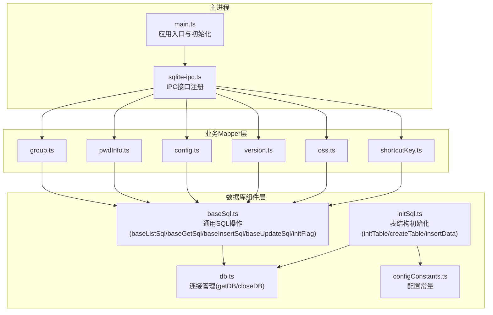
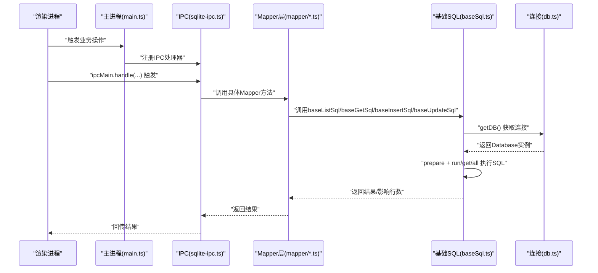
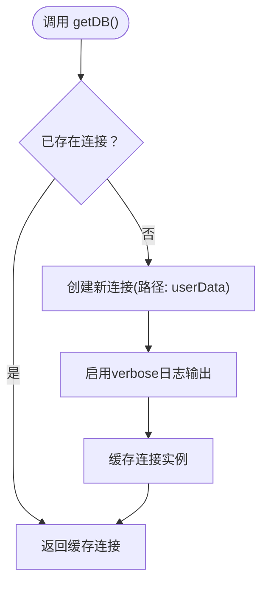
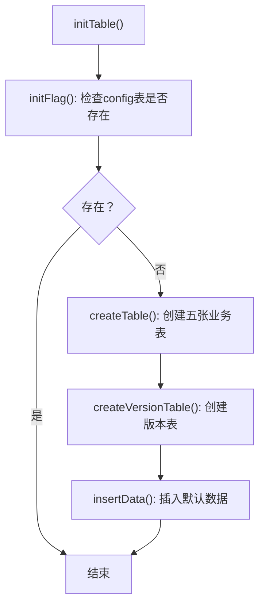
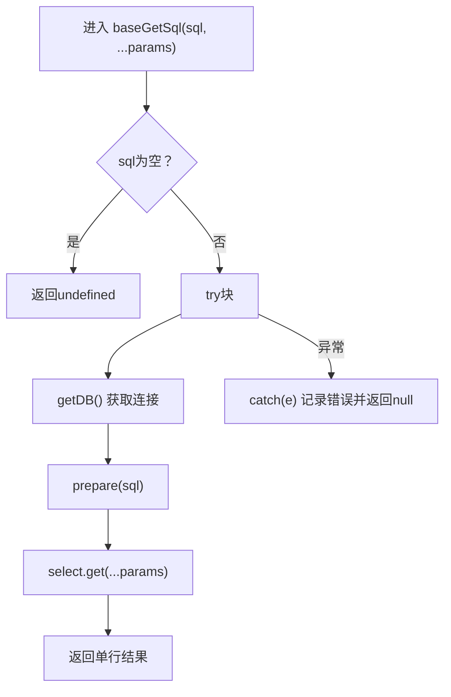
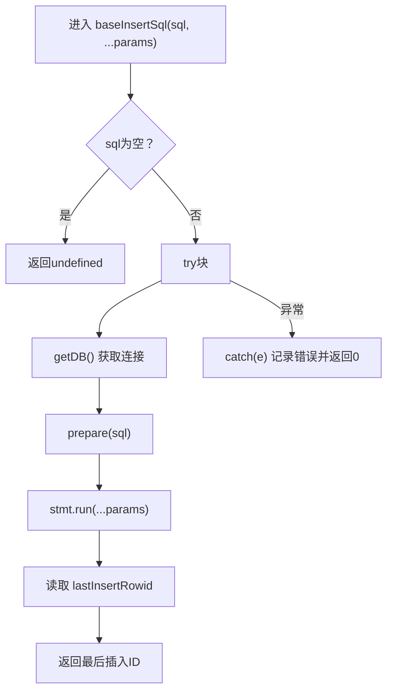
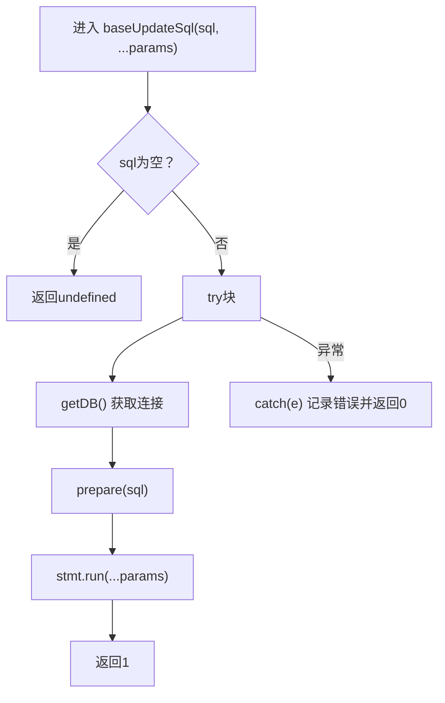
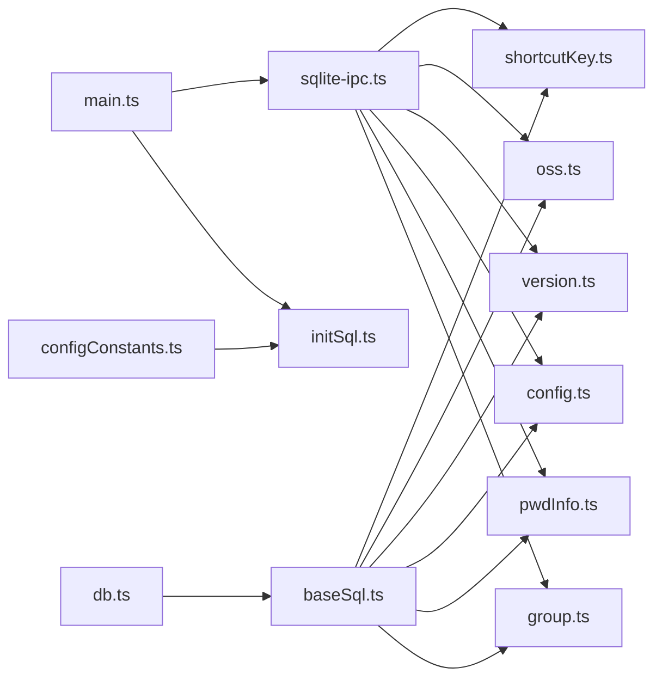

# 基础SQL组件

<cite>
**本文引用的文件列表**
- [electron/db/sqlite/components/baseSql.ts](file://electron/db/sqlite/components/baseSql.ts)
- [electron/db/sqlite/components/db.ts](file://electron/db/sqlite/components/db.ts)
- [electron/db/sqlite/components/initSql.ts](file://electron/db/sqlite/components/initSql.ts)
- [electron/db/sqlite/components/configConstants.ts](file://electron/db/sqlite/components/configConstants.ts)
- [electron/db/sqlite/mapper/pwdInfo.ts](file://electron/db/sqlite/mapper/pwdInfo.ts)
- [electron/db/sqlite/mapper/group.ts](file://electron/db/sqlite/mapper/group.ts)
- [electron/db/sqlite/mapper/config.ts](file://electron/db/sqlite/mapper/config.ts)
- [electron/db/sqlite/mapper/version.ts](file://electron/db/sqlite/mapper/version.ts)
- [electron/db/sqlite/mapper/oss.ts](file://electron/db/sqlite/mapper/oss.ts)
- [electron/db/sqlite/mapper/shortcutKey.ts](file://electron/db/sqlite/mapper/shortcutKey.ts)
- [electron/db/sqlite/sqlite-ipc.ts](file://electron/db/sqlite/sqlite-ipc.ts)
- [electron/main.ts](file://electron/main.ts)
- [electron/constant.ts](file://electron/constant.ts)
</cite>

## 目录
1. [简介](#简介)
2. [项目结构](#项目结构)
3. [核心组件](#核心组件)
4. [架构总览](#架构总览)
5. [详细组件分析](#详细组件分析)
6. [依赖关系分析](#依赖关系分析)
7. [性能与安全考量](#性能与安全考量)
8. [故障排查指南](#故障排查指南)
9. [结论](#结论)
10. [附录：使用示例与最佳实践](#附录使用示例与最佳实践)

## 简介
本文件面向密码管理器的Electron前端，系统性梳理“基础SQL组件”的设计与实现，重点围绕以下目标展开：
- 解释BaseSql基类（以一组通用SQL操作函数的形式）的设计理念与职责边界
- 深入解析通用SQL操作方法的实现原理：baseListSql、baseGetSql、baseInsertSql、baseUpdateSql
- 说明参数处理、错误处理策略与返回值约定
- 分析数据库连接管理、事务处理与并发控制现状与建议
- 提供基于现有组件的CRUD使用范式、参数绑定、结果处理与异常捕获示例路径
- 总结SQL注入防护机制与性能优化技巧

## 项目结构
该模块位于 Electron 应用的 SQLite 子系统中，采用“组件层 + Mapper层 + IPC层”的分层组织方式：
- 组件层：封装底层数据库访问与通用SQL操作（baseSql.ts、db.ts、initSql.ts）
- Mapper层：面向业务实体的SQL封装（group.ts、pwdInfo.ts、config.ts、version.ts、oss.ts、shortcutKey.ts）
- IPC层：将数据库操作暴露给渲染进程（sqlite-ipc.ts），由主进程统一调度
- 入口与初始化：主进程在启动时初始化数据库表结构，并注册IPC接口（main.ts）

图表来源
- [electron/main.ts:49-56](file://electron/main.ts#L49-L56)
- [electron/db/sqlite/sqlite-ipc.ts:58-219](file://electron/db/sqlite/sqlite-ipc.ts#L58-L219)
- [electron/db/sqlite/components/baseSql.ts:9-87](file://electron/db/sqlite/components/baseSql.ts#L9-L87)
- [electron/db/sqlite/components/db.ts:16-30](file://electron/db/sqlite/components/db.ts#L16-L30)
- [electron/db/sqlite/components/initSql.ts:26-46](file://electron/db/sqlite/components/initSql.ts#L26-L46)

章节来源
- [electron/main.ts:49-56](file://electron/main.ts#L49-L56)
- [electron/db/sqlite/sqlite-ipc.ts:58-219](file://electron/db/sqlite/sqlite-ipc.ts#L58-L219)
- [electron/db/sqlite/components/baseSql.ts:9-87](file://electron/db/sqlite/components/baseSql.ts#L9-L87)
- [electron/db/sqlite/components/db.ts:16-30](file://electron/db/sqlite/components/db.ts#L16-L30)
- [electron/db/sqlite/components/initSql.ts:26-46](file://electron/db/sqlite/components/initSql.ts#L26-L46)

## 核心组件
本节聚焦“基础SQL组件”——即通用SQL操作函数集合，它们是所有业务Mapper层的共同基石。

- baseListSql(sql, ...params)
  - 功能：执行查询语句，返回多行结果数组
  - 参数：sql为预编译语句模板；...params为占位符参数
  - 返回：Promise<Array<any> | null>
  - 错误处理：捕获异常并记录日志，返回null
  - 使用场景：列表查询、条件筛选、IN 查询等

- baseGetSql(sql, ...params)
  - 功能：执行查询语句，返回单行结果对象
  - 参数：sql为预编译语句模板；...params为占位符参数
  - 返回：Promise<any | null>
  - 错误处理：捕获异常并记录日志，返回null
  - 使用场景：按主键或唯一键获取单条记录

- baseInsertSql(sql, ...params)
  - 功能：执行插入语句，返回最后插入行ID
  - 参数：sql为预编译语句模板；...params为占位符参数
  - 返回：Promise<number>
  - 错误处理：捕获异常并记录日志，返回0
  - 使用场景：新增记录、导入数据

- baseUpdateSql(sql, ...params)
  - 功能：执行更新/删除/插入语句（非查询）
  - 参数：sql为预编译语句模板；...params为占位符参数
  - 返回：Promise<number>（成功返回1，失败返回0）
  - 错误处理：捕获异常并记录日志，返回0
  - 使用场景：更新、删除、批量更新

- initFlag()
  - 功能：检测特定表是否存在（用于初始化判断）
  - 返回：Promise<number>

章节来源
- [electron/db/sqlite/components/baseSql.ts:9-87](file://electron/db/sqlite/components/baseSql.ts#L9-L87)

## 架构总览
从调用链路看，渲染进程通过IPC向主进程发起请求，主进程在Mapper层调用基础SQL组件，最终落到better-sqlite3连接上执行。

图表来源
- [electron/main.ts:49-56](file://electron/main.ts#L49-L56)
- [electron/db/sqlite/sqlite-ipc.ts:58-219](file://electron/db/sqlite/sqlite-ipc.ts#L58-L219)
- [electron/db/sqlite/mapper/pwdInfo.ts:50-99](file://electron/db/sqlite/mapper/pwdInfo.ts#L50-L99)
- [electron/db/sqlite/components/baseSql.ts:9-87](file://electron/db/sqlite/components/baseSql.ts#L9-L87)
- [electron/db/sqlite/components/db.ts:16-30](file://electron/db/sqlite/components/db.ts#L16-L30)

## 详细组件分析

### 数据库连接管理与生命周期
- 单例连接：getDB() 在首次调用时创建连接，后续复用同一实例
- 连接路径：Electron userData目录下生成本地数据库文件
- 关闭策略：提供closeDB()显式关闭，但当前主流程未主动调用

图表来源
- [electron/db/sqlite/components/db.ts:16-30](file://electron/db/sqlite/components/db.ts#L16-L30)

章节来源
- [electron/db/sqlite/components/db.ts:16-30](file://electron/db/sqlite/components/db.ts#L16-L30)

### 初始化流程与表结构
- initTable()：检查config表是否存在，不存在则创建全部表并插入默认数据
- createTable()：创建group、pwd_info、config、shortcut_key、oss五张表
- createVersionTable()：创建update_version表并插入默认数据
- insertData()：批量插入默认配置、快捷键、分组、默认密码信息、OSS配置、版本信息

图表来源
- [electron/db/sqlite/components/initSql.ts:26-46](file://electron/db/sqlite/components/initSql.ts#L26-L46)
- [electron/db/sqlite/components/initSql.ts:48-105](file://electron/db/sqlite/components/initSql.ts#L48-L105)
- [electron/db/sqlite/components/initSql.ts:107-129](file://electron/db/sqlite/components/initSql.ts#L107-L129)
- [electron/db/sqlite/components/initSql.ts:131-143](file://electron/db/sqlite/components/initSql.ts#L131-L143)

章节来源
- [electron/db/sqlite/components/initSql.ts:26-46](file://electron/db/sqlite/components/initSql.ts#L26-L46)
- [electron/db/sqlite/components/initSql.ts:48-105](file://electron/db/sqlite/components/initSql.ts#L48-L105)
- [electron/db/sqlite/components/initSql.ts:107-129](file://electron/db/sqlite/components/initSql.ts#L107-L129)
- [electron/db/sqlite/components/initSql.ts:131-143](file://electron/db/sqlite/components/initSql.ts#L131-L143)

### 通用SQL操作方法详解

#### baseListSql
- 设计要点：对查询语句使用prepare + all，支持可变参数绑定
- 参数处理：...params按顺序绑定到SQL占位符
- 错误处理：try/catch捕获异常，记录错误并返回null
- 返回值：Promise<Array<any> | null>

图表来源
- [electron/db/sqlite/components/baseSql.ts:9-20](file://electron/db/sqlite/components/baseSql.ts#L9-L20)

章节来源
- [electron/db/sqlite/components/baseSql.ts:9-20](file://electron/db/sqlite/components/baseSql.ts#L9-L20)

#### baseGetSql
- 设计要点：对查询语句使用prepare + get，返回单行对象
- 参数处理：...params按顺序绑定到SQL占位符
- 错误处理：try/catch捕获异常，记录错误并返回null
- 返回值：Promise<any | null>

图表来源
- [electron/db/sqlite/components/baseSql.ts:21-32](file://electron/db/sqlite/components/baseSql.ts#L21-L32)

章节来源
- [electron/db/sqlite/components/baseSql.ts:21-32](file://electron/db/sqlite/components/baseSql.ts#L21-L32)

#### baseInsertSql
- 设计要点：对插入语句使用prepare + run，返回lastInsertRowid
- 参数处理：...params按顺序绑定到SQL占位符
- 错误处理：try/catch捕获异常，记录错误并返回0
- 返回值：Promise<number>

图表来源
- [electron/db/sqlite/components/baseSql.ts:35-49](file://electron/db/sqlite/components/baseSql.ts#L35-L49)

章节来源
- [electron/db/sqlite/components/baseSql.ts:35-49](file://electron/db/sqlite/components/baseSql.ts#L35-L49)

#### baseUpdateSql
- 设计要点：对更新/删除/插入语句使用prepare + run，返回1表示成功，0表示失败
- 参数处理：...params按顺序绑定到SQL占位符
- 错误处理：try/catch捕获异常，记录错误并返回0
- 返回值：Promise<number>

图表来源
- [electron/db/sqlite/components/baseSql.ts:67-81](file://electron/db/sqlite/components/baseSql.ts#L67-L81)

章节来源
- [electron/db/sqlite/components/baseSql.ts:67-81](file://electron/db/sqlite/components/baseSql.ts#L67-L81)

### 事务处理与并发控制现状
- 事务支持：基础SQL组件未内置事务封装，但提供了事务使用示例注释，表明可基于better-sqlite3的transaction API进行批量操作
- 并发控制：当前实现未显式加锁或事务隔离级别设置，连接为单例且无连接池；在高并发写入场景下需谨慎评估
- 建议：对于批量插入/更新，优先使用事务包裹，减少多次往返开销与锁竞争

章节来源
- [electron/db/sqlite/components/baseSql.ts:52-65](file://electron/db/sqlite/components/baseSql.ts#L52-L65)
- [electron/db/sqlite/components/db.ts:16-30](file://electron/db/sqlite/components/db.ts#L16-L30)

### Mapper层典型用法示例（路径指引）
- 新增密码信息（返回最后插入ID）
  - [insertPwdInfo(...):6-10](file://electron/db/sqlite/mapper/pwdInfo.ts#L6-L10)
  - [insertPwdInfoByImport(...):12-16](file://electron/db/sqlite/mapper/pwdInfo.ts#L12-L16)
- 删除密码信息（返回影响行数）
  - [delPwdInfo(id):18-23](file://electron/db/sqlite/mapper/pwdInfo.ts#L18-L23)
  - [delPwdInfoByGroupId(groupId):24-29](file://electron/db/sqlite/mapper/pwdInfo.ts#L24-L29)
  - [delAllPwdInfo():31-35](file://electron/db/sqlite/mapper/pwdInfo.ts#L31-L35)
- 更新密码信息（返回影响行数）
  - [updatePwdInfo(...):37-48](file://electron/db/sqlite/mapper/pwdInfo.ts#L37-L48)
- 列表查询（返回多行）
  - [listPwdInfo(groupId):50-60](file://electron/db/sqlite/mapper/pwdInfo.ts#L50-L60)
  - [listPwdInfoBySearch(searchValue):62-69](file://electron/db/sqlite/mapper/pwdInfo.ts#L62-L69)
  - [listPwdInfoByIds(ids):71-83](file://electron/db/sqlite/mapper/pwdInfo.ts#L71-L83)
- 单行查询（返回单行）
  - [getPwdInfo(id):94-99](file://electron/db/sqlite/mapper/pwdInfo.ts#L94-L99)
- 计数查询（返回聚合值）
  - [countPwdInfo(groupId):85-91](file://electron/db/sqlite/mapper/pwdInfo.ts#L85-L91)

章节来源
- [electron/db/sqlite/mapper/pwdInfo.ts:6-100](file://electron/db/sqlite/mapper/pwdInfo.ts#L6-L100)

## 依赖关系分析
- 组件层依赖：所有Mapper层均依赖基础SQL组件；基础SQL组件依赖连接管理模块
- IPC层依赖：主进程通过sqlite-ipc.ts注册各类IPC处理器，处理器内部调用对应Mapper
- 初始化依赖：主进程在启动时调用initTable()完成数据库初始化

图表来源
- [electron/db/sqlite/components/initSql.ts:23-46](file://electron/db/sqlite/components/initSql.ts#L23-L46)
- [electron/db/sqlite/components/baseSql.ts:1-1](file://electron/db/sqlite/components/baseSql.ts#L1-L1)
- [electron/db/sqlite/components/db.ts:1-1](file://electron/db/sqlite/components/db.ts#L1-L1)
- [electron/db/sqlite/sqlite-ipc.ts:33-50](file://electron/db/sqlite/sqlite-ipc.ts#L33-L50)
- [electron/main.ts:23-1](file://electron/main.ts#L23-L1)

章节来源
- [electron/db/sqlite/components/initSql.ts:23-46](file://electron/db/sqlite/components/initSql.ts#L23-L46)
- [electron/db/sqlite/components/baseSql.ts:1-1](file://electron/db/sqlite/components/baseSql.ts#L1-L1)
- [electron/db/sqlite/components/db.ts:1-1](file://electron/db/sqlite/components/db.ts#L1-L1)
- [electron/db/sqlite/sqlite-ipc.ts:33-50](file://electron/db/sqlite/sqlite-ipc.ts#L33-L50)
- [electron/main.ts:23-1](file://electron/main.ts#L23-L1)

## 性能与安全考量

### SQL注入防护机制
- 参数化查询：所有基础SQL方法均通过prepare + run/get/all的方式执行，参数以占位符形式传入，避免字符串拼接引发注入
- 建议：始终使用占位符绑定参数，不要拼接SQL字符串；对LIKE查询，应将通配符放在参数中进行转义或限制长度

章节来源
- [electron/db/sqlite/components/baseSql.ts:9-87](file://electron/db/sqlite/components/baseSql.ts#L9-L87)
- [electron/db/sqlite/mapper/pwdInfo.ts:62-69](file://electron/db/sqlite/mapper/pwdInfo.ts#L62-L69)

### 性能优化技巧
- 使用事务：批量插入/更新时，使用事务包裹以减少提交次数与锁竞争
- 合理索引：为常用查询字段建立索引（如group_id、title、username等）
- 减少不必要的查询：合并查询、使用IN子句替代多次单条查询
- 控制日志：verbose模式适合开发调试，生产环境可关闭以降低开销
- 连接复用：当前实现为单例连接，避免频繁创建销毁连接

章节来源
- [electron/db/sqlite/components/baseSql.ts:52-65](file://electron/db/sqlite/components/baseSql.ts#L52-L65)
- [electron/db/sqlite/components/db.ts:20-21](file://electron/db/sqlite/components/db.ts#L20-L21)

## 故障排查指南
- 常见错误类型
  - SQL语法错误：检查SQL模板与占位符数量是否一致
  - 参数类型不匹配：确保传入参数与SQL占位符顺序一致且类型正确
  - 权限问题：确认数据库文件路径可写（Electron userData目录）
- 日志定位
  - 基础SQL组件在异常时会记录错误日志，便于快速定位
  - Mapper层在关键操作前后打印日志，有助于追踪调用链
- 建议排查步骤
  - 确认数据库已初始化（initTable）
  - 检查SQL模板与参数绑定
  - 查看主进程控制台日志
  - 对复杂查询逐步简化，缩小问题范围

章节来源
- [electron/db/sqlite/components/baseSql.ts:12-19](file://electron/db/sqlite/components/baseSql.ts#L12-L19)
- [electron/db/sqlite/components/baseSql.ts:24-31](file://electron/db/sqlite/components/baseSql.ts#L24-L31)
- [electron/db/sqlite/components/baseSql.ts:44-47](file://electron/db/sqlite/components/baseSql.ts#L44-L47)
- [electron/db/sqlite/components/baseSql.ts:76-79](file://electron/db/sqlite/components/baseSql.ts#L76-L79)

## 结论
- 基础SQL组件以“函数式封装”为核心，提供统一的CRUD抽象，降低了Mapper层的重复代码
- 参数化查询有效防止SQL注入，配合严格的参数绑定与日志记录，提升了安全性与可观测性
- 当前未内置事务封装，建议在批量操作场景中显式使用事务，以提升性能与一致性
- 初始化流程完整覆盖业务表与默认数据，保证应用首次运行即可使用

## 附录：使用示例与最佳实践

### 如何进行CRUD操作（路径指引）
- 新增记录并获取自增ID
  - 使用 [baseInsertSql(...):35-49](file://electron/db/sqlite/components/baseSql.ts#L35-L49)
  - 示例：[insertPwdInfo(...):6-10](file://electron/db/sqlite/mapper/pwdInfo.ts#L6-L10)
- 查询单条记录
  - 使用 [baseGetSql(...):21-32](file://electron/db/sqlite/components/baseSql.ts#L21-L32)
  - 示例：[getPwdInfo(id):94-99](file://electron/db/sqlite/mapper/pwdInfo.ts#L94-L99)
- 查询多条记录
  - 使用 [baseListSql(...):9-20](file://electron/db/sqlite/components/baseSql.ts#L9-L20)
  - 示例：[listPwdInfo(groupId):50-60](file://electron/db/sqlite/mapper/pwdInfo.ts#L50-L60)
- 更新/删除记录
  - 使用 [baseUpdateSql(...):67-81](file://electron/db/sqlite/components/baseSql.ts#L67-L81)
  - 示例：[updatePwdInfo(...):37-48](file://electron/db/sqlite/mapper/pwdInfo.ts#L37-L48)

### 参数绑定与结果处理
- 参数绑定：所有SQL均通过占位符绑定，顺序与数量必须与传入参数一致
- 结果处理：
  - baseListSql返回数组，注意判空与长度
  - baseGetSql返回单行对象，注意判空
  - baseInsertSql返回最后插入ID，注意判0
  - baseUpdateSql返回影响行数，注意判0

### 异常捕获与日志
- 基础SQL组件在异常时会记录错误日志并返回约定的兜底值
- Mapper层在关键操作前后打印日志，便于定位问题

### 事务与并发建议
- 批量插入/更新时使用事务，减少提交次数
- 避免长时间持有连接，必要时调用 [closeDB():25-30](file://electron/db/sqlite/components/db.ts#L25-L30)
- 在高并发写入场景下，考虑引入连接池或队列化写入

章节来源
- [electron/db/sqlite/components/baseSql.ts:9-87](file://electron/db/sqlite/components/baseSql.ts#L9-L87)
- [electron/db/sqlite/mapper/pwdInfo.ts:6-100](file://electron/db/sqlite/mapper/pwdInfo.ts#L6-L100)
- [electron/db/sqlite/components/db.ts:25-30](file://electron/db/sqlite/components/db.ts#L25-L30)