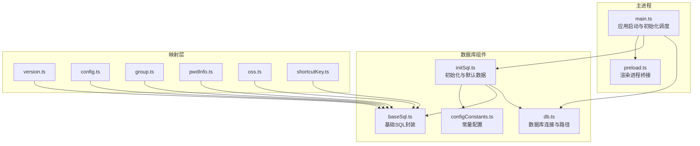
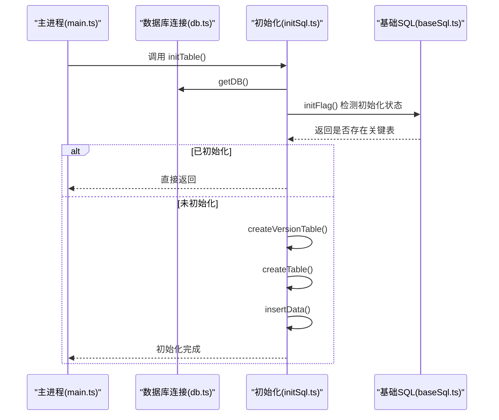
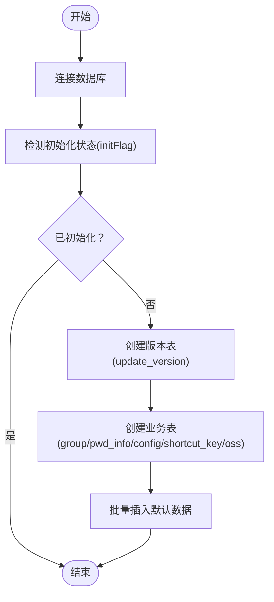
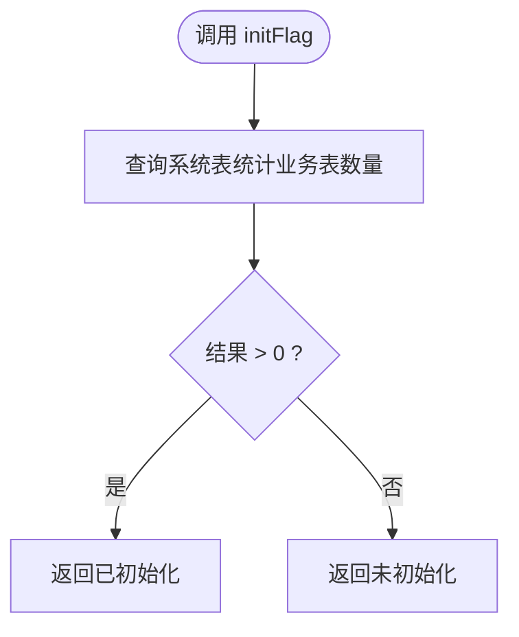
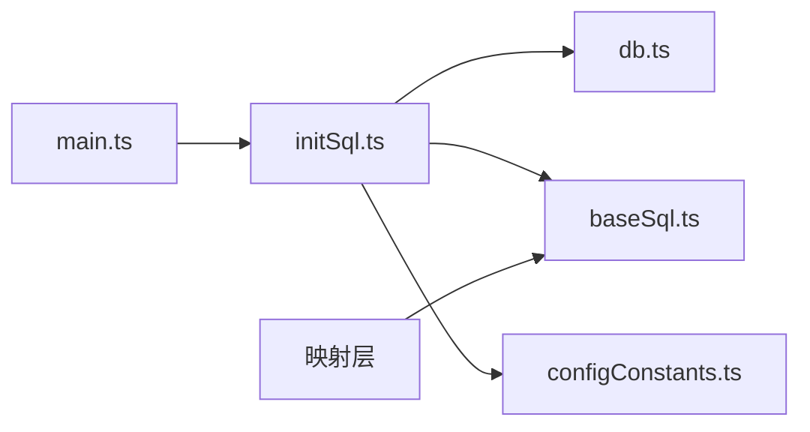

# 数据库初始化

<cite>
**本文引用的文件**
- [main.ts](file://electron/main.ts)
- [preload.ts](file://electron/preload.ts)
- [db.ts](file://electron/db/sqlite/components/db.ts)
- [baseSql.ts](file://electron/db/sqlite/components/baseSql.ts)
- [configConstants.ts](file://electron/db/sqlite/components/configConstants.ts)
- [initSql.ts](file://electron/db/sqlite/components/initSql.ts)
- [version.ts](file://electron/db/sqlite/mapper/version.ts)
- [config.ts](file://electron/db/sqlite/mapper/config.ts)
- [group.ts](file://electron/db/sqlite/mapper/group.ts)
- [pwdInfo.ts](file://electron/db/sqlite/mapper/pwdInfo.ts)
- [oss.ts](file://electron/db/sqlite/mapper/oss.ts)
- [shortcutKey.ts](file://electron/db/sqlite/mapper/shortcutKey.ts)
</cite>

## 目录
1. [简介](#简介)
2. [项目结构](#项目结构)
3. [核心组件](#核心组件)
4. [架构总览](#架构总览)
5. [详细组件分析](#详细组件分析)
6. [依赖关系分析](#依赖关系分析)
7. [性能考量](#性能考量)
8. [故障排查指南](#故障排查指南)
9. [结论](#结论)
10. [附录：SQL脚本与执行顺序](#附录sql脚本与执行顺序)

## 简介
本文件面向密码管理器的桌面端（Electron）数据库初始化系统，系统基于 SQLite（better-sqlite3），采用“按需初始化 + 默认数据填充”的策略，在应用启动阶段自动检测并创建必要的表结构与初始数据，并提供版本控制表用于后续迁移与升级。本文将从系统架构、组件职责、数据流、初始化流程、版本管理与迁移策略等维度进行深入解析，并给出可复用的最佳实践建议。

## 项目结构
数据库初始化相关代码集中在 Electron 主进程侧的 SQLite 组件目录中，主要由以下层次构成：
- 连接层：负责数据库连接与路径管理
- 基础 SQL 层：封装通用的查询/插入/更新/事务模板
- 初始化层：负责表结构创建、默认数据填充、版本表创建与初始化
- 映射层：面向业务的 CRUD 封装（供后续功能使用）
- 启动入口：主进程在应用启动时触发初始化流程

图表来源
- [main.ts:49-60](file://electron/main.ts#L49-L60)
- [db.ts:16-30](file://electron/db/sqlite/components/db.ts#L16-L30)
- [baseSql.ts:9-81](file://electron/db/sqlite/components/baseSql.ts#L9-L81)
- [initSql.ts:26-46](file://electron/db/sqlite/components/initSql.ts#L26-L46)
- [configConstants.ts:1-29](file://electron/db/sqlite/components/configConstants.ts#L1-L29)

章节来源
- [main.ts:49-60](file://electron/main.ts#L49-L60)
- [db.ts:16-30](file://electron/db/sqlite/components/db.ts#L16-L30)

## 核心组件
- 数据库连接与路径
  - 通过 Electron 的用户数据目录生成数据库文件路径，确保跨平台一致性与权限可控。
  - 单例模式缓存连接对象，避免重复打开数据库。
- 基础 SQL 封装
  - 提供通用的 prepare/run/get/all 模板，统一错误处理与日志输出。
  - 支持事务封装（注释中给出示例），便于批量写入或一致性要求高的场景。
- 初始化流程
  - 入口函数负责连接数据库、检测初始化状态、创建版本表、按需创建业务表并填充默认数据。
  - 初始化状态检测通过查询系统表判断关键业务表是否存在，避免重复初始化。
- 常量配置
  - 定义系统级配置键名与默认值，用于初始化时批量写入 config 表。
- 映射层
  - 面向具体业务的 CRUD 方法，为后续功能模块提供稳定的接口。

章节来源
- [db.ts:16-30](file://electron/db/sqlite/components/db.ts#L16-L30)
- [baseSql.ts:9-81](file://electron/db/sqlite/components/baseSql.ts#L9-L81)
- [initSql.ts:26-46](file://electron/db/sqlite/components/initSql.ts#L26-L46)
- [configConstants.ts:1-29](file://electron/db/sqlite/components/configConstants.ts#L1-L29)

## 架构总览
初始化流程在主进程启动时执行，遵循“先检测，后创建，再填充”的顺序，确保幂等性与可恢复性。

图表来源
- [main.ts:53](file://electron/main.ts#L53)
- [initSql.ts:26-46](file://electron/db/sqlite/components/initSql.ts#L26-L46)
- [baseSql.ts:83-87](file://electron/db/sqlite/components/baseSql.ts#L83-L87)

## 详细组件分析

### 初始化入口与执行流程
- 入口函数
  - 连接数据库，调用初始化状态检测，若未初始化则创建版本表与业务表，并批量插入默认数据。
- 初始化状态检测
  - 通过系统表查询关键业务表是否存在，作为“是否已初始化”的判定依据。
- 版本表创建
  - 若不存在版本表，则创建并插入一条默认记录，用于后续升级策略与跳过版本控制。
- 表结构与默认数据
  - 依次创建分组、密码信息、配置、快捷键、对象存储配置等表。
  - 批量插入默认配置项、快捷键、默认分组、示例密码条目、对象存储类型等。

图表来源
- [initSql.ts:26-46](file://electron/db/sqlite/components/initSql.ts#L26-L46)
- [initSql.ts:107-129](file://electron/db/sqlite/components/initSql.ts#L107-L129)
- [initSql.ts:131-143](file://electron/db/sqlite/components/initSql.ts#L131-L143)
- [baseSql.ts:83-87](file://electron/db/sqlite/components/baseSql.ts#L83-L87)

章节来源
- [initSql.ts:26-46](file://electron/db/sqlite/components/initSql.ts#L26-L46)
- [initSql.ts:107-129](file://electron/db/sqlite/components/initSql.ts#L107-L129)
- [initSql.ts:131-143](file://electron/db/sqlite/components/initSql.ts#L131-L143)
- [baseSql.ts:83-87](file://electron/db/sqlite/components/baseSql.ts#L83-L87)

### 表结构与约束设计
- 分组表
  - 主键自增，支持父子关系字段，便于构建树形分组。
- 密码信息表
  - 主键自增，外键关联分组；冗余存储分组标题便于查询；包含标题、用户名、加密密码、链接、备注等字段。
- 配置表
  - 主键自增，唯一约束键名，保证配置项唯一性；用于存储系统开关、默认密码、主题、自动锁定时间等。
- 快捷键表
  - 主键自增，记录动作名称与描述，便于动态绑定全局快捷键。
- 对象存储表
  - 主键自增，记录不同云存储类型的凭据占位，便于后续同步功能扩展。
- 版本表
  - 主键自增，记录跳过版本、自动检查开关、自动开关等字段，用于升级策略与用户偏好。

章节来源
- [initSql.ts:48-105](file://electron/db/sqlite/components/initSql.ts#L48-L105)
- [initSql.ts:117-127](file://electron/db/sqlite/components/initSql.ts#L117-L127)

### 常量配置与版本管理
- 常量配置
  - 定义系统配置键名与默认值，如自动启动、默认密码、首次登录标记、深色主题开关、自动锁定时间及其单位、本地版本号、对象存储同步开关等。
  - 初始化时批量写入 config 表，形成“系统默认配置基线”。
- 版本管理
  - 初始化时创建版本表并插入默认记录，后续可通过该表维护升级策略（如跳过某些版本、自动检查开关等）。
  - 本地版本号键名用于标识当前数据库结构版本，便于后续迁移脚本识别目标版本。

章节来源
- [configConstants.ts:1-29](file://electron/db/sqlite/components/configConstants.ts#L1-L29)
- [initSql.ts:164-183](file://electron/db/sqlite/components/initSql.ts#L164-L183)
- [initSql.ts:144-150](file://electron/db/sqlite/components/initSql.ts#L144-L150)
- [version.ts:9-19](file://electron/db/sqlite/mapper/version.ts#L9-L19)

### 初始化状态检测（initFlag）
- 实现原理
  - 通过查询系统元数据表，统计指定业务表的数量，以此判断是否已完成初始化。
- 设计要点
  - 选择关键业务表作为“初始化标志”，避免误判。
  - 返回布尔值或计数值，供上层逻辑决定是否继续初始化流程。
- 错误处理
  - 查询失败时返回空结果或抛出异常，上层应具备兜底策略（如重试或降级）。

图表来源
- [baseSql.ts:83-87](file://electron/db/sqlite/components/baseSql.ts#L83-L87)

章节来源
- [baseSql.ts:83-87](file://electron/db/sqlite/components/baseSql.ts#L83-L87)

### 默认数据填充策略
- 配置表
  - 批量插入系统默认配置项，覆盖开关、时间、版本号等。
- 快捷键表
  - 插入常用动作与默认快捷键组合，便于用户快速上手。
- 分组与示例密码
  - 插入默认分组与示例密码条目，降低用户初始使用成本。
- 对象存储
  - 插入常见云存储类型占位，便于后续同步功能接入。
- 版本表
  - 插入默认版本记录，包含跳过版本与自动检查开关等。

章节来源
- [initSql.ts:164-183](file://electron/db/sqlite/components/initSql.ts#L164-L183)
- [initSql.ts:185-207](file://electron/db/sqlite/components/initSql.ts#L185-L207)
- [initSql.ts:209-215](file://electron/db/sqlite/components/initSql.ts#L209-L215)
- [initSql.ts:217-224](file://electron/db/sqlite/components/initSql.ts#L217-L224)
- [initSql.ts:152-160](file://electron/db/sqlite/components/initSql.ts#L152-L160)
- [initSql.ts:144-150](file://electron/db/sqlite/components/initSql.ts#L144-L150)

### 映射层与业务解耦
- 配置映射
  - 提供配置项的读取与更新接口，屏蔽底层 SQL 细节。
- 分组映射
  - 提供分组的增删改查与按标题查询 ID 的能力。
- 密码信息映射
  - 提供列表、搜索、按 ID 批量查询、计数等接口，满足前端展示与筛选需求。
- 对象存储映射
  - 提供按类型查询与更新凭据的能力。
- 快捷键映射
  - 提供快捷键的查询、列表与更新能力。

章节来源
- [config.ts:8-20](file://electron/db/sqlite/mapper/config.ts#L8-L20)
- [group.ts:7-48](file://electron/db/sqlite/mapper/group.ts#L7-L48)
- [pwdInfo.ts:6-99](file://electron/db/sqlite/mapper/pwdInfo.ts#L6-L99)
- [oss.ts:8-23](file://electron/db/sqlite/mapper/oss.ts#L8-L23)
- [shortcutKey.ts:8-25](file://electron/db/sqlite/mapper/shortcutKey.ts#L8-L25)

## 依赖关系分析
- 启动依赖
  - 主进程在应用就绪后立即调用初始化入口，随后注册全局快捷键与 IPC。
- 组件耦合
  - 初始化层依赖连接层与基础 SQL 层；映射层依赖基础 SQL 层；常量配置被初始化层使用。
- 可能的循环依赖
  - 当前结构清晰，无明显循环依赖风险。

图表来源
- [main.ts:53](file://electron/main.ts#L53)
- [initSql.ts:26-46](file://electron/db/sqlite/components/initSql.ts#L26-L46)
- [db.ts:16-30](file://electron/db/sqlite/components/db.ts#L16-L30)
- [baseSql.ts:9-81](file://electron/db/sqlite/components/baseSql.ts#L9-L81)
- [configConstants.ts:1-29](file://electron/db/sqlite/components/configConstants.ts#L1-L29)

章节来源
- [main.ts:53](file://electron/main.ts#L53)
- [initSql.ts:26-46](file://electron/db/sqlite/components/initSql.ts#L26-L46)
- [db.ts:16-30](file://electron/db/sqlite/components/db.ts#L16-L30)
- [baseSql.ts:9-81](file://electron/db/sqlite/components/baseSql.ts#L9-L81)
- [configConstants.ts:1-29](file://electron/db/sqlite/components/configConstants.ts#L1-L29)

## 性能考量
- 连接复用
  - 使用单例缓存数据库连接，减少频繁打开/关闭带来的开销。
- 批量写入
  - 初始化阶段采用批量插入策略，减少多次往返与锁竞争。
- 查询优化
  - 建议在高频查询字段上建立索引（如密码信息表的标题与用户名模糊查询），但需权衡写入性能与存储空间。
- 事务使用
  - 对于多步一致性要求高的场景，优先使用事务封装，确保原子性与回滚能力。

## 故障排查指南
- 初始化未生效
  - 检查初始化状态检测逻辑是否正确返回；确认数据库路径与权限；查看初始化日志输出。
- 默认数据缺失
  - 核对批量插入函数是否执行；检查 SQL 语句与参数绑定；验证唯一约束冲突。
- 查询异常
  - 检查基础 SQL 封装中的错误处理分支；确认 SQL 语法与表结构一致。
- 版本表问题
  - 确认版本表创建逻辑与默认记录插入逻辑；核对后续升级策略是否正确读取版本字段。

章节来源
- [baseSql.ts:12-19](file://electron/db/sqlite/components/baseSql.ts#L12-L19)
- [baseSql.ts:24-31](file://electron/db/sqlite/components/baseSql.ts#L24-L31)
- [baseSql.ts:44-47](file://electron/db/sqlite/components/baseSql.ts#L44-L47)
- [initSql.ts:131-143](file://electron/db/sqlite/components/initSql.ts#L131-L143)

## 结论
该数据库初始化系统通过“连接层 + 基础 SQL 封装 + 初始化层 + 映射层”的分层设计，实现了启动即用、幂等安全、易于扩展的目标。初始化流程以系统表检测为核心，结合版本表与默认数据填充，为后续的功能演进与迁移提供了稳定的基础。建议在后续版本中引入显式的迁移脚本与版本号递增策略，进一步增强兼容性与可维护性。

## 附录：SQL脚本与执行顺序
- 执行顺序
  1) 连接数据库
  2) 检测初始化状态（查询系统表统计业务表数量）
  3) 若未初始化：
     - 创建版本表并插入默认记录
     - 依次创建业务表（分组、密码信息、配置、快捷键、对象存储）
     - 批量插入默认数据（配置、快捷键、分组、示例密码、对象存储类型）
  4) 返回初始化完成
- 关键 SQL 片段路径
  - 初始化状态检测：[baseSql.ts:83-87](file://electron/db/sqlite/components/baseSql.ts#L83-L87)
  - 版本表创建与默认记录插入：[initSql.ts:107-129](file://electron/db/sqlite/components/initSql.ts#L107-L129)、[initSql.ts:144-150](file://electron/db/sqlite/components/initSql.ts#L144-L150)
  - 业务表创建：[initSql.ts:48-105](file://electron/db/sqlite/components/initSql.ts#L48-L105)
  - 默认数据插入（配置/快捷键/分组/示例密码/对象存储）：[initSql.ts:164-183](file://electron/db/sqlite/components/initSql.ts#L164-L183)、[initSql.ts:185-207](file://electron/db/sqlite/components/initSql.ts#L185-L207)、[initSql.ts:209-215](file://electron/db/sqlite/components/initSql.ts#L209-L215)、[initSql.ts:217-224](file://electron/db/sqlite/components/initSql.ts#L217-L224)、[initSql.ts:152-160](file://electron/db/sqlite/components/initSql.ts#L152-L160)