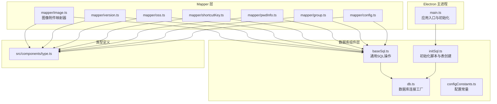
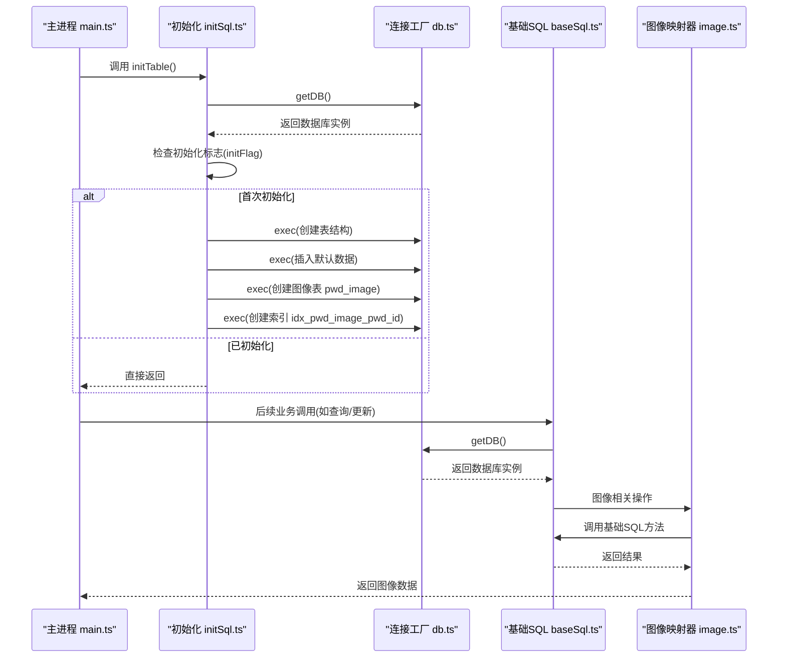
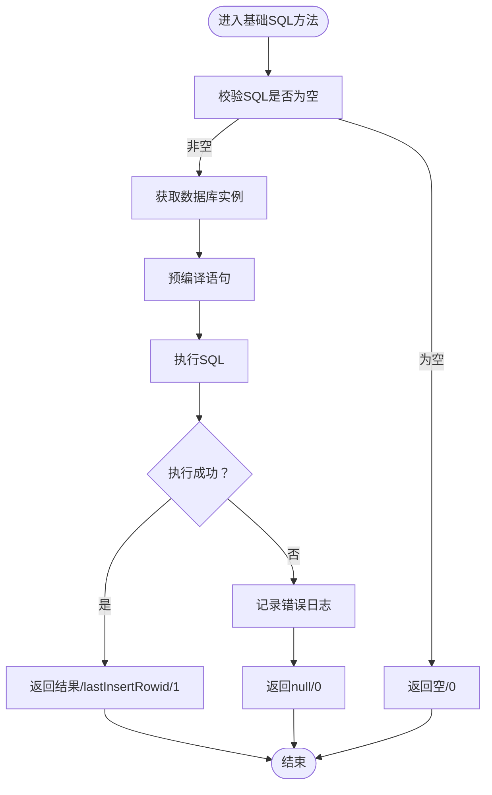
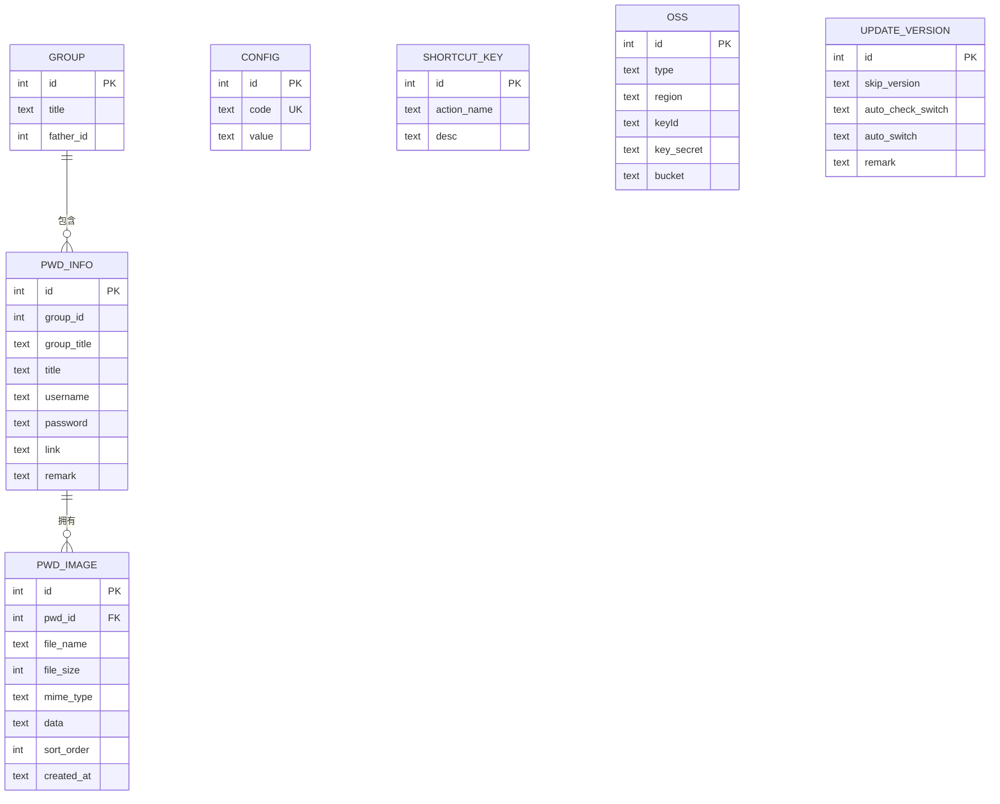
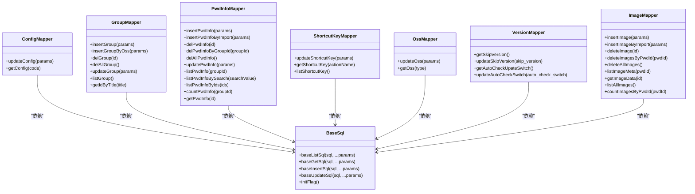
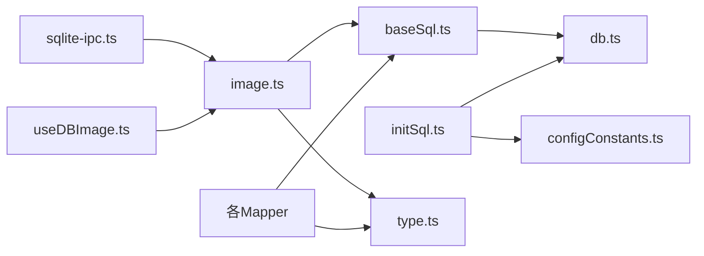

# 数据库层架构

<cite>
**本文引用的文件**
- [electron/db/sqlite/components/baseSql.ts](file://electron/db/sqlite/components/baseSql.ts)
- [electron/db/sqlite/components/initSql.ts](file://electron/db/sqlite/components/initSql.ts)
- [electron/db/sqlite/components/db.ts](file://electron/db/sqlite/components/db.ts)
- [electron/db/sqlite/components/configConstants.ts](file://electron/db/sqlite/components/configConstants.ts)
- [electron/db/sqlite/mapper/config.ts](file://electron/db/sqlite/mapper/config.ts)
- [electron/db/sqlite/mapper/group.ts](file://electron/db/sqlite/mapper/group.ts)
- [electron/db/sqlite/mapper/pwdInfo.ts](file://electron/db/sqlite/mapper/pwdInfo.ts)
- [electron/db/sqlite/mapper/version.ts](file://electron/db/sqlite/mapper/version.ts)
- [electron/db/sqlite/mapper/oss.ts](file://electron/db/sqlite/mapper/oss.ts)
- [electron/db/sqlite/mapper/shortcutKey.ts](file://electron/db/sqlite/mapper/shortcutKey.ts)
- [electron/db/sqlite/mapper/image.ts](file://electron/db/sqlite/mapper/image.ts)
- [src/components/type.ts](file://src/components/type.ts)
- [electron/main.ts](file://electron/main.ts)
- [electron/db/sqlite/sqlite-ipc.ts](file://electron/db/sqlite/sqlite-ipc.ts)
- [electron/constant.ts](file://electron/constant.ts)
- [src/hooks/useDBImage.ts](file://src/hooks/useDBImage.ts)
</cite>

## 更新摘要
**变更内容**
- 新增图像数据库映射器模块，支持图片附件功能
- 添加 `pwd_image` 表结构设计与索引优化
- 扩展IPC通信常量与处理逻辑
- 新增图像相关类型定义与前端Hook集成

## 目录
1. [简介](#简介)
2. [项目结构](#项目结构)
3. [核心组件](#核心组件)
4. [架构总览](#架构总览)
5. [详细组件分析](#详细组件分析)
6. [依赖分析](#依赖分析)
7. [性能考虑](#性能考虑)
8. [故障排查指南](#故障排查指南)
9. [结论](#结论)
10. [附录](#附录)

## 简介
本文件面向密码管理器的数据库层，系统性阐述基于 Electron 的嵌入式 SQLite 架构与实现。内容覆盖：
- 嵌入式数据库的路径与生命周期管理
- 初始化 SQL 脚本与表结构设计
- BaseSql 基类的设计理念与通用 SQL 操作封装
- Mapper 层的数据访问对象模式与 CRUD 封装
- 数据库连接、事务、并发控制要点
- 数据迁移与版本升级策略
- 性能优化建议与常见问题排查
- **新增**：图像附件数据库层架构与实现

## 项目结构
数据库层位于 Electron 渲染进程侧，采用"组件层 + Mapper 层"的分层设计：
- 组件层：负责底层数据库连接、基础 SQL 操作与初始化脚本
- Mapper 层：面向业务实体的数据访问对象，封装 CRUD 与查询逻辑
- 类型定义：统一前后端交互的数据模型

**图表来源**
- [electron/main.ts:23](file://electron/main.ts#L23)
- [electron/db/sqlite/components/db.ts:16](file://electron/db/sqlite/components/db.ts#L16)
- [electron/db/sqlite/components/baseSql.ts:1](file://electron/db/sqlite/components/baseSql.ts#L1)
- [electron/db/sqlite/components/initSql.ts:26](file://electron/db/sqlite/components/initSql.ts#L26)
- [electron/db/sqlite/components/configConstants.ts:1](file://electron/db/sqlite/components/configConstants.ts#L1)
- [electron/db/sqlite/mapper/config.ts:1](file://electron/db/sqlite/mapper/config.ts#L1)
- [electron/db/sqlite/mapper/group.ts:1](file://electron/db/sqlite/mapper/group.ts#L1)
- [electron/db/sqlite/mapper/pwdInfo.ts:1](file://electron/db/sqlite/mapper/pwdInfo.ts#L1)
- [electron/db/sqlite/mapper/shortcutKey.ts:1](file://electron/db/sqlite/mapper/shortcutKey.ts#L1)
- [electron/db/sqlite/mapper/oss.ts:1](file://electron/db/sqlite/mapper/oss.ts#L1)
- [electron/db/sqlite/mapper/version.ts:1](file://electron/db/sqlite/mapper/version.ts#L1)
- [electron/db/sqlite/mapper/image.ts:1](file://electron/db/sqlite/mapper/image.ts#L1)
- [src/components/type.ts:1](file://src/components/type.ts#L1)

**章节来源**
- [electron/main.ts:23](file://electron/main.ts#L23)
- [electron/db/sqlite/components/db.ts:16](file://electron/db/sqlite/components/db.ts#L16)
- [electron/db/sqlite/components/initSql.ts:26](file://electron/db/sqlite/components/initSql.ts#L26)
- [electron/db/sqlite/components/baseSql.ts:1](file://electron/db/sqlite/components/baseSql.ts#L1)
- [electron/db/sqlite/components/configConstants.ts:1](file://electron/db/sqlite/components/configConstants.ts#L1)
- [electron/db/sqlite/mapper/config.ts:1](file://electron/db/sqlite/mapper/config.ts#L1)
- [electron/db/sqlite/mapper/group.ts:1](file://electron/db/sqlite/mapper/group.ts#L1)
- [electron/db/sqlite/mapper/pwdInfo.ts:1](file://electron/db/sqlite/mapper/pwdInfo.ts#L1)
- [electron/db/sqlite/mapper/shortcutKey.ts:1](file://electron/db/sqlite/mapper/shortcutKey.ts#L1)
- [electron/db/sqlite/mapper/oss.ts:1](file://electron/db/sqlite/mapper/oss.ts#L1)
- [electron/db/sqlite/mapper/version.ts:1](file://electron/db/sqlite/mapper/version.ts#L1)
- [electron/db/sqlite/mapper/image.ts:1](file://electron/db/sqlite/mapper/image.ts#L1)
- [src/components/type.ts:1](file://src/components/type.ts#L1)

## 核心组件
- 数据库连接工厂：集中管理数据库实例的创建与关闭，确保单例与路径一致性
- 初始化脚本：按需创建表结构、默认数据与版本表，并提供初始化标志判断
- 基础 SQL 操作：统一封装查询、获取单条、插入、更新等常用操作，提供错误兜底
- 配置常量：集中管理配置项键名与默认值
- Mapper 层：面向实体的 DAO，封装具体业务的 CRUD 与复杂查询
- **新增**：图像映射器：专门处理图片附件的存储、检索与管理

**章节来源**
- [electron/db/sqlite/components/db.ts:16](file://electron/db/sqlite/components/db.ts#L16)
- [electron/db/sqlite/components/initSql.ts:26](file://electron/db/sqlite/components/initSql.ts#L26)
- [electron/db/sqlite/components/baseSql.ts:9](file://electron/db/sqlite/components/baseSql.ts#L9)
- [electron/db/sqlite/components/configConstants.ts:1](file://electron/db/sqlite/components/configConstants.ts#L1)
- [electron/db/sqlite/mapper/config.ts:1](file://electron/db/sqlite/mapper/config.ts#L1)
- [electron/db/sqlite/mapper/image.ts:1](file://electron/db/sqlite/mapper/image.ts#L1)

## 架构总览
数据库层采用"懒加载 + 单例"连接模型，初始化阶段一次性完成表结构与默认数据创建；业务层通过 Mapper 层调用基础 SQL 方法，实现清晰的职责分离。**新增的图像附件功能通过专门的映射器实现，支持图片的加密存储、元数据管理与按需检索。**

**图表来源**
- [electron/main.ts:53](file://electron/main.ts#L53)
- [electron/db/sqlite/components/initSql.ts:26](file://electron/db/sqlite/components/initSql.ts#L26)
- [electron/db/sqlite/components/db.ts:16](file://electron/db/sqlite/components/db.ts#L16)
- [electron/db/sqlite/components/baseSql.ts:12](file://electron/db/sqlite/components/baseSql.ts#L12)
- [electron/db/sqlite/mapper/image.ts:6](file://electron/db/sqlite/mapper/image.ts#L6)

## 详细组件分析

### 组件一：数据库连接与生命周期（db.ts）
- 职责：提供数据库实例的创建、缓存与关闭
- 关键点：
  - 使用 Electron 用户数据目录生成数据库文件路径
  - 单例模式：首次创建后复用实例
  - 可选开启 SQL 日志输出，便于调试
- 并发与事务：
  - better-sqlite3 支持多线程读取，但不支持并发写入
  - 事务应由上层业务控制，避免跨线程共享同一连接句柄

**章节来源**
- [electron/db/sqlite/components/db.ts:16](file://electron/db/sqlite/components/db.ts#L16)
- [electron/db/sqlite/components/db.ts:25](file://electron/db/sqlite/components/db.ts#L25)

### 组件二：基础 SQL 操作（baseSql.ts）
- 设计理念：统一异常捕获、参数化执行、返回标准化结果
- 方法族：
  - 查询列表：baseListSql
  - 获取单条：baseGetSql
  - 插入：baseInsertSql（返回 lastInsertRowid）
  - 更新/删除：baseUpdateSql（返回 1/0 表示成功与否）
  - 初始化检测：initFlag（检查 config 表是否存在）
- 错误处理：捕获异常并返回空/0，避免上层崩溃

**图表来源**
- [electron/db/sqlite/components/baseSql.ts:9](file://electron/db/sqlite/components/baseSql.ts#L9)
- [electron/db/sqlite/components/baseSql.ts:21](file://electron/db/sqlite/components/baseSql.ts#L21)
- [electron/db/sqlite/components/baseSql.ts:35](file://electron/db/sqlite/components/baseSql.ts#L35)
- [electron/db/sqlite/components/baseSql.ts:67](file://electron/db/sqlite/components/baseSql.ts#L67)
- [electron/db/sqlite/components/baseSql.ts:83](file://electron/db/sqlite/components/baseSql.ts#L83)

**章节来源**
- [electron/db/sqlite/components/baseSql.ts:9](file://electron/db/sqlite/components/baseSql.ts#L9)
- [electron/db/sqlite/components/baseSql.ts:21](file://electron/db/sqlite/components/baseSql.ts#L21)
- [electron/db/sqlite/components/baseSql.ts:35](file://electron/db/sqlite/components/baseSql.ts#L35)
- [electron/db/sqlite/components/baseSql.ts:67](file://electron/db/sqlite/components/baseSql.ts#L67)
- [electron/db/sqlite/components/baseSql.ts:83](file://electron/db/sqlite/components/baseSql.ts#L83)

### 组件三：初始化脚本与表结构（initSql.ts）
- 初始化流程：
  - 检查初始化标志（是否存在 config 表）
  - 若未初始化：创建以下表并插入默认数据
    - 分组表：group
    - 密码信息表：pwd_info
    - 配置表：config（唯一约束 code）
    - 快捷键表：shortcut_key
    - 对象存储表：oss
    - **新增**：图像表：pwd_image（包含索引 idx_pwd_image_pwd_id）
    - 更新版本表：update_version
  - 默认数据：
    - 配置表：若干键值对
    - 快捷键表：预设动作与快捷键描述
    - 分组表：默认分组
    - 密码信息表：默认演示记录
    - OSS 表：阿里云与腾讯云两条空记录
    - 更新版本表：初始版本与开关字段
- 版本表设计：update_version 用于后续数据迁移与版本升级
- **新增**：图像表结构：
  - 主键：id（自增）
  - 外键：pwd_id（关联密码信息）
  - 元数据：file_name、file_size、mime_type
  - 加密数据：data（存储加密后的Base64）
  - 排序：sort_order
  - 时间戳：created_at

**图表来源**
- [electron/db/sqlite/components/initSql.ts:51](file://electron/db/sqlite/components/initSql.ts#L51)
- [electron/db/sqlite/components/initSql.ts:60](file://electron/db/sqlite/components/initSql.ts#L60)
- [electron/db/sqlite/components/initSql.ts:74](file://electron/db/sqlite/components/initSql.ts#L74)
- [electron/db/sqlite/components/initSql.ts:83](file://electron/db/sqlite/components/initSql.ts#L83)
- [electron/db/sqlite/components/initSql.ts:91](file://electron/db/sqlite/components/initSql.ts#L91)
- [electron/db/sqlite/components/initSql.ts:107](file://electron/db/sqlite/components/initSql.ts#L107)
- [electron/db/sqlite/components/initSql.ts:118](file://electron/db/sqlite/components/initSql.ts#L118)
- [electron/db/sqlite/components/initSql.ts:151](file://electron/db/sqlite/components/initSql.ts#L151)
- [electron/db/sqlite/components/initSql.ts:172](file://electron/db/sqlite/components/initSql.ts#L172)

**章节来源**
- [electron/db/sqlite/components/initSql.ts:26](file://electron/db/sqlite/components/initSql.ts#L26)
- [electron/db/sqlite/components/initSql.ts:48](file://electron/db/sqlite/components/initSql.ts#L48)
- [electron/db/sqlite/components/initSql.ts:107](file://electron/db/sqlite/components/initSql.ts#L107)
- [electron/db/sqlite/components/initSql.ts:131](file://electron/db/sqlite/components/initSql.ts#L131)
- [electron/db/sqlite/components/initSql.ts:144](file://electron/db/sqlite/components/initSql.ts#L144)
- [electron/db/sqlite/components/initSql.ts:164](file://electron/db/sqlite/components/initSql.ts#L164)
- [electron/db/sqlite/components/initSql.ts:185](file://electron/db/sqlite/components/initSql.ts#L185)
- [electron/db/sqlite/components/initSql.ts:209](file://electron/db/sqlite/components/initSql.ts#L209)
- [electron/db/sqlite/components/initSql.ts:217](file://electron/db/sqlite/components/initSql.ts#L217)

### 组件四：配置常量（configConstants.ts）
- 职责：集中定义配置键名与默认值，供初始化脚本与业务模块使用
- 包含：自启动、默认密码、首次登录标记、深色主题、自动锁屏时间、本地版本号、同步开关等

**章节来源**
- [electron/db/sqlite/components/configConstants.ts:1](file://electron/db/sqlite/components/configConstants.ts#L1)

### 组件五：Mapper 层（以典型实体为例）
- 设计模式：每个实体一个 Mapper 文件，封装该实体的 CRUD 与查询
- 典型实体与方法：
  - 配置（config.ts）：更新配置、按 code 获取配置
  - 分组（group.ts）：插入、删除、更新、列表、按标题查询 ID
  - 密码信息（pwdInfo.ts）：插入、导入插入、删除、更新、列表、按条件搜索、按 ID 列表查询、统计、按 ID 获取
  - 快捷键（shortcutKey.ts）：更新快捷键、按动作名获取、列出全部
  - OSS（oss.ts）：按类型更新、按类型获取
  - 版本（version.ts）：获取跳过版本、更新跳过版本、获取自动检查开关、更新自动检查开关
  - **新增**：图像（image.ts）：插入、导入插入、删除、按密码ID删除、删除全部、列表元数据、获取数据、列表全部、按密码ID统计
- 参数化与安全：所有 SQL 均使用参数占位符，防止注入
- 边界处理：如按 ID 列表查询前进行有效性过滤

**图表来源**
- [electron/db/sqlite/components/baseSql.ts:9](file://electron/db/sqlite/components/baseSql.ts#L9)
- [electron/db/sqlite/mapper/config.ts:8](file://electron/db/sqlite/mapper/config.ts#L8)
- [electron/db/sqlite/mapper/group.ts:7](file://electron/db/sqlite/mapper/group.ts#L7)
- [electron/db/sqlite/mapper/pwdInfo.ts:6](file://electron/db/sqlite/mapper/pwdInfo.ts#L6)
- [electron/db/sqlite/mapper/shortcutKey.ts:8](file://electron/db/sqlite/mapper/shortcutKey.ts#L8)
- [electron/db/sqlite/mapper/oss.ts:8](file://electron/db/sqlite/mapper/oss.ts#L8)
- [electron/db/sqlite/mapper/version.ts:9](file://electron/db/sqlite/mapper/version.ts#L9)
- [electron/db/sqlite/mapper/image.ts:6](file://electron/db/sqlite/mapper/image.ts#L6)

**章节来源**
- [electron/db/sqlite/mapper/config.ts:1](file://electron/db/sqlite/mapper/config.ts#L1)
- [electron/db/sqlite/mapper/group.ts:1](file://electron/db/sqlite/mapper/group.ts#L1)
- [electron/db/sqlite/mapper/pwdInfo.ts:1](file://electron/db/sqlite/mapper/pwdInfo.ts#L1)
- [electron/db/sqlite/mapper/shortcutKey.ts:1](file://electron/db/sqlite/mapper/shortcutKey.ts#L1)
- [electron/db/sqlite/mapper/oss.ts:1](file://electron/db/sqlite/mapper/oss.ts#L1)
- [electron/db/sqlite/mapper/version.ts:1](file://electron/db/sqlite/mapper/version.ts#L1)
- [electron/db/sqlite/mapper/image.ts:1](file://electron/db/sqlite/mapper/image.ts#L1)

### 组件六：图像映射器（新增）
- 设计理念：专门处理图片附件的存储、检索与管理，支持加密存储与按需加载
- 功能特性：
  - 图片插入：支持普通插入与导入插入两种模式
  - 图片删除：支持单张删除、按密码ID批量删除、全部删除
  - 图片查询：支持元数据列表、完整数据获取、全部列表、按密码ID统计
  - 加密存储：图片数据以加密形式存储，确保安全性
  - 排序管理：支持图片排序与时间戳记录
- 核心方法：
  - `insertImage()`：插入新图片（pwd_id, file_name, file_size, mime_type, data, sort_order）
  - `insertImageByImport()`：导入模式插入（支持指定ID）
  - `deleteImage()`：删除单张图片
  - `deleteImagesByPwdId()`：按密码ID删除所有相关图片
  - `deleteAllImages()`：删除所有图片
  - `listImageMeta()`：获取图片元数据列表（不含加密数据）
  - `getImageData()`：获取图片加密数据
  - `listAllImages()`：获取所有图片（用于OSS同步）
  - `countImagesByPwdId()`：统计某密码下的图片数量

**章节来源**
- [electron/db/sqlite/mapper/image.ts:1](file://electron/db/sqlite/mapper/image.ts#L1)
- [electron/db/sqlite/mapper/image.ts:6](file://electron/db/sqlite/mapper/image.ts#L6)
- [electron/db/sqlite/mapper/image.ts:12](file://electron/db/sqlite/mapper/image.ts#L12)
- [electron/db/sqlite/mapper/image.ts:18](file://electron/db/sqlite/mapper/image.ts#L18)
- [electron/db/sqlite/mapper/image.ts:25](file://electron/db/sqlite/mapper/image.ts#L25)
- [electron/db/sqlite/mapper/image.ts:32](file://electron/db/sqlite/mapper/image.ts#L32)
- [electron/db/sqlite/mapper/image.ts:38](file://electron/db/sqlite/mapper/image.ts#L38)
- [electron/db/sqlite/mapper/image.ts:47](file://electron/db/sqlite/mapper/image.ts#L47)
- [electron/db/sqlite/mapper/image.ts:54](file://electron/db/sqlite/mapper/image.ts#L54)
- [electron/db/sqlite/mapper/image.ts:61](file://electron/db/sqlite/mapper/image.ts#L61)

### 组件七：类型定义（type.ts）
- 作用：统一前后端交互的数据模型，保证 Mapper 返回值与前端消费一致
- 涉及实体：OssForm、ShortCutKeyComb、Config、UpdateVersion、PwdInfo、PwdCache、PwdGroup、**新增**：PwdImage、PwdImageMeta
- **新增**：图像相关类型
  - `PwdImage`：数据库存储格式，包含完整元数据与加密数据
  - `PwdImageMeta`：列表展示用，不含敏感数据

**章节来源**
- [src/components/type.ts:9](file://src/components/type.ts#L9)
- [src/components/type.ts:19](file://src/components/type.ts#L19)
- [src/components/type.ts:31](file://src/components/type.ts#L31)
- [src/components/type.ts:39](file://src/components/type.ts#L39)
- [src/components/type.ts:51](file://src/components/type.ts#L51)
- [src/components/type.ts:68](file://src/components/type.ts#L68)
- [src/components/type.ts:76](file://src/components/type.ts#L76)
- [src/components/type.ts:93](file://src/components/type.ts#L93)
- [src/components/type.ts:105](file://src/components/type.ts#L105)

### 组件八：IPC通信与前端集成（新增）
- IPC常量：新增图像相关IPC通道常量
- IPC处理：在SQLiteIPC中注册图像相关处理函数
- 前端Hook：useDBImage.ts提供图像操作的前端封装
- 加密处理：前端Hook中集成加密/解密逻辑，确保图片数据安全

**章节来源**
- [electron/constant.ts:43](file://electron/constant.ts#L43)
- [electron/constant.ts:52](file://electron/constant.ts#L52)
- [electron/db/sqlite/sqlite-ipc.ts:60](file://electron/db/sqlite/sqlite-ipc.ts#L60)
- [electron/db/sqlite/sqlite-ipc.ts:246](file://electron/db/sqlite/sqlite-ipc.ts#L246)
- [src/hooks/useDBImage.ts:1](file://src/hooks/useDBImage.ts#L1)
- [src/hooks/useDBImage.ts:16](file://src/hooks/useDBImage.ts#L16)

## 依赖分析
- 组件耦合：
  - Mapper 层仅依赖基础 SQL 方法，低耦合、高内聚
  - 初始化脚本依赖连接工厂与配置常量，负责一次性构建
  - **新增**：图像映射器依赖基础SQL方法，与其它Mapper保持一致的架构模式
- 外部依赖：
  - better-sqlite3 提供高性能嵌入式数据库能力
  - Electron app.getPath('userData') 提供跨平台用户数据目录
  - **新增**：前端加密库用于图片数据的安全存储

**图表来源**
- [electron/db/sqlite/components/initSql.ts:2](file://electron/db/sqlite/components/initSql.ts#L2)
- [electron/db/sqlite/components/db.ts:1](file://electron/db/sqlite/components/db.ts#L1)
- [electron/db/sqlite/components/configConstants.ts:1](file://electron/db/sqlite/components/configConstants.ts#L1)
- [electron/db/sqlite/components/baseSql.ts:1](file://electron/db/sqlite/components/baseSql.ts#L1)
- [src/components/type.ts:1](file://src/components/type.ts#L1)
- [electron/db/sqlite/mapper/image.ts:4](file://electron/db/sqlite/mapper/image.ts#L4)
- [src/hooks/useDBImage.ts:1](file://src/hooks/useDBImage.ts#L1)
- [electron/db/sqlite/sqlite-ipc.ts:60](file://electron/db/sqlite/sqlite-ipc.ts#L60)

**章节来源**
- [electron/db/sqlite/components/initSql.ts:2](file://electron/db/sqlite/components/initSql.ts#L2)
- [electron/db/sqlite/components/db.ts:1](file://electron/db/sqlite/components/db.ts#L1)
- [electron/db/sqlite/components/configConstants.ts:1](file://electron/db/sqlite/components/configConstants.ts#L1)
- [electron/db/sqlite/components/baseSql.ts:1](file://electron/db/sqlite/components/baseSql.ts#L1)
- [src/components/type.ts:1](file://src/components/type.ts#L1)
- [electron/db/sqlite/mapper/image.ts:4](file://electron/db/sqlite/mapper/image.ts#L4)
- [src/hooks/useDBImage.ts:1](file://src/hooks/useDBImage.ts#L1)
- [electron/db/sqlite/sqlite-ipc.ts:60](file://electron/db/sqlite/sqlite-ipc.ts#L60)

## 性能考虑
- 连接与并发：
  - 单例连接避免频繁打开/关闭带来的开销
  - 不建议跨线程共享连接句柄；如需并发，考虑拆分读写或使用队列串行化
- SQL 执行：
  - 使用参数化语句减少解析与注入风险
  - 大批量插入建议使用事务包裹（可在业务层调用 better-sqlite3 的事务 API）
  - **新增**：图像表已创建索引 idx_pwd_image_pwd_id，提升按密码ID查询性能
- 索引设计：
  - 当前表未显式创建额外索引；对于高频查询字段（如 group_id、title、username），可考虑增加索引以提升查询性能
  - **新增**：图像表已创建 pwd_id 索引，优化图片查询性能
- 缓存策略：
  - 对热点数据（如配置、快捷键）可在内存中缓存，减少重复查询
  - **新增**：图像数据采用按需加载策略，元数据列表不含敏感数据，减少网络传输

## 故障排查指南
- 初始化失败：
  - 检查数据库路径与权限；确认首次初始化标志正确判断
  - 关注初始化脚本中的表创建与默认数据插入日志
  - **新增**：检查图像表创建是否成功，确认索引创建
- 查询/更新异常：
  - 查看基础 SQL 方法的日志输出，定位 SQL 语法或参数问题
  - 确认传入参数数量与顺序与 SQL 占位符匹配
- 数据不一致：
  - 对于批量操作，优先使用事务；避免部分成功导致的状态不一致
- 连接泄漏：
  - 应用退出时调用关闭接口，确保连接释放
- **新增**：图像相关问题排查：
  - 检查图片加密/解密流程是否正常
  - 验证IPC通信是否正确传递图像数据
  - 确认图像索引是否有效，避免查询超时

**章节来源**
- [electron/db/sqlite/components/initSql.ts:26](file://electron/db/sqlite/components/initSql.ts#L26)
- [electron/db/sqlite/components/baseSql.ts:12](file://electron/db/sqlite/components/baseSql.ts#L12)
- [electron/db/sqlite/components/db.ts:25](file://electron/db/sqlite/components/db.ts#L25)
- [electron/db/sqlite/mapper/image.ts:6](file://electron/db/sqlite/mapper/image.ts#L6)

## 结论
本数据库层以"轻量、清晰、可扩展"为目标：通过连接工厂与基础 SQL 封装，统一了数据访问入口；初始化脚本一次性完成表结构与默认数据；Mapper 层按实体解耦，职责明确。**新增的图像附件功能通过专门的映射器实现，支持图片的加密存储、元数据管理与按需检索，扩展了密码管理器的功能边界。** 配合合理的索引与事务策略，可在保证性能的同时满足密码管理器的核心需求。

## 附录
- 初始化入口：主进程在启动时调用初始化函数，随后注册全局快捷键与 IPC
- 版本升级建议：
  - 新增版本表字段或迁移数据时，先在初始化脚本中判断版本号，再执行迁移逻辑
  - 迁移过程使用事务包裹，失败回滚
- 索引建议：
  - group_id、title、username 等高频查询字段可考虑建立索引
  - **新增**：图像表的 pwd_id 索引已创建，可进一步考虑按文件名、创建时间等字段建立索引
- 安全建议：
  - 密码字段已加密存储；传输与落库均使用参数化 SQL
  - **新增**：图像数据采用加密存储，前端Hook中集成加密/解密逻辑
  - 避免在日志中输出敏感字段
- **新增**：图像功能使用说明：
  - 图片数据以加密形式存储，确保安全性
  - 支持按需加载，减少内存占用
  - 提供完整的图片管理API，包括插入、删除、查询、统计等功能

**章节来源**
- [electron/main.ts:53](file://electron/main.ts#L53)
- [electron/db/sqlite/components/initSql.ts:107](file://electron/db/sqlite/components/initSql.ts#L107)
- [electron/db/sqlite/mapper/image.ts:6](file://electron/db/sqlite/mapper/image.ts#L6)
- [electron/db/sqlite/mapper/image.ts:38](file://electron/db/sqlite/mapper/image.ts#L38)
- [electron/db/sqlite/mapper/image.ts:54](file://electron/db/sqlite/mapper/image.ts#L54)