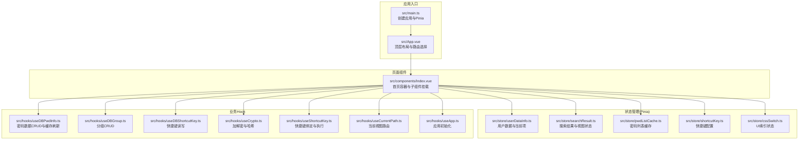
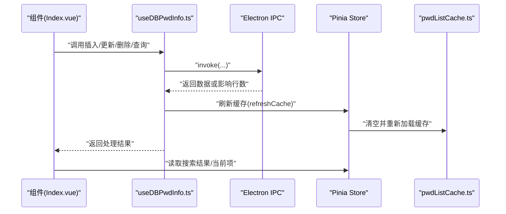
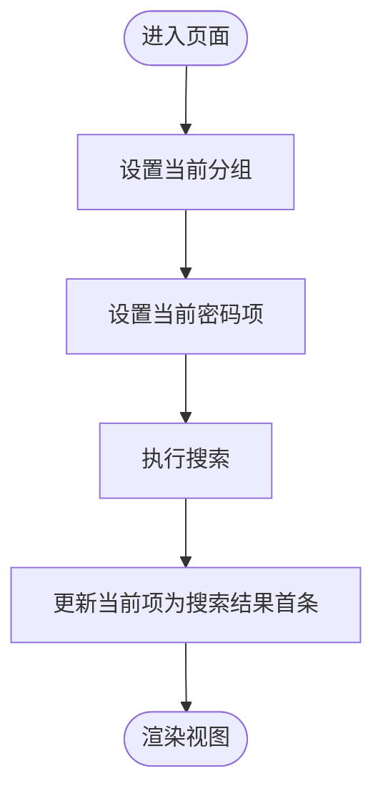
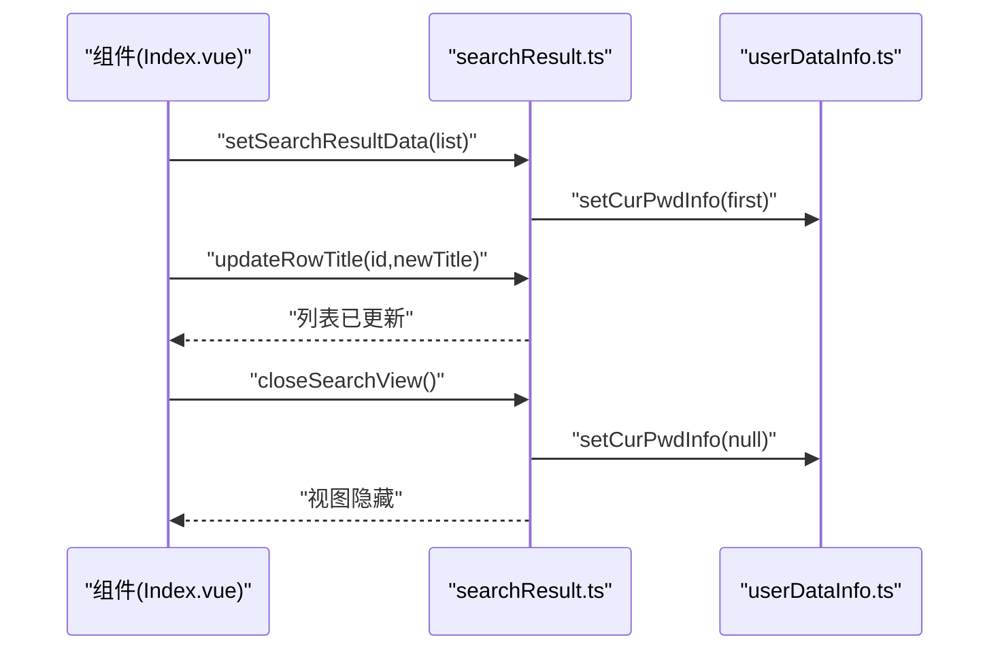
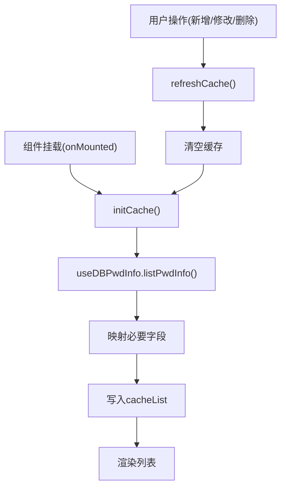
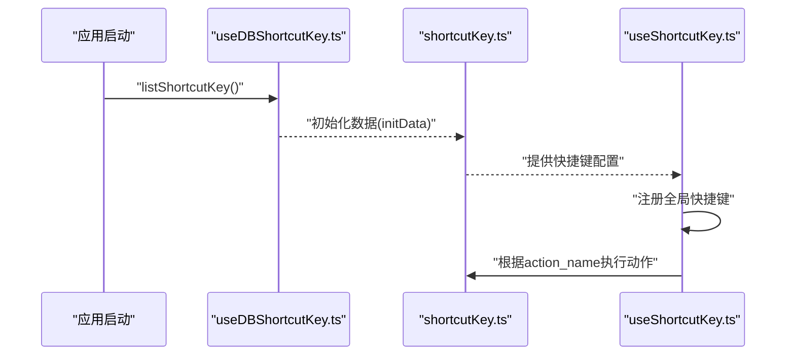
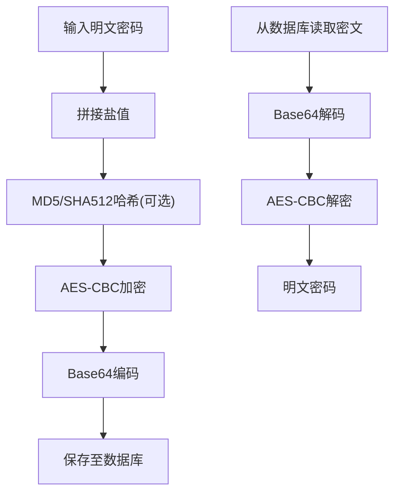
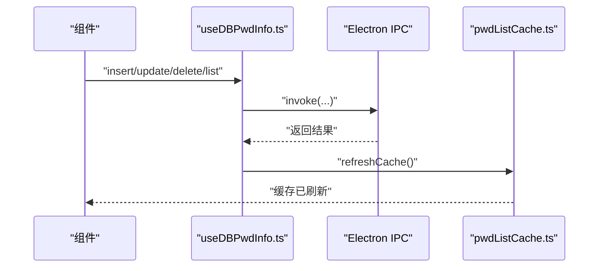
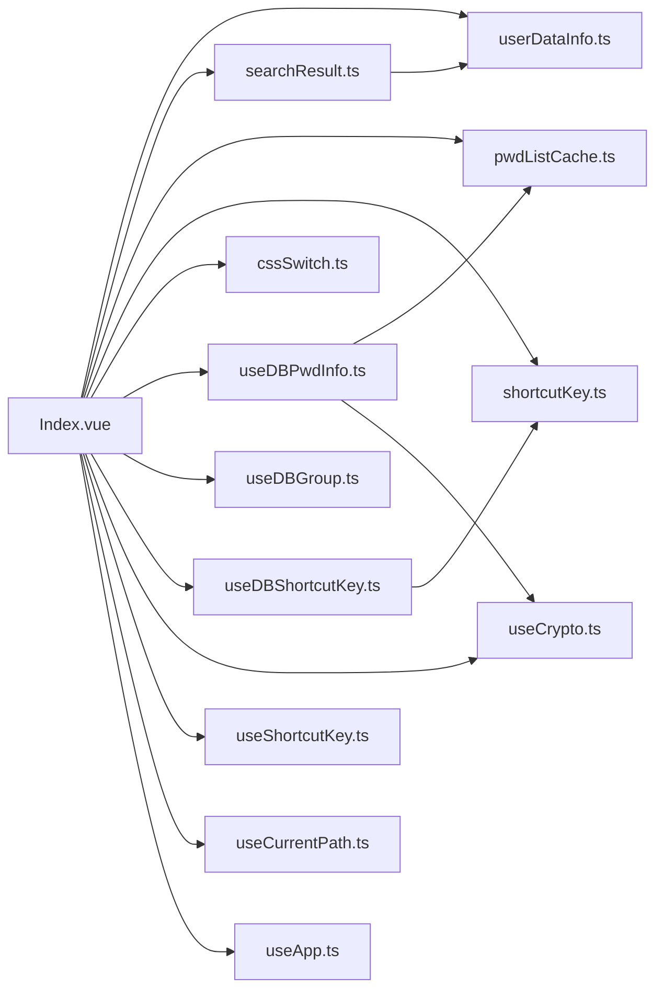

# 数据流与状态管理

<cite>
**本文引用的文件**
- [src/main.ts](file://src/main.ts)
- [src/App.vue](file://src/App.vue)
- [src/components/Index.vue](file://src/components/Index.vue)
- [src/store/userDataInfo.ts](file://src/store/userDataInfo.ts)
- [src/store/pwdListCache.ts](file://src/store/pwdListCache.ts)
- [src/store/shortcutKey.ts](file://src/store/shortcutKey.ts)
- [src/store/searchResult.ts](file://src/store/searchResult.ts)
- [src/store/cssSwitch.ts](file://src/store/cssSwitch.ts)
- [src/hooks/useDBPwdInfo.ts](file://src/hooks/useDBPwdInfo.ts)
- [src/hooks/useDBGroup.ts](file://src/hooks/useDBGroup.ts)
- [src/hooks/useDBShortcutKey.ts](file://src/hooks/useDBShortcutKey.ts)
- [src/hooks/useCrypto.ts](file://src/hooks/useCrypto.ts)
- [src/hooks/useShortcutKey.ts](file://src/hooks/useShortcutKey.ts)
- [src/hooks/useCurrentPath.ts](file://src/hooks/useCurrentPath.ts)
- [src/hooks/useApp.ts](file://src/hooks/useApp.ts)
- [src/config/config.ts](file://src/config/config.ts)
- [src/components/type.ts](file://src/components/type.ts)
- [src/utils/emitter.ts](file://src/utils/emitter.ts)
</cite>

## 目录
1. [引言](#引言)
2. [项目结构](#项目结构)
3. [核心组件](#核心组件)
4. [架构总览](#架构总览)
5. [详细组件分析](#详细组件分析)
6. [依赖关系分析](#依赖关系分析)
7. [性能考量](#性能考量)
8. [故障排查指南](#故障排查指南)
9. [结论](#结论)
10. [附录](#附录)

## 引言
本文件聚焦于密码管理器在前端侧的数据流与状态管理架构，系统性阐述数据如何在组件、Hook、Pinia Store 之间流动，状态如何变更与共享，以及加密、缓存、快捷键等关键状态的管理策略。文档同时总结最佳实践、性能优化与调试方法，并给出可直接定位到源码的路径，便于开发者快速理解与落地。

## 项目结构
应用采用“组件 + Hook + Pinia Store”的分层组织方式：
- 组件层：负责视图渲染与交互，通过 Hook 与 Store 协作。
- Hook 层：封装业务逻辑与数据访问（IPC 调用），统一处理加密/解密、缓存刷新等。
- Store 层：集中管理用户态、搜索结果、快捷键、列表缓存等跨组件状态。
- 配置与类型：集中定义默认快捷键、主题开关、数据模型等。

图表来源
- [src/main.ts:1-20](file://src/main.ts#L1-L20)
- [src/App.vue:1-19](file://src/App.vue#L1-L19)
- [src/components/Index.vue:1-81](file://src/components/Index.vue#L1-L81)
- [src/store/userDataInfo.ts:1-76](file://src/store/userDataInfo.ts#L1-L76)
- [src/store/searchResult.ts:1-49](file://src/store/searchResult.ts#L1-L49)
- [src/store/pwdListCache.ts:1-37](file://src/store/pwdListCache.ts#L1-L37)
- [src/store/shortcutKey.ts:1-99](file://src/store/shortcutKey.ts#L1-L99)
- [src/store/cssSwitch.ts:1-17](file://src/store/cssSwitch.ts#L1-L17)
- [src/hooks/useDBPwdInfo.ts:1-103](file://src/hooks/useDBPwdInfo.ts#L1-L103)
- [src/hooks/useDBGroup.ts:1-53](file://src/hooks/useDBGroup.ts#L1-L53)
- [src/hooks/useDBShortcutKey.ts:1-17](file://src/hooks/useDBShortcutKey.ts#L1-L17)
- [src/hooks/useCrypto.ts:1-77](file://src/hooks/useCrypto.ts#L1-L77)
- [src/hooks/useShortcutKey.ts](file://src/hooks/useShortcutKey.ts)
- [src/hooks/useCurrentPath.ts](file://src/hooks/useCurrentPath.ts)
- [src/hooks/useApp.ts](file://src/hooks/useApp.ts)

章节来源
- [src/main.ts:1-20](file://src/main.ts#L1-L20)
- [src/App.vue:1-19](file://src/App.vue#L1-L19)
- [src/components/Index.vue:1-81](file://src/components/Index.vue#L1-L81)

## 核心组件
- 用户数据与当前项状态：集中保存登录态、主题、锁屏时间、当前分组与当前密码项等，供多处组件共享。
- 搜索结果状态：维护搜索视图显示标志、结果列表与当前选中项，支持打开/关闭、清空、更新标题等操作。
- 密码列表缓存：在组件挂载时从数据库加载轻量字段，减少渲染与查询压力；变更后主动刷新。
- 快捷键状态：内置默认快捷键组合，支持从数据库加载并动态更新描述与按键序列。
- UI索引状态：记录当前分组与密码列表的选中索引，用于界面焦点与高亮同步。

章节来源
- [src/store/userDataInfo.ts:1-76](file://src/store/userDataInfo.ts#L1-L76)
- [src/store/searchResult.ts:1-49](file://src/store/searchResult.ts#L1-L49)
- [src/store/pwdListCache.ts:1-37](file://src/store/pwdListCache.ts#L1-L37)
- [src/store/shortcutKey.ts:1-99](file://src/store/shortcutKey.ts#L1-L99)
- [src/store/cssSwitch.ts:1-17](file://src/store/cssSwitch.ts#L1-L17)

## 架构总览
应用采用“组件驱动 + Hook 封装 + Pinia 状态”的模式。组件通过 Hook 发起 IPC 请求，完成数据库读写与加解密；Hook 在成功后通知缓存刷新；Pinia Store 负责跨组件状态共享与计算。快捷键通过独立 Store 管理，结合 Hook 进行全局绑定与执行。

图表来源
- [src/components/Index.vue:1-81](file://src/components/Index.vue#L1-L81)
- [src/hooks/useDBPwdInfo.ts:1-103](file://src/hooks/useDBPwdInfo.ts#L1-L103)
- [src/store/pwdListCache.ts:1-37](file://src/store/pwdListCache.ts#L1-L37)

## 详细组件分析

### 用户数据与当前项状态（userDataInfo）
- 设计要点
  - 使用 Pinia defineStore 定义状态与动作，集中管理登录态、主题、锁屏时间、当前分组与当前密码项。
  - 提供 setCurGroup/setCurPwdInfo 等动作，确保对对象属性的更新可响应式生效。
- 数据流
  - 组件通过动作更新当前项，其他组件读取当前项进行展示与编辑。
  - 搜索结果变化时，会联动设置当前密码项，保持视图一致性。
- 状态持久化
  - 当前实现未见持久化逻辑，若需持久化可在 Store 中引入持久化插件或在应用启动时从本地存储恢复。

图表来源
- [src/store/userDataInfo.ts:1-76](file://src/store/userDataInfo.ts#L1-L76)
- [src/store/searchResult.ts:1-49](file://src/store/searchResult.ts#L1-L49)

章节来源
- [src/store/userDataInfo.ts:1-76](file://src/store/userDataInfo.ts#L1-L76)
- [src/store/searchResult.ts:1-49](file://src/store/searchResult.ts#L1-L49)

### 搜索结果状态（searchResult）
- 设计要点
  - 独立的响应式结果列表与视图显示标志，支持打开/关闭搜索视图、清空数据、更新标题等。
  - 关闭视图时清理结果与当前项，避免脏数据残留。
- 数据流
  - 组件调用 setSearchResultData 写入结果，同时通过 userDataInfoStore 设置当前项。
  - updateRowTitle 原地更新标题，保持列表一致性。
- 与用户数据的协作
  - 通过 userDataInfoStore 的 setCurPwdInfo 管理当前选中项，确保搜索结果与详情页联动。

图表来源
- [src/store/searchResult.ts:1-49](file://src/store/searchResult.ts#L1-L49)
- [src/store/userDataInfo.ts:1-76](file://src/store/userDataInfo.ts#L1-L76)

章节来源
- [src/store/searchResult.ts:1-49](file://src/store/searchResult.ts#L1-L49)

### 密码列表缓存（pwdListCache）
- 设计要点
  - 在组件挂载时初始化缓存，仅加载必要字段（id/title/username），降低内存与渲染开销。
  - 通过 Hook 的 CRUD 操作触发 refreshCache，确保缓存与数据库一致。
- 数据流
  - 初始化 -> 查询数据库 -> 过滤字段 -> 写入缓存 -> 渲染列表。
  - 刷新流程：清空缓存 -> 重新加载。
- 性能收益
  - 减少大字段传输与渲染，提升列表滚动与搜索体验。

图表来源
- [src/store/pwdListCache.ts:1-37](file://src/store/pwdListCache.ts#L1-L37)
- [src/hooks/useDBPwdInfo.ts:1-103](file://src/hooks/useDBPwdInfo.ts#L1-L103)

章节来源
- [src/store/pwdListCache.ts:1-37](file://src/store/pwdListCache.ts#L1-L37)
- [src/hooks/useDBPwdInfo.ts:1-103](file://src/hooks/useDBPwdInfo.ts#L1-L103)

### 快捷键状态（shortcutKey）
- 设计要点
  - 内置默认快捷键组合，支持从数据库加载并动态更新描述与按键序列。
  - 提供 initData 与 setShortCutKeyComb 等动作，便于设置与修改。
- 数据流
  - 应用启动时通过 useDBShortcutKey 读取数据库，传入 Store 初始化。
  - 用户在设置页修改后，通过 useDBShortcutKey.updateShortCutKey 写回数据库。
- 与全局绑定的协作
  - useShortcutKey 负责监听与执行快捷键动作，与 Store 的 action_name 对接。

图表来源
- [src/store/shortcutKey.ts:1-99](file://src/store/shortcutKey.ts#L1-L99)
- [src/hooks/useDBShortcutKey.ts:1-17](file://src/hooks/useDBShortcutKey.ts#L1-L17)
- [src/hooks/useShortcutKey.ts](file://src/hooks/useShortcutKey.ts)
- [src/config/config.ts:1-143](file://src/config/config.ts#L1-L143)

章节来源
- [src/store/shortcutKey.ts:1-99](file://src/store/shortcutKey.ts#L1-L99)
- [src/hooks/useDBShortcutKey.ts:1-17](file://src/hooks/useDBShortcutKey.ts#L1-L17)
- [src/config/config.ts:1-143](file://src/config/config.ts#L1-L143)

### UI索引状态（cssSwitch）
- 设计要点
  - 记录当前分组与密码列表的选中索引，便于界面焦点与高亮同步。
- 使用场景
  - 在键盘导航时，根据索引快速定位到目标元素，提升可用性。

章节来源
- [src/store/cssSwitch.ts:1-17](file://src/store/cssSwitch.ts#L1-L17)

### 加密与解密（useCrypto）
- 设计要点
  - 使用 AES-CBC + IV + Base64，结合 MD5/SHA512 哈希与盐值增强安全性。
  - 对密码列表批量解密，确保渲染前数据可读。
- 数据流
  - 写入：对明文密码加密后入库。
  - 读取：从数据库取出密文，批量解密后再交给组件渲染。

图表来源
- [src/hooks/useCrypto.ts:1-77](file://src/hooks/useCrypto.ts#L1-L77)
- [src/config/config.ts:1-143](file://src/config/config.ts#L1-L143)

章节来源
- [src/hooks/useCrypto.ts:1-77](file://src/hooks/useCrypto.ts#L1-L77)
- [src/config/config.ts:1-143](file://src/config/config.ts#L1-L143)

### 数据访问与缓存刷新（useDBPwdInfo）
- 设计要点
  - 所有数据库操作通过 IPC 调用，封装增删改查与统计。
  - 在每次写操作后调用 refreshCache，保证缓存与数据库一致。
- 数据流
  - 组件发起请求 -> IPC -> 数据库 -> 返回结果 -> 刷新缓存 -> 视图更新。

图表来源
- [src/hooks/useDBPwdInfo.ts:1-103](file://src/hooks/useDBPwdInfo.ts#L1-L103)
- [src/store/pwdListCache.ts:1-37](file://src/store/pwdListCache.ts#L1-L37)

章节来源
- [src/hooks/useDBPwdInfo.ts:1-103](file://src/hooks/useDBPwdInfo.ts#L1-L103)
- [src/store/pwdListCache.ts:1-37](file://src/store/pwdListCache.ts#L1-L37)

## 依赖关系分析
- 组件依赖
  - Index.vue 依赖多个 Store 与 Hook，形成“容器组件”角色，协调各子视图。
- Store 间耦合
  - searchResult 依赖 userDataInfo 更新当前项；pwdListCache 依赖 useDBPwdInfo 的刷新回调。
- 外部依赖
  - Electron IPC：所有数据库操作经由 IPC 与主进程通信。
  - mitt：事件总线用于组件间松耦合通信（如分组/搜索结果等）。

图表来源
- [src/components/Index.vue:1-81](file://src/components/Index.vue#L1-L81)
- [src/store/userDataInfo.ts:1-76](file://src/store/userDataInfo.ts#L1-L76)
- [src/store/searchResult.ts:1-49](file://src/store/searchResult.ts#L1-L49)
- [src/store/pwdListCache.ts:1-37](file://src/store/pwdListCache.ts#L1-L37)
- [src/store/shortcutKey.ts:1-99](file://src/store/shortcutKey.ts#L1-L99)
- [src/store/cssSwitch.ts:1-17](file://src/store/cssSwitch.ts#L1-L17)
- [src/hooks/useDBPwdInfo.ts:1-103](file://src/hooks/useDBPwdInfo.ts#L1-L103)
- [src/hooks/useDBGroup.ts:1-53](file://src/hooks/useDBGroup.ts#L1-L53)
- [src/hooks/useDBShortcutKey.ts:1-17](file://src/hooks/useDBShortcutKey.ts#L1-L17)
- [src/hooks/useCrypto.ts:1-77](file://src/hooks/useCrypto.ts#L1-L77)
- [src/hooks/useShortcutKey.ts](file://src/hooks/useShortcutKey.ts)
- [src/hooks/useCurrentPath.ts](file://src/hooks/useCurrentPath.ts)
- [src/hooks/useApp.ts](file://src/hooks/useApp.ts)

章节来源
- [src/components/Index.vue:1-81](file://src/components/Index.vue#L1-L81)
- [src/utils/emitter.ts:1-16](file://src/utils/emitter.ts#L1-L16)

## 性能考量
- 列表缓存
  - 仅缓存必要字段，减少渲染与序列化成本；在写操作后统一刷新，避免分散刷新导致的多次重绘。
- 加密解密
  - 批量解密列表，避免逐条解密的重复开销；对空值与异常输入进行早返回，减少无效计算。
- 响应式更新
  - 使用 Pinia 的响应式与 storeToRefs，避免不必要的深拷贝；对数组使用 splice/assign 等原地更新方法，减少组件重渲染。
- IPC 调用
  - 合并频繁操作（如连续搜索），在 Hook 层做节流/防抖；对大数据量查询使用分页或懒加载。
- 主题与索引
  - UI索引状态仅保存简单数值，避免携带大型对象；主题切换通过 CSS 变量与类名切换，尽量减少重排。

## 故障排查指南
- 搜索结果不正确
  - 检查 setSearchResultData 是否正确调用，确认 userDataInfoStore 的当前项是否被设置为首条。
  - 查看控制台日志与 storeToRefs 的绑定是否生效。
- 列表不刷新
  - 确认 CRUD 操作后 refreshCache 是否被调用；检查 pwdListCache 的初始化与刷新流程。
- 快捷键无效
  - 核对 useDBShortcutKey 的加载与 updateShortCutKey 的写回；确认 useShortcutKey 的注册顺序与 action_name 映射。
- 解密失败或乱码
  - 检查加密/解密参数（key/iv/salt）是否一致；确认数据库中存储的是 Base64 编码的密文。
- 事件通信问题
  - 使用 mitt 的 on/off 检查事件名称与订阅时机；避免重复订阅导致的重复触发。

章节来源
- [src/store/searchResult.ts:1-49](file://src/store/searchResult.ts#L1-L49)
- [src/store/pwdListCache.ts:1-37](file://src/store/pwdListCache.ts#L1-L37)
- [src/hooks/useDBShortcutKey.ts:1-17](file://src/hooks/useDBShortcutKey.ts#L1-L17)
- [src/hooks/useShortcutKey.ts](file://src/hooks/useShortcutKey.ts)
- [src/hooks/useCrypto.ts:1-77](file://src/hooks/useCrypto.ts#L1-L77)
- [src/utils/emitter.ts:1-16](file://src/utils/emitter.ts#L1-L16)

## 结论
本项目通过 Pinia 实现了清晰的状态分层与跨组件共享，配合 Hook 封装业务与 IPC，实现了稳定的数据流与良好的扩展性。密码列表缓存、加解密与快捷键管理体现了对性能与安全的关注。建议后续引入状态持久化与更完善的调试工具链，进一步提升开发效率与用户体验。

## 附录
- 默认快捷键定义参考：[src/config/config.ts:24-34](file://src/config/config.ts#L24-L34)
- 数据模型定义参考：[src/components/type.ts:19-88](file://src/components/type.ts#L19-L88)
- 应用入口与Pinia初始化参考：[src/main.ts:1-20](file://src/main.ts#L1-L20)
- 顶层布局与视图切换参考：[src/App.vue:1-19](file://src/App.vue#L1-L19)
- 首页容器与状态注入参考：[src/components/Index.vue:1-81](file://src/components/Index.vue#L1-L81)