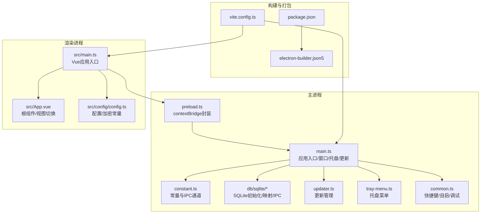
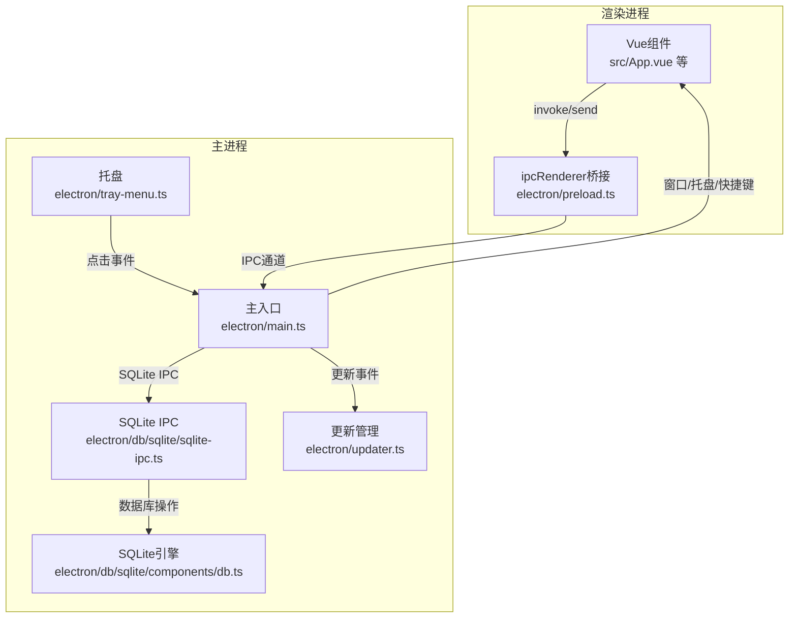
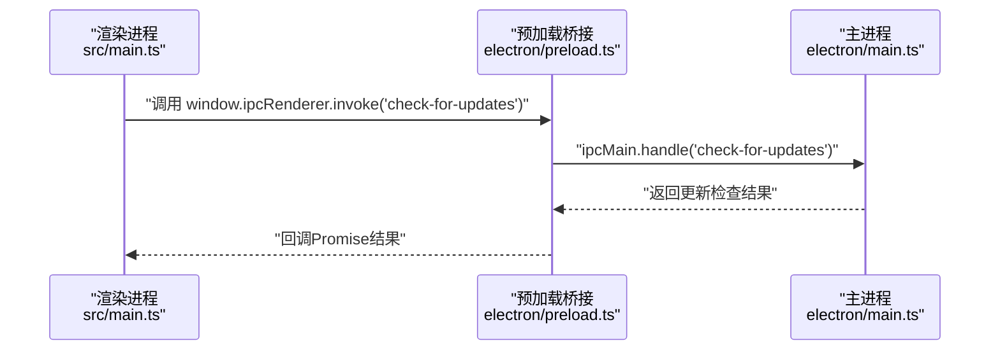
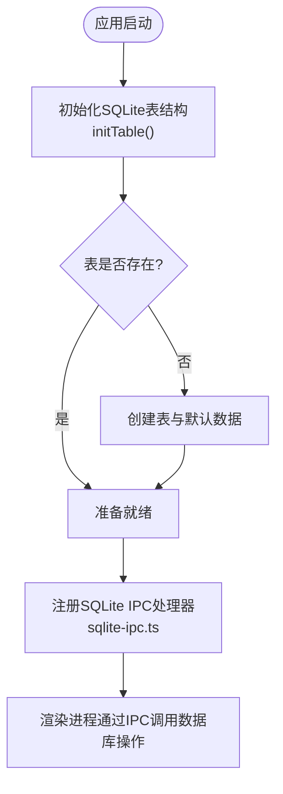
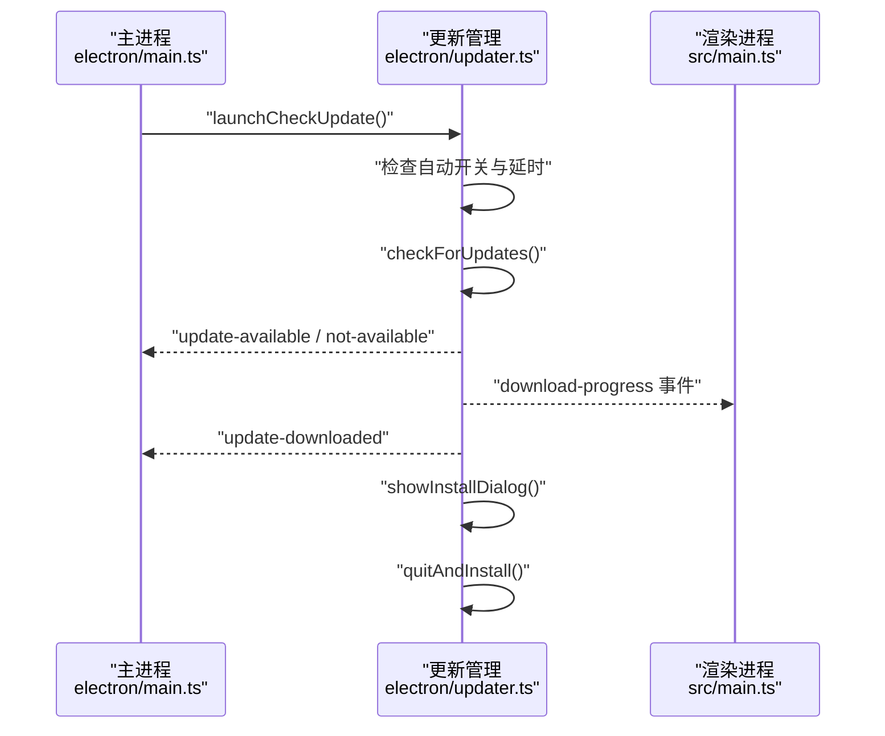
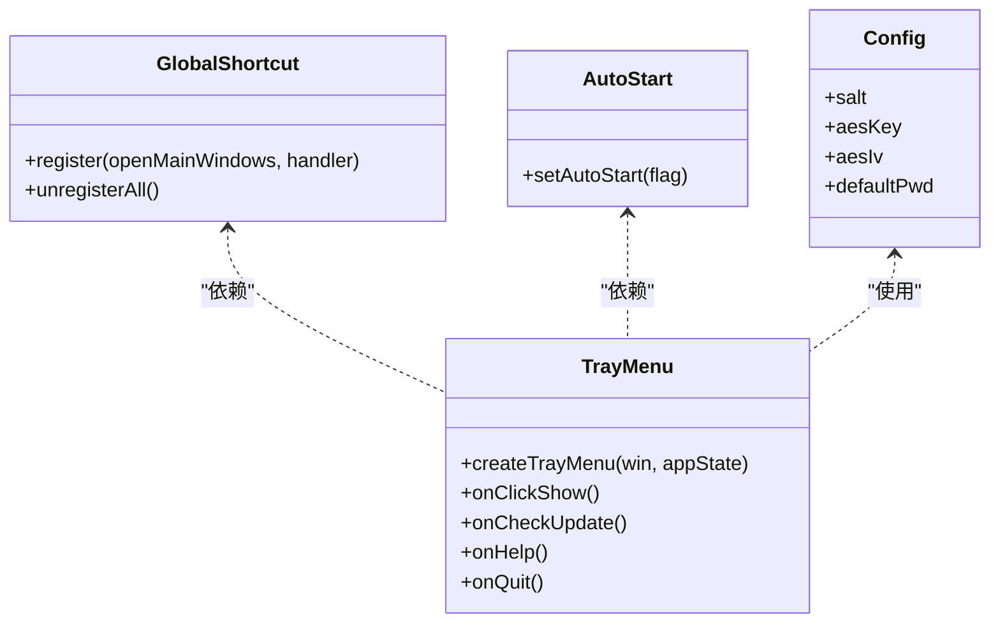
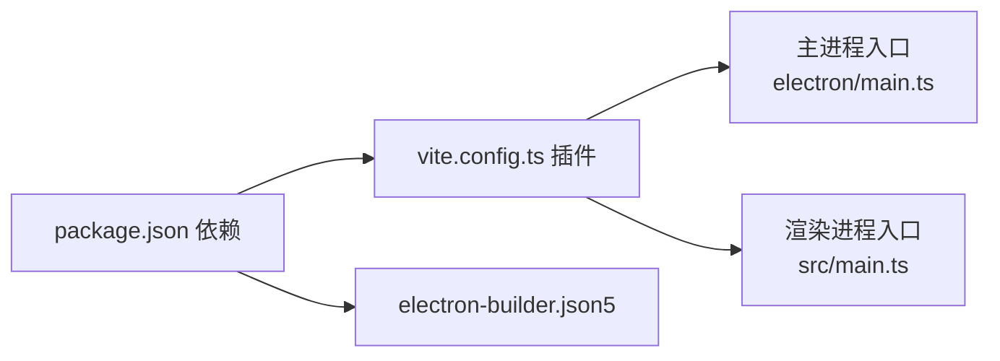
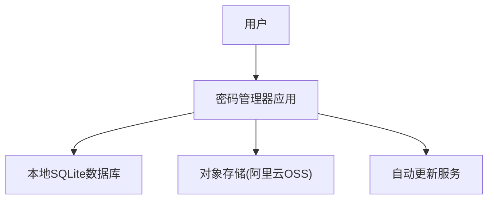

# 架构设计

<cite>
**本文引用的文件**
- [electron/main.ts](file://electron/main.ts)
- [electron/preload.ts](file://electron/preload.ts)
- [electron/common.ts](file://electron/common.ts)
- [electron/tray-menu.ts](file://electron/tray-menu.ts)
- [electron/updater.ts](file://electron/updater.ts)
- [electron/constant.ts](file://electron/constant.ts)
- [electron/db/sqlite/sqlite-ipc.ts](file://electron/db/sqlite/sqlite-ipc.ts)
- [electron/db/sqlite/components/initSql.ts](file://electron/db/sqlite/components/initSql.ts)
- [electron/db/sqlite/components/db.ts](file://electron/db/sqlite/components/db.ts)
- [src/main.ts](file://src/main.ts)
- [src/App.vue](file://src/App.vue)
- [src/config/config.ts](file://src/config/config.ts)
- [vite.config.ts](file://vite.config.ts)
- [package.json](file://package.json)
- [electron-builder.json5](file://electron-builder.json5)
</cite>

## 目录
1. [简介](#简介)
2. [项目结构](#项目结构)
3. [核心组件](#核心组件)
4. [架构总览](#架构总览)
5. [详细组件分析](#详细组件分析)
6. [依赖关系分析](#依赖关系分析)
7. [性能考量](#性能考量)
8. [故障排查指南](#故障排查指南)
9. [结论](#结论)
10. [附录](#附录)

## 简介
本项目为一款基于 Electron 的桌面密码管理器，采用 Vue 3 + TypeScript + Vite 构建前端，主进程负责窗口管理、系统托盘、全局快捷键、应用更新与 SQLite 数据持久化；渲染进程承载 UI 与业务逻辑。系统通过 IPC 实现主/渲染进程间通信，数据以本地 SQLite 存储为主，并支持与 OSS 对象存储进行同步。

## 项目结构
- 主进程（Electron）
  - 应用入口与生命周期管理：electron/main.ts
  - 预加载桥接与 IPC 封装：electron/preload.ts
  - 系统功能：全局快捷键、开机自启、开发者工具、托盘菜单：electron/common.ts、electron/tray-menu.ts
  - 应用更新：electron/updater.ts
  - 数据库与 IPC：electron/db/sqlite/*（SQLite 初始化、Mapper、IPC 绑定）
  - 常量与窗口配置：electron/constant.ts
- 渲染进程（Vue 3）
  - 应用入口：src/main.ts
  - 根组件与视图切换：src/App.vue
  - 配置与加密常量：src/config/config.ts
- 构建与打包
  - Vite 配置：vite.config.ts
  - 依赖与脚本：package.json
  - electron-builder 配置：electron-builder.json5

图表来源
- [electron/main.ts:1-240](file://electron/main.ts#L1-L240)
- [electron/preload.ts:1-39](file://electron/preload.ts#L1-L39)
- [electron/db/sqlite/sqlite-ipc.ts:1-220](file://electron/db/sqlite/sqlite-ipc.ts#L1-L220)
- [electron/updater.ts:1-204](file://electron/updater.ts#L1-L204)
- [electron/tray-menu.ts:1-47](file://electron/tray-menu.ts#L1-L47)
- [electron/common.ts:1-56](file://electron/common.ts#L1-L56)
- [src/main.ts:1-20](file://src/main.ts#L1-L20)
- [src/App.vue:1-19](file://src/App.vue#L1-L19)
- [src/config/config.ts:1-143](file://src/config/config.ts#L1-L143)
- [vite.config.ts:1-38](file://vite.config.ts#L1-L38)
- [package.json:1-51](file://package.json#L1-L51)
- [electron-builder.json5:1-52](file://electron-builder.json5#L1-L52)

章节来源
- [electron/main.ts:1-240](file://electron/main.ts#L1-L240)
- [vite.config.ts:1-38](file://vite.config.ts#L1-L38)
- [package.json:1-51](file://package.json#L1-L51)
- [electron-builder.json5:1-52](file://electron-builder.json5#L1-L52)

## 核心组件
- 主进程入口与生命周期
  - 创建主窗口、托盘、全局快捷键、SQLite 初始化、更新检查与事件监听
- 预加载桥接
  - 通过 contextBridge 暴露受控的 ipcRenderer API，并封装更新相关便捷方法
- SQLite 数据层
  - 初始化表结构与默认数据，提供分组、密码条目、配置、快捷键、OSS 等映射与 IPC 接口
- 更新管理
  - 基于 electron-updater，支持手动/自动检查、下载、安装与进度广播
- 系统集成
  - 托盘菜单、全局快捷键、开机自启、开发者工具

章节来源
- [electron/main.ts:1-240](file://electron/main.ts#L1-L240)
- [electron/preload.ts:1-39](file://electron/preload.ts#L1-L39)
- [electron/db/sqlite/sqlite-ipc.ts:1-220](file://electron/db/sqlite/sqlite-ipc.ts#L1-L220)
- [electron/db/sqlite/components/initSql.ts:1-224](file://electron/db/sqlite/components/initSql.ts#L1-L224)
- [electron/updater.ts:1-204](file://electron/updater.ts#L1-L204)
- [electron/tray-menu.ts:1-47](file://electron/tray-menu.ts#L1-L47)
- [electron/common.ts:1-56](file://electron/common.ts#L1-L56)

## 架构总览
系统采用“主进程 + 渲染进程”的经典 Electron 架构，主进程负责系统级能力与数据持久化，渲染进程负责 UI 与业务交互。IPC 作为主/渲染进程间的数据与控制通道，贯穿窗口控制、数据库操作、更新流程与系统集成。

图表来源
- [electron/main.ts:1-240](file://electron/main.ts#L1-L240)
- [electron/preload.ts:1-39](file://electron/preload.ts#L1-L39)
- [electron/db/sqlite/sqlite-ipc.ts:1-220](file://electron/db/sqlite/sqlite-ipc.ts#L1-L220)
- [electron/db/sqlite/components/db.ts:1-30](file://electron/db/sqlite/components/db.ts#L1-L30)
- [electron/tray-menu.ts:1-47](file://electron/tray-menu.ts#L1-L47)
- [electron/updater.ts:1-204](file://electron/updater.ts#L1-L204)
- [src/App.vue:1-19](file://src/App.vue#L1-L19)

## 详细组件分析

### 主进程与渲染进程交互模式
- 预加载桥接
  - 通过 contextBridge.exposeInMainWorld 暴露受控 API，渲染进程仅能通过白名单方法与主进程通信
- IPC 通道
  - 主进程使用 ipcMain.handle 注册处理器，渲染进程通过 ipcRenderer.invoke/send 触发
- 窗口与托盘
  - 主进程创建 BrowserWindow 并隐藏至托盘；托盘菜单触发显示/隐藏、检查更新、打开帮助链接、退出

图表来源
- [src/main.ts:14-19](file://src/main.ts#L14-L19)
- [electron/preload.ts:25-37](file://electron/preload.ts#L25-L37)
- [electron/main.ts:205-211](file://electron/main.ts#L205-L211)

章节来源
- [electron/preload.ts:1-39](file://electron/preload.ts#L1-L39)
- [electron/main.ts:149-227](file://electron/main.ts#L149-L227)
- [src/main.ts:14-19](file://src/main.ts#L14-L19)

### SQLite 数据流与集成模式
- 初始化与表结构
  - 首次运行检测表存在性，不存在则创建 group、pwd_info、config、shortcut_key、oss、update_version 等表并插入默认数据
- 数据访问与映射
  - 通过 Mapper 层对各实体进行 CRUD 操作，统一由 SQLiteIPC 暴露为 IPC 接口
- 数据库连接
  - 使用 better-sqlite3，数据库文件位于用户数据目录下

图表来源
- [electron/db/sqlite/components/initSql.ts:26-105](file://electron/db/sqlite/components/initSql.ts#L26-L105)
- [electron/db/sqlite/sqlite-ipc.ts:58-219](file://electron/db/sqlite/sqlite-ipc.ts#L58-L219)
- [electron/db/sqlite/components/db.ts:16-23](file://electron/db/sqlite/components/db.ts#L16-L23)

章节来源
- [electron/db/sqlite/components/initSql.ts:1-224](file://electron/db/sqlite/components/initSql.ts#L1-L224)
- [electron/db/sqlite/sqlite-ipc.ts:1-220](file://electron/db/sqlite/sqlite-ipc.ts#L1-L220)
- [electron/db/sqlite/components/db.ts:1-30](file://electron/db/sqlite/components/db.ts#L1-L30)

### 应用更新与发布
- 更新策略
  - 使用 electron-updater，提供手动检查、下载、安装与进度广播
  - 支持跳过版本、自动检查开关、延迟启动检查
- 发布配置
  - electron-builder 配置输出目录、目标平台、NSIS 安装行为与发布地址

图表来源
- [electron/main.ts:58-60](file://electron/main.ts#L58-L60)
- [electron/updater.ts:143-175](file://electron/updater.ts#L143-L175)
- [electron/updater.ts:74-96](file://electron/updater.ts#L74-L96)
- [src/main.ts:16-18](file://src/main.ts#L16-L18)

章节来源
- [electron/updater.ts:1-204](file://electron/updater.ts#L1-L204)
- [electron/main.ts:196-227](file://electron/main.ts#L196-L227)
- [electron-builder.json5:1-52](file://electron-builder.json5#L1-L52)

### 系统集成与安全
- 全局快捷键
  - 读取配置的快捷键字符串，注册全局快捷键以显示/隐藏主窗口
- 开机自启
  - 通过 app.setLoginItemSettings 控制开机启动
- 托盘菜单
  - 提供显示主界面、检查更新、帮助文档、退出等操作
- 安全与配置
  - 渲染进程侧定义盐值、AES Key/IV、默认密码等常量，用于本地数据加解密与默认值

图表来源
- [electron/common.ts:17-39](file://electron/common.ts#L17-L39)
- [electron/common.ts:42-50](file://electron/common.ts#L42-L50)
- [electron/tray-menu.ts:7-47](file://electron/tray-menu.ts#L7-L47)
- [src/config/config.ts:14-22](file://src/config/config.ts#L14-L22)

章节来源
- [electron/common.ts:1-56](file://electron/common.ts#L1-L56)
- [electron/tray-menu.ts:1-47](file://electron/tray-menu.ts#L1-L47)
- [src/config/config.ts:1-143](file://src/config/config.ts#L1-L143)

## 依赖关系分析
- 技术栈
  - 前端：Vue 3、Pinia、Element Plus、mitt、pinyin-match、xlsx
  - 主进程：better-sqlite3、electron、electron-updater、ali-oss
  - 构建：Vite、electron-builder、vite-plugin-electron
- 版本与兼容性
  - Electron 30、Vite 5、TypeScript 5、Vue 3.4
  - 发布平台：Windows NSIS、macOS DMG、Linux AppImage
- 第三方依赖
  - better-sqlite3：高性能本地数据库
  - electron-updater：自动更新
  - ali-oss：对象存储同步
  - xlsx：Excel 导入导出

图表来源
- [package.json:18-44](file://package.json#L18-L44)
- [vite.config.ts:10-35](file://vite.config.ts#L10-L35)
- [electron-builder.json5:10-13](file://electron-builder.json5#L10-L13)

章节来源
- [package.json:1-51](file://package.json#L1-51)
- [vite.config.ts:1-38](file://vite.config.ts#L1-L38)
- [electron-builder.json5:1-52](file://electron-builder.json5#L1-L52)

## 性能考量
- 数据库性能
  - better-sqlite3 为本地嵌入式数据库，适合中小规模数据；建议对高频查询字段建立索引（如 group_id、title），避免全表扫描
- IPC 调用
  - 将大对象序列化与传输降至最低，必要时拆分为多次调用或分页
- 渲染进程资源
  - 合理使用 Pinia 状态管理，避免不必要的响应式数据膨胀
- 更新与网络
  - 更新下载采用断点续传与进度广播，减少阻塞；OSS 同步建议异步与节流

## 故障排查指南
- 无法显示主窗口
  - 检查窗口创建与隐藏逻辑、托盘点击事件与全局快捷键注册
- IPC 调用无响应
  - 确认通道名一致、主进程已注册 handle、预加载桥接正确暴露 API
- SQLite 初始化失败
  - 检查用户数据目录权限、数据库文件路径、表创建语句与默认数据插入
- 更新失败
  - 检查更新源地址、网络连通性、自动下载开关与跳过版本配置
- 开机自启无效
  - 检查 setLoginItemSettings 参数与平台差异

章节来源
- [electron/main.ts:62-116](file://electron/main.ts#L62-L116)
- [electron/tray-menu.ts:17-46](file://electron/tray-menu.ts#L17-L46)
- [electron/common.ts:42-50](file://electron/common.ts#L42-L50)
- [electron/db/sqlite/components/initSql.ts:26-46](file://electron/db/sqlite/components/initSql.ts#L26-L46)
- [electron/updater.ts:19-36](file://electron/updater.ts#L19-L36)

## 结论
本架构以 Electron 为核心，结合 Vue 3 的组件化开发与 SQLite 的轻量存储，形成清晰的主/渲染进程职责划分。通过受控的 IPC 通道实现系统功能与数据操作，辅以托盘、快捷键与自动更新提升用户体验。在安全性方面，渲染进程侧内置加密常量与默认值，建议在生产环境中引入更强的密钥管理与本地加密策略。未来可在数据库层面引入索引优化、状态管理模块化以及更完善的错误监控与日志体系。

## 附录
- 系统上下文图（概念性）

- 部署拓扑
  - Windows/macOS/Linux 三端统一打包，Windows 使用 NSIS 安装，macOS 使用 DMG，Linux 使用 AppImage
  - 发布地址与更新源在 electron-builder.json5 与 updater.ts 中配置

章节来源
- [electron-builder.json5:21-46](file://electron-builder.json5#L21-L46)
- [electron/updater.ts:27-30](file://electron/updater.ts#L27-L30)