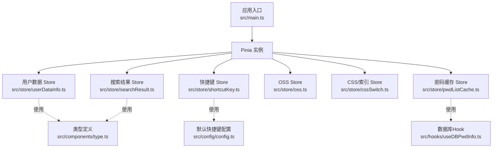
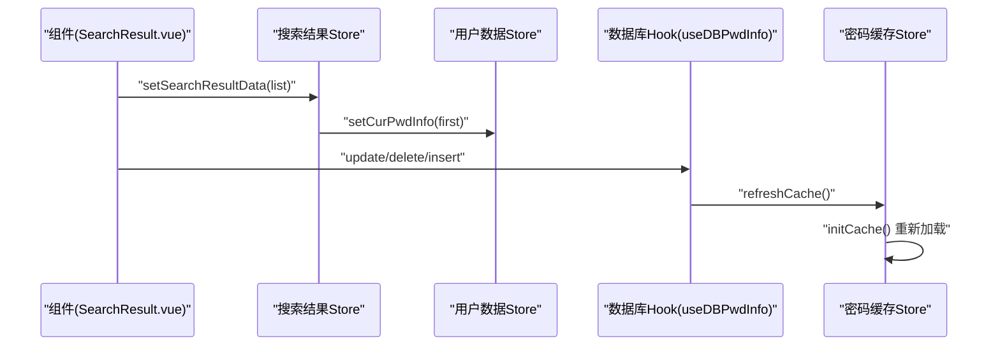
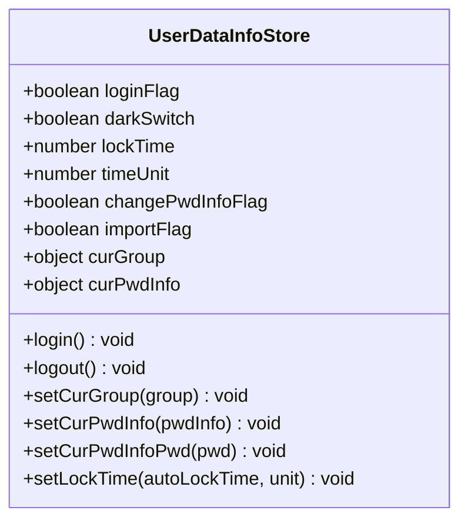
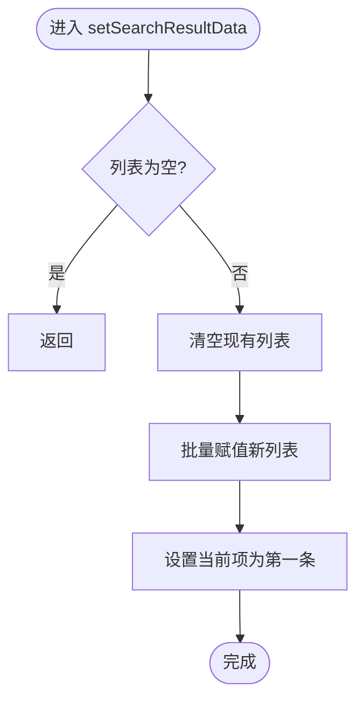
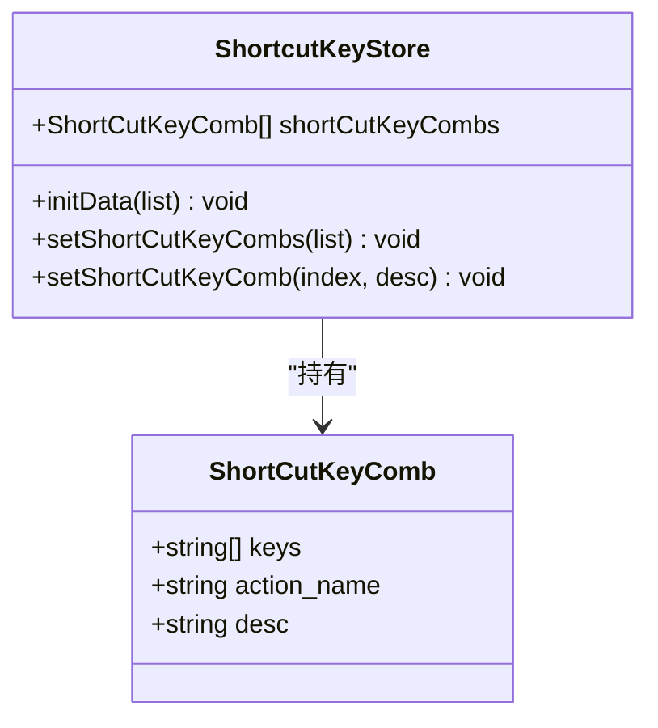
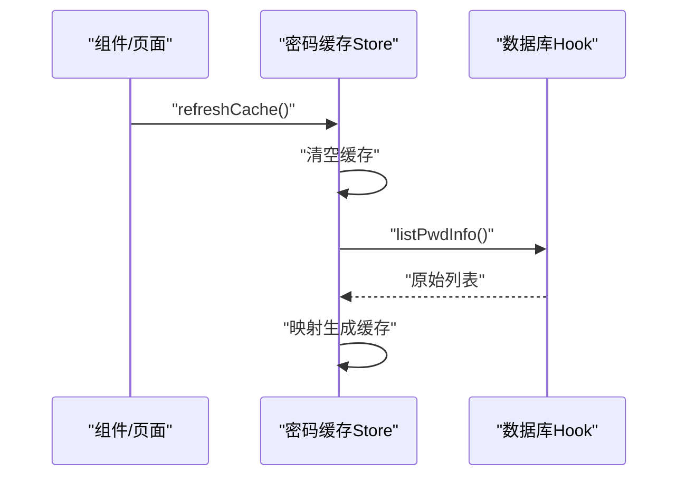
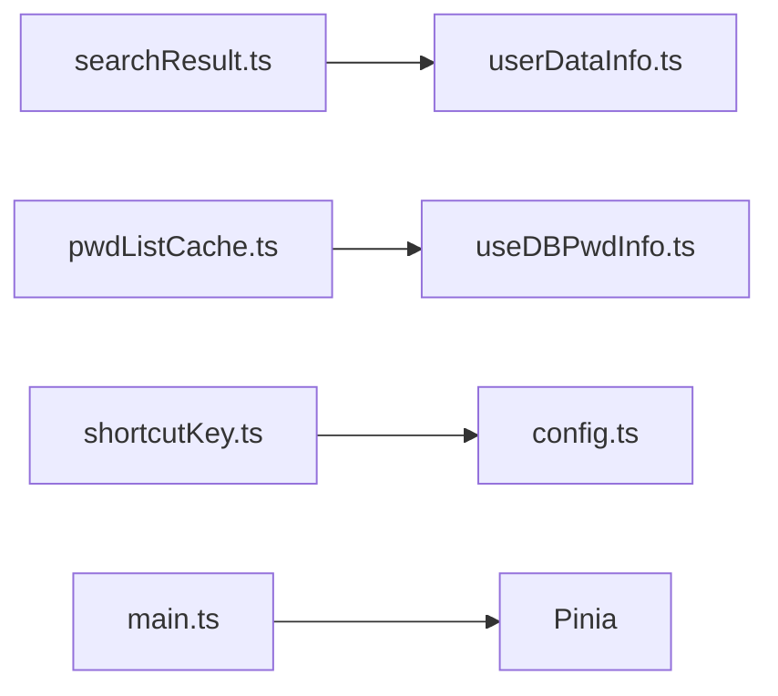

# Pinia状态设计

<cite>
**本文引用的文件**
- [src/main.ts](file://src/main.ts)
- [src/store/cssSwitch.ts](file://src/store/cssSwitch.ts)
- [src/store/oss.ts](file://src/store/oss.ts)
- [src/store/pwdListCache.ts](file://src/store/pwdListCache.ts)
- [src/store/searchResult.ts](file://src/store/searchResult.ts)
- [src/store/shortcutKey.ts](file://src/store/shortcutKey.ts)
- [src/store/userDataInfo.ts](file://src/store/userDataInfo.ts)
- [src/components/type.ts](file://src/components/type.ts)
- [src/config/config.ts](file://src/config/config.ts)
- [src/hooks/useDBPwdInfo.ts](file://src/hooks/useDBPwdInfo.ts)
- [src/hooks/useLoginAction.ts](file://src/hooks/useLoginAction.ts)
- [src/components/indexview/SearchResult.vue](file://src/components/indexview/SearchResult.vue)
- [package.json](file://package.json)
</cite>

## 目录
1. [简介](#简介)
2. [项目结构](#项目结构)
3. [核心组件](#核心组件)
4. [架构总览](#架构总览)
5. [详细组件分析](#详细组件分析)
6. [依赖分析](#依赖分析)
7. [性能考虑](#性能考虑)
8. [故障排查指南](#故障排查指南)
9. [结论](#结论)
10. [附录](#附录)

## 简介
本文件系统性梳理密码管理器中基于 Pinia 的状态设计，涵盖架构定位、状态管理模式、模块组织、命名规范、模块间依赖、最佳实践、持久化策略、响应式绑定机制、调试技巧、扩展指南与性能优化建议。目标是帮助开发者快速理解并高效维护状态层。

## 项目结构
- 应用通过根入口安装 Pinia 插件，全局启用响应式状态与动作。
- 状态模块集中于 src/store 目录，采用按功能域划分的模块化组织，每个模块导出一个或多个 Store Hook（组合式风格）或传统选项式 Store。
- 组件通过组合式 API 使用 Store，并结合 storeToRefs 进行解构绑定，确保响应式更新。
- 数据模型统一定义在 src/components/type.ts，作为 Store 与组件之间的契约。

图表来源
- [src/main.ts:1-20](file://src/main.ts#L1-L20)
- [src/store/userDataInfo.ts:1-76](file://src/store/userDataInfo.ts#L1-L76)
- [src/store/searchResult.ts:1-49](file://src/store/searchResult.ts#L1-L49)
- [src/store/shortcutKey.ts:1-99](file://src/store/shortcutKey.ts#L1-L99)
- [src/store/oss.ts:1-59](file://src/store/oss.ts#L1-L59)
- [src/store/cssSwitch.ts:1-17](file://src/store/cssSwitch.ts#L1-L17)
- [src/store/pwdListCache.ts:1-37](file://src/store/pwdListCache.ts#L1-L37)
- [src/components/type.ts:1-88](file://src/components/type.ts#L1-L88)
- [src/config/config.ts:1-143](file://src/config/config.ts#L1-L143)
- [src/hooks/useDBPwdInfo.ts:1-103](file://src/hooks/useDBPwdInfo.ts#L1-L103)

章节来源
- [src/main.ts:1-20](file://src/main.ts#L1-L20)
- [src/components/type.ts:1-88](file://src/components/type.ts#L1-L88)

## 核心组件
- 用户数据 Store（组合式风格）
  - 职责：维护登录态、主题开关、锁屏时间、当前分组与当前密码项等用户级状态；提供登录/登出、当前项设置等动作。
  - 初始化策略：state 返回默认值，包含布尔开关、数值计时参数、对象容器等。
  - 依赖：类型定义 PwdGroup、PwdInfo、ShortCutKeyComb。
- 搜索结果 Store（组合式风格）
  - 职责：承载搜索视图显示标志、搜索结果列表、当前选中项；提供打开/关闭视图、设置结果集、更新行标题等动作。
  - 依赖：userDataInfoStore 用于同步当前项；PwdInfo 类型。
- 快捷键 Store（选项式风格）
  - 职责：维护快捷键组合列表及其解析后的 keys 数组；提供初始化、设置、更新等动作。
  - 默认值：从配置文件读取默认快捷键描述字符串，转换为 keys 数组。
- OSS Store（组合式风格）
  - 职责：维护 OSS 客户端实例与最后上传/更新时间戳；提供设置/获取方法。
  - 设计：以 ref 保存客户端与时间戳，便于响应式暴露。
- CSS/索引 Store（组合式风格）
  - 职责：维护当前分组索引与当前密码列表索引；提供设置方法。
- 密码列表缓存 Store（组合式风格）
  - 职责：在挂载时初始化缓存，仅保留必要字段；提供刷新缓存动作。
  - 依赖：数据库 Hook useDBPwdInfo 获取原始列表，再映射生成缓存条目。

章节来源
- [src/store/userDataInfo.ts:1-76](file://src/store/userDataInfo.ts#L1-L76)
- [src/store/searchResult.ts:1-49](file://src/store/searchResult.ts#L1-L49)
- [src/store/shortcutKey.ts:1-99](file://src/store/shortcutKey.ts#L1-L99)
- [src/store/oss.ts:1-59](file://src/store/oss.ts#L1-L59)
- [src/store/cssSwitch.ts:1-17](file://src/store/cssSwitch.ts#L1-L17)
- [src/store/pwdListCache.ts:1-37](file://src/store/pwdListCache.ts#L1-L37)

## 架构总览
- 状态分层
  - 用户态：登录态、主题、锁屏、当前上下文（分组/密码项）。
  - 视图态：搜索视图显隐、搜索结果列表、当前选中项。
  - 行为态：快捷键组合、OSS 同步策略与时间戳。
  - 缓存态：轻量缓存，减少渲染与计算开销。
- 响应式绑定
  - 组件通过 storeToRefs 解构 ref 或 reactive 字段，实现双向响应式更新。
- 模块交互
  - 搜索结果 Store 与用户数据 Store 协同，确保当前项与结果列表一致性。
  - 登录/登出动作由登录 Hook 触发，统一调用用户数据 Store 的 login/logout。
  - 数据变更通过数据库 Hook 触发缓存刷新，保持缓存与真实数据一致。

图表来源
- [src/components/indexview/SearchResult.vue:1-186](file://src/components/indexview/SearchResult.vue#L1-L186)
- [src/store/searchResult.ts:1-49](file://src/store/searchResult.ts#L1-L49)
- [src/store/userDataInfo.ts:1-76](file://src/store/userDataInfo.ts#L1-L76)
- [src/hooks/useDBPwdInfo.ts:1-103](file://src/hooks/useDBPwdInfo.ts#L1-L103)
- [src/store/pwdListCache.ts:1-37](file://src/store/pwdListCache.ts#L1-L37)

## 详细组件分析

### 用户数据 Store 分析
- 设计要点
  - 组合式风格：返回 ref/响应式对象与动作函数，便于在组件中直接使用。
  - 初始化：state 提供默认值，避免未赋值导致的空引用。
  - 动作：提供登录/登出、当前分组/密码项设置、锁屏时间设置等。
- 最佳实践
  - 对象赋值使用浅拷贝/合并，避免直接覆盖导致响应链断裂。
  - 日志输出用于调试，生产环境可移除或降级。
- 复杂度
  - 状态读写为 O(1)，动作为 O(1)。

图表来源
- [src/store/userDataInfo.ts:1-76](file://src/store/userDataInfo.ts#L1-L76)

章节来源
- [src/store/userDataInfo.ts:1-76](file://src/store/userDataInfo.ts#L1-L76)

### 搜索结果 Store 分析
- 设计要点
  - 视图态与数据态分离：searchViewShowFlag 控制视图显隐；searchResultList 为响应式数组。
  - 与用户数据 Store 协同：设置当前项、清空时同步置空。
  - 更新策略：splice 清空、Object.assign 替换，避免破坏响应式引用。
- 最佳实践
  - 在 close 时清理当前项，防止脏数据残留。
  - updateRowTitle 通过 findIndex 精准更新，避免全量替换。
- 复杂度
  - setSearchResultData：O(n)（n 为结果数量）。
  - updateRowTitle：O(n)（线性查找）。

图表来源
- [src/store/searchResult.ts:23-32](file://src/store/searchResult.ts#L23-L32)

章节来源
- [src/store/searchResult.ts:1-49](file://src/store/searchResult.ts#L1-L49)

### 快捷键 Store 分析
- 设计要点
  - 选项式风格：state 明确字段类型，actions 提供初始化与更新。
  - 默认值来源于配置文件，描述字符串拆分为 keys 数组，便于后续处理。
- 最佳实践
  - 初始化时先清空旧值，再逐条 push，避免重复。
  - 更新时同时维护 desc 与 keys，保持一致性。
- 复杂度
  - 初始化/更新均为 O(m)（m 为快捷键条目数）。

图表来源
- [src/store/shortcutKey.ts:1-99](file://src/store/shortcutKey.ts#L1-L99)
- [src/config/config.ts:24-34](file://src/config/config.ts#L24-L34)

章节来源
- [src/store/shortcutKey.ts:1-99](file://src/store/shortcutKey.ts#L1-L99)
- [src/config/config.ts:1-143](file://src/config/config.ts#L1-L143)

### OSS Store 分析
- 设计要点
  - 以 ref 保存客户端与时间戳，便于在组件中直接响应。
  - 提供 set/get 方法，封装时间戳更新逻辑。
- 最佳实践
  - 时间戳单位统一为毫秒，便于跨模块比较。
- 复杂度
  - set/get 为 O(1)。

章节来源
- [src/store/oss.ts:1-59](file://src/store/oss.ts#L1-L59)

### CSS/索引 Store 分析
- 设计要点
  - 维护当前分组与当前列表项索引，提供设置方法。
- 最佳实践
  - 索引初值设为 -1，表示“无选中”，避免误判。
- 复杂度
  - 设置为 O(1)。

章节来源
- [src/store/cssSwitch.ts:1-17](file://src/store/cssSwitch.ts#L1-L17)

### 密码列表缓存 Store 分析
- 设计要点
  - onMounted 生命周期内初始化缓存，仅保留 id/title/username 等必要字段。
  - refreshCache 重置并重新加载，确保与数据库一致。
- 依赖
  - 使用 useDBPwdInfo 获取原始列表，再映射生成缓存。
- 复杂度
  - 初始化/刷新为 O(n)（n 为列表长度）。

图表来源
- [src/store/pwdListCache.ts:15-33](file://src/store/pwdListCache.ts#L15-L33)
- [src/hooks/useDBPwdInfo.ts:65-76](file://src/hooks/useDBPwdInfo.ts#L65-L76)

章节来源
- [src/store/pwdListCache.ts:1-37](file://src/store/pwdListCache.ts#L1-L37)
- [src/hooks/useDBPwdInfo.ts:1-103](file://src/hooks/useDBPwdInfo.ts#L1-L103)

### 组件使用示例：SearchResult.vue
- 使用模式
  - 通过 storeToRefs 解构 searchResultList 与 curPwdInfo，实现响应式绑定。
  - 在行点击时调用用户数据 Store 设置当前项。
  - 通过 emitter 事件驱动焦点与高亮切换。
- 最佳实践
  - 在 onUnmounted 中解绑事件，避免内存泄漏。
  - focusTable 通过 nextTick 确保 DOM 已更新后再聚焦。

章节来源
- [src/components/indexview/SearchResult.vue:1-186](file://src/components/indexview/SearchResult.vue#L1-L186)

## 依赖分析
- 模块耦合
  - searchResult 依赖 userDataInfo（当前项同步）。
  - pwdListCache 依赖 useDBPwdInfo（数据源）。
  - shortcutKey 依赖 config（默认快捷键）。
- 外部依赖
  - Vue 3 + Pinia 2.x 提供响应式与状态管理能力。
  - Electron IPC 用于数据库操作与系统交互。

图表来源
- [src/store/searchResult.ts:1-49](file://src/store/searchResult.ts#L1-L49)
- [src/store/userDataInfo.ts:1-76](file://src/store/userDataInfo.ts#L1-L76)
- [src/store/pwdListCache.ts:1-37](file://src/store/pwdListCache.ts#L1-L37)
- [src/hooks/useDBPwdInfo.ts:1-103](file://src/hooks/useDBPwdInfo.ts#L1-L103)
- [src/store/shortcutKey.ts:1-99](file://src/store/shortcutKey.ts#L1-L99)
- [src/config/config.ts:1-143](file://src/config/config.ts#L1-L143)
- [src/main.ts:1-20](file://src/main.ts#L1-L20)

章节来源
- [package.json:18-29](file://package.json#L18-L29)

## 性能考虑
- 响应式粒度
  - 将大对象拆分为多个独立 ref/响应式字段，减少不必要的重渲染。
- 列表更新策略
  - 使用 splice + Object.assign 替代整列替换，降低引用变化成本。
- 缓存与懒加载
  - 密码缓存仅保留必要字段，缩短渲染路径；在数据变更时统一刷新。
- 计算与监听
  - 避免在模板中进行复杂计算；将计算逻辑前置到 Store 或 Hook。
- 时间戳与定时任务
  - OSS 时间戳统一为毫秒，便于比较；避免频繁触发同步逻辑。
- 依赖版本
  - Pinia 2.1.7 与 Vue 3.4+ 兼容良好，建议保持升级路径稳定。

## 故障排查指南
- 登录/登出异常
  - 检查登录 Hook 是否正确调用用户数据 Store 的 login/logout。
  - 确认路由跳转逻辑与 Store 状态一致。
- 搜索结果不同步
  - 确认 setSearchResultData 后是否调用 setCurPwdInfo。
  - 检查 closeSearchView 是否清空当前项。
- 快捷键无效
  - 确认初始化流程是否执行，keys 数组是否正确生成。
  - 检查事件绑定与按键组合解析逻辑。
- 缓存不同步
  - 确认数据库操作后是否调用 refreshCache。
  - 检查映射逻辑是否遗漏关键字段。
- 调试技巧
  - 在关键动作中打印日志，定位状态变更轨迹。
  - 使用浏览器 Vue DevTools 观察 Store 状态变化。
  - 在组件中使用 storeToRefs 确保响应式解构。

章节来源
- [src/hooks/useLoginAction.ts:1-19](file://src/hooks/useLoginAction.ts#L1-L19)
- [src/store/searchResult.ts:13-37](file://src/store/searchResult.ts#L13-L37)
- [src/store/shortcutKey.ts:19-36](file://src/store/shortcutKey.ts#L19-L36)
- [src/store/pwdListCache.ts:30-33](file://src/store/pwdListCache.ts#L30-L33)

## 结论
本项目采用 Pinia 组合式与选项式混合风格，围绕用户态、视图态、行为态与缓存态进行模块化组织，配合类型定义与 Hook，形成清晰的状态边界与交互路径。通过合理的初始化策略、动作设计与响应式绑定，实现了良好的可维护性与可扩展性。建议在后续迭代中进一步引入持久化方案（如持久化插件）与更细粒度的缓存控制，以提升性能与用户体验。

## 附录
- 状态持久化建议
  - 使用 Pinia 持久化插件（如 @pinia/nuxt 或社区方案），对用户偏好（如主题、锁屏时间、快捷键）进行持久化。
  - 对于敏感数据，避免持久化明文，采用加密存储或仅缓存必要字段。
- 命名规范
  - Store 文件：useXxxStore.ts（组合式）或 XxxStore.ts（选项式）。
  - 动作：setXxx、getXxx、initXxx 等动词前缀。
  - 状态：小驼峰命名，避免复数形式。
- 扩展指南
  - 新增模块时，先定义类型，再实现 Store，最后在组件中使用 storeToRefs 绑定。
  - 模块间通信优先通过 Store 动作，避免直接耦合。
- 性能优化清单
  - 列表更新使用最小化变更策略。
  - 缓存只保留必要字段，避免大对象深拷贝。
  - 合理使用 computed 与 watch，避免过度监听。