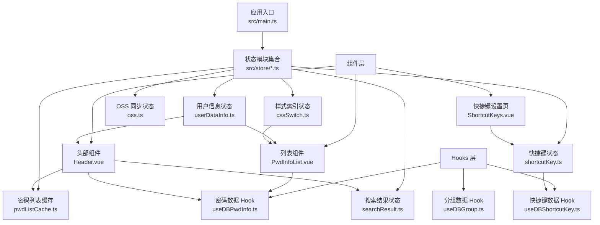
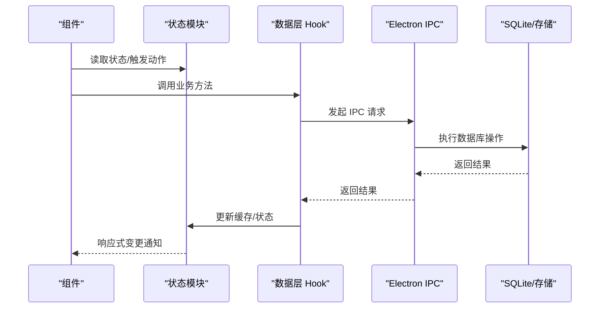
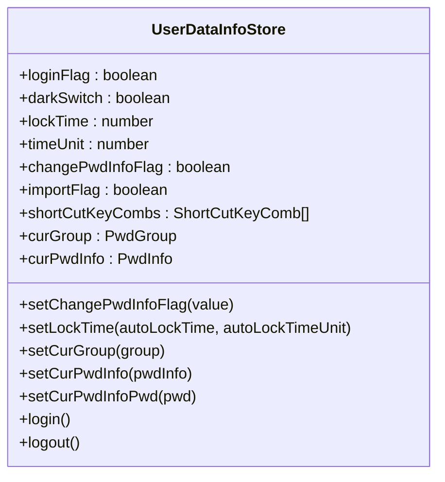
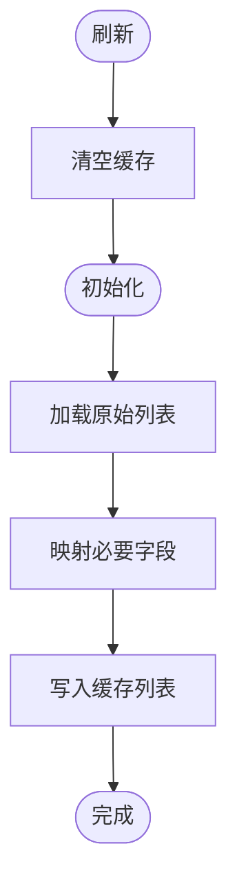
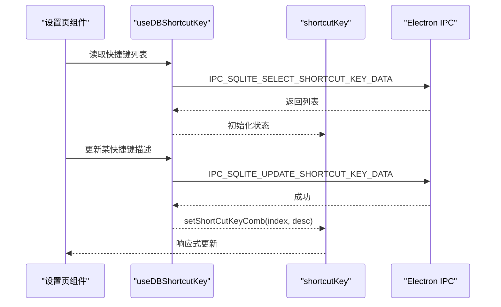
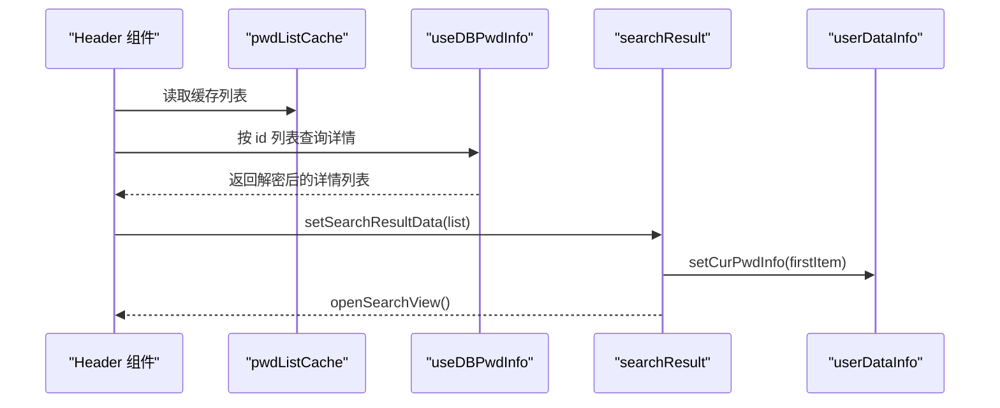
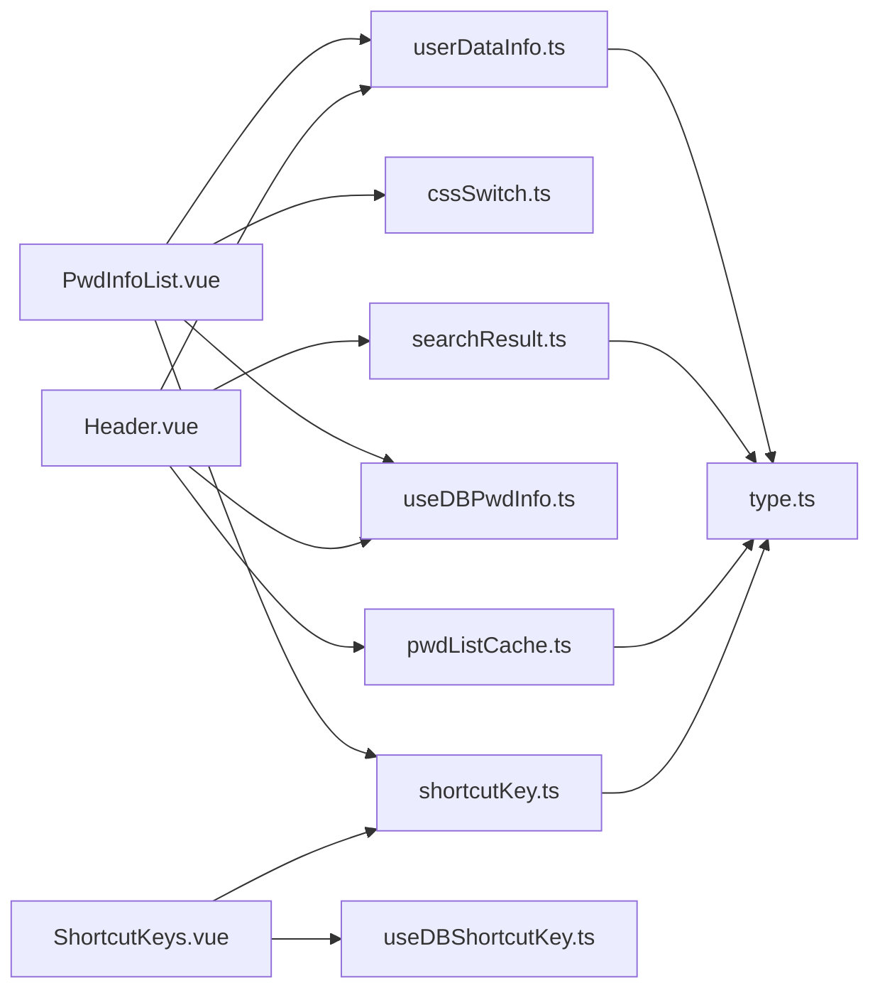
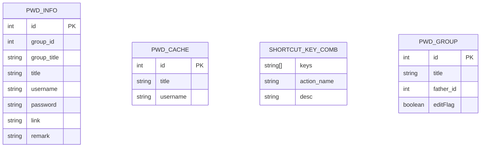

# 状态管理系统

<cite>
**本文引用的文件**
- [src/main.ts](file://src/main.ts)
- [src/store/userDataInfo.ts](file://src/store/userDataInfo.ts)
- [src/store/pwdListCache.ts](file://src/store/pwdListCache.ts)
- [src/store/shortcutKey.ts](file://src/store/shortcutKey.ts)
- [src/store/searchResult.ts](file://src/store/searchResult.ts)
- [src/store/cssSwitch.ts](file://src/store/cssSwitch.ts)
- [src/store/oss.ts](file://src/store/oss.ts)
- [src/components/type.ts](file://src/components/type.ts)
- [src/config/config.ts](file://src/config/config.ts)
- [src/hooks/useDBPwdInfo.ts](file://src/hooks/useDBPwdInfo.ts)
- [src/hooks/useDBGroup.ts](file://src/hooks/useDBGroup.ts)
- [src/hooks/useDBShortcutKey.ts](file://src/hooks/useDBShortcutKey.ts)
- [src/components/indexview/PwdInfoList.vue](file://src/components/indexview/PwdInfoList.vue)
- [src/components/indexview/Header.vue](file://src/components/indexview/Header.vue)
- [src/components/setview/ShortcutKeys.vue](file://src/components/setview/ShortcutKeys.vue)
</cite>

## 目录
1. [简介](#简介)
2. [项目结构](#项目结构)
3. [核心组件](#核心组件)
4. [架构总览](#架构总览)
5. [详细组件分析](#详细组件分析)
6. [依赖分析](#依赖分析)
7. [性能考虑](#性能考虑)
8. [故障排查指南](#故障排查指南)
9. [结论](#结论)
10. [附录](#附录)

## 简介
本文件系统性梳理密码管理器的状态管理体系，覆盖 Pinia 状态设计、用户信息状态、密码列表缓存、快捷键状态管理等核心模块。文档解释状态管理模式、状态更新机制与持久化策略，记录状态间的依赖关系与同步机制，并提供最佳实践、性能优化建议、调试技巧与常见问题排查方法。最后说明状态与组件的集成模式与数据流向。

## 项目结构
应用通过 Vue 应用入口创建 Pinia 实例并注入全局，随后各功能模块按“状态模块 + 组件 + Hook”的方式组织。状态模块集中于 src/store，业务逻辑通过 Hooks 封装与 Electron IPC 交互，UI 组件通过 storeToRefs 或直接引入状态模块进行读写。

图表来源
- [src/main.ts:1-20](file://src/main.ts#L1-L20)
- [src/store/userDataInfo.ts:1-76](file://src/store/userDataInfo.ts#L1-L76)
- [src/store/pwdListCache.ts:1-37](file://src/store/pwdListCache.ts#L1-L37)
- [src/store/shortcutKey.ts:1-99](file://src/store/shortcutKey.ts#L1-L99)
- [src/store/searchResult.ts:1-49](file://src/store/searchResult.ts#L1-L49)
- [src/store/cssSwitch.ts:1-17](file://src/store/cssSwitch.ts#L1-L17)
- [src/store/oss.ts:1-59](file://src/store/oss.ts#L1-L59)
- [src/components/indexview/PwdInfoList.vue:1-200](file://src/components/indexview/PwdInfoList.vue#L1-L200)
- [src/components/indexview/Header.vue:1-200](file://src/components/indexview/Header.vue#L1-L200)
- [src/components/setview/ShortcutKeys.vue:1-200](file://src/components/setview/ShortcutKeys.vue#L1-L200)
- [src/hooks/useDBPwdInfo.ts:1-103](file://src/hooks/useDBPwdInfo.ts#L1-L103)
- [src/hooks/useDBGroup.ts:1-53](file://src/hooks/useDBGroup.ts#L1-L53)
- [src/hooks/useDBShortcutKey.ts:1-17](file://src/hooks/useDBShortcutKey.ts#L1-L17)

章节来源
- [src/main.ts:1-20](file://src/main.ts#L1-L20)

## 核心组件
- 用户信息状态模块：维护登录态、主题开关、锁屏时间、当前分组与当前密码条目等，提供登录/登出、当前项设置等动作。
- 密码列表缓存模块：基于 Electron IPC 获取原始列表，仅缓存必要字段，提供初始化与刷新能力。
- 快捷键状态模块：维护快捷键组合及其描述，提供初始化、替换与更新动作。
- 搜索结果状态模块：维护搜索视图显隐、结果列表与当前选中项，负责与用户信息状态协同。
- 样式索引状态模块：维护当前分组与密码列表的选中索引，用于 UI 高亮。
- OSS 同步状态模块：维护客户端实例与最近更新/上传时间戳，用于上传策略与同步控制。

章节来源
- [src/store/userDataInfo.ts:1-76](file://src/store/userDataInfo.ts#L1-L76)
- [src/store/pwdListCache.ts:1-37](file://src/store/pwdListCache.ts#L1-L37)
- [src/store/shortcutKey.ts:1-99](file://src/store/shortcutKey.ts#L1-L99)
- [src/store/searchResult.ts:1-49](file://src/store/searchResult.ts#L1-L49)
- [src/store/cssSwitch.ts:1-17](file://src/store/cssSwitch.ts#L1-L17)
- [src/store/oss.ts:1-59](file://src/store/oss.ts#L1-L59)

## 架构总览
状态管理采用 Pinia 函数式 Store 设计，结合 Vue 响应式与 Hooks 抽象，形成“状态模块 + 组件读写 + 数据层 Hook + Electron IPC”的闭环。组件通过 storeToRefs 获取响应式引用，动作通过状态模块或 Hook 触发，最终落盘或跨进程通信。

图表来源
- [src/components/indexview/PwdInfoList.vue:1-200](file://src/components/indexview/PwdInfoList.vue#L1-L200)
- [src/hooks/useDBPwdInfo.ts:1-103](file://src/hooks/useDBPwdInfo.ts#L1-L103)
- [src/store/pwdListCache.ts:1-37](file://src/store/pwdListCache.ts#L1-L37)

## 详细组件分析

### 用户信息状态模块（userDataInfo）
- 状态字段：登录标志、主题开关、锁屏时间、时间单位、修改密码信息标志、导入标志、当前分组、当前密码条目。
- 动作：
  - 设置修改密码信息标志
  - 设置锁屏时间与单位
  - 设置当前分组（兼容空值）
  - 设置当前密码条目与密码字段
  - 登录/登出
- 依赖与耦合：被多个组件读取，影响 UI 主题与当前选中项；与搜索结果状态协作更新当前条目。

图表来源
- [src/store/userDataInfo.ts:1-76](file://src/store/userDataInfo.ts#L1-L76)
- [src/components/type.ts:50-88](file://src/components/type.ts#L50-L88)

章节来源
- [src/store/userDataInfo.ts:1-76](file://src/store/userDataInfo.ts#L1-L76)
- [src/components/type.ts:50-88](file://src/components/type.ts#L50-L88)

### 密码列表缓存模块（pwdListCache）
- 初始化：组件挂载时触发初始化，通过 Hook 获取原始列表，仅保留 id/title/username 三列，减少内存占用。
- 刷新：对外暴露刷新方法，清空后重新初始化。
- 与数据层联动：每次增删改后由 Hook 调用刷新，确保缓存与数据库一致。

图表来源
- [src/store/pwdListCache.ts:1-37](file://src/store/pwdListCache.ts#L1-L37)
- [src/hooks/useDBPwdInfo.ts:1-103](file://src/hooks/useDBPwdInfo.ts#L1-L103)

章节来源
- [src/store/pwdListCache.ts:1-37](file://src/store/pwdListCache.ts#L1-L37)
- [src/hooks/useDBPwdInfo.ts:1-103](file://src/hooks/useDBPwdInfo.ts#L1-L103)

### 快捷键状态模块（shortcutKey）
- 默认快捷键组合：包含打开主窗口、退出登录、复制用户名/密码/链接、插入分组/密码、本地/远程同步等。
- 动作：
  - 初始化：将后端返回的描述字符串解析为按键数组
  - 替换/更新：按索引更新描述与按键数组
- 与设置页集成：设置页通过 Hook 读取与更新，持久化到数据库并通过状态模块下发给组件。

图表来源
- [src/store/shortcutKey.ts:1-99](file://src/store/shortcutKey.ts#L1-L99)
- [src/hooks/useDBShortcutKey.ts:1-17](file://src/hooks/useDBShortcutKey.ts#L1-L17)
- [src/config/config.ts:24-34](file://src/config/config.ts#L24-L34)

章节来源
- [src/store/shortcutKey.ts:1-99](file://src/store/shortcutKey.ts#L1-L99)
- [src/hooks/useDBShortcutKey.ts:1-17](file://src/hooks/useDBShortcutKey.ts#L1-L17)
- [src/config/config.ts:24-34](file://src/config/config.ts#L24-L34)

### 搜索结果状态模块（searchResult）
- 职责：维护搜索视图显隐、结果列表、当前选中项；在关闭视图时清理数据并同步用户信息状态。
- 与用户信息状态协作：设置结果列表时默认选中第一条并同步到用户信息状态，便于右侧详情展示。

图表来源
- [src/store/searchResult.ts:1-49](file://src/store/searchResult.ts#L1-L49)
- [src/store/pwdListCache.ts:1-37](file://src/store/pwdListCache.ts#L1-L37)
- [src/hooks/useDBPwdInfo.ts:1-103](file://src/hooks/useDBPwdInfo.ts#L1-L103)

章节来源
- [src/store/searchResult.ts:1-49](file://src/store/searchResult.ts#L1-L49)

### 样式索引状态模块（cssSwitch）
- 职责：维护当前分组索引与密码列表索引，用于 UI 高亮与键盘导航。
- 与组件集成：列表组件在新增/切换时更新索引，Header 组件在锁屏事件中根据状态决定行为。

章节来源
- [src/store/cssSwitch.ts:1-17](file://src/store/cssSwitch.ts#L1-L17)
- [src/components/indexview/PwdInfoList.vue:1-200](file://src/components/indexview/PwdInfoList.vue#L1-L200)
- [src/components/indexview/Header.vue:1-200](file://src/components/indexview/Header.vue#L1-L200)

### OSS 同步状态模块（oss）
- 职责：维护客户端实例与最近更新/上传时间戳，用于上传策略与同步控制。
- 与上传/同步流程配合：在上传成功后更新时间戳，后续上传策略可据此判断是否需要上传。

章节来源
- [src/store/oss.ts:1-59](file://src/store/oss.ts#L1-L59)

## 依赖分析
- 组件依赖状态模块：列表组件依赖用户信息与快捷键状态；头部组件依赖用户信息、搜索结果与密码缓存；设置页依赖快捷键状态与数据层 Hook。
- 状态间耦合：
  - 用户信息状态与搜索结果状态存在写入耦合（设置当前条目）。
  - 密码列表缓存与数据层 Hook 存在刷新耦合（增删改后刷新）。
- 外部依赖：Electron IPC 提供 SQLite 数据访问；组件通过事件总线与主题配置交互。

图表来源
- [src/components/indexview/PwdInfoList.vue:1-200](file://src/components/indexview/PwdInfoList.vue#L1-L200)
- [src/components/indexview/Header.vue:1-200](file://src/components/indexview/Header.vue#L1-L200)
- [src/components/setview/ShortcutKeys.vue:1-200](file://src/components/setview/ShortcutKeys.vue#L1-L200)
- [src/store/userDataInfo.ts:1-76](file://src/store/userDataInfo.ts#L1-L76)
- [src/store/searchResult.ts:1-49](file://src/store/searchResult.ts#L1-L49)
- [src/store/pwdListCache.ts:1-37](file://src/store/pwdListCache.ts#L1-L37)
- [src/store/shortcutKey.ts:1-99](file://src/store/shortcutKey.ts#L1-L99)
- [src/hooks/useDBPwdInfo.ts:1-103](file://src/hooks/useDBPwdInfo.ts#L1-L103)
- [src/hooks/useDBShortcutKey.ts:1-17](file://src/hooks/useDBShortcutKey.ts#L1-L17)
- [src/components/type.ts:1-88](file://src/components/type.ts#L1-L88)

## 性能考虑
- 缓存字段最小化：密码列表缓存仅保留 id/title/username，降低内存与序列化开销。
- 搜索防抖与请求去重：头部组件对搜索输入进行防抖与请求序号标记，避免旧请求覆盖新结果。
- 响应式粒度：使用 storeToRefs 将状态转为响应式引用，避免不必要的组件重渲染。
- 上传节流：OSS 状态维护最近上传时间戳，可用于上传策略的节流控制。
- 数据解密延迟：仅在需要时对列表进行解密，减少 CPU 开销。

章节来源
- [src/store/pwdListCache.ts:1-37](file://src/store/pwdListCache.ts#L1-L37)
- [src/components/indexview/Header.vue:98-157](file://src/components/indexview/Header.vue#L98-L157)
- [src/store/oss.ts:1-59](file://src/store/oss.ts#L1-L59)
- [src/hooks/useDBPwdInfo.ts:65-88](file://src/hooks/useDBPwdInfo.ts#L65-L88)

## 故障排查指南
- 状态未更新：
  - 检查组件是否通过 storeToRefs 获取响应式引用。
  - 确认动作是否正确调用状态模块方法。
- 搜索结果异常：
  - 检查缓存列表是否存在；确认拼音匹配逻辑与请求去重是否生效。
  - 核对数据库查询接口返回的数据结构。
- 快捷键设置无效：
  - 确认设置页是否通过 Hook 正确调用更新接口并持久化。
  - 检查状态模块初始化是否将描述解析为按键数组。
- 列表不同步：
  - 确认增删改操作后是否调用缓存刷新。
  - 检查 Hook 是否正确转发刷新信号。

章节来源
- [src/components/indexview/Header.vue:98-157](file://src/components/indexview/Header.vue#L98-L157)
- [src/store/pwdListCache.ts:30-33](file://src/store/pwdListCache.ts#L30-L33)
- [src/hooks/useDBShortcutKey.ts:11-14](file://src/hooks/useDBShortcutKey.ts#L11-L14)
- [src/store/shortcutKey.ts:19-36](file://src/store/shortcutKey.ts#L19-L36)

## 结论
本状态管理体系以 Pinia 为核心，围绕用户信息、缓存、快捷键、搜索与样式索引五大模块构建，通过 Hooks 将业务逻辑与状态更新解耦，并借助 Electron IPC 实现与数据库的稳定交互。模块职责清晰、耦合可控，具备良好的扩展性与可维护性。建议在后续迭代中进一步完善持久化策略与错误边界处理，提升用户体验与系统稳定性。

## 附录
- 状态持久化策略建议：
  - 用户信息与快捷键：通过数据层 Hook 持久化到 SQLite，启动时从数据库恢复。
  - 主题与锁屏时间：结合配置表与用户偏好，启动时读取并回填状态。
  - 搜索结果与当前选中项：仅作为会话内状态，无需持久化。
- 最佳实践：
  - 动作集中于状态模块，组件只负责读取与触发。
  - 对外部依赖（IPC）进行统一抽象，便于测试与替换。
  - 对高频更新的状态进行响应式拆分，避免大对象整体重渲染。
- 数据模型概览：

图表来源
- [src/components/type.ts:50-88](file://src/components/type.ts#L50-L88)