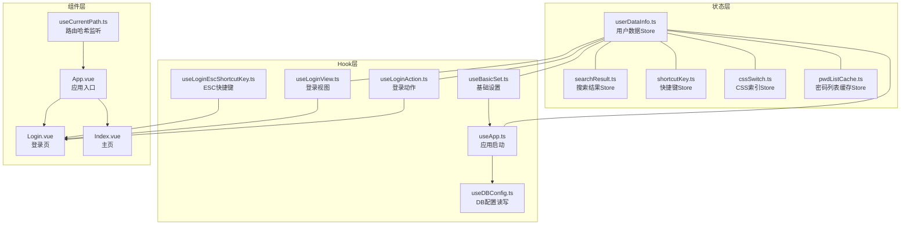
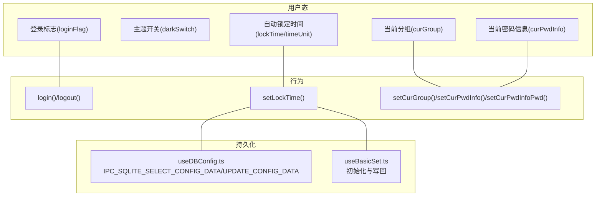
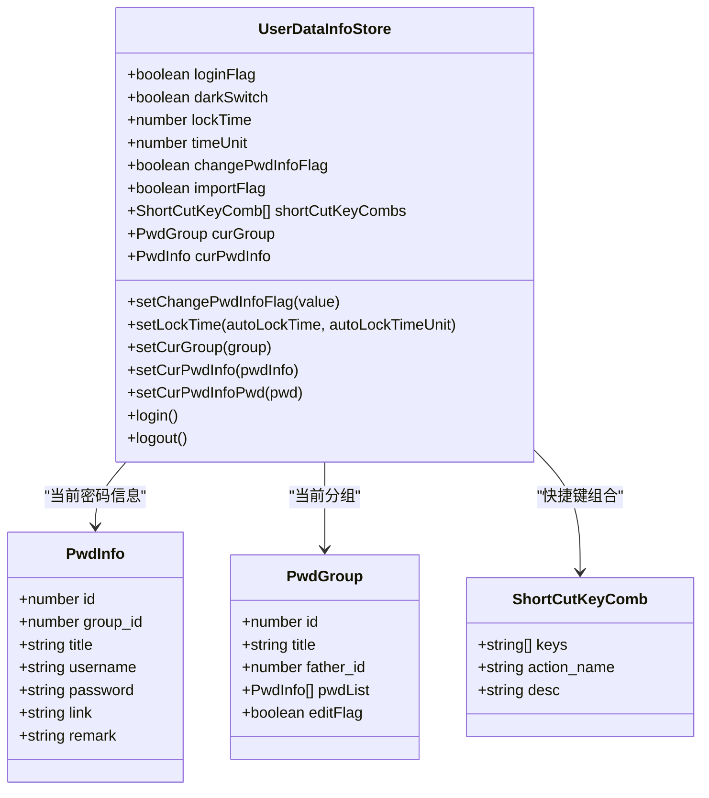
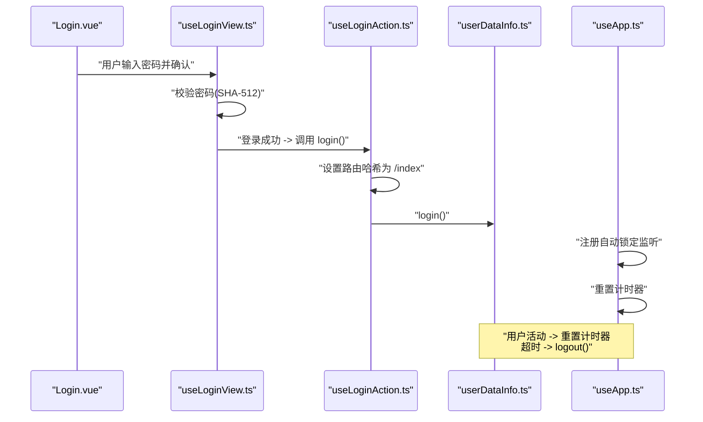
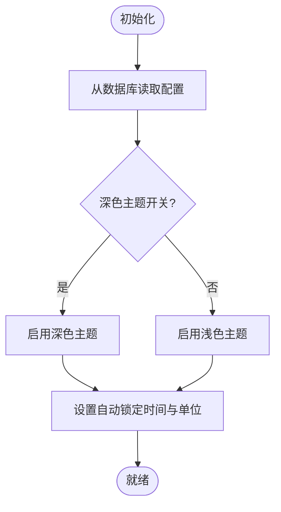
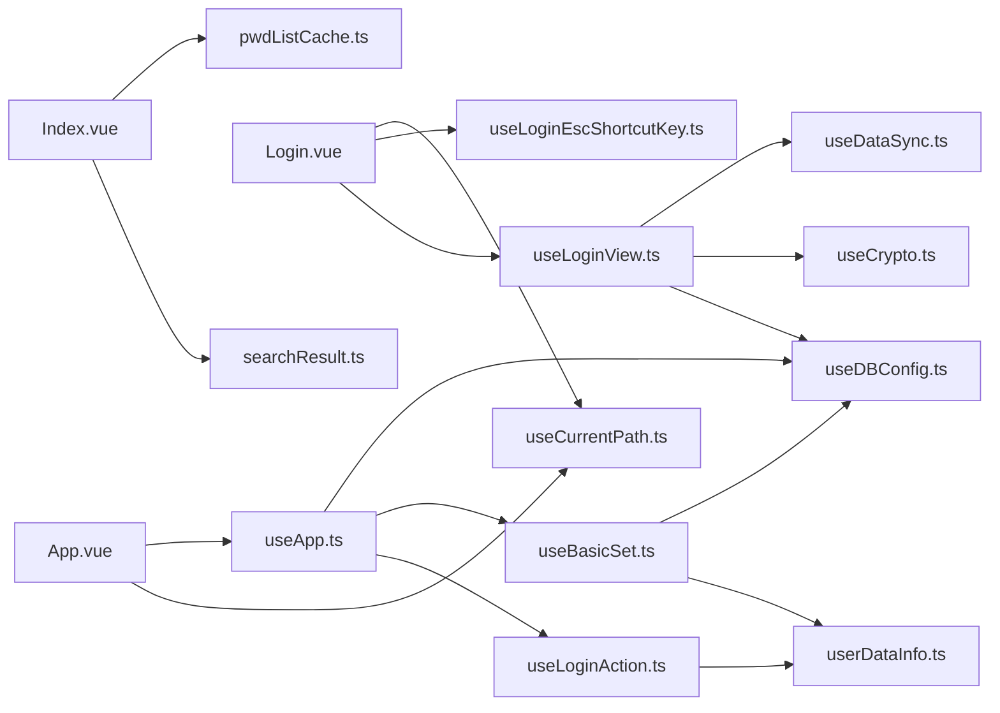

# 用户数据状态

<cite>
**本文引用的文件**
- [userDataInfo.ts](file://src/store/userDataInfo.ts)
- [useLoginAction.ts](file://src/hooks/useLoginAction.ts)
- [useBasicSet.ts](file://src/hooks/useBasicSet.ts)
- [useApp.ts](file://src/hooks/useApp.ts)
- [useDBConfig.ts](file://src/hooks/useDBConfig.ts)
- [useLoginView.ts](file://src/hooks/useLoginView.ts)
- [useLoginEscShortcutKey.ts](file://src/hooks/useLoginEscShortcutKey.ts)
- [type.ts](file://src/components/type.ts)
- [config.ts](file://src/config/config.ts)
- [Login.vue](file://src/components/Login.vue)
- [Index.vue](file://src/components/Index.vue)
- [App.vue](file://src/App.vue)
- [useCurrentPath.ts](file://src/hooks/useCurrentPath.ts)
- [searchResult.ts](file://src/store/searchResult.ts)
- [cssSwitch.ts](file://src/store/cssSwitch.ts)
- [pwdListCache.ts](file://src/store/pwdListCache.ts)
</cite>

## 目录
1. [简介](#简介)
2. [项目结构](#项目结构)
3. [核心组件](#核心组件)
4. [架构总览](#架构总览)
5. [详细组件分析](#详细组件分析)
6. [依赖关系分析](#依赖关系分析)
7. [性能考量](#性能考量)
8. [故障排查指南](#故障排查指南)
9. [结论](#结论)
10. [附录](#附录)

## 简介
本文件围绕用户数据状态管理进行系统化说明，重点覆盖以下方面：
- userDataInfoStore 的状态结构与职责边界
- 登录状态管理流程与生命周期
- 用户偏好设置（主题、自动锁定时间等）
- 当前选中项管理（当前分组、当前密码信息）
- 状态更新的 action 方法、初始化过程与持久化策略
- 状态同步机制与错误处理策略
- 提供状态流转图与时序图，帮助开发者快速定位问题与扩展功能

## 项目结构
用户数据状态相关的核心文件分布如下：
- 状态层：Pinia Store（用户数据、搜索结果、快捷键、CSS索引、密码列表缓存）
- Hook 层：业务逻辑封装（登录动作、基础设置、应用启动、数据库配置读写、登录视图、ESC 快捷键）
- 组件层：登录页、主页、应用入口
- 类型层：PwdInfo、PwdGroup、ShortCutKeyComb 等接口定义

图表来源
- [userDataInfo.ts:1-76](file://src/store/userDataInfo.ts#L1-L76)
- [searchResult.ts:1-49](file://src/store/searchResult.ts#L1-L49)
- [shortcutKey.ts:1-99](file://src/store/shortcutKey.ts#L1-L99)
- [cssSwitch.ts:1-17](file://src/store/cssSwitch.ts#L1-L17)
- [pwdListCache.ts:1-37](file://src/store/pwdListCache.ts#L1-L37)
- [useLoginAction.ts:1-19](file://src/hooks/useLoginAction.ts#L1-L19)
- [useBasicSet.ts:1-104](file://src/hooks/useBasicSet.ts#L1-L104)
- [useApp.ts:1-71](file://src/hooks/useApp.ts#L1-L71)
- [useDBConfig.ts:1-21](file://src/hooks/useDBConfig.ts#L1-L21)
- [useLoginView.ts:1-54](file://src/hooks/useLoginView.ts#L1-L54)
- [useLoginEscShortcutKey.ts:1-47](file://src/hooks/useLoginEscShortcutKey.ts#L1-L47)
- [Login.vue:1-129](file://src/components/Login.vue#L1-L129)
- [Index.vue:1-81](file://src/components/Index.vue#L1-L81)
- [App.vue:1-19](file://src/App.vue#L1-L19)
- [useCurrentPath.ts:1-44](file://src/hooks/useCurrentPath.ts#L1-L44)

章节来源
- [userDataInfo.ts:1-76](file://src/store/userDataInfo.ts#L1-L76)
- [useLoginAction.ts:1-19](file://src/hooks/useLoginAction.ts#L1-L19)
- [useBasicSet.ts:1-104](file://src/hooks/useBasicSet.ts#L1-L104)
- [useApp.ts:1-71](file://src/hooks/useApp.ts#L1-L71)
- [useDBConfig.ts:1-21](file://src/hooks/useDBConfig.ts#L1-L21)
- [useLoginView.ts:1-54](file://src/hooks/useLoginView.ts#L1-L54)
- [useLoginEscShortcutKey.ts:1-47](file://src/hooks/useLoginEscShortcutKey.ts#L1-L47)
- [Login.vue:1-129](file://src/components/Login.vue#L1-L129)
- [Index.vue:1-81](file://src/components/Index.vue#L1-L81)
- [App.vue:1-19](file://src/App.vue#L1-L19)
- [useCurrentPath.ts:1-44](file://src/hooks/useCurrentPath.ts#L1-L44)

## 核心组件
- 用户数据 Store（userDataInfoStore）
  - 状态字段：登录标志、主题开关、自动锁定时间、时间单位、修改密码信息标志、导入标志、快捷键组合、当前分组、当前密码信息
  - 行为方法：设置登录/登出、设置自动锁定时间、设置当前分组、设置当前密码信息及其子字段、设置修改密码信息标志
  - 初始化默认值：未登录、深色主题开启、默认锁定时间为60秒、时间单位为毫秒、空的当前分组与当前密码信息对象
- 登录动作 Hook（useLoginAction）
  - 提供 login/logout 方法，负责跳转路由哈希并调用 Store 的登录/登出
- 基础设置 Hook（useBasicSet）
  - 从数据库读取配置并初始化 Store 的自动锁定时间；提供修改锁定时间的方法，并持久化到数据库
- 应用启动 Hook（useApp）
  - 在挂载时设置主题、注册自动锁定事件监听、触发本地数据同步
- 登录视图 Hook（useLoginView）
  - 处理登录输入、Caps Lock 检测、密码校验（SHA-512），成功则执行登录与数据同步
- ESC 快捷键 Hook（useLoginEscShortcutKey）
  - 监听键盘组合，触发最小化窗口的 IPC 调用

章节来源
- [userDataInfo.ts:50-76](file://src/store/userDataInfo.ts#L50-L76)
- [useLoginAction.ts:4-19](file://src/hooks/useLoginAction.ts#L4-L19)
- [useBasicSet.ts:15-31](file://src/hooks/useBasicSet.ts#L15-L31)
- [useApp.ts:18-71](file://src/hooks/useApp.ts#L18-L71)
- [useLoginView.ts:10-54](file://src/hooks/useLoginView.ts#L10-L54)
- [useLoginEscShortcutKey.ts:4-47](file://src/hooks/useLoginEscShortcutKey.ts#L4-L47)

## 架构总览
用户数据状态管理采用 Pinia Store + Vue Hooks 的分层设计：
- Store 聚合用户偏好与当前选中项
- Hook 负责与数据库交互、事件监听与业务编排
- 组件通过 Hook 与 Store 协作，完成登录、主题切换、自动锁定、搜索结果与当前项管理

图表来源
- [userDataInfo.ts:6-48](file://src/store/userDataInfo.ts#L6-L48)
- [useBasicSet.ts:24-31](file://src/hooks/useBasicSet.ts#L24-L31)
- [useDBConfig.ts:6-18](file://src/hooks/useDBConfig.ts#L6-L18)

## 详细组件分析

### 用户数据 Store（userDataInfoStore）
- 状态结构
  - loginFlag：布尔，表示用户登录状态
  - darkSwitch：布尔，表示深色主题开关
  - lockTime：数字，自动锁定时间数值
  - timeUnit：数字，时间单位（毫秒/秒/分钟/小时）
  - changePwdInfoFlag：布尔，修改密码信息标志
  - importFlag：布尔，导入标志
  - shortCutKeyCombs：快捷键组合数组
  - curGroup：当前分组对象（包含 id、title）
  - curPwdInfo：当前密码信息对象（包含 id、group_id、title、username、password、link、remark）
- 初始化
  - 默认未登录、深色主题开启、lockTime=60、timeUnit=1000、curGroup/curPwdInfo 为空对象
- 行为方法
  - setChangePwdInfoFlag：设置修改密码信息标志
  - setLockTime：设置自动锁定时间与时间单位（带默认值与日志）
  - setCurGroup：设置当前分组（传入 null 时清空）
  - setCurPwdInfo：设置当前密码信息（传入 null 时清空）
  - setCurPwdInfoPwd：设置当前密码信息的密码字段
  - login/logout：切换登录状态

图表来源
- [userDataInfo.ts:50-76](file://src/store/userDataInfo.ts#L50-L76)
- [type.ts:50-88](file://src/components/type.ts#L50-L88)

章节来源
- [userDataInfo.ts:6-76](file://src/store/userDataInfo.ts#L6-L76)
- [type.ts:50-88](file://src/components/type.ts#L50-L88)

### 登录状态管理
- 登录流程
  - 登录视图 Hook 校验密码，成功后调用登录动作 Hook，后者设置路由哈希并调用 Store 的 login
  - 应用启动 Hook 注册自动锁定事件监听，重置计时器
- 登出流程
  - 登出动作 Hook 设置路由哈希并调用 Store 的 logout，同时关闭搜索视图并清空当前密码信息
- 自动锁定
  - useApp 监听鼠标移动、键盘按下、滚动事件，重置定时器；超时后自动调用 logout

图表来源
- [Login.vue:1-129](file://src/components/Login.vue#L1-L129)
- [useLoginView.ts:37-54](file://src/hooks/useLoginView.ts#L37-L54)
- [useLoginAction.ts:4-19](file://src/hooks/useLoginAction.ts#L4-L19)
- [userDataInfo.ts:41-46](file://src/store/userDataInfo.ts#L41-L46)
- [useApp.ts:54-68](file://src/hooks/useApp.ts#L54-L68)

章节来源
- [Login.vue:1-129](file://src/components/Login.vue#L1-L129)
- [useLoginView.ts:10-54](file://src/hooks/useLoginView.ts#L10-L54)
- [useLoginAction.ts:4-19](file://src/hooks/useLoginAction.ts#L4-L19)
- [useApp.ts:18-71](file://src/hooks/useApp.ts#L18-L71)

### 用户偏好设置与当前选中项管理
- 主题切换
  - 应用启动时根据数据库配置决定是否切换深色主题
- 自动锁定时间配置
  - 初始化：从数据库读取自动锁定时间与时间单位，写入 Store
  - 修改：通过基础设置 Hook 更新 Store 并持久化到数据库
- 当前分组与当前密码信息
  - setCurGroup：设置当前分组（id、title）
  - setCurPwdInfo：设置当前密码信息（合并对象）
  - setCurPwdInfoPwd：设置当前密码信息的密码字段
  - 搜索结果关闭时，清空当前密码信息并重置当前分组索引（由其他 Store 负责）

图表来源
- [useApp.ts:27-52](file://src/hooks/useApp.ts#L27-L52)
- [useBasicSet.ts:24-31](file://src/hooks/useBasicSet.ts#L24-L31)
- [useDBConfig.ts:6-18](file://src/hooks/useDBConfig.ts#L6-L18)

章节来源
- [useApp.ts:18-71](file://src/hooks/useApp.ts#L18-L71)
- [useBasicSet.ts:15-31](file://src/hooks/useBasicSet.ts#L15-L31)
- [useDBConfig.ts:1-21](file://src/hooks/useDBConfig.ts#L1-L21)

### 状态更新与持久化策略
- 登录状态
  - login/logout 直接更新 Store，不涉及数据库持久化
- 自动锁定时间
  - setLockTime 写入 Store 后，通过基础设置 Hook 将数值与单位写回数据库
- 主题开关
  - 应用启动时根据数据库配置切换主题；主题切换由外部逻辑控制，Store 仅保存开关状态
- 当前分组与当前密码信息
  - setCurGroup/setCurPwdInfo 仅更新内存状态；若需持久化，应结合业务在其他 Hook 中实现

章节来源
- [userDataInfo.ts:13-46](file://src/store/userDataInfo.ts#L13-L46)
- [useBasicSet.ts:67-72](file://src/hooks/useBasicSet.ts#L67-L72)
- [useDBConfig.ts:6-18](file://src/hooks/useDBConfig.ts#L6-L18)

### 状态同步机制与错误处理
- 状态同步
  - 登录成功后，登录视图 Hook 调用数据同步 Hook，确保本地与远端数据一致
  - 搜索结果关闭时，清空当前密码信息并重置当前分组索引（由其他 Store 负责）
- 错误处理
  - 登录失败：useLoginView 显示错误提示
  - 数据库读取失败：useDBConfig 对返回值进行判空处理
  - 自动锁定：超时自动登出，避免长时间无人操作导致的安全风险

章节来源
- [useLoginView.ts:39-50](file://src/hooks/useLoginView.ts#L39-L50)
- [useDBConfig.ts:6-18](file://src/hooks/useDBConfig.ts#L6-L18)
- [useApp.ts:54-68](file://src/hooks/useApp.ts#L54-L68)
- [searchResult.ts:17-37](file://src/store/searchResult.ts#L17-L37)

## 依赖关系分析
- 组件与 Hook 的依赖
  - App.vue 依赖 useCurrentPath 与 useApp
  - Login.vue 依赖 useLoginView、useLoginEscShortcutKey、useCurrentPath
  - Index.vue 依赖 useShortcutKey、usePwdListCacheStore、searchResult Store
- Hook 与 Store 的依赖
  - useLoginAction 依赖 userDataInfo Store
  - useBasicSet 依赖 userDataInfo Store 与 useDBConfig
  - useApp 依赖 useLoginAction、useBasicSet、useDBConfig、useDataSync
  - useLoginView 依赖 useCrypto、useDBConfig、useDataSync
- 类型依赖
  - PwdInfo、PwdGroup、ShortCutKeyComb 作为 Store 状态与行为的数据契约

图表来源
- [App.vue:1-19](file://src/App.vue#L1-L19)
- [useCurrentPath.ts:1-44](file://src/hooks/useCurrentPath.ts#L1-L44)
- [Login.vue:1-129](file://src/components/Login.vue#L1-L129)
- [Index.vue:1-81](file://src/components/Index.vue#L1-L81)
- [useLoginAction.ts:1-19](file://src/hooks/useLoginAction.ts#L1-L19)
- [useBasicSet.ts:1-104](file://src/hooks/useBasicSet.ts#L1-L104)
- [useDBConfig.ts:1-21](file://src/hooks/useDBConfig.ts#L1-L21)
- [useLoginView.ts:1-54](file://src/hooks/useLoginView.ts#L1-L54)

章节来源
- [App.vue:1-19](file://src/App.vue#L1-L19)
- [Login.vue:1-129](file://src/components/Login.vue#L1-L129)
- [Index.vue:1-81](file://src/components/Index.vue#L1-L81)
- [useLoginAction.ts:1-19](file://src/hooks/useLoginAction.ts#L1-L19)
- [useBasicSet.ts:1-104](file://src/hooks/useBasicSet.ts#L1-L104)
- [useDBConfig.ts:1-21](file://src/hooks/useDBConfig.ts#L1-L21)
- [useLoginView.ts:1-54](file://src/hooks/useLoginView.ts#L1-L54)

## 性能考量
- 自动锁定监听
  - 使用轻量级事件监听（mousemove、keydown、scroll），建议在不需要时移除监听，避免资源浪费
- Store 初始化
  - 仅在挂载时读取一次数据库配置，后续通过 action 更新内存状态，减少 IO 次数
- 搜索结果与当前项
  - 搜索结果关闭时清空当前密码信息，避免内存泄漏与不必要的渲染

## 故障排查指南
- 登录失败
  - 检查密码校验逻辑与数据库配置读取是否正常
  - 确认 SHA-512 哈希计算一致性
- 自动锁定无效
  - 检查事件监听是否正确注册与移除
  - 确认 getLockTime 返回的时间毫秒值正确
- 主题切换异常
  - 检查数据库配置值与 useDark 的状态同步
- 当前分组或密码信息未更新
  - 确认 setCurGroup/setCurPwdInfo 是否被调用且参数有效
  - 检查搜索结果关闭流程是否正确清空当前项

章节来源
- [useLoginView.ts:39-50](file://src/hooks/useLoginView.ts#L39-L50)
- [useApp.ts:54-68](file://src/hooks/useApp.ts#L54-L68)
- [useDBConfig.ts:6-18](file://src/hooks/useDBConfig.ts#L6-L18)
- [userDataInfo.ts:19-40](file://src/store/userDataInfo.ts#L19-L40)
- [searchResult.ts:17-37](file://src/store/searchResult.ts#L17-L37)

## 结论
用户数据状态管理通过清晰的 Store 分层与 Hook 编排，实现了登录状态、主题与自动锁定时间、当前选中项的有效管理。建议在现有基础上补充：
- 当前分组与当前密码信息的持久化写回
- 更完善的错误提示与日志记录
- 对自动锁定监听的生命周期管理（进入/离开页面时的注册与清理）

## 附录
- 代码示例路径（不展示具体代码内容）
  - 登录状态切换：[useLoginAction.ts:7-16](file://src/hooks/useLoginAction.ts#L7-L16)
  - 自动锁定时间设置：[useBasicSet.ts:62-72](file://src/hooks/useBasicSet.ts#L62-L72)
  - 当前分组设置：[userDataInfo.ts:19-27](file://src/store/userDataInfo.ts#L19-L27)
  - 当前密码信息设置：[userDataInfo.ts:29-40](file://src/store/userDataInfo.ts#L29-L40)
  - 主题切换初始化：[useApp.ts:27-52](file://src/hooks/useApp.ts#L27-L52)
  - 搜索结果关闭与当前项清空：[searchResult.ts:17-37](file://src/store/searchResult.ts#L17-L37)