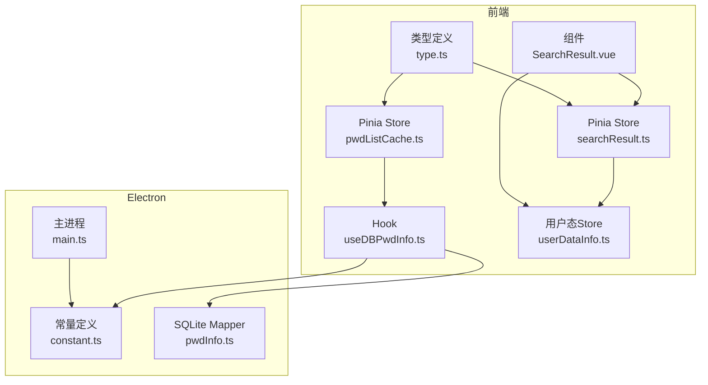
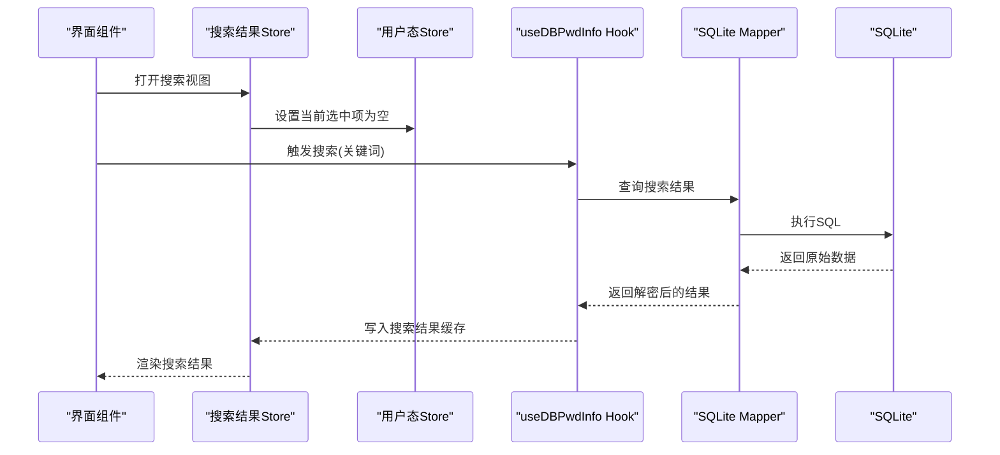
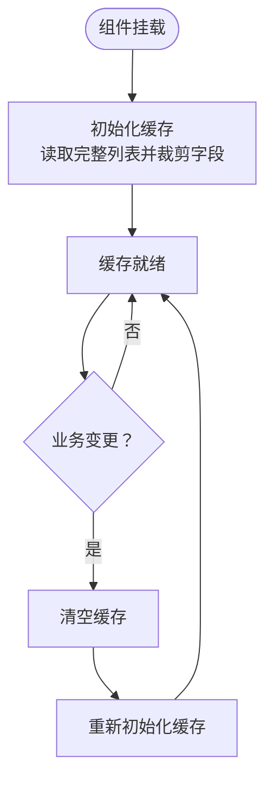
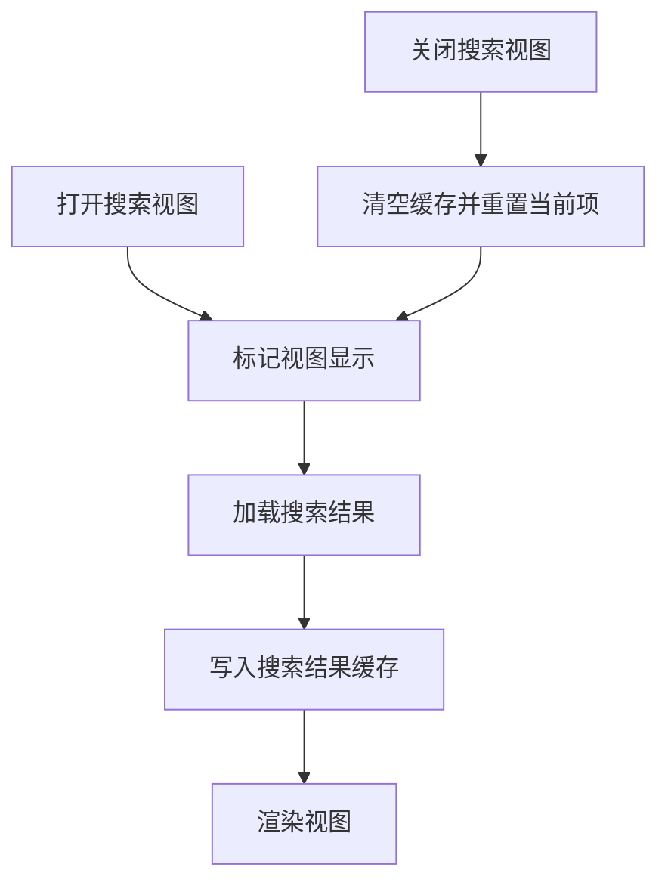
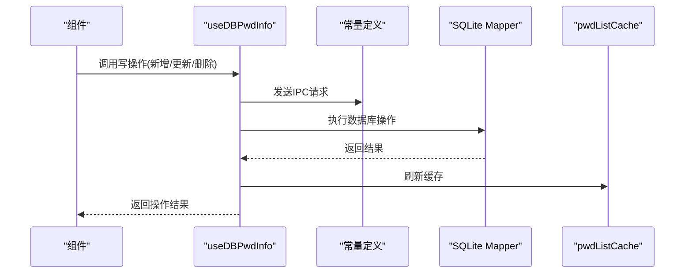
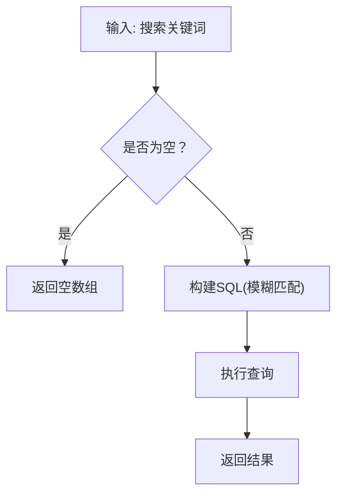
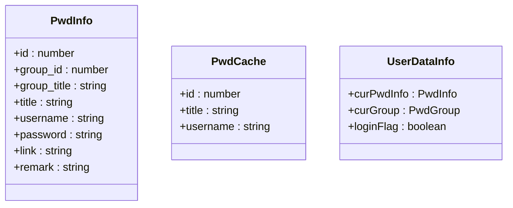
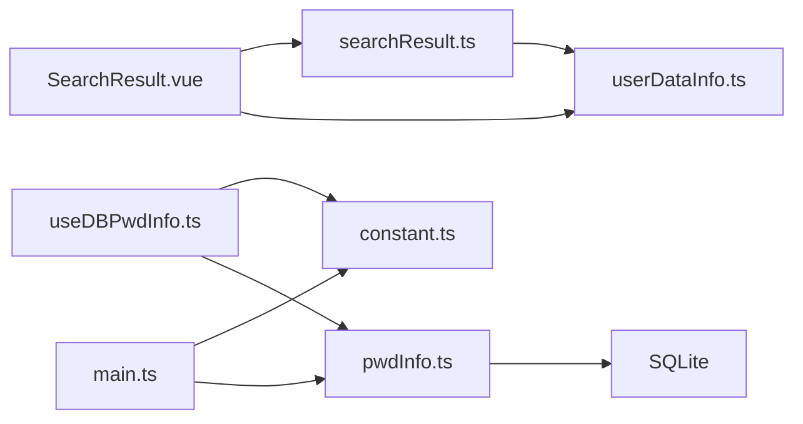

# 缓存状态管理

<cite>
**本文引用的文件**
- [src/store/pwdListCache.ts](file://src/store/pwdListCache.ts)
- [src/store/searchResult.ts](file://src/store/searchResult.ts)
- [src/hooks/useDBPwdInfo.ts](file://src/hooks/useDBPwdInfo.ts)
- [electron/db/sqlite/mapper/pwdInfo.ts](file://electron/db/sqlite/mapper/pwdInfo.ts)
- [src/components/type.ts](file://src/components/type.ts)
- [src/store/userDataInfo.ts](file://src/store/userDataInfo.ts)
- [src/components/indexview/SearchResult.vue](file://src/components/indexview/SearchResult.vue)
- [src/main.ts](file://src/main.ts)
- [src/config/config.ts](file://src/config/config.ts)
- [electron/constant.ts](file://electron/constant.ts)
- [electron/main.ts](file://electron/main.ts)
</cite>

## 目录
1. [简介](#简介)
2. [项目结构](#项目结构)
3. [核心组件](#核心组件)
4. [架构总览](#架构总览)
5. [详细组件分析](#详细组件分析)
6. [依赖关系分析](#依赖关系分析)
7. [性能考量](#性能考量)
8. [故障排查指南](#故障排查指南)
9. [结论](#结论)
10. [附录](#附录)

## 简介
本文件系统性梳理密码管理应用中的缓存状态管理体系，重点覆盖以下方面：
- 密码列表缓存机制：缓存结构、初始化与刷新策略
- 搜索结果缓存策略：视图级缓存、清空与更新逻辑
- 缓存失效规则：基于业务变更的主动刷新
- 生命周期管理：挂载初始化、视图打开/关闭、数据更新
- 内存优化策略：字段裁剪、按需加载、及时清空
- 缓存一致性保证：加密解密链路、数据库读取一致性
- 数据存储结构：缓存模型与实体模型的差异
- 更新与清理机制：插入/更新/删除后的刷新流程
- 最佳实践与性能监控：命中率优化、异常处理与故障恢复

## 项目结构
本项目采用前端状态管理与后端数据库交互分离的架构：
- 前端使用 Pinia 管理缓存状态，Vue 组件负责渲染与交互
- 业务层通过 Hook 封装 IPC 调用，统一进行缓存刷新
- Electron 主进程负责 SQLite 初始化与 IPC 注册
- 类型定义集中于组件类型文件，确保前后端一致

**图表来源**
- [src/store/pwdListCache.ts](file://src/store/pwdListCache.ts)
- [src/store/searchResult.ts](file://src/store/searchResult.ts)
- [src/hooks/useDBPwdInfo.ts](file://src/hooks/useDBPwdInfo.ts)
- [src/components/indexview/SearchResult.vue](file://src/components/indexview/SearchResult.vue)
- [src/store/userDataInfo.ts](file://src/store/userDataInfo.ts)
- [src/components/type.ts](file://src/components/type.ts)
- [electron/constant.ts](file://electron/constant.ts)
- [electron/main.ts](file://electron/main.ts)
- [electron/db/sqlite/mapper/pwdInfo.ts](file://electron/db/sqlite/mapper/pwdInfo.ts)

**章节来源**
- [src/main.ts](file://src/main.ts)
- [electron/main.ts](file://electron/main.ts)

## 核心组件
- 密码列表缓存 Store：负责密码列表的轻量缓存与刷新
- 搜索结果 Store：负责搜索视图的数据缓存与清空
- 数据访问 Hook：封装数据库操作与缓存刷新
- SQLite Mapper：提供数据库查询与更新能力
- 类型定义：明确缓存模型与实体模型字段

**章节来源**
- [src/store/pwdListCache.ts](file://src/store/pwdListCache.ts)
- [src/store/searchResult.ts](file://src/store/searchResult.ts)
- [src/hooks/useDBPwdInfo.ts](file://src/hooks/useDBPwdInfo.ts)
- [electron/db/sqlite/mapper/pwdInfo.ts](file://electron/db/sqlite/mapper/pwdInfo.ts)
- [src/components/type.ts](file://src/components/type.ts)

## 架构总览
缓存状态管理贯穿“UI -> Store/Hook -> IPC -> SQLite”的调用链路，并在关键业务操作后执行缓存刷新，确保缓存与数据库一致。

**图表来源**
- [src/store/searchResult.ts](file://src/store/searchResult.ts)
- [src/store/userDataInfo.ts](file://src/store/userDataInfo.ts)
- [src/hooks/useDBPwdInfo.ts](file://src/hooks/useDBPwdInfo.ts)
- [electron/db/sqlite/mapper/pwdInfo.ts](file://electron/db/sqlite/mapper/pwdInfo.ts)

## 详细组件分析

### 密码列表缓存（pwdListCache）
- 缓存结构：仅缓存必要字段，降低内存占用
- 初始化：组件挂载时从数据库加载并裁剪字段
- 刷新：所有增删改操作后统一调用刷新函数重建缓存
- 生命周期：随组件挂载初始化，无显式销毁逻辑

**图表来源**
- [src/store/pwdListCache.ts](file://src/store/pwdListCache.ts)
- [src/hooks/useDBPwdInfo.ts](file://src/hooks/useDBPwdInfo.ts)

**章节来源**
- [src/store/pwdListCache.ts](file://src/store/pwdListCache.ts)
- [src/components/type.ts](file://src/components/type.ts)
- [src/hooks/useDBPwdInfo.ts](file://src/hooks/useDBPwdInfo.ts)

### 搜索结果缓存（searchResult）
- 视图级缓存：仅在搜索视图打开期间持有数据
- 清空策略：关闭视图时清空缓存并重置当前选中项
- 更新策略：设置新结果前先清空旧数据，避免脏数据残留
- 行内更新：支持按 ID 更新标题，保持与数据库同步

**图表来源**
- [src/store/searchResult.ts](file://src/store/searchResult.ts)
- [src/store/userDataInfo.ts](file://src/store/userDataInfo.ts)
- [src/components/indexview/SearchResult.vue](file://src/components/indexview/SearchResult.vue)

**章节来源**
- [src/store/searchResult.ts](file://src/store/searchResult.ts)
- [src/store/userDataInfo.ts](file://src/store/userDataInfo.ts)
- [src/components/indexview/SearchResult.vue](file://src/components/indexview/SearchResult.vue)

### 数据访问与缓存刷新（useDBPwdInfo）
- 统一封装：对插入、更新、删除、查询、计数等操作进行封装
- 刷新触发：所有写操作后调用缓存刷新函数
- 解密链路：查询返回后进行批量解密，再交由上层使用

**图表来源**
- [src/hooks/useDBPwdInfo.ts](file://src/hooks/useDBPwdInfo.ts)
- [electron/constant.ts](file://electron/constant.ts)
- [electron/db/sqlite/mapper/pwdInfo.ts](file://electron/db/sqlite/mapper/pwdInfo.ts)
- [src/store/pwdListCache.ts](file://src/store/pwdListCache.ts)

**章节来源**
- [src/hooks/useDBPwdInfo.ts](file://src/hooks/useDBPwdInfo.ts)
- [electron/constant.ts](file://electron/constant.ts)
- [electron/db/sqlite/mapper/pwdInfo.ts](file://electron/db/sqlite/mapper/pwdInfo.ts)

### SQLite 查询与过滤（pwdInfo Mapper）
- 查询接口：按分组、搜索关键词、ID 列表、计数等维度查询
- 参数化：防止 SQL 注入，提升安全性
- 过滤与校验：对非法 ID 进行过滤，避免错误查询

**图表来源**
- [electron/db/sqlite/mapper/pwdInfo.ts](file://electron/db/sqlite/mapper/pwdInfo.ts)

**章节来源**
- [electron/db/sqlite/mapper/pwdInfo.ts](file://electron/db/sqlite/mapper/pwdInfo.ts)

### 类型与数据模型
- 实体模型（PwdInfo）：包含完整字段，用于展示与编辑
- 缓存模型（PwdCache）：仅包含轻量字段，用于列表快速渲染
- 用户态模型（userDataInfo）：维护当前选中项与全局状态

**图表来源**
- [src/components/type.ts](file://src/components/type.ts)

**章节来源**
- [src/components/type.ts](file://src/components/type.ts)

## 依赖关系分析
- 组件依赖：SearchResult.vue 依赖搜索结果 Store 与用户态 Store
- Store 依赖：pwdListCache 依赖 useDBPwdInfo；searchResult 依赖 userDataInfo
- Hook 依赖：useDBPwdInfo 依赖常量定义与 SQLite Mapper
- 主进程依赖：Electron 主进程注册 IPC 并初始化数据库

**图表来源**
- [src/components/indexview/SearchResult.vue](file://src/components/indexview/SearchResult.vue)
- [src/store/searchResult.ts](file://src/store/searchResult.ts)
- [src/store/userDataInfo.ts](file://src/store/userDataInfo.ts)
- [src/hooks/useDBPwdInfo.ts](file://src/hooks/useDBPwdInfo.ts)
- [electron/constant.ts](file://electron/constant.ts)
- [electron/db/sqlite/mapper/pwdInfo.ts](file://electron/db/sqlite/mapper/pwdInfo.ts)
- [electron/main.ts](file://electron/main.ts)

**章节来源**
- [src/components/indexview/SearchResult.vue](file://src/components/indexview/SearchResult.vue)
- [src/store/searchResult.ts](file://src/store/searchResult.ts)
- [src/store/userDataInfo.ts](file://src/store/userDataInfo.ts)
- [src/hooks/useDBPwdInfo.ts](file://src/hooks/useDBPwdInfo.ts)
- [electron/constant.ts](file://electron/constant.ts)
- [electron/db/sqlite/mapper/pwdInfo.ts](file://electron/db/sqlite/mapper/pwdInfo.ts)
- [electron/main.ts](file://electron/main.ts)

## 性能考量
- 字段裁剪：缓存仅保存必要字段，减少内存占用与序列化成本
- 按需加载：搜索视图关闭即清空缓存，避免长期驻留
- 批量解密：在 Hook 层统一解密，避免重复计算
- 参数化查询：防止注入并提升查询稳定性
- 刷新策略：写操作后统一刷新，避免细粒度更新导致的复杂性

[本节为通用性能指导，无需特定文件引用]

## 故障排查指南
- 搜索结果为空
  - 检查 Hook 的搜索接口是否正确传参与返回
  - 确认 Mapper 的 SQL 是否正确执行
  - 核对搜索视图 Store 的清空与写入逻辑
- 列表不刷新
  - 确认写操作后是否调用了缓存刷新函数
  - 检查初始化是否在组件挂载时执行
- 当前选中项异常
  - 检查关闭视图时是否清空了当前项
  - 确认行内更新是否按 ID 正确定位

**章节来源**
- [src/store/searchResult.ts](file://src/store/searchResult.ts)
- [src/hooks/useDBPwdInfo.ts](file://src/hooks/useDBPwdInfo.ts)
- [electron/db/sqlite/mapper/pwdInfo.ts](file://electron/db/sqlite/mapper/pwdInfo.ts)

## 结论
本缓存状态管理体系通过“轻量缓存 + 主动刷新”的策略，在保证一致性的同时兼顾性能与可维护性。密码列表缓存以字段裁剪与统一刷新为核心，搜索结果缓存以视图生命周期为边界，配合 Hook 的统一刷新与 Mapper 的参数化查询，形成清晰、可控的缓存闭环。

[本节为总结性内容，无需特定文件引用]

## 附录

### 缓存状态生命周期与控制流
- 初始化：组件挂载时从数据库加载并裁剪字段
- 使用：渲染列表或搜索结果
- 刷新：写操作后重建缓存
- 清空：关闭视图或无数据时清空缓存

**章节来源**
- [src/store/pwdListCache.ts](file://src/store/pwdListCache.ts)
- [src/store/searchResult.ts](file://src/store/searchResult.ts)

### 缓存一致性与数据流
- 读取：Hook 通过 IPC 调用 Mapper，返回解密后的实体数据
- 写入：Hook 执行数据库更新后触发缓存刷新
- 渲染：组件消费 Store 数据，保持 UI 与数据一致

**章节来源**
- [src/hooks/useDBPwdInfo.ts](file://src/hooks/useDBPwdInfo.ts)
- [electron/db/sqlite/mapper/pwdInfo.ts](file://electron/db/sqlite/mapper/pwdInfo.ts)

### 最佳实践与优化建议
- 优先使用缓存模型进行列表渲染，实体模型仅在详情页使用
- 写操作必须调用刷新，避免脏缓存
- 搜索视图应严格遵循打开/关闭生命周期，及时清空缓存
- 对高频操作进行批量处理，减少频繁刷新
- 监控缓存命中率与内存占用，结合业务场景调整缓存大小

[本节为通用指导，无需特定文件引用]