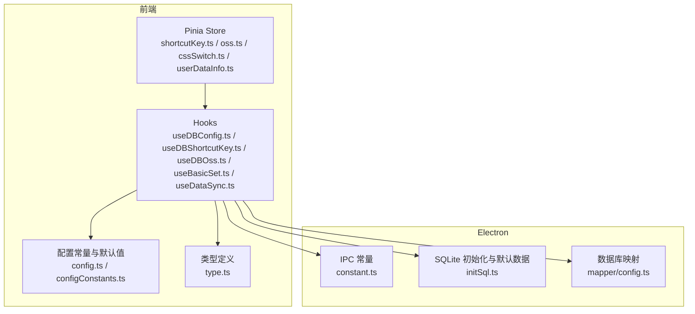
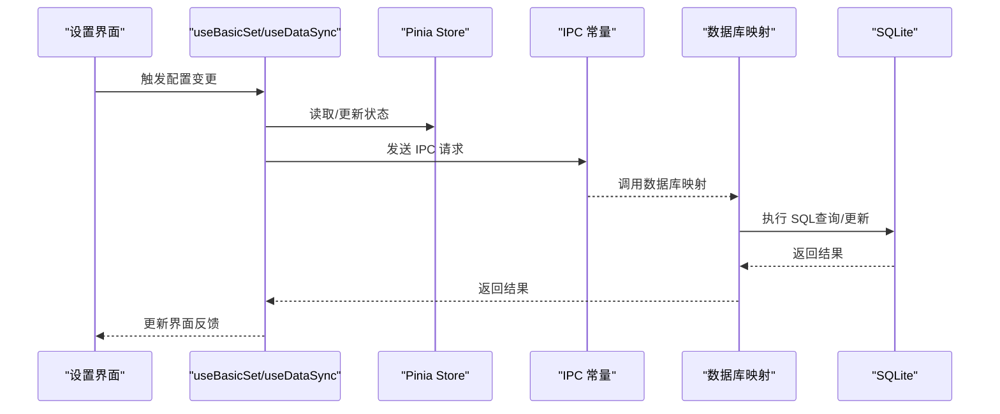
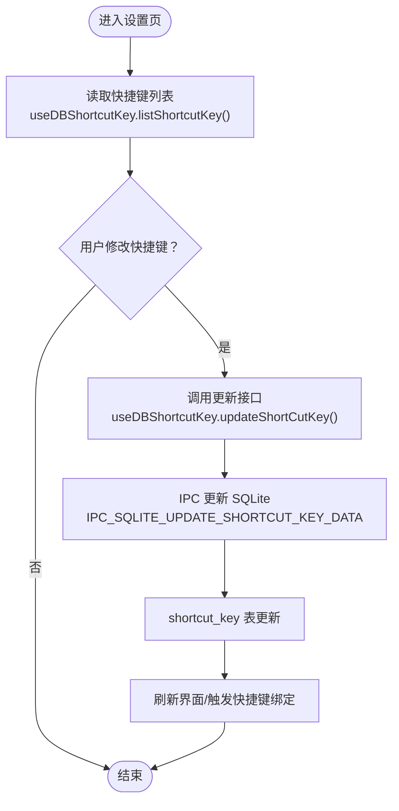
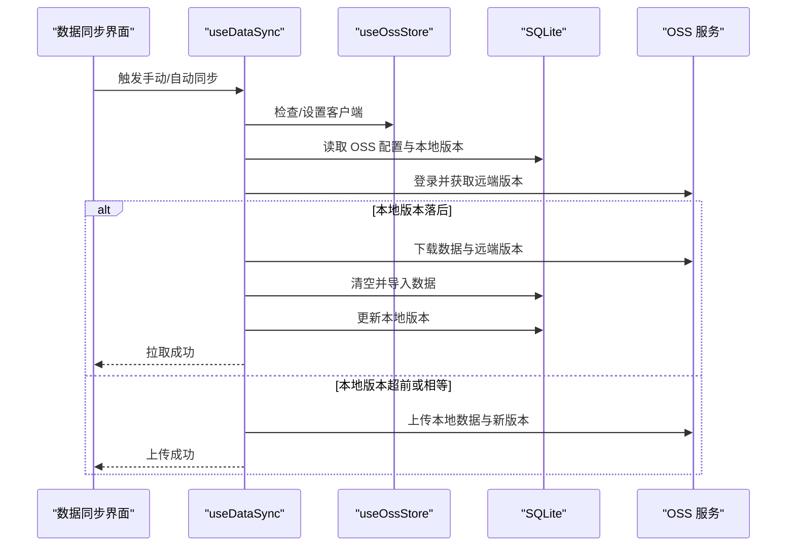
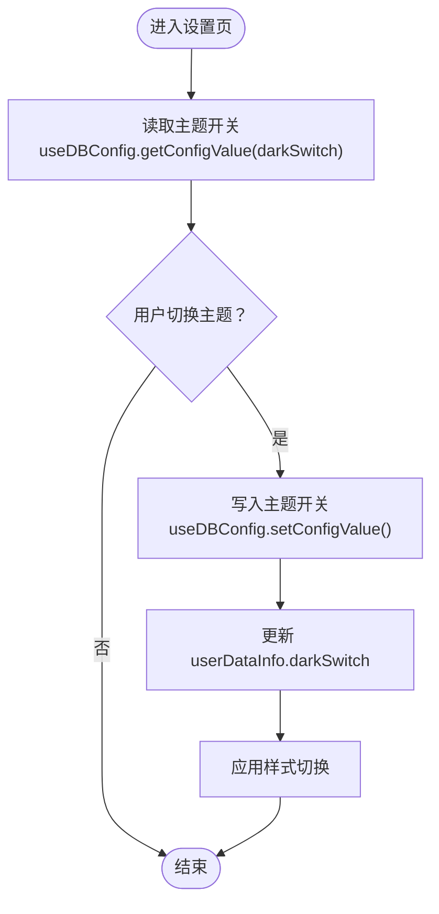
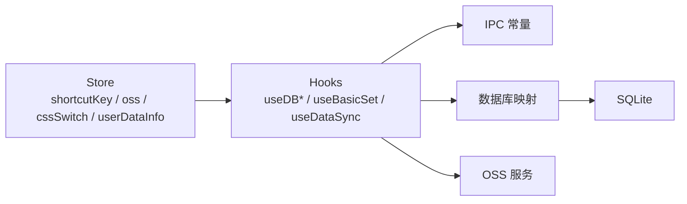

# 配置状态管理

<cite>
**本文引用的文件**
- [src/store/shortcutKey.ts](file://src/store/shortcutKey.ts)
- [src/store/oss.ts](file://src/store/oss.ts)
- [src/store/cssSwitch.ts](file://src/store/cssSwitch.ts)
- [src/store/userDataInfo.ts](file://src/store/userDataInfo.ts)
- [src/config/config.ts](file://src/config/config.ts)
- [electron/db/sqlite/components/configConstants.ts](file://electron/db/sqlite/components/configConstants.ts)
- [electron/db/sqlite/mapper/config.ts](file://electron/db/sqlite/mapper/config.ts)
- [electron/db/sqlite/components/initSql.ts](file://electron/db/sqlite/components/initSql.ts)
- [src/hooks/useDBConfig.ts](file://src/hooks/useDBConfig.ts)
- [src/hooks/useDBShortcutKey.ts](file://src/hooks/useDBShortcutKey.ts)
- [src/hooks/useDBOss.ts](file://src/hooks/useDBOss.ts)
- [src/hooks/useBasicSet.ts](file://src/hooks/useBasicSet.ts)
- [src/hooks/useDataSync.ts](file://src/hooks/useDataSync.ts)
- [src/components/type.ts](file://src/components/type.ts)
- [electron/constant.ts](file://electron/constant.ts)
</cite>

## 目录
1. [简介](#简介)
2. [项目结构](#项目结构)
3. [核心组件](#核心组件)
4. [架构总览](#架构总览)
5. [详细组件分析](#详细组件分析)
6. [依赖分析](#依赖分析)
7. [性能考虑](#性能考虑)
8. [故障排查指南](#故障排查指南)
9. [结论](#结论)
10. [附录](#附录)

## 简介
本文件系统性阐述本项目的“配置状态管理”机制，覆盖三类配置状态：
- 快捷键配置状态：包含默认快捷键组合、运行时编辑与持久化。
- OSS 云存储配置状态：包含 OSS 基础配置、版本同步策略、自动/手动同步流程与冲突处理。
- 主题切换状态：包含深色/浅色模式开关与界面状态。

文档将从初始化流程、动态更新机制、验证规则、存储格式与默认值、迁移策略、持久化与跨设备同步等方面展开，并提供可视化图示与实践建议。

## 项目结构
围绕配置状态管理的关键目录与文件如下：
- 前端状态与配置
  - Pinia Store：快捷键、OSS 时间戳、CSS 切换、用户数据信息
  - 配置常量与默认值：默认快捷键、主题开关、自动锁屏时间等
  - 类型定义：配置项、快捷键组合、OSS 表单等
  - Hooks：数据库读写封装（配置、快捷键、OSS）
- Electron 层
  - SQLite 初始化与默认数据插入
  - IPC 常量与数据库映射
- 数据同步
  - 数据同步 Hook：自动/手动同步、版本对比、冲突处理

图表来源
- [src/store/shortcutKey.ts:1-99](file://src/store/shortcutKey.ts#L1-L99)
- [src/store/oss.ts:1-59](file://src/store/oss.ts#L1-L59)
- [src/store/cssSwitch.ts:1-17](file://src/store/cssSwitch.ts#L1-L17)
- [src/store/userDataInfo.ts:1-76](file://src/store/userDataInfo.ts#L1-L76)
- [src/hooks/useDBConfig.ts:1-21](file://src/hooks/useDBConfig.ts#L1-L21)
- [src/hooks/useDBShortcutKey.ts:1-17](file://src/hooks/useDBShortcutKey.ts#L1-L17)
- [src/hooks/useDBOss.ts:1-17](file://src/hooks/useDBOss.ts#L1-L17)
- [src/hooks/useBasicSet.ts:1-104](file://src/hooks/useBasicSet.ts#L1-L104)
- [src/hooks/useDataSync.ts:1-324](file://src/hooks/useDataSync.ts#L1-L324)
- [src/config/config.ts:1-143](file://src/config/config.ts#L1-L143)
- [electron/db/sqlite/components/configConstants.ts:1-29](file://electron/db/sqlite/components/configConstants.ts#L1-L29)
- [electron/db/sqlite/components/initSql.ts:1-224](file://electron/db/sqlite/components/initSql.ts#L1-L224)
- [electron/db/sqlite/mapper/config.ts:1-27](file://electron/db/sqlite/mapper/config.ts#L1-L27)
- [src/components/type.ts:1-88](file://src/components/type.ts#L1-L88)
- [electron/constant.ts:1-63](file://electron/constant.ts#L1-L63)

章节来源
- [src/store/shortcutKey.ts:1-99](file://src/store/shortcutKey.ts#L1-L99)
- [src/store/oss.ts:1-59](file://src/store/oss.ts#L1-L59)
- [src/store/cssSwitch.ts:1-17](file://src/store/cssSwitch.ts#L1-L17)
- [src/store/userDataInfo.ts:1-76](file://src/store/userDataInfo.ts#L1-L76)
- [src/config/config.ts:1-143](file://src/config/config.ts#L1-L143)
- [electron/db/sqlite/components/configConstants.ts:1-29](file://electron/db/sqlite/components/configConstants.ts#L1-L29)
- [electron/db/sqlite/components/initSql.ts:1-224](file://electron/db/sqlite/components/initSql.ts#L1-L224)
- [src/hooks/useDBConfig.ts:1-21](file://src/hooks/useDBConfig.ts#L1-L21)
- [src/hooks/useDBShortcutKey.ts:1-17](file://src/hooks/useDBShortcutKey.ts#L1-L17)
- [src/hooks/useDBOss.ts:1-17](file://src/hooks/useDBOss.ts#L1-L17)
- [src/hooks/useBasicSet.ts:1-104](file://src/hooks/useBasicSet.ts#L1-L104)
- [src/hooks/useDataSync.ts:1-324](file://src/hooks/useDataSync.ts#L1-L324)
- [src/components/type.ts:1-88](file://src/components/type.ts#L1-L88)
- [electron/constant.ts:1-63](file://electron/constant.ts#L1-L63)

## 核心组件
- 快捷键配置状态
  - 默认快捷键来源于配置常量，运行时可通过 Store 初始化与更新；变更通过 Hook 触发 IPC 更新 SQLite。
- OSS 云存储配置状态
  - 包含 OSS 基础配置与版本字段；提供自动/手动同步、版本对比与冲突处理；Store 中维护最近更新/上传时间戳。
- 主题切换状态
  - 通过用户数据 Store 维护深色/浅色模式开关；与全局样式联动。

章节来源
- [src/store/shortcutKey.ts:16-99](file://src/store/shortcutKey.ts#L16-L99)
- [src/store/oss.ts:4-59](file://src/store/oss.ts#L4-L59)
- [src/store/userDataInfo.ts:50-76](file://src/store/userDataInfo.ts#L50-L76)
- [src/config/config.ts:24-34](file://src/config/config.ts#L24-L34)
- [electron/db/sqlite/components/configConstants.ts:9-18](file://electron/db/sqlite/components/configConstants.ts#L9-L18)

## 架构总览
配置状态管理采用“前端 Pinia Store + Electron IPC + SQLite”的分层设计：
- 前端负责状态与交互逻辑
- IPC 将请求转发至主进程数据库操作
- SQLite 作为本地持久化存储
- OSS 作为远端同步介质，配合版本字段实现冲突检测与处理

图表来源
- [src/hooks/useBasicSet.ts:15-104](file://src/hooks/useBasicSet.ts#L15-L104)
- [src/hooks/useDataSync.ts:19-324](file://src/hooks/useDataSync.ts#L19-L324)
- [electron/constant.ts:12-45](file://electron/constant.ts#L12-L45)
- [electron/db/sqlite/mapper/config.ts:8-20](file://electron/db/sqlite/mapper/config.ts#L8-L20)

## 详细组件分析

### 快捷键配置状态
- 初始化
  - Store 在 state 中提供默认快捷键组合数组，包含动作名、按键描述与拆分后的按键数组。
  - Hook 提供列出与更新快捷键的接口，通过 IPC 查询与更新 SQLite。
- 动态更新
  - 用户在设置界面修改快捷键后，调用更新接口，触发 IPC 更新对应记录。
- 验证规则
  - 前端未见显式快捷键合法性校验逻辑，建议在设置界面增加按键组合冲突检测与非法组合提示。
- 存储格式与默认值
  - SQLite 表 shortcut_key 存储 action_name 与 desc（按键描述），初始化时插入默认值。
- 迁移策略
  - 新增快捷键动作时，在初始化脚本中追加默认值，保持向后兼容。

图表来源
- [src/hooks/useDBShortcutKey.ts:6-14](file://src/hooks/useDBShortcutKey.ts#L6-L14)
- [electron/constant.ts:43-45](file://electron/constant.ts#L43-L45)
- [electron/db/sqlite/components/initSql.ts:185-207](file://electron/db/sqlite/components/initSql.ts#L185-L207)
- [src/store/shortcutKey.ts:19-36](file://src/store/shortcutKey.ts#L19-L36)

章节来源
- [src/store/shortcutKey.ts:16-99](file://src/store/shortcutKey.ts#L16-L99)
- [src/hooks/useDBShortcutKey.ts:1-17](file://src/hooks/useDBShortcutKey.ts#L1-17)
- [electron/db/sqlite/components/initSql.ts:185-207](file://electron/db/sqlite/components/initSql.ts#L185-L207)
- [electron/constant.ts:43-45](file://electron/constant.ts#L43-L45)

### OSS 云存储配置状态
- 初始化
  - SQLite 初始化时插入 OSS 类型记录（如阿里云、腾讯云），并提供默认空值占位。
- 动态更新
  - 通过 Hook 获取与更新 OSS 配置，写入 SQLite 对应记录。
- 验证规则
  - 同步前校验 OSS 参数完整性；登录失败按错误码分类提示。
- 存储格式与默认值
  - OSS 配置存储于 oss 表，包含 type、region、keyId、key_secret、bucket。
  - 初始化时插入默认空值记录，便于后续填充。
- 迁移策略
  - 新增 OSS 类型时，在初始化脚本中追加记录，保持向后兼容。
- 同步机制与冲突处理
  - 使用本地版本字段与远端版本文件进行对比，决定是否拉取或上传。
  - 上传前递增本地版本，上传后写回远端版本文件。
  - 当远端版本大于等于本地版本时，阻止上传并提示先拉取。

图表来源
- [src/hooks/useDataSync.ts:40-201](file://src/hooks/useDataSync.ts#L40-L201)
- [src/store/oss.ts:4-59](file://src/store/oss.ts#L4-L59)
- [electron/db/sqlite/components/initSql.ts:152-160](file://electron/db/sqlite/components/initSql.ts#L152-L160)
- [src/hooks/useDBOss.ts:5-14](file://src/hooks/useDBOss.ts#L5-L14)

章节来源
- [src/hooks/useDataSync.ts:19-324](file://src/hooks/useDataSync.ts#L19-L324)
- [src/store/oss.ts:1-59](file://src/store/oss.ts#L1-L59)
- [electron/db/sqlite/components/initSql.ts:152-160](file://electron/db/sqlite/components/initSql.ts#L152-L160)
- [src/hooks/useDBOss.ts:1-17](file://src/hooks/useDBOss.ts#L1-L17)

### 主题切换状态
- 初始化
  - 用户数据 Store 提供深色/浅色模式开关，默认启用深色模式。
- 动态更新
  - 通过设置界面切换，更新 Store 状态并与全局样式联动。
- 存储格式与默认值
  - 主题开关存储于 config 表，初始化时写入默认值。
- 迁移策略
  - 新增主题相关配置时，在初始化脚本中追加默认值。

图表来源
- [src/store/userDataInfo.ts:50-76](file://src/store/userDataInfo.ts#L50-L76)
- [src/hooks/useDBConfig.ts:6-18](file://src/hooks/useDBConfig.ts#L6-L18)
- [electron/db/sqlite/components/initSql.ts:164-183](file://electron/db/sqlite/components/initSql.ts#L164-L183)
- [electron/db/sqlite/components/configConstants.ts:9-10](file://electron/db/sqlite/components/configConstants.ts#L9-L10)

章节来源
- [src/store/userDataInfo.ts:1-76](file://src/store/userDataInfo.ts#L1-L76)
- [src/hooks/useDBConfig.ts:1-21](file://src/hooks/useDBConfig.ts#L1-L21)
- [electron/db/sqlite/components/initSql.ts:164-183](file://electron/db/sqlite/components/initSql.ts#L164-L183)
- [electron/db/sqlite/components/configConstants.ts:9-10](file://electron/db/sqlite/components/configConstants.ts#L9-L10)

## 依赖分析
- 组件耦合
  - Store 与 Hooks 解耦，Store 仅维护状态，业务逻辑集中在 Hooks。
  - IPC 常量集中管理，便于统一维护与扩展。
- 外部依赖
  - Electron IPC 与 SQLite 驱动，OSS SDK（通过 Hook 封装）。
- 可能的循环依赖
  - 未发现直接循环依赖；各模块职责清晰。

图表来源
- [src/store/shortcutKey.ts:1-99](file://src/store/shortcutKey.ts#L1-L99)
- [src/store/oss.ts:1-59](file://src/store/oss.ts#L1-L59)
- [src/store/cssSwitch.ts:1-17](file://src/store/cssSwitch.ts#L1-L17)
- [src/store/userDataInfo.ts:1-76](file://src/store/userDataInfo.ts#L1-L76)
- [src/hooks/useDBConfig.ts:1-21](file://src/hooks/useDBConfig.ts#L1-L21)
- [src/hooks/useDBShortcutKey.ts:1-17](file://src/hooks/useDBShortcutKey.ts#L1-L17)
- [src/hooks/useDBOss.ts:1-17](file://src/hooks/useDBOss.ts#L1-L17)
- [src/hooks/useBasicSet.ts:1-104](file://src/hooks/useBasicSet.ts#L1-L104)
- [src/hooks/useDataSync.ts:1-324](file://src/hooks/useDataSync.ts#L1-L324)
- [electron/constant.ts:1-63](file://electron/constant.ts#L1-L63)
- [electron/db/sqlite/mapper/config.ts:1-27](file://electron/db/sqlite/mapper/config.ts#L1-L27)

章节来源
- [electron/constant.ts:1-63](file://electron/constant.ts#L1-L63)
- [electron/db/sqlite/mapper/config.ts:1-27](file://electron/db/sqlite/mapper/config.ts#L1-L27)

## 性能考虑
- 快捷键更新
  - 建议在设置界面增加按键组合冲突检测，减少无效 IPC 调用。
- OSS 同步
  - 上传/下载采用一次性全量替换策略，建议在大数据量场景下引入增量同步与差异合并。
  - 版本对比与文件读写应异步执行，避免阻塞主线程。
- 主题切换
  - 样式切换应尽量使用 CSS 变量与轻量级切换，避免频繁重排。

## 故障排查指南
- 快捷键无法保存
  - 检查 IPC 常量与数据库映射是否匹配；确认 Hook 的更新接口返回值。
- OSS 同步失败
  - 根据错误码判断：桶/跨域/Region 配置问题、KeyId/KeySecret 错误、权限不足等。
  - 确认 OSS 配置完整且版本字段有效。
- 主题切换无效
  - 检查 Store 状态更新与样式应用链路是否正常。

章节来源
- [src/hooks/useDataSync.ts:300-320](file://src/hooks/useDataSync.ts#L300-L320)
- [src/hooks/useDBShortcutKey.ts:11-14](file://src/hooks/useDBShortcutKey.ts#L11-L14)
- [electron/db/sqlite/mapper/config.ts:8-20](file://electron/db/sqlite/mapper/config.ts#L8-L20)

## 结论
本项目的配置状态管理以 Pinia Store 为核心，结合 Electron IPC 与 SQLite 实现本地持久化，OSS 作为远端同步介质。通过初始化脚本与配置常量确保默认值与兼容性，通过 Hooks 封装数据库访问，简化了前端与主进程交互。建议在快捷键与 OSS 同步环节补充更完善的校验与冲突处理策略，以提升用户体验与系统稳定性。

## 附录
- 配置项与默认值对照
  - 快捷键默认值：参见配置常量与初始化脚本中的默认快捷键条目。
  - 主题开关：默认启用深色模式。
  - 自动锁屏时间：默认 60 秒，单位毫秒。
  - OSS 同步开关：默认关闭，自动上传/下载默认开启。
- 迁移策略
  - 新增配置项时，在初始化脚本中追加默认值，确保旧版本升级后仍可用。
- 跨设备同步方案
  - 建议以 OSS 为唯一可信源，设备间通过版本字段与全量导入/导出实现同步；在大规模数据场景下引入增量同步与冲突合并策略。