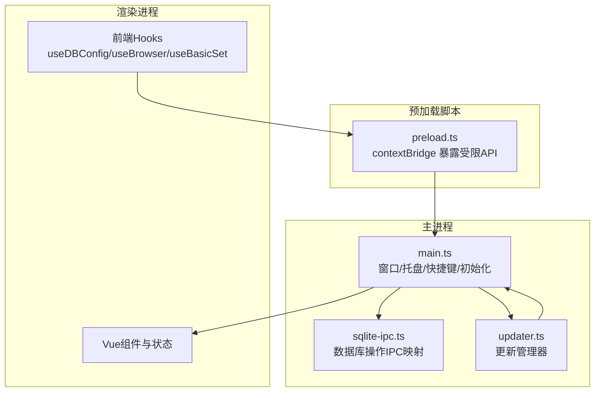
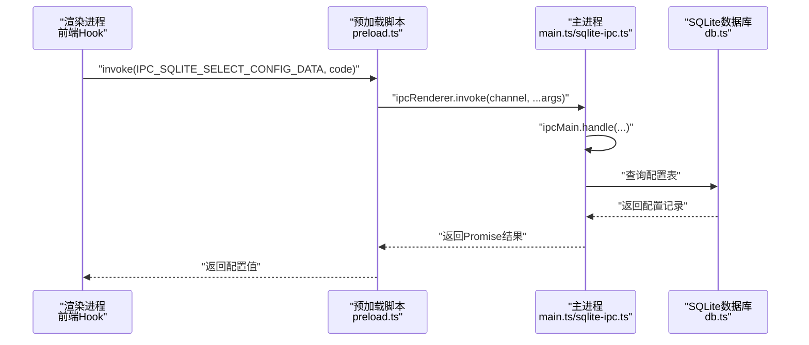
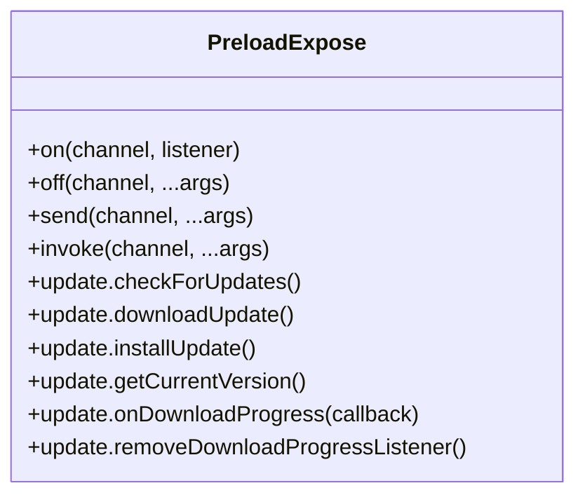
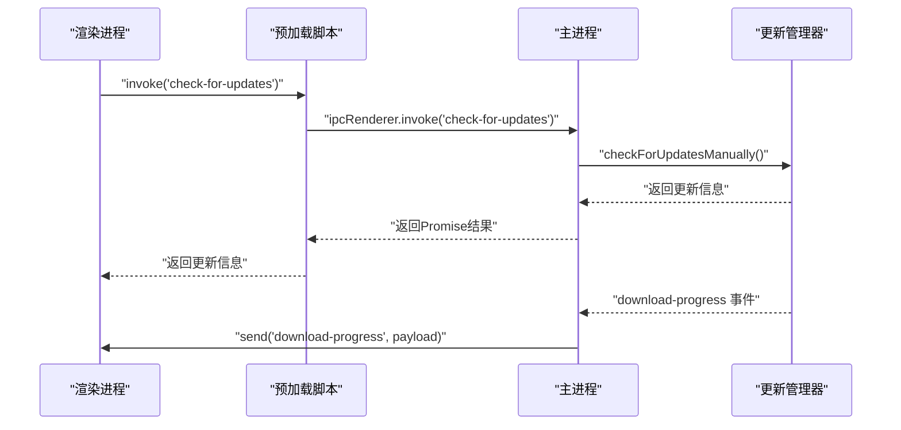
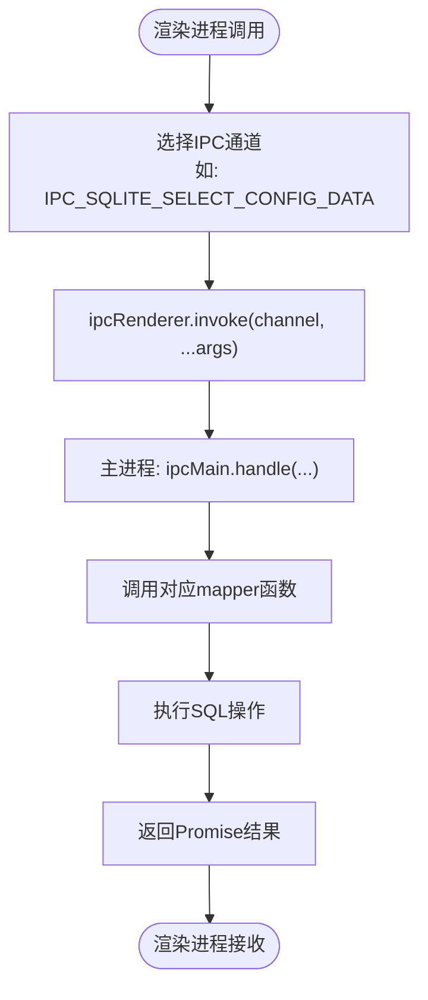
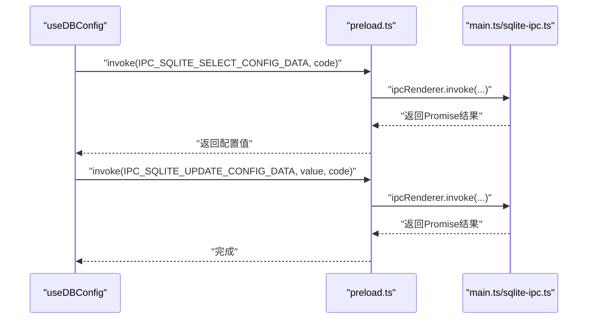
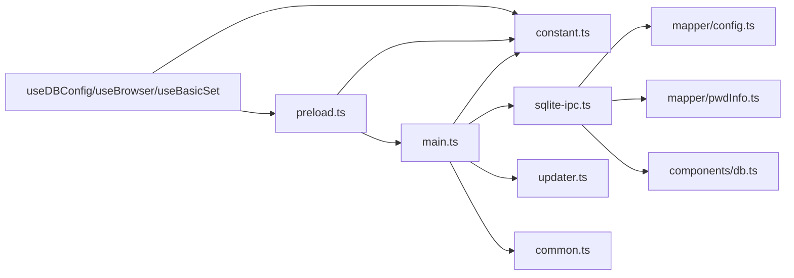

# IPC通信机制

<cite>
**本文引用的文件**
- [electron/main.ts](file://electron/main.ts)
- [electron/preload.ts](file://electron/preload.ts)
- [electron/constant.ts](file://electron/constant.ts)
- [electron/common.ts](file://electron/common.ts)
- [electron/db/sqlite/sqlite-ipc.ts](file://electron/db/sqlite/sqlite-ipc.ts)
- [electron/db/sqlite/components/db.ts](file://electron/db/sqlite/components/db.ts)
- [electron/db/sqlite/mapper/config.ts](file://electron/db/sqlite/mapper/config.ts)
- [electron/db/sqlite/mapper/pwdInfo.ts](file://electron/db/sqlite/mapper/pwdInfo.ts)
- [electron/updater.ts](file://electron/updater.ts)
- [src/hooks/useDBConfig.ts](file://src/hooks/useDBConfig.ts)
- [src/hooks/useBrowser.ts](file://src/hooks/useBrowser.ts)
- [src/hooks/useBasicSet.ts](file://src/hooks/useBasicSet.ts)
- [src/config/config.ts](file://src/config/config.ts)
</cite>

## 目录
1. [简介](#简介)
2. [项目结构](#项目结构)
3. [核心组件](#核心组件)
4. [架构总览](#架构总览)
5. [详细组件分析](#详细组件分析)
6. [依赖关系分析](#依赖关系分析)
7. [性能考量](#性能考量)
8. [故障排查指南](#故障排查指南)
9. [结论](#结论)
10. [附录](#附录)

## 简介
本文件系统性梳理密码管理器的 Electron IPC 通信机制，覆盖主进程与渲染进程之间的消息传递协议、数据序列化与安全边界、预加载脚本的安全作用与上下文桥接、API 暴露机制、消息类型与参数传递、异步处理模式、错误处理与超时管理、安全沙箱与权限控制、数据验证、通信性能优化、批量操作与实时同步策略等内容。目标是帮助开发者与运维人员快速理解并正确使用 IPC。

## 项目结构
- 主进程入口负责窗口创建、托盘菜单、全局快捷键、SQLite 初始化、更新管理以及 IPC 事件注册。
- 预加载脚本通过上下文桥接仅暴露受控的 ipcRenderer API，并封装更新相关的便捷方法。
- SQLite IPC 将数据库操作映射为 IPC 消息，统一由主进程处理，渲染进程通过 invoke/send 与主进程交互。
- 更新模块基于 electron-updater，主进程监听更新事件并向渲染进程广播下载进度。
- 前端 Hook 层通过常量定义的 IPC 通道与主进程交互，实现配置读取/写入、浏览器打开、自动启动等功能。

图表来源
- [electron/main.ts:1-240](file://electron/main.ts#L1-L240)
- [electron/preload.ts:1-39](file://electron/preload.ts#L1-L39)
- [electron/db/sqlite/sqlite-ipc.ts:1-220](file://electron/db/sqlite/sqlite-ipc.ts#L1-L220)
- [electron/updater.ts:1-204](file://electron/updater.ts#L1-L204)

章节来源
- [electron/main.ts:1-240](file://electron/main.ts#L1-L240)
- [electron/preload.ts:1-39](file://electron/preload.ts#L1-L39)
- [electron/db/sqlite/sqlite-ipc.ts:1-220](file://electron/db/sqlite/sqlite-ipc.ts#L1-L220)
- [electron/updater.ts:1-204](file://electron/updater.ts#L1-L204)

## 核心组件
- 主进程入口与生命周期管理：创建窗口、注册托盘菜单、初始化 SQLite 表、注册全局快捷键、设置更新检查、监听窗口关闭事件。
- 预加载脚本与上下文桥接：通过 contextBridge.exposeInMainWorld 暴露受限的 ipcRenderer API，包括 on/off/send/invoke，并封装更新相关便捷方法。
- SQLite IPC：将数据库 CRUD、搜索、计数、导入等操作映射为 IPC 通道，主进程统一处理，渲染进程通过 invoke 获取返回值。
- 更新管理器：封装 electron-updater 的检查、下载、安装流程，向渲染进程广播下载进度事件。
- 前端 Hooks：集中调用 IPC，实现配置读取/写入、打开外部链接、自动启动等业务功能。

章节来源
- [electron/main.ts:1-240](file://electron/main.ts#L1-L240)
- [electron/preload.ts:1-39](file://electron/preload.ts#L1-L39)
- [electron/db/sqlite/sqlite-ipc.ts:1-220](file://electron/db/sqlite/sqlite-ipc.ts#L1-L220)
- [electron/updater.ts:1-204](file://electron/updater.ts#L1-L204)
- [src/hooks/useDBConfig.ts:1-21](file://src/hooks/useDBConfig.ts#L1-L21)
- [src/hooks/useBrowser.ts:1-13](file://src/hooks/useBrowser.ts#L1-L13)
- [src/hooks/useBasicSet.ts:1-104](file://src/hooks/useBasicSet.ts#L1-L104)

## 架构总览
- 通信模型：渲染进程通过 window.ipcRenderer.invoke 或 send 与主进程通信；主进程通过 ipcMain.handle 注册处理器；更新事件通过主进程向渲染进程广播。
- 数据流：前端 Hook 调用 IPC -> 预加载脚本转发 -> 主进程处理器 -> 数据库/系统能力 -> 返回结果或事件。
- 安全边界：预加载脚本仅暴露必要 API，避免直接暴露完整 ipcRenderer；数据库连接路径位于用户目录，减少跨进程共享敏感对象。

图表来源
- [electron/preload.ts:1-39](file://electron/preload.ts#L1-L39)
- [electron/db/sqlite/sqlite-ipc.ts:1-220](file://electron/db/sqlite/sqlite-ipc.ts#L1-L220)
- [electron/db/sqlite/components/db.ts:1-30](file://electron/db/sqlite/components/db.ts#L1-L30)
- [src/hooks/useDBConfig.ts:1-21](file://src/hooks/useDBConfig.ts#L1-L21)

## 详细组件分析

### 预加载脚本与上下文桥接
- 作用：通过 contextBridge.exposeInMainWorld 将受限的 ipcRenderer API 暴露到渲染进程的 window 对象，仅暴露 on/off/send/invoke，并封装更新相关便捷方法。
- 安全性：限制了渲染进程直接访问 Electron 的全部 API，降低 XSS 和越权风险；仅允许通过受控通道进行 IPC 通信。
- 便捷方法：封装 check-for-updates/download-update/install-update/get-current-version 以及下载进度监听。

图表来源
- [electron/preload.ts:1-39](file://electron/preload.ts#L1-L39)

章节来源
- [electron/preload.ts:1-39](file://electron/preload.ts#L1-L39)

### 主进程IPC处理器与消息协议
- 系统级IPC：最小化/最大化/关闭窗口、打开浏览器、开发工具、开机自启、首次登录等。
- 更新IPC：检查更新、下载更新、安装更新、获取当前版本；主进程通过事件向渲染进程广播下载进度。
- SQLite IPC：按功能域划分通道（config/group/pwdInfo/shortcutKey/oss/version），统一使用 ipcMain.handle 处理异步请求。

图表来源
- [electron/main.ts:202-227](file://electron/main.ts#L202-L227)
- [electron/updater.ts:38-97](file://electron/updater.ts#L38-L97)

章节来源
- [electron/main.ts:149-200](file://electron/main.ts#L149-L200)
- [electron/main.ts:202-227](file://electron/main.ts#L202-L227)
- [electron/updater.ts:1-204](file://electron/updater.ts#L1-L204)

### SQLite IPC与数据访问
- 通道命名规范：以 ipc-sqlite 开头，区分 insert/select/update/delete/count/search/import 等操作。
- 处理器实现：主进程通过 ipcMain.handle 绑定通道，调用对应 mapper 函数执行 SQL 操作，返回 Promise 结果。
- 数据访问：mapper 使用 baseSql 封装的通用 SQL 方法，db.ts 提供 better-sqlite3 实例，数据库文件位于用户目录。

图表来源
- [electron/db/sqlite/sqlite-ipc.ts:1-220](file://electron/db/sqlite/sqlite-ipc.ts#L1-L220)
- [electron/db/sqlite/mapper/config.ts:1-27](file://electron/db/sqlite/mapper/config.ts#L1-L27)
- [electron/db/sqlite/components/db.ts:1-30](file://electron/db/sqlite/components/db.ts#L1-L30)

章节来源
- [electron/db/sqlite/sqlite-ipc.ts:1-220](file://electron/db/sqlite/sqlite-ipc.ts#L1-L220)
- [electron/db/sqlite/mapper/config.ts:1-27](file://electron/db/sqlite/mapper/config.ts#L1-L27)
- [electron/db/sqlite/mapper/pwdInfo.ts:1-100](file://electron/db/sqlite/mapper/pwdInfo.ts#L1-L100)
- [electron/db/sqlite/components/db.ts:1-30](file://electron/db/sqlite/components/db.ts#L1-L30)

### 前端Hook与IPC调用示例
- 配置读取/写入：通过 useDBConfig 调用 IPC_SQLITE_SELECT_CONFIG_DATA 与 IPC_SQLITE_UPDATE_CONFIG_DATA。
- 打开浏览器：通过 useBrowser 调用 IPC_OPEN_BROWSER。
- 自动启动：通过 useBasicSet 调用 IPC_AUTO_START 并写入配置。

图表来源
- [src/hooks/useDBConfig.ts:1-21](file://src/hooks/useDBConfig.ts#L1-L21)
- [electron/preload.ts:1-39](file://electron/preload.ts#L1-L39)
- [electron/db/sqlite/sqlite-ipc.ts:1-220](file://electron/db/sqlite/sqlite-ipc.ts#L1-L220)

章节来源
- [src/hooks/useDBConfig.ts:1-21](file://src/hooks/useDBConfig.ts#L1-L21)
- [src/hooks/useBrowser.ts:1-13](file://src/hooks/useBrowser.ts#L1-L13)
- [src/hooks/useBasicSet.ts:1-104](file://src/hooks/useBasicSet.ts#L1-L104)

### 错误处理与超时管理
- 主进程异常：更新检查与下载过程通过 try/catch 包裹，错误事件通过主进程 emit/error 传播。
- 渲染进程异常：前端 Hook 中对返回值进行空值判断与默认值处理，避免未定义导致的逻辑错误。
- 超时策略：当前代码未显式设置超时时间；建议在预加载脚本或调用侧引入超时包装器，防止长时间阻塞。

章节来源
- [electron/main.ts:205-211](file://electron/main.ts#L205-L211)
- [electron/updater.ts:178-185](file://electron/updater.ts#L178-L185)
- [src/hooks/useDBConfig.ts:6-13](file://src/hooks/useDBConfig.ts#L6-L13)

### 安全沙箱与权限控制
- 预加载脚本最小暴露：仅暴露 on/off/send/invoke 与更新相关便捷方法，避免渲染进程直接访问敏感 API。
- 通道命名与职责分离：按功能域划分 IPC 通道，便于审计与权限控制。
- 数据库路径隔离：数据库文件位于用户目录，减少跨进程共享敏感资源的风险。
- 外部链接与系统能力：通过 IPC 间接调用系统能力（如打开浏览器、全局快捷键），避免渲染进程直接操作。

章节来源
- [electron/preload.ts:1-39](file://electron/preload.ts#L1-L39)
- [electron/common.ts:1-56](file://electron/common.ts#L1-L56)
- [electron/db/sqlite/components/db.ts:10-12](file://electron/db/sqlite/components/db.ts#L10-L12)

### 数据序列化与参数传递
- 参数传递：渲染进程通过 invoke/send 传递任意 JSON 可序列化参数；主进程处理器接收并解包。
- 返回值：invoke 返回 Promise，主进程处理器返回 Promise 结果；send 用于无返回值事件。
- 数据验证：mapper 层对输入参数进行过滤与校验（如 listPwdInfoByIds 对 ID 数组进行过滤），确保 SQL 查询安全。

章节来源
- [electron/db/sqlite/mapper/pwdInfo.ts:71-83](file://electron/db/sqlite/mapper/pwdInfo.ts#L71-L83)
- [electron/preload.ts:13-20](file://electron/preload.ts#L13-L20)

### 异步处理模式与实时同步
- 异步模式：统一采用 invoke/send + ipcMain.handle 的异步模式，避免阻塞 UI。
- 实时同步：更新进度通过主进程向渲染进程广播 download-progress 事件，实现进度实时反馈。
- 批量操作：listPwdInfoByIds 支持批量查询，构建占位符并一次性查询，减少往返次数。

章节来源
- [electron/updater.ts:74-89](file://electron/updater.ts#L74-L89)
- [electron/db/sqlite/mapper/pwdInfo.ts:71-83](file://electron/db/sqlite/mapper/pwdInfo.ts#L71-L83)

## 依赖关系分析
- 主进程依赖：Electron 核心 API、better-sqlite3、electron-updater、全局快捷键与托盘菜单。
- 预加载脚本依赖：contextBridge、ipcRenderer。
- SQLite IPC 依赖：各 mapper 与 baseSql 封装。
- 前端 Hook 依赖：常量定义的 IPC 通道名。

图表来源
- [electron/main.ts:1-240](file://electron/main.ts#L1-L240)
- [electron/preload.ts:1-39](file://electron/preload.ts#L1-L39)
- [electron/constant.ts:1-63](file://electron/constant.ts#L1-L63)
- [electron/db/sqlite/sqlite-ipc.ts:1-220](file://electron/db/sqlite/sqlite-ipc.ts#L1-L220)
- [electron/db/sqlite/mapper/config.ts:1-27](file://electron/db/sqlite/mapper/config.ts#L1-L27)
- [electron/db/sqlite/mapper/pwdInfo.ts:1-100](file://electron/db/sqlite/mapper/pwdInfo.ts#L1-L100)
- [electron/db/sqlite/components/db.ts:1-30](file://electron/db/sqlite/components/db.ts#L1-L30)
- [src/hooks/useDBConfig.ts:1-21](file://src/hooks/useDBConfig.ts#L1-L21)
- [src/hooks/useBrowser.ts:1-13](file://src/hooks/useBrowser.ts#L1-L13)
- [src/hooks/useBasicSet.ts:1-104](file://src/hooks/useBasicSet.ts#L1-L104)

章节来源
- [electron/main.ts:1-240](file://electron/main.ts#L1-L240)
- [electron/preload.ts:1-39](file://electron/preload.ts#L1-L39)
- [electron/constant.ts:1-63](file://electron/constant.ts#L1-L63)
- [electron/db/sqlite/sqlite-ipc.ts:1-220](file://electron/db/sqlite/sqlite-ipc.ts#L1-L220)
- [electron/db/sqlite/mapper/config.ts:1-27](file://electron/db/sqlite/mapper/config.ts#L1-L27)
- [electron/db/sqlite/mapper/pwdInfo.ts:1-100](file://electron/db/sqlite/mapper/pwdInfo.ts#L1-L100)
- [electron/db/sqlite/components/db.ts:1-30](file://electron/db/sqlite/components/db.ts#L1-L30)
- [src/hooks/useDBConfig.ts:1-21](file://src/hooks/useDBConfig.ts#L1-L21)
- [src/hooks/useBrowser.ts:1-13](file://src/hooks/useBrowser.ts#L1-L13)
- [src/hooks/useBasicSet.ts:1-104](file://src/hooks/useBasicSet.ts#L1-L104)

## 性能考量
- 减少往返次数：批量查询（如 listPwdInfoByIds）通过一次性 SQL 查询减少 IPC 往返。
- 数据库连接复用：db.ts 缓存 better-sqlite3 实例，避免重复创建连接。
- 事件驱动更新：下载进度通过事件推送，避免轮询造成的 CPU 占用。
- 建议优化：为高频 IPC 调用引入超时与重试策略；对大结果集分页或懒加载；对频繁变更的数据使用本地缓存与增量同步。

章节来源
- [electron/db/sqlite/mapper/pwdInfo.ts:71-83](file://electron/db/sqlite/mapper/pwdInfo.ts#L71-L83)
- [electron/db/sqlite/components/db.ts:16-23](file://electron/db/sqlite/components/db.ts#L16-L23)
- [electron/updater.ts:74-89](file://electron/updater.ts#L74-L89)

## 故障排查指南
- 无法打开浏览器：检查 IPC_OPEN_BROWSER 是否正确传参，确认主进程 shell.openExternal 是否被调用。
- 配置读取为空：确认 IPC_SQLITE_SELECT_CONFIG_DATA 返回值非空，前端 Hook 中对空值进行默认处理。
- 更新检查失败：查看主进程更新事件回调与错误日志，确认 feed 地址与网络连通性。
- 下载进度不显示：确认主进程向渲染进程发送 download-progress 事件，预加载脚本 update.onDownloadProgress 是否正确绑定。

章节来源
- [electron/main.ts:162-165](file://electron/main.ts#L162-L165)
- [src/hooks/useDBConfig.ts:6-13](file://src/hooks/useDBConfig.ts#L6-L13)
- [electron/updater.ts:38-49](file://electron/updater.ts#L38-L49)
- [electron/preload.ts:31-37](file://electron/preload.ts#L31-L37)

## 结论
本项目的 IPC 通信以“预加载脚本桥接 + 主进程处理器 + 数据库/系统能力”为核心架构，通过严格的通道命名与最小 API 暴露实现安全边界，结合异步 invoke 模式与事件推送实现高效、实时的通信体验。建议在现有基础上进一步完善超时与重试、批量与分页策略、以及更细粒度的权限控制与审计日志，以提升稳定性与可观测性。

## 附录
- 常用IPC通道（节选）
  - 系统控制：最小化、最大化/还原、关闭窗口、打开浏览器、开发工具、开机自启、首次登录
  - 更新：检查更新、下载更新、安装更新、获取当前版本、下载进度
  - SQLite：配置读取/更新、分组增删改查、密码信息增删改查、搜索与计数、导入、快捷键读取/更新、OSS配置读取/更新、自动检查更新开关读取/更新

章节来源
- [electron/constant.ts:12-63](file://electron/constant.ts#L12-L63)
- [electron/main.ts:149-200](file://electron/main.ts#L149-L200)
- [electron/main.ts:202-227](file://electron/main.ts#L202-L227)
- [electron/db/sqlite/sqlite-ipc.ts:58-219](file://electron/db/sqlite/sqlite-ipc.ts#L58-L219)