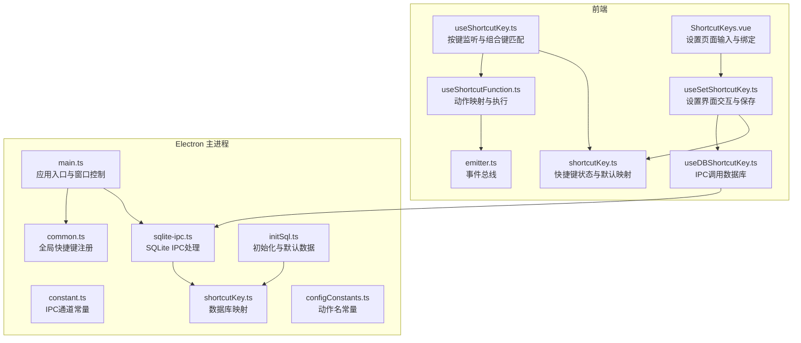
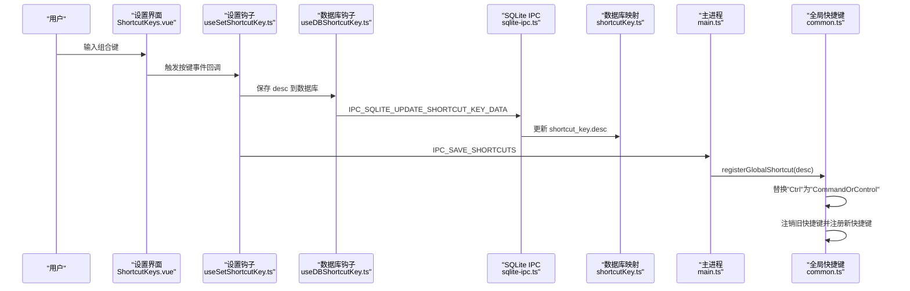
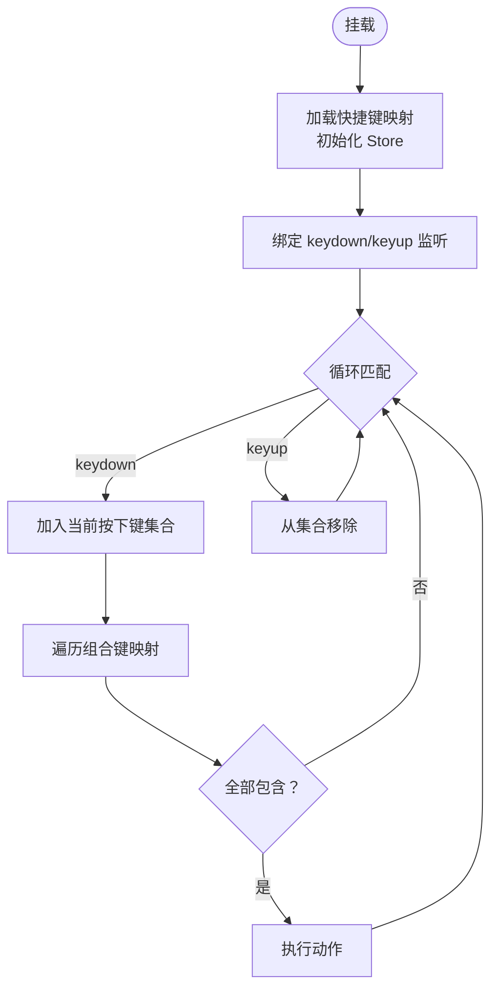
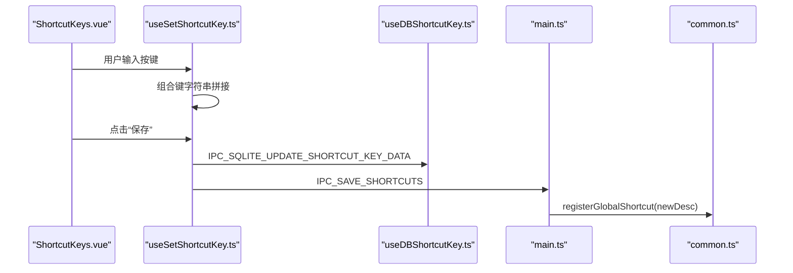
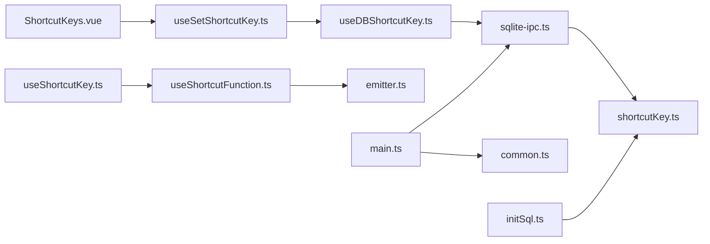

# 全局快捷键系统

<cite>
**本文引用的文件**
- [useShortcutKey.ts](file://src/hooks/useShortcutKey.ts)
- [shortcutKey.ts](file://src/store/shortcutKey.ts)
- [useSetShortcutKey.ts](file://src/hooks/useSetShortcutKey.ts)
- [ShortcutKeys.vue](file://src/components/setview/ShortcutKeys.vue)
- [useGroupShortcutKey.ts](file://src/hooks/useGroupShortcutKey.ts)
- [useLoginEscShortcutKey.ts](file://src/hooks/useLoginEscShortcutKey.ts)
- [config.ts](file://src/config/config.ts)
- [useShortcutFunction.ts](file://src/hooks/useShortcutFunction.ts)
- [useDBShortcutKey.ts](file://src/hooks/useDBShortcutKey.ts)
- [main.ts](file://electron/main.ts)
- [common.ts](file://electron/common.ts)
- [configConstants.ts](file://electron/db/sqlite/components/configConstants.ts)
- [shortcutKey.ts](file://electron/db/sqlite/mapper/shortcutKey.ts)
- [initSql.ts](file://electron/db/sqlite/components/initSql.ts)
- [sqlite-ipc.ts](file://electron/db/sqlite/sqlite-ipc.ts)
- [constant.ts](file://electron/constant.ts)
- [emitter.ts](file://src/utils/emitter.ts)
</cite>

## 目录
1. [简介](#简介)
2. [项目结构](#项目结构)
3. [核心组件](#核心组件)
4. [架构总览](#架构总览)
5. [详细组件分析](#详细组件分析)
6. [依赖关系分析](#依赖关系分析)
7. [性能考虑](#性能考虑)
8. [故障排查指南](#故障排查指南)
9. [结论](#结论)
10. [附录](#附录)

## 简介
本文件系统性梳理密码管理器的全局快捷键体系，覆盖快捷键注册机制、组合键处理、冲突解决策略、配置存储与动态修改、与系统热键的集成与平台差异、权限管理、事件监听与优先级处理以及性能优化方案。读者无需深入技术背景即可理解如何使用与扩展快捷键功能。

## 项目结构
快捷键系统由前端 Hook、Pinia Store、设置界面、Electron 主进程与 SQLite 数据库四部分协同组成：
- 前端负责捕获按键、解析组合键、执行动作映射、持久化配置变更
- Electron 主进程负责注册系统级全局快捷键、与渲染进程通信
- SQLite 存储默认与用户自定义的快捷键映射
- 事件总线用于跨模块解耦的动作触发

图表来源
- [useShortcutKey.ts:1-64](file://src/hooks/useShortcutKey.ts#L1-L64)
- [shortcutKey.ts:1-99](file://src/store/shortcutKey.ts#L1-L99)
- [useSetShortcutKey.ts:1-481](file://src/hooks/useSetShortcutKey.ts#L1-L481)
- [ShortcutKeys.vue:1-225](file://src/components/setview/ShortcutKeys.vue#L1-L225)
- [useShortcutFunction.ts:1-94](file://src/hooks/useShortcutFunction.ts#L1-L94)
- [useDBShortcutKey.ts:1-17](file://src/hooks/useDBShortcutKey.ts#L1-L17)
- [main.ts:1-240](file://electron/main.ts#L1-L240)
- [common.ts:1-56](file://electron/common.ts#L1-L56)
- [constant.ts:1-63](file://electron/constant.ts#L1-L63)
- [sqlite-ipc.ts:1-220](file://electron/db/sqlite/sqlite-ipc.ts#L1-L220)
- [shortcutKey.ts:1-32](file://electron/db/sqlite/mapper/shortcutKey.ts#L1-L32)
- [initSql.ts:1-224](file://electron/db/sqlite/components/initSql.ts#L1-L224)
- [configConstants.ts:1-29](file://electron/db/sqlite/components/configConstants.ts#L1-L29)
- [emitter.ts:1-16](file://src/utils/emitter.ts#L1-L16)

章节来源
- [useShortcutKey.ts:1-64](file://src/hooks/useShortcutKey.ts#L1-L64)
- [shortcutKey.ts:1-99](file://src/store/shortcutKey.ts#L1-L99)
- [useSetShortcutKey.ts:1-481](file://src/hooks/useSetShortcutKey.ts#L1-L481)
- [ShortcutKeys.vue:1-225](file://src/components/setview/ShortcutKeys.vue#L1-L225)
- [useShortcutFunction.ts:1-94](file://src/hooks/useShortcutFunction.ts#L1-L94)
- [useDBShortcutKey.ts:1-17](file://src/hooks/useDBShortcutKey.ts#L1-L17)
- [main.ts:1-240](file://electron/main.ts#L1-L240)
- [common.ts:1-56](file://electron/common.ts#L1-L56)
- [constant.ts:1-63](file://electron/constant.ts#L1-L63)
- [sqlite-ipc.ts:1-220](file://electron/db/sqlite/sqlite-ipc.ts#L1-L220)
- [shortcutKey.ts:1-32](file://electron/db/sqlite/mapper/shortcutKey.ts#L1-L32)
- [initSql.ts:1-224](file://electron/db/sqlite/components/initSql.ts#L1-L224)
- [configConstants.ts:1-29](file://electron/db/sqlite/components/configConstants.ts#L1-L29)
- [emitter.ts:1-16](file://src/utils/emitter.ts#L1-L16)

## 核心组件
- 快捷键监听与匹配
  - 前端通过按键事件监听器维护当前按下键集合，周期性比对 Pinia 中的组合键映射，命中即执行对应动作。
- 快捷键状态与默认映射
  - Store 提供默认组合键数组，包含动作名、按键序列与描述；初始化时从数据库加载用户自定义映射并进行动作绑定。
- 设置界面与动态修改
  - 设置页收集用户输入，实时生成组合键描述字符串，保存时通过 IPC 写入数据库，并通知主进程重新注册系统级全局快捷键。
- 主进程注册与平台适配
  - 主进程根据数据库中的描述字符串注册全局快捷键，自动将“Ctrl”替换为“CommandOrControl”，以兼容 Windows/Linux 与 macOS。
- 数据持久化与默认值
  - SQLite 表 shortcut_key 存放 action_name 与 desc；初始化脚本插入默认映射；数据库映射器提供查询与更新接口；IPC 层统一前后端交互。

章节来源
- [useShortcutKey.ts:9-64](file://src/hooks/useShortcutKey.ts#L9-L64)
- [shortcutKey.ts:16-99](file://src/store/shortcutKey.ts#L16-L99)
- [useSetShortcutKey.ts:28-481](file://src/hooks/useSetShortcutKey.ts#L28-L481)
- [ShortcutKeys.vue:1-225](file://src/components/setview/ShortcutKeys.vue#L1-L225)
- [main.ts:49-56](file://electron/main.ts#L49-L56)
- [common.ts:16-39](file://electron/common.ts#L16-L39)
- [initSql.ts:185-207](file://electron/db/sqlite/components/initSql.ts#L185-L207)
- [shortcutKey.ts:8-25](file://electron/db/sqlite/mapper/shortcutKey.ts#L8-L25)

## 架构总览
下图展示从用户输入到系统热键注册与动作执行的关键流程：

图表来源
- [ShortcutKeys.vue:1-225](file://src/components/setview/ShortcutKeys.vue#L1-L225)
- [useSetShortcutKey.ts:102-109](file://src/hooks/useSetShortcutKey.ts#L102-L109)
- [useDBShortcutKey.ts:11-14](file://src/hooks/useDBShortcutKey.ts#L11-L14)
- [sqlite-ipc.ts:207-211](file://electron/db/sqlite/sqlite-ipc.ts#L207-L211)
- [shortcutKey.ts:8-13](file://electron/db/sqlite/mapper/shortcutKey.ts#L8-L13)
- [main.ts:149-152](file://electron/main.ts#L149-L152)
- [common.ts:16-39](file://electron/common.ts#L16-L39)

## 详细组件分析

### 组件A：前台组合键监听与匹配（useShortcutKey）
- 职责
  - 监听 window 的 keydown/keyup 事件，维护当前按下键集合
  - 将组合键描述转换为标准化键名（如将“Control”归一为“ctrl”）
  - 遍历 Store 中的组合键映射，若当前按下键集完全包含某条组合键，则触发对应动作
- 关键点
  - 使用 Set 记录当前按下键，提高查找效率
  - 动作绑定来自动作映射钩子，确保前后一致
  - 生命周期内注册与注销事件监听器，避免内存泄漏

图表来源
- [useShortcutKey.ts:15-60](file://src/hooks/useShortcutKey.ts#L15-L60)
- [useShortcutFunction.ts:29-39](file://src/hooks/useShortcutFunction.ts#L29-L39)

章节来源
- [useShortcutKey.ts:9-64](file://src/hooks/useShortcutKey.ts#L9-L64)
- [useShortcutFunction.ts:11-94](file://src/hooks/useShortcutFunction.ts#L11-L94)

### 组件B：快捷键状态与默认映射（shortcutKey Store）
- 职责
  - 提供默认组合键数组，包含 keys、action_name、desc
  - 初始化：从数据库读取用户自定义映射，拆分 desc 为 keys
  - 动态修改：支持按索引更新 desc 与 keys
- 关键点
  - 默认映射来源于配置常量
  - 初始化时将数据库结果注入 Store，随后由动作映射钩子绑定具体函数

章节来源
- [shortcutKey.ts:16-99](file://src/store/shortcutKey.ts#L16-L99)
- [config.ts:24-34](file://src/config/config.ts#L24-L34)

### 组件C：设置界面与动态修改（useSetShortcutKey + ShortcutKeys.vue）
- 职责
  - 设置界面收集用户输入，实时生成组合键描述字符串
  - 保存时通过 IPC 将 desc 写入数据库，并通知主进程重新注册系统级全局快捷键
  - 提供一键重置为默认值的能力
- 关键点
  - 对每个动作维护独立的输入缓冲区与显示值
  - 保存时同时更新 Store 与数据库，确保一致性
  - 使用 IPC 常量与主进程通信

图表来源
- [ShortcutKeys.vue:1-225](file://src/components/setview/ShortcutKeys.vue#L1-L225)
- [useSetShortcutKey.ts:102-109](file://src/hooks/useSetShortcutKey.ts#L102-L109)
- [useDBShortcutKey.ts:11-14](file://src/hooks/useDBShortcutKey.ts#L11-L14)
- [main.ts:149-152](file://electron/main.ts#L149-L152)
- [common.ts:16-39](file://electron/common.ts#L16-L39)

章节来源
- [useSetShortcutKey.ts:28-481](file://src/hooks/useSetShortcutKey.ts#L28-L481)
- [ShortcutKeys.vue:1-225](file://src/components/setview/ShortcutKeys.vue#L1-L225)
- [constant.ts:43-49](file://electron/constant.ts#L43-L49)

### 组件D：动作映射与执行（useShortcutFunction）
- 职责
  - 将 action_name 映射到具体函数，如复制用户名/密码/链接、插入分组/密码信息、同步数据、登出等
  - 通过事件总线触发 UI 相关动作
- 关键点
  - 函数映射表集中管理，便于扩展与维护
  - 与 Store 和事件总线协作，保持模块间解耦

章节来源
- [useShortcutFunction.ts:11-94](file://src/hooks/useShortcutFunction.ts#L11-L94)
- [emitter.ts:1-16](file://src/utils/emitter.ts#L1-16)

### 组件E：主进程全局快捷键注册（main + common）
- 职责
  - 应用启动时读取数据库中的全局快捷键描述，注册系统级全局快捷键
  - 接收渲染进程的保存请求，动态更新注册
- 平台差异与权限
  - 将“Ctrl”替换为“CommandOrControl”，自动适配 macOS 与 Windows/Linux
  - 注销旧快捷键后再注册新快捷键，避免冲突
- 关键点
  - 使用 Electron 的 globalShortcut API
  - 捕获异常并回退注销，保证稳定性

章节来源
- [main.ts:49-56](file://electron/main.ts#L49-L56)
- [main.ts:149-152](file://electron/main.ts#L149-L152)
- [common.ts:16-39](file://electron/common.ts#L16-L39)
- [configConstants.ts:20-27](file://electron/db/sqlite/components/configConstants.ts#L20-L27)

### 组件F：数据库与默认映射（initSql + sqlite-ipc + mapper）
- 职责
  - 初始化 shortcut_key 表并插入默认映射
  - 提供查询与更新接口，供前端与主进程使用
- 关键点
  - 默认映射与动作名一一对应
  - IPC 层统一路由数据库操作

章节来源
- [initSql.ts:185-207](file://electron/db/sqlite/components/initSql.ts#L185-L207)
- [sqlite-ipc.ts:206-217](file://electron/db/sqlite/sqlite-ipc.ts#L206-L217)
- [shortcutKey.ts:8-25](file://electron/db/sqlite/mapper/shortcutKey.ts#L8-L25)

### 组件G：分组快捷键与登录 ESC 快捷键（useGroupShortcutKey + useLoginEscShortcutKey）
- 分组快捷键
  - 监听 Ctrl + 数字键组合，向事件总线发送分组切换事件，仅删除数字键以保留 Ctrl
- 登录 ESC 快捷键
  - 监听 Escape，通过 IPC 将窗口最小化到托盘

章节来源
- [useGroupShortcutKey.ts:1-57](file://src/hooks/useGroupShortcutKey.ts#L1-L57)
- [useLoginEscShortcutKey.ts:1-47](file://src/hooks/useLoginEscShortcutKey.ts#L1-L47)

## 依赖关系分析
- 前端依赖
  - useShortcutKey 依赖 Store、动作映射与数据库钩子
  - 设置界面依赖设置钩子与数据库钩子
  - 动作映射依赖事件总线与数据同步钩子
- 主进程依赖
  - 依赖数据库映射与 IPC 层
  - 依赖 Electron globalShortcut API
- 数据层
  - shortcut_key 表存放 action_name 与 desc
  - 初始化脚本提供默认值

图表来源
- [ShortcutKeys.vue:1-225](file://src/components/setview/ShortcutKeys.vue#L1-L225)
- [useSetShortcutKey.ts:1-481](file://src/hooks/useSetShortcutKey.ts#L1-L481)
- [useDBShortcutKey.ts:1-17](file://src/hooks/useDBShortcutKey.ts#L1-L17)
- [sqlite-ipc.ts:1-220](file://electron/db/sqlite/sqlite-ipc.ts#L1-L220)
- [shortcutKey.ts:1-32](file://electron/db/sqlite/mapper/shortcutKey.ts#L1-L32)
- [useShortcutKey.ts:1-64](file://src/hooks/useShortcutKey.ts#L1-L64)
- [useShortcutFunction.ts:1-94](file://src/hooks/useShortcutFunction.ts#L1-L94)
- [emitter.ts:1-16](file://src/utils/emitter.ts#L1-L16)
- [main.ts:1-240](file://electron/main.ts#L1-L240)
- [common.ts:1-56](file://electron/common.ts#L1-L56)
- [initSql.ts:1-224](file://electron/db/sqlite/components/initSql.ts#L1-L224)

章节来源
- [ShortcutKeys.vue:1-225](file://src/components/setview/ShortcutKeys.vue#L1-L225)
- [useSetShortcutKey.ts:1-481](file://src/hooks/useSetShortcutKey.ts#L1-L481)
- [useDBShortcutKey.ts:1-17](file://src/hooks/useDBShortcutKey.ts#L1-L17)
- [sqlite-ipc.ts:1-220](file://electron/db/sqlite/sqlite-ipc.ts#L1-L220)
- [shortcutKey.ts:1-32](file://electron/db/sqlite/mapper/shortcutKey.ts#L1-L32)
- [useShortcutKey.ts:1-64](file://src/hooks/useShortcutKey.ts#L1-L64)
- [useShortcutFunction.ts:1-94](file://src/hooks/useShortcutFunction.ts#L1-L94)
- [emitter.ts:1-16](file://src/utils/emitter.ts#L1-L16)
- [main.ts:1-240](file://electron/main.ts#L1-L240)
- [common.ts:1-56](file://electron/common.ts#L1-L56)
- [initSql.ts:1-224](file://electron/db/sqlite/components/initSql.ts#L1-L224)

## 性能考虑
- 键盘事件处理
  - 使用 Set 存储当前按下键，匹配时以 keys.every 判断，时间复杂度 O(n)（n 为某条组合键的键数），整体复杂度与组合键数量线性相关
  - 建议限制每条组合键长度与组合键总数，避免过多匹配开销
- 事件监听
  - 在 onMounted 中注册，在 onBeforeUnmount 中注销，防止内存泄漏
- 数据库访问
  - 保存与查询通过 IPC 调用，避免主线程阻塞
- 主进程注册
  - 注册前先注销旧快捷键，减少冲突与无效注册带来的资源浪费

[本节为通用性能指导，不直接分析具体文件]

## 故障排查指南
- 快捷键无效
  - 检查主进程是否正确注册：确认数据库中的 desc 已传入并替换“Ctrl”为“CommandOrControl”
  - 确认 Electron globalShortcut 是否抛出异常并已被捕获与回退注销
- 组合键冲突
  - 若系统已有相同组合键占用，需调整用户自定义组合键
  - 主进程注册时会注销旧快捷键，确保新组合键生效
- 设置页无法保存
  - 检查 IPC 常量与主进程路由是否一致
  - 确认数据库映射器更新成功且返回正确
- 登录 ESC 快捷键不生效
  - 检查 useLoginEscShortcutKey 的按键监听是否注册
  - 确认 IPC_CLOSE_WIN 是否被主进程正确处理

章节来源
- [common.ts:16-39](file://electron/common.ts#L16-L39)
- [main.ts:149-152](file://electron/main.ts#L149-L152)
- [sqlite-ipc.ts:207-211](file://electron/db/sqlite/sqlite-ipc.ts#L207-L211)
- [shortcutKey.ts:8-13](file://electron/db/sqlite/mapper/shortcutKey.ts#L8-L13)
- [useLoginEscShortcutKey.ts:17-43](file://src/hooks/useLoginEscShortcutKey.ts#L17-L43)

## 结论
该全局快捷键系统通过前端组合键匹配、Pinia 状态管理、数据库持久化与 Electron 主进程注册形成闭环，具备良好的扩展性与跨平台兼容性。通过统一的 IPC 与事件总线，系统实现了低耦合与高内聚。建议在后续迭代中引入更细粒度的冲突检测与可视化提示，进一步提升用户体验。

[本节为总结性内容，不直接分析具体文件]

## 附录

### 快捷键配置示例
- 打开主面板：Ctrl + Alt + E
- 退出登录：Escape
- 复制账号：Ctrl + U
- 复制密码：Ctrl + P
- 复制链接：Ctrl + L
- 新增分组：Ctrl + G
- 新增密码：Ctrl + N
- 本地同步至远程：Ctrl + Shift + K
- 远程同步至本地：F5

章节来源
- [config.ts:24-34](file://src/config/config.ts#L24-L34)
- [initSql.ts:188-206](file://electron/db/sqlite/components/initSql.ts#L188-L206)

### 默认快捷键映射（数据库）
- 表：shortcut_key
- 字段：id、action_name、desc
- 默认映射见初始化脚本中的插入语句

章节来源
- [initSql.ts:83-89](file://electron/db/sqlite/components/initSql.ts#L83-L89)
- [initSql.ts:188-206](file://electron/db/sqlite/components/initSql.ts#L188-L206)

### 自定义快捷键设置流程
- 在设置界面输入组合键，系统自动拼接为“键1 + 键2 + ...”
- 点击“保存”，前端通过 IPC 将 desc 写入数据库
- 主进程接收 IPC 请求后重新注册全局快捷键
- Store 同步更新，即时生效

章节来源
- [ShortcutKeys.vue:1-225](file://src/components/setview/ShortcutKeys.vue#L1-L225)
- [useSetShortcutKey.ts:102-109](file://src/hooks/useSetShortcutKey.ts#L102-L109)
- [sqlite-ipc.ts:207-211](file://electron/db/sqlite/sqlite-ipc.ts#L207-L211)
- [main.ts:149-152](file://electron/main.ts#L149-L152)

### 快捷键事件监听与优先级
- 前台监听：window 级别按键事件，优先于系统默认行为
- 主进程注册：系统级全局快捷键，具有最高优先级
- 事件总线：用于 UI 相关动作触发，避免直接耦合

章节来源
- [useShortcutKey.ts:15-60](file://src/hooks/useShortcutKey.ts#L15-L60)
- [main.ts:49-56](file://electron/main.ts#L49-L56)
- [useShortcutFunction.ts:53-91](file://src/hooks/useShortcutFunction.ts#L53-L91)

### 平台差异与权限管理
- 平台差异：将“Ctrl”替换为“CommandOrControl”，自动适配 macOS 与 Windows/Linux
- 权限管理：Electron globalShortcut 需要应用具备系统级热键权限；若注册失败，系统会回退注销并记录日志

章节来源
- [common.ts:16-39](file://electron/common.ts#L16-L39)