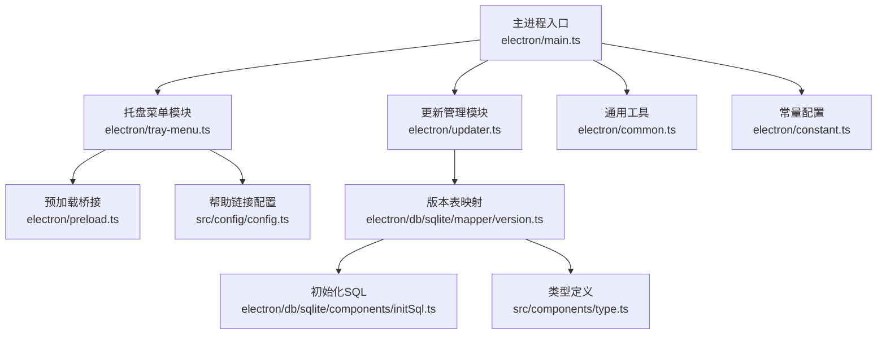
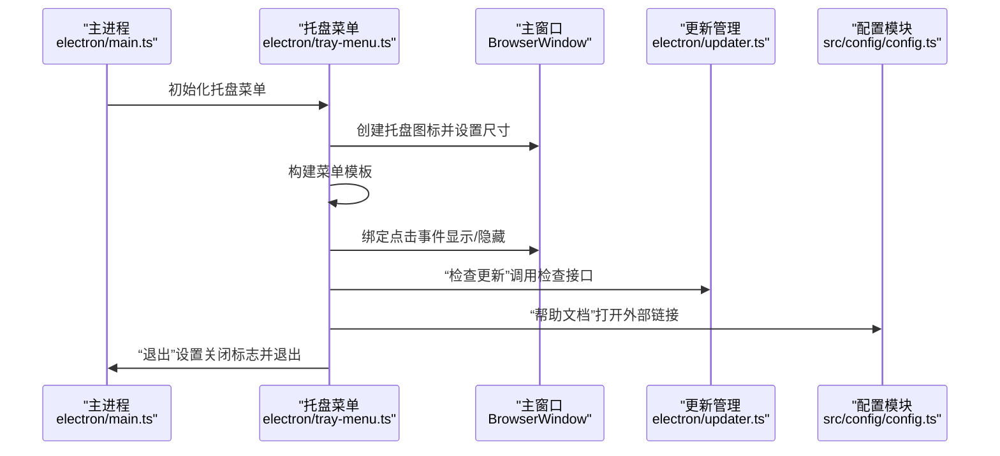
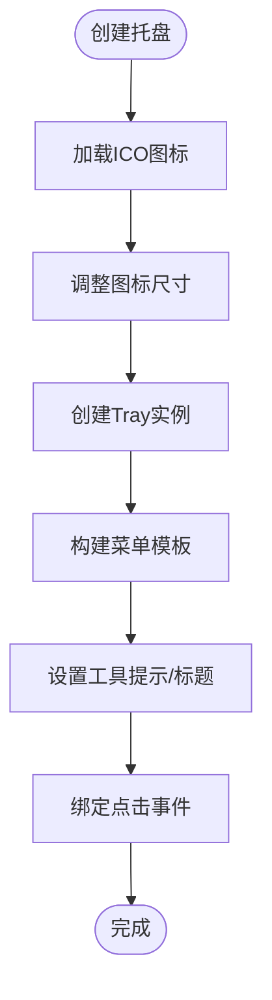
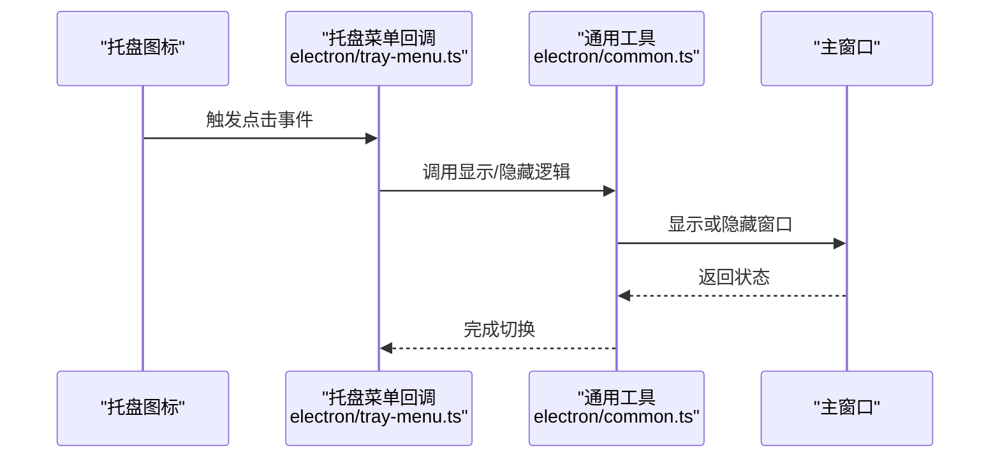
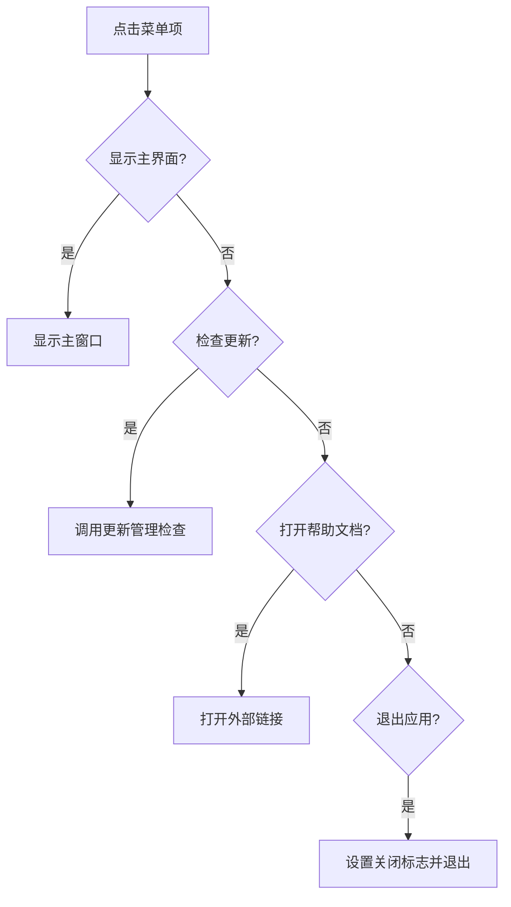
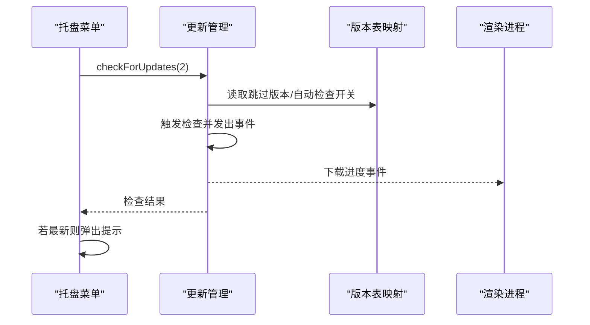
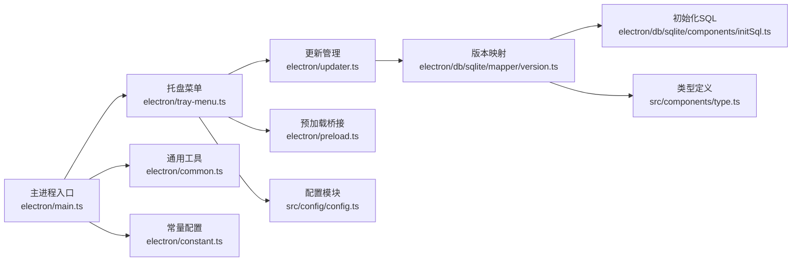

# 托盘菜单系统

<cite>
**本文引用的文件**
- [electron/tray-menu.ts](file://electron/tray-menu.ts)
- [electron/main.ts](file://electron/main.ts)
- [electron/updater.ts](file://electron/updater.ts)
- [electron/common.ts](file://electron/common.ts)
- [electron/preload.ts](file://electron/preload.ts)
- [electron/constant.ts](file://electron/constant.ts)
- [src/config/config.ts](file://src/config/config.ts)
- [electron/db/sqlite/mapper/version.ts](file://electron/db/sqlite/mapper/version.ts)
- [electron/db/sqlite/components/initSql.ts](file://electron/db/sqlite/components/initSql.ts)
- [src/components/type.ts](file://src/components/type.ts)
</cite>

## 目录
1. [简介](#简介)
2. [项目结构](#项目结构)
3. [核心组件](#核心组件)
4. [架构总览](#架构总览)
5. [详细组件分析](#详细组件分析)
6. [依赖关系分析](#依赖关系分析)
7. [性能考虑](#性能考虑)
8. [故障排查指南](#故障排查指南)
9. [结论](#结论)
10. [附录](#附录)

## 简介
本文件面向密码管理器的托盘菜单系统，聚焦于托盘图标的创建、右键菜单构建、点击事件处理、平台兼容性与系统通知集成。文档同时覆盖托盘菜单项功能（显示主界面、检查更新、打开帮助文档、退出应用）、图标尺寸调整策略、动态更新机制以及用户体验优化实践，并提供可扩展的配置示例与自定义选项说明。

## 项目结构
托盘菜单系统主要由以下模块协同实现：
- 主进程入口负责窗口生命周期与托盘初始化
- 托盘菜单模块负责图标创建、菜单模板构建与事件绑定
- 更新管理模块负责版本检查与系统通知
- 预加载桥接模块提供渲染进程调用能力
- 配置模块提供帮助链接等外部资源
- 数据库模块维护更新开关与跳版本状态

**图表来源**
- [electron/main.ts:1-240](file://electron/main.ts#L1-L240)
- [electron/tray-menu.ts:1-47](file://electron/tray-menu.ts#L1-L47)
- [electron/updater.ts:1-204](file://electron/updater.ts#L1-L204)
- [electron/common.ts:1-56](file://electron/common.ts#L1-L56)
- [electron/preload.ts:1-39](file://electron/preload.ts#L1-L39)
- [src/config/config.ts:1-143](file://src/config/config.ts#L1-L143)
- [electron/db/sqlite/mapper/version.ts:1-38](file://electron/db/sqlite/mapper/version.ts#L1-L38)
- [electron/db/sqlite/components/initSql.ts:1-224](file://electron/db/sqlite/components/initSql.ts#L1-L224)
- [src/components/type.ts:1-88](file://src/components/type.ts#L1-L88)

**章节来源**
- [electron/main.ts:1-240](file://electron/main.ts#L1-L240)
- [electron/tray-menu.ts:1-47](file://electron/tray-menu.ts#L1-L47)
- [electron/updater.ts:1-204](file://electron/updater.ts#L1-L204)
- [electron/common.ts:1-56](file://electron/common.ts#L1-L56)
- [electron/preload.ts:1-39](file://electron/preload.ts#L1-L39)
- [src/config/config.ts:1-143](file://src/config/config.ts#L1-L143)
- [electron/db/sqlite/mapper/version.ts:1-38](file://electron/db/sqlite/mapper/version.ts#L1-L38)
- [electron/db/sqlite/components/initSql.ts:1-224](file://electron/db/sqlite/components/initSql.ts#L1-L224)
- [src/components/type.ts:1-88](file://src/components/type.ts#L1-L88)

## 核心组件
- 托盘菜单模块：负责托盘图标创建、菜单模板构建、点击事件绑定与工具提示设置
- 主进程入口：负责窗口创建、托盘初始化时机、全局快捷键注册与更新检查触发
- 更新管理模块：封装自动更新逻辑、事件监听与对话框交互
- 预加载桥接：向渲染进程暴露更新相关IPC接口
- 配置模块：提供帮助文档链接等外部资源
- 数据库模块：维护更新开关与跳过版本状态，支撑自动更新策略

**章节来源**
- [electron/tray-menu.ts:7-47](file://electron/tray-menu.ts#L7-L47)
- [electron/main.ts:49-60](file://electron/main.ts#L49-L60)
- [electron/updater.ts:7-204](file://electron/updater.ts#L7-L204)
- [electron/preload.ts:25-38](file://electron/preload.ts#L25-L38)
- [src/config/config.ts:38](file://src/config/config.ts#L38)
- [electron/db/sqlite/mapper/version.ts:9-31](file://electron/db/sqlite/mapper/version.ts#L9-L31)

## 架构总览
托盘菜单系统围绕“主进程-托盘-菜单-事件-更新管理”的链路展开，关键流程如下：
- 主进程在窗口创建后初始化托盘菜单
- 托盘菜单包含“显示主界面”“检查更新”“帮助文档”“退出”四项
- 点击托盘图标触发窗口显示/隐藏切换
- “检查更新”通过更新管理模块进行版本检查与对话框交互
- “帮助文档”通过系统外壳打开外部链接
- “退出”设置应用关闭标志并退出应用

**图表来源**
- [electron/main.ts:49-60](file://electron/main.ts#L49-L60)
- [electron/tray-menu.ts:7-47](file://electron/tray-menu.ts#L7-L47)
- [electron/updater.ts:159-175](file://electron/updater.ts#L159-L175)
- [src/config/config.ts:38](file://src/config/config.ts#L38)

## 详细组件分析

### 托盘图标与菜单构建
- 图标来源与尺寸：从公共资源目录读取ICO图标并调整为固定尺寸，确保在不同系统下一致显示
- 工具提示与标题：设置托盘工具提示与标题，提升可识别性
- 菜单模板：构建包含“显示主界面”“检查更新”“帮助文档”“退出”的菜单项
- 事件绑定：为每个菜单项绑定点击回调，执行相应动作

**图表来源**
- [electron/tray-menu.ts:10-11](file://electron/tray-menu.ts#L10-L11)
- [electron/tray-menu.ts:13-42](file://electron/tray-menu.ts#L13-L42)

**章节来源**
- [electron/tray-menu.ts:7-47](file://electron/tray-menu.ts#L7-L47)

### 点击事件处理与窗口显示/隐藏
- 点击托盘图标：调用通用工具函数切换窗口可见性
- 平台兼容：在macOS上通过Dock显示应用，保证一致性体验
- 关闭行为：窗口关闭事件中判断应用是否正在退出，否则隐藏至托盘

**图表来源**
- [electron/tray-menu.ts:44-46](file://electron/tray-menu.ts#L44-L46)
- [electron/common.ts:4-14](file://electron/common.ts#L4-L14)

**章节来源**
- [electron/tray-menu.ts:44-46](file://electron/tray-menu.ts#L44-L46)
- [electron/common.ts:4-14](file://electron/common.ts#L4-L14)
- [electron/main.ts:97-106](file://electron/main.ts#L97-L106)

### 菜单项功能详解
- 显示主界面：直接调用窗口显示逻辑，实现快速唤起
- 检查更新：通过更新管理模块执行版本检查，区分来源（托盘菜单触发）
- 打开帮助文档：使用系统外壳打开外部帮助链接
- 退出应用：设置应用关闭标志并调用退出流程

**图表来源**
- [electron/tray-menu.ts:17-39](file://electron/tray-menu.ts#L17-L39)
- [electron/updater.ts:159-175](file://electron/updater.ts#L159-L175)
- [src/config/config.ts:38](file://src/config/config.ts#L38)

**章节来源**
- [electron/tray-menu.ts:17-39](file://electron/tray-menu.ts#L17-L39)
- [electron/updater.ts:159-175](file://electron/updater.ts#L159-L175)
- [src/config/config.ts:38](file://src/config/config.ts#L38)

### 更新检查与系统通知集成
- 自动检查：应用启动后延迟触发自动检查，依据数据库开关决定是否执行
- 手动检查：托盘菜单触发检查更新时，若已是最新版本弹出提示
- 对话框交互：根据用户选择执行下载、稍后提醒或跳过版本
- 进度通知：下载进度事件通过IPC传递到渲染进程，便于UI反馈

**图表来源**
- [electron/tray-menu.ts:24-26](file://electron/tray-menu.ts#L24-L26)
- [electron/updater.ts:143-175](file://electron/updater.ts#L143-L175)
- [electron/db/sqlite/mapper/version.ts:9-31](file://electron/db/sqlite/mapper/version.ts#L9-L31)
- [electron/preload.ts:31-36](file://electron/preload.ts#L31-L36)

**章节来源**
- [electron/tray-menu.ts:24-26](file://electron/tray-menu.ts#L24-L26)
- [electron/updater.ts:143-175](file://electron/updater.ts#L143-L175)
- [electron/db/sqlite/mapper/version.ts:9-31](file://electron/db/sqlite/mapper/version.ts#L9-L31)
- [electron/preload.ts:31-36](file://electron/preload.ts#L31-L36)

### 平台兼容性处理
- macOS Dock 显示：在切换窗口显示时调用Dock显示，确保在macOS上的行为一致
- 窗口关闭策略：非Darwin平台在关闭时退出应用，Darwin平台遵循系统习惯

**章节来源**
- [electron/common.ts:10-12](file://electron/common.ts#L10-L12)
- [electron/main.ts:132-137](file://electron/main.ts#L132-L137)

### 托盘菜单配置示例与自定义选项
- 图标尺寸：通过调整图标尺寸参数实现统一显示
- 菜单项扩展：可在菜单模板中新增或移除条目，例如“最小化到托盘”“关于”等
- 动态更新：结合数据库开关与跳过版本策略，实现灵活的更新策略控制
- 外部链接：通过配置模块集中管理帮助文档链接，便于维护

**章节来源**
- [electron/tray-menu.ts:10-11](file://electron/tray-menu.ts#L10-L11)
- [electron/tray-menu.ts:17-39](file://electron/tray-menu.ts#L17-L39)
- [electron/db/sqlite/mapper/version.ts:9-31](file://electron/db/sqlite/mapper/version.ts#L9-L31)
- [src/config/config.ts:38](file://src/config/config.ts#L38)

## 依赖关系分析
托盘菜单系统的依赖关系如下：
- 主进程入口依赖托盘菜单模块、通用工具、更新管理与常量配置
- 托盘菜单模块依赖通用工具、更新管理、配置模块与预加载桥接
- 更新管理模块依赖数据库映射与类型定义
- 预加载桥接依赖主进程IPC通道

**图表来源**
- [electron/main.ts:1-240](file://electron/main.ts#L1-L240)
- [electron/tray-menu.ts:1-47](file://electron/tray-menu.ts#L1-L47)
- [electron/updater.ts:1-204](file://electron/updater.ts#L1-L204)
- [electron/common.ts:1-56](file://electron/common.ts#L1-L56)
- [electron/preload.ts:1-39](file://electron/preload.ts#L1-L39)
- [src/config/config.ts:1-143](file://src/config/config.ts#L1-L143)
- [electron/db/sqlite/mapper/version.ts:1-38](file://electron/db/sqlite/mapper/version.ts#L1-L38)
- [electron/db/sqlite/components/initSql.ts:1-224](file://electron/db/sqlite/components/initSql.ts#L1-L224)
- [src/components/type.ts:1-88](file://src/components/type.ts#L1-L88)

**章节来源**
- [electron/main.ts:1-240](file://electron/main.ts#L1-L240)
- [electron/tray-menu.ts:1-47](file://electron/tray-menu.ts#L1-L47)
- [electron/updater.ts:1-204](file://electron/updater.ts#L1-L204)
- [electron/common.ts:1-56](file://electron/common.ts#L1-L56)
- [electron/preload.ts:1-39](file://electron/preload.ts#L1-L39)
- [src/config/config.ts:1-143](file://src/config/config.ts#L1-L143)
- [electron/db/sqlite/mapper/version.ts:1-38](file://electron/db/sqlite/mapper/version.ts#L1-L38)
- [electron/db/sqlite/components/initSql.ts:1-224](file://electron/db/sqlite/components/initSql.ts#L1-L224)
- [src/components/type.ts:1-88](file://src/components/type.ts#L1-L88)

## 性能考虑
- 图标尺寸固定：统一尺寸减少渲染开销，提高跨平台一致性
- 事件解耦：菜单项点击与窗口显示/隐藏逻辑分离，降低耦合度
- IPC 调用：更新进度通过IPC传递，避免阻塞主线程
- 启动延迟检查：自动更新在应用启动后延迟触发，避免影响首屏体验

[本节为通用性能讨论，无需特定文件来源]

## 故障排查指南
- 托盘图标不显示
  - 检查图标路径与尺寸设置是否正确
  - 确认主窗口创建后再初始化托盘
- 菜单点击无响应
  - 核对菜单模板构建与事件绑定
  - 检查窗口可见性切换逻辑
- 更新检查异常
  - 查看更新管理事件日志与错误回调
  - 确认数据库开关与跳过版本状态
- macOS Dock 无法显示
  - 确认点击事件中调用了Dock显示逻辑

**章节来源**
- [electron/tray-menu.ts:10-11](file://electron/tray-menu.ts#L10-L11)
- [electron/tray-menu.ts:44-46](file://electron/tray-menu.ts#L44-L46)
- [electron/updater.ts:40-43](file://electron/updater.ts#L40-L43)
- [electron/db/sqlite/mapper/version.ts:9-31](file://electron/db/sqlite/mapper/version.ts#L9-L31)
- [electron/common.ts:10-12](file://electron/common.ts#L10-L12)

## 结论
托盘菜单系统通过清晰的职责划分与事件解耦，实现了稳定的图标创建、菜单构建与点击处理；结合更新管理模块与数据库策略，提供了灵活的自动更新与用户交互体验。平台兼容性与性能优化策略进一步提升了系统在多平台下的稳定性与可用性。后续可基于现有结构扩展更多菜单项与动态更新能力。

[本节为总结性内容，无需特定文件来源]

## 附录
- 数据库初始化与更新表
  - 初始化脚本创建“update_version”表并插入默认数据
  - 提供跳过版本与自动检查开关字段，支撑更新策略控制

**章节来源**
- [electron/db/sqlite/components/initSql.ts:107-150](file://electron/db/sqlite/components/initSql.ts#L107-L150)
- [electron/db/sqlite/mapper/version.ts:9-31](file://electron/db/sqlite/mapper/version.ts#L9-L31)
- [src/components/type.ts:39-47](file://src/components/type.ts#L39-L47)