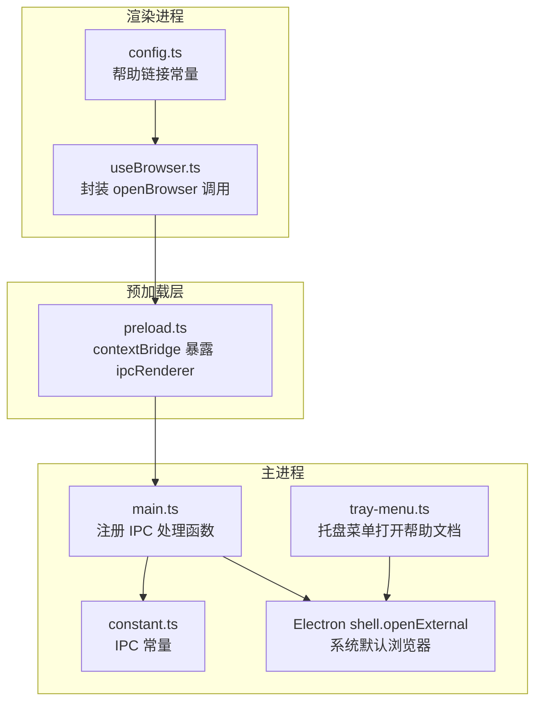
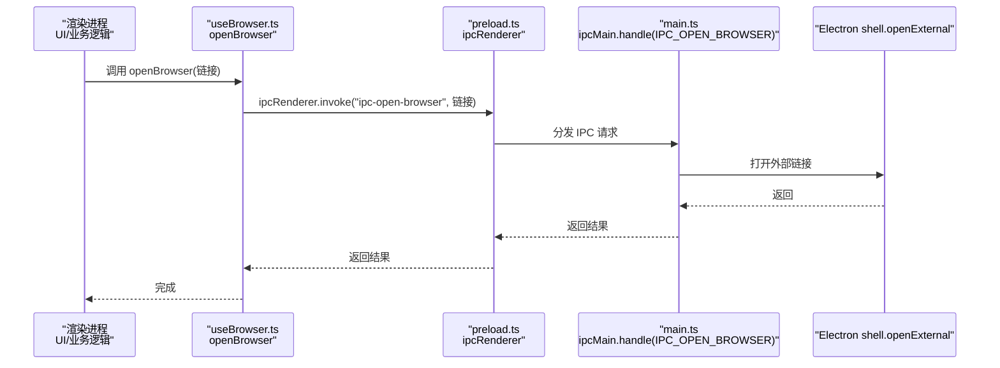
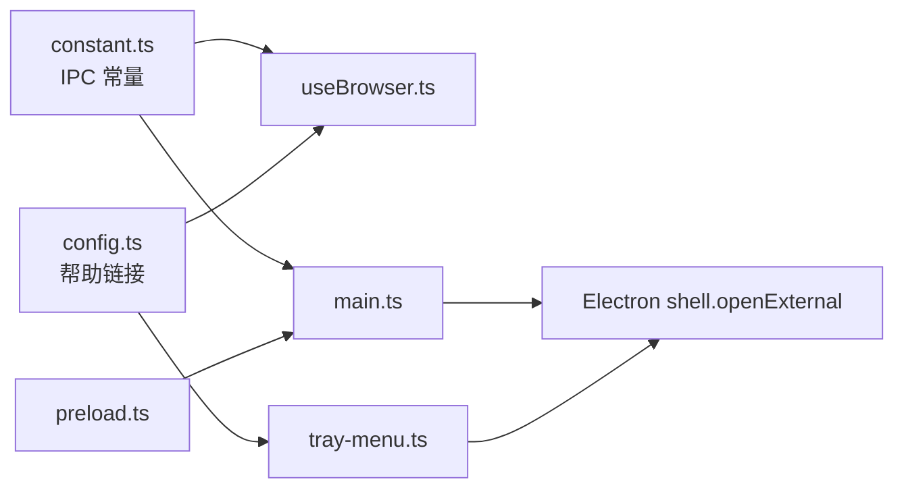

# 浏览器集成

<cite>
**本文引用的文件**
- [useBrowser.ts](file://src/hooks/useBrowser.ts)
- [main.ts](file://electron/main.ts)
- [preload.ts](file://electron/preload.ts)
- [constant.ts](file://electron/constant.ts)
- [tray-menu.ts](file://electron/tray-menu.ts)
- [config.ts](file://src/config/config.ts)
- [package.json](file://package.json)
- [electron-builder.json5](file://electron-builder.json5)
</cite>

## 目录
1. [简介](#简介)
2. [项目结构](#项目结构)
3. [核心组件](#核心组件)
4. [架构总览](#架构总览)
5. [详细组件分析](#详细组件分析)
6. [依赖关系分析](#依赖关系分析)
7. [性能考量](#性能考量)
8. [故障排查指南](#故障排查指南)
9. [结论](#结论)
10. [附录](#附录)

## 简介
本文件面向密码管理器的“浏览器集成”能力，系统性说明从渲染进程发起外部浏览器打开请求，到主进程通过 Electron Shell 打开系统的默认浏览器或外部应用的完整链路。文档覆盖以下主题：
- 外部浏览器调用机制与 IPC 协议
- URL 处理与协议注册
- 浏览器兼容性与默认浏览器检测
- 用户偏好设置与系统行为
- 网页链接打开方式、新窗口管理与服务集成
- 示例与最佳实践、安全考虑与跨域处理
- 常见浏览器支持与平台差异

## 项目结构
围绕浏览器集成的关键文件分布如下：
- 渲染进程侧：通过自定义 Hook 封装 openBrowser 调用，统一走 IPC
- 主进程侧：注册 IPC 处理函数，委托 Electron shell.openExternal 打开系统默认浏览器
- 预加载脚本：通过 contextBridge 暴露受控的 ipcRenderer 接口
- 常量定义：集中管理 IPC 通道名，确保前后端一致
- 托盘菜单：在应用内直接打开帮助文档链接
- 构建配置：打包产物与目标平台

图表来源
- [useBrowser.ts:1-13](file://src/hooks/useBrowser.ts#L1-L13)
- [preload.ts:1-39](file://electron/preload.ts#L1-L39)
- [main.ts:161-165](file://electron/main.ts#L161-L165)
- [constant.ts:50-51](file://electron/constant.ts#L50-L51)
- [tray-menu.ts:28-31](file://electron/tray-menu.ts#L28-L31)
- [config.ts:36-38](file://src/config/config.ts#L36-L38)

章节来源
- [useBrowser.ts:1-13](file://src/hooks/useBrowser.ts#L1-L13)
- [preload.ts:1-39](file://electron/preload.ts#L1-L39)
- [main.ts:161-165](file://electron/main.ts#L161-L165)
- [constant.ts:50-51](file://electron/constant.ts#L50-L51)
- [tray-menu.ts:28-31](file://electron/tray-menu.ts#L28-L31)
- [config.ts:36-38](file://src/config/config.ts#L36-L38)

## 核心组件
- 渲染进程 Hook：封装 openBrowser，负责校验参数并调用 IPC
- 预加载桥接：通过 contextBridge 暴露受控的 ipcRenderer.invoke
- 主进程 IPC 处理：接收 IPC 并调用 Electron shell.openExternal
- 常量定义：集中管理 IPC 名称，避免硬编码
- 托盘菜单：直接使用 shell.openExternal 打开帮助文档
- 配置常量：提供帮助文档链接等外部资源地址

章节来源
- [useBrowser.ts:1-13](file://src/hooks/useBrowser.ts#L1-L13)
- [preload.ts:1-39](file://electron/preload.ts#L1-L39)
- [main.ts:161-165](file://electron/main.ts#L161-L165)
- [constant.ts:50-51](file://electron/constant.ts#L50-L51)
- [tray-menu.ts:28-31](file://electron/tray-menu.ts#L28-L31)
- [config.ts:36-38](file://src/config/config.ts#L36-L38)

## 架构总览
浏览器集成采用“渲染进程 -> 预加载桥 -> 主进程 -> 系统默认浏览器”的标准 Electron 流程。渲染进程通过自定义 Hook 触发 IPC；预加载层仅暴露受控接口；主进程处理 IPC 并调用 Electron 的 shell.openExternal，交由操作系统决定使用默认浏览器或外部应用。

图表来源
- [useBrowser.ts:5-10](file://src/hooks/useBrowser.ts#L5-L10)
- [preload.ts:17-20](file://electron/preload.ts#L17-L20)
- [main.ts:161-165](file://electron/main.ts#L161-L165)
- [constant.ts:50-51](file://electron/constant.ts#L50-L51)

## 详细组件分析

### 渲染进程：openBrowser 调用封装
- 功能职责：对外提供统一的 openBrowser 方法，内部进行空值校验，随后通过 ipcRenderer.invoke 发送 IPC 请求
- 参数与返回：接收字符串类型的链接，无返回值（基于 IPC 调用约定）
- 安全前置：在调用前对输入进行判空，避免无效链接导致 IPC 调用

章节来源
- [useBrowser.ts:5-10](file://src/hooks/useBrowser.ts#L5-L10)

### 预加载层：contextBridge 暴露受控 IPC
- 功能职责：通过 contextBridge 将 ipcRenderer 的 on/send/invoke 等方法暴露给渲染进程，并提供更新相关的便捷方法
- 设计要点：仅暴露必要接口，避免直接暴露底层 Electron API，降低安全风险
- 可扩展性：预留了 update 相关的便捷方法，便于后续扩展

章节来源
- [preload.ts:1-39](file://electron/preload.ts#L1-L39)

### 主进程：IPC 注册与外部浏览器打开
- IPC 注册：在主进程中注册 IPC_OPEN_BROWSER 对应的 handle，接收来自渲染进程的链接参数
- 行为实现：调用 Electron 的 shell.openExternal 打开外部链接，交由系统默认浏览器处理
- 日志记录：在处理前后打印日志，便于调试与追踪

章节来源
- [main.ts:161-165](file://electron/main.ts#L161-L165)
- [constant.ts:50-51](file://electron/constant.ts#L50-L51)

### 常量定义：IPC 名称集中管理
- 作用：集中定义 IPC 通道名称，确保前后端一致，避免拼写错误
- 影响范围：useBrowser.ts、preload.ts、main.ts、tray-menu.ts 等均依赖该常量

章节来源
- [constant.ts:50-51](file://electron/constant.ts#L50-L51)

### 托盘菜单：直接打开帮助文档
- 作用：在应用托盘菜单中提供“帮助文档”入口，点击后直接使用 shell.openExternal 打开帮助链接
- 数据来源：帮助链接常量来自 config.ts

章节来源
- [tray-menu.ts:28-31](file://electron/tray-menu.ts#L28-L31)
- [config.ts:36-38](file://src/config/config.ts#L36-L38)

### HTML 内嵌链接：通过 IPC 打开外部浏览器
- 作用：在支持内嵌 HTML 的视图中，通过 window.ipcRenderer.invoke 调用 IPC 打开外部链接
- 场景：用于“捐赠者”列表等场景，点击链接后由系统默认浏览器打开

章节来源
- [config.ts:67-71](file://src/config/config.ts#L67-L71)

## 依赖关系分析
- 渲染进程依赖：useBrowser.ts 依赖 constant.ts 中的 IPC 常量
- 预加载层依赖：preload.ts 提供 ipcRenderer 的受控封装
- 主进程依赖：main.ts 依赖 constant.ts 中的 IPC 常量，并依赖 Electron shell API
- 托盘菜单依赖：tray-menu.ts 依赖 config.ts 中的帮助链接常量
- 构建配置：package.json 与 electron-builder.json5 定义打包产物与目标平台

图表来源
- [constant.ts:50-51](file://electron/constant.ts#L50-L51)
- [useBrowser.ts:1](file://src/hooks/useBrowser.ts#L1)
- [main.ts:161-165](file://electron/main.ts#L161-L165)
- [preload.ts:1-39](file://electron/preload.ts#L1-L39)
- [config.ts:36-38](file://src/config/config.ts#L36-L38)
- [tray-menu.ts:28-31](file://electron/tray-menu.ts#L28-L31)

章节来源
- [constant.ts:50-51](file://electron/constant.ts#L50-L51)
- [useBrowser.ts:1](file://src/hooks/useBrowser.ts#L1)
- [main.ts:161-165](file://electron/main.ts#L161-L165)
- [preload.ts:1-39](file://electron/preload.ts#L1-L39)
- [config.ts:36-38](file://src/config/config.ts#L36-L38)
- [tray-menu.ts:28-31](file://electron/tray-menu.ts#L28-L31)

## 性能考量
- IPC 调用成本：IPC 调用属于进程间通信，通常开销较小，适合频繁触发的外部浏览器打开场景
- 系统默认浏览器：由系统调度打开，避免在应用内重复实现浏览器功能，减少内存与 CPU 开销
- 预加载桥接：仅暴露必要接口，避免不必要的 API 暴露，降低潜在性能与安全风险

## 故障排查指南
- 无法打开外部链接
  - 检查渲染进程是否传入有效链接（空值会被直接返回）
  - 检查 IPC 通道名是否与 constant.ts 中一致
  - 查看主进程日志，确认 IPC 是否正确到达并执行 shell.openExternal
- 打开异常或报错
  - 确认 Electron shell.openExternal 的权限与系统默认浏览器配置
  - 在不同平台（Windows/macOS/Linux）验证行为差异
- 托盘菜单无法打开帮助文档
  - 检查 config.ts 中的帮助链接是否有效
  - 确认 tray-menu.ts 中是否正确调用 shell.openExternal

章节来源
- [useBrowser.ts:5-10](file://src/hooks/useBrowser.ts#L5-L10)
- [constant.ts:50-51](file://electron/constant.ts#L50-L51)
- [main.ts:161-165](file://electron/main.ts#L161-L165)
- [config.ts:36-38](file://src/config/config.ts#L36-L38)
- [tray-menu.ts:28-31](file://electron/tray-menu.ts#L28-L31)

## 结论
本项目通过统一的 IPC 协议与受控的预加载桥接，实现了从渲染进程到系统默认浏览器的稳定打开流程。该设计具备良好的可维护性与安全性，同时通过集中常量管理与日志输出，便于问题定位与扩展。对于浏览器兼容性与平台差异，主要依赖 Electron shell.openExternal 的系统行为，应用层无需额外适配。

## 附录

### 外部浏览器调用机制与 URL 处理
- 调用链路：渲染进程 -> 预加载桥 -> 主进程 -> Electron shell.openExternal
- URL 处理：主进程仅接收字符串链接，不做解析或修改，交由系统默认浏览器处理
- 协议支持：shell.openExternal 支持 http/https/mailto 等常见协议，具体行为取决于系统默认应用

章节来源
- [useBrowser.ts:5-10](file://src/hooks/useBrowser.ts#L5-L10)
- [preload.ts:17-20](file://electron/preload.ts#L17-L20)
- [main.ts:161-165](file://electron/main.ts#L161-L165)

### 浏览器兼容性与默认浏览器检测
- 默认浏览器：由操作系统决定，应用层不干预
- 兼容性：Electron shell.openExternal 在 Windows/macOS/Linux 上行为一致，均交由系统默认应用处理
- 平台差异：不同平台的默认应用可能不同，但调用方式与返回行为保持一致

章节来源
- [main.ts:161-165](file://electron/main.ts#L161-L165)

### 用户偏好设置与系统行为
- 自动启动与快捷键：应用提供自动启动与全局快捷键设置，与浏览器打开无直接关联
- 托盘菜单：提供“帮助文档”入口，便于用户快速打开外部文档

章节来源
- [main.ts:153-156](file://electron/main.ts#L153-L156)
- [tray-menu.ts:28-31](file://electron/tray-menu.ts#L28-L31)

### 网页链接打开方式、新窗口管理与服务集成
- 打开方式：统一通过 shell.openExternal 打开系统默认浏览器
- 新窗口管理：由系统默认浏览器控制，应用层不参与
- 服务集成：帮助文档等外部资源通过 config.ts 中的链接常量统一管理

章节来源
- [config.ts:36-38](file://src/config/config.ts#L36-L38)
- [tray-menu.ts:28-31](file://electron/tray-menu.ts#L28-L31)

### 示例与最佳实践
- 渲染进程调用：使用 useBrowser.openBrowser(链接) 统一打开外部链接
- 托盘菜单：在托盘菜单中直接调用 shell.openExternal 打开帮助文档
- HTML 内嵌：在支持内嵌 HTML 的视图中，通过 window.ipcRenderer.invoke 调用 IPC 打开外部链接

章节来源
- [useBrowser.ts:5-10](file://src/hooks/useBrowser.ts#L5-L10)
- [tray-menu.ts:28-31](file://electron/tray-menu.ts#L28-L31)
- [config.ts:67-71](file://src/config/config.ts#L67-L71)

### 安全考虑、URL 验证与跨域处理
- URL 验证：在渲染进程侧进行空值校验，避免无效链接进入 IPC
- 跨域处理：由系统默认浏览器处理跨域与安全策略，应用层不介入
- 权限与信任：通过 contextBridge 限制渲染进程可访问的 API，降低安全风险

章节来源
- [useBrowser.ts:5-10](file://src/hooks/useBrowser.ts#L5-L10)
- [preload.ts:1-39](file://electron/preload.ts#L1-L39)

### 常见浏览器支持与平台差异
- Windows/macOS/Linux：均通过 Electron shell.openExternal 打开系统默认浏览器
- 不同平台默认应用可能不同，但调用方式与返回行为一致
- 构建配置：package.json 与 electron-builder.json5 定义了目标平台与产物命名

章节来源
- [package.json:49](file://package.json#L49)
- [electron-builder.json5:21-32](file://electron-builder.json5#L21-L32)