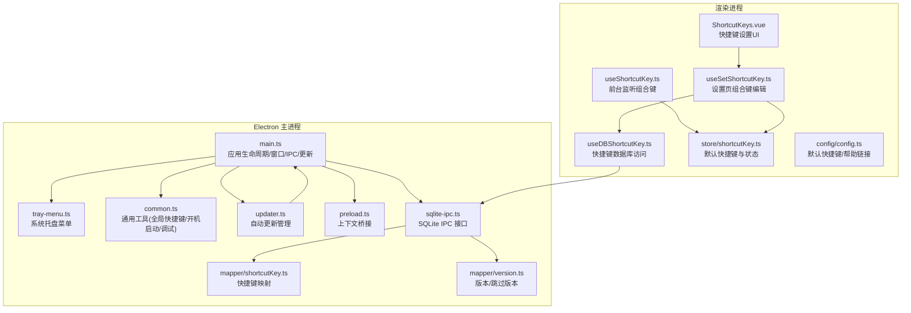
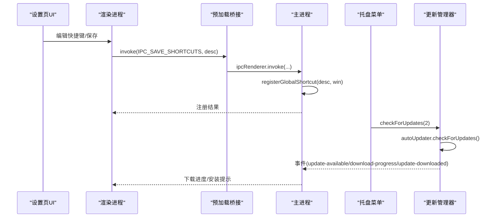
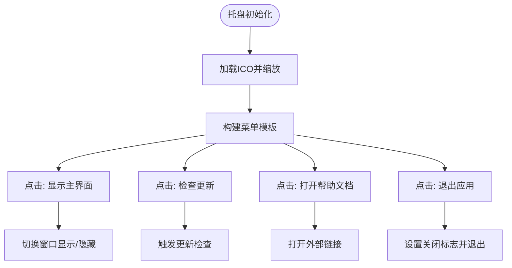
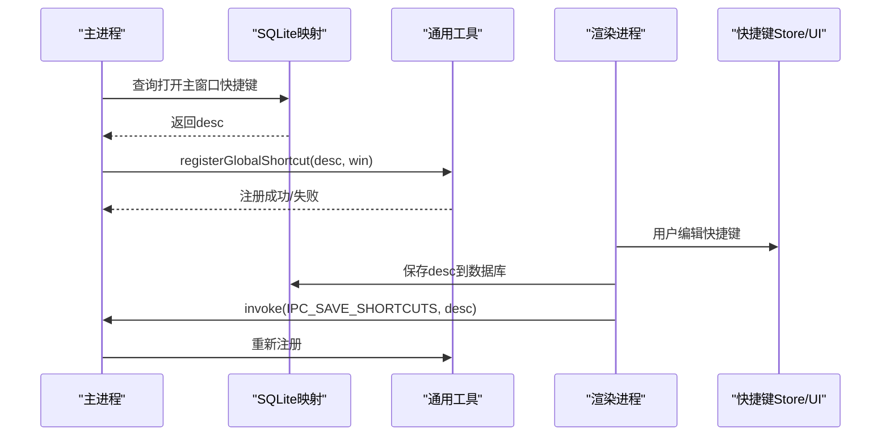
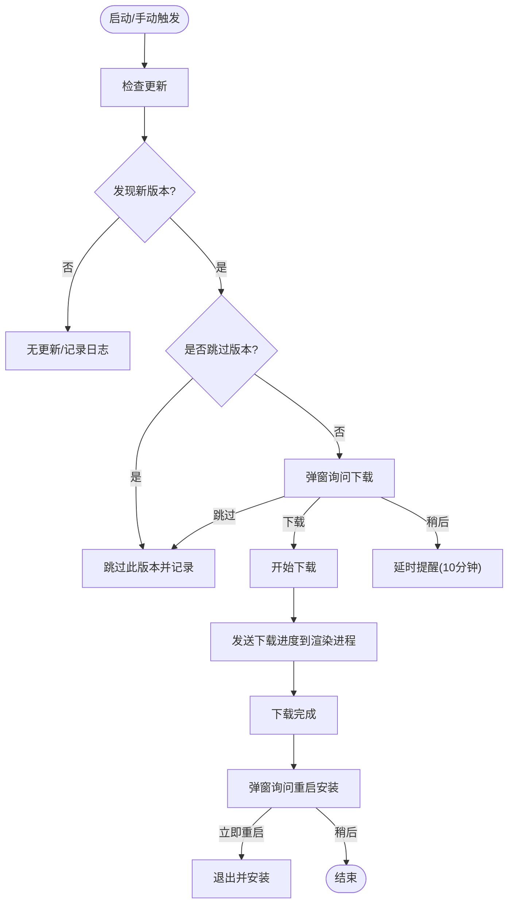
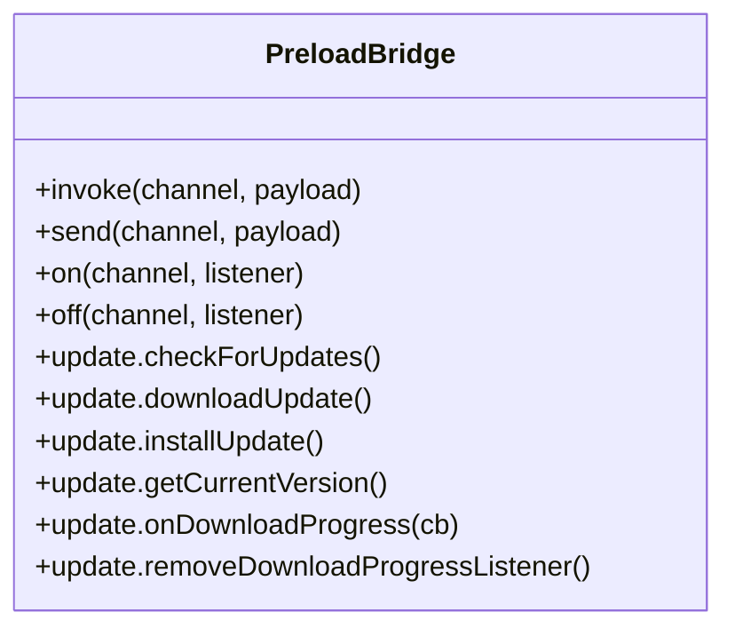
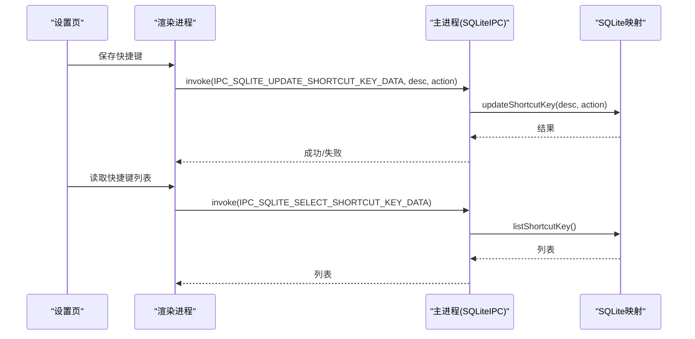
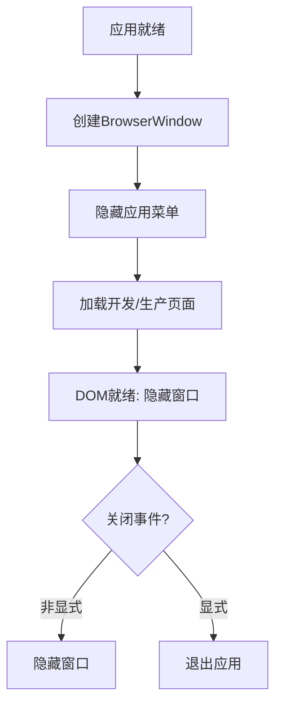
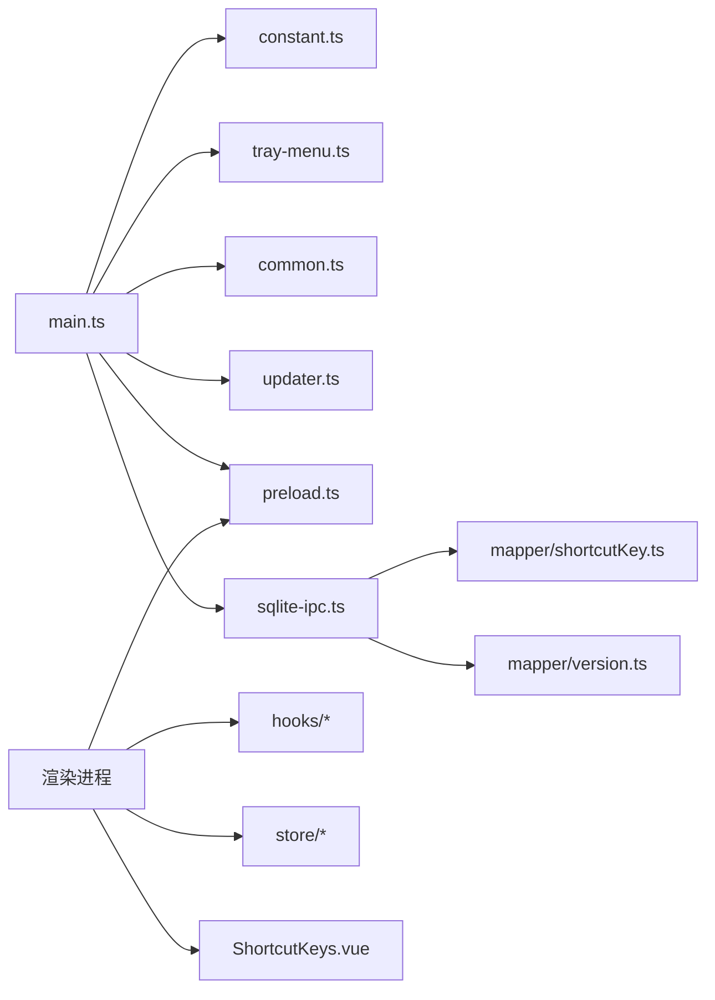

# 系统集成功能

<cite>
**本文引用的文件**
- [electron/main.ts](file://electron/main.ts)
- [electron/tray-menu.ts](file://electron/tray-menu.ts)
- [electron/common.ts](file://electron/common.ts)
- [electron/updater.ts](file://electron/updater.ts)
- [electron/preload.ts](file://electron/preload.ts)
- [electron/constant.ts](file://electron/constant.ts)
- [electron/db/sqlite/sqlite-ipc.ts](file://electron/db/sqlite/sqlite-ipc.ts)
- [electron/db/sqlite/components/configConstants.ts](file://electron/db/sqlite/components/configConstants.ts)
- [electron/db/sqlite/mapper/shortcutKey.ts](file://electron/db/sqlite/mapper/shortcutKey.ts)
- [electron/db/sqlite/mapper/version.ts](file://electron/db/sqlite/mapper/version.ts)
- [src/hooks/useShortcutKey.ts](file://src/hooks/useShortcutKey.ts)
- [src/hooks/useSetShortcutKey.ts](file://src/hooks/useSetShortcutKey.ts)
- [src/hooks/useDBShortcutKey.ts](file://src/hooks/useDBShortcutKey.ts)
- [src/store/shortcutKey.ts](file://src/store/shortcutKey.ts)
- [src/config/config.ts](file://src/config/config.ts)
- [src/components/setview/ShortcutKeys.vue](file://src/components/setview/ShortcutKeys.vue)
- [package.json](file://package.json)
</cite>

## 目录
1. [简介](#简介)
2. [项目结构](#项目结构)
3. [核心组件](#核心组件)
4. [架构总览](#架构总览)
5. [详细组件分析](#详细组件分析)
6. [依赖关系分析](#依赖关系分析)
7. [性能考量](#性能考量)
8. [故障排查指南](#故障排查指南)
9. [结论](#结论)
10. [附录](#附录)

## 简介
本文件面向密码管理器系统的“系统集成功能”，围绕托盘菜单、全局快捷键、自动更新、数据库与IPC通信、预加载脚本安全、以及跨平台兼容与权限管理进行深入解析。文档同时提供流程图与时序图，帮助开发者快速定位实现位置与调用链路，并给出最佳实践与常见问题解决方案。

## 项目结构
本项目采用 Electron + Vue3 的桌面应用架构，系统集成功能主要分布在 Electron 主进程与渲染进程的交互层、托盘菜单、全局快捷键、自动更新模块以及 SQLite 数据访问层。关键目录与职责如下：
- electron：主进程入口、托盘菜单、通用工具、自动更新、预加载桥接、SQLite IPC 封装
- src：Vue3 前端逻辑、状态管理、快捷键设置界面与钩子
- electron/db/sqlite：SQLite 访问封装与 IPC 接口
- package.json：构建与发布配置，包含自动更新源

**图表来源**
- [electron/main.ts:1-240](file://electron/main.ts#L1-L240)
- [electron/tray-menu.ts:1-47](file://electron/tray-menu.ts#L1-L47)
- [electron/common.ts:1-56](file://electron/common.ts#L1-L56)
- [electron/updater.ts:1-204](file://electron/updater.ts#L1-L204)
- [electron/preload.ts:1-39](file://electron/preload.ts#L1-L39)
- [electron/db/sqlite/sqlite-ipc.ts:1-220](file://electron/db/sqlite/sqlite-ipc.ts#L1-L220)
- [electron/db/sqlite/mapper/shortcutKey.ts:1-32](file://electron/db/sqlite/mapper/shortcutKey.ts#L1-L32)
- [electron/db/sqlite/mapper/version.ts:1-38](file://electron/db/sqlite/mapper/version.ts#L1-L38)
- [src/hooks/useShortcutKey.ts:1-64](file://src/hooks/useShortcutKey.ts#L1-L64)
- [src/hooks/useSetShortcutKey.ts:1-481](file://src/hooks/useSetShortcutKey.ts#L1-L481)
- [src/hooks/useDBShortcutKey.ts:1-17](file://src/hooks/useDBShortcutKey.ts#L1-L17)
- [src/store/shortcutKey.ts:1-99](file://src/store/shortcutKey.ts#L1-L99)
- [src/config/config.ts:1-143](file://src/config/config.ts#L1-L143)
- [src/components/setview/ShortcutKeys.vue:1-225](file://src/components/setview/ShortcutKeys.vue#L1-L225)

**章节来源**
- [electron/main.ts:1-240](file://electron/main.ts#L1-L240)
- [electron/db/sqlite/sqlite-ipc.ts:1-220](file://electron/db/sqlite/sqlite-ipc.ts#L1-L220)

## 核心组件
- 托盘菜单：提供显示主界面、检查更新、帮助文档、退出等入口，点击托盘图标可唤起主窗口
- 全局快捷键：基于 Electron 的 globalShortcut 注册，支持跨平台组合键，动态从数据库读取并保存
- 自动更新：基于 electron-updater，支持手动检查、下载、安装与跳过版本；支持开机自动检查
- 预加载桥接：通过 contextBridge 暴露受控的 IPC 方法，确保渲染进程仅能调用白名单接口
- SQLite IPC：集中封装数据库 CRUD 与查询，统一由主进程处理，渲染进程通过 IPC 调用
- 快捷键设置：提供图形界面编辑各功能的组合键，保存到数据库并通过 IPC 更新主进程注册

**章节来源**
- [electron/tray-menu.ts:1-47](file://electron/tray-menu.ts#L1-L47)
- [electron/common.ts:16-39](file://electron/common.ts#L16-L39)
- [electron/updater.ts:1-204](file://electron/updater.ts#L1-L204)
- [electron/preload.ts:1-39](file://electron/preload.ts#L1-L39)
- [electron/db/sqlite/sqlite-ipc.ts:1-220](file://electron/db/sqlite/sqlite-ipc.ts#L1-L220)
- [src/hooks/useSetShortcutKey.ts:1-481](file://src/hooks/useSetShortcutKey.ts#L1-L481)

## 架构总览
系统集成功能的总体交互流程如下：主进程负责窗口、托盘、全局快捷键与更新；渲染进程通过预加载桥接调用主进程提供的 IPC 接口；数据库访问通过 SQLite IPC 统一处理；自动更新通过 electron-updater 与主进程事件联动。

**图表来源**
- [electron/preload.ts:25-37](file://electron/preload.ts#L25-L37)
- [electron/main.ts:149-161](file://electron/main.ts#L149-L161)
- [electron/common.ts:16-39](file://electron/common.ts#L16-L39)
- [electron/tray-menu.ts:24-26](file://electron/tray-menu.ts#L24-L26)
- [electron/updater.ts:159-175](file://electron/updater.ts#L159-L175)

## 详细组件分析

### 托盘菜单实现
- 图标与尺寸：从资源目录加载 ICO 并缩放为 22x22
- 菜单项：显示主界面、检查更新、帮助文档、退出
- 行为：点击托盘图标切换主窗口显示/隐藏；点击“检查更新”触发更新检查；点击“帮助文档”打开外部链接
- 退出：设置关闭标志后调用 app.quit()

**图表来源**
- [electron/tray-menu.ts:7-47](file://electron/tray-menu.ts#L7-L47)

**章节来源**
- [electron/tray-menu.ts:1-47](file://electron/tray-menu.ts#L1-L47)

### 全局快捷键配置
- 注册时机：应用就绪后，从数据库读取“打开主窗口”的快捷键描述，调用注册函数
- 注册规则：将“Ctrl”替换为“CommandOrControl”以适配 macOS；若描述为空则注销全部快捷键
- 触发行为：按下组合键时显示/隐藏主窗口
- 设置界面：渲染进程提供 UI，用户输入组合键后通过 IPC 保存到数据库并重新注册

**图表来源**
- [electron/main.ts:54-54](file://electron/main.ts#L54-L54)
- [electron/common.ts:16-39](file://electron/common.ts#L16-L39)
- [electron/db/sqlite/mapper/shortcutKey.ts:15-20](file://electron/db/sqlite/mapper/shortcutKey.ts#L15-L20)
- [src/hooks/useSetShortcutKey.ts:102-109](file://src/hooks/useSetShortcutKey.ts#L102-L109)

**章节来源**
- [electron/common.ts:16-39](file://electron/common.ts#L16-L39)
- [electron/db/sqlite/mapper/shortcutKey.ts:1-32](file://electron/db/sqlite/mapper/shortcutKey.ts#L1-L32)
- [src/hooks/useSetShortcutKey.ts:1-481](file://src/hooks/useSetShortcutKey.ts#L1-L481)
- [src/store/shortcutKey.ts:1-99](file://src/store/shortcutKey.ts#L1-L99)
- [src/config/config.ts:24-34](file://src/config/config.ts#L24-L34)

### 自动更新机制
- 更新源：配置为通用服务器地址（GitHub 提供商注释保留）
- 行为：手动检查、下载、安装；支持跳过版本；支持开机自动检查
- 事件：错误、检查中、发现更新、无更新、下载进度、下载完成
- 对话框：发现新版本时提供“立即下载/稍后提醒/跳过此版本”；下载完成后提示“立即重启/稍后重启”

**图表来源**
- [electron/updater.ts:19-97](file://electron/updater.ts#L19-L97)
- [electron/updater.ts:159-175](file://electron/updater.ts#L159-L175)
- [electron/updater.ts:178-200](file://electron/updater.ts#L178-L200)

**章节来源**
- [electron/updater.ts:1-204](file://electron/updater.ts#L1-L204)
- [electron/db/sqlite/mapper/version.ts:1-38](file://electron/db/sqlite/mapper/version.ts#L1-L38)
- [electron/main.ts:58-60](file://electron/main.ts#L58-L60)

### 预加载脚本与 IPC 安全
- 暴露接口：通过 contextBridge 将 ipcRenderer 包装为受控对象，仅暴露必要方法
- 更新相关：提供 checkForUpdates、downloadUpdate、installUpdate、getCurrentVersion、下载进度监听与移除
- 使用建议：渲染进程仅通过 window.ipcRenderer 调用白名单方法，避免直接使用原生 ipcRenderer

**图表来源**
- [electron/preload.ts:1-39](file://electron/preload.ts#L1-L39)

**章节来源**
- [electron/preload.ts:1-39](file://electron/preload.ts#L1-L39)

### 数据库与 IPC 集成
- 统一入口：SQLiteIPC 集中注册所有数据库相关 IPC 处理函数
- 快捷键：提供查询与更新快捷键描述的 IPC 接口
- 版本：提供查询/更新“跳过版本”与“自动检查开关”的接口
- 调用链：渲染进程通过 window.ipcRenderer.invoke 调用，主进程在 SQLiteIPC 中处理并返回结果

**图表来源**
- [electron/db/sqlite/sqlite-ipc.ts:207-217](file://electron/db/sqlite/sqlite-ipc.ts#L207-L217)
- [electron/db/sqlite/mapper/shortcutKey.ts:8-25](file://electron/db/sqlite/mapper/shortcutKey.ts#L8-L25)

**章节来源**
- [electron/db/sqlite/sqlite-ipc.ts:1-220](file://electron/db/sqlite/sqlite-ipc.ts#L1-L220)
- [electron/db/sqlite/mapper/shortcutKey.ts:1-32](file://electron/db/sqlite/mapper/shortcutKey.ts#L1-L32)
- [electron/db/sqlite/mapper/version.ts:1-38](file://electron/db/sqlite/mapper/version.ts#L1-L38)

### 系统事件与窗口行为
- 单实例锁：请求单实例锁，若已有实例则直接退出
- 窗口创建：设置 AppUserModelId、窗口尺寸、透明背景、隐藏菜单栏、预加载脚本
- 关闭行为：拦截关闭事件，非显式退出时隐藏窗口；退出前清理资源
- 菜单栏：设置应用菜单为 null，避免占用空间
- 开发工具：通过 IPC 打开 DevTools（调试）

**图表来源**
- [electron/main.ts:62-122](file://electron/main.ts#L62-L122)

**章节来源**
- [electron/main.ts:1-240](file://electron/main.ts#L1-L240)

## 依赖关系分析
- 主进程依赖：Electron 核心 API（app、BrowserWindow、ipcMain、globalShortcut、shell）、electron-updater、better-sqlite3
- 渲染进程依赖：Vue3、Pinia、Element Plus、自定义 hooks 与 store
- IPC 常量：集中定义于 constant.ts，便于主/渲染两端统一引用
- 构建与发布：electron-builder，发布源指向通用服务器地址

**图表来源**
- [electron/constant.ts:1-63](file://electron/constant.ts#L1-L63)
- [electron/main.ts:1-30](file://electron/main.ts#L1-L30)
- [package.json:18-50](file://package.json#L18-L50)

**章节来源**
- [electron/constant.ts:1-63](file://electron/constant.ts#L1-L63)
- [package.json:1-51](file://package.json#L1-L51)

## 性能考量
- 窗口透明与无边框：减少窗口层级与绘制开销，但需注意在某些平台可能影响合成性能
- 预加载桥接：仅暴露必要方法，避免频繁跨进程调用；批量更新快捷键时建议合并 IPC 请求
- SQLite IPC：避免在高频事件中重复查询，可在渲染层缓存常用数据
- 自动更新：下载进度通过事件推送，避免轮询；跳过版本与自动检查开关可减少不必要的网络请求

## 故障排查指南
- 托盘菜单无效
  - 检查托盘图标路径与尺寸是否正确
  - 确认菜单项 click 回调是否绑定
  - 参考：[electron/tray-menu.ts:10-46](file://electron/tray-menu.ts#L10-L46)
- 全局快捷键不生效
  - 确认 desc 是否包含有效组合键且已保存到数据库
  - 检查是否正确调用 registerGlobalShortcut 并处理异常
  - 参考：[electron/common.ts:16-39](file://electron/common.ts#L16-L39)、[electron/db/sqlite/mapper/shortcutKey.ts:15-20](file://electron/db/sqlite/mapper/shortcutKey.ts#L15-L20)
- 自动更新无法检查
  - 检查更新源 URL 是否可达，网络代理是否正确
  - 查看主进程日志与事件回调
  - 参考：[electron/updater.ts:19-36](file://electron/updater.ts#L19-L36)
- 预加载桥接报错
  - 确认仅通过 window.ipcRenderer 调用白名单方法
  - 参考：[electron/preload.ts:4-38](file://electron/preload.ts#L4-L38)
- 窗口关闭后无法再次显示
  - 检查 appState.isAppClosing 标志与 close 事件处理
  - 参考：[electron/main.ts:97-106](file://electron/main.ts#L97-L106)

**章节来源**
- [electron/tray-menu.ts:1-47](file://electron/tray-menu.ts#L1-L47)
- [electron/common.ts:16-39](file://electron/common.ts#L16-L39)
- [electron/db/sqlite/mapper/shortcutKey.ts:15-20](file://electron/db/sqlite/mapper/shortcutKey.ts#L15-L20)
- [electron/updater.ts:19-36](file://electron/updater.ts#L19-L36)
- [electron/preload.ts:4-38](file://electron/preload.ts#L4-L38)
- [electron/main.ts:97-106](file://electron/main.ts#L97-L106)

## 结论
本系统集成功能以 Electron 为核心，结合托盘菜单、全局快捷键、自动更新与 SQLite IPC，实现了完整的桌面应用系统集成能力。通过预加载桥接与集中式 IPC 封装，既保证了安全性也提升了可维护性。建议在实际部署中关注跨平台差异、权限配置与网络策略，确保用户体验与稳定性。

## 附录

### 配置选项与默认值
- 默认快捷键（来自配置文件）
  - 打开主界面：参考 [src/config/config.ts:24](file://src/config/config.ts#L24)
  - 退出登录：参考 [src/config/config.ts:25](file://src/config/config.ts#L25)
  - 复制账号/密码/链接：参考 [src/config/config.ts:27-30](file://src/config/config.ts#L27-L30)
  - 新增分组/密码：参考 [src/config/config.ts:31-32](file://src/config/config.ts#L31-L32)
  - 本地同步至远程/远程同步至本地：参考 [src/config/config.ts:33-34](file://src/config/config.ts#L33-L34)
- 帮助链接：参考 [src/config/config.ts:38](file://src/config/config.ts#L38)
- 自动更新源：参考 [package.json:45-48](file://package.json#L45-L48)

### 跨平台适配与最佳实践
- 全局快捷键：使用“CommandOrControl”替代“Ctrl”，参考 [electron/common.ts:25-28](file://electron/common.ts#L25-L28)
- 开机启动：通过 app.setLoginItemSettings 控制，参考 [electron/common.ts:42-49](file://electron/common.ts#L42-L49)
- 窗口行为：macOS Dock 显示/隐藏，参考 [electron/common.ts:10-12](file://electron/common.ts#L10-L12)
- 托盘图标：统一使用 ICO 并缩放，参考 [electron/tray-menu.ts:10-11](file://electron/tray-menu.ts#L10-L11)
- 自动更新：通用服务器源，参考 [electron/updater.ts:27-30](file://electron/updater.ts#L27-L30)