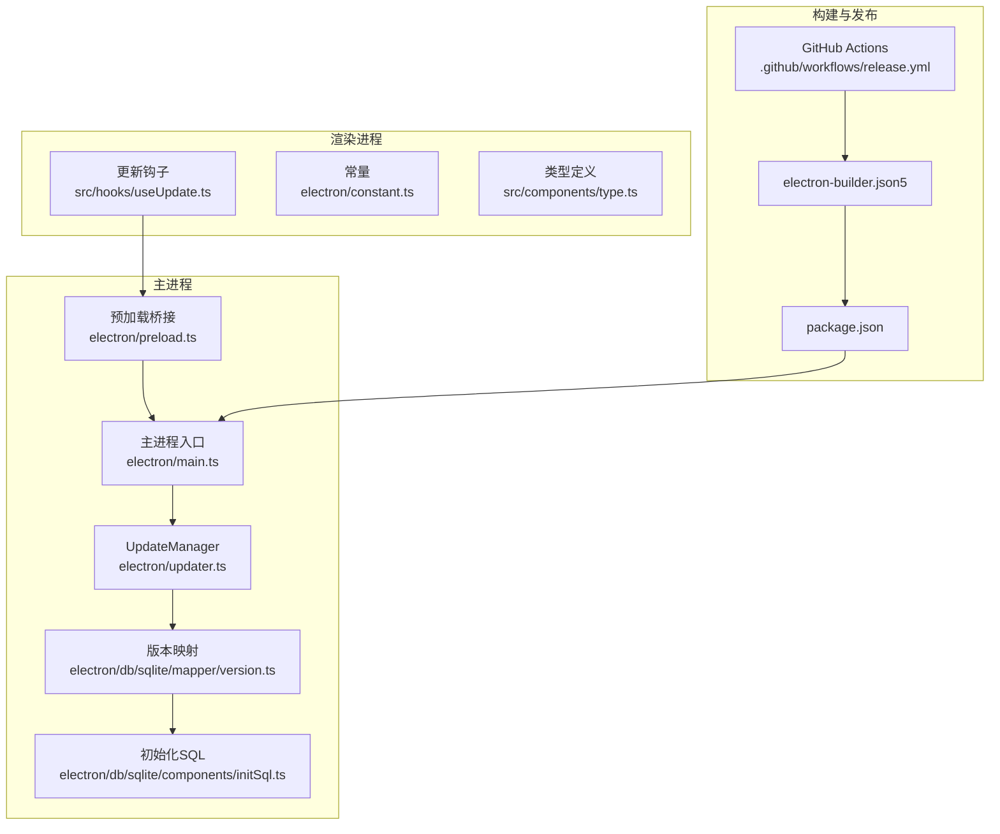
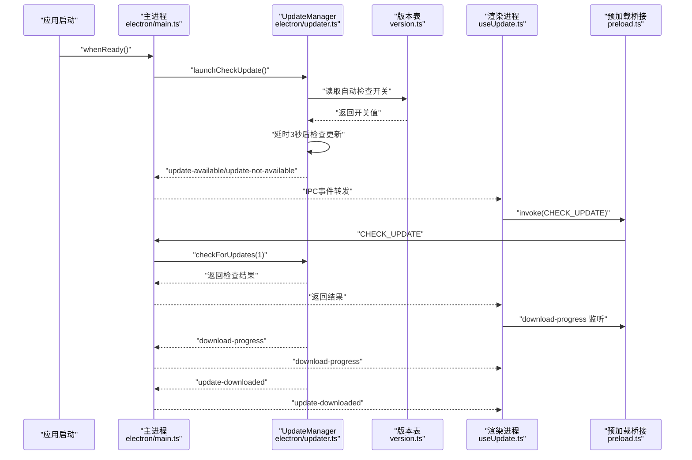
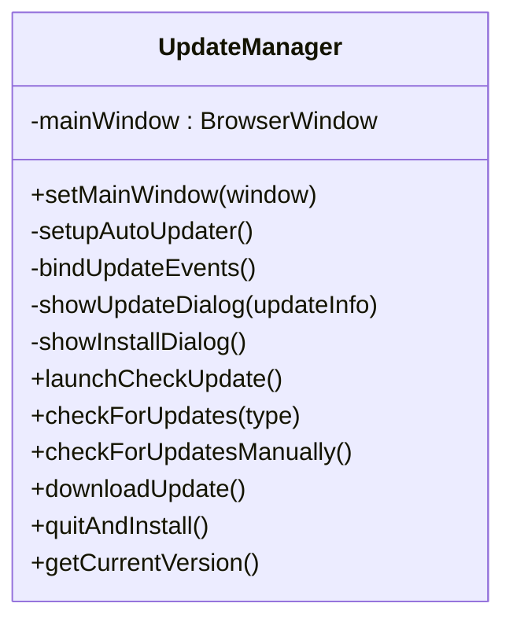
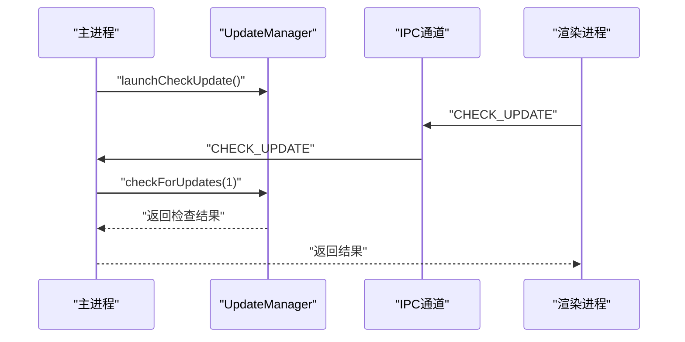
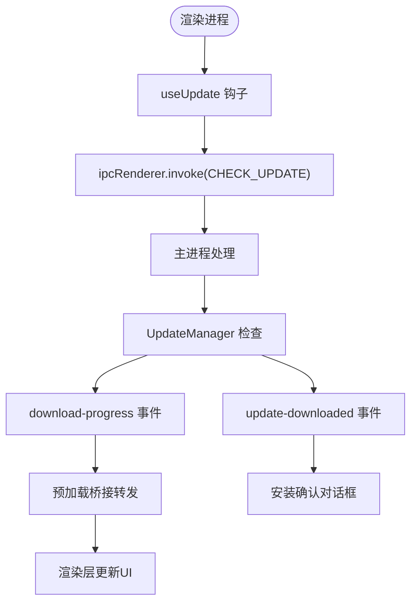
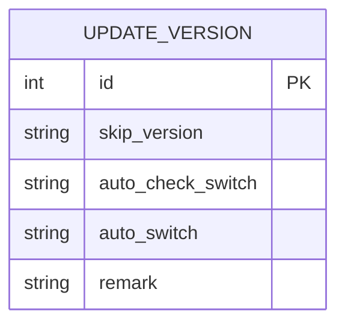
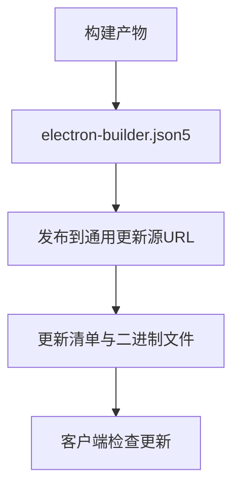
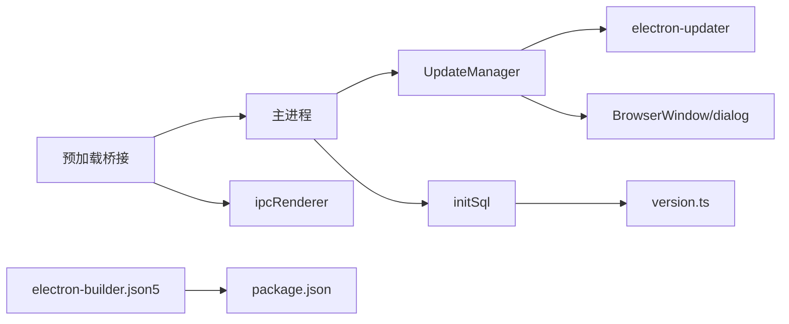

# 自动更新机制

<cite>
**本文档引用的文件**
- [electron/updater.ts](file://electron/updater.ts)
- [electron/main.ts](file://electron/main.ts)
- [electron/preload.ts](file://electron/preload.ts)
- [electron-builder.json5](file://electron-builder.json5)
- [package.json](file://package.json)
- [.github/workflows/release.yml](file://.github/workflows/release.yml)
- [electron/db/sqlite/mapper/version.ts](file://electron/db/sqlite/mapper/version.ts)
- [electron/db/sqlite/components/initSql.ts](file://electron/db/sqlite/components/initSql.ts)
- [src/hooks/useUpdate.ts](file://src/hooks/useUpdate.ts)
- [electron/constant.ts](file://electron/constant.ts)
- [src/components/type.ts](file://src/components/type.ts)
</cite>

## 目录
1. [简介](#简介)
2. [项目结构](#项目结构)
3. [核心组件](#核心组件)
4. [架构总览](#架构总览)
5. [详细组件分析](#详细组件分析)
6. [依赖关系分析](#依赖关系分析)
7. [性能考虑](#性能考虑)
8. [故障排除指南](#故障排除指南)
9. [结论](#结论)
10. [附录](#附录)

## 简介
本文件详细说明密码管理器的自动更新机制，包括更新检查流程、版本比较逻辑、更新下载与安装处理、更新服务器配置、增量更新策略与回滚机制、更新通知界面与下载进度跟踪、安装流程管理、更新配置示例、版本号规则与发布策略、更新安全性保障（证书验证与完整性检查）、更新故障排除与网络异常处理、用户反馈机制等。

## 项目结构
自动更新相关代码主要分布在以下模块：
- 主进程更新管理：electron/updater.ts
- 主进程入口与IPC：electron/main.ts
- 渲染进程桥接与便捷方法：electron/preload.ts
- 构建与发布配置：electron-builder.json5、package.json
- 数据库版本表与开关：electron/db/sqlite/mapper/version.ts、electron/db/sqlite/components/initSql.ts
- 前端更新钩子：src/hooks/useUpdate.ts
- 常量定义：electron/constant.ts
- 类型定义：src/components/type.ts

**图表来源**
- [electron/updater.ts:1-204](file://electron/updater.ts#L1-L204)
- [electron/main.ts:1-240](file://electron/main.ts#L1-L240)
- [electron/preload.ts:1-38](file://electron/preload.ts#L1-L38)
- [electron/db/sqlite/mapper/version.ts:1-37](file://electron/db/sqlite/mapper/version.ts#L1-L37)
- [electron/db/sqlite/components/initSql.ts:1-224](file://electron/db/sqlite/components/initSql.ts#L1-L224)
- [src/hooks/useUpdate.ts:1-29](file://src/hooks/useUpdate.ts#L1-L29)
- [electron-builder.json5:1-52](file://electron-builder.json5#L1-L52)
- [package.json:1-51](file://package.json#L1-L51)
- [.github/workflows/release.yml:1-51](file://.github/workflows/release.yml#L1-L51)

**章节来源**
- [electron/updater.ts:1-204](file://electron/updater.ts#L1-L204)
- [electron/main.ts:1-240](file://electron/main.ts#L1-L240)
- [electron/preload.ts:1-38](file://electron/preload.ts#L1-L38)
- [electron-builder.json5:1-52](file://electron-builder.json5#L1-L52)
- [package.json:1-51](file://package.json#L1-L51)
- [.github/workflows/release.yml:1-51](file://.github/workflows/release.yml#L1-L51)

## 核心组件
- UpdateManager：封装自动更新的检查、下载、安装、事件监听与用户交互逻辑，使用 electron-updater 提供的 API。
- 主进程入口：负责创建窗口、注册IPC、初始化数据库、启动自动更新检查。
- 预加载桥接：向渲染进程暴露便捷的更新API（检查、下载、安装、进度监听）。
- 版本表与开关：通过SQLite存储“跳过版本”、“自动检查开关”等配置项。
- 前端钩子：提供检查更新、读取/设置自动检查开关的接口。
- 构建与发布：配置通用发布源、产物命名与目标平台；GitHub Actions用于发布流程（当前仓库中为注释状态）。

**章节来源**
- [electron/updater.ts:7-204](file://electron/updater.ts#L7-L204)
- [electron/main.ts:49-60](file://electron/main.ts#L49-L60)
- [electron/preload.ts:25-38](file://electron/preload.ts#L25-L38)
- [electron/db/sqlite/mapper/version.ts:9-31](file://electron/db/sqlite/mapper/version.ts#L9-L31)
- [src/hooks/useUpdate.ts:5-29](file://src/hooks/useUpdate.ts#L5-L29)

## 架构总览
自动更新采用“主进程驱动 + 渲染进程调用”的模式：
- 主进程在应用启动后延迟触发一次自动检查（受“自动检查开关”控制），并在用户手动点击或托盘菜单触发时执行检查。
- 检查到新版本后弹出对话框，用户可选择立即下载、稍后提醒或跳过该版本。
- 下载进度通过IPC实时推送到渲染进程，渲染层显示进度条与速度。
- 下载完成后提示安装，用户确认后退出并安装新版本。

**图表来源**
- [electron/main.ts:49-60](file://electron/main.ts#L49-L60)
- [electron/main.ts:196-200](file://electron/main.ts#L196-L200)
- [electron/main.ts:203-227](file://electron/main.ts#L203-L227)
- [electron/updater.ts:143-175](file://electron/updater.ts#L143-L175)
- [electron/updater.ts:74-96](file://electron/updater.ts#L74-L96)
- [electron/preload.ts:25-38](file://electron/preload.ts#L25-L38)
- [src/hooks/useUpdate.ts:7-14](file://src/hooks/useUpdate.ts#L7-L14)

## 详细组件分析

### UpdateManager 组件分析
- 更新源配置：使用通用发布源（generic provider），指向指定URL，支持自定义更新服务器。
- 自动下载控制：关闭自动下载，改为手动下载，提升用户可控性。
- 事件绑定：统一监听错误、检查中、发现更新、无更新、下载进度、下载完成等事件，并向主进程与渲染进程广播。
- 用户交互：发现更新时弹出三选项对话框；下载完成后弹出安装确认对话框。
- 跳过版本：将用户选择跳过的版本写入数据库，后续检查时跳过该版本。
- 自动检查：根据数据库中的“自动检查开关”决定是否在启动后自动检查更新。
- 版本比较：使用 electron-updater 内部的版本比较逻辑（语义化版本），由服务器返回的元信息决定是否更新。

**图表来源**
- [electron/updater.ts:7-204](file://electron/updater.ts#L7-L204)

**章节来源**
- [electron/updater.ts:19-36](file://electron/updater.ts#L19-L36)
- [electron/updater.ts:38-97](file://electron/updater.ts#L38-L97)
- [electron/updater.ts:100-142](file://electron/updater.ts#L100-L142)
- [electron/updater.ts:143-175](file://electron/updater.ts#L143-L175)
- [electron/updater.ts:177-201](file://electron/updater.ts#L177-L201)

### 主进程入口与IPC
- 应用启动后注册托盘菜单、数据库初始化、全局快捷键，并调用 UpdateManager 启动自动检查。
- 注册IPC处理：
  - 手动检查更新
  - 下载更新
  - 安装更新
  - 获取当前版本
- 对外暴露 CHECK_UPDATE IPC，供渲染进程调用。

**图表来源**
- [electron/main.ts:49-60](file://electron/main.ts#L49-L60)
- [electron/main.ts:196-200](file://electron/main.ts#L196-L200)
- [electron/main.ts:203-227](file://electron/main.ts#L203-L227)

**章节来源**
- [electron/main.ts:49-60](file://electron/main.ts#L49-L60)
- [electron/main.ts:196-227](file://electron/main.ts#L196-L227)

### 预加载桥接与渲染层
- 预加载桥接暴露便捷方法：检查更新、下载更新、安装更新、获取当前版本、下载进度监听。
- 渲染层通过 useUpdate 钩子调用 IPC，实现“检查更新”按钮与自动检查联动。

**图表来源**
- [electron/preload.ts:25-38](file://electron/preload.ts#L25-L38)
- [src/hooks/useUpdate.ts:7-14](file://src/hooks/useUpdate.ts#L7-L14)
- [electron/main.ts:203-227](file://electron/main.ts#L203-L227)

**章节来源**
- [electron/preload.ts:25-38](file://electron/preload.ts#L25-L38)
- [src/hooks/useUpdate.ts:5-29](file://src/hooks/useUpdate.ts#L5-L29)

### 版本表与开关
- 版本表结构包含“跳过版本”、“自动检查开关”、“自动开关”等字段。
- 初始化时创建表并插入默认值。
- 提供查询与更新接口，用于控制自动检查与跳过版本。

**图表来源**
- [electron/db/sqlite/components/initSql.ts:117-129](file://electron/db/sqlite/components/initSql.ts#L117-L129)
- [electron/db/sqlite/mapper/version.ts:9-31](file://electron/db/sqlite/mapper/version.ts#L9-L31)

**章节来源**
- [electron/db/sqlite/components/initSql.ts:107-150](file://electron/db/sqlite/components/initSql.ts#L107-L150)
- [electron/db/sqlite/mapper/version.ts:9-31](file://electron/db/sqlite/mapper/version.ts#L9-L31)

### 更新服务器配置与发布策略
- 更新服务器：使用通用发布源（generic provider），指向固定URL，适用于自建静态更新服务器。
- 构建配置：electron-builder.json5 定义输出目录、目标平台、产物命名模板、NSIS安装器参数等。
- 发布策略：package.json 中定义了发布源URL；GitHub Actions 工作流当前为注释状态，未启用自动化发布。

**图表来源**
- [electron-builder.json5:47-50](file://electron-builder.json5#L47-L50)
- [package.json:45-48](file://package.json#L45-L48)
- [.github/workflows/release.yml:1-51](file://.github/workflows/release.yml#L1-L51)

**章节来源**
- [electron-builder.json5:1-52](file://electron-builder.json5#L1-L52)
- [package.json:1-51](file://package.json#L1-L51)
- [.github/workflows/release.yml:1-51](file://.github/workflows/release.yml#L1-L51)

### 版本号规则与比较逻辑
- 版本比较：使用 electron-updater 的内部版本比较（语义化版本），由服务器返回的版本信息决定是否更新。
- 当前版本：通过 getCurrentVersion 获取当前应用版本。
- 跳过版本：用户选择跳过后，后续检查将忽略该版本。

**章节来源**
- [electron/updater.ts:197-201](file://electron/updater.ts#L197-L201)
- [electron/updater.ts:52-64](file://electron/updater.ts#L52-L64)

### 增量更新策略与回滚机制
- 增量更新：当前实现未显式配置增量更新策略，使用 electron-updater 默认的全量更新机制。
- 回滚机制：当安装失败或新版本不稳定时，可通过“跳过版本”功能避免重复更新；若需完全回滚，建议保留旧版本安装包或通过发行渠道重新安装。

**章节来源**
- [electron/updater.ts:32-32](file://electron/updater.ts#L32-L32)
- [electron/updater.ts:121-123](file://electron/updater.ts#L121-L123)

### 更新通知界面与下载进度跟踪
- 通知界面：发现更新时弹出三选项对话框；下载完成后弹出安装确认对话框。
- 下载进度：通过 download-progress 事件向渲染进程推送百分比、已传输字节、总字节、速度等信息，渲染层可据此更新UI。

**章节来源**
- [electron/updater.ts:100-125](file://electron/updater.ts#L100-L125)
- [electron/updater.ts:128-142](file://electron/updater.ts#L128-L142)
- [electron/updater.ts:74-96](file://electron/updater.ts#L74-L96)

### 安装流程管理
- 安装流程：下载完成后提示安装，用户确认后调用 quitAndInstall 触发安装。
- 安装器参数：NSIS 安装器支持一键安装、允许更改安装目录等配置。

**章节来源**
- [electron/updater.ts:192-195](file://electron/updater.ts#L192-L195)
- [electron-builder.json5:34-39](file://electron-builder.json5#L34-L39)

### 更新配置示例
- 更新服务器URL：在 electron-builder.json5 与 package.json 中均配置了通用发布源URL。
- 自动检查开关：通过版本表中的 auto_check_switch 控制是否在启动后自动检查更新。
- 跳过版本：通过版本表中的 skip_version 记录用户跳过的版本。

**章节来源**
- [electron-builder.json5:47-50](file://electron-builder.json5#L47-L50)
- [package.json:45-48](file://package.json#L45-L48)
- [electron/db/sqlite/mapper/version.ts:21-31](file://electron/db/sqlite/mapper/version.ts#L21-L31)

### 更新安全性保障
- 证书验证：当前配置使用通用发布源（generic provider），未启用强制HTTPS或证书校验。建议在生产环境启用 HTTPS 并配置证书校验。
- 完整性检查：electron-updater 默认支持基于签名的完整性校验，但当前未配置签名。建议在构建与发布流程中启用签名与校验。

**章节来源**
- [electron/updater.ts:27-30](file://electron/updater.ts#L27-L30)
- [electron-builder.json5:47-50](file://electron-builder.json5#L47-L50)

## 依赖关系分析
- UpdateManager 依赖 electron-updater、Electron BrowserWindow、dialog、EventEmitter。
- 主进程依赖 UpdateManager、SQLite 初始化与版本映射。
- 预加载桥接依赖 ipcRenderer，向渲染进程暴露更新相关API。
- 构建配置依赖 electron-builder，发布配置依赖 package.json 的 publish 字段。

**图表来源**
- [electron/updater.ts:2-5](file://electron/updater.ts#L2-L5)
- [electron/main.ts:27-27](file://electron/main.ts#L27-L27)
- [electron/db/sqlite/components/initSql.ts:107-129](file://electron/db/sqlite/components/initSql.ts#L107-L129)
- [electron/db/sqlite/mapper/version.ts:9-31](file://electron/db/sqlite/mapper/version.ts#L9-L31)
- [electron/preload.ts:1-38](file://electron/preload.ts#L1-L38)
- [electron-builder.json5:1-52](file://electron-builder.json5#L1-L52)
- [package.json:1-51](file://package.json#L1-L51)

**章节来源**
- [electron/updater.ts:1-204](file://electron/updater.ts#L1-L204)
- [electron/main.ts:1-240](file://electron/main.ts#L1-L240)
- [electron/preload.ts:1-38](file://electron/preload.ts#L1-L38)
- [electron-builder.json5:1-52](file://electron-builder.json5#L1-L52)
- [package.json:1-51](file://package.json#L1-L51)

## 性能考虑
- 自动检查延迟：启动后延迟3秒再检查，避免阻塞主窗口显示。
- 下载进度推送：按事件推送进度，避免轮询带来的开销。
- 手动下载控制：关闭自动下载，减少后台资源占用。

**章节来源**
- [electron/updater.ts:152-155](file://electron/updater.ts#L152-L155)
- [electron/updater.ts:74-96](file://electron/updater.ts#L74-L96)
- [electron/updater.ts:32-32](file://electron/updater.ts#L32-L32)

## 故障排除指南
- 检查更新失败：监听 error 事件，记录错误日志并提示用户。
- 网络异常：建议在网络不可用时提示用户稍后再试，并提供手动检查更新入口。
- 用户反馈：通过对话框与消息提示告知用户当前状态（已是最新、下载进度、安装完成）。
- 跳过版本无效：确认版本表中的 skip_version 是否正确写入，且检查逻辑是否生效。
- 自动检查未触发：确认版本表中的 auto_check_switch 是否为“1”，并检查启动延迟逻辑。

**章节来源**
- [electron/updater.ts:40-43](file://electron/updater.ts#L40-L43)
- [electron/updater.ts:146-150](file://electron/updater.ts#L146-L150)
- [electron/updater.ts:57-60](file://electron/updater.ts#L57-L60)

## 结论
该自动更新机制以 Electron 主进程为核心，结合预加载桥接与渲染层钩子，实现了可控的更新检查、下载与安装流程。通过 SQLite 存储“跳过版本”和“自动检查开关”，提升了用户体验与灵活性。建议在生产环境中启用 HTTPS 与签名校验，完善发布流程与增量更新策略，进一步增强安全性与稳定性。

## 附录
- 常用IPC常量：AUTO_CHECK_UPDATE_SWITCH_SELECT、AUTO_UPDATE_SWITCH_UPDATE、CHECK_UPDATE。
- 类型定义：UpdateVersion 包含 skip_version、auto_check_switch 等字段。
- GitHub Actions：当前为注释状态，可按需启用自动化发布。

**章节来源**
- [electron/constant.ts:56-60](file://electron/constant.ts#L56-L60)
- [src/components/type.ts:39-47](file://src/components/type.ts#L39-L47)
- [.github/workflows/release.yml:1-51](file://.github/workflows/release.yml#L1-L51)