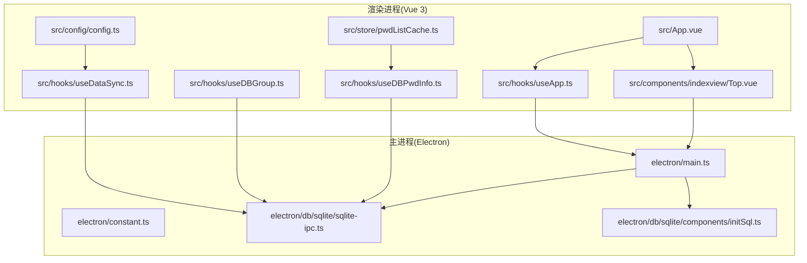
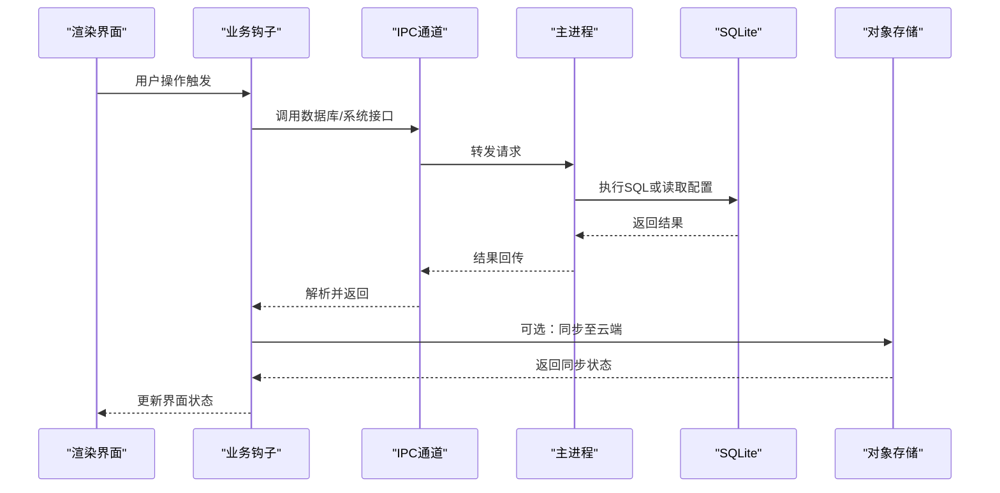
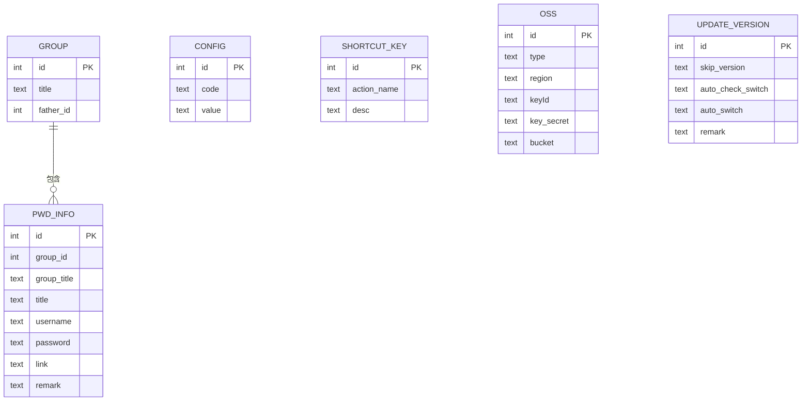
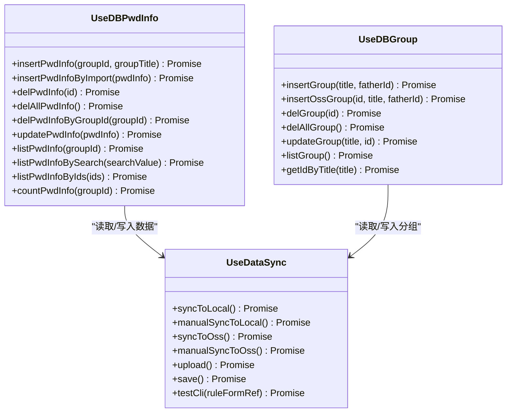
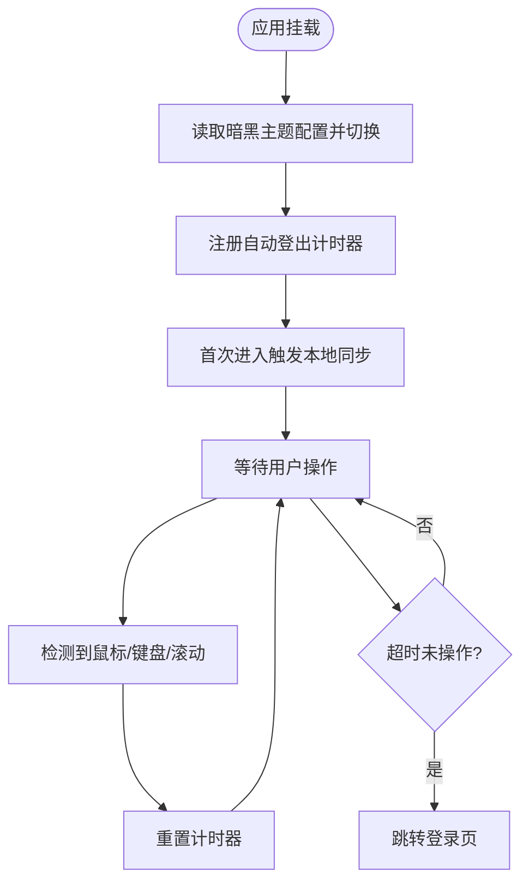
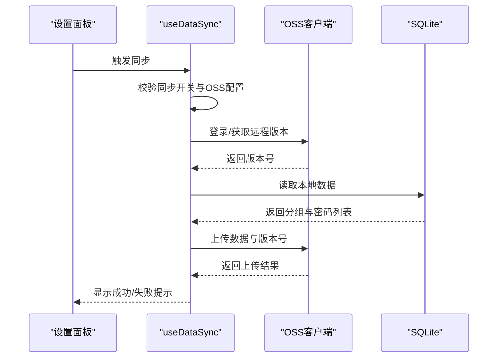
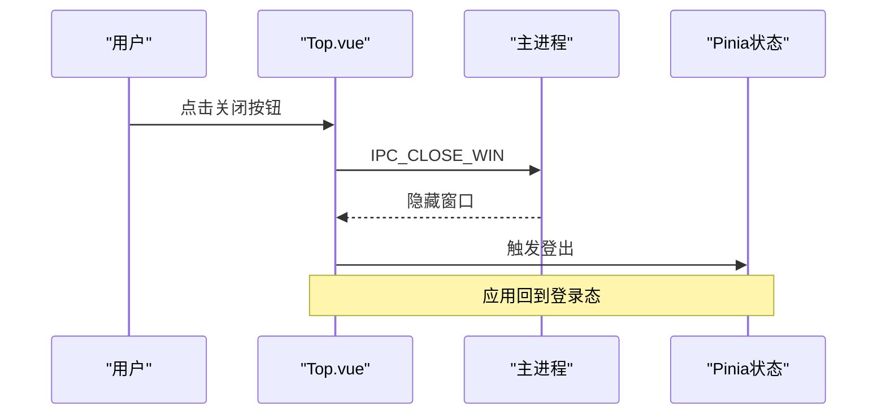
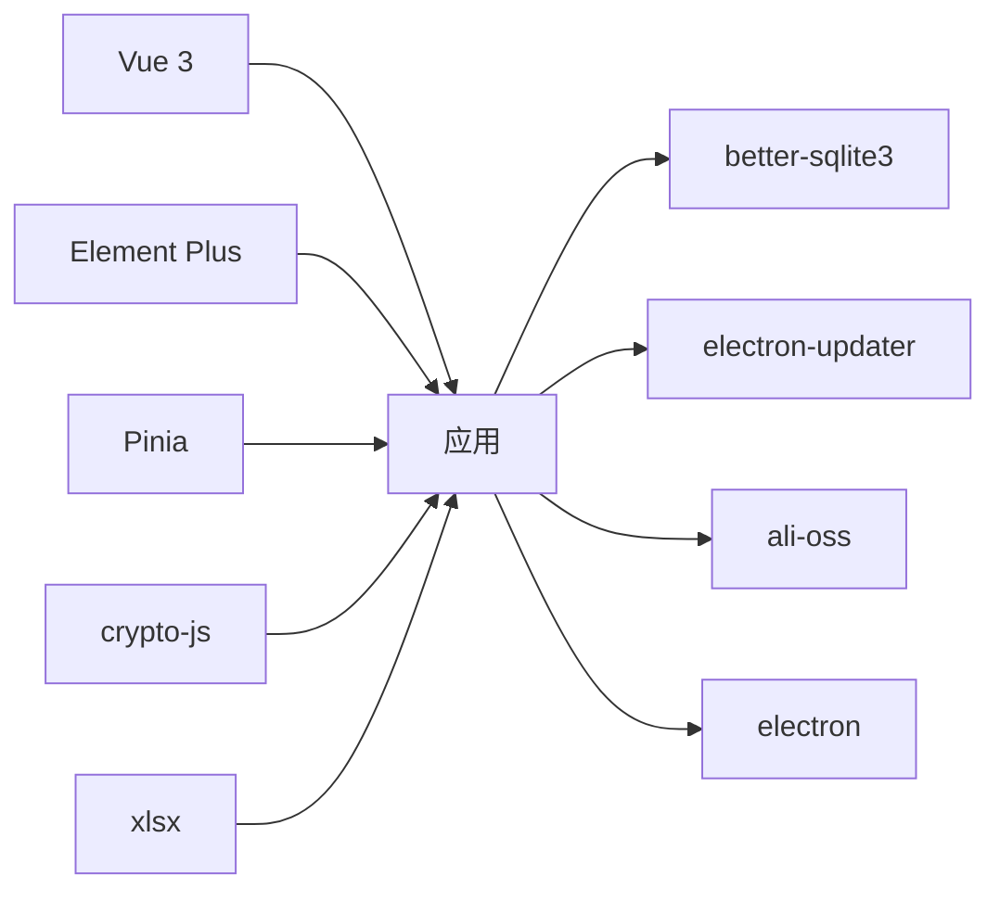

# 项目概述

<cite>
**本文档引用的文件**
- [package.json](file://package.json)
- [src/main.ts](file://src/main.ts)
- [electron/main.ts](file://electron/main.ts)
- [electron/constant.ts](file://electron/constant.ts)
- [electron/db/sqlite/components/initSql.ts](file://electron/db/sqlite/components/initSql.ts)
- [electron/db/sqlite/sqlite-ipc.ts](file://electron/db/sqlite/sqlite-ipc.ts)
- [src/App.vue](file://src/App.vue)
- [src/components/indexview/Top.vue](file://src/components/indexview/Top.vue)
- [src/hooks/useApp.ts](file://src/hooks/useApp.ts)
- [src/hooks/useDataSync.ts](file://src/hooks/useDataSync.ts)
- [src/hooks/useDBPwdInfo.ts](file://src/hooks/useDBPwdInfo.ts)
- [src/hooks/useDBGroup.ts](file://src/hooks/useDBGroup.ts)
- [src/store/pwdListCache.ts](file://src/store/pwdListCache.ts)
- [src/config/config.ts](file://src/config/config.ts)
</cite>

## 目录
1. [引言](#引言)
2. [项目结构](#项目结构)
3. [核心组件](#核心组件)
4. [架构总览](#架构总览)
5. [详细组件分析](#详细组件分析)
6. [依赖关系分析](#依赖关系分析)
7. [性能考虑](#性能考虑)
8. [故障排查指南](#故障排查指南)
9. [结论](#结论)
10. [附录](#附录)

## 引言
本项目是一个基于 Electron + Vue 3 + TypeScript 构建的跨平台桌面密码管理器应用。其目标是为用户提供安全、便捷的密码存储与管理体验，支持分组管理、数据同步（本地与云端）、快捷键操作、自动锁定与主题切换等核心能力。项目采用 SQLite 作为本地数据存储，结合 OSS（对象存储服务）实现数据的云端备份与恢复；前端通过 IPC 与主进程通信，实现对数据库与系统功能的统一调用。

## 项目结构
项目采用“主进程 + 渲染进程 + 数据层”的三层架构：
- 主进程（Electron）负责窗口生命周期、系统托盘、全局快捷键、更新机制、数据库 IPC 注册与路由。
- 渲染进程（Vue 3 + TypeScript）负责 UI 展示、业务逻辑、状态管理（Pinia）、加密解密与数据同步。
- 数据层（SQLite + OSS）负责本地持久化与云端同步，提供结构化的配置、分组、密码条目与快捷键数据。

**图表来源**
- [electron/main.ts:1-240](file://electron/main.ts#L1-L240)
- [electron/constant.ts:1-63](file://electron/constant.ts#L1-L63)
- [electron/db/sqlite/sqlite-ipc.ts:1-220](file://electron/db/sqlite/sqlite-ipc.ts#L1-L220)
- [electron/db/sqlite/components/initSql.ts:1-224](file://electron/db/sqlite/components/initSql.ts#L1-L224)
- [src/App.vue:1-19](file://src/App.vue#L1-L19)
- [src/components/indexview/Top.vue:1-108](file://src/components/indexview/Top.vue#L1-L108)
- [src/hooks/useApp.ts:1-71](file://src/hooks/useApp.ts#L1-L71)
- [src/hooks/useDBPwdInfo.ts:1-103](file://src/hooks/useDBPwdInfo.ts#L1-L103)
- [src/hooks/useDBGroup.ts:1-53](file://src/hooks/useDBGroup.ts#L1-L53)
- [src/hooks/useDataSync.ts:1-324](file://src/hooks/useDataSync.ts#L1-L324)
- [src/store/pwdListCache.ts:1-37](file://src/store/pwdListCache.ts#L1-L37)
- [src/config/config.ts:1-143](file://src/config/config.ts#L1-L143)

**章节来源**
- [package.json:1-51](file://package.json#L1-L51)
- [src/main.ts:1-20](file://src/main.ts#L1-L20)
- [electron/main.ts:1-240](file://electron/main.ts#L1-L240)

## 核心组件
- 应用入口与状态初始化
  - 渲染入口：创建 Vue 应用、挂载 Pinia、注册全局事件监听。
  - 应用初始化钩子：设置暗黑主题、自动登出计时、首次进入触发自动同步。
- 数据库与同步
  - SQLite 表初始化：分组、密码条目、配置、快捷键、OSS 配置、版本表。
  - SQLite IPC：封装 CRUD 与查询接口，统一由主进程处理数据库事务。
  - 数据同步：本地与 OSS 之间的双向同步，包含版本控制、自动/手动同步策略。
- UI 组件与交互
  - 顶部工具栏：最小化、最大化/还原、关闭窗口，集成全局快捷键。
  - 分组与密码条目：增删改查、搜索、导入导出、缓存刷新。
  - 设置面板：基础设置、快捷键配置、数据同步、登录密码修改等。

**章节来源**
- [src/main.ts:1-20](file://src/main.ts#L1-L20)
- [src/hooks/useApp.ts:1-71](file://src/hooks/useApp.ts#L1-L71)
- [electron/db/sqlite/components/initSql.ts:26-105](file://electron/db/sqlite/components/initSql.ts#L26-L105)
- [electron/db/sqlite/sqlite-ipc.ts:58-220](file://electron/db/sqlite/sqlite-ipc.ts#L58-L220)
- [src/hooks/useDataSync.ts:40-131](file://src/hooks/useDataSync.ts#L40-L131)
- [src/components/indexview/Top.vue:14-27](file://src/components/indexview/Top.vue#L14-L27)

## 架构总览
应用采用“主进程桥接 + 渲染进程调用 + 数据层抽象”的设计模式：
- 主进程负责窗口、托盘、快捷键、更新与数据库 IPC 注册。
- 渲染进程通过常量定义的 IPC 通道与主进程通信，执行数据库操作与系统功能。
- 数据层以 SQLite 为核心，配合 OSS 实现跨设备数据一致性与备份。

**图表来源**
- [electron/main.ts:149-227](file://electron/main.ts#L149-L227)
- [electron/db/sqlite/sqlite-ipc.ts:58-220](file://electron/db/sqlite/sqlite-ipc.ts#L58-L220)
- [src/hooks/useDBPwdInfo.ts:65-76](file://src/hooks/useDBPwdInfo.ts#L65-L76)
- [src/hooks/useDataSync.ts:173-201](file://src/hooks/useDataSync.ts#L173-L201)

## 详细组件分析

### 数据库初始化与表结构
- 初始化流程：检查配置表存在性，不存在则创建分组、密码条目、配置、快捷键、OSS、版本表，并插入默认数据。
- 关键表：
  - 分组表：记录分组名称与父子关系。
  - 密码条目表：记录分组ID、标题、用户名、加密后的密码、链接与备注。
  - 配置表：存储应用配置项（如自动启动、暗黑主题、默认登录密码、版本号、同步开关等）。
  - 快捷键表：存储各功能的快捷键描述。
  - OSS 表：存储 OSS 类型与鉴权信息。
  - 版本表：记录本地与远程版本号，用于同步一致性判断。

**图表来源**
- [electron/db/sqlite/components/initSql.ts:48-129](file://electron/db/sqlite/components/initSql.ts#L48-L129)

**章节来源**
- [electron/db/sqlite/components/initSql.ts:26-224](file://electron/db/sqlite/components/initSql.ts#L26-L224)

### 数据库 IPC 与业务钩子
- IPC 映射：主进程集中注册 SQLite 的增删改查与版本、配置、快捷键、OSS 的读写接口。
- 业务钩子：
  - useDBPwdInfo：封装密码条目的插入、删除、更新、查询、搜索、按ID集合查询与数量统计；在写入/更新时进行加密，在读取时进行解密。
  - useDBGroup：封装分组的插入、删除、清空、更新、查询与按标题获取ID。
  - useDataSync：封装本地与 OSS 的双向同步，包含版本号对比、自动/手动同步、OSS 登录测试与错误提示。

**图表来源**
- [src/hooks/useDBPwdInfo.ts:17-103](file://src/hooks/useDBPwdInfo.ts#L17-L103)
- [src/hooks/useDBGroup.ts:13-53](file://src/hooks/useDBGroup.ts#L13-L53)
- [src/hooks/useDataSync.ts:19-324](file://src/hooks/useDataSync.ts#L19-L324)

**章节来源**
- [electron/db/sqlite/sqlite-ipc.ts:58-220](file://electron/db/sqlite/sqlite-ipc.ts#L58-L220)
- [src/hooks/useDBPwdInfo.ts:17-103](file://src/hooks/useDBPwdInfo.ts#L17-L103)
- [src/hooks/useDBGroup.ts:13-53](file://src/hooks/useDBGroup.ts#L13-L53)
- [src/hooks/useDataSync.ts:19-324](file://src/hooks/useDataSync.ts#L19-L324)

### 应用初始化与自动锁定
- 初始化阶段：设置暗黑主题、注册自动登出计时器（基于鼠标移动、键盘输入、滚动事件重置），首次进入触发本地数据同步。
- 自动锁定：若长时间无操作，自动跳转至登录页，提升安全性。

**图表来源**
- [src/hooks/useApp.ts:18-68](file://src/hooks/useApp.ts#L18-L68)

**章节来源**
- [src/hooks/useApp.ts:10-71](file://src/hooks/useApp.ts#L10-L71)

### 数据同步流程（本地 ↔ OSS）
- 自动/手动同步：根据配置决定是否自动拉取或上传；上传前递增本地版本号并校验远程版本。
- 版本控制：通过版本表字段确保同步方向与一致性，避免覆盖或丢失。
- 错误处理：针对 OSS 参数缺失、鉴权失败、网络异常等场景给出明确提示。

**图表来源**
- [src/hooks/useDataSync.ts:133-201](file://src/hooks/useDataSync.ts#L133-L201)
- [src/hooks/useDataSync.ts:233-251](file://src/hooks/useDataSync.ts#L233-L251)

**章节来源**
- [src/hooks/useDataSync.ts:40-131](file://src/hooks/useDataSync.ts#L40-L131)
- [src/hooks/useDataSync.ts:133-201](file://src/hooks/useDataSync.ts#L133-L201)
- [src/hooks/useDataSync.ts:233-251](file://src/hooks/useDataSync.ts#L233-L251)

### UI 与系统交互
- 顶部工具栏：提供最小化、最大化/还原、关闭窗口按钮；关闭时隐藏窗口并触发登出。
- 系统托盘：窗口最小化到托盘，支持全局快捷键唤起主窗体。
- 全局快捷键：可在设置中自定义，主进程注册并响应。

**图表来源**
- [src/components/indexview/Top.vue:23-27](file://src/components/indexview/Top.vue#L23-L27)
- [electron/main.ts:190-194](file://electron/main.ts#L190-L194)

**章节来源**
- [src/components/indexview/Top.vue:14-27](file://src/components/indexview/Top.vue#L14-L27)
- [electron/main.ts:149-161](file://electron/main.ts#L149-L161)

## 依赖关系分析
- 前端依赖：Vue 3、Element Plus、Pinia、mitt（事件总线）、crypto-js（加密）、xlsx（Excel 导入导出）、pinyin-match（模糊匹配）。
- 主进程依赖：better-sqlite3（SQLite）、electron-updater（自动更新）、ali-oss（OSS）、electron（Electron 核心）。
- 构建工具：Vite、electron-builder、TypeScript。

**图表来源**
- [package.json:18-44](file://package.json#L18-L44)

**章节来源**
- [package.json:18-44](file://package.json#L18-L44)

## 性能考虑
- 数据缓存：使用 Pinia 缓存密码列表的关键字段，减少重复查询与渲染压力。
- 加密开销：仅在写入/导入时进行加密，读取时解密，避免频繁加解密影响性能。
- 同步策略：自动同步仅在满足条件时触发，手动同步提供即时反馈，降低后台资源占用。
- UI 交互：窗口透明与无边框设计需注意绘制性能，建议在高 DPI 场景下启用硬件加速。

**章节来源**
- [src/store/pwdListCache.ts:6-37](file://src/store/pwdListCache.ts#L6-L37)
- [src/hooks/useDBPwdInfo.ts:18-63](file://src/hooks/useDBPwdInfo.ts#L18-L63)

## 故障排查指南
- 同步失败
  - 检查 OSS 配置是否完整（region、keyId、keySecret、bucket）。
  - 确认 OSS 权限与跨域设置正确。
  - 查看版本号状态：本地版本应小于等于远程版本，否则需先拉取远程数据。
- 登录失败
  - 校验 AccessKeyId 与 Signature 是否正确。
  - 检查用户权限与桶访问权限。
- 自动同步未生效
  - 确认同步开关与自动上传/下载开关状态。
  - 检查网络连通性与代理设置。
- 自动锁定频繁
  - 调整自动锁定时间间隔，避免误触。

**章节来源**
- [src/hooks/useDataSync.ts:66-73](file://src/hooks/useDataSync.ts#L66-L73)
- [src/hooks/useDataSync.ts:212-231](file://src/hooks/useDataSync.ts#L212-L231)
- [src/hooks/useDataSync.ts:300-320](file://src/hooks/useDataSync.ts#L300-L320)

## 结论
本项目以 Electron 为宿主，结合 Vue 3 的组件化开发与 TypeScript 的类型安全，构建了功能完备的桌面密码管理器。通过 SQLite 与 OSS 的组合，实现了本地高效存储与云端可靠同步；借助 Pinia 状态管理与加密模块，兼顾了易用性与安全性。整体架构清晰、职责分离明确，适合进一步扩展更多安全特性与多端同步能力。

## 附录
- 常见用例示例
  - 新建分组：在分组视图中点击新建，输入标题与父级分组，保存后刷新列表。
  - 添加密码条目：选择分组后点击新增，填写标题、用户名、密码（自动加密）、链接与备注，保存后立即可见。
  - 搜索密码：在搜索框中输入关键词，支持拼音匹配，快速定位目标条目。
  - 同步到云端：配置 OSS 参数后，点击“上传”或等待自动同步，确认版本号递增。
  - 修改快捷键：在设置中调整快捷键描述，保存后主进程重新注册全局快捷键。