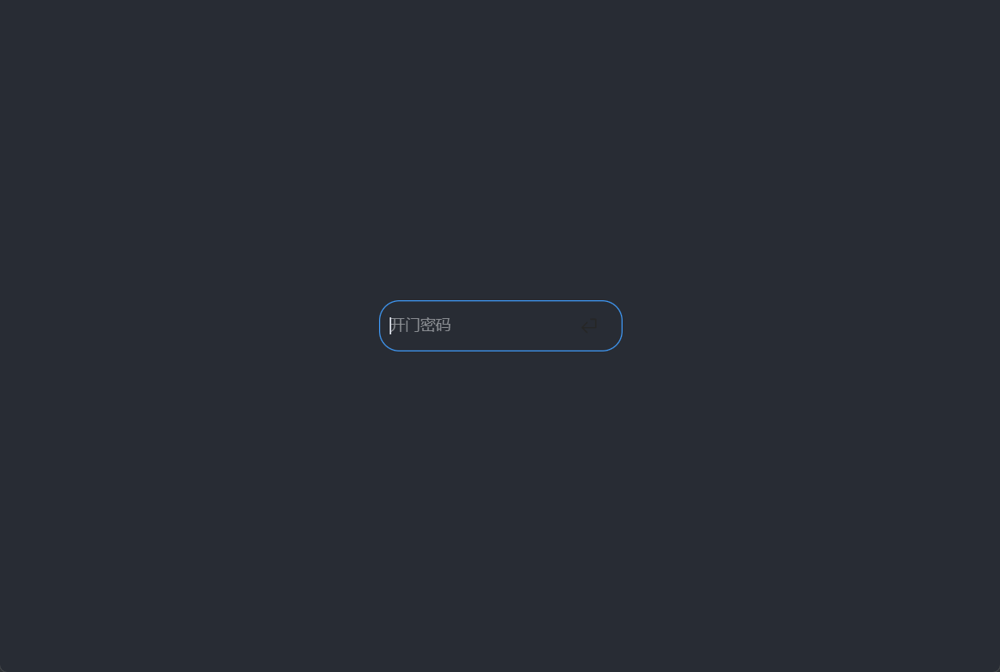
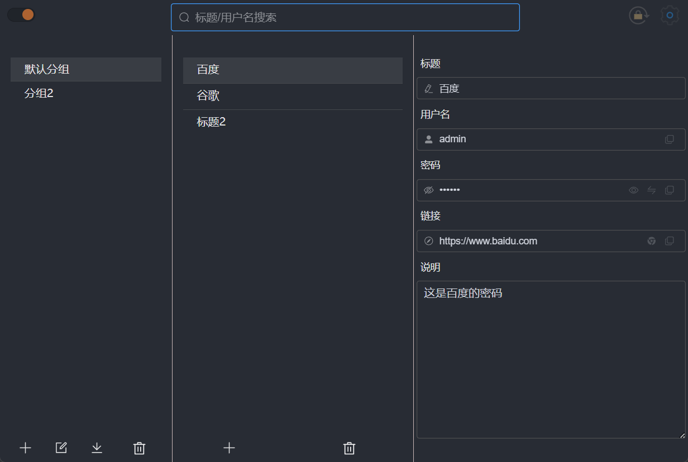
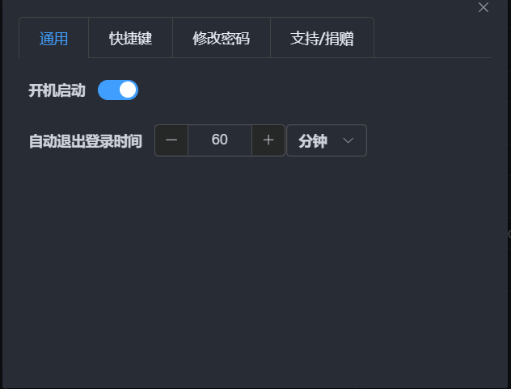

<p align="center">
	
</p>


<h1 align="center" style="margin: 30px 0 30px; font-weight: bold;">密码管理器1.0.0</h1>

# 简介

​	一直想把 手机上 和 电脑上 的密码进行同步, 但是觉得没有合适的, 于是就利用空闲时间和老婆一起开发了一套密码管理器系统


​	本项目是通过`Electron ` 开发, 全平台适配(`win/mac/linux`),现阶段只有`pc`端, 后面会陆续更新功能以及 开发安卓端的`app`

> **注意:** 本人只在 `win` 平台下进行了充分的测试,其余两个平台如有问题,可以提 `issue`,同时也欢迎大家一起参与这个项目
>
> 本项目完全开源 , 毫无保留给个人及企业免费使用。
>
> 如果你有个性化的需求 ,  这个项目希望方便到大家. 直接上手进行二次开发

### 技术栈

​	Electron + Vue3 + Ts +  Vite5 + ElementPlus
​	Node开发环境: v20.15.0

# 演示图

##  登录页




## 主界面




## 设置界面




# 待做功能

## 集成sqlite 存放数据

## 鼠标拖拽的方式切换分组

## 数据同步到阿里云

## 样式优化
###  黑夜/白天模式样式优化

### top 栏 还原 图片


# 二次开发

##### 安装依赖

```
npm  i
```
##### 启动

```
npm run dev
```
##### 打包

```
npm run build
```


# 微信交流群

