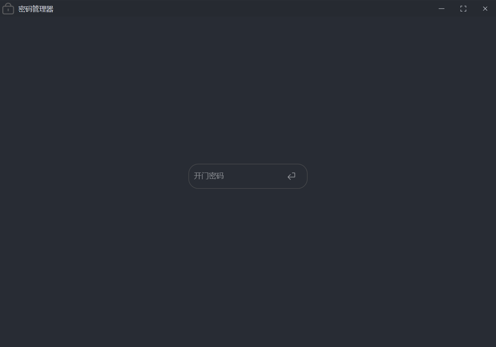
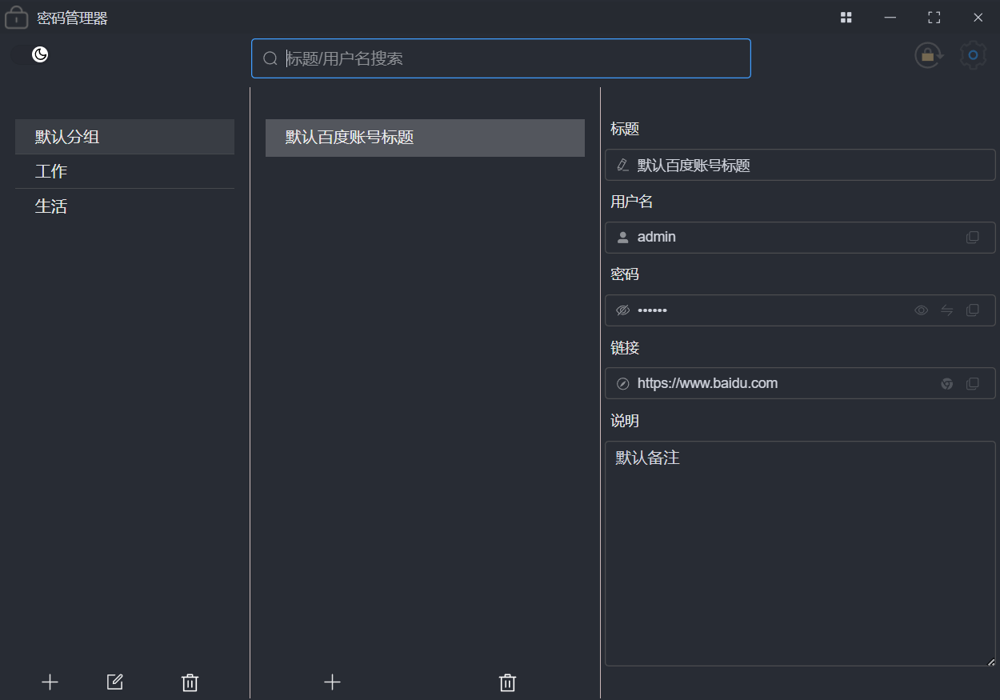
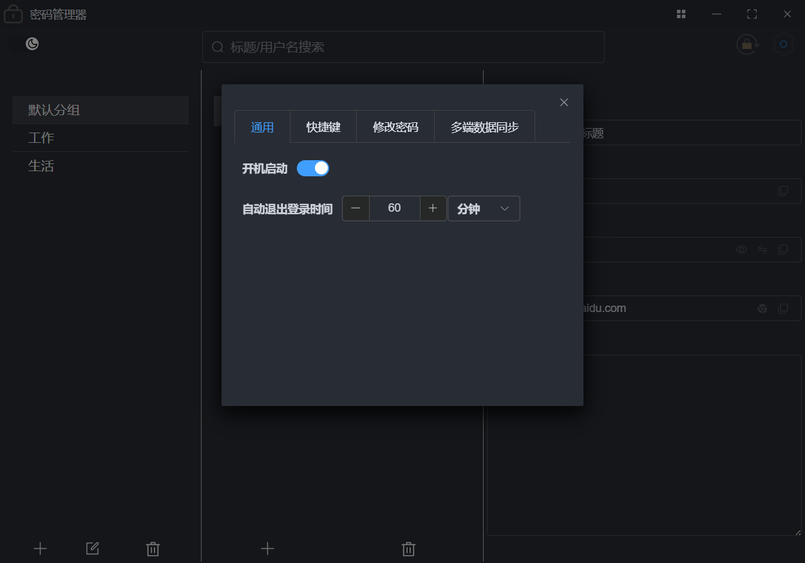
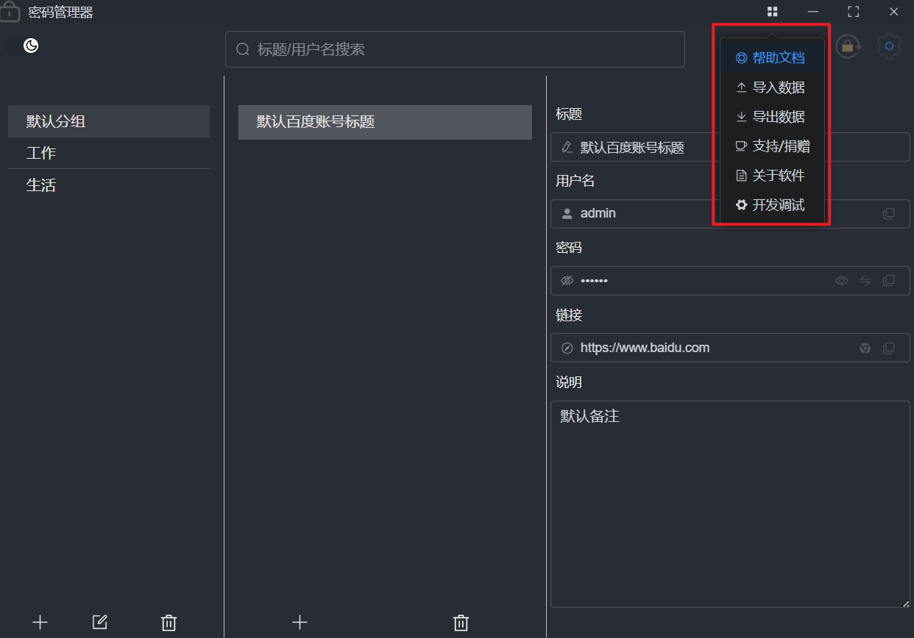
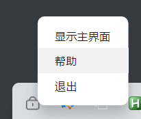

<p align="center">
	
</p>


<h1 align="center" style="margin: 30px 0 30px; font-weight: bold;">密码管理器1.0.0</h1>

# 简介

 一直想把 手机上 和 电脑上 的密码进行同步, 但是觉得没有合适的, 于是就利用空闲时间自己开发了一套密码管理器系统.

 本项目是通过`Electron ` 开发, 全平台适配(`win/mac/linux`),现阶段只有`pc`端, 后面会陆续更新功能以及 开发安卓端的`app`

> **注意:** 本人只在 `win` 平台下进行了充分的测试,其余两个平台如有问题,可以提 `issue`,同时也欢迎大家一起参与这个项目
>
> 本项目完全开源 , 毫无保留给个人及企业免费使用。
>
> 如果你有个性化的需求 , 这个项目希望方便到大家. 直接上手进行二次开发

### 技术栈

 Electron + Vue3 + Ts + Vite5 + ElementPlus

Node版本 20.15.0

# 免责声明


- **合理使用，风险自担：**本软件旨在帮助您管理如社交媒体、邮箱等非金融类账户的密码。强烈建议避免存储涉及资金交易的重要密码，例如银行卡、支付宝及微信支付密码等。
  **您的安全意识是第一道防线。**
- 牢记登录密码：为保障账户安全，<font color='red'>若您遗失【密码管理器】的登录密码，当前版本暂不提供找回服务</font>。请务必妥善保管您的登录信息，这是访问您所有存储密码的唯一途径。
- 安全声明：

   虽然我们持续优化软件的安全性能，但任何电子设备和网络环境都无法保证绝对安全。

   使用本软件存储密码存在一定的风险，一旦发生密码泄露、丢失等情况，作者不承担任何责任。

   我们鼓励用户采取多层防护措施，如定期更换密码，增加复杂度等。
- **隐私保护承诺：**【密码管理器】严格遵守隐私政策，**<font color='skyblue'>承诺该软件永远不会以任何方式保留您的任何数据</font>**确保最大程度的隐私安全。

# 演示图

## 登录页



## 主界面



## 设置界面



## 菜单界面




## 托盘界面



# 软件下载地址

### 百度网盘

链接：https://pan.baidu.com/s/1cuRzhTleXLY0ttTg0knaEw?pwd=da2o
提取码：da2o

# 未来待做

## 功能

- 3分钟内 密码登录失败超过5次后 锁定登录30秒
  - 10分钟内超过10次 锁定1小时
  - 1小时内超过20次 锁定1天
- 鼠标拖拽的方式切换分组

# 二次开发

##### 安装依赖

```
npm  i
```

##### 启动

```
npm run dev
```

##### 打包

```
npm run build
```


## 问题指引

### 1. better_sqlite3  NODE_MODULE_VERSION  版本不一致报错

```bash
Error: The module '\\?\F:\electron\password-manager\node_modules\better-sqlite3\build\Release\better_sqlite3.node'
was compiled against a different Node.js version using
NODE_MODULE_VERSION 115. This version of Node.js requires
NODE_MODULE_VERSION 123. Please try re-compiling or re-installing
the module (for instance, using `npm rebuild` or `npm install`).
   at process.func [as dlopen] (node:electron/js2c/node_init:2:2214)
   at Module._extensions..node (node:internal/modules/cjs/loader:1470:18)
   at Object.func [as .node] (node:electron/js2c/node_init:2:2214)
   at Module.load (node:internal/modules/cjs/loader:1215:32)
   at Module._load (node:internal/modules/cjs/loader:1031:12)
   at c._load (node:electron/js2c/node_init:2:13801)
   at Module.require (node:internal/modules/cjs/loader:1240:19)
   at require (node:internal/modules/helpers:179:18)
   at bindings (F:\electron\password-manager\node_modules\bindings\bindings.js:112:48)
   at new Database (F:\electron\password-manager\node_modules\better-sqlite3\lib\database.js:48:64) {
 code: 'ERR_DLOPEN_FAILED'

```

#### 解决

[参考文章](https://blog.csdn.net/OnMyWaySc/article/details/140570160?csdn_share_tail=%7B%22type%22%3A%22blog%22%2C%22rType%22%3A%22article%22%2C%22rId%22%3A%22140570160%22%2C%22source%22%3A%22OnMyWaySc%22%7D)


# 微信交流群

