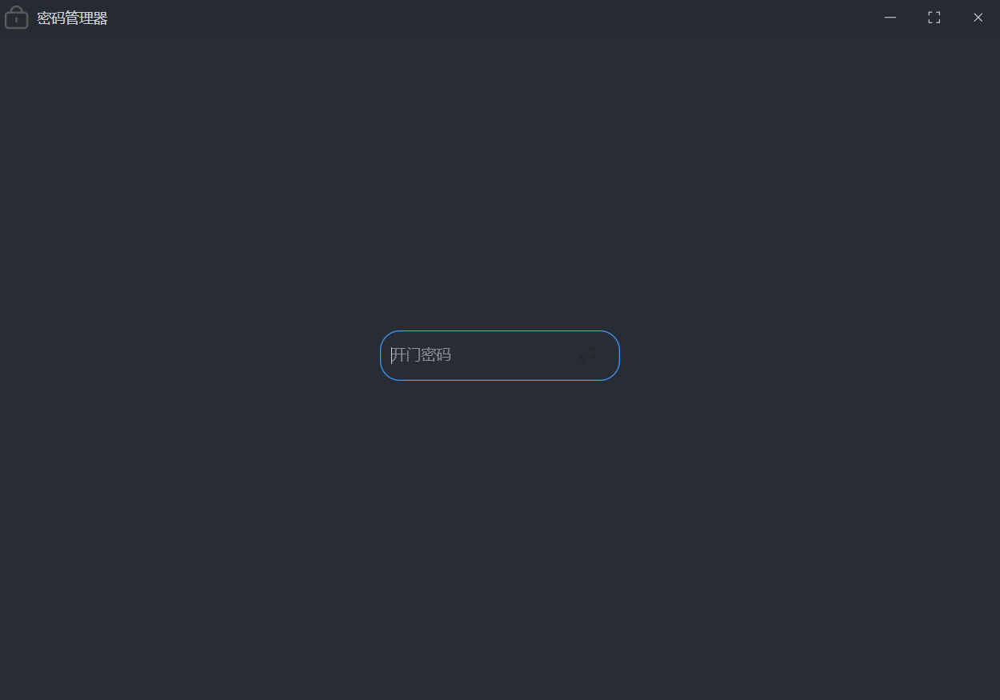
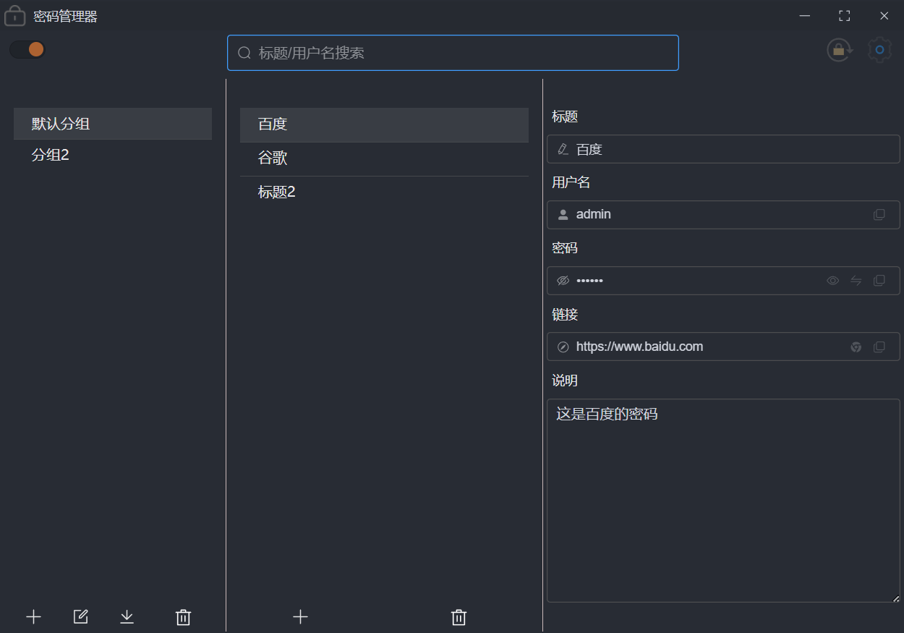
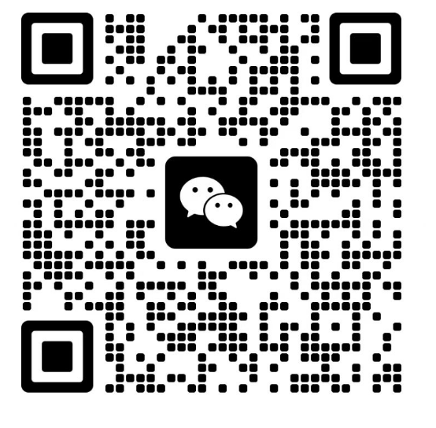

<p align="center">
	
</p>


<h1 align="center" style="margin: 30px 0 30px; font-weight: bold;">密码管理器1.0.0</h1>

# 简介

​	一直想把 手机上 和 电脑上 的密码进行同步, 但是觉得没有合适的, 于是就利用空闲时间自己开发了一套密码管理器系统.


​	本项目是通过`Electron ` 开发, 全平台适配(`win/mac/linux`),现阶段只有`pc`端, 后面会陆续更新功能以及 开发安卓端的`app`

> **注意:** 本人只在 `win` 平台下进行了充分的测试,其余两个平台如有问题,可以提 `issue`,同时也欢迎大家一起参与这个项目
>
> 本项目完全开源 , 毫无保留给个人及企业免费使用。
>
> 如果你有个性化的需求 ,  这个项目希望方便到大家. 直接上手进行二次开发

### 技术栈

​	Electron + Vue3 + Ts +  Vite5 + ElementPlus


# 免责声明

​	

- **合理使用，风险自担：**本软件旨在帮助您管理如社交媒体、邮箱等非金融类账户的密码。强烈建议避免存储涉及资金交易的重要密码，例如银行卡、支付宝及微信支付密码等。**您的安全意识是第一道防线。**
- 牢记登录密码：为保障账户安全，<font color='red'>若您遗失【密码管理器】的登录密码，当前版本暂不提供找回服务</font>。请务必妥善保管您的登录信息，这是访问您所有存储密码的唯一途径。
- 安全声明：

  ​	虽然我们持续优化软件的安全性能，但任何电子设备和网络环境都无法保证绝对安全。

  ​	使用本软件存储密码存在一定的风险，一旦发生密码泄露、丢失等情况，作者不承担任何责任。

  ​	我们鼓励用户采取多层防护措施，如定期更换密码，增加复杂度等。
- **隐私保护承诺：**【密码管理器】严格遵守隐私政策，**<font color='skyblue'>承诺不联网，不收集、不分享您的任何个人信息。您的数据仅存储于本地设备</font>，** 确保最大程度的隐私安全。


# 演示图

##  登录页




## 主界面




## 设置界面


# 软件下载地址

### 百度网盘

链接：https://pan.baidu.com/s/1cuRzhTleXLY0ttTg0knaEw?pwd=da2o
提取码：da2o

# 未来待做

## 功能

-  登录密码 MD5 加盐加密
- sqlite 数据加密 
- 鼠标拖拽的方式切换分组
- 数据同步到阿里云

## 样式

- 黑夜模式开关
- top 栏 还原 图片 不正规,改成 正常的图片


# 二次开发


##### 安装依赖

```
npm  i
```

##### 启动

```
npm run dev
```

##### 打包

```
npm run build
```


# 微信交流群

